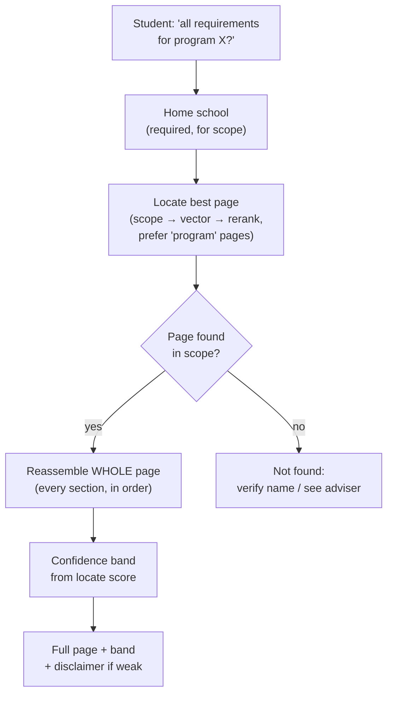

# Tool: `get_program_requirements`

> Last verified against code: 2026-06-10 (post planning-engine rebuild, PRs #35-#41).

A technical audit of the `get_program_requirements` agent tool, derived strictly from the implementation. This is the section-complete / whole-page retrieval tool that complements `search_policy`.

Primary source files:
- `packages/engine/src/agent/tools/getProgramRequirements.ts`
- `packages/engine/src/rag/sectionRetrieval.ts` (locate + reassemble helpers)
- `packages/engine/src/rag/ragScopeFilter.ts` (scope filter, reused)
- `packages/engine/src/rag/reranker.ts`, `packages/engine/src/rag/vectorStore.ts`
- `packages/engine/src/agent/tool.ts` (tool framework contract)

---

## Purpose

When a student asks for a program's **whole** requirement set — "what are *all* the requirements for the Economics major?", "lay out the entire CS minor", "show me the full College Core Curriculum" — the assistant fires this tool. Where `search_policy` returns the handful of best-matching *fragments*, this tool behaves like a human adviser pulling up the **entire bulletin page**: it finds the program's page, then reassembles every requirement section of that page, in order, and hands the agent the complete document. It tags the result with a **confidence band** (how sure it is that it located the right page) and, when the match is weak, attaches a disclaimer telling the agent to treat it as a lead rather than gospel. It is a Tier-2 (bulletin-cited estimate) source — not the authoritative DPR audit — so the agent quotes it "per the bulletin" and pairs it with `run_full_audit` when the student asks how far along *they personally* are.



---

## 1. When it fires vs `search_policy`

`get_program_requirements` answers "what does program X require, *as a whole*?" by returning the complete reassembled bulletin page rather than ranked fragments. It complements `search_policy`:

| Question shape | Tool |
|---|---|
| A program's COMPLETE requirement set (whole major/minor/Core page) | `get_program_requirements` |
| A single narrow rule, deadline, cap, or one requirement's course list | [`search_policy`](search_policy.md) |

The tool is registered through `buildTool(...)` (`getProgramRequirements.ts:59-63`), giving it the standard read-only, schema-validated, `summarizeResult`-rendered shape from `tool.ts`. It is wired into `ALL_NYUPATH_TOOLS` (`registry.ts:71`).

---

## 2. Input schema

```
get_program_requirements input:
  program: string (min length 2)
    The program / major / minor to pull the full page for,
    e.g. "Computer Science BA", "Economics minor",
    "College Core Curriculum".
```

One free-text program reference. No flags; all behavior derives from the query plus session state.

---

## 3. Session prerequisites

Checked in `validateInput` (`getProgramRequirements.ts:102-111`). The tool refuses unless **both** hold:

1. `session.rag` is populated (vector store, query embedder, reranker, optional confidence bands — there is no longer a `templates` field on the bundle) — message `"RAG corpus not loaded."`
2. `session.student` is set — the home school scopes the lookup — message `"I need your home school before I can scope a program lookup."`

It does **not** require a DPR: a program's requirement page is impersonal bulletin content, so the tool answers even before a student uploads their Degree Progress Report (the system prompt lists it among the impersonal tools available in the no-DPR branch). Catalog year is forwarded to scope but, like `search_policy`, the scope predicate ignores year (`ragScopeFilter.ts:88-91`).

---

## 4. What it reads

The `session.rag` bundle (same object `search_policy` consumes):

| Field | Use |
|---|---|
| `rag.store` (`VectorStore`) | Vector top-K during locate, and `store.listAll()` during reassembly |
| `rag.embedder` (`Embedder`) | Query embedding for the locate step. Production is `OpenAIEmbedder` (`text-embedding-3-small`); chunk vectors are precomputed |
| `rag.reranker` (`Reranker`) | Reranks the located candidates (`CohereReranker` when `COHERE_API_KEY` is set, else `LocalLexicalReranker`) |
| `rag.confidenceBands` (optional) | Overrides the high/medium thresholds for the band |

The corpus chunks already carry `meta.sourcePath`, `meta.section`, `meta.sourceLine`, `meta.chunkId`, and `meta.category` — the metadata that makes whole-page reassembly possible (see [engine/rag.md](../engine/rag.md)).

---

## 5. Algorithm

Two steps, both in `rag/sectionRetrieval.ts`:

### 5.1 Locate the page — `locateBestSource(query, opts, deps)`

1. **Scope filter** — `computeScope(query, {homeSchool, allowExplicitOverride:true})` admits `homeSchool + "all"` plus any school named literally in the query (`ragScopeFilter.ts`).
2. **Vector search** — `store.search(query, topKVector=20, scopePredicate)`.
3. **Rerank** — `reranker.rerank(query, hits)`.
4. **Soft category preference** — if any reranked candidate carries a `category` in `["program", "core_curriculum", "school_overview"]`, the pick is restricted to those; otherwise the overall best is used (no hard exclusion). This biases the result toward an actual program page over a policy chunk that merely name-drops the major.
5. Returns the winning chunk's `sourcePath`, the `topScore` (the locate confidence signal), scoped schools, and the candidate count — or `null` when nothing is in scope.

### 5.2 Reassemble the whole page — `reassembleSource(store, sourcePath)`

1. `store.listAll()` → keep every chunk whose `meta.sourcePath` matches.
2. Sort into **document order**: by `meta.sourceLine` (sections appear in file order), then by the numeric ordinal parsed from `meta.chunkId` (orders the pieces *within* an oversized section the splitter cut on token windows).
3. Render `## <heading>` + body per section. Within a section, the splitter's ~50-token inter-piece overlap is detected and stripped at the seam so the page isn't double-printed.
4. Returns a `ReassembledUnit`: `{ sourcePath, source, school, year, category, sections[], chunkCount, text, chunks[] }`.

(`reassembleSection(store, sourcePath, section)` is the same machinery scoped to one heading — it's what `search_policy` uses for its FULL SECTION block.)

---

## 6. Confidence bands

Derived from the locate `topScore` against the active bands (`rag.confidenceBands` or the defaults `CONFIDENCE_HIGH=0.6` / `CONFIDENCE_MEDIUM=0.3` from `policySearch.ts`):

| Locate score | Band | Behavior |
|---|---|---|
| `>= high` | `high` | Return the page; no disclaimer. |
| `>= medium` and `< high` | `medium` | Return the page + a `program_page_medium_confidence` disclaimer ("looks right, double-check the name"). |
| `< medium` | `low` | Return the page + a `program_page_low_confidence` disclaimer ("treat as a lead; confirm before relying on it"). |

Design choice: the tool **always returns the located page when a source was found** (an adviser still shows you the page they think you mean) but caveats hard when the match was weak. Only when the locate step finds *nothing in scope* does it return `not_found`.

This is a **Tier-2** estimate. Unlike the DPR audit (Tier-1, authoritative), the page is a bulletin citation with a confidence band; the agent surfaces it as "per the bulletin," honors the band, and pairs it with `run_full_audit` for the student's personal progress.

---

## 7. Returns shape

```
found:
  kind: "found"
  unit: ReassembledUnit {
    sourcePath, source, school, year, category,
    sections: string[], chunkCount: int, text: string, chunks: [...]
  }
  topScore: number in [0,1]
  scopedSchools: string[]
  overrideTriggered: boolean
  confidence: "high" | "medium" | "low"
  disclaimers: array of { id, text, reason }   (empty when high)

not_found:
  kind: "not_found"
  query: string
  scopedSchools: string[]
  confidence: "uncertain"
  disclaimers: [ { id: "program_page_not_found", ... } ]
```

`maxResultChars = 12000` — generous by design, because handing the agent the *complete* requirements block is the whole point (vs `search_policy`'s 6000).

---

## 8. Summary text format

**Found:**
```
PROGRAM REQUIREMENTS — FULL PAGE (confidence=<band>; scope=<schools>; override=<bool>)
Program: <source> [school=<school>, year=<year>]
Source: <sourcePath> (<n> sections reassembled)
Sections: <h1> · <h2> · …

<the complete reassembled page>

<envelope: disclaimers + confidence>
```

**Not found:**
```
PROGRAM PAGE NOT FOUND: nothing in scope (<schools>) matched "<query>".
Recommend: verify the program name or contact your academic adviser.
<envelope>
```

---

## 9. Interactions with other tools and the system prompt

- **Routing** — the system prompt (DPR-loaded ROUTING block and the no-DPR impersonal-tools list) routes "all the requirements for major X / the full Core Curriculum" to this tool, and narrow single-rule lookups to `search_policy`.
- **Pair with `run_full_audit`** — when the student asks how far along *they* are (not just what the program requires), the agent pairs the page with the authoritative DPR audit. The prompt states this explicitly.
- **Scope** — default-hard to home school + NYU-wide; naming another school (e.g. "Stern", "Tandon") admits that school's program pages via the same explicit-override mechanism `search_policy` uses.
- **UI** — the chat status line shows "Pulling the full program page" while the tool runs (`apps/web/lib/agentStatusVerbs.ts:20`).

---

## 10. Edge cases

| Case | Behavior |
|---|---|
| RAG bundle missing | `validateInput` → `{ ok:false, "RAG corpus not loaded." }` |
| No student profile | `validateInput` → `{ ok:false, "I need your home school…" }` |
| Nothing in scope matches | `kind:"not_found"`, `confidence:"uncertain"`, a `program_page_not_found` disclaimer; the summary explicitly does **not** invent requirements |
| Located a path but reassembly is empty (defensive; shouldn't happen) | `kind:"not_found"` with a reassembly-failure disclaimer |
| Weak match | Page still returned, but `low`/`medium` band + disclaimer telling the agent not to present it as authoritative |
| Oversized section on the page | Reassembled in document order with the splitter's overlap stripped at the seam |
| Page longer than 12000 chars | Truncated by the `buildTool` cap with a trailing `…` |
