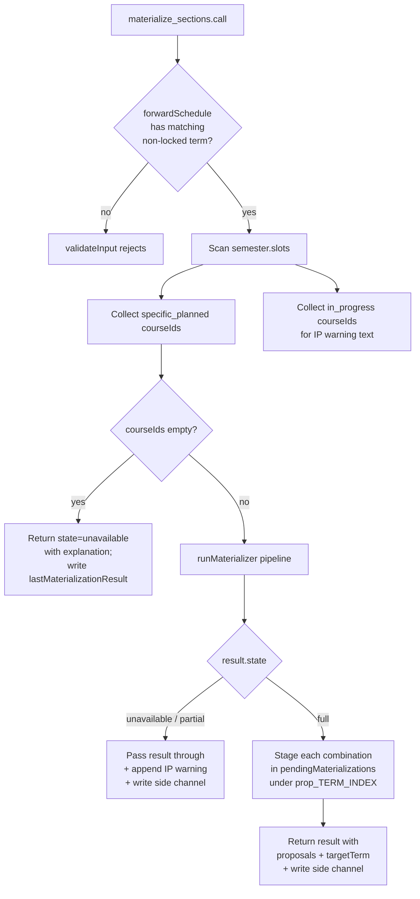
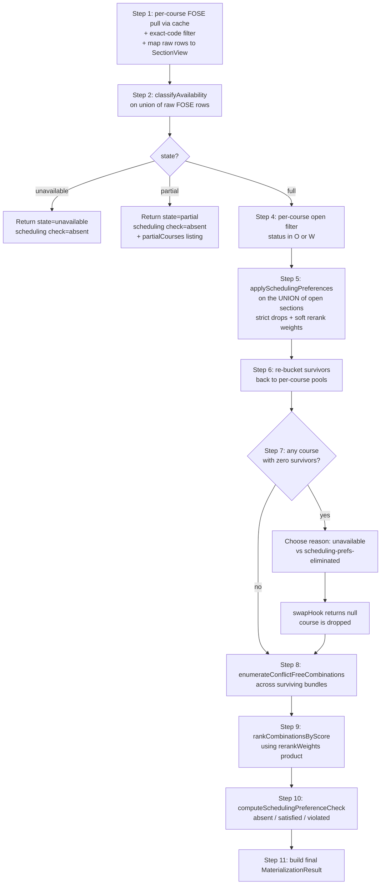

# `materialize_sections` — Section Materialization Tool

> Last verified against code: 2026-06-10 (post planning-engine rebuild, PRs #35-#41).

This tool was not touched by the Phase 0-2 solver rebuild; it is a Phase-15 tool that operates downstream of the forward schedule. The claims below were re-verified against the current source.

## TL;DR

When you've got a plan with specific courses in a future semester and you ask "what sections are actually offered for these courses?", "give me a schedule for Fall 2026 with real CRNs," or "find me a time-conflict-free combo for these classes," this tool pulls the live class-search data from NYU's FOSE service and figures out a real, registerable schedule. It looks at every specific course in the term you name, fetches the available open and waitlist sections for each, filters out anything that violates your scheduling preferences (no 8 AMs, no Friday classes, whatever you set), tries every combination of one section per course, drops any combos with time conflicts, then ranks the survivors using a re-rank weighting system. The good combinations get staged as "proposals" with deterministic IDs so you (or the agent) can pick one to actually pin into the plan via the companion tool. The tool itself doesn't change your plan — it just stages possibilities. You need an active plan, and the term you're materializing has to be a future, non-locked semester (you can't redo a past term).

```mermaid
flowchart LR
    Q[Student: real sections for Fall 2026] --> T[materialize_sections]
    T --> F[Fetch live FOSE class sections]
    F --> P[Filter by your scheduling preferences]
    P --> E[Enumerate conflict-free combinations]
    E --> R[Rank by weight product]
    R --> S[Stage each combo with a proposalId]
    S --> A[Return ranked proposals, agent presents]
    A --> C[Student picks one to confirm]
```

---

## Purpose

`materialize_sections` is the first half of a two-step write contract that turns a structural forward plan into a set of concrete, conflict-free **section-level proposals** for one non-locked future semester. It is the section-level companion to [`confirm_section_combination`](./confirm_section_combination.md), and mirrors the staging/apply shape of [`update_profile`](./update_profile.md) / [`confirm_profile_update`](./confirm_profile_update.md).

It does NOT modify the schedule. It runs an end-to-end pipeline that:

- Looks at every `kind: "specific_planned"` course in the target semester,
- Fetches the live FOSE class-search data for each of those courses (only the term you name — there is no multi-term sweep),
- Filters to open / waitlist sections,
- Applies the student's scheduling preferences (strict drops + soft re-rank weights),
- Enumerates conflict-free combinations across courses,
- Ranks combinations using a rerank-weight product,
- Stages every resulting combination under a deterministic `proposalId`, and
- Returns the orchestrator output plus the list of proposal IDs so the LLM (or a follow-up tool call) can apply one via `confirm_section_combination`.

The tool is registered as a live tool in `packages/engine/src/agent/registry.ts` (one of the 21 live tools). Defined at `packages/engine/src/agent/tools/materializeSections.ts:80-306`; the orchestrator pipeline lives in `packages/engine/src/agent/sectionMaterialization/materialize.ts:228-448`.

> **Known limitations.** The course-swap cascade (Decision #19) is a STUB: the tool's `swapHook` always returns `null` (`materializeSections.ts:198-201`), so a course wiped by "no open sections" or by a strict scheduling preference is simply dropped — no structural-plan alternative is ever substituted. Wiring `swapHook` into the structural solver's swap path is marked as deferred to Phase 16 (file-header comment at `materializeSections.ts:22-24`). A related deferral, "I-1", lives in `materialize.ts:353-377`: re-rank weights for any swapped-in alternative course are dropped, so swapped sections always score at the default weight of 1. Because the swap hook never fires today, I-1 is currently a no-op.

---

## 2. Input Schema

A single required field (`materializeSections.ts:54-62`):

| Field         | Type   | Required | Description |
|---------------|--------|----------|-------------|
| `targetTerm`  | string | yes      | Solver-format term identifier (for example `"2026-fall"`). Must match the `.term` of a non-locked semester in `session.forwardSchedule`. |

The string is passed verbatim to the orchestrator as `termCode` and to the FOSE client as the `srcdb` query parameter (see `nyuClassSearch.ts:153-175`).

---

## 3. Session Prerequisites

`validateInput` rejects the call when any of these holds (`materializeSections.ts:102-136`):

1. `session.forwardSchedule` is absent. The student is told to run `plan_forward_degree` first.
2. No semester in `session.forwardSchedule.semesters` has `.term === input.targetTerm`. The rejection message lists the available terms.
3. The matching semester has `locked === true`. Locked semesters (typically completed or in-progress historical terms) cannot be materialized.

If all three checks pass, the tool proceeds to the `call` phase.

---

## 4. What It Reads

### From `session`

- `session.forwardSchedule` — the full forward plan; the matching `semester.slots` are scanned (`materializeSections.ts:142-166`).
- `session.schedulePreferences?.schedulingPreferences` — optional `SchedulingPreferences` blob fed into the pipeline (`materializeSections.ts:203-204`).
- `session.pendingMaterializations` — a `Map<string, { termCode, sections }>` it lazily initializes before staging (`materializeSections.ts:235-237`).
- `session.lastMaterializationResult` — the side-channel slot it writes the final result into (`materializeSections.ts:189`, `:226`, `:268`).

### From the target semester's slots

Only two slot kinds are considered:

| Slot kind          | Treatment |
|--------------------|-----------|
| `specific_planned` | Its `courseId` is added to the `courseIds` list sent to the orchestrator (`materializeSections.ts:160-162`). |
| `in_progress`      | Its `courseId` is added to a separate `ipCourses` list used to compose a warning, but it is NOT sent to FOSE (`materializeSections.ts:163-165`). |

Any other slot kind (placeholders, pool-bound but unspecified slots that don't yet carry a concrete `courseId`) is silently skipped.

### From FOSE

For each `courseId` in the request, the orchestrator issues a search (via the shared TTL cache) against the public Leepfrog/FOSE endpoint:

- Endpoint: `POST https://bulletins.nyu.edu/class-search/api/?page=fose&route=search` (`nyuClassSearch.ts:144-175`).
- Payload: `{ other: { srcdb: <termCode> }, criteria: [{ field: "keyword", value: <courseId> }] }`.
- The response is filtered to **exact code matches** (`materialize.ts:215-216`) because FOSE's keyword query is a substring match.

The fields read from each FOSE row are: `code`, `title`, `crn`, `credits`, `stat`, `schd`, `no`, `meets`, `meetingTimes`, `instr`. The shape lives in `nyuClassSearch.ts:24-63`.

### From scheduling preferences

When `session.schedulePreferences?.schedulingPreferences` is present, the orchestrator runs:

- `applySchedulingPreferences` (`applySchedulingPreferences.ts:343-381`) — strict + soft pass.
- `isPrefsEmpty` (`applySchedulingPreferences.ts:193-201`) — treats undefined and `{}` identically.

---

## 5. Algorithm

The tool's `call` method is a thin orchestration layer over the materializer pipeline. The full flow:

### Step-by-step

**Step A — Slot scan (`materializeSections.ts:158-170`)**

The tool walks `semester.slots`. It builds two parallel lists, `courseIds` and `ipCourses`, then composes an `ipWarning` suffix when any IP courses exist. The warning explicitly states that FOSE-driven conflict checking cannot include pre-registered IP sections because the DPR does not carry their CRNs.

**Step B — Empty-courseIds branch (`materializeSections.ts:172-191`)**

If `courseIds` is empty (the semester has only placeholders / IP / nothing), the tool returns immediately with:

- `state: "unavailable"`,
- `schedulingPreferenceCheck: { kind: "absent" }`,
- A `message` whose wording depends on whether there were IP courses or not,
- `targetTerm` echoed back,
- A write to `session.lastMaterializationResult` with `computedAt: Date.now()`.

Nothing is staged in `pendingMaterializations` in this branch.

**Step C — Swap hook stub (`materializeSections.ts:198-201`)**

A `swapHook` is constructed as an async function that always returns `null`. The orchestrator therefore treats any course wipe as terminal (no alternative is added).

**Step D — Pipeline invocation (`materializeSections.ts:203-212`)**

The tool calls `materializeSections` (the orchestrator, in `materialize.ts:228-448`) with:
- `termCode = input.targetTerm`,
- `courseIds`,
- `swapHook`,
- `schedulingPreferences` (possibly `undefined`),
- `cache = SHARED_FOSE_CACHE` (a module-level `FoseCache<unknown[]>` so calls within a session reuse FOSE responses).

### Orchestrator pipeline (`materialize.ts:228-448`)

#### Step 1 — Fetch and map (`materialize.ts:241-258`)

For each `courseId`, the helper `fetchAndMapCourse` (`materialize.ts:198-219`) does:

1. Cache lookup keyed on `(termCode, courseId)` via `FoseCache.get` (`foseCache.ts:56-66`). If hit, skip the network call. The cache TTL is 5 minutes by default (`foseCache.ts:15`).
2. On miss, call `searchFn(termCode, courseId)` (defaults to `searchCourses` in `nyuClassSearch.ts:153-175`).
3. Cache the response under `(termCode, courseId)`.
4. Filter to rows where `row.code === courseId` (FOSE keyword search is substring; this rejects accidental matches).
5. Map each row to a `SectionView` via `mapFoseToSectionView` (`materialize.ts:104-123`), which calls `parseMeetingTimes(raw.meets ?? "", raw.meetingTimes)` (`parseMeetingTimes.ts:143-160`).

Each course's exact-matched raw rows are also reduced to `FoseSection`-shaped `{ meets, meetingTimes }` pairs for the availability gate.

#### Step 2 — Availability classification (`materialize.ts:261-263`)

`classifyAvailability` (`foseAvailabilityGate.ts:49-62`) is called on the **union** of all courses' raw FOSE rows. The classification rule:

- Zero sections in the union → `"unavailable"`.
- At least one section but fewer than 50% are parseable (either time-pattern OK or definitively asynchronous) → `"partial"`.
- 50% or more parseable → `"full"`.

A section is "parseable" if `parseMeetingTimes` returns either `{ kind: "ok" }` or `{ kind: "asynchronous" }` (`foseAvailabilityGate.ts:54-57`). Unparseable sections count against the ratio.

#### Step 3 — State branching (`materialize.ts:270-293`)

- `"unavailable"` → return immediately with `state: "unavailable"`, `schedulingPreferenceCheck: { kind: "absent" }`, and the message "FOSE has no data for `<termCode>`. Section-level info is only available closer to registration. Showing structural plan only."
- `"partial"` → return immediately with `state: "partial"`, `partialCourses` listing every course's mapped sections (before filtering), `schedulingPreferenceCheck: { kind: "absent" }`, and the message about meeting times not being fully published yet.

Both early-exit branches force `schedulingPreferenceCheck` to `"absent"` because there's nothing solid to verify preferences against.

#### Step 4 — Open filter (`materialize.ts:306-314`)

Per course, keep sections whose `status` is `"O"` or `"W"` (helper `isOpenStatus`, `materialize.ts:222-224`). The pre-filter count is preserved as `openCountBeforePrefs` so step 7 can later distinguish "no open sections at all" from "scheduling-prefs wiped them".

#### Step 5 — Scheduling-preference filter (`materialize.ts:317-318`)

The union of all open sections is run through `applySchedulingPreferences` ONCE. The function (`applySchedulingPreferences.ts:343-381`):

1. Short-circuits if `prefs` is `undefined` or `isPrefsEmpty(prefs)` is true; returns the input unchanged with no rerank weights.
2. Resolves `desiredFreeDay.day === "any"` to the weekday in M..F with the fewest meeting sections (`applySchedulingPreferences.ts:256-280`).
3. **Strict pass**: drops a section if it violates ANY strict entry — strict `avoidDays`, strict `avoidTimeWindows`, or strict `desiredFreeDay`. Each drop is recorded with a human-readable reason (`applySchedulingPreferences.ts:209-244`, `:361-369`).
4. **Soft pass**: for surviving sections, computes a multiplicative weight (`applySchedulingPreferences.ts:284-325`):
   - Soft `avoidDays` match: `× 0.7`.
   - Soft `avoidTimeWindows` match: `× 0.7`.
   - `preferTimeWindows` match: `× (1.0 + 0.5 × weight)` (boost upward).
   - `avoidConsecutiveLongBlocks` (always soft) when the section has a back-to-back chain ≥ 180 minutes spanning ≥ 2 patterns: `× 0.7`.

   Sections with no soft contribution are OMITTED from `rerankWeights` (default 1.0 is implicit).

Returns `{ surviving, rerankWeights, eliminatedByStrict }`.

#### Step 6 — Re-bucket (`materialize.ts:321-324`)

`bucketSectionsByCourse` (`materialize.ts:134-145`) puts each surviving section back into its course's bucket, preserving input course order.

#### Step 7 — Swap cascade (`materialize.ts:327-396`)

For each course:
- If at least one section survives, it becomes a `CourseBundle` in `finalBundles`.
- If zero survive:
  - The drop reason is `"unavailable"` if `openCountBeforePrefs === 0`, otherwise `"scheduling-prefs-eliminated"` (`materialize.ts:344-345`).
  - `swapHook(courseId, reason)` is called.
  - Because the tool's `swapHook` always returns `null` (`materializeSections.ts:198-201`), the course is added to `dropped` with no `altCourseId`.
  - (If a real swap were wired in, the alternative would be re-fetched, re-filtered, re-bucketed, and added as a bundle.)

#### Step 8 — Enumerate conflict-free combinations (`materialize.ts:399-401`)

`enumerateConflictFreeCombinations` (`conflictDetection.ts:85-140`) does recursive backtracking across courses. For each course it tries each section; a section is pruned if it conflicts with any already-picked section. Two patterns conflict when they share a day and overlap in half-open `[startMin, endMin)` interval terms (`conflictDetection.ts:21-37`). Boundary touches do not conflict. Asynchronous sections (empty `meetingPatterns`) never conflict.

The result is capped at `MAX_COMBINATIONS = 50` (`conflictDetection.ts:14`). If the cap is hit, `truncated: true` is returned alongside the combinations.

Each combination carries `sections` (one per surviving course) and `weeklyHours` (the total meeting time across all sections, rounded to 2 decimal places — `conflictDetection.ts:60-69`).

#### Step 9 — Rank by score (`materialize.ts:412`)

`rankCombinationsByScore` (`materialize.ts:170-187`) sorts combinations by the product of their sections' rerank weights (`scoreCombination`, `materialize.ts:154-163`). Stable sort (ties preserve enumeration order). The score itself is INTERNAL — it is used only for sort ordering and is not included in the public `combinations` shape.

#### Step 10 — Scheduling-preference verdict (`materialize.ts:415-418`)

`computeSchedulingPreferenceCheck` (`materialize.ts:467-487`):

- `prefs === undefined` OR `isPrefsEmpty(prefs)` → `{ kind: "absent" }`.
- A dropped course's reason is `"scheduling-prefs-eliminated"` → `{ kind: "violated", reason: "All sections of <courseId> were eliminated by a strict scheduling preference and the swap cascade exhausted alternatives." }`.
- Otherwise → `{ kind: "satisfied" }`.

Note: even when zero conflict-free combinations exist purely because of time conflicts (not strict-pref drops), the verdict is `"satisfied"` — the strict filter itself was respected.

#### Step 11 — Build result (`materialize.ts:421-447`)

The orchestrator returns:

- `state: "full"`,
- `semester: { term, courses, combinations, combinationsTruncated }`,
- `message`: `Found N conflict-free section combinations for <termCode>. Pick one to confirm.` (or, when N=0, `Found courses but no conflict-free combinations exist. ...`) plus an appended `droppedNote` listing any dropped courses with their reasons,
- `schedulingPreferenceCheck`.

### Back in the tool (`materializeSections.ts:217-269`)

**Non-`"full"` states**:
- Pass the orchestrator's result through with `message = result.message + ipWarning` and `targetTerm` echoed,
- Write `session.lastMaterializationResult = { ...out, computedAt: Date.now() }`,
- Return (no proposals are staged).

**`"full"` state**:
- Lazily initialize `session.pendingMaterializations` if absent (`materializeSections.ts:235-237`).
- For each combination at index `i`, create `proposalId = prop_<targetTerm>_<i+1>` and store `{ termCode, sections }` in `pendingMaterializations.set(proposalId, ...)` (`materializeSections.ts:239-252`).
- The returned `proposals` array carries `{ proposalId, sections, weeklyHours }` per combination in best-first order.
- Write `session.lastMaterializationResult = { ...out, computedAt: Date.now() }`.

---

## 6. What It Returns

The output shape is `MaterializeSectionsOutput` (`materializeSections.ts:64-78`), which extends `MaterializationResult` (`types.ts:123-145`) with two extra fields:

| Field                          | Type                                                 | When populated |
|--------------------------------|------------------------------------------------------|----------------|
| `state`                        | `"full" \| "partial" \| "unavailable"`               | always |
| `semester`                     | `MaterializedSemester`                               | only when `state === "full"` |
| `partialCourses`               | `Array<{ courseId, title, sections }>`               | only when `state === "partial"` |
| `message`                      | string                                               | always |
| `schedulingPreferenceCheck`    | `{ kind: "absent" } \| { kind: "satisfied" } \| { kind: "violated", reason }` | always populated when orchestrator runs |
| `proposals`                    | `Array<{ proposalId, sections, weeklyHours }>`       | only when `state === "full"` and at least one combination exists |
| `targetTerm`                   | string                                               | always (echoes input) |

`MaterializedSemester` (`types.ts:76-100`) carries:

- `term`: the term code.
- `courses`: per-course bundles of `{ courseId, title, sections: SectionView[] }`.
- `combinations`: `Array<{ sections: SectionView[]; weeklyHours: number }>` in best-first order.
- `combinationsTruncated`: boolean, true if the 50-combination cap was hit.

`SectionView` (`types.ts:32-74`) is the public per-section shape with `courseId`, `title`, `crn`, `credits`, `instructor`, `status`, `meetingPatterns`, `isAsynchronous`, `rawMeets`, `meetingTimes`, `schd`, `section`.

---

## 7. Envelope Behavior

- `isReadOnly: true` (`materializeSections.ts:100`). The harness still treats this as read-only at the schedule level, even though staging writes to `session.pendingMaterializations` and `session.lastMaterializationResult`.
- `maxResultChars: 4000` (`materializeSections.ts:101`). Output is truncated to 4000 characters if longer.
- `validateInput` (`materializeSections.ts:102-136`) rejects with `{ ok: false, userMessage }` when the prerequisites in section 3 fail.
- `prompt()` is a static one-liner that nudges the LLM toward the two-step contract (`materializeSections.ts:137-140`).
- `call` always resolves; it never throws on FOSE errors at this level (the underlying `searchCourses` will throw on non-2xx, which propagates up; in the current code that propagation is not caught here).

---

## 8. Summary Text Format

`summarizeResult` (`materializeSections.ts:271-305`) produces a multi-line string with the following structure:

- Header: `MATERIALIZE_SECTIONS — term: <targetTerm>, state: <state>`.
- The orchestrator's `message` verbatim (this includes any appended IP warning and dropped-course note).
- When `proposals` is non-empty:
  - A blank line.
  - `Staged N proposal(s):` where N is the number of proposals.
  - Up to the first 5 proposals, each rendered as `  • <proposalId>: <courseId>#<crn>, <courseId>#<crn>, ... (Xh/wk)` with weekly hours formatted to 2 decimal places.
  - If more than 5 exist, a `  … (M more)` line.
  - A blank line.
  - The instruction line: `To apply one, call confirm_section_combination with the chosen proposalId.`
- When `schedulingPreferenceCheck` is present:
  - A blank line.
  - `schedulingPreferenceCheck: <kind>` and, when kind is `"violated"`, ` — <reason>` appended.

---

## 9. Side-Channel Writes

`materialize_sections` writes to two session fields beyond its return value. These constitute the "side channel" used by the SSE chat route to detect that materialization ran.

### `session.pendingMaterializations`

A `Map<string, { termCode: string; sections: SectionView[] }>`. Populated only when `state === "full"`. Each entry is keyed by a deterministic `proposalId` of the form `prop_<termCode>_<1-indexed>`, where the index matches the order of `semester.combinations` (already best-first per step 9).

The map is lazy-initialized to a new empty `Map` if absent (`materializeSections.ts:235-237`). It is NOT cleared at the start of a `materialize_sections` call — if the student materializes one term, then materializes another, both terms' proposals coexist until the corresponding `confirm_section_combination` consumes them.

### `session.lastMaterializationResult`

Written on EVERY successful `call` exit path (including `unavailable`, `partial`, and `full`) — `materializeSections.ts:189`, `:226`, `:268`. The written value is `{ ...out, computedAt: Date.now() }`, i.e. the full return value plus a fresh `computedAt` timestamp.

This timestamp is the **staleness detector**: any consumer that has cached a prior `computedAt` can compare to the current value to know whether materialization re-ran. The SSE route uses exactly this pattern (see section 10).

---

## 10. Interactions With the SSE Chat Route

The SSE chat route detects materializations by reading `session.lastMaterializationResult.computedAt`. Because EVERY exit path of `materialize_sections.call` writes that field with a fresh `Date.now()`, any turn that successfully invokes the tool will produce a strictly greater `computedAt` than the previous turn's snapshot. The route compares the pre-turn vs. post-turn timestamps to decide whether to emit a `forward_materialization_update` SSE event so the sidebar can render the Sections view (full state) or the partial / unavailable banner.

The staleness detection is timestamp-based rather than "did the tool call succeed" — this matters because the route can be agnostic to which tool changed the state; it just diffs.

---

## 11. Edge Cases

### No FOSE data for the term

FOSE returns zero rows across the union of all `courseId` searches → `classifyAvailability` returns `"unavailable"` → orchestrator short-circuits with the message "FOSE has no data for `<termCode>`. Section-level info is only available closer to registration. Showing structural plan only.", `schedulingPreferenceCheck: { kind: "absent" }`, and no `semester` or `partialCourses` (`materialize.ts:270-278`). No proposals are staged. The IP warning is still appended to the message by the tool wrapper if any IP courses exist.

### All sections conflict

`classifyAvailability` says `"full"`, the open + scheduling-preferences filters leave at least one section per course, but `enumerateConflictFreeCombinations` returns zero combinations — every cross-course pick has a time conflict. The orchestrator still returns `state: "full"` and a `semester` with `combinations: []`. The message reads `Found courses but no conflict-free combinations exist. Some courses may have meeting-time conflicts that can't be resolved.` (`materialize.ts:428-431`). The verdict is `"satisfied"` (strict filter was respected) unless an unrelated course was wiped by a strict pref. No proposals are staged because the loop in `materializeSections.ts:240-252` has no iterations.

### Time-not-yet-available term (partial)

FOSE returns courses but fewer than 50% have parseable meeting times → `classifyAvailability` returns `"partial"` → orchestrator returns `state: "partial"` with `partialCourses` listing every mapped section (open + closed), `schedulingPreferenceCheck: { kind: "absent" }`, and the message "Course listings exist for `<termCode>`, but meeting times aren't fully published yet. Registration likely opens soon — come back later for sections + times." (`materialize.ts:280-293`). No proposals are staged.

### Target semester has no concrete courses

`courseIds` is empty (only placeholders and/or IP, or empty). The tool short-circuits BEFORE the orchestrator runs and returns `state: "unavailable"`. The message wording is tailored to whether IP courses exist or not (`materializeSections.ts:172-191`).

### Target semester also has IP courses

The IP courses' `courseId` strings are appended to a warning sentence that is concatenated to whatever `message` the orchestrator produces (`materializeSections.ts:167-170`, `:220`, `:261`). The warning explicitly tells the student that the conflict-free combinations DO NOT account for IP courses' meeting times because Albert holds the CRNs, not the DPR.

### Course wiped by strict preferences with no swap

`swapHook` always returns `null` in the current wiring (`materializeSections.ts:198-201`), so any course wiped by either "no open sections" or "all sections eliminated by strict preferences" is added to the `dropped` list and silently excluded from the combinations. The wiped course's reason determines whether `schedulingPreferenceCheck` becomes `"violated"` (`materialize.ts:476-484`).

### Combinations exceed the cap

When `enumerateConflictFreeCombinations` hits `MAX_COMBINATIONS = 50` (`conflictDetection.ts:14`, `:98-101`), recursion returns early and `truncated: true` is set. The truncated flag rides on the returned `MaterializedSemester.combinationsTruncated` (`types.ts:96-99`, `materialize.ts:442`). All 50 returned combinations are still staged with `proposalId`s.

### FOSE cache freshness

The cache TTL is 5 minutes (`foseCache.ts:15`). Subsequent calls within the same session for the same `(termCode, courseId)` pair within 5 minutes hit the cache and skip the HTTP call. After 5 minutes, the entry is lazily evicted on access (`foseCache.ts:60-64`) and re-fetched. Because the tool reuses a module-level `SHARED_FOSE_CACHE` (`materializeSections.ts:48`), this caching is shared across all calls in the process, not just within a single session.

### Substring-match contamination

FOSE's keyword search is substring-based — querying `"CSCI-UA 101"` could return rows whose `code` is `"CSCI-UA 1010"`. The orchestrator filters to `row.code === courseId` after the fetch (`materialize.ts:215-216`) so only exact matches make it through.
