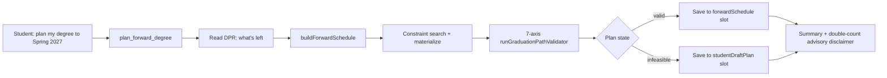
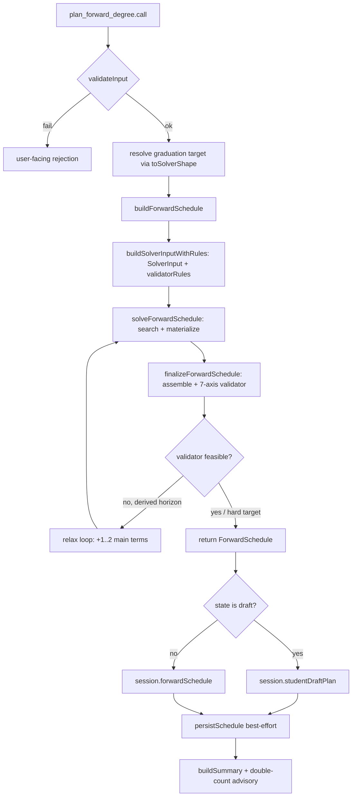
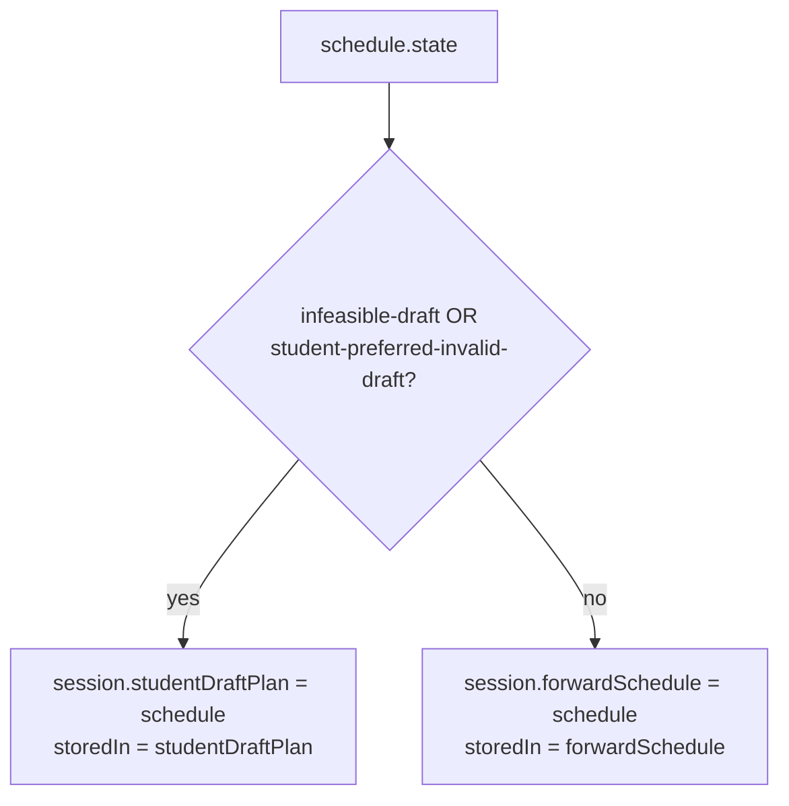

# plan_forward_degree — Technical Audit

> Last verified against code: 2026-06-19 (plan 37 — 8-axis validator: `finalizeForwardSchedule` now receives `passFailConfig` from `session.schoolConfig?.passFail` so the 8th `passFailLimitsRespected` axis fires on the build path; plan states and descriptions below still accurate).

## Purpose

When a student says "plan my degree," "build me a roadmap to graduation," or "when can I finish if I take 16 credits a term?", this is the tool that runs. The student must have a Degree Progress Report (DPR) uploaded first — without it the tool hard-refuses in `validateInput`. The tool reads the DPR, figures out every unmet requirement, and lays out a semester-by-semester schedule from the current term through the target graduation term: real courses where it can place them, placeholder slots ("free elective here," "pick one from this pool there") where the choice is still open. The student can hint a graduation target ("Spring 2027") or let the tool fall back to the one captured at onboarding, then to a credit-derived default.

The output is more than a course list: it carries a feasibility verdict from a 7-axis graduation-path validator, a plan-state label (clean, has trade-offs, or infeasible draft), a balance score, and per-course assumptions. Clean / trade-off plans are saved to the main `forwardSchedule` slot; infeasible drafts are saved separately to `studentDraftPlan` so the agent never quietly endorses a broken plan. For multi-program students the tool also attaches a **double-count advisory** as a CITED envelope disclaimer.



---

This is a technical reference for the `plan_forward_degree` agent tool. Claims below are derived from the current source; file/line references point to the source of truth. The deep mechanics of the solver and validator live in the sibling [forward-schedule subsystem audit](../engine/forward-schedule.md) — this doc covers the tool wrapper and links out for solver/validator internals.

Source: `packages/engine/src/agent/tools/planForwardDegree.ts`.

---

## 1. What the tool does

`plan_forward_degree` is a thin wrapper around `buildForwardSchedule`. Its job is:

1. Resolve the graduation target string.
2. Call `buildForwardSchedule` (which runs the constraint search and the authoritative 7-axis validator).
3. Route the returned `ForwardSchedule` to one of two session slots based on its `state`.
4. Persist the schedule (best-effort) when a `scheduleStore` is present.
5. Build a human-readable summary and attach a double-count advisory disclaimer.

The tool itself contains no scheduling logic — all placement, feasibility, and state derivation happen inside `buildForwardSchedule` / `finalizeForwardSchedule` (`forwardSchedule/build.ts`).

---

## 2. Input schema

The Zod input schema exposes exactly one optional field (`planForwardDegree.ts:78`):

```
{
  graduationTermOverride?: string   // e.g. "2027-spring", "Spring 2027", "2027 Spr"
}
```

- When `graduationTermOverride` is omitted, the tool falls back to `toSolverShape(session.graduationTarget)` (the onboarding-stated term, in display form), then to `build.ts`'s credit-derived default.
- Solver-shape strings look like `"{year}-{season}"` where season ∈ `fall | spring | summer | january`. The local `toSolverShape` helper (`planForwardDegree.ts:25`) accepts already-solver-shape (`2027-spring`), display form (`Spring 2027` / `2027 Spring`), or PeopleSoft (`2027 Spr`). Unparseable strings return `undefined` and the planner falls through to the build-time default.

---

## 3. Session prerequisites — hard-refuse without a DPR

`validateInput` runs before `call` (`planForwardDegree.ts:88`). Both checks short-circuit; neither the search nor the validator runs without them:

| Missing field | Rejection message |
| --- | --- |
| `session.degreeProgressReport` | "I need your Degree Progress Report (DPR) before I can build a forward plan. Please upload your DPR and try again." |
| `session.student` | "Student profile not loaded. Cannot build a forward plan without profile data." |

This is the DPR-first doctrine: with no DPR, the personalized planner refuses rather than guessing.

Tool contract (`tool.ts`): `isReadOnly: false` (writes a session slot), `maxResultChars: 4000`, `outputMode` defaults to `"synthesis"` (the LLM may paraphrase the summary).

---

## 4. What it reads

The tool reads four session fields directly:

| Session field | Use |
| --- | --- |
| `session.degreeProgressReport` | The mandatory DPR; passed into `buildForwardSchedule`. |
| `session.student` | Required (id, visa, home school). |
| `session.graduationTarget` (display-form string) | Fallback graduation target. |
| `session.scheduleStore` | Optional. When present (with `student`), the schedule is persisted with a DPR fingerprint. |
| `session.schoolConfig` | Read for the double-count advisory. |

Everything the search/validator reads downstream — `schoolConfig` caps, `courses`, `prereqs`, the DPR's cumulative figures, course history, and `requirementGroups` — is assembled inside `buildSolverInputWithRules` / `buildForwardSchedule`. See the [forward-schedule audit](../engine/forward-schedule.md) for that detail.

---

## 5. The build pipeline (delegated)

The tool calls `buildForwardSchedule({ session, dpr, graduationTermOverride })` (`build.ts:145`). That function is where the actual rebuild lives, and it differs fundamentally from the pre-rebuild greedy solver this doc used to describe:

- **The greedy solver is gone.** `solveForwardSchedule` is now a thin orchestration over `buildConstraintContext` → `findFirstValidPlan` (a **feasibility-first backtracking search** that returns the first valid leaf, not a single greedy pass) → `localImprove` → `materializePlan` (`solver.ts:1-60`). Diverse alternatives come from `findDiverseValidPlans`.
- **One search → one validator for every path.** `buildForwardSchedule` calls the search once, then `finalizeForwardSchedule` (`build.ts:64`) assembles the `ForwardSchedule` and runs the authoritative `runGraduationPathValidator` (now **8 axes** — 7 graduation-path axes + the plan-37 `passFailLimitsRespected` axis, fed by `passFailConfig` from `session.schoolConfig?.passFail`). The validator-derived `state` (via `derivePlanStateFromValidator`) **overrides** the solver's coarse state. This same finalize step is shared by `propose_plan_change` and `confirm_plan_change` (PLAN-3), so all build/edit paths gate on the identical 8-axis validator.
- **Add-a-term relax loop.** When the graduation term was *derived* (no student-stated target, no override) and the validator reports infeasible, `buildForwardSchedule` extends the horizon up to `MAX_HORIZON_RELAX_TERMS = 2` extra main terms, rebuilding both `solverInput` and `validatorRules` each time (`build.ts:211`). The extension is adopted only if it *achieves* validator-feasibility; otherwise the original derived-horizon result is returned with its honest binding constraints. A hard target is never silently extended.



For the 7 validator axes, plan-state derivation, balance score, workload tiers, pool binding, IP assumptions, and the placeholder / free-elective fill, see the [forward-schedule subsystem audit](../engine/forward-schedule.md).

---

## 6. Plan states

`derivePlanStateFromValidator` (`graduationPathValidator.ts:635`) is the authoritative classifier. It emits exactly three of the four `PlanState` values:

| State | Meaning |
| --- | --- |
| `valid-clean` | All 8 axes pass (plan 37: incl. `passFailLimitsRespected`); no IP assumptions, petitions, low-confidence slots, or placeholders. Safe to endorse. |
| `valid-with-trade-offs` | All 8 axes pass but there is at least one caveat (assumed-pass / requires-approval axis, IP assumption, petition, low-confidence slot, or placeholder). Endorsable with disclaimers. |
| `infeasible-draft` | At least one axis failed. Plan does not reach graduation. Stored separately so the agent never endorses it. |

The fourth state, `student-preferred-invalid-draft`, is **never** emitted by `derivePlanStateFromValidator`. It is reserved for an explicit student-override path elsewhere. `plan_forward_degree` routes it identically to `infeasible-draft` (both go to `studentDraftPlan`).

---

## 7. Session routing (Decision #32)

Routing happens at `planForwardDegree.ts:135`:



The agent never endorses an infeasible plan because it lives in a different session slot than the canonical `forwardSchedule`. `view_forward_plan` and the SSE/sidebar channel read `forwardSchedule` first; a draft is surfaced only with explicit "draft" labeling. See [view_forward_plan](view_forward_plan.md).

---

## 8. The double-count advisory (CITED disclaimer)

After routing, the tool derives a double-count advisory from the DPR + `session.schoolConfig` via `buildDoubleCountAdvisory` (`planForwardDegree.ts:173`; helper in `forwardSchedule/doubleCountAdvisory.ts`):

- Returns `null` unless the student declares ≥2 major/minor/concentration programs.
- When the school's `schoolConfig.doubleCounting` config has numeric caps/floors, the advisory is **quantified and cited** (`bulletinSource = dc.sourceRef`).
- When no quantifiable config exists, it degrades to a number-free, generic heads-up (cite-or-stop: it never asserts a number it cannot cite).

The advisory is a `Disclaimer` (`{ id: "double_count_advisory", text, reason, bulletinSource? }`). It is **advisory only** — it never affects `storedIn`, feasibility, or the schedule. `summarizeResult` (`planForwardDegree.ts:177`) appends it via `renderEnvelopeMeta`, which prints it under a `-- DISCLAIMERS YOU MUST SURFACE (verbatim) --` header that carries the reason and source. As of D3.2, `propose_plan_change`, `confirm_plan_change`, and `simulate_alternatives` carry the advisory the **same** way — as a cited `Disclaimer` on a `disclaimers[]` envelope field rendered via `renderEnvelopeMeta` — so the citation is consistent across all four tools. (Previously propose/confirm pushed the advisory's bare `text` into their consequence list and dropped the citation, and simulate omitted it entirely.)

---

## 9. What it returns

`PlanForwardDegreeOutput` (`planForwardDegree.ts:46`):

```
{
  schedule: ForwardSchedule,
  storedIn: "forwardSchedule" | "studentDraftPlan",
  summary: string,
  disclaimers?: Disclaimer[]          // the double-count advisory, when present
}
```

The `ForwardSchedule` shape (assembled in `finalizeForwardSchedule`, `build.ts:74`):

```
{
  studentId, homeSchoolId, graduationTerm,
  creditTargetPerSemester, f1Floor, domesticPartTimeFloor,
  graduationCreditMinimum, degreeCreditsMet,
  semesters: ForwardSemester[],
  dprCourseHistoryHash, computedAt,
  feasibility: FeasibilityReport,
  state: PlanState,                   // validator-derived (overrides solver's coarse state)
  balanceScore: number,
  assumptions: Assumption[],
  alternativeCandidates?: AlternativePlanSummary[],
  warnings?: string[],                // e.g. assumed-128 when DPR omits the credit minimum
  optimality?: ...                    // T7 structured optimality signal (absent ⇒ optimal)
}
```

Each `ForwardSemester` carries `term`, `slots: ScheduleSlot[]`, `plannedCredits`, `notes[]`, and a `loadRationale`. Each `specific_planned` / `placeholder` slot additionally carries rich `rationale` / `flexibility` / `downstreamImpact` / `isCriticalPath` fields (see `packages/shared/src/types.ts:931`). **The tool's summary surfaces only a fraction of these** (see §10) — the rich per-slot data is on the schedule for the route layer to consume.

---

## 10. Summary text format

`buildSummary` (`planForwardDegree.ts:187`) builds a deterministic string:

```
FORWARD DEGREE PLAN — <state-label>
Stored in: session.<forwardSchedule | studentDraftPlan>
Graduation target: <graduationTerm>
Balance score: <n.nn> (lower = better)
Degree credits met: <yes | no (plan does not reach minimum)>
Semesters planned: <count>

  <term>: <plannedCredits>cr — <slot summaries comma-separated>
    Notes: <semicolon-joined notes>          (only when notes.length > 0)
  ...repeat per semester...

Assumptions (<count>):                        (only when assumptions.length > 0)
  [IP] <courseId>: <consequenceIfFalse>       (up to 5)
  ... and <N> more                            (when count > 5)

Infeasibility: <reason>                       (only when !feasible AND reason present)

-- DISCLAIMERS YOU MUST SURFACE (verbatim) -- (only when the double-count advisory applies)
  • <advisory text>
    (reason: ...; source: ...)
```

State labels (`planForwardDegree.ts:190`):

| `schedule.state` | Label |
| --- | --- |
| `valid-clean` | "VALID (no caveats)" |
| `valid-with-trade-offs` | "VALID with trade-offs (see assumptions)" |
| `infeasible-draft` | "INFEASIBLE DRAFT (see feasibility report)" |
| `student-preferred-invalid-draft` | "STUDENT-PREFERRED DRAFT (invalid — not endorsed)" |

Per-slot rendering (`planForwardDegree.ts:205`): `specific_planned` → `"<courseId> (<credits>cr)"`; `placeholder` → `"[placeholder: <category>] (<credits>cr)"`; `completed` → `"<courseId> ✓"`; `in_progress` → `"<courseId> (IP)"`; anything else → `"(unknown)"`. The rich per-slot rationale / flexibility / downstreamImpact fields are NOT printed.

The full string is truncated to `maxResultChars = 4000` by `buildTool`'s wrapper.

---

## 11. Persistence

`planForwardDegree.ts:155`. When BOTH `session.scheduleStore` AND `session.student` are present, the tool computes `computeDprFingerprint(dpr)` (content-only) and calls `scheduleStore.persistSchedule(student.id, schedule, fingerprint)`.

Failure mode: the call is wrapped in `try/catch`. Failures emit `console.warn("[plan_forward_degree] persistSchedule failed: …")` and do **not** throw — the in-memory write is the source of truth for the turn (the same no-throw pattern as `confirm_profile_update`).

The fingerprint lets the Update-DPR route detect a meaningful re-upload by comparing fingerprints; the separate `dprCourseHistoryHash` on the schedule is used by reconciliation to decide whether to re-process slot transitions when a new DPR arrives.

---

## 12. Interactions

- **`view_forward_plan`** — the reader counterpart. The tool description directs the LLM to call it after `plan_forward_degree` to retrieve the stored plan. See [view_forward_plan](view_forward_plan.md).
- **`propose_plan_change` / `confirm_plan_change`** — edit the stored plan. They re-solve through the same `finalizeForwardSchedule` + 7-axis validator and re-route per Decision #32. See [propose_plan_change](propose_plan_change.md) and [confirm_plan_change](confirm_plan_change.md).
- **`simulate_alternatives`** — explores relaxations (summer, J-term, extend graduation) for an infeasible plan; `plan_forward_degree` does not invoke it.
- **`materialize_sections`** — the chat-route orchestrator may chain it after a fresh `forwardSchedule` write to attach real CRN candidates for the next term. The tool's only contribution is the fresh `computedAt`.

---

## Known limitations

- **Rich per-slot data is not surfaced in the summary.** `rationale`, `flexibility`, `downstreamImpact`, and `isCriticalPath` exist on every planned slot but the LLM-facing summary prints only course id / credits / kind. Surfacing them is a Phase-3 presentation gap (same gap as `view_forward_plan`).
- **Coarse solver state is discarded.** The solver still computes a coarse `state`, but it is always overridden by the validator-derived state in `finalizeForwardSchedule`. The coarse value never reaches the tool output.
- **No staleness guard on the persisted schedule.** A `persistSchedule` failure is swallowed; the live session keeps the schedule but a returning student could load a stale row if the write silently failed.

---

## File index

| Concern | File |
| --- | --- |
| Tool wrapper, input schema, summary builder | `packages/engine/src/agent/tools/planForwardDegree.ts` |
| Tool contract interfaces | `packages/engine/src/agent/tool.ts` |
| Build orchestrator + shared finalize + relax loop | `packages/engine/src/agent/forwardSchedule/build.ts` |
| Solver entry (search + materialize) | `packages/engine/src/agent/forwardSchedule/solver.ts` |
| Feasibility-first search | `packages/engine/src/agent/forwardSchedule/search.ts` |
| 7-axis validator + state derivation | `packages/engine/src/agent/forwardSchedule/graduationPathValidator.ts` |
| Double-count advisory | `packages/engine/src/agent/forwardSchedule/doubleCountAdvisory.ts` |
| Envelope / disclaimer rendering | `packages/engine/src/agent/toolEnvelope.ts` |
| Subsystem deep-dive | [`Docs/current-system/engine/forward-schedule.md`](../engine/forward-schedule.md) |
