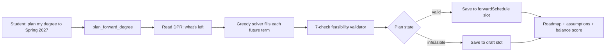
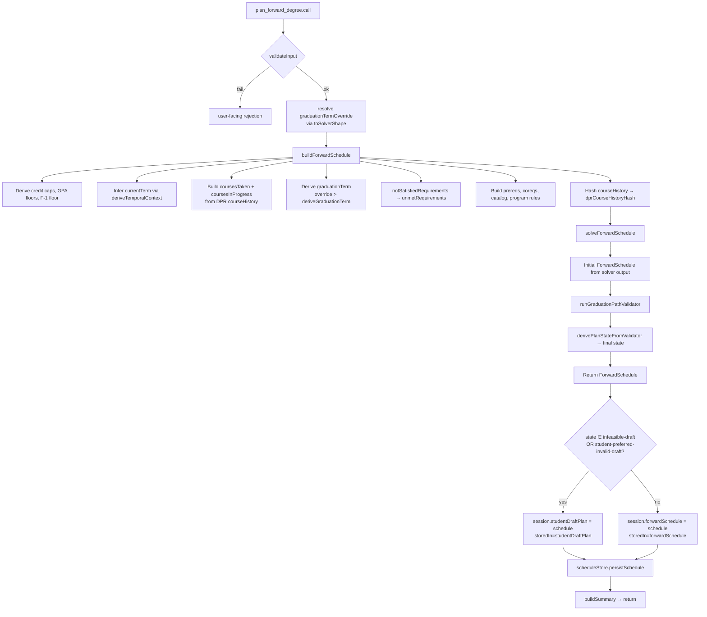
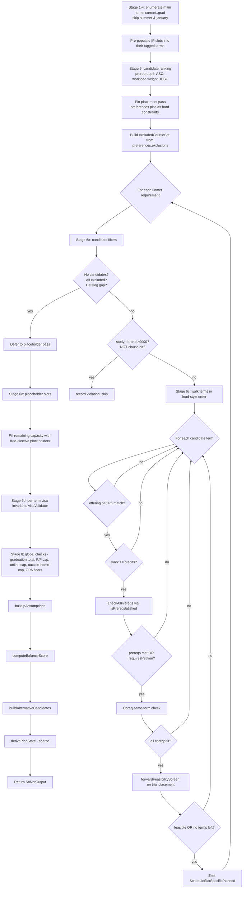
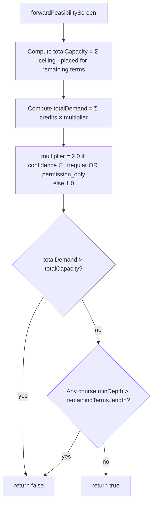
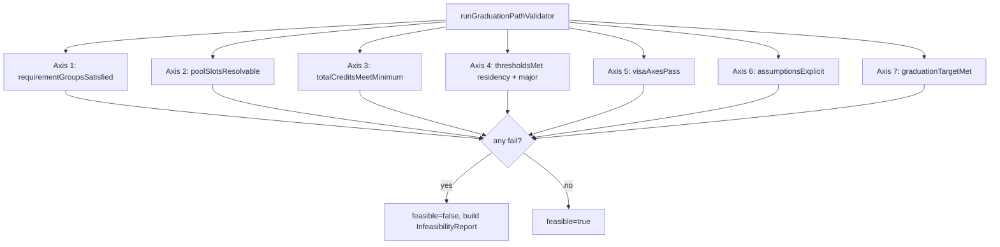
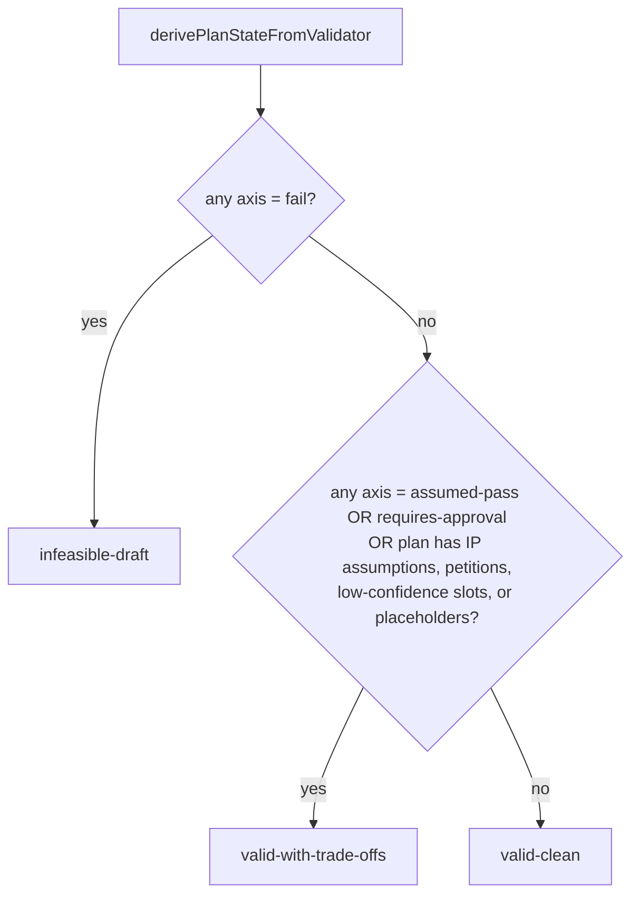

# plan_forward_degree — Technical Audit

## TL;DR

When you say something like "plan my degree," "build me a roadmap to graduation," or "what should I take from now until I finish?", this is the tool that kicks in. You need to have your Degree Progress Report uploaded first — the planner reads it to figure out what's left. It then takes every unmet requirement and lays out a semester-by-semester schedule from your current term through your target graduation term, dropping in real courses where it can and reserving placeholder slots ("free elective here," "pick one from this pool there") where the choice is still open. You can hint at your graduation target ("Spring 2027") or let it use the one from onboarding. The output is more than just a course list: it includes a feasibility verdict across seven checks (credits, residency, grade thresholds, visa rules, etc.), a plan-state label (clean, has trade-offs, infeasible draft, or you-asked-for-something-broken), a balance score, and assumptions it had to make. Clean plans get saved to your main plan slot; infeasible drafts get saved separately so the system never quietly endorses a broken plan.



---

A deep technical reference for the `plan_forward_degree` agent tool. Everything below is derived from current source code; no narrative documentation, no comments. File and line references point to the source of truth.

---

## 1. Purpose

`plan_forward_degree` is the tool the agent invokes when a student wants a full, multi-semester roadmap from "now" to graduation. It takes the student's parsed Degree Progress Report (DPR), reasons about every unmet requirement, places those requirements (or placeholder slots) into a sequence of future terms, and returns a `ForwardSchedule` that records:

- The chosen semester-by-semester course list (real courses + placeholders).
- A feasibility verdict (a 7-axis pass/fail check against degree, residency, threshold, visa, assumption-explicitness, and graduation-target rules).
- A four-valued plan state (`valid-clean`, `valid-with-trade-offs`, `infeasible-draft`, `student-preferred-invalid-draft`).
- A plan-level balance score, per-IP-course assumptions, optional alternative-candidate summaries, and slot-level rationale / flexibility / downstream-impact metadata.

The tool fronts a deterministic greedy solver and a separate validator gate; the tool itself is a thin wrapper that resolves the graduation target, runs the build pipeline, routes the result to one of two session slots based on plan state, and renders a human-readable summary for the agent.

Source: `packages/engine/src/agent/tools/planForwardDegree.ts:56`.

---

## 2. Input schema

The Zod input schema exposes exactly one field to the model. See `planForwardDegree.ts:72`.

```
{
  graduationTermOverride?: string   // e.g. "2027-spring", "Spring 2027", "2027 Spr"
}
```

- All fields are optional.
- When `graduationTermOverride` is omitted, the tool falls back to `session.graduationTarget` (onboarding-stated term, in display form), then to `build.ts`'s credit-derived default.
- Solver-shape strings look like `"{year}-{season}"` where season ∈ `fall | spring | summer | january`. The local `toSolverShape` helper at `planForwardDegree.ts:23` accepts any of: already-solver-shape (`2027-spring`), display form (`Spring 2027` / `2027 Spring`), or PeopleSoft (`2027 Spr`). Unparseable strings return `undefined` and the planner falls through to the build-time default.

---

## 3. Session prerequisites

The tool runs `validateInput` before `call`. Rejection paths (`planForwardDegree.ts:82`):

| Missing field | Rejection message returned to the user |
| --- | --- |
| `session.degreeProgressReport` | "I need your Degree Progress Report (DPR) before I can build a forward plan. Please upload your DPR and try again." |
| `session.student` | "Student profile not loaded. Cannot build a forward plan without profile data." |

Both checks short-circuit the call — neither the solver nor the build pipeline runs without them.

The Tool contract (`tool.ts:204`) also stipulates:
- `isReadOnly: false` (it writes to `session.forwardSchedule` or `session.studentDraftPlan`).
- `maxResultChars: 4000` for the `summarizeResult` output cap.
- `outputMode` defaults to `"synthesis"`, so the LLM may paraphrase the returned summary.

---

## 4. What it reads

The tool itself reads four session fields directly:

| Session field | How it is used |
| --- | --- |
| `session.degreeProgressReport` (`DegreeProgressReport`) | The mandatory DPR; passed straight into `buildForwardSchedule`. |
| `session.student` (`StudentProfile`) | Required for visa status, home school id, student id. |
| `session.graduationTarget` (display-form string) | Fallback for `graduationTermOverride` when the LLM omits it. |
| `session.scheduleStore` (`ScheduleStore`) | Optional. When present, the resulting schedule is persisted alongside a DPR fingerprint. |

`buildForwardSchedule` (`forwardSchedule/build.ts:45`) then reads many more session fields downstream:

| Field | Purpose |
| --- | --- |
| `session.schoolConfig` | Max credits per term, F-1 floor, overall GPA min, total credits required. |
| `session.courses` (`Course[]`) | Course catalog: `id → { title, credits }`. |
| `session.prereqs` (`Prerequisite[]`) | Per-course prereq groups and coreqs. |
| `session.programs` | (Not actively read in build.ts but accessible via session.) |

From the DPR (`build.ts:53–105`):

- `dpr.cumulative.creditsUsed`, `creditsRequired`, `cumulativeGpa`, `residencyUsed`, `residencyRequired`.
- `dpr.cumulative.passFailCapUnits`, `passFailUsedUnits`, `outsideHomeCapUnits`, `outsideHomeUsedUnits`.
- `dpr.courseHistory[]` — each row's `subject`, `catalogNbr`, `type` (EN/TE/IP), `grade`, `term`.
- `dpr.requirementGroups` — walked through `notSatisfiedRequirements` and `walkRequirements`.

The grade comparator `meetsGradeThreshold(grade, "D")` is used so non-standard NYU codes (`I`, `NR`, `WF`, `AU`, ...) fail closed.

---

## 5. The forward solver algorithm

### 5.1 Pipeline overview



### 5.2 Inside `solveForwardSchedule`

The solver is a single-pass greedy planner. It is broken into the stages described in `forwardSchedule/solver.ts:632`.



### 5.3 Term enumeration and the planning window

- `enumerateMainTerms(currentTerm, graduationTerm)` at `solver.ts:85` walks chronologically using `nextMainTerm`. It **only emits fall and spring** in Phase 13. Summer and January are skipped at enumeration time.
- The current term is included in the planning window. Its existing IP rows are pre-populated as `in_progress` slots (`solver.ts:682`), and the solver fills remaining slack with new placements.
- When `allFutureTerms` is empty (e.g. graduation term equals current term), the solver returns immediately with an empty feasible schedule and state `valid-clean` (`solver.ts:648`).

### 5.4 Pin-placement pass

For every entry in `input.preferences?.pins` (`solver.ts:769`), the solver pre-places the pinned course before the main requirement loop runs:

- If the pin term is not in the planning window → emits an `other` violation, skips the pin.
- If the pinned course is not in the catalog → `other` violation, skipped.
- If the offering pattern excludes the pin season → `offering_pattern` violation, skipped.
- Otherwise, the slot is built with `bindingState: "bound"`, full rationale + flexibility, and `decisionsApplied: ["D10-pinHardConstraint", "D31-pinPrecedence"]`. It is added to `plannedPlacements` so the candidate loop skips it (`solver.ts:889`).

When a course appears in both `pins` and `exclusions`, the pin wins by virtue of running first.

### 5.5 Candidate ranking (Stage 5)

`solver.ts:710`. Each `unmetRequirement` is sorted by:

1. Prereq depth of its first candidate course, ascending — `computePrereqDepths` (`solver.ts:181`) builds a max-chain depth via DFS with a cycle guard.
2. Workload weight of its first candidate course, descending — via `classifyWorkloadTier` (no rules applied during ranking).

This ensures: low-depth prereqs go first; ties go to "harder" courses so they land in earlier terms.

### 5.6 Candidate placement (Stage 6a–6c)

For each sorted requirement, the solver iterates over its `candidateCourses` and picks the first one that survives a series of filters. The filtered course then traverses `termsToTry` (`termsForPlacement`, `solver.ts:126`):

| `preferences.loadStyle` | Term iteration order |
| --- | --- |
| `frontload` | earliest first |
| `backload` | latest first (reversed) |
| `balanced` / `light` / `heavy` / undefined | earliest first (Phase 13 default) |

For each candidate term:

1. Offering pattern check — when `offerings.get(courseId)` exists and is non-empty, the term's season must be in that list.
2. Credit slack — `effectiveTermTarget(term, …) − placedCredits >= meta.credits`.
3. Prereq check via `checkAllPrereqs` → `isPrereqSatisfied`. NOT groups are skipped here (handled separately by `isExcludedByNotClause`). AND groups require all members to satisfy; OR groups require at least one. `requiresPetition` groups produce a soft-allow with `D3-petitionSoftAllow`.
4. Coreq same-term check (`solver.ts:977`). Every unmet coreq (`coursesTaken`/`coursesInProgress`/`plannedPlacements` skip the check) must fit the same term's effective cap and have a matching offering pattern. The effective cap is `min(creditCeiling, effectiveTermTarget)` so a "light" preference is honored.
5. Forward-feasibility screen — see §5.8.

If all filters pass, the solver emits a `ScheduleSlotSpecificPlanned` with full rationale + flexibility + downstreamImpact + workloadTier/weight + confidence + `isCriticalPath`. The course is recorded in `plannedPlacements` and `placedCourseSet`, then the solver moves to the next requirement.

If no term works for any candidate, the requirement is appended to `placeholderRequirements` and a `prereq_unsatisfiable` violation is recorded.

### 5.7 Effective per-term credit target

`effectiveTermTarget` (`solver.ts:159`) returns the target the slack check uses for a single term:

```
priority:
  1. preferences.creditTargetPerTerm[term]            (explicit numeric override)
  2. preferences.loadStylePerTerm[term] === "light"   → f1Floor ?? domesticPartTimeFloor ?? defaultTarget
  3. preferences.loadStylePerTerm[term] === "heavy"   → creditCeiling
  4. defaultTarget (creditTargetPerSemester, typically 16)
```

The hard ceiling (`input.creditCeiling`, default 18 from `schoolConfig.maxCreditsPerSemester`) is still enforced downstream by the credit_ceiling violation check.

### 5.8 Forward-feasibility screen

`forwardSchedule/forwardFeasibility.ts:43`. A fast O(unmet + terms) pruning heuristic invoked at every placement (Decision #27).



The screen is conservative: missing ceilings default to 0 capacity, and low-confidence courses count double against capacity. It is documented as "can produce false positives AND false negatives" — it is a heuristic, not an oracle. The real feasibility gate is the graduation-path validator (§5.13).

### 5.9 Placeholder slot pass

`solver.ts:1206`. For every requirement that could not be placed concretely (no candidates, all excluded, catalog gap, or unsatisfiable placement):

- Find the future term with the largest slack that still fits the requirement's credits.
- If no term has enough slack, force into the first future term.
- `bindingState` becomes `"placeholder-pending"` when the chosen term is the first future term, otherwise `"placeholder-deferred"`.
- `placeholderId = "REQ-{rId}"`, `workloadWeight = 0.3`, `confidence = "historically_partial"`, `isCriticalPath = true` only when the requirement had no candidates.

### 5.10 Free-elective fill (Decision #8)

`solver.ts:1289`. After all requirements (real or placeholder) are placed, each term is topped up to its `effectiveTermTarget` using 4-credit free-elective placeholders (with a partial top-off slot when the target is not a multiple of 4 — e.g. target 18 → 4+4+4+4+2):

- `optional: true` when `creditsEarned >= graduationCreditMinimum` AND current term credits are at or above the floor (`f1Floor ?? domesticPartTimeFloor ?? 0`).
- Optional slots get `decisionsApplied: ["D8-OptionalElective"]` and `optionalReason: { droppable: true }`.
- All free-elective slots use `workloadTier: "free-elective"`, `workloadWeight: 0.3`, `placeholderId: "FREE-{term}-{credits}"`.

### 5.11 Workload tier and weight

`forwardSchedule/workloadTier.ts:75`. Pure function `classifyWorkloadTier`.

Tier precedence (highest wins) — `workloadTier.ts:53`:

```
major-required  > major-elective  > school-core  > general-elective  > free-elective
```

Tier is derived from `satisfiesRules`: the highest-precedence rule kind among matching rules wins. `isOptional: true` with no rule defaults to `free-elective`.

Base weights:

| Tier | Base weight |
| --- | --- |
| major-required | 1.0 |
| major-elective | 1.0 |
| school-core | 1.0 |
| general-elective | 0.6 |
| free-elective | 0.5 |

Decision #35 modifiers stack additively, capped at +0.6:

- +0.20 — W-suffix in `courseId` OR bulletinKeywords contain `writing-intensive` / `intensive writing` / `expository writing`.
- +0.15 — L-suffix in `courseId` OR `\bLab\b` in `bulletinTitle`.
- +0.20 — Course number ≥4000 for CAS-style (`-UA`) courses; ≥3000 for Tandon (`-UY`).
- +0.20 — Capstone signal: `prereqsEntry.prereqGroups.length >= 3`.

Final weight = `baseWeight + min(sumOfModifiers, 0.6)`.

### 5.12 Visa invariants (per-term)

`solver.ts:1376` calls `visaValidator` plus `visaNotesForCredits` (`forwardSchedule/visaPolicy.ts:25`):

- `creditTargetForVisa(visa)` returns 12 for `f1`, otherwise 16.
- F-1 students below `f1Floor` (typically 12) → note about needing an OGS-approved RCL.
- Non-F-1 students at credits ∈ `[domesticPartTimeFloor, f1Floor)` → part-time enrollment note with bursar warning.
- Non-F-1 students below `domesticPartTimeFloor` (typically 8) → "not registered for standing" note.

Failed visaValidator axes record `credit_floor` violations directly on the feasibility report. Credits above `creditCeiling` add a `credit_ceiling` violation and an overload-approval note.

### 5.13 Balance score

`forwardSchedule/balanceScore.ts:45`. Plan-level scalar; lower is better.

```
score = α · variance(plannedCredits across terms)
      + β · variance(loadRationale.hardCount across terms)
      + γ · loadStyleDeviation(credits, loadStyle)

α = 1.0, β = 2.0, γ = 0.5
```

- Population variance: `mean(x²) − mean(x)²`.
- `loadStyleDeviation`:
  - `balanced` / `light` / `heavy` → 0 (per-term overrides are not penalized at plan level).
  - `frontload` → `max(0, centroid − medianTermIdx)` where centroid is credit-weighted mean term index.
  - `backload` → `max(0, medianTermIdx − centroid)`.
- `semesters.length === 0` → returns 0.

`classifyBalanceDelta(before, after)` (`balanceScore.ts:65`) classifies the delta into `improved | negligible | degraded-mild | degraded-significant` using thresholds at 0 / 1.5 / 4.

### 5.14 IP assumptions (Decision #30)

`solver.ts:571` `buildIpAssumptions`. For each course in `coursesInProgress` whose dependents (via `dependentsIndex`) include a placed course, emit one `IP_COURSE_COMPLETION` assumption with:

```
{
  type: "IP_COURSE_COMPLETION",
  courseId: <ip courseId>,
  consequenceIfFalse: "Downstream slots <list> may need to move to a later term.",
  cascadingSlots: <affected placed courses>,
  contingencyPlanAvailable: false
}
```

The contingency generator (`forwardSchedule/contingencyPlans.ts:66`) consumes these. For each IP assumption it strips the IP course from `coursesInProgress` + `coursesTaken`, appends a synthetic `ip_retake` requirement, and re-runs the solver. The result is `{ optimistic, conservatives: [{ ipCourseAssumed, plan }, …] }`. Note: `plan_forward_degree` itself does NOT invoke `generateContingencies` — that is `simulate_alternatives`' job. The optimistic plan is what the tool returns.

### 5.15 Alternative candidates (Decision #44)

`solver.ts:454`. Stage 7 is a stub that probes 5 synthetic credit distributions:

```
[16,16,16,16], [18,14,18,14], [12,20,16,16], [14,18,14,18], [20,12,16,16]
```

Each distribution is padded/trimmed to match the actual semester count. A synthetic semester array is built with fudged `loadRationale` numbers, scored via `computeBalanceScore`, and emitted as an `AlternativePlanSummary` with per-term credit / hard-count / easy-count / subject-distribution maps. Candidates whose credits fall outside `[8, 22]` per term are skipped (simplified feasibility). Results are sorted by balance score ascending and capped at 5.

These summaries are NOT full re-solves — they share the winner's slots and only redistribute credits. Petition counts and assumption counts are backfilled from the winning plan.

A separate `simulateAlternatives` helper (`forwardSchedule/alternatives.ts:39`) exists for the failure path (when the primary solve is infeasible). It re-runs the solver with three relaxations:

1. `include_summer` — set `preferences.includeSummer: true`.
2. `include_jterm` — set `preferences.includeJTerm: true`.
3. `extend_grad_one_term` — push `graduationTerm` one main term forward (`spring → fall`, `fall → next-spring`).

Each returns an `AlternativeCandidate { summary, relaxation, schedule | null, stillInfeasibleReason? }`. Capped at 3. `plan_forward_degree` does not invoke this helper directly — it is wired into the `simulate_alternatives` tool path.

### 5.16 Audit optionality

`forwardSchedule/auditOptionality.ts:49` `canDropSlot`. Not invoked by the solver directly during the placement loop, but consumed downstream (and by Phase 14 mutation tooling) to decide whether a slot is droppable. A slot is droppable iff dropping it preserves:

- Degree credit minimum.
- School-residency minimum (when set).
- Major credit minimum (when set and the slot has a major tier).
- Upper-level credit count (when set and the slot is `courseNumber >= 3000`).
- Per-affected-term F-1 floor (caller pre-computes `perTermCreditsAfterRemoval`).
- Graduation-target-term (trivially preserved).
- Forward-feasibility (caller pre-computes the screen result).

All checks accumulate into `blockingConstraints[]`; the function does not short-circuit.

### 5.17 Critical-path classification (Decision #39)

`solver.ts:375` `isCriticalPath`. True iff either:

1. The slot is the only candidate that satisfies its requirement (`candidateCourses.length === 1`), or
2. The course is the SOLE prereq for ≥2 downstream slots in the plan. "Sole prereq" means: across all prereq groups of dependent course Y (NOT clauses excluded), Y references only this single course id.

### 5.18 Graduation-path validator (Decision #41)

After the solver returns, `build.ts:218` runs the full validator (`forwardSchedule/graduationPathValidator.ts:509`). Seven axes are checked:



Each axis returns a `ValidationResult` with `status` ∈ `pass | fail | assumed-pass | requires-approval`.

| Axis | Behavior |
| --- | --- |
| `requirementGroupsSatisfied` | Uses `notSatisfiedRequirements` (drops DPR-satisfied leaves + synthetic roll-ups + dedupes parent vs leaf). For each remaining leaf rId, finds any slot whose `satisfiesRules` covers it (both `specific_planned` and `placeholder` count). If a covering slot relies on an IP course (assumption's courseId), returns `assumed-pass`. |
| `poolSlotsResolvable` | For each placeholder slot with a `poolBinding`, tracks consumed candidates per `poolId`. If a slot has no resolvable candidates left, fails. |
| `totalCreditsMeetMinimum` | `creditsEarned + Σ plannedCredits >= degreeCreditMinimum`. |
| `thresholdsMet` | Residency: `residencyUsed + planned specific/IP credits >= residencyMin`. Major: Σ credits across `specific_planned` + `placeholder` slots with tier in `{major-required, major-elective}` >= `majorCreditMinimum`. Minor and school-core thresholds are skipped (per spec the values are null in current builds). |
| `visaAxesPass` | If `feasibility.constraintViolations` contains any of `credit_floor`, `credit_ceiling`, `gpa_floor` → fail. If any semester note mentions `ogs`, `rcl`, or `cpt` → `requires-approval` (authority: OGS). |
| `assumptionsExplicit` | For each IP course in DPR `courseHistory`, if some assumption with that courseId's `cascadingSlots` overlaps planned course ids AND that courseId is NOT in `coveredByAssumptions` → fail. (Approximate; full prereq-graph walk is deferred.) |
| `graduationTargetMet` | Walk semesters chronologically, accumulating credits. First term where cumulative ≥ minimum is `completionTerm`. If never reached, fail. If `completionTerm > targetTerm`, fail. |

When any axis fails, an `InfeasibilityReport` is built with `conflictSource: "other"` and a `conflictDetail` listing the failing axes (`graduationPathValidator.ts:529`).

### 5.19 Pool binding mechanics

`forwardSchedule/poolBinding.ts`. Not directly invoked by `plan_forward_degree`, but the solver emits placeholder slots that may carry a `poolBinding`. The helper exposes:

- `placePoolSlot` — produces a `RequirementPoolSlot` with `bindingState: "unbound"`.
- `promotePoolSlotToConcrete` — converts an unbound parent placeholder + chosen course id into a `ScheduleSlotSpecificPlanned`. Validates that the parent is `placeholder-pending` or `placeholder-deferred` and that the chosen course is in candidates; otherwise returns `success: false` with `rejectedBecause` ∈ `not-in-candidates | already-promoted`.

---

## 6. Plan states

Two layers compute state:

1. The solver's coarse `derivePlanState` (`solver.ts:598`):
   - `!feasibility.feasible` → `infeasible-draft`.
   - Otherwise, if any of:
     - `assumptions.length > 0`, OR
     - any slot has `requiresPetition === true` OR `confidence ∈ {irregular, permission_only}` OR `approvalAuthority !== undefined`, OR
     - any slot is `placeholder`
     → `valid-with-trade-offs`.
   - Otherwise → `valid-clean`.

2. The validator's authoritative `derivePlanStateFromValidator` (`graduationPathValidator.ts:549`), which **overrides** the solver state in `build.ts:225`:
   - Any axis `status === "fail"` → `infeasible-draft`.
   - Any axis `status === "assumed-pass"` OR `"requires-approval"`, OR any of: IP assumptions, petition slots, low-confidence slots, placeholder slots → `valid-with-trade-offs`.
   - Otherwise → `valid-clean`.



The fourth state, `student-preferred-invalid-draft`, is NEVER emitted by `solveForwardSchedule` or `derivePlanStateFromValidator`. It is set by Phase 14 mutation logic when the student explicitly confirms a plan despite hard violations. `plan_forward_degree` routes it identically to `infeasible-draft` (both go to `studentDraftPlan`).

State semantics summary:

| State | Meaning |
| --- | --- |
| `valid-clean` | All 7 axes pass, no IP assumptions, no petitions, no low-confidence slots, no placeholders. Safe to endorse. |
| `valid-with-trade-offs` | All 7 axes pass but there is at least one caveat: assumed-pass, requires-approval, IP assumption, petition, low-confidence slot, or placeholder. Endorsable with disclaimers. |
| `infeasible-draft` | Any axis failed. Plan does not meet graduation. Stored separately so the agent never endorses it as official. |
| `student-preferred-invalid-draft` | Same routing as `infeasible-draft`. Currently not emitted by the solver/validator. |

---

## 7. What it writes to session

Routing happens at `planForwardDegree.ts:128`:

```mermaid
flowchart TD
    A[schedule.state] --> B{infeasible-draft OR<br/>student-preferred-invalid-draft?}
    B -- yes --> D[session.studentDraftPlan = schedule<br/>storedIn = "studentDraftPlan"]
    B -- no --> F[session.forwardSchedule = schedule<br/>storedIn = "forwardSchedule"]
    D --> P[persistSchedule + buildSummary]
    F --> P
```

This implements Decision #32 state-routing: the agent never endorses an infeasible plan because it lives in a different session slot than the canonical `forwardSchedule`. `view_forward_plan` and the SSE update channel read `forwardSchedule` only; the chat layer surfaces `studentDraftPlan` with explicit "draft" labeling.

`session.scheduleStore.persistSchedule` is also invoked when both `scheduleStore` and `student` are present (see §11).

---

## 8. What it returns

The tool returns a `PlanForwardDegreeOutput` (`planForwardDegree.ts:44`):

```
{
  schedule: ForwardSchedule,
  storedIn: "forwardSchedule" | "studentDraftPlan",
  summary: string
}
```

The `ForwardSchedule` carries:

```
{
  studentId, homeSchoolId, graduationTerm,
  creditTargetPerSemester, f1Floor, domesticPartTimeFloor,
  graduationCreditMinimum, degreeCreditsMet,
  semesters: ForwardSemester[],
  dprCourseHistoryHash: string,
  computedAt: number,                       // epoch ms
  feasibility: FeasibilityReport,
  state: PlanState,
  balanceScore: number,
  assumptions: Assumption[],
  alternativeCandidates?: AlternativePlanSummary[]
}
```

Each `ForwardSemester`:

```
{
  term: string,                              // "2027-spring"
  locked: false,
  slots: ScheduleSlot[],                     // specific_planned | placeholder | completed | in_progress
  plannedCredits: number,
  notes: string[],                           // visa notes, ceiling notes
  loadRationale: {
    strategy: "balanced",
    creditsTarget, slack, weightedCredits,
    hardCount, easyCount,
    alternativeDistributionsConsidered: []
  }
}
```

`FeasibilityReport`:

```
{
  feasible: boolean,                         // violations.length === 0
  infeasibilityReason?: string,
  constraintViolations: Array<{
    kind: "credit_floor" | "credit_ceiling" | "graduation_total"
        | "pass_fail_cap" | "online_credit_cap" | "outside_home_credit_cap"
        | "gpa_floor" | "not_clause" | "offering_pattern"
        | "prereq_unsatisfiable" | "other",
    course?, term?, detail
  }>,
  placementRationale: Record<courseId, string>
}
```

---

## 9. Envelope behavior

The `Tool` interface lives in `agent/tool.ts:204`. `plan_forward_degree` does not override `outputMode`, so it defaults to `"synthesis"` — the LLM is free to paraphrase the `summary` string. There is no `extractVerbatim` implementation, so no hardened verbatim is required in the model's final reply.

The validator does NOT decorate the result with explicit "disclaimers", "anchors", "follow-ups", or "confidence" fields at the tool layer — those envelope behaviors are owned by the chat route and the agent loop, which read state and feasibility off the returned schedule and decide downstream presentation. What the tool surfaces in the summary (state label, infeasibility reason, assumptions list) is the agent's primary cue for what disclaimers to attach.

Key surfaces the envelope downstream consumers read off the schedule:

- `state` — drives the "VALID" vs "DRAFT" badge.
- `feasibility.feasible` + `feasibility.infeasibilityReason` — surface infeasibility.
- `feasibility.constraintViolations[]` — per-violation explanations.
- `assumptions[]` — IP-course caveats for the agent to mention.
- `alternativeCandidates[]` (when present) — sidebar comparison.
- `semesters[].notes[]` — per-term flags (visa, ceiling, OGS/RCL/CPT).
- `semesters[].slots[].confidence`, `requiresPetition`, `approvalAuthority`, `isCriticalPath` — per-slot caveat fields.

---

## 10. Summary text format

`buildSummary` (`planForwardDegree.ts:175`) builds a deterministic string for the LLM. Structure:

```
FORWARD DEGREE PLAN — <state-label>
Stored in: session.<forwardSchedule | studentDraftPlan>
Graduation target: <graduationTerm>
Balance score: <n.nn> (lower = better)
Degree credits met: <yes | no (plan does not reach minimum)>
Semesters planned: <count>
                                                  (blank line)
  <term>: <plannedCredits>cr — <slot summaries comma-separated>
    Notes: <semicolon-joined notes>          (only when notes.length > 0)
  ...repeat per semester...
                                                  (blank line)
Assumptions (<count>):                           (only when assumptions.length > 0)
  [IP] <courseId>: <consequenceIfFalse>          (up to 5)
  ... and <N> more                                (when count > 5)
                                                  (blank line)
Infeasibility: <reason>                          (only when !feasible AND reason present)
```

State labels are:

| `schedule.state` | Label printed |
| --- | --- |
| `valid-clean` | "VALID (no caveats)" |
| `valid-with-trade-offs` | "VALID with trade-offs (see assumptions)" |
| `infeasible-draft` | "INFEASIBLE DRAFT (see feasibility report)" |
| `student-preferred-invalid-draft` | "STUDENT-PREFERRED DRAFT (invalid — not endorsed)" |

Per-slot summary formatting (`planForwardDegree.ts:193`):

| Slot kind | Rendering |
| --- | --- |
| `specific_planned` | `"<courseId> (<credits>cr)"` |
| `placeholder` | `"[placeholder: <category>] (<credits>cr)"` |
| `completed` | `"<courseId> ✓"` |
| `in_progress` | `"<courseId> (IP)"` |
| anything else | `"(unknown)"` |

The summary is truncated to `maxResultChars = 4000` by `buildTool`'s wrapper (`tool.ts:264`).

---

## 11. Persistence

`planForwardDegree.ts:149`. After routing, if BOTH `session.scheduleStore` AND `session.student` are present, the tool:

1. Computes `computeDprFingerprint(dpr)` — a content-only fingerprint (course history + cumulative + programs).
2. Calls `session.scheduleStore.persistSchedule(student.id, schedule, fingerprint)`.

Failure mode: `persistSchedule` is wrapped in `try/catch`. Failures emit `console.warn("[plan_forward_degree] persistSchedule failed: …")` and do **not** throw. The live in-memory write is the source of truth for the current turn — the same no-throw pattern used by `confirm_profile_update`.

The fingerprint enables the Update-DPR route to detect a meaningful re-upload by comparing the new DPR's fingerprint against the stored row's `dprFingerprint`. The DPR `courseHistory` hash on the schedule itself (`dprCourseHistoryHash`) is a separate value used by `reconcile.ts` to decide whether to re-process slot transitions when a new DPR arrives.

Reconciliation (`forwardSchedule/reconcile.ts:107`) is invoked elsewhere, not by `plan_forward_degree`. When triggered with a new DPR:

- Compares `hashDprCourseHistory(newDpr)` vs `schedule.dprCourseHistoryHash`. Unchanged → no-op return.
- Walks every slot:
  - `specific_planned` whose course is now completed in DPR → replace with `completed` slot (preserves `title` + `credits`; uses DPR grade or "P").
  - `specific_planned` whose course is now IP in DPR → replace with `in_progress` slot.
  - `placeholder` whose `satisfiesRules[]` rId is now satisfied (DPR `coursesUsed.length > 0`) → drop the slot.
- Recomputes `plannedCredits` per semester.
- Prunes `IP_COURSE_COMPLETION` assumptions for courses now in `completedByKey` (avoids stale "assuming X completes IP" caveats).
- Re-runs `runGraduationPathValidator` and `derivePlanStateFromValidator` to refresh `state`.

Returns `{ hashChanged, schedule, transformations: Array<{kind, term, courseId?, rId?}> }`.

---

## 12. Interactions

### 12.1 Phase 17 auto-chain to `materialize_sections`

`plan_forward_degree` itself does not call `materialize_sections`. The auto-chain is implemented in the chat route layer based on what the tool wrote into the session. The relevant signal: when the tool stores into `session.forwardSchedule` (and the chat route sees a fresh `computedAt`), the orchestrator may chain `materialize_sections` for the immediate next term to attach actual CRN candidates. The tool's only contribution is making the schedule available and emitting a fresh `computedAt` timestamp (`build.ts:210` sets `computedAt: Date.now()`).

`session.lastMaterializationResult` is populated by `materialize_sections` itself (per `tool.ts:178`) so the SSE route can detect a fresh materialization vs a fresh forward-schedule write.

### 12.2 `view_forward_plan`

`view_forward_plan` reads `session.forwardSchedule` (or `studentDraftPlan` when retrieving a draft) and renders it for the user. The tool's description explicitly directs the LLM to call `view_forward_plan` after `plan_forward_degree` to retrieve the stored plan.

### 12.3 `confirm_plan_change` and pool binding

When the student picks a concrete course for a pool placeholder, `confirm_plan_change` invokes the pool-binding helpers (`forwardSchedule/poolBinding.ts`) to splice a `ScheduleSlotSpecificPlanned` into the schedule and persists the mutation through `scheduleStore` again. `plan_forward_degree` is not involved in that flow.

### 12.4 `simulate_alternatives`

When the LLM wants to explore alternative plans (summer term, J-term, or extending graduation by one term), it calls `simulate_alternatives`, which invokes `simulateAlternatives` (`forwardSchedule/alternatives.ts:39`). That helper runs the solver up to 3 times with progressively relaxed inputs. The function note states: "Phase 13 solver's enumerateMainTerms only enumerates fall/spring … strategies 1 and 2 will call the solver and, if the solver still returns infeasible, emit a candidate with `schedule: null`. Strategy 3 (extend_grad_one_term) DOES cause the solver to enumerate an additional main term and can produce a non-null schedule."

### 12.5 IP contingency

`generateContingencies` (`forwardSchedule/contingencyPlans.ts:66`) is consumed by the simulate-alternatives flow, not by `plan_forward_degree`. It runs one solver pass per IP assumption, removing the IP course's contribution and emitting a synthetic retake requirement.

---

## 13. Edge cases

| Scenario | Behavior |
| --- | --- |
| `session.degreeProgressReport` missing | `validateInput` rejects with the DPR upload prompt. |
| `session.student` missing | `validateInput` rejects with the profile-not-loaded prompt. |
| `graduationTermOverride` malformed | `toSolverShape` returns undefined; falls back to `session.graduationTarget`, then to `build.ts`'s credit-derived default (`build.ts:292`). |
| `session.graduationTarget` missing | Falls through to credit-derived default: `semestersNeeded = ceil(creditsNeeded / 16)`, then advances fall/spring only. |
| Graduation term equals current term | `enumerateMainTerms` returns empty list → solver returns empty `valid-clean` schedule, summary shows `Semesters planned: 0`. |
| Credits earned ≥ graduation minimum | `degreeCreditsMet = true` → free-elective slots above F-1/part-time floor become `optional: true` with `optionalReason.droppable = true` and `D8-OptionalElective`. Plan can still extend to graduation target for residency reasons. |
| Below F-1 floor on any term (F-1 student) | `visaValidator.fullTimeSatisfied` fails → `credit_floor` violation → fails `visaAxesPass` axis → state `infeasible-draft` → stored in `studentDraftPlan`. Also emits a "below F-1 full-time floor — RCL required" note. |
| Above credit ceiling on any term | `credit_ceiling` violation + "Above credit ceiling … overload approval needed" note. Fails `visaAxesPass`. |
| No remaining requirements (`unmetRequirements.length === 0`) | Stage 6 candidate loop is no-op. Free-elective fill brings each term to `effectiveTermTarget`. `degreeCreditsMet` likely true → all free electives are optional. Result is typically `valid-clean` (or with-trade-offs if placeholders exist). |
| Forward-feasibility screen fails on every term | The candidate loop tries every term; if `remainingTerms.length > 0`, it continues to next term; the screen only blocks placement when it fails AND there are remaining terms to try. If no term works, the requirement falls through to placeholder. |
| Course offering pattern empty / missing | Treated as "offered every term" (the `offered.length === 0` guard at `solver.ts:958`). |
| Course not in catalog | Catalog gap → falls through to placeholder (`solver.ts:894`, decision #5 lenient). |
| Course is study-abroad (number ≥9000) | Skipped with an `other` violation (`solver.ts:899`, decision #21). |
| Course is excluded by a NOT clause hitting `coursesTaken` or `plannedPlacements` | `not_clause` violation, course not placed. |
| Course in both `preferences.pins` and `preferences.exclusions` | Pin wins (runs first and lands in `plannedPlacements`; exclusion check happens later). |
| Pin to a non-future term | `other` violation, pin skipped. |
| Pin to a season that doesn't match offering | `offering_pattern` violation, pin skipped. |
| Coreq cannot fit in same term (ceiling or offering mismatch) | The term is rejected for the dependent course; loop tries next term. |
| Catalog-absent coreq | Recorded in rationale but not hard-rejected (lenient). |
| IP row with unparseable or out-of-window term | Falls back to `currentTerm` so the row is not silently dropped (`solver.ts:683`). |
| Multiple IP rows in the same term | All placed in that term — accumulating credits and potentially triggering the credit ceiling. |
| `passFailUsed >= passFailCap` | `pass_fail_cap` violation. |
| `onlineCreditsUsed > onlineCreditCap` (when cap set) | `online_credit_cap` violation. |
| `outsideHomeCreditsUsed > outsideHomeCreditCap` | `outside_home_credit_cap` violation. |
| `cumulativeGpa < graduationGpaFloor` | `gpa_floor` violation with explicit text that "the plan does not address this." Fails `visaAxesPass` axis. |
| `majorGpa < majorGpaFloor` (when both set) | `gpa_floor` violation. |
| `scheduleStore.persistSchedule` throws | Caught; emits `console.warn`; tool returns successfully. Live session still has the schedule in memory. |
| All candidates for a requirement are in `preferences.exclusions` | Falls through to placeholder (`solver.ts:879`). |
| Catalog provides no credits for an IP course | Defaults to 4 credits (`solver.ts:687`). |
| `requirementCounter` is "units" kind with `needed` set | Uses `needed`; otherwise `required - used`; otherwise 4 (`build.ts:342`). |
| Plan never reaches `graduationCreditMinimum` within the planning window | `graduationTargetMet` axis fails with "Projected credits never reach …". |
| Plan reaches minimum but `completionTerm > targetTerm` | `graduationTargetMet` fails with "Graduation completion term <term> is after target <target>". |
| Semester notes contain "ogs", "rcl", or "cpt" | `visaAxesPass` returns `requires-approval` (authority: OGS), pushing state to `valid-with-trade-offs`. |
| Placeholder slot has no resolvable candidates left in its pool | `poolSlotsResolvable` axis fails. |
| Plan has any `placeholder` slot, any petition slot, any low-confidence slot, or any IP assumption | State becomes `valid-with-trade-offs` (provided no axis fails). |

---

## File index

| Concern | File |
| --- | --- |
| Tool wrapper, input schema, summary builder | `packages/engine/src/agent/tools/planForwardDegree.ts` |
| Tool contract interfaces | `packages/engine/src/agent/tool.ts` |
| Pipeline orchestrator (SolverInput assembly) | `packages/engine/src/agent/forwardSchedule/build.ts` |
| Greedy solver core | `packages/engine/src/agent/forwardSchedule/solver.ts` |
| Solver type definitions | `packages/engine/src/agent/forwardSchedule/types.ts` |
| Forward-feasibility screen | `packages/engine/src/agent/forwardSchedule/forwardFeasibility.ts` |
| Final validator (7 axes) + state derivation | `packages/engine/src/agent/forwardSchedule/graduationPathValidator.ts` |
| Workload tier + weight classifier | `packages/engine/src/agent/forwardSchedule/workloadTier.ts` |
| Balance score | `packages/engine/src/agent/forwardSchedule/balanceScore.ts` |
| Visa policy notes | `packages/engine/src/agent/forwardSchedule/visaPolicy.ts` |
| Audit optionality (`canDropSlot`) | `packages/engine/src/agent/forwardSchedule/auditOptionality.ts` |
| Pool binding helpers | `packages/engine/src/agent/forwardSchedule/poolBinding.ts` |
| IP contingency generator | `packages/engine/src/agent/forwardSchedule/contingencyPlans.ts` |
| Alternatives generator (failure-mode fallback) | `packages/engine/src/agent/forwardSchedule/alternatives.ts` |
| DPR reconciliation | `packages/engine/src/agent/forwardSchedule/reconcile.ts` |
