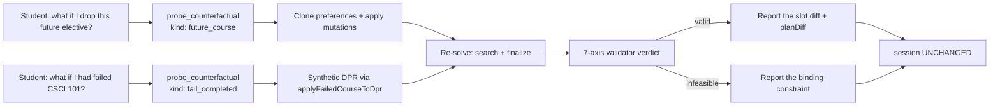
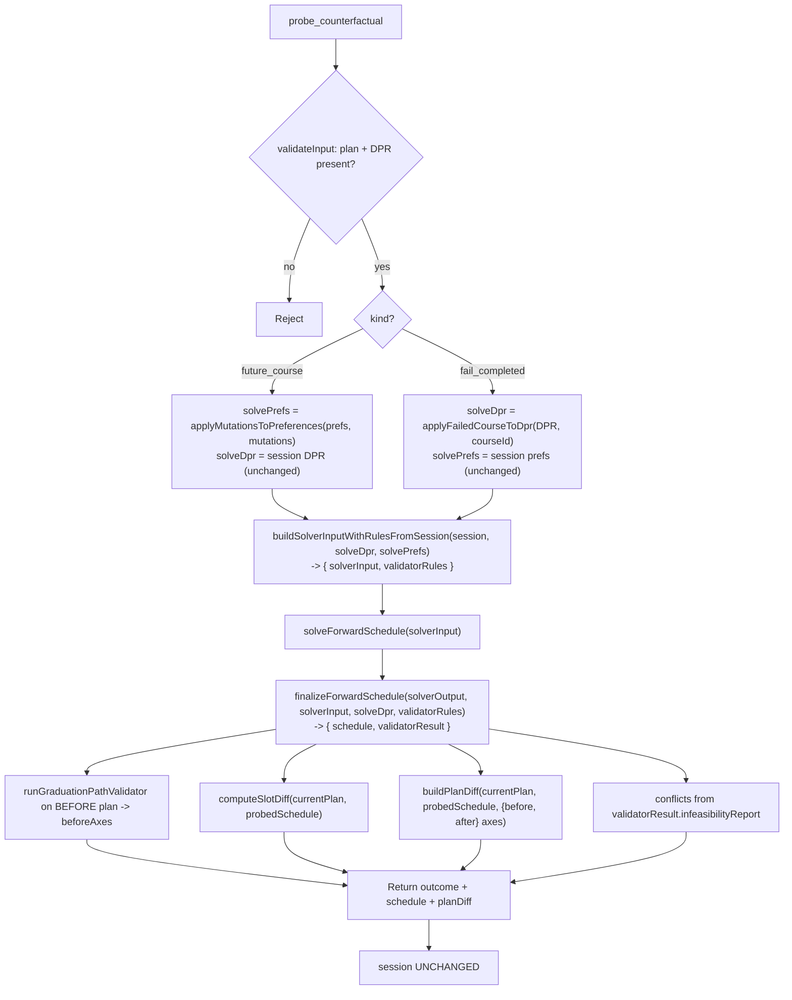

# probe_counterfactual — Technical Audit

> Last verified against code: 2026-06-11 (Phase 3 advisor — D2.1).

## Purpose

When a student asks "what happens if I drop this future elective?" or "what if I had failed CSCI-UA 101?", this tool answers **without changing their plan**. It applies the hypothetical, re-runs the planner, routes the result through the **same authoritative 7-axis validator** the build path uses, and reports either the slot diff (if the plan stays valid) or the **binding constraint** (if it becomes infeasible). It writes nothing.

It is the read-only what-if companion to [`propose_plan_change`](propose_plan_change.md). The difference: `propose_plan_change` previews edits to **future** placement (a mutation array) as the "try before you buy" half of a confirm contract; `probe_counterfactual` adds a second arm — **failing an already-completed course** — and is framed purely as an exploratory probe (there is no `confirm_counterfactual`; the student can't "apply" having failed a course).



---

Source files:
- `packages/engine/src/agent/tools/probeCounterfactual.ts`
- `packages/engine/src/agent/forwardSchedule/failCourseTransform.ts` (`applyFailedCourseToDpr` — the Arm-B synthetic-DPR transform, D2.1a)
- `packages/engine/src/agent/forwardSchedule/planChangeHelpers.ts` (`applyMutationsToPreferences`, `buildSolverInputWithRulesFromSession`, `computeSlotDiff`, `buildPlanDiff`, `PlanMutationSchema`)
- `packages/engine/src/agent/forwardSchedule/build.ts` (`finalizeForwardSchedule`)
- `packages/engine/src/agent/forwardSchedule/graduationPathValidator.ts` (`runGraduationPathValidator`, `infeasibilityReport`)
- `packages/engine/src/agent/tool.ts`

---

## 1. What it does

`probe_counterfactual` is a **read-only counterfactual**. It accepts ONE of two hypotheticals (a zod `discriminatedUnion("kind", …)`), re-solves the forward schedule against that hypothetical, routes the output through the authoritative validator, and returns:

- a feasibility verdict from the **7-axis `runGraduationPathValidator`** (not the solver's coarse flag),
- the re-solved counterfactual `schedule` (a pure preview — never persisted),
- the validator-derived `state` of that schedule,
- a slot-level before/after `diff` (vs the CURRENT plan),
- a rich `planDiff` (credit/weighted-credit deltas, workload-tier shifts, balance impact, plan-state change, per-axis validation transitions, and the real trade-off fields),
- plain-English `consequences`,
- and — when infeasible — `conflicts` carrying the **binding constraint** from the validator's `infeasibilityReport`.

It writes **nothing** to `session` — `isReadOnly: true`.

---

## 2. Input schema — two arms

```
{ kind: "future_course", mutations: PlanMutation[] }   // Arm A — min length 1
{ kind: "fail_completed", courseId: string }           // Arm B
```

The schema is a zod `discriminatedUnion("kind", …)` (`probeCounterfactual.ts`). The two arms are deliberately different shapes:

| arm | shape | models | hypothetical lives in |
|---|---|---|---|
| **A — `future_course`** | `mutations: PlanMutation[]` (min 1) | "what if I drop / swap / pin a FUTURE course?" | a **clone of `schedulePreferences`** with the mutations applied |
| **B — `fail_completed`** | `courseId: string` | "what if I had FAILED this already-COMPLETED course?" | a **synthetic DPR** (deep copy) with the course failed + its requirement re-opened |

**Arm A reuses the exact same `PlanMutationSchema`** as `propose_plan_change` / `confirm_plan_change` (`planChangeHelpers.ts:55`) — the 12-kind `PlanMutation` vocabulary (`pin`, `unpin`, `exclude`, `swap`, `move`, `addTerm`, `loadStyleOverride`, the four slot-binding no-ops, `setSchedulingPreference`, `clearSchedulingPreference`). See [propose_plan_change §2](propose_plan_change.md) for the full table.

**Arm B is NOT part of that closed mutation union.** Failing a completed course is not expressible as a `PlanMutation` — it changes the DPR, not the scheduling preferences. It is handled by the dedicated pure transform `applyFailedCourseToDpr` (see §4).

---

## 3. Session prerequisites — hard-refuse without a plan or DPR

`validateInput` (`probeCounterfactual.ts`) rejects when:

1. **No prior plan**: neither `session.forwardSchedule` nor `session.studentDraftPlan` is set → `"No forward plan exists in this session. Call plan_forward_degree first, then probe counterfactuals."`
2. **No DPR**: `session.degreeProgressReport` is absent → `"No Degree Progress Report loaded. Cannot probe counterfactuals without DPR data."`

Both mirror `propose_plan_change`'s guards — the same DPR-first doctrine: with no DPR, refuse rather than probe against guessed data.

---

## 4. The Arm-B synthetic-DPR transform (`applyFailedCourseToDpr`, D2.1a)

`applyFailedCourseToDpr(dpr, courseId)` (`failCourseTransform.ts`) returns a **deep-copied** `DegreeProgressReport` (via `structuredClone` + schema re-parse — the input `dpr` is NEVER mutated) in which:

1. Every `courseHistory` row matching `courseId` has its `grade` set to a clearly-failing `"F"`. This drops it below the pass threshold so `buildSolverInput`'s `coursesTaken` set excludes it on the next solve.
2. The course is removed from every requirement leaf's `coursesUsed[]`. For any leaf that then drops below `counter.required`, the transform flips `status` to `"not_satisfied"`, decrements `counter.used`, and recomputes `counter.needed` — so `notSatisfiedRequirements(...)` **re-includes** that requirement as unmet work the planner must re-cover.

Course-id keying matches `buildSolverInput` exactly (`${subject} ${catalogNbr}`) under `canonicalizeCourseId`, so `CSCI-UA 0101` and `CSCI-UA 101` collapse to the same id. A leaf satisfied by a DIFFERENT course is left untouched (the guard only re-opens a leaf that drops below its bar). An unmatched `courseId` returns a structurally-equal fresh copy (no-op).

The transform is **pure** — no I/O, no module state — so it is safe on the read-only path. This is also why it is unit-tested independently (`tests/agent/forwardSchedule/failCourseTransform.test.ts`).

---

## 5. The read-only re-solve seam

Both arms re-use **exactly** the seam `propose_plan_change` uses, minus the session write:



The critical invariant: **for Arm B the SYNTHETIC dpr (`solveDpr`) is passed to BOTH `buildSolverInputWithRulesFromSession` AND `finalizeForwardSchedule`.** `buildSolverInput` derives `coursesTaken` / `unmetRequirements` from the passed DPR, so the synthetic DPR flows through correctly. `session.degreeProgressReport` is never read after the transform clone and never written. The BEFORE-plan validation uses the **original** DPR (that's the world the student is in today).

None of `buildSolverInputWithRulesFromSession`, `solveForwardSchedule`, or `finalizeForwardSchedule` writes to `session` — the same property that makes `propose_plan_change` read-only.

---

## 6. Output

`ProbeCounterfactualOutput` (`probeCounterfactual.ts`) extends `PlanChangeOutcome`:

```
{
  arm: "future_course" | "fail_completed",
  feasible: boolean,                         // validatorResult.feasible (7-axis)
  diff: { added: [...], removed: [...] },     // slot diff vs the CURRENT plan
  consequences: string[],
  conflicts?: Array<{ kind, detail }>,        // from the validator's infeasibilityReport
  schedule: ForwardSchedule,                  // the re-solved counterfactual (pure preview)
  state: PlanState,                           // validator-derived state of `schedule`
  planDiff?: {                                // rich delta vs the CURRENT plan
    creditsByTermDelta, weightedCreditsByTermDelta,
    workloadTierShifts, graduationTermShift,
    balanceImpact, planStateChange?,
    newRequiresPetition, removedRequiresPetition,
    newUnmetRequirements, cascadedShifts, newAssumptions,
    validationResultsChanges
  }
}
```

**The infeasible case → the BINDING constraint, not a bare boolean.** When `!validatorResult.feasible`, `conflicts` is populated from the validator's `infeasibilityReport`:

```
conflicts = [{ kind: infeasibilityReport.conflictSource, detail: infeasibilityReport.conflictDetail }]
```

`conflictDetail` is a human-readable failing-axis + reason string (e.g. `"Axes failed: requirementGroupsSatisfied: …; graduationTargetMet: …"`). This is the solver-coarse-boolean → validator-binding-constraint upgrade that the whole 7-axis architecture exists to provide.

`schedule`, `state`, and `planDiff` are populated whenever the re-solve ran (i.e., `currentPlan` was non-null). `conflicts` is conditional on infeasibility.

---

## 7. Extension points (D2.2 / D3.1)

The output is shaped to be a clean extension surface for the rest of Phase 3:

- **D2.2 — why-not framing.** `conflicts[].detail` already carries the binding constraint verbatim. D2.2 will wrap it in a student-facing "here's why that doesn't work" summary; the structured field is in place so the framing layer doesn't have to re-derive it.
- **D3.1 — agent-reachable trade-off diff.** `planDiff` already carries `newUnmetRequirements`, `cascadedShifts`, `newRequiresPetition`, `removedRequiresPetition`, `newAssumptions`, and the per-axis `validationResultsChanges` (computed by `buildPlanDiff` + `diffPlanTradeOffs`). D3.1 reads these to surface the trade-offs of a probe directly to the agent.

---

## 8. What it writes to session

**Nothing.** `isReadOnly: true`. Arm A clones `schedulePreferences` locally and discards it; Arm B deep-copies the DPR into a synthetic copy and discards it. `forwardSchedule`, `studentDraftPlan`, `schedulePreferences`, and `degreeProgressReport` are all byte-identical before and after the call (pinned by the read-only regression test). The agent loop relies on the `isReadOnly` flag to permit speculative re-runs.

---

## 9. Envelope behavior

- `name`: `"probe_counterfactual"`.
- `isReadOnly: true`.
- `maxResultChars: 4000`; `summarizeResult` is truncated with `"…"` above the cap.

`summarizeResult` emits, by verdict:

- **VALID:** `PROBE (<arm>) — VALID — with these changes: <added/removed slots>`
- **INFEASIBLE:** `PROBE (<arm>) — INFEASIBLE — [<conflictSource>] <conflictDetail>`

…followed by a `Balance: <before> → <after> (<classification>)` line, an optional `Plan state: <from> → <to>` line, and up to 5 `• <consequence>` lines.

---

## 10. Interactions

- **`propose_plan_change`** — Arm A shares its mutation vocabulary and re-solve seam verbatim. The split: `propose_plan_change` is the preview half of a write contract (paired with `confirm_plan_change`); `probe_counterfactual` is a pure exploration with no confirm partner and adds the `fail_completed` arm.
- **`plan_forward_degree`** — strict ordering: `validateInput` rejects when no plan exists, and only `plan_forward_degree` creates one.
- **`applyFailedCourseToDpr`** — the Arm-B transform, unit-tested on its own (`failCourseTransform.test.ts`).

---

## Known limitations

- **`bindFreeElective` / `unbindFreeElective` / `bindPoolSlot` are no-ops in Arm A** (inherited from the shared `applyMutationsToPreferences` switch) — sending them changes nothing in the simulated preferences; only a consequence string flags that the binding did not take effect.
- **No confirm path.** There is intentionally no `confirm_counterfactual`: a student cannot "apply" having failed a completed course. Arm A edits to future placement should be committed via `confirm_plan_change` with the equivalent mutation array, not through this tool.
- **The "why-not" framing and the surfaced trade-off diff are not yet rendered** (D2.2 / D3.1) — the structured fields are in place but the student-facing prose layer over them lands in later Phase 3 tasks.
