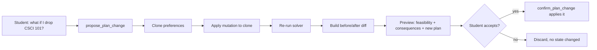
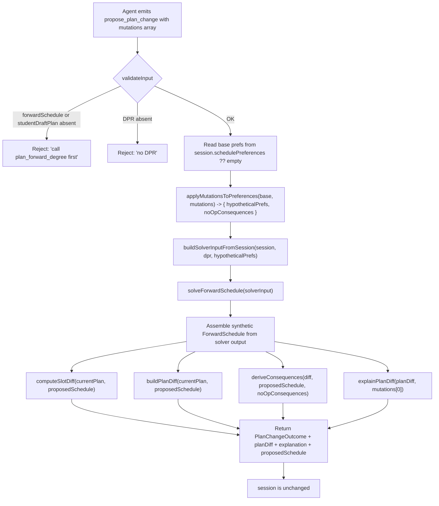
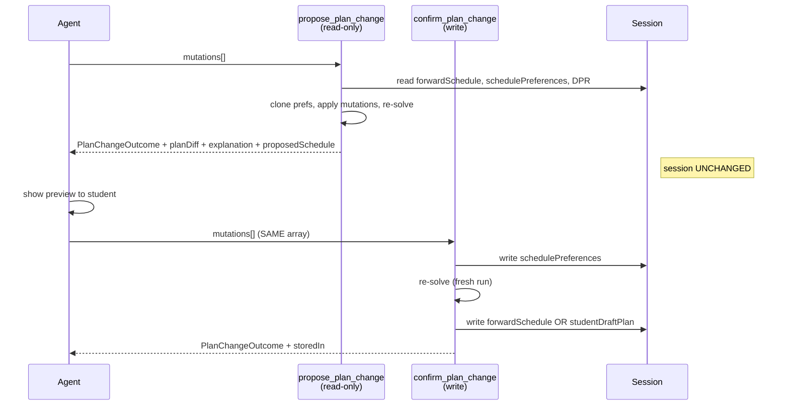

# `propose_plan_change` — Technical Audit

## TL;DR

When you ask things like "what if I drop Calc II?", "can I move CSCI 101 to Spring instead of Fall?", "what if I add a summer term?", or "swap this elective for that one," this tool gives you a preview without committing anything. It clones your scheduling preferences, applies the change you described, re-runs the planner against the clone, and shows you what would happen — the diff (what got added, what got removed, what shifted), the new feasibility verdict, credit changes per term, workload impact, and a plain-English consequence list. Importantly, this tool writes nothing. It's the "try before you buy" half of a two-step contract: you'd then call its sibling, `confirm_plan_change`, with the same change list to actually apply it. Think of it as a sandbox so the student sees exactly what would shift before they commit.



---

Source files referenced:
- `packages/engine/src/agent/tools/proposePlanChange.ts`
- `packages/engine/src/agent/forwardSchedule/planChangeHelpers.ts`
- `packages/engine/src/agent/forwardSchedule/types.ts`
- `packages/engine/src/agent/tool.ts`

---

## 1. Purpose

`propose_plan_change` is the **read-only preview** half of the two-step plan-mutation contract. It accepts one or more `PlanMutation` operations (pin a course to a term, exclude a course, swap, drag-to-move, add summer/J-term, change load style, set scheduling preferences, bind a slot, etc.), applies them to a **hypothetical clone** of `session.schedulePreferences`, re-runs the forward solver against that clone, and returns:

- a feasibility verdict for the would-be plan,
- a slot-level before/after diff,
- a list of plain-English consequence strings,
- a rich `PlanDiff` (credit deltas by term, workload-tier shifts, balance-score impact, plan-state change),
- a deterministic, English "explanation" string for the first mutation,
- the simulated post-mutation `ForwardSchedule` itself (so the route layer can render the preview without re-solving).

Crucially, it writes nothing to `session` — `isReadOnly: true` is asserted at the tool factory level (`proposePlanChange.ts:85`). The companion tool `confirm_plan_change` is the writer.

The contract is: **call `propose_plan_change` first, show the student the preview, then call `confirm_plan_change` with the same `mutations[]` to persist**.

---

## 2. Input schema

The tool accepts a single object with one field:

```
{
  mutations: PlanMutation[]   // min length 1
}
```

`PlanMutation` is the discriminated union defined at `planChangeHelpers.ts:55-94` as `PlanMutationSchema`, keyed on `kind`. Every variant the tool understands:

| `kind` | Required fields | Optional fields | Semantics |
|---|---|---|---|
| `pin` | `courseId`, `term` | `freeze?: boolean` (default `true`) | Adds `{courseId, term}` to `prefs.pins[]`, replacing any duplicate `(courseId, term)` entry. When `freeze` is explicitly `false`, the helper deliberately skips the pins write (transient placement, no solver lock). |
| `unpin` | `courseId`, `term` | — | Removes any matching `(courseId, term)` entry from `prefs.pins[]`. No-op if absent. |
| `exclude` | `courseId` | `term?` | Adds `{courseId, term?}` to `prefs.exclusions[]`. Replaces any prior entry with the same `(courseId, term)`. |
| `swap` | `drop`, `add`, `term` | — | Atomic. Excludes `drop` (keyed by courseId only — the entry stored has no term), then pins `add` at `term`. |
| `move` | `courseId`, `fromTerm`, `toTerm` | — | Atomic drag-to-move. Adds `{courseId, fromTerm}` to `prefs.exclusions[]` (dedupes by courseId). Does NOT pin into `toTerm` — that placement is the route layer's responsibility. |
| `addTerm` | `term` (string) | — | When `term` contains "summer" → sets `prefs.includeSummer = true`. When it contains "january"/"jterm"/"j-term" → sets `prefs.includeJTerm = true`. Other strings (fall/spring) are silent no-ops. |
| `loadStyleOverride` | `style` ∈ `"balanced" \| "frontload" \| "backload" \| "light" \| "heavy"` | `term?` | If `term` is given: writes `prefs.loadStylePerTerm[term] = style`, **but only** when `style` ∈ `{light, heavy, balanced}`. `frontload`/`backload` at the per-term layer emit a no-op consequence string. If `term` is absent: writes `prefs.loadStyle = style`, **but only** when `style` ∈ `{balanced, frontload, backload}`. `light`/`heavy` without a term emit a no-op consequence. |
| `bindFreeElective` | `slotId`, `courseId` | — | **No-op at preferences layer**. Emits a consequence string (the real binding lives elsewhere — Phase 14 Task 6 wiring). |
| `unbindFreeElective` | `slotId` | — | **No-op**. Consequence string only. |
| `bindPoolSlot` | `slotId`, `courseId` | — | **No-op**. Consequence string only. |
| `setSchedulingPreference` | `value: SchedulingPreferencesSchema` | — | Replaces `prefs.schedulingPreferences` with `value`. The schema (defined `planChangeHelpers.ts:31-47`, `passthrough()`) admits `avoidDays`, `avoidTimeWindows`, `preferTimeWindows`, `desiredFreeDay`, `avoidConsecutiveLongBlocks` plus any extra fields. |
| `clearSchedulingPreference` | — | — | Deletes `prefs.schedulingPreferences`. |

Mutations are applied **left-to-right** by `applyMutationsToPreferences` (`planChangeHelpers.ts:117-301`). Later mutations override earlier ones for the same field. The TypeScript `default: never` branch at line 286 enforces exhaustiveness — any new kind added without a switch arm fails to compile.

---

## 3. Session prerequisites and `validateInput` behavior

`validateInput` runs **before** `call` (`proposePlanChange.ts:87-104`). It rejects the call when:

1. **No prior plan**: neither `session.forwardSchedule` nor `session.studentDraftPlan` is set →
   `"No forward plan exists in this session. Call plan_forward_degree first, then propose changes."`
2. **No DPR**: `session.degreeProgressReport` is absent →
   `"No Degree Progress Report loaded. Cannot simulate plan changes without DPR data."`

Both conditions short-circuit with `{ ok: false, userMessage }` — the tool does not run.

If both checks pass, `validateInput` returns `{ ok: true }` and `call` proceeds.

---

## 4. What it reads from session

Inside `call` (`proposePlanChange.ts:109-190`), the tool reads:

- `session.degreeProgressReport` — non-null after validation.
- `session.forwardSchedule` first, falling back to `session.studentDraftPlan` (`proposePlanChange.ts:111`). This becomes the **"current plan"** baseline for the diff.
- `session.schedulePreferences` — the base preferences the mutations are layered on top of. Defaults to `{}` when undefined (line 124).
- `session.student`, `session.schoolConfig`, `session.prereqs`, `session.courses` — all consumed indirectly via `buildSolverInputFromSession` (`planChangeHelpers.ts:315-427`) to assemble the `SolverInput`.

It does NOT read or touch `session.studentDraftPlan` for writing, nor `session.pendingMutations` or `session.scheduleStore`.

If — after the validation passes — both schedule fields are somehow missing at `call` time (defensive guard at lines 113-121), the tool returns an early infeasible outcome with conflict kind `"no_plan"` and skips the solver entirely.

---

## 5. Algorithm



### Step-by-step

**Step 1 — Clone preferences.** `applyMutationsToPreferences` (`planChangeHelpers.ts:117-301`) starts by **deep-shallow-cloning** the base object: spread the top-level, then clone each known array/record field (`pins`, `exclusions`, `loadStylePerTerm`, `creditTargetPerTerm`) so subsequent pushes never touch the caller's data. The function returns `{ prefs, noOpConsequences }`. The `noOpConsequences` array accumulates messages from mutations the helper deliberately did not apply — the slot-binding kinds, ill-formed `loadStyleOverride` combinations.

**Step 2 — Build the solver input.** `buildSolverInputFromSession` (`planChangeHelpers.ts:315-427`) constructs a fresh `SolverInput` from the session + DPR, **overriding** the `preferences` field with the hypothetical prefs from Step 1. Notable derivations inside:
- `currentTerm` is inferred from the DPR's most recent IP row (`inferCurrentTermFromDpr`, line 663-671); falls back to `"2026-fall"`.
- `graduationTerm` is derived via `deriveGraduationTermFromCredits` (line 687-706): `ceil((minimum − earned) / 16)` semesters forward, walking fall↔spring (summer/january normalize to fall/spring).
- `coursesTaken` is built from DPR rows that pass `meetsGradeThreshold(row.grade, "D")`. `coursesInProgress` is keyed off `row.type === "IP"`, preserving each row's own term to avoid the historical "28-credit phantom term" bug.
- `unmetRequirements` comes from `notSatisfiedRequirements(dpr.requirementGroups)` and is enriched with `candidateCourses` parsed by regex `/\b([A-Z][A-Z0-9]*-[A-Z]{2,3})\s+(\d{1,4}[A-Z]?)\b/g` (line 708).
- `programRules` are inferred from leaf requirement titles by `buildProgramRulesFromSession` (line 740-775): "major"/"concentration" → `majorRuleKinds` (with "required" → `must_take`, else `choose_n`), "core"/"cas core" → `schoolCoreRuleIds`, everything else → `generalCategoryRuleIds`.
- `dprCourseHistoryHash` is computed by `hashDprCourseHistory(dpr)`.

**Step 3 — Re-solve.** `solveForwardSchedule(solverInput)` returns a `SolverOutput` (`types.ts:162-173`) containing `semesters[]`, `feasibility`, `balanceScore`, `state` (the Decision #32 four-state classifier), `assumptions`, and optionally `alternativeCandidates`.

**Step 4 — Assemble synthetic `ForwardSchedule`.** `proposePlanChange.ts:137-160` builds a `ForwardSchedule` shape:
- `studentId`, `homeSchoolId` copied from `currentPlan`.
- `graduationTerm`, `creditTargetPerSemester`, `f1Floor`, `domesticPartTimeFloor`, `graduationCreditMinimum`, `dprCourseHistoryHash` copied from `solverInput`.
- `degreeCreditsMet` = `(dpr.cumulative.creditsUsed ?? 0) + sum(plannedCredits across semesters) >= (dpr.cumulative.creditsRequired ?? 128)`.
- `semesters`, `feasibility`, `state`, `balanceScore`, `assumptions` taken from `solverOutput`.
- `computedAt` = `Date.now()`.
- `alternativeCandidates` is conditionally spread only when defined.

This shape is what the tool ships back as `proposedSchedule`. It is NOT routed through any persistence path.

**Step 5 — Compute the slot diff.** `computeSlotDiff` (`planChangeHelpers.ts:437-461`) builds a stable key map from each schedule's slots and emits `{added, removed}`. The key (`slotKey`, line 476-484) is:
- `"<term>::<kind>::<courseId>"` for `specific_planned`, `completed`, `in_progress`.
- `"<term>::placeholder::<placeholderId>"` for `placeholder` slots.
- `"<term>::unknown"` otherwise.

A slot is "added" if it appears in the post-mutation schedule and not the pre. "Removed" if it appears in the pre but not the post. Slots that match on key (same term, same course, same kind) are considered unchanged and ignored.

**Step 6 — Derive consequences.** `deriveConsequences` (`planChangeHelpers.ts:494-533`) concatenates:
1. The `noOpConsequences` from Step 1 (e.g., "bindFreeElective is a no-op", "frontload at per-term is a no-op").
2. A feasibility verdict: either `"Plan remains feasible after mutation."` OR `"Plan is infeasible after mutation: <reason>"` plus up to 3 lines `"Conflict (<kind>): <detail>"`.
3. An `"Added: course → term, …"` line if any slots were added.
4. A `"Removed: course (was in term), …"` line if any slots were removed.

**Step 7 — Build the rich `PlanDiff`.** `buildPlanDiff` (`planChangeHelpers.ts:546-638`) computes:
- `creditsByTermDelta: Record<term, number>` — `(after.plannedCredits - before.plannedCredits)` for each term, omitting zero-deltas.
- `weightedCreditsByTermDelta: Record<term, number>` — same idea over `loadRationale.weightedCredits`.
- `workloadTierShifts: Array<{term, before:{hardCount, easyCount, weightedCredits}, after:{...}}>` — only emitted when both sides have a `loadRationale` AND any of the three fields changed.
- `graduationTermShift: number` — signed semester distance via `termDelta` (line 653-661): years × 4 + season ord (spring=0, summer=1, fall=2, january=3). A positive value means graduation moved later.
- `balanceImpact: { before, after, delta, classification }` — `computeBalanceScore(semesters, "balanced")` on each side, classified by `classifyBalanceDelta`. When `before` is absent, the before-score falls back to `after.balanceScore`.
- `planStateChange?: { from, to }` — populated only when `before.state !== after.state`.
- `newRequiresPetition`, `removedRequiresPetition`, `newUnmetRequirements`, `cascadedShifts`, `newAssumptions`, `validationResultsChanges` — all returned **empty** by this builder (the data they would carry isn't materialized at the helper layer).

**Step 8 — Build the conflicts array.** Read directly off `solverOutput.feasibility.constraintViolations`, mapped to `{ kind: v.kind, detail: v.detail }`. If empty, the `conflicts` field is omitted from the response (line 185: `conflicts: conflicts.length > 0 ? conflicts : undefined`).

**Step 9 — Render the explanation.** `explainPlanDiff(planDiff, mutations[0])` is called with **only the first** mutation in the batch (line 178-179). The result is a deterministic, English template; the route layer can re-invoke `explainPlanDiff` per-mutation if it needs more.

### Credit deltas, term moves, infeasibility detection

- **Credit deltas** are computed by enumerating the union of `before` terms and `after` terms (line 562-565) and subtracting `plannedCredits`. A mutation that shifts a 4-credit course from `2026-fall` to `2027-spring` produces `{ "2026-fall": -4, "2027-spring": +4 }`.
- **Term moves** show up as both slot additions (in the new term) and slot removals (in the old). The `move` mutation is the explicit primitive; `swap` produces removals via the exclusion + additions via the pin.
- **Infeasibility detection** is delegated entirely to the solver: `solverOutput.feasibility.feasible: boolean` plus `infeasibilityReason: string | undefined` plus `constraintViolations: Array<{kind, detail}>`. The tool faithfully forwards all three: `feasible` to the top-level outcome, the reason to a consequence line, and the violations to both the `conflicts` array and (truncated to 3) the consequences.

---

## 6. What it returns

The output type is `ProposePlanChangeOutput` (`proposePlanChange.ts:36-64`) which extends `PlanChangeOutcome`:

```
{
  feasible: boolean,
  diff: {
    added:   Array<{ term: string, slot: ScheduleSlot }>,
    removed: Array<{ term: string, slot: ScheduleSlot }>
  },
  consequences: string[],
  conflicts?: Array<{ kind: string, detail: string }>,
  planDiff?: {
    creditsByTermDelta:           Record<term, number>,
    graduationTermShift:          number,
    newRequiresPetition:          [],
    removedRequiresPetition:      [],
    newUnmetRequirements:         [],
    cascadedShifts:               [],
    weightedCreditsByTermDelta:   Record<term, number>,
    workloadTierShifts:           Array<{term, before, after}>,
    balanceImpact: { before: number, after: number, delta: number, classification: string },
    newAssumptions:               [],
    validationResultsChanges:     {},
    planStateChange?: { from: PlanState, to: PlanState }
  },
  explanation: string,
  proposedSchedule?: ForwardSchedule
}
```

`explanation` is always populated. `planDiff` and `proposedSchedule` are always populated when the solver runs (i.e., when `currentPlan` was non-null at line 113). `conflicts` is conditionally present.

The `proposedSchedule` field is a **pure preview**: it is what would be stored if the student confirmed. The route layer can read it directly without re-running the solver via a confirm-on-a-clone-session pattern.

---

## 7. The two-step `pendingMutationId` contract (and why this tool has no id)

The two-step write pattern used in this codebase has two flavours:

1. **`pendingMutations` map** — used by `update_profile` / `confirm_profile_update` (see `ToolSession.pendingMutations` in `tool.ts:63`) and by `materialize_sections` / `confirm_section_combination` (`ToolSession.pendingMaterializations` in `tool.ts:155`). The "propose" call stages a record by id; the "confirm" call applies the staged record by id.
2. **Stateless replay** — used here. `propose_plan_change` stages **nothing** in the session. The caller must replay the exact same `mutations[]` array on `confirm_plan_change` to commit.

The `proposePlanChange.ts` source contains no reference to a pending-mutation map, and no id is generated or returned. The route layer is responsible for echoing `mutations[]` through to confirm.

**Implication**: there is no server-side staleness guard between propose and confirm. If session state changes between calls (e.g., the DPR is reloaded, another tool mutates `schedulePreferences`), the confirm will re-solve against the newer state and may produce a different outcome than the preview the student saw. The propose result and the confirm result are independent solver runs.



---

## 8. What `propose_plan_change` writes to session

**Nothing.** `isReadOnly: true` (line 85). The tool reads `session.schedulePreferences`, clones it locally, mutates the clone, and discards the clone after the response is returned. No persistence call is made; `session.scheduleStore`, `session.forwardSchedule`, `session.studentDraftPlan`, `session.schedulePreferences` are all untouched.

This invariant is critical: the agent loop relies on `isReadOnly` to decide whether to permit speculative re-runs. If a future change adds any session write inside `call`, the `isReadOnly` flag must flip and the contract changes.

---

## 9. Envelope behavior

The tool envelope is constructed by `buildTool` (`tool.ts:239-271`):

- `name`: `"propose_plan_change"`
- `description`: the long-form string at `proposePlanChange.ts:73-80` ("Preview the effect of one or more plan mutations WITHOUT committing them. Returns a PlanChangeOutcome … Use this BEFORE calling confirm_plan_change. … isReadOnly: true").
- `inputSchema`: the Zod object `{ mutations: array(PlanMutationSchema).min(1) }`. Validation errors throw before `validateInput` runs.
- `isReadOnly`: `true`.
- `maxResultChars`: `4000`. The `summarizeResult` output is truncated with `"…"` when it exceeds the cap (`tool.ts:265-267`).
- `outputMode`: defaults to `"synthesis"` (no `outputMode` set in the tool def) — the LLM freely synthesizes a final reply from the `summarizeResult` text. No `extractVerbatim` is supplied.
- `validateInput`: as described in §3.
- `prompt`: returns the static string `"Preview plan mutations before committing. Returns feasibility + consequence strings + rich planDiff. Use before confirm_plan_change so the student can see what would change."`.

---

## 10. Summary text format

`summarizeResult` (`proposePlanChange.ts:191-216`) emits a multi-line string. The order is fixed:

1. Header: `PROPOSE PLAN CHANGE — feasible: <true|false>`
2. If `conflicts` non-empty:
   - `Conflicts (<n>):`
   - Up to 3 lines: `  [<kind>] <detail>`
3. `Added slots: <n>, removed slots: <m>`
4. If `consequences` non-empty:
   - `Consequences:`
   - Up to 5 lines: `  • <consequence>`
5. If `planDiff` present:
   - `Balance: <before:.2f> → <after:.2f> (<classification>)`
   - If `planStateChange` present: `Plan state: <from> → <to>`

The full multi-line string is then truncated at 4000 chars by the envelope wrapper.

Note: the rich `planDiff.creditsByTermDelta`, `weightedCreditsByTermDelta`, `workloadTierShifts`, and the `explanation` string are **not** included in the model-facing summary. The route layer must consume those structured fields directly out of the tool result; they don't reach the LLM via `summarizeResult`.

---

## 11. Interactions with other tools

### With `confirm_plan_change`
Direct partner. Same `inputSchema`, same `PlanMutationSchema`. The expected pattern is propose-then-confirm with identical `mutations[]`. `propose_plan_change` deliberately does **not** stage anything in session, so `confirm_plan_change` is responsible for re-applying the same logic — see §7.

### With `plan_forward_degree`
Strict ordering dependency. `validateInput` rejects when `session.forwardSchedule` AND `session.studentDraftPlan` are both absent. `plan_forward_degree` is the only tool that sets `forwardSchedule` (Decision #32 routing). The error string explicitly directs the agent: `"Call plan_forward_degree first, then propose changes."`.

### With `simulate_alternatives`
Independent. `simulate_alternatives` operates against the existing `schedulePreferences` without any mutations and probes solver behavior under three predefined relaxations (add summer, add J-term, extend graduation). `propose_plan_change` takes an explicit mutation list and re-solves once. The route layer would typically call `simulate_alternatives` to discover relaxation options for an infeasible plan, then call `propose_plan_change` with mutations like `addTerm("summer")` to evaluate the impact of one specific relaxation in detail (because `propose_plan_change` returns the full `planDiff` while `simulate_alternatives` returns only summaries + schedules).

### With `compare_plan_alternatives`
Not directly referenced from this file. Conceptually, `compare_plan_alternatives` ranks alternatives that `simulate_alternatives` produced or that the LLM proposes. `propose_plan_change` is the per-option preview tool.

### With `bind_free_elective` / `bind_pool_slot` (and unbind counterparts)
The `PlanMutationSchema` admits `bindFreeElective`, `unbindFreeElective`, `bindPoolSlot` as mutation kinds — but `applyMutationsToPreferences` deliberately makes them **no-ops at the preferences layer** (`planChangeHelpers.ts:257-277`). Each emits a `noOpConsequences` string explaining that the real wiring lives elsewhere. So if an agent sends `propose_plan_change` with a `bindFreeElective` mutation, the preview's `diff` and solver result will reflect the unchanged preferences; only the consequence string flags that the binding did not take effect. The actual binding logic is handled by dedicated `bind_*` tools that operate on `session.forwardSchedule.semesters[].slots[]` directly.

### With the response validator and envelope
`outputMode` defaults to `"synthesis"`. There is no `extractVerbatim`. The validator will not pin the model's reply to any specific text from the tool result.
