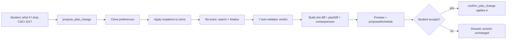
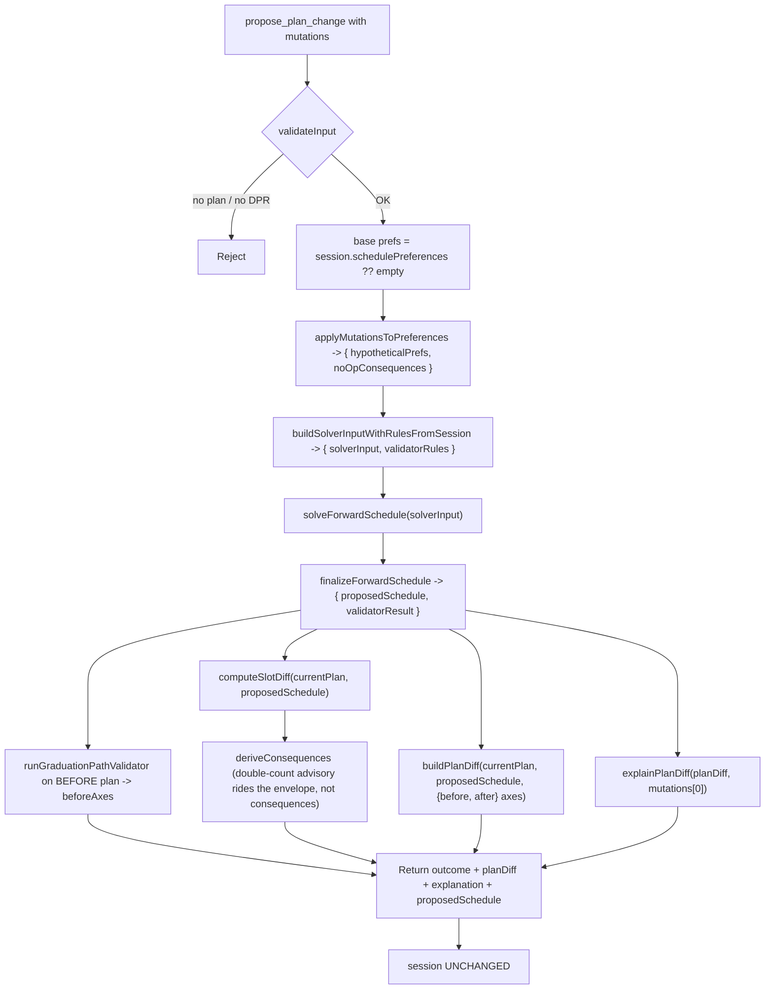
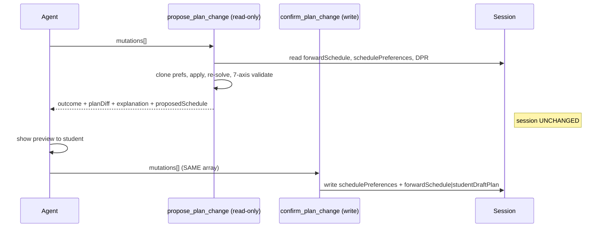

# propose_plan_change — Technical Audit

> Last verified against code: 2026-06-10 (post planning-engine rebuild, PRs #35-#41).

## Purpose

When a student asks "what if I drop Calc II?", "can I move CSCI 101 to Spring?", "what if I add a summer term?", or "swap this elective for that one," this tool gives a preview without committing anything. It clones the scheduling preferences, applies the requested mutation(s) to the clone, re-runs the planner against the clone, routes the result through the **same authoritative 7-axis validator** the build path uses, and returns what would happen — the slot diff, the new feasibility verdict, credit/workload deltas, a plain-English consequence list, and the simulated post-mutation schedule. It writes nothing. It is the "try before you buy" half of a two-step contract: the student then calls its sibling [`confirm_plan_change`](confirm_plan_change.md) with the same mutation list to actually apply it.



---

Source files:
- `packages/engine/src/agent/tools/proposePlanChange.ts`
- `packages/engine/src/agent/forwardSchedule/planChangeHelpers.ts`
- `packages/engine/src/agent/forwardSchedule/build.ts` (`finalizeForwardSchedule`)
- `packages/engine/src/agent/forwardSchedule/tradeOffEngine.ts` (`diffPlanTradeOffs`)
- `packages/engine/src/agent/tool.ts`

---

## 1. What it does

`propose_plan_change` is the **read-only preview** half of the two-step plan-mutation contract. It accepts one or more `PlanMutation` operations, applies them to a **hypothetical clone** of `session.schedulePreferences`, re-runs the forward solver against that clone, routes the output through the authoritative validator, and returns:

- a feasibility verdict from the **7-axis `runGraduationPathValidator`** (not the solver's coarse flag),
- a slot-level before/after diff,
- a list of plain-English consequence strings,
- a rich `PlanDiff` (credit/weighted-credit deltas, workload-tier shifts, balance impact, plan-state change, per-axis validation transitions, and real trade-off fields),
- a deterministic English `explanation` string for the first mutation,
- the simulated post-mutation `ForwardSchedule` (`proposedSchedule`) so the route layer can render the preview without re-solving.

It writes **nothing** to `session` — `isReadOnly: true` (`proposePlanChange.ts:88`). The companion `confirm_plan_change` is the writer.

The contract: **call `propose_plan_change` first, show the student the preview, then call `confirm_plan_change` with the same `mutations[]` to persist.**

---

## 2. Input schema — the 12-kind PlanMutation vocabulary

```
{ mutations: PlanMutation[] }   // min length 1
```

`PlanMutationSchema` is the discriminated union at `planChangeHelpers.ts:55-93`, keyed on `kind`. There are **12 kinds**, shared verbatim with `confirm_plan_change`:

| `kind` | Required | Optional | Semantics |
|---|---|---|---|
| `pin` | `courseId`, `term` | `freeze?` (default `true`) | Adds `{courseId, term}` to `prefs.pins[]`, replacing a duplicate `(courseId, term)`. `freeze: false` skips the pins write (transient placement, no solver lock). |
| `unpin` | `courseId`, `term` | — | Removes the matching `(courseId, term)` from `prefs.pins[]`. No-op if absent. |
| `exclude` | `courseId` | `term?` | Adds `{courseId, term?}` to `prefs.exclusions[]`, replacing a prior `(courseId, term)`. |
| `swap` | `drop`, `add`, `term` | — | Atomic: excludes `drop` (courseId-keyed, no term), then pins `add` at `term`. |
| `move` | `courseId`, `fromTerm`, `toTerm` | — | Atomic drag-to-move: adds `{courseId, fromTerm}` to exclusions (dedupe by courseId). Does NOT pin into `toTerm` — that's the route layer's job. |
| `addTerm` | `term` | — | "summer" → `prefs.includeSummer = true`; "january"/"jterm"/"j-term" → `prefs.includeJTerm = true`. fall/spring → silent no-op. |
| `loadStyleOverride` | `style` ∈ `balanced \| frontload \| backload \| light \| heavy` | `term?` | With `term`: writes `prefs.loadStylePerTerm[term] = style` **only** when `style ∈ {light, heavy, balanced}` (`frontload`/`backload` → no-op consequence). Without `term`: writes `prefs.loadStyle = style` **only** when `style ∈ {balanced, frontload, backload}` (`light`/`heavy` → no-op consequence). |
| `bindFreeElective` | `slotId`, `courseId` | — | **No-op at the preferences layer.** Emits a consequence string (real binding lives in `bind_free_elective`). |
| `unbindFreeElective` | `slotId` | — | **No-op.** Consequence string only. |
| `bindPoolSlot` | `slotId`, `courseId` | — | **No-op.** Consequence string only (real binding lives in `bind_pool_slot`). |
| `setSchedulingPreference` | `value: SchedulingPreferencesSchema` | — | Replaces `prefs.schedulingPreferences` with `value` (admits `avoidDays`, `avoidTimeWindows`, `preferTimeWindows`, `desiredFreeDay`, `avoidConsecutiveLongBlocks`, plus passthrough extras). |
| `clearSchedulingPreference` | — | — | Deletes `prefs.schedulingPreferences`. |

Mutations apply **left-to-right** in `applyMutationsToPreferences` (`planChangeHelpers.ts:117`); later mutations override earlier ones for the same field. A `default: never` branch enforces exhaustiveness at compile time.

---

## 3. Session prerequisites — hard-refuse without a DPR

`validateInput` (`proposePlanChange.ts:90`) rejects when:

1. **No prior plan**: neither `session.forwardSchedule` nor `session.studentDraftPlan` is set → `"No forward plan exists in this session. Call plan_forward_degree first, then propose changes."`
2. **No DPR**: `session.degreeProgressReport` is absent → `"No Degree Progress Report loaded. Cannot simulate plan changes without DPR data."`

Both short-circuit with `{ ok: false, userMessage }`. The DPR refusal is the same DPR-first doctrine the planner enforces: with no DPR, the tool refuses rather than simulating against guessed data.

---

## 4. What it reads from session

Inside `call` (`proposePlanChange.ts:112`):

- `session.degreeProgressReport` — non-null after validation.
- `session.forwardSchedule` first, falling back to `session.studentDraftPlan` (`proposePlanChange.ts:114`) — the **baseline** plan for the diff.
- `session.schedulePreferences` — base preferences the mutations layer onto. Defaults to `{}` when undefined.
- `session.schoolConfig` — for the double-count advisory.
- `session.student`, `session.prereqs`, `session.courses`, etc. — consumed indirectly via `buildSolverInputWithRulesFromSession`.

If — after validation — both schedule fields are somehow missing at `call` time (defensive guard, lines 116-124), the tool returns an early infeasible outcome with conflict kind `"no_plan"` and skips the solver.

---

## 5. Algorithm



**Step 1 — Clone preferences.** `applyMutationsToPreferences` deep-shallow-clones the base (spread top-level, clone `pins` / `exclusions` / `loadStylePerTerm` / `creditTargetPerTerm`), applies the mutations, and returns `{ prefs, noOpConsequences }`. `noOpConsequences` accumulates messages for mutations deliberately not applied (slot-binding kinds, ill-formed `loadStyleOverride` combinations).

**Step 2 — Build solver input + validator rules in one call.** `buildSolverInputWithRulesFromSession(session, dpr, hypotheticalPrefs)` (`planChangeHelpers.ts`) makes ONE `buildProgramRules` call that yields BOTH the `solverInput` and the `validatorRules`, with the hypothetical prefs applied as a non-mutating override (P2.10).

**Step 3 — Re-solve.** `solveForwardSchedule(solverInput)` runs the rebuilt feasibility-first search + materialize. (The old greedy solver is gone; see [forward-schedule audit](../engine/forward-schedule.md).)

**Step 4 — Route through the AUTHORITATIVE 7-axis validator.** `finalizeForwardSchedule(solverOutput, solverInput, dpr, validatorRules)` (`proposePlanChange.ts:153`) assembles the `ForwardSchedule` AND runs `runGraduationPathValidator`, returning `{ schedule: proposedSchedule, validatorResult }`. **This is the key post-rebuild change:** the tool no longer trusts the solver's coarse `feasibility`/`state`. `feasible` in the output reflects the full 7-axis verdict (`validatorResult.feasible`), closing the PLAN-3 hole where an edit could preview as feasible while a 7-axis check would have failed.

**Step 5 — Validate the BEFORE plan.** `runGraduationPathValidator({ plan: currentPlan, dpr, programRules: validatorRules })` produces `beforeAxes`, so the `planDiff` can report per-axis transitions.

**Step 6 — Slot diff.** `computeSlotDiff(currentPlan, proposedSchedule)` emits `{added, removed}` by a stable slot key (`<term>::<kind>::<courseId>` for concrete slots, `<term>::placeholder::<placeholderId>` for placeholders). Matching keys are "unchanged" and ignored.

**Step 7 — Consequences + the cited double-count advisory (D3.2).** `deriveConsequences(diff, proposedSchedule, noOpConsequences)` concatenates: the no-op messages; a feasibility verdict line (+ up to 3 conflict lines); an `"Added: …"` line; a `"Removed: …"` line. Separately, `proposePlanChange.ts` derives the double-count advisory via `buildDoubleCountAdvisory(dpr, session.schoolConfig)` and — when non-null — attaches the **whole structured `Disclaimer`** (id + `reason` + `bulletinSource`) to the output's `disclaimers[]` envelope field, mirroring `plan_forward_degree`. The advisory is **no longer** pushed bare into `consequences` (D3.2 fix; previously the citation was dropped). `summarizeResult` renders it via `renderEnvelopeMeta` so the `reason:` / `source:` citation surfaces.

**Step 8 — Rich `PlanDiff`.** `buildPlanDiff(currentPlan, proposedSchedule, { before: beforeAxes, after: validatorResult.axisResults })` (`planChangeHelpers.ts:481`) computes:
- `creditsByTermDelta` / `weightedCreditsByTermDelta` — non-zero per-term deltas.
- `workloadTierShifts` — emitted when both sides have a `loadRationale` and any of `{hardCount, easyCount, weightedCredits}` changed.
- `graduationTermShift` — signed semester distance (year × 4 + season ord; spring=0, summer=1, fall=2, january=3).
- `balanceImpact: { before, after, delta, classification }` via `computeBalanceScore(..., "balanced")` + `classifyBalanceDelta`.
- `planStateChange?` — only when `before.state !== after.state`.
- **The five trade-off fields are now POPULATED**, not empty: `newRequiresPetition`, `removedRequiresPetition`, `newUnmetRequirements`, `cascadedShifts`, `newAssumptions` are delegated to `diffPlanTradeOffs(before, after)` (`tradeOffEngine.ts`), which diffs the two schedules' slots directly.
- `validationResultsChanges` — per-axis `{before, after}` for every validator axis whose result changed (status or payload), computed from the supplied before/after axes (P2.7).

**Step 9 — Conflicts.** Built from the **validator's** verdict (not the solver's): when `!validatorResult.feasible`, a single `{ kind: infeasibilityReport.conflictSource, detail: conflictDetail }` is pushed. Omitted when feasible.

**Step 10 — Explanation.** `explainPlanDiff(planDiff, mutations[0])` renders a deterministic English template from **only the first** mutation in the batch. The route layer can re-invoke it per mutation if needed.

---

## 6. What it returns

`ProposePlanChangeOutput` (`proposePlanChange.ts:39`) extends `PlanChangeOutcome`:

```
{
  feasible: boolean,                         // validatorResult.feasible (7-axis)
  diff: { added: [...], removed: [...] },
  consequences: string[],                    // NO double-count text here (rides disclaimers[])
  conflicts?: Array<{ kind, detail }>,       // from the validator's infeasibilityReport
  planDiff?: {
    creditsByTermDelta, weightedCreditsByTermDelta,
    workloadTierShifts, graduationTermShift,
    balanceImpact: { before, after, delta, classification },
    newRequiresPetition, removedRequiresPetition,    // populated by diffPlanTradeOffs
    newUnmetRequirements, cascadedShifts, newAssumptions,
    validationResultsChanges,                        // per-axis transitions
    planStateChange?
  },
  explanation: string,                       // always populated
  proposedSchedule?: ForwardSchedule,        // pure preview, never persisted
  disclaimers?: Disclaimer[]                 // D3.2 — cited double-count advisory (id + reason + bulletinSource)
}
```

`explanation` is always populated. `planDiff` and `proposedSchedule` are populated whenever the solver ran (i.e., `currentPlan` was non-null). `conflicts` is conditional.

`proposedSchedule` is a **pure preview** — it is what would be stored if the student confirmed. It is NOT routed through any persistence path.

---

## 7. The two-step contract — no `pendingMutationId`

`propose_plan_change` stages **nothing** in the session. There is no pending-mutation id generated or returned; the caller must replay the exact same `mutations[]` array on `confirm_plan_change` to commit (stateless replay).

**Implication:** there is no server-side staleness guard between propose and confirm. If session state changes between calls (DPR reloaded, another tool mutates `schedulePreferences`), confirm re-solves against the newer state and may differ from the preview. Propose and confirm are independent solver+validator runs.



---

## 8. What it writes to session

**Nothing.** `isReadOnly: true` (`proposePlanChange.ts:88`). The tool reads `session.schedulePreferences`, clones it locally, mutates the clone, and discards it after returning. No persistence call is made; `forwardSchedule`, `studentDraftPlan`, `schedulePreferences`, and `scheduleStore` are all untouched. The agent loop relies on this `isReadOnly` flag to permit speculative re-runs.

---

## 9. Envelope behavior

- `name`: `"propose_plan_change"`.
- `isReadOnly: true`.
- `maxResultChars: 4000`; `summarizeResult` is truncated with `"…"` above the cap.
- `outputMode`: defaults to `"synthesis"`; no `extractVerbatim`. The validator pins no specific text.

`summarizeResult` (`proposePlanChange.ts:207`) emits, in fixed order:

1. `PROPOSE PLAN CHANGE — feasible: <true|false>`
2. If conflicts: `Conflicts (<n>):` then up to 3 `  [<kind>] <detail>` lines.
3. `Added slots: <n>, removed slots: <m>`
4. If consequences: `Consequences:` then up to 5 `  • <consequence>` lines.
5. If `planDiff`: `Balance: <before> → <after> (<classification>)`; if `planStateChange`: `Plan state: <from> → <to>`.
6. If `disclaimers` is non-empty (D3.2): the `renderEnvelopeMeta` block — a "DISCLAIMERS YOU MUST SURFACE" header with the advisory text and its `(reason: …; source: …)` citation line. `renderEnvelopeMeta` adds nothing when there is no advisory.

The rich `planDiff.creditsByTermDelta`, `weightedCreditsByTermDelta`, `workloadTierShifts`, and the `explanation` string are **not** in the model-facing summary — the route layer consumes those structured fields directly.

---

## 10. Interactions

- **`confirm_plan_change`** — direct partner. Same `inputSchema`, same `PlanMutationSchema`, same five helpers. See [confirm_plan_change](confirm_plan_change.md).
- **`plan_forward_degree`** — strict ordering: `validateInput` rejects when both schedule slots are absent, and only `plan_forward_degree` creates them. See [plan_forward_degree](plan_forward_degree.md).
- **`simulate_alternatives`** — independent. It probes three predefined relaxations (summer, J-term, extend graduation) and returns summaries; `propose_plan_change` takes an explicit mutation list and returns the full `planDiff`.
- **`bind_free_elective` / `bind_pool_slot`** — the `bindFreeElective` / `bindPoolSlot` mutation kinds are accepted but are no-ops here; the real slot-level binding lives in those dedicated tools (which mutate `forwardSchedule.semesters[].slots[]` directly).

---

## Known limitations

- **The double-count advisory is now carried with its citation (D3.2 — fixed).** Previously only the advisory's bare `text` was pushed into `consequences`, dropping `reason` + `bulletinSource`. It is now carried as a structured `Disclaimer` (id + `reason` + `bulletinSource`) on the output's `disclaimers[]` envelope field and rendered by `summarizeResult` via `renderEnvelopeMeta` — exactly matching `plan_forward_degree`. The inconsistency with the planner is closed.
- **`bindFreeElective` / `unbindFreeElective` / `bindPoolSlot` are no-ops.** Sending them through `propose_plan_change` changes nothing in the simulated preferences; only a consequence string flags that the binding did not take effect.
- **No staleness guard between propose and confirm** (see §7). The preview and the eventual confirm are independent runs and can diverge if session state changes.
