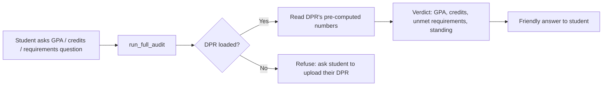
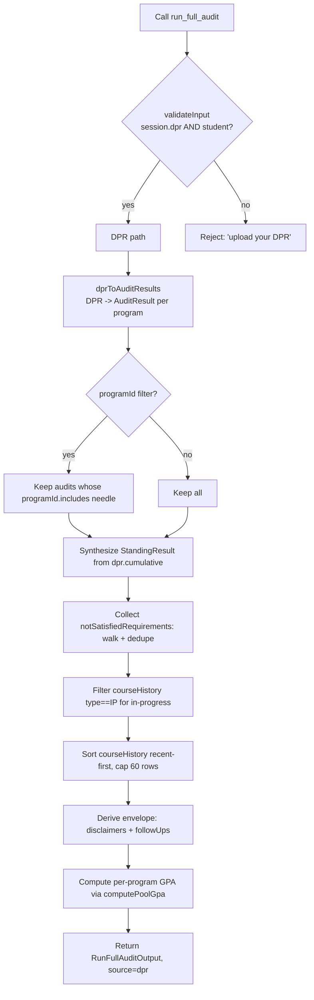

# `run_full_audit` — Technical Audit

> Last verified against code: 2026-06-10 (post planning-engine rebuild, PRs #35-#41).

## Purpose

`run_full_audit` is the agent's single entry point for any question that needs a *deterministic verdict* from a specific student's record: "What's my GPA?", "How many credits do I have left?", "Am I on track to graduate?", "Which requirements am I still missing?", "Am I in good standing?", "What classes am I in right now?", "What's my CS GPA?", "What was my grade in X?", identity questions ("What's my student ID?", "When was my DPR prepared?").

It is **DPR-only**: every answer traces to the student's parsed Albert *Degree Progress Report* (DPR). When a DPR is loaded, the tool surfaces NYU's pre-computed audit numbers as the authoritative answer (the LLM does wording only; no computation happens above the DPR). A DPR is **REQUIRED** — if none is loaded the tool refuses and asks the student to upload one. There is no transcript or authored-rules fallback (both were removed in the DPR-only pivot). The tool walks `dpr.requirementGroups` + `dpr.cumulative` authoritatively, with no hedging, and is one of the `semi_hardened` tools: the LLM must render the verbatim cumulative-GPA substring unchanged.



This document is derived entirely from `packages/engine/src/agent/tools/runFullAudit.ts` and the modules it calls.

---

## 1. Input schema

One optional field (`runFullAudit.ts:160-163`):

| Field | Type | Meaning |
|---|---|---|
| `programId` | `string` (optional) | Restricts the audit to a single program. Matched loosely against the DPR's `programIdFromLabel` slug (e.g. `computer_science_math_major`). |

When omitted, the tool returns one `AuditResult` per program in `dpr.programs`.

- `maxResultChars` = 5000 (line 169) — bumped from the default so the "currently enrolled" block doesn't push the STANDING line past the truncation edge.
- `outputMode` = `"semi_hardened"` (line 172).
- `isReadOnly` defaults to `true` (from `buildTool`).

---

## 2. Session prerequisites + `validateInput`

`validateInput` (`runFullAudit.ts:173-186`) **requires both** `session.degreeProgressReport` and `session.student`. When either is missing it refuses with:

> `"I can only run an audit from your Albert Degree Progress Report (DPR). Please upload your DPR and try again."`

No course catalog or program map is required. There is no fallback path — without a DPR there is no authoritative record to read, so the tool asks the student to upload one rather than computing a guess.

---

## 3. What it reads

### From `ToolSession`
- `session.degreeProgressReport` (`DegreeProgressReport`) — required.
- `session.student` (reads `id`) — required.
- `session.schoolConfig` (`SchoolConfig`, may be null) — used by the envelope deriver for the Pass/Fail-no-major disclaimer.

### From other modules
- `dprToAuditResults(...)` (`dpr/dprToAuditResult.ts`) — converts the DPR to `AuditResult[]`.
- `walkRequirements(...)` / `notSatisfiedRequirements(...)` (`dpr/schema.ts`) — walk the DPR `requirementGroups` tree.
- `computePoolGpa(...)` (`audit/gpaCalculator.ts`) — per-program GPA from DPR grade rows.
- `renderEnvelopeMeta(...)` (`agent/toolEnvelope.ts`) — emits the disclaimer / follow-up block.

### From the DPR shape (`dpr/schema.ts`)
- `dpr.header` (`studentName`, `preparedDate` — and optionally `requestedBy`; **not** `studentId` / `program` / `college`, which the parser never populates — see §5 Step H).
- `dpr.programs[]` (`label`, `programType`, `requirementTerm`, `requirementStatus`).
- `dpr.cumulative` (nullable numeric fields: `creditsRequired`, `creditsUsed`, `cumulativeGpa`, `cumulativeGpaRequired`, `residencyRequired`, `residencyUsed`, `passFailUsedUnits`, `passFailCapUnits`, `outsideHomeUsedUnits`, `outsideHomeCapUnits`, `timeLimitYears`).
- `dpr.requirementGroups[]` (recursive tree of `DPRRequirementGroup` and `DPRRequirement` leaves).
- `dpr.courseHistory[]` (each row: `term`, `subject`, `catalogNbr`, `courseTitle`, `grade`, `units`, `type`).

No data files are read directly. The school config is read only via `session.schoolConfig`.

---

## 4. Algorithm

### 4.1 Top-level flow



### 4.2 DPR path (`runFullAudit.ts:193-351`)

`validateInput` guarantees a DPR, so this is the only path that runs.

#### Step A — Convert DPR to `AuditResult[]`
`dprToAuditResults(dpr, { studentId, timestamp })` (`dprToAuditResult.ts:57-92`) produces one `AuditResult` per entry in `dpr.programs`:
- `programName` = `"<program.label> (<program.programType>)"`.
- `programId` = a slug from `programIdFromLabel()` (e.g. `"Computer Science/Math"` + `"Major Approved"` → `"computer_science_math_major"`).
- `catalogYear` ← `program.requirementTerm`.
- `overallStatus` ← `dprStatusToRuleStatus(program.requirementStatus, true)`: `"satisfied"`→`satisfied`; `"overall_not_satisfied"`→`in_progress`; `"not_satisfied"`→`in_progress` when courses applied else `not_started`.
- `totalCreditsCompleted` / `totalCreditsRequired` ← `dpr.cumulative.creditsUsed` / `creditsRequired` (`?? 0`).
- `rules[]` ← every **leaf** `DPRRequirement` from `walkRequirements`, mapped via `reqToRuleAuditResult()`: `ruleId`←`rId`, `label`←`title`, `status`←`dprStatusToRuleStatus`, `coursesSatisfying[]`←each `coursesUsed[i]` as `"<subject> <catalogNbr>"`, `remaining`←`computeRemaining(req)`, `coursesRemaining[]`←always `[]`.
- `warnings[]` ← `dpr._meta.warnings.slice()`.

#### Step B — Optional program filter (lines 209-213)
If `input.programId` is given, it is lowercased with hyphens→underscores to form `needle`; audits whose `programId.includes(needle)` survive. A non-matching id yields an empty `audits[]` — the tool intentionally does **not** fall back to all programs (so the agent notices the mismatch instead of returning the wrong major's verdict).

#### Step C — Synthesize `StandingResult` (lines 217-236)
`calculateStanding` is **not** called here. Instead the standing is built directly from `dpr.cumulative`:
- `cumGpa = dpr.cumulative.cumulativeGpa ?? 0`
- `completion = creditsRequired > 0 ? min(1, creditsUsed / creditsRequired) : 0`
- `floor = dpr.cumulative.cumulativeGpaRequired ?? 2.0` — the **per-student DPR-required GPA floor**, not a hardcoded 2.0. (Schools with higher floors, e.g. Tandon programs, would otherwise wrongly show "good standing" at 2.01.)
- `inGoodStanding = cumGpa >= floor`
- `level = inGoodStanding ? "good_standing" : "academic_concern"`
- `message` quotes the floor: e.g. `"Cumulative GPA 3.402 ≥ 2.00 (your DPR-required floor); you're in good standing per the DPR."`
- `warnings = []`

#### Step D — Collect unsatisfied requirements (lines 237-245)
`notSatisfiedRequirements(dpr.requirementGroups)` (`schema.ts:304-322`) returns leaf `DPRRequirement`s that are not satisfied, with two dedup layers:
1. Drop any leaf whose `rId` ends in `"/_summary"` (synthetic roll-up markers).
2. Among remaining unmet leaves, drop any whose `rId` is a strict prefix of another unmet leaf's `rId` (parents whose more-specific children are also unmet).

Each survivor is reshaped to `{ rId, title, statusText, description?, needed? }` (`needed` from `counter.needed` when present).

#### Step E — In-progress courses (lines 249-259)
`dpr.courseHistory.filter(c => c.type === "IP")` → `{ term, courseId: "<subject> <catalogNbr>", courseTitle, units }`.

#### Step F — Slim course history (lines 268-275)
`sortCourseHistoryRecentFirst(dpr.courseHistory).slice(0, 60)`. The sort key `termSortKey(term)` (lines 565-578) parses `"<YYYY> <Season>"` (Fall/Spring/Spr/Summer/Sum/J Term/JTerm, case-insensitive) → `year*10 + seasonRank` (Fall=4, JTerm=3, Summer=2, Spring=1, unknown=0), sorted descending. Each row keeps `term`, `courseId`, `title`, `units`, `grade`, `type`.

#### Step G — Derive envelope (lines 280-285)
`deriveAuditEnvelope({ unsatisfied, school, hasMajorRequirementGap, programLabel })`. See §6.
`hasMajorRequirementGap` = `detectMajorRequirementGap(unsatisfied, dpr)` (lines 625-639): finds the `"Major Approved"` program; returns `true` if any unsatisfied requirement's `title+statusText+description` blob contains the major label, OR a `MAJOR_GROUP_HINTS` regex matches the title or `rId` (`computer science`, `mathematics`, `major`, `joint major`, `economics`, `finance`, `philosophy`, `physics`, `biology`, `chemistry`, `engineering`).

#### Step H — Build `dprHeader` (lines 297-300)
**Only `studentName` + `preparedDate`.** A prior version also read `studentId` / `program` / `college`, but the DPR header schema never populates those (they rendered as `"undefined"`), so they were removed. Program/college questions are answered from the audit body, which names the audited program.

#### Step I — Per-program GPAs (lines 308-335)
1. Build `coursesTakenForGpa` from `dpr.courseHistory.filter(c => c.type === "EN" && c.grade?.trim())` → `{ courseId, grade, credits: units, semester: term }`.
2. For each filtered `AuditResult`: `pool = unique union of a.rules[*].coursesSatisfying`.
3. Empty pool → `{ programLabel, programType, gpa: null, creditsCounted: 0, coursesCounted: 0 }`.
4. Else `computePoolGpa(coursesTakenForGpa, pool)` → `gpa: countedCredits > 0 ? r.gpa : null`, plus counts.

#### Step J — Return (lines 337-350)
A `RunFullAuditOutput` with `source: "dpr"`. `dprInProgressCourses`, `dprCourseHistory`, `dprProgramGpas`, `disclaimers`, and `suggestedFollowUps` are spread in only when non-empty.

### 4.3 `computePoolGpa` (`gpaCalculator.ts:56-102`)
Splits the pool into wildcard prefixes (`*`) and exact ids. For each `CourseTaken`: skip in-progress/null-grade rows; uppercase grade and require it in `GRADE_POINTS` (A=4.000 … F=0.000 — so `P`, `TR`, `W`, `I`, `NR` and transfers don't contribute); require pool membership (exact or wildcard-prefix); `credits = catalog?.get(id)?.credits ?? ct.credits ?? 4`. `gpa = totalPoints / totalCredits`, rounded to 3 decimals. The DPR-path pre-filters to `type === "EN"` graded rows, so transfers/IP never reach it.

### 4.4 No-DPR branch (defensive throw)
`validateInput` guarantees a DPR, so the DPR path always returns. The `call()` method still carries a defensive throw (lines 353-359): if reached, it throws rather than fabricate an audit without DPR data.

---

## 5. What it returns

`RunFullAuditOutput` (`runFullAudit.ts:31-116`):

```
{
  audits: AuditResult[],          // one per program (or filtered subset)
  standing: StandingResult,       // synthesized from dpr.cumulative
  source: "dpr" | "authored",     // type still carries the union, but only "dpr" is produced now

  // ---- DPR fields ----
  dprPreparedDate?: string,
  dprCumulative?: {               // structured copy of dpr.cumulative (each field number | null)
    creditsRequired, creditsUsed, cumulativeGpa,
    residencyRequired, residencyUsed,
    passFailUsedUnits, passFailCapUnits,
    outsideHomeUsedUnits, outsideHomeCapUnits, timeLimitYears
  },
  dprUnsatisfiedRequirements?: [ { rId, title, statusText, description?, needed? } ],
  dprInProgressCourses?: [ { term, courseId, courseTitle, units } ],   // only when length > 0
  dprCourseHistory?:    [ { term, courseId, title, units, grade: string|null, type } ],  // up to 60, recent-first
  dprHeader?: { studentName, preparedDate },                          // ONLY these two fields
  dprProgramGpas?: [ { programLabel, programType, gpa: number|null, creditsCounted, coursesCounted } ],

  // ---- Envelope ----
  disclaimers?: Disclaimer[],              // only when length > 0
  suggestedFollowUps?: SuggestedFollowUp[] // only when length > 0
}
```

**`AuditResult`** (each entry in `audits`): `{ studentId, programId, programName, catalogYear, timestamp, overallStatus: "satisfied"|"in_progress"|"not_started", totalCreditsCompleted, totalCreditsRequired, rules: RuleAuditResult[], warnings }`.

**`RuleAuditResult`**: `{ ruleId, label, status, coursesSatisfying, remaining, coursesRemaining, exemptReason? }`.

**`StandingResult`**: `{ level, cumulativeGPA, semesterGPA?, completionRate, inGoodStanding, message, warnings }`. In the DPR path, `level` is only `good_standing` or `academic_concern`, `completionRate` = `creditsUsed / creditsRequired` clamped to ≤ 1, and `warnings` is empty.

---

## 6. Envelope behavior

Built only in the DPR path by `deriveAuditEnvelope` (`runFullAudit.ts:648-685`).

### Disclaimers
There is now **one** possible disclaimer, gated on `hasMajorRequirementGap && school !== null`:

- **`school_pf_no_major`** — emitted when `school.passFail !== undefined && school.passFail.countsForMajor === false`.
  - `text`: `"Pass/Fail option does not count toward the major."`
  - `reason`: `"Your reply references an unsatisfied major requirement; the school's bulletin P/F rule applies."`
  - `bulletinSource`: `"data/schools/<schoolId>.json#passFail.countsForMajor"`

> The old `school_major_grade_threshold` disclaimer ("a C is required in major courses") was **removed**: `SchoolConfig.gradeThresholds` no longer exists. The grade-threshold rule is now a static bulletin fact answered via [`search_policy`](./search_policy.md) (RAG), and the DPR's requirement audit already reflects grade-based satisfaction.

### Suggested follow-ups
For up to the first 3 entries in `unsatisfied` whose `statusText`/`description` matches a `GENERIC_STATUS_TEXT_PATTERNS` regex (lines 591-597: `^complete the following courses:?`, `^complete the requirements outlined below`, `^complete N course from`, `^select N course`, `\bCORE-UA \d{3}-\d{3}\b`), one `search_policy` follow-up is attached: `{ tool: "search_policy", args: { query: "<programLabel> <title>".slice(0,120) }, why: '...' }`. Identical queries are deduped.

### Anchors / confidence / verbatim
The tool does NOT set `anchors` or `confidence`. It surfaces the Cardinal Rule §2.1 verbatim GPA string instead — see §8.

---

## 7. Summary text format (`summarizeResult`)

`summarizeResult` (`runFullAudit.ts:361-531`) produces the multi-line string the LLM reads (capped at 5000 chars). Because `source` is always `"dpr"`, the DPR-shaped output runs; the old `source === "authored"` and non-deduped branches remain but are unreachable.

```
AUDIT (from your Degree Progress Report (prepared <preparedDate>)):

CUMULATIVE (DPR-verified):                          [when dprCumulative present; each line guarded by non-null fields]
  Credits earned: <used> of <required> required
  Cumulative GPA: <X.XXX>
  Residency credits (CAS): <used> of <required> required
  Pass/Fail units used: <used> of <cap> cap
  Outside-home credits used: <used> of <cap> cap
  Degree time limit: <years> years from matriculation

PROGRAM: <programName> — <completed>/<required> credits, <overallStatus>   [credit-headline only, when deduped block present]

UNSATISFIED REQUIREMENTS (verbatim from DPR; <count> distinct):     [when hasDedupedDprBlock; up to 10]
  - <rId> <title> [need <N> more]: <statusText>
    <description>                                   [only when description exists and length < 220]

COURSE HISTORY (most recent first; <N> rows shown):   [only when dprCourseHistory non-empty; grouped by term]
  <Term>:
    <courseId> (<units>cr, grade <G> | IP (no grade yet) | transfer | <type>) — <title>

CURRENTLY ENROLLED (in-progress per DPR):             [only when dprInProgressCourses non-empty; grouped by term]
  <Term>:
    - <courseId> (<units>u) — <courseTitle>

STANDING: <level> (cumulative GPA <X.XXX>, completion <PP>%)

STUDENT (DPR header):
  Name: <studentName>
  DPR prepared: <preparedDate>

PER-PROGRAM GPA (computed from courseHistory grades):  [when dprProgramGpas non-empty]
  <programLabel> [<programType>]: <X.XXX (N course(s), C credit(s))> | not computable (no graded courses match the requirement pool yet)

-- DISCLAIMERS YOU MUST SURFACE (verbatim) --          [from renderEnvelopeMeta, when disclaimers present]
  • <disclaimer.text>
    (reason: <…>; source: <…>)

-- SUGGESTED FOLLOW-UPS (call the tool if the question is unanswered) --   [when suggestedFollowUps present]
  • call `search_policy` with {"query":"<…>"} — <why>
```

The **STUDENT** block now prints only `Name:` and `DPR prepared:` (lines 497-503) — the old `StudentId` / `Program` / `College` lines were removed alongside the header-field change.

Decision logic:
- `hasDedupedDprBlock = source === "dpr" && dprUnsatisfiedRequirements?.length > 0`. When true, the per-program loop emits only the credit-headline line (no rule iteration), preventing double-counting between a parent group and its unmet leaf.
- The non-deduped `else` branch (full per-program block, "Unmet requirements: N", "already applied", warnings) runs only when the DPR yielded no deduped unsatisfied requirements — e.g. when every requirement is satisfied.
- Grade tag in course history: `grade X` if a grade exists; else `IP (no grade yet)` for `type==="IP"`; else `transfer` for `type==="TE"`; else the raw `type`.

The renderer truncates to 5000 chars with a `…` suffix (`tool.ts`).

---

## 8. OutputMode

`outputMode = "semi_hardened"` (line 172). The validator requires a verbatim substring in the LLM's reply, provided by `extractVerbatim` (lines 545-548):

> `"Cumulative GPA: <gpa.toFixed(3)>"` — e.g. `"Cumulative GPA: 3.402"`.

The attribution suffix (`"(from your Degree Progress Report)"`) is intentionally **not** pinned — only the numeric GPA. (Pre-Phase-9 the pinned text included the parenthetical, which triggered false verbatim-drift banners; loosening to the bare number fixed that.)

---

## 9. Interactions with other tools

- **[`get_academic_standing`](./get_academic_standing.md)** — its description tells the model to PREFER `run_full_audit` for authoritative GPA, cumulative credits, and requirement status. `get_academic_standing` is scoped to probation / SAP / standing detail and also REQUIRES a DPR now.
- **[`search_policy`](./search_policy.md)** — the target of suggested follow-ups when an unmet requirement uses generic status text (§6).
- **[`what_if_audit`](./what_if_audit.md)** — `run_full_audit` does not compute hypotheticals; program-level hypotheticals are `what_if_audit`'s job, and course-level ones go to [`propose_plan_change`](./propose_plan_change.md) / [`simulate_alternatives`](./simulate_alternatives.md). `run_full_audit` does not chain into any of them.
- **Re-exports** — the module re-exports `walkRequirements` and `notSatisfiedRequirements` (line 554) so sibling tools can introspect the DPR tree without importing `dpr/` directly.

### When this tool should be called
Per the `description` (lines 120-159): GPA / credits / requirements / Pass-Fail / outside-CAS / residency / standing / time-limit, "am I on track?", currently-enrolled courses, declared programs, identity (name, DPR prepared date), per-program GPA, per-course grades, and any first-person question about the student's own numbers.

---

## 10. Edge cases and error handling

- **No DPR (or no student)** — `validateInput` rejects with the "upload your DPR" message; `call()` never runs. There is no fallback even if `student`/`courses`/`programs` are present.
- **`programId` matches nothing** — `audits: []`. Deliberate: no silent fallback to all programs.
- **Null fields in `dpr.cumulative`** — every CUMULATIVE line is guarded by a non-null check, so the block can be partial; the standing synthesis falls back to `cumGpa = 0` / `completion = 0`.
- **Generic status text on an unmet requirement** — triggers a `search_policy` follow-up (§6).
- **`hasMajorRequirementGap` but no school config** — disclaimers skipped (`input.school` short-circuit).
- **No graded courses in a program's pool** — `dprProgramGpas[i].gpa = null` → renders `"not computable (...)"`.
- **Synthesized `/_summary` requirements** — filtered out by `notSatisfiedRequirements`.
- **Parent / child duplication** — parent dropped via prefix-match dedup (§4.2 Step D).
- **Empty `audits` array** — `dprProgramGpas` is `[]` and omitted; the summary still emits cumulative, course history, in-progress, standing, header, and envelope lines; no PROGRAM block.
- **Truncation** — joined summary > 5000 chars is sliced with `…`.
- **Determinism** — uses `new Date().toISOString()` as the audit timestamp; `dprToAuditResults` accepts an `opts.timestamp` override for tests.
- **Grade case** — `computePoolGpa` uppercases before comparing; mixed-case grades work.
- **Transfer "TR"/"TE"** — `computePoolGpa` skips non-`GRADE_POINTS` grades, and the DPR path pre-filters to `type === "EN"` rows, so transfers never reach the GPA pool.

---

## Known limitations

- **`source: "authored"` is dead.** The output type still carries the `"dpr" | "authored"` union and `summarizeResult` still has the non-deduped/authored branches, but no code path produces `"authored"` — the authored-rules fallback was removed in the DPR-only pivot.
- **The no-DPR branch in `call()` is unreachable.** It throws defensively; `validateInput` guarantees a DPR first.
- **`dprHeader` carries only name + prepared date.** Student ID, program, and college are not in the header surface (the parser never populates them); program/college answers come from the audit body instead.

---

## Summary

`run_full_audit` reads the student's parsed DPR and surfaces NYU's pre-computed, authoritative audit verdicts: cumulative GPA + credits + budgets (residency, P/F, outside-CAS, time limit), every deduped unsatisfied requirement, in-progress courses, the most-recent 60 transcript rows, the DPR header (name + prepared date), per-program GPAs, and a standing verdict whose floor is the DPR's per-student `cumulativeGpaRequired`. It is DPR-only (refuses without one), pins the cumulative-GPA substring verbatim, and surfaces at most one bulletin disclaimer (`school_pf_no_major`) plus `search_policy` follow-ups for generically-worded requirements. It never computes hypotheticals.
