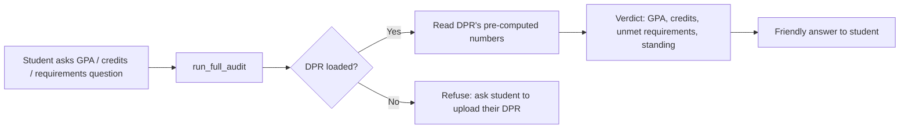
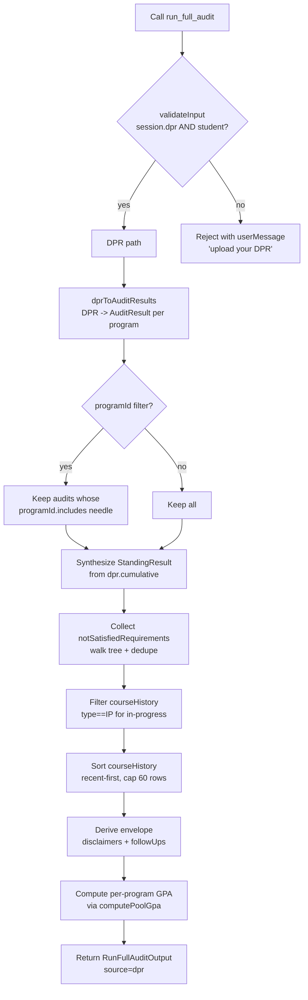

# `run_full_audit` — Technical Audit

## TL;DR

This tool runs when you ask anything that needs hard numbers from your record: "What's my GPA?", "How many credits do I have left?", "Am I on track to graduate?", "Which requirements am I still missing?", "Am I in good standing?", or "What classes am I in right now?". It pulls a deterministic verdict — not a guess — straight from your uploaded Degree Progress Report (DPR) from Albert. A DPR is REQUIRED: if none is loaded, the tool refuses and asks you to upload one (there is no transcript or authored-rules fallback). So before you ask GPA-style questions, make sure you've uploaded your DPR. The tool answers with cumulative credits, GPA, residency, Pass/Fail and outside-CAS caps, every unsatisfied requirement (deduplicated so parent groups don't double-up with their children), in-progress courses, recent course history (up to 60 rows), and per-program GPAs. It never invents numbers — if the DPR didn't fill in a field, the tool says so. It's also the right tool for identity questions like "What's my student ID?" or "When was my DPR prepared?".



---

This document describes the behavior of the `run_full_audit` agent tool, derived entirely from the source code in `packages/engine/src/agent/tools/runFullAudit.ts` and the modules it calls into. It is a PRD-style reference: every claim below maps to a specific code path.

---

## 1. Purpose

`run_full_audit` is the agent's single entry point for any question that requires a *deterministic verdict* about a specific student's degree progress — cumulative GPA, credits earned, requirements satisfied or remaining, residency, Pass/Fail and outside-home credit caps, academic standing, in-progress courses, identity (name / student id / program / college), per-program GPA, and per-course grade history.

It is **DPR-only**: every audit answer must trace to the student's parsed Albert *Degree Progress Report*. When the DPR is loaded onto the session, the tool surfaces NYU's pre-computed audit numbers as the authoritative answer. The LLM does wording only; no computation happens above the DPR. There is no transcript or authored-rules fallback — when the DPR is absent the tool refuses (see §3).

Per the tool's `outputMode = "semi_hardened"` declaration, the LLM is forced to render the verbatim GPA substring unchanged in its reply.

Source: `runFullAudit.ts:124-546`.

---

## 2. Input schema

The tool accepts one optional field:

| Field | Type | Meaning |
|---|---|---|
| `programId` | `string` (optional) | Restricts the audit to a single program. Example values: `cs_major_ba`, or in the DPR path the slug derived from the PeopleSoft label such as `computer_science_math_major`. |

When `programId` is omitted, the tool returns one `AuditResult` per program in `dpr.programs`.

Source: `runFullAudit.ts:166-169`.

---

## 3. Session prerequisites

`validateInput` (runFullAudit.ts:179-192) **requires a DPR**. The call is accepted only when `session.degreeProgressReport` is set AND `session.student` is set. No course catalog or program map is required. When either is missing, the tool refuses:

- No DPR (or no student) → `"I can only run an audit from your Albert Degree Progress Report (DPR). Please upload your DPR and try again."`

There is no longer any transcript / authored-rules fallback path — without a DPR there is no authoritative record to read, so the tool asks the student to upload one rather than computing a guess.

The tool is declared `isReadOnly = true` (default from `buildTool`, tool.ts:258) and `maxResultChars = 5000` (runFullAudit.ts:175). The size cap was bumped from the default 2000 specifically so that the "currently enrolled" block does not push the standing line past the truncation edge.

---

## 4. What it reads

The tool consumes data from two places:

### From `ToolSession`
- `session.degreeProgressReport` (a `DegreeProgressReport`, the parsed Albert DPR — see schema in §4.3) — required
- `session.student` (a `StudentProfile`; reads `id`) — required
- `session.schoolConfig` (a `SchoolConfig` used by the envelope deriver for major-grade and P/F disclaimers)

### From other modules
- `dprToAuditResults(...)` from `dpr/dprToAuditResult.ts` — converts the DPR to `AuditResult[]`
- `walkRequirements(...)` and `notSatisfiedRequirements(...)` from `dpr/schema.ts` — used to walk the DPR's `requirementGroups` tree
- `computePoolGpa(...)` from `audit/gpaCalculator.ts` — used to compute per-program GPAs from DPR grade rows
- `renderEnvelopeMeta(...)` from `agent/toolEnvelope.ts` — emits the disclaimer / follow-up block at the end of `summarizeResult`

### From the DPR shape (`dpr/schema.ts:242-251`)
The tool reads from the DPR:
- `dpr.header` (`studentName`, `studentId`, `program`, `college`, `preparedDate`)
- `dpr.programs[]` (`label`, `programType`, `requirementTerm`, `requirementStatus`)
- `dpr.cumulative` (10 nullable numeric fields: `creditsRequired`, `creditsUsed`, `cumulativeGpa`, `cumulativeGpaRequired`, `residencyRequired`, `residencyUsed`, `passFailUsedUnits`, `passFailCapUnits`, `outsideHomeUsedUnits`, `outsideHomeCapUnits`, `timeLimitYears`)
- `dpr.requirementGroups[]` (recursive tree of `DPRRequirementGroup` and `DPRRequirement` leaves)
- `dpr.courseHistory[]` (each row has `term`, `subject`, `catalogNbr`, `courseTitle`, `grade`, `units`, `type`)

No data files are loaded directly (no `data/` reads, no `coreUaRanges.ts` reference). The school config is read indirectly through `session.schoolConfig`, which is the only data-file-derived input.

---

## 5. What it computes / Algorithm

### 5.1 Top-level flow



### 5.2 DPR path (runFullAudit.ts:198-347)

Executed when `session.degreeProgressReport && session.student` are both truthy — which `validateInput` guarantees, so this is the only path that runs.

#### Step A — Convert DPR to AuditResult[]
Calls `dprToAuditResults(dpr, { studentId, timestamp })` (runFullAudit.ts:205-208). This adapter (`dprToAuditResult.ts:57-92`) produces one `AuditResult` for every entry in `dpr.programs` with the following mapping:

- `programName` becomes `"<program.label> (<program.programType>)"`
- `programId` becomes a slug derived from the label via `programIdFromLabel()` (e.g., `"Computer Science/Math"` + `"Major Approved"` → `"computer_science_math_major"`)
- `catalogYear` ← `program.requirementTerm`
- `overallStatus` ← mapped from `program.requirementStatus` via `dprStatusToRuleStatus()`:
  - `"satisfied"` → `"satisfied"`
  - `"overall_not_satisfied"` → `"in_progress"`
  - `"not_satisfied"` → `"in_progress"` when any course is applied, else `"not_started"`
- `totalCreditsCompleted` ← `dpr.cumulative.creditsUsed ?? 0`
- `totalCreditsRequired` ← `dpr.cumulative.creditsRequired ?? 0`
- `rules[]` ← every *leaf* `DPRRequirement` from `walkRequirements(dpr.requirementGroups)` mapped via `reqToRuleAuditResult()`:
  - `ruleId` ← `req.rId`
  - `label` ← `req.title`
  - `status` ← `dprStatusToRuleStatus(req.status, courses.length > 0)`
  - `coursesSatisfying[]` ← each `coursesUsed[i]` rendered as `"<subject> <catalogNbr>"`
  - `remaining` ← computed by `computeRemaining(req)`:
    - If `req.counter` is absent: `0` when status is satisfied, else `1`
    - If counter kind is `"gpa"`: `0` when `completed >= required`, else `1`
    - If counter has a `needed` field: that value
    - Otherwise `Math.max(0, counter.required - counter.used)`
  - `coursesRemaining[]` ← always `[]` (DPR does not enumerate)
- `warnings[]` ← a slice of `dpr._meta.warnings`

#### Step B — Optional program filter
If `input.programId` was provided, the slug is lowercased and hyphens are replaced with underscores, producing `needle`. Audits whose `programId.includes(needle)` survive; others are dropped. If nothing matches, the result is an empty array — the tool intentionally does NOT fall back to all programs in that case (runFullAudit.ts:217-221).

#### Step C — Synthesize StandingResult
`calculateStanding` is *not* called in this path. Instead the tool builds a `StandingResult` directly from `dpr.cumulative` (runFullAudit.ts:225-239):

- `cumGpa = dpr.cumulative.cumulativeGpa ?? 0`
- `completion = creditsRequired > 0 ? Math.min(1, creditsUsed / creditsRequired) : 0`
- `inGoodStanding = cumGpa >= 2.0`
- `level = inGoodStanding ? "good_standing" : "academic_concern"`
- `message = "Cumulative GPA <gpa.toFixed(3)> ≥ 2.0; you're in good standing per the DPR."` (or the inverse for academic concern)
- `warnings = []`

Note: 2.0 is a hard-coded floor in this path — it is NOT read from `schoolConfig.overallGpaMin`.

#### Step D — Collect unsatisfied requirements
`notSatisfiedRequirements(dpr.requirementGroups)` (schema.ts:288-306) returns leaf `DPRRequirement`s that are *not* satisfied, with two layers of deduplication:

1. Drop any leaf whose `rId` ends in `"/_summary"` — these are synthetic roll-up markers from the parser.
2. Among the remaining unmet leaves, drop any whose `rId` is a strict prefix of another unmet leaf's `rId` (i.e., parents whose more-specific children are also unmet). The check: for each leaf `r`, if some other unmet leaf has `rId.startsWith("${r.rId}/")`, drop `r`.

Each surviving requirement is reshaped to `{ rId, title, statusText, description?, needed? }`, where `needed` is read from `counter.needed` when present.

#### Step E — Extract in-progress courses
`dpr.courseHistory.filter(c => c.type === "IP").map(...)` yields the in-progress block. Each row is rendered as `{ term, courseId: "${subject} ${catalogNbr}", courseTitle, units }` (runFullAudit.ts:252-262).

#### Step F — Slim course history
`sortCourseHistoryRecentFirst(dpr.courseHistory).slice(0, 60).map(...)` produces `dprCourseHistory`. The sort key is computed by `termSortKey(term)` (runFullAudit.ts:570-583):

- Parse `"<YYYY> <Season>"` with `Season ∈ {Fall, Spring, Spr, Summer, Sum, J Term, JTerm}` (case-insensitive)
- Return `year * 10 + seasonRank`, where `seasonRank` is: `Fall=4`, `JTerm=3`, `Summer=2`, `Spring=1`, unknown=0
- Sort descending. Larger values are more recent.

Each row keeps `term`, `courseId`, `title`, `units`, `grade`, `type`.

#### Step G — Derive envelope (disclaimers + follow-ups)
Calls `deriveAuditEnvelope({ unsatisfied, school, hasMajorRequirementGap, programLabel })` (runFullAudit.ts:653-698). See §7 for the rules.

`hasMajorRequirementGap` is computed by `detectMajorRequirementGap(unsatisfied, dpr)` (runFullAudit.ts:630-644):
- Find the program whose `programType === "Major Approved"`. Call its label `majorTitle`.
- For each unsatisfied requirement, build `blob = title + statusText + description`. Return `true` if `blob.toLowerCase()` contains `majorTitle.toLowerCase()`, OR if any entry in `MAJOR_GROUP_HINTS` matches the title or `rId`.
- `MAJOR_GROUP_HINTS` is a regex list (runFullAudit.ts:604-616): `\bcomputer science\b`, `\bmathematics\b`, `\bmajor\b`, `\bjoint major\b`, `\beconomics\b`, `\bfinance\b`, `\bphilosophy\b`, `\bphysics\b`, `\bbiology\b`, `\bchemistry\b`, `\bengineering\b`.

#### Step H — Build dprHeader
A flat object copying `dpr.header.studentName`, `studentId`, `program`, `college`, `preparedDate`.

#### Step I — Compute per-program GPAs
For each `AuditResult` in the filtered list (runFullAudit.ts:307-334):
1. Build `coursesTakenForGpa` from `dpr.courseHistory.filter(c => c.type === "EN" && c.grade && c.grade.trim().length > 0)`. Each row becomes `{ courseId, grade, credits: units, semester: term }`.
2. Build the pool: `pool = unique flat-map of a.rules[*].coursesSatisfying`. This is the union of every course that satisfies any leaf requirement for that program.
3. If the pool is empty: return `{ programLabel: a.programName, programType: lookup-or-"program", gpa: null, creditsCounted: 0, coursesCounted: 0 }`.
4. Else: call `computePoolGpa(coursesTakenForGpa, pool)` and return `{ programLabel, programType, gpa: r.countedCredits > 0 ? r.gpa : null, creditsCounted, coursesCounted }`.

#### Step J — Return
The DPR path returns a `RunFullAuditOutput` (see §6) with `source: "dpr"`. Fields are conditionally spread — `dprInProgressCourses`, `dprCourseHistory`, `dprProgramGpas`, `disclaimers`, and `suggestedFollowUps` are only included when non-empty (runFullAudit.ts:336-349).

### 5.3 GPA pool computation (`computePoolGpa`, gpaCalculator.ts:56-100)

Used by Step I above. Behavior:

1. Split the pool into wildcard prefixes (entries containing `*`) and exact ids.
2. For each `CourseTaken`:
   - Uppercase the grade. If grade is not in `GRADE_POINTS` (A=4.000, A-=3.667, B+=3.333, B=3.000, B-=2.667, C+=2.333, C=2.000, C-=1.667, D+=1.333, D=1.000, F=0.000) — skip. This means `P`, `TR`, `W`, `I`, `NR`, transfer grades, and IP rows do not contribute.
   - Check pool membership: `exactIds.has(id)` OR any `wildcardPrefixes.some(p => id.startsWith(p))`.
   - If matched: `credits = catalog?.get(id)?.credits ?? ct.credits ?? 4`. Add `GRADE_POINTS[grade] * credits` to `totalPoints`; add `credits` to `totalCredits`; increment course count; record course id.
3. `gpa = totalCredits > 0 ? totalPoints / totalCredits : 0`, rounded to 3 decimals.

The DPR-path code passes `coursesTakenForGpa` (only `type === "EN"` rows with non-empty grades), so transfers and in-progress courses are already excluded before `computePoolGpa` even sees them.

### 5.4 No-DPR branch (defensive throw)

There is no authored-rules fallback. `validateInput` guarantees a DPR is present, so the DPR path above always returns. The `call()` method still carries a defensive no-DPR branch (runFullAudit.ts:349-355): if it is somehow reached, it throws rather than fabricate an audit without DPR data. The thrown message notes this should be impossible because `validateInput` requires a Degree Progress Report.

---

## 6. What it returns

`RunFullAuditOutput` shape (runFullAudit.ts:35-123):

```
{
  audits: AuditResult[],          // one per program (or filtered subset)
  standing: StandingResult,       // synthesized from dpr.cumulative
  source: "dpr" | "authored",     // type still carries the union, but only "dpr" is produced now

  // ---- DPR fields ----
  dprPreparedDate?: string,                // verbatim "MM/DD/YYYY" from header
  dprCumulative?: {                        // structured copy of dpr.cumulative
    creditsRequired: number | null,
    creditsUsed: number | null,
    cumulativeGpa: number | null,
    residencyRequired: number | null,
    residencyUsed: number | null,
    passFailUsedUnits: number | null,
    passFailCapUnits: number | null,
    outsideHomeUsedUnits: number | null,
    outsideHomeCapUnits: number | null,
    timeLimitYears: number | null,
  },
  dprUnsatisfiedRequirements?: [           // deduped leaf-only list
    { rId, title, statusText, description?, needed? }
  ],
  dprInProgressCourses?: [                 // only included when length > 0
    { term, courseId: "SUBJ NBR", courseTitle, units }
  ],
  dprCourseHistory?: [                     // up to 60 rows, recent-first
    { term, courseId, title, units, grade: string|null, type }
  ],
  dprHeader?: {
    studentName, studentId, program, college, preparedDate
  },
  dprProgramGpas?: [                       // only included when length > 0
    { programLabel, programType, gpa: number|null, creditsCounted, coursesCounted }
  ],

  // ---- Envelope (Phase 10) ----
  disclaimers?: Disclaimer[],              // only included when length > 0
  suggestedFollowUps?: SuggestedFollowUp[] // only included when length > 0
}
```

### `AuditResult` shape (each entry in `audits`)

```
{
  studentId: string,
  programId: string,
  programName: string,
  catalogYear: string,
  timestamp: string (ISO),
  overallStatus: "satisfied" | "in_progress" | "not_started",
  totalCreditsCompleted: number,
  totalCreditsRequired: number,
  rules: RuleAuditResult[],
  warnings: string[]
}
```

### `RuleAuditResult` shape

```
{
  ruleId: string,
  label: string,
  status: "satisfied" | "in_progress" | "not_started",
  coursesSatisfying: string[],
  remaining: number,
  coursesRemaining: string[],
  exemptReason?: string
}
```

### `StandingResult` shape

```
{
  level: "good_standing" | "academic_concern" | "continued_concern" |
         "required_leave" | "pre_dismissal" | "final_probation" | "dismissed",
  cumulativeGPA: number,           // rounded to 3 decimals
  semesterGPA?: number,
  completionRate: number,           // 0..1, rounded to 3 decimals
  inGoodStanding: boolean,
  message: string,
  warnings: string[]
}
```

In the DPR path, `level` is restricted to `good_standing` or `academic_concern`, `completionRate` is `creditsUsed / creditsRequired` clamped to ≤ 1, and `warnings` is empty.

---

## 7. Envelope behavior

The envelope (disclaimers + suggested follow-ups) is built ONLY in the DPR path. It is constructed by `deriveAuditEnvelope` (runFullAudit.ts:653-698).

### Disclaimers

Two possible disclaimers, both gated on `hasMajorRequirementGap && school !== null`:

1. **`school_major_grade_threshold`** — emitted when `school.gradeThresholds?.major` is set.
   - `text`: `"A grade of <majorGrade> or better is required in any course used to fulfill major requirements."`
   - `reason`: `"Your reply references an unsatisfied major requirement; the school's bulletin grade-threshold rule applies."`
   - `bulletinSource`: `"data/schools/<schoolId>.json#gradeThresholds.major"`

2. **`school_pf_no_major`** — emitted when `school.passFail !== undefined && school.passFail.countsForMajor === false`.
   - `text`: `"Pass/Fail option does not count toward the major."`
   - `reason`: `"Your reply references an unsatisfied major requirement; the school's bulletin P/F rule applies."`
   - `bulletinSource`: `"data/schools/<schoolId>.json#passFail.countsForMajor"`

If `school === null` (no school config), neither is emitted regardless of the requirement gap.

### Suggested follow-ups

For up to the first 3 entries in `unsatisfied` whose `statusText` or `description` matches one of these patterns (runFullAudit.ts:596-602):

- `/^complete the following courses:?\s*$/i`
- `/^complete the requirements outlined below\.?\s*$/i`
- `/^complete\s+\d+\s+course\s+from/i`
- `/^select\s+\d+\s+course/i`
- `/\bCORE-UA\s+\d{3}-\d{3}\b/i`

…a single `search_policy` follow-up is attached:
- `tool`: `"search_policy"`
- `args`: `{ query: "<programLabel> <requirement.title>".trim().slice(0, 120) }` (programLabel prepended only when present)
- `why`: `'Requirement "<title>" is described in generic prose; the bulletin program page lists the actual courses.'`

Identical query strings are deduplicated within a single envelope.

### Anchors / confidence / verbatim

The tool does NOT attach `anchors` or set `confidence` on its envelope (those `EnvelopeMeta` fields are unused). It does, however, surface a Cardinal Rule §2.1 verbatim string — see §9.

---

## 8. Summary text format (`summarizeResult`)

`summarizeResult` (runFullAudit.ts:357-528) is what the LLM actually reads. It produces a multi-line string capped at 5000 chars.

Because `source` is always `"dpr"` now (see §6), the DPR-shaped output below is what runs in practice. The `summarizeResult` code still carries the old `source === "authored"` and non-deduped branches, but they are unreachable.

### Output layout

```
AUDIT (from your Degree Progress Report (prepared <preparedDate>)):

CUMULATIVE (DPR-verified):                          [only when dprCumulative is present]
  Credits earned: <used> of <required> required
  Cumulative GPA: <X.XXX>
  Residency credits (CAS): <used> of <required> required
  Pass/Fail units used: <used> of <cap> cap
  Outside-home credits used: <used> of <cap> cap
  Degree time limit: <years> years from matriculation
  [each line is conditional on its fields being non-null]

PROGRAM: <programName> — <completed>/<required> credits, <overallStatus>     [credit-headline only]

UNSATISFIED REQUIREMENTS (verbatim from DPR; <count> distinct):    [when hasDedupedDprBlock]
  - <rId> <title> [need <N> more]: <statusText>
    <description>                                [only when description exists and length < 220]
  [up to 10 entries]

COURSE HISTORY (most recent first; <N> rows shown):     [only when dprCourseHistory non-empty]
  <Term1>:
    <courseId> (<units>cr, grade <G> | IP (no grade yet) | transfer | <type>) — <title>
  <Term2>:
    …

CURRENTLY ENROLLED (in-progress per DPR):              [only when dprInProgressCourses non-empty]
  <Term>:
    - <courseId> (<units>u) — <courseTitle>
  …

STANDING: <level> (cumulative GPA <X.XXX>, completion <PP>%)

STUDENT (DPR header):
  Name: <studentName> | StudentId: <studentId>
  Program: <program> | College: <college>
  DPR prepared: <preparedDate>

PER-PROGRAM GPA (computed from courseHistory grades):  [when dprProgramGpas non-empty]
  <programLabel> [<programType>]: <X.XXX (N course(s), C credit(s))> | not computable (no graded courses match the requirement pool yet)
  …

-- DISCLAIMERS YOU MUST SURFACE (verbatim) --          [from renderEnvelopeMeta, when disclaimers present]
  • <disclaimer.text>
    (reason: <…>; source: <…>)

-- BULLETIN ANCHORS (cite the source when surfacing) --   [unused by this tool]

-- SUGGESTED FOLLOW-UPS (call the tool if the question is unanswered) --  [when suggestedFollowUps present]
  • call `search_policy` with {"query":"<…>"} — <why>

-- CONFIDENCE: <level> (relay this honestly to the student) --   [only when confidence is set and != high; unused by this tool]
```

### Decision logic in the summary

- `hasDedupedDprBlock = source === "dpr" && dprUnsatisfiedRequirements !== undefined && dprUnsatisfiedRequirements.length > 0` (runFullAudit.ts:397-400). Since `source` is always `"dpr"`, this reduces to whether the DPR produced any deduped unsatisfied requirements.
- When `hasDedupedDprBlock` is true, the per-program loop emits *only* the credit headline line per program (no rule iteration), and the deduped UNSATISFIED REQUIREMENTS block is emitted. This prevents double-counting when both a parent group and its leaf are unsatisfied.
- The non-deduped `else` branch (the full per-program block with "Unmet requirements: N", up to 10 unmet rules, `already applied`, and warnings) only runs when the DPR yielded no deduped unsatisfied requirements — e.g. when every requirement is satisfied. It is no longer reached via an authored-rules path.
- The course history block groups rows by term (insertion-order Map, so the rows appear in the order produced by the recent-first sort).
- The currently-enrolled block similarly groups by term.
- Grade tag in course history: `grade X` if a grade exists; else `IP (no grade yet)` for `type === "IP"`; else `transfer` for `type === "TE"`; else the raw `type` string.

The renderer wraps everything with `output.length > maxResultChars ? slice + "…" : output` (tool.ts:265-268).

---

## 9. OutputMode

`outputMode = "semi_hardened"` (runFullAudit.ts:178).

This means the validator requires a specific verbatim string to appear unchanged in the LLM's final reply. The tool provides it via `extractVerbatim` (runFullAudit.ts:542-545):

`"Cumulative GPA: <gpa.toFixed(3)>"`

where `gpa = output.standing.cumulativeGPA.toFixed(3)`. Example: `"Cumulative GPA: 3.402"`.

The attribution suffix (`"(from your Degree Progress Report)"`) is intentionally NOT part of the pinned substring — only the numeric GPA is pinned.

---

## 10. Interactions

### Relationship to other tools

- **`get_academic_standing`** — its description now tells the model to PREFER `run_full_audit` for authoritative GPA, cumulative credits, and requirement status (it reads the DPR's pre-computed numbers). `get_academic_standing` is scoped to probation / SAP / academic-standing detail. Note: `get_academic_standing` also REQUIRES a DPR now (it computes standing from DPR-derived coursework) — it no longer refuses when a DPR is loaded.
- **`search_policy`** — used as the target of suggested follow-ups when an unmet DPR requirement uses generic status text (see §7). The agent should call `search_policy` with the pre-computed `args` to fetch the bulletin's specific course list.
- **`confirm_profile_update` / `update_profile`** — the audit's `studentId` and the DPR's `header.studentId` are independent; updating the profile does not invalidate the DPR.
- **`plan_semester` and `what_if_audit`** — per the DPR comment chain elsewhere in the codebase, those tools also consume `session.degreeProgressReport`. They are not called by `run_full_audit` and `run_full_audit` does not chain into them.

### Tool re-exports

The tool module re-exports `walkRequirements` and `notSatisfiedRequirements` (runFullAudit.ts:559) so that sibling tools can introspect the DPR tree without importing the `dpr/` subpackage directly.

### When this tool should be called

Per the `description` text (runFullAudit.ts:127-165), the tool is the answer for any of:
- GPA, cumulative credits, credits-required, credits-remaining
- Requirements satisfied / remaining / unmet for any program
- Pass/Fail used + cap, outside-CAS used + cap, residency met/short
- Academic standing, time limit
- "Am I on track?" / "can I graduate this/next term?"
- Currently-enrolled / in-progress courses
- Profile / declared programs
- Identity questions (name, student ID, program, college, DPR prepared date)
- Per-program GPA questions
- Per-course grade questions, term-specific transcript questions
- Any first-person question referencing the student's own numbers

The tool does NOT compute hypotheticals; that is `what_if_audit`'s job.

---

## 11. Edge cases and error handling

### Validation failures
`validateInput` returns `{ ok: false, userMessage }` when no DPR (or no student) is present; see §3. The agent loop surfaces the message to the user verbatim and does not call `call()`.

### Missing DPR
The tool refuses. There is no fallback path — even if `student`, `courses`, and `programs` are present, the absence of `degreeProgressReport` makes `validateInput` reject with the "upload your DPR" message.

### `programId` doesn't match anything
`filtered` becomes `[]`. The tool returns successfully with `audits: []`. The deliberate behavior (runFullAudit.ts:212-221) is to NOT silently fall back to all programs — surfacing zero audits forces the agent to notice the mismatch instead of returning some other major's verdict.

### Null fields in `dpr.cumulative`
Every field on `dprCumulative` is `number | null`. The summarizer's CUMULATIVE block guards each line with a non-null check (runFullAudit.ts:378-395), so the block can be partial. The `standing` synthesis falls back to `cumGpa = 0` and `completion = 0` when fields are null.

### Generic status text on an unmet requirement
Triggers a `search_policy` follow-up. See §7.

### `hasMajorRequirementGap` but no school config
Disclaimers are skipped entirely (`input.school === null` short-circuits the disclaimer block, runFullAudit.ts:660).

### No graded courses in a program's pool
`dprProgramGpas[i].gpa = null`. The summarizer renders `"not computable (no graded courses match the requirement pool yet)"`.

### Synthesized "_summary" requirements
`notSatisfiedRequirements` (schema.ts:288-306) explicitly filters out any rId ending in `/_summary` so aggregate-counter rows do not appear as course-actionable requirements.

### Parent / child duplication in DPR
When both a parent group AND its leaf are unsatisfied, the parent is dropped via prefix-match deduplication. See §5.2 Step D.

### Empty `audits` array
- `dprProgramGpas` ends up as `[]` and is omitted from the output.
- The summary still emits the cumulative block, course history, in-progress, standing, header, and envelope lines. There is no PROGRAM block.

### Tool result truncation
If the joined summary exceeds 5000 chars, it is sliced to 5000 and suffixed with `…` (tool.ts:265-268). The `maxResultChars` cap was deliberately raised from 2000 to 5000 to keep the STANDING line on the page for students with many in-progress courses.

### Determinism
The DPR path uses `new Date().toISOString()` as the audit timestamp and `dpr.header.preparedDate` for the source-tag. The audit is not deterministic across calls unless the caller pins the timestamp (the `dprToAuditResults` adapter accepts an `opts.timestamp` override for tests).

### Grade case sensitivity
`computePoolGpa` uppercases the grade string before comparing against `GRADE_POINTS`. Lowercase or mixed-case grades work correctly.

### Transfer grade "TR"
- The per-program GPA pool computation (`computePoolGpa`) skips `"TR"` (not in `GRADE_POINTS`). The DPR-path code also pre-filters `coursesTakenForGpa` to `type === "EN"` rows only, so transfer (`type === "TE"`) rows never reach the pool calculation.
