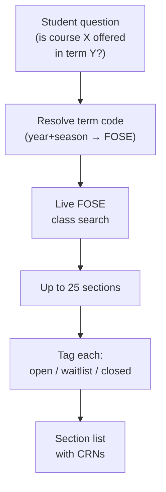
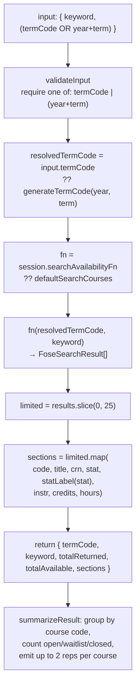
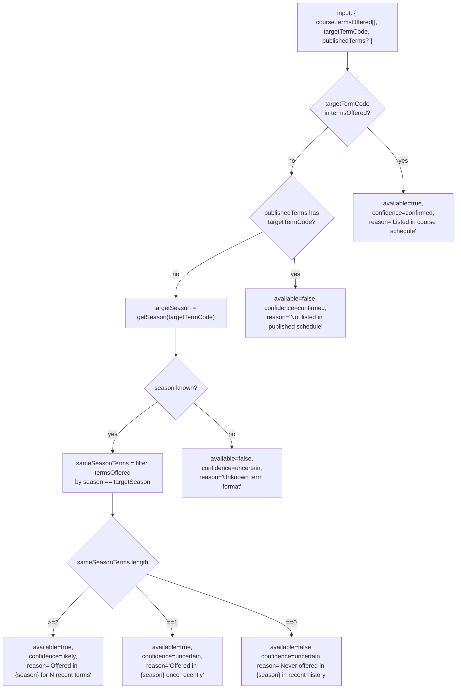

# Tool: `search_availability`

A deep technical audit of the `search_availability` agent tool, derived strictly from the implementation. All claims are anchored to file paths and line numbers in the engine source.

Primary source files:
- `packages/engine/src/agent/tools/searchAvailability.ts`
- `packages/engine/src/search/availabilityPredictor.ts` (per-course historical predictor — separate code path not currently invoked by the tool)
- `packages/engine/src/agent/tool.ts` (tool framework contract)

Indirect (referenced by `searchAvailability.ts`):
- `packages/engine/src/api/nyuClassSearch.ts` — provides `searchCourses` (the live FOSE client), `generateTermCode`, and the `FoseSearchResult` type.

---

## TL;DR

When a student asks "is CSCI-UA 480 actually being offered this fall?", "what sections of calculus run next semester?", or "is there an open seat in Intro to Psych?", this tool hits NYU's live class-search system (FOSE) to find out. It's the canonical "before you recommend a section, verify it's real" check — the assistant calls it before quoting a specific CRN to a student. You give it a term (either as a 4-digit FOSE code, or — better — as year + season since FOSE codes are easy to mistype) plus a course code or prefix, and it returns up to 25 sections with status (open / waitlist / closed), instructor, credits, and meeting hours. It needs nothing from the student profile to run. If the term hasn't been published yet or the course isn't offered, you get an empty result set rather than a guess.



---

## 1. Purpose

`search_availability` answers the question: **is this course actually offered in a given NYU term, and what are the sections?**

It is the canonical "before you recommend a section, check FOSE" tool. The tool description (`searchAvailability.ts:30-32`) instructs the agent to call it **before** suggesting a specific section in a plan. It wraps NYU's FOSE class-search API and returns up to 25 sections per query with status (open / waitlist / closed), instructor, credits, and meeting hours.

The repo also ships a complementary heuristic predictor in `availabilityPredictor.ts` (a same-season-history rule). That predictor is **not** wired into the `search_availability` tool — the tool always goes to the live FOSE API. The predictor is exposed separately for callers that need a synthesized "likely / uncertain" verdict without a network call. This document covers both, with §5.3 making the boundary explicit.

The tool is registered through `buildTool` (`searchAvailability.ts:28`), inheriting the framework contract at `tool.ts:204-232`.

---

## 2. Input schema

Defined at `searchAvailability.ts:46-52`.

```
search_availability input:
  termCode?: string
    4-digit FOSE term code (regex /^\d{4}$/). Optional.
  year?: integer in [2000, 2099]
    Optional. Paired with `term`.
  term?: "spring" | "summer" | "fall"
    Optional. Paired with `year`.
  keyword: string (min length 2)
    Course-code prefix (e.g. "CSCI-UA") OR full code (e.g. "CSCI-UA 101").
```

The `keyword` field is the only required string. The term must be specified in **one of two equivalent forms**, validated at call time (see §3). The description explains the FOSE encoding (`searchAvailability.ts:39-43`): "`1{lastTwoDigitsOfYear}{4=spring,6=summer,8=fall}` — Fall 2026 = 1268, Spring 2027 = 1274. Most models get this wrong from training data; PREFER the year+term form."

`isReadOnly: true` (`searchAvailability.ts:53`) and `maxResultChars: 2500` (`searchAvailability.ts:54`).

---

## 3. Session prerequisites

`validateInput` (`searchAvailability.ts:55-67`) enforces exactly one constraint: the term must be specifiable, either via `termCode` OR via both `year` and `term`. If neither form is present, validation fails with:

```
Pass either `termCode` (4-digit) OR both `year` (e.g. 2026) and `term`
("spring"/"summer"/"fall"). The year+term form is preferred — the tool
computes the FOSE code so you can't typo it.
```

The tool does **not** require `session.student`, `session.degreeProgressReport`, `session.rag`, or any other session state. It will run for any agent in any state, as long as the term and keyword are valid. This matches its position as a low-prereq lookup primitive.

The only session read is the optional dependency injection point at `searchAvailability.ts:74`: `session.searchAvailabilityFn` — used by unit tests to stub the live FOSE call. In production the default `searchCourses` from `api/nyuClassSearch.ts` is used (`searchAvailability.ts:75`).

---

## 4. What it reads

### 4.1 The FOSE class-search API (live path)

`searchCourses(termCode, keyword)` from `api/nyuClassSearch.ts` is the production injected function (default-imported at `searchAvailability.ts:19`). It returns an array of `FoseSearchResult` objects, each carrying at minimum `code`, `title`, `crn`, `stat`, `instr`, `credits`, `hours` (the fields used at `searchAvailability.ts:88-97`).

The tool calls the function once per invocation (`searchAvailability.ts:81`) and post-processes the response in memory.

### 4.2 The `generateTermCode` helper

When the agent passes `year + term`, the tool calls `generateTermCode(year, term)` (imported at `searchAvailability.ts:20`, invoked at `:80`) to compute the FOSE 4-digit code. This is described in code comments as the authoritative single source of truth for the encoding; the tool relies on it rather than re-implementing the formula. The agent never has to compute the code manually when using the preferred form.

### 4.3 Status code interpretation

The `statLabel` function at `searchAvailability.ts:130-135` is the only mapping:

| `stat` | `statLabel` |
|---|---|
| `"O"` | `"open"` |
| `"W"` | `"waitlist"` |
| `"C"` | `"closed"` |
| anything else | the raw `stat` string |

### 4.4 The complementary heuristic predictor

`availabilityPredictor.ts` is a separate module not wired into the tool but worth documenting because the user task lists it as a referenced file. It reads `course.termsOffered: string[]` — a list of FOSE term codes the course has been offered in — and returns an `AvailabilityResult` with one of `{confirmed, likely, uncertain}`.

It is **not** called by `search_availability`. The tool exclusively uses the live FOSE round-trip.

---

## 5. Algorithm

### 5.1 Pipeline diagram (live FOSE path — actual tool behavior)



### 5.2 Step-by-step (the actual tool flow)

**Step 1 — Validate inputs.** `validateInput` at `searchAvailability.ts:55-67` checks that exactly one of `termCode` or `(year + term)` is fully specified. Anything else returns a `{ ok: false, userMessage }`.

**Step 2 — Resolve `termCode`.** `searchAvailability.ts:79-80`:

```
resolvedTermCode = input.termCode ?? generateTermCode(input.year!, input.term!)
```

The non-null assertions are safe because validation guaranteed at least one of the two forms is fully populated.

**Step 3 — Select the implementation.** `fn = session.searchAvailabilityFn ?? defaultSearchCourses` (`searchAvailability.ts:74-75`). Production uses the live FOSE client; tests inject a stub.

**Step 4 — Call FOSE.** `results = await fn(resolvedTermCode, input.keyword)` (`searchAvailability.ts:81`). Any thrown error propagates up the agent loop; the tool does not wrap it in a try/catch.

**Step 5 — Cap and map.** `limited = results.slice(0, 25)` (`searchAvailability.ts:82`). The mapping at `:88-97` projects each `FoseSearchResult` into a section object with `code`, `title`, `crn`, `stat`, `statLabel`, `instr`, `credits`, `hours`. Both `totalReturned: limited.length` and `totalAvailable: results.length` are returned so the agent can see how many sections were truncated (`searchAvailability.ts:86-87`).

**Step 6 — Summarize.** See §9.

### 5.3 The heuristic predictor flow (separate code path — not invoked by the tool)

`availabilityPredictor.ts` exposes `predictAvailability(course, targetTermCode, publishedTerms?)` (`availabilityPredictor.ts:73-138`). For completeness:



The mapping:

| Condition | `available` | `confidence` | `reason` |
|---|---|---|---|
| `course.termsOffered.includes(targetTermCode)` | `true` | `"confirmed"` | `"Listed in course schedule"` |
| `publishedTerms?.has(targetTermCode)` and the target isn't in `termsOffered` | `false` | `"confirmed"` | `"Not listed in published schedule"` |
| Season unrecognized (last digit isn't 4/6/8) | `false` | `"uncertain"` | `"Unknown term format"` |
| `sameSeasonTerms.length >= 2` | `true` | `"likely"` | `"Offered in {season} for N recent terms"` |
| `sameSeasonTerms.length === 1` | `true` | `"uncertain"` | `"Offered in {season} once recently — may or may not repeat"` |
| `sameSeasonTerms.length === 0` | `false` | `"uncertain"` | `"Never offered in {season} in recent history"` |

Season extraction is the last-digit rule at `availabilityPredictor.ts:31-37`: `4 → spring`, `6 → summer`, `8 → fall`.

`isTermPublished(termCode)` at `availabilityPredictor.ts:43-62` does a one-result `POST` to FOSE with `keyword: "CSCI-UA"`; if `data.count > 0` the term is treated as published. Caller can pass the precomputed set as `publishedTerms` to combine "in this published term" with the historical heuristic.

This predictor's outputs are not currently surfaced through `search_availability`; they are a separate API the engine can layer in elsewhere.

---

## 6. Confidence bands

### 6.1 In the live FOSE tool

The tool does **not** emit a confidence band, nor does it claim "likely / unlikely" beyond what FOSE itself returns. The signal it surfaces is the per-section `stat` (open / waitlist / closed) as a labelled string. The number of sections returned and `totalAvailable` are the closest things to a soft confidence about whether the course is genuinely offered:

- `totalAvailable === 0` → the section list is empty. The summary's "No sections found" line (§9) tells the agent to consider that the course may not be offered or the keyword too narrow.
- `totalAvailable > 0` → the course is definitively offered in that term. Status per section is exact.

### 6.2 In the heuristic predictor

`AvailabilityConfidence = "confirmed" | "likely" | "uncertain"` (`availabilityPredictor.ts:10`). The mapping to thresholds is the discrete-count rule in §5.3's table. There is no numeric threshold — the bands are decided by the count of same-season historical offerings.

Note the asymmetry between the two modules: the live tool emits `stat` letters (FOSE-native), the predictor emits a three-state confidence string. They are not interchangeable: a `confirmed` predictor output means the target term is already in the historical record; a `confirmed` does NOT mean "all sections are open."

---

## 7. Returns shape

`searchAvailability.call` returns (`searchAvailability.ts:83-98`):

```
search_availability output:
  termCode: string         (the resolved FOSE 4-digit code)
  keyword: string          (echoes input)
  totalReturned: integer   (length of sections after the 25-cap slice)
  totalAvailable: integer  (length of the raw FOSE response — may exceed 25)
  sections: array of {
    code: string           (e.g. "CSCI-UA 101")
    title: string
    crn: string
    stat: string           (raw FOSE code: "O" | "W" | "C" | other)
    statLabel: string      (mapped: "open" | "waitlist" | "closed" | raw)
    instr: string
    credits: string | number   (whatever FOSE returns)
    hours: string          (meeting-hours string)
  }
```

The predictor's return (for completeness — not exposed via the tool) is `AvailabilityResult` (`availabilityPredictor.ts:12-20`): `{ courseId, available: boolean, confidence: "confirmed"|"likely"|"uncertain", reason: string }`.

---

## 8. Envelope behavior

`search_availability` has no envelope: no `disclaimers`, no `confidence` band on the return, no `coreUa*` overlays, no `transferIntent` tag.

The implicit follow-ups are encoded in the summary's prose:

- **Course may not be offered.** When the result has zero sections, the summary emits "No sections found. The course may not be offered this term, or the keyword may be too narrow." (`searchAvailability.ts:104-106`). The agent is expected to recognize this and either broaden the keyword or report the unavailability to the student.
- **Truncated section list.** When `totalReturned < totalAvailable`, the agent sees the gap on the second summary line and can decide whether to ask the student for a more specific keyword.

Because the tool description (`searchAvailability.ts:30-32`) tells the agent to call this **before** recommending a section, the absence of an envelope is intentional: the FOSE response is authoritative — there is nothing to caveat.

---

## 9. Summary text format

`summarizeResult` (`searchAvailability.ts:100-127`) renders to plain text under `maxResultChars: 2500`.

### 9.1 Header

```
FOSE availability (term=<termCode>, keyword="<keyword>")
Returned <totalReturned> of <totalAvailable> matching sections.
```

(`searchAvailability.ts:102-103`).

### 9.2 Zero-section path

```
No sections found. The course may not be offered this term, or the keyword may be too narrow.
```

(`searchAvailability.ts:104-106`).

### 9.3 Grouped course block

Sections are grouped by their `code` (the FOSE course code, e.g. `CSCI-UA 101`) using a `Map<string, sections[]>` (`searchAvailability.ts:108-113`). For each group:

```
  <code>: <total> sections (<openCount> open, <waitlistCount> waitlist, <closedCount> closed)
    [<statLabel>] CRN <crn>[ [<credits>cr]][ — <instr>]
    [<statLabel>] CRN <crn>[ [<credits>cr]][ — <instr>]
```

(`searchAvailability.ts:115-124`). Per code, only the **first two sections** are shown (`searchAvailability.ts:120`). The credit and instructor segments are conditional — they are appended only when present.

The status counts are computed by filtering on raw `stat === "O" / "W" / "C"` (`searchAvailability.ts:115-117`); any other code is counted into none of the three bins but still listed as `[statLabel]` (which echoes the raw `stat` when unrecognized).

### 9.4 No notes block

Unlike `search_policy` and `search_courses`, there is no `Notes:` block. Diagnostic information lives in the header (`totalReturned of totalAvailable`) and the zero-section fallback.

---

## 10. Interactions with other tools and the system prompt

### 10.1 Hard precondition for section recommendations

The tool description (`searchAvailability.ts:30-32`) instructs the agent to call `search_availability` **before** recommending a specific section. This is the system-prompt-enforced contract: the agent must verify a course is actually offered in the target term rather than assume from training data.

### 10.2 Pair with `plan_forward_degree` / `plan_semester`

The planner tools produce term-level course recommendations. Before the agent quotes a specific section / CRN, it is expected to call `search_availability` for that course-term pair. The tool is read-only and idempotent; the agent can call it multiple times in a single turn without side effects.

### 10.3 Pair with `search_courses`

`search_courses` answers "what courses exist?" `search_availability` answers "is it actually offered this term?" The two have **no shared state** — `search_availability` does not honor the home-school accessibility tier, does not drop completed courses, and does not consult the DPR. It is intentionally a thin wrapper over FOSE.

### 10.4 Term-code authority

`generateTermCode` is the single source of truth for the FOSE encoding. The tool's description warns the agent that "Most models get this wrong from training data; PREFER the year+term form" (`searchAvailability.ts:40-43`). The two-input contract effectively forces the agent to delegate the encoding to the tool whenever it doesn't already have a confirmed `termCode`.

### 10.5 Composition mode

Inherits `outputMode: "synthesis"` from `buildTool` (`tool.ts:260`). The agent may paraphrase the section list; there is no semi-hardened verbatim text the validator must check.

### 10.6 Predictor vs live tool

The system prompt does not currently force a choice between the predictor and the live tool. Because `search_availability` is the only registered tool of the two, the agent's only callable path is the live one. The predictor remains internal infrastructure for engine code that needs offline reasoning.

---

## 11. Edge cases

### 11.1 Neither `termCode` nor `(year + term)`

`validateInput` returns `{ ok: false, userMessage: "Pass either `termCode` (4-digit) OR both `year` (e.g. 2026) and `term` ..."` (`searchAvailability.ts:58-65`). The tool never runs.

### 11.2 `termCode` with bad format

The Zod schema's regex `/^\d{4}$/` (`searchAvailability.ts:48`) rejects anything that isn't exactly 4 digits. Validation fails before the tool runs.

### 11.3 Both `termCode` and `(year + term)` specified

The tool prefers `input.termCode` because of the `??` precedence at `searchAvailability.ts:79-80`. The `year + term` pair is ignored in this case. There is no consistency check that the explicit `termCode` matches what `generateTermCode(year, term)` would produce.

### 11.4 FOSE returns more than 25 sections

`results.slice(0, 25)` (`searchAvailability.ts:82`) caps the section list. The summary header shows `Returned 25 of <N>` so the agent sees the truncation explicitly.

### 11.5 FOSE returns zero sections

`limited.length === 0`. The summary emits the zero-section message (`searchAvailability.ts:104-106`) and the agent has structured data: `totalReturned: 0`, `totalAvailable: 0`, `sections: []`.

### 11.6 FOSE call fails

The fetch call is not wrapped in try/catch inside the tool (`searchAvailability.ts:81` calls `fn(...)` directly with `await`). Any thrown error propagates up to the agent loop, which surfaces it as a tool error to the agent. The predictor's `isTermPublished` (`availabilityPredictor.ts:43-62`) is the only place with a try/catch — it returns `false` on any failure — but that helper is not called by the tool.

### 11.7 Unknown `stat` code

`statLabel` returns the raw code unchanged (`searchAvailability.ts:130-135`). The status-count line in the summary does not count unknown codes into any of the three bins. The section is still listed with its raw label.

### 11.8 Keyword too broad

A keyword like `UA` could match many course codes; FOSE may return hundreds of sections, the tool caps at 25, the agent sees the `Returned 25 of <larger N>` header and can decide to narrow the keyword.

### 11.9 Keyword too narrow

If the keyword filters out everything, FOSE returns zero sections — the zero-section path renders the broaden-the-keyword hint.

### 11.10 Term not yet published

The live tool will simply receive an empty section list and render the zero-section message. The tool does not call the predictor or `isTermPublished` to differentiate "term not yet published" from "course not in this term." That distinction is callable through the separate predictor API, not through `search_availability`.

### 11.11 Predictor-only edge: unknown season

`getSeason` (`availabilityPredictor.ts:31-37`) returns `null` for any last digit other than 4/6/8. `predictAvailability` then returns `available: false, confidence: "uncertain", reason: "Unknown term format"` (`availabilityPredictor.ts:100-107`). The live tool never reaches this branch.

### 11.12 Predictor-only edge: course never offered in season

`predictAvailability` returns `available: false, confidence: "uncertain"` with reason `"Never offered in {season} in recent history"` (`availabilityPredictor.ts:132-137`). This is the **non-confirmed unavailable** state — historical evidence says no, but the predictor can't rule it out for a still-being-published term. Compare against the `confirmed` unavailable path at `availabilityPredictor.ts:88-96`, which requires the target term to be in the supplied `publishedTerms` set.
