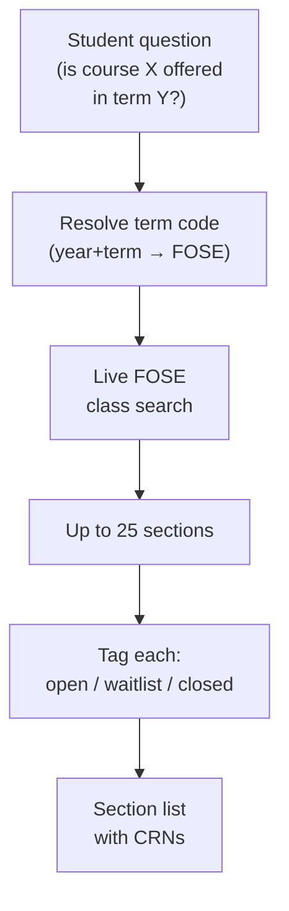
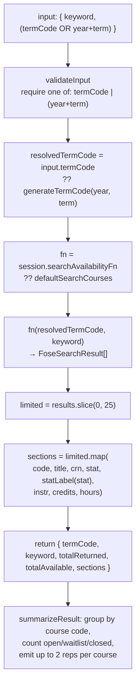

# Tool: `search_availability`

> Last verified against code: 2026-06-10 (post planning-engine rebuild, PRs #35-#41).

A deep technical audit of the `search_availability` agent tool, derived strictly from the implementation. All claims are anchored to file paths and line numbers in the engine source.

Primary source files:
- `packages/engine/src/agent/tools/searchAvailability.ts`
- `packages/engine/src/api/nyuClassSearch.ts` — provides `searchCourses` (the live FOSE client), `generateTermCode`, and the `FoseSearchResult` type
- `packages/engine/src/data/foseTerm.ts` — the authoritative `encodeFoseTerm` term-code encoder
- `packages/engine/src/agent/tool.ts` (tool framework contract)

> **The old heuristic predictor is gone.** Earlier versions of this doc described a `search/availabilityPredictor.ts` module (a same-season-history "confirmed / likely / uncertain" verdict) as a "complementary" code path. That file — and the entire `packages/engine/src/search/` directory — **no longer exists** (deleted in the cleanup pass). `search_availability` has exactly one behavior: a live round-trip to NYU's FOSE class-search API. There is no offline predictor, no `predictAvailability`, no `isTermPublished` helper, and no three-state confidence verdict anywhere in the engine. This doc covers only what the tool actually does.

---

## Purpose

`search_availability` answers one question: **is this course actually offered in a given NYU term, and what are the sections?** When a student asks "is CSCI-UA 480 being offered this fall?", "what sections of calculus run next semester?", or "is there an open seat in Intro to Psych?", this tool hits NYU's live class-search system (FOSE) to find out. It is the canonical "before you recommend a section, verify it's real" check — the agent is told to call it before quoting a specific section/CRN to a student (`searchAvailability.ts:30-32`).

You give it a term (either as a 4-digit FOSE code, or — better — as `year` + `term`, since the FOSE codes are easy to mistype) plus a course code or prefix, and it returns up to 25 sections with open/waitlist/closed status, instructor, and credits. It needs nothing from the student profile to run. If the term hasn't been published yet or the course isn't offered, you get an empty result set rather than a guess.



---

## 1. Input schema

Defined at `searchAvailability.ts:46-52`.

```
search_availability input:
  termCode?: string
    4-digit FOSE term code (regex /^\d{4}$/). Optional.
  year?: integer in [2000, 2099]
    Optional. Paired with `term`.
  term?: "spring" | "summer" | "fall"
    Optional. Paired with `year`.
  keyword: string (min length 2)
    Course-code prefix (e.g. "CSCI-UA") OR full code (e.g. "CSCI-UA 101").
```

The `keyword` field is the only required string. The term must be specified in **one of two equivalent forms** (see §2). The description explains the FOSE encoding (`searchAvailability.ts:38-41`): "`1{lastTwoDigitsOfYear}{4=spring,6=summer,8=fall}` — Fall 2026 = 1268, Spring 2027 = 1274. Most models get this wrong from training data; PREFER the year+term form."

`isReadOnly: true` (`searchAvailability.ts:53`) and `maxResultChars: 2500` (`searchAvailability.ts:54`).

---

## 2. Session prerequisites

`validateInput` (`searchAvailability.ts:55-67`) enforces exactly one constraint: the term must be specifiable, either via `termCode` OR via both `year` and `term`. If neither form is present, validation fails with:

```
Pass either `termCode` (4-digit) OR both `year` (e.g. 2026) and `term`
("spring"/"summer"/"fall"). The year+term form is preferred — the tool
computes the FOSE code so you can't typo it.
```

The tool does **not** require `session.student`, `session.degreeProgressReport`, `session.rag`, or any other session state. It runs for any agent in any state, as long as the term and keyword are valid. This matches its position as a low-prereq lookup primitive.

The only session read is an optional dependency-injection point at `searchAvailability.ts:74`: `session.searchAvailabilityFn`, used by unit tests to stub the live FOSE call. In production no `searchAvailabilityFn` is injected (the chat route never sets it), so the default live client is always used (§3).

---

## 3. What it reads

### 3.1 The FOSE class-search API (the only path)

`fn = session.searchAvailabilityFn ?? defaultSearchCourses` (`searchAvailability.ts:74-75`). The default is `searchCourses` from `api/nyuClassSearch.ts` (`searchAvailability.ts:19`), which POSTs to `https://bulletins.nyu.edu/class-search/api/?page=fose&route=search` with `{ other: { srcdb: termCode }, criteria: [{ field: "keyword", value: keyword }] }` and returns the `results` array (`nyuClassSearch.ts:153-175`).

> Note: unlike the section-materialization tool, `search_availability` calls the FOSE client **directly**. The cached / gated FOSE path (`agent/sectionMaterialization/foseCache.ts`, `foseAvailabilityGate.ts`) belongs to the `materialize_sections` tool, not to this one. `search_availability` does no caching — every call is a fresh live round-trip.

Each `FoseSearchResult` carries `code`, `title`, `crn`, `stat`, `instr`, `credits` (the fields the tool projects at `searchAvailability.ts:88-97`).

### 3.2 The `generateTermCode` helper

When the agent passes `year + term`, the tool calls `generateTermCode(year, term)` (`searchAvailability.ts:20`, invoked at `:80`) to compute the FOSE 4-digit code. `generateTermCode` delegates to `encodeFoseTerm` in `data/foseTerm.ts`, the authoritative single source of truth for the encoding (`nyuClassSearch.ts:114-119`). The agent never has to compute the code manually when using the preferred form.

### 3.3 Status code interpretation

`statLabel` (`searchAvailability.ts:130-135`) is the only mapping:

| `stat` | `statLabel` |
|---|---|
| `"O"` | `"open"` |
| `"W"` | `"waitlist"` |
| `"C"` | `"closed"` |
| anything else | the raw `stat` string |

(FOSE may also return `"A"` = active/pre-reg per `nyuClassSearch.ts:35`; the tool passes that through unmapped.)

---

## 4. Algorithm



**Step 1 — Validate inputs.** `validateInput` (`searchAvailability.ts:55-67`) checks that exactly one of `termCode` or `(year + term)` is fully specified.

**Step 2 — Resolve `termCode`.** `resolvedTermCode = input.termCode ?? generateTermCode(input.year!, input.term!)` (`searchAvailability.ts:79-80`). The non-null assertions are safe because validation guaranteed at least one form is fully populated.

**Step 3 — Select the implementation.** `fn = session.searchAvailabilityFn ?? defaultSearchCourses` (`searchAvailability.ts:74-75`). Production uses the live FOSE client; tests inject a stub.

**Step 4 — Call FOSE.** `results = await fn(resolvedTermCode, input.keyword)` (`searchAvailability.ts:81`). Any thrown error propagates up the agent loop — the tool does **not** wrap it in a try/catch.

**Step 5 — Cap and map.** `limited = results.slice(0, 25)` (`searchAvailability.ts:82`). The mapping at `:88-97` projects each `FoseSearchResult` into a section object. Both `totalReturned: limited.length` and `totalAvailable: results.length` are returned so the agent sees how many sections were truncated.

**Step 6 — Summarize.** See §6.

---

## 5. Confidence and the `hours` field

The tool does **not** emit a confidence band. The signal it surfaces per section is the FOSE-native `stat` (open / waitlist / closed) as a labelled string. The soft "is this course genuinely offered" signal is the result count:

- `totalAvailable === 0` → the section list is empty; the "No sections found" line (§6) tells the agent the course may not be offered or the keyword may be too narrow.
- `totalAvailable > 0` → the course is offered in that term; per-section status is exact.

> **Known limitation — `hours` is always empty.** The tool projects `hours: r.hours` into every section (`searchAvailability.ts:96`), but the FOSE *search* endpoint does **not** return an `hours` field on search rows. `nyuClassSearch.ts:42-58` marks `FoseSearchResult.hours` `@deprecated` and notes it is "always undefined on real FOSE responses" — verified across 27 fixtures / 514 rows. The real meeting-time data lives in `meets` / `meetingTimes` (which this tool does **not** currently read or surface). So in practice `section.hours` is undefined, and the summary never prints meeting hours. Treat the tool as returning status + instructor + credits, not meeting times.

---

## 6. Returns shape

`searchAvailability.call` returns (`searchAvailability.ts:83-98`):

```
search_availability output:
  termCode: string         (the resolved FOSE 4-digit code)
  keyword: string          (echoes input)
  totalReturned: integer   (length of sections after the 25-cap slice)
  totalAvailable: integer  (length of the raw FOSE response — may exceed 25)
  sections: array of {
    code: string           (e.g. "CSCI-UA 101")
    title: string
    crn: string
    stat: string           (raw FOSE code: "O" | "W" | "C" | other)
    statLabel: string      (mapped: "open" | "waitlist" | "closed" | raw)
    instr: string          (instructor name(s))
    credits: string        (whatever FOSE returns)
    hours: string          (deprecated — always undefined in practice; see §5)
  }
```

There is **no** envelope on this tool: no `disclaimers`, no `confidence` band, no `coreUa*` overlays, no `transferIntent` tag. The FOSE response is authoritative, so there is nothing to caveat.

---

## 7. Summary text format

`summarizeResult` (`searchAvailability.ts:100-127`) renders to plain text under `maxResultChars: 2500`.

### 7.1 Header

```
FOSE availability (term=<termCode>, keyword="<keyword>")
Returned <totalReturned> of <totalAvailable> matching sections.
```

(`searchAvailability.ts:102-103`).

### 7.2 Zero-section path

```
No sections found. The course may not be offered this term, or the keyword may be too narrow.
```

(`searchAvailability.ts:104-106`). The agent is expected to broaden the keyword or report the unavailability.

### 7.3 Grouped course block

Sections are grouped by their `code` using a `Map<string, sections[]>` (`searchAvailability.ts:108-113`). Per group:

```
  <code>: <total> sections (<openCount> open, <waitlistCount> waitlist, <closedCount> closed)
    [<statLabel>] CRN <crn>[ [<credits>cr]][ — <instr>]
    [<statLabel>] CRN <crn>[ [<credits>cr]][ — <instr>]
```

(`searchAvailability.ts:115-124`). Per code, only the **first two sections** are shown (`searchAvailability.ts:120`). Credit and instructor segments are appended only when present. Status counts filter on raw `stat === "O" / "W" / "C"` (`:115-117`); any other code is counted into none of the three bins but still listed with its `statLabel`.

### 7.4 No notes block

Unlike `search_policy` and `search_courses`, there is no `Notes:` block. Diagnostic info lives in the header (`totalReturned of totalAvailable`) and the zero-section fallback.

---

## 8. Interactions with other tools and the system prompt

### 8.1 Hard precondition for section recommendations

The tool description (`searchAvailability.ts:30-32`) instructs the agent to call `search_availability` **before** recommending a specific section. The agent must verify a course is actually offered in the target term rather than assume from training data.

### 8.2 Pair with `plan_forward_degree`

The planner produces term-level course recommendations. Before the agent quotes a specific section / CRN it is expected to call `search_availability` for that course-term pair. The tool is read-only and idempotent; the agent can call it multiple times in a turn without side effects. (Note: `plan_semester` no longer exists — it was removed in the rebuild; `plan_forward_degree` is the planner.)

### 8.3 Boundary with `search_courses`

[`search_courses`](search_courses.md) answers "what courses exist?"; `search_availability` answers "is it actually offered this term?" The two share **no** state — `search_availability` does not honor the home-school accessibility tier, does not drop completed courses, and does not consult the DPR. It is intentionally a thin wrapper over FOSE.

### 8.4 Term-code authority

`generateTermCode` (→ `encodeFoseTerm`) is the single source of truth for the FOSE encoding. The two-input contract effectively forces the agent to delegate the encoding to the tool whenever it doesn't already have a confirmed `termCode`.

### 8.5 Composition mode

Inherits `outputMode: "synthesis"` from `buildTool`. The agent may paraphrase the section list; there is no semi-hardened verbatim text the validator must check.

---

## 9. Edge cases

| Case | Behavior |
|---|---|
| Neither `termCode` nor `(year + term)` | `validateInput` returns `{ ok:false, … }` (`searchAvailability.ts:58-65`); tool never runs |
| `termCode` with bad format | Zod regex `/^\d{4}$/` rejects anything not exactly 4 digits (`searchAvailability.ts:48`) |
| Both `termCode` and `(year + term)` | `input.termCode` wins via `??` (`searchAvailability.ts:79-80`); the year+term pair is ignored. No consistency check that they agree |
| FOSE returns > 25 sections | `slice(0, 25)` caps the list (`searchAvailability.ts:82`); header shows `Returned 25 of <N>` |
| FOSE returns zero sections | `totalReturned: 0`, `totalAvailable: 0`, `sections: []`; zero-section message renders |
| FOSE call fails | The error propagates to the agent loop (no try/catch in the tool, `searchAvailability.ts:81`) |
| Unknown `stat` code | `statLabel` returns the raw code; the count line bins it into none of open/waitlist/closed but still lists it |
| Keyword too broad (e.g. "UA") | FOSE may return hundreds of sections; the 25-cap + `Returned 25 of <N>` header let the agent decide to narrow |
| Term not yet published | FOSE returns an empty list; the zero-section message renders. The tool does not distinguish "term unpublished" from "course not offered" |
