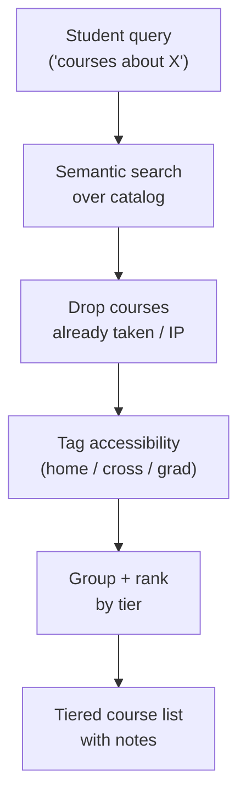
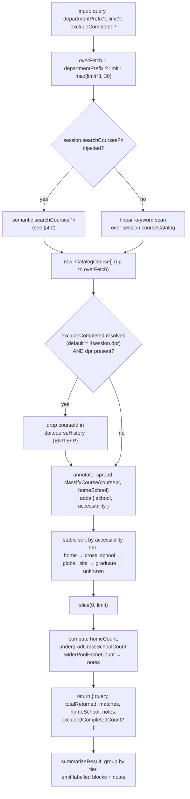

# Tool: `search_courses`

A deep technical audit of the `search_courses` agent tool, derived strictly from the implementation. All claims are anchored to file paths and line numbers in the engine source.

Primary source files:
- `packages/engine/src/agent/tools/searchCourses.ts`
- `packages/engine/src/agent/tools/semanticCourseSearch.ts` (semantic adapter wired in at session bootstrap)
- `packages/engine/src/data/courseSuffixMap.ts` (accessibility classifier — imported as `classifyCourseAccessibility`)
- `packages/engine/src/agent/tool.ts` (tool framework contract)

---

## TL;DR

When a student says something like "find me courses about machine learning", "what philosophy electives are open to me?", or "are there any creative writing classes I haven't taken?", this is the tool that searches the catalog. It uses semantic similarity — i.e. it understands meaning, not just keywords — so a query like "courses about AI" will surface CSCI-UA 472 even though the title says "Machine Learning." Critically, it filters results by the student's home school so it doesn't suggest Stern courses to a CAS student without flagging them as cross-school. If the student's transcript is loaded, it also drops courses they've already completed or are currently taking. Results are bucketed into tiers: "open to you", "cross-school (needs approval)", "global site (study abroad only)", "graduate (petition only)". It's a discovery tool — for actual semester planning, the assistant uses a different tool. There's also an exact-code fast path so a query like "CSCI-UA 421" returns just that course.



---

## 1. Purpose

`search_courses` is the agent's catalog-discovery tool. It answers questions of the form:

- "Find courses about [topic]" / "what ML courses exist?"
- "Suggest a CS elective I haven't taken yet"
- "What 4000-level math courses are offered?"
- "Does CSCI-UA 480 exist in the catalog?" (raw lookup mode)

The tool searches the bundled NYU course catalog (subject + catalog number + title + optional description), applies an **accessibility classifier** that maps each course to one of {home school, cross-school, global site, graduate, unclassified} relative to the student's home school, drops courses the student has already completed or is currently taking (by default when a DPR is loaded), and returns a sorted, grouped result.

The tool is **explicitly not** the planner. Its description (`searchCourses.ts:52-54`) calls out that "plan my next semester" is `plan_forward_degree`'s job; `search_courses` returns the broader catalog and is used for elective discovery and one-off lookups.

It is registered via `buildTool` (`searchCourses.ts:35`) which wraps it with the standard read-only, schema-validated, `summarizeResult`-rendered shape from `tool.ts:204-232`.

---

## 2. Input schema

Defined at `searchCourses.ts:55-61`.

```
search_courses input:
  query: string (min length 2)
    Keyword to search for in course titles + ids.
  departmentPrefix?: string
    e.g. "CSCI-UA" to limit to CS. Optional; case-insensitive.
  limit?: int in [1, 50]
    Max matches returned. Defaults to 20.
  excludeCompleted?: boolean
    Drops courses already completed (DPR type EN or TE) OR currently
    in progress (DPR type IP). Default = true when the DPR is loaded,
    false otherwise. Pass false explicitly for raw catalog browsing.
```

The tool is `isReadOnly: true` (`searchCourses.ts:62`) and `maxResultChars: 2500` (`searchCourses.ts:63`).

---

## 3. Session prerequisites

`validateInput` is a no-op — always returns `{ ok: true }` (`searchCourses.ts:64-66`). The tool is callable any time.

It reads (but does not require) the following from `session`:

| Field | Used by |
|---|---|
| `session.courseCatalog` (off-type extension cast at `searchCourses.ts:71-74`) | Fallback in-process keyword scan when no `searchCoursesFn` injection is present |
| `session.searchCoursesFn` (off-type extension) | Preferred path: a `CourseSearchFn` (typically the semantic adapter from `semanticCourseSearch.ts`) |
| `session.student.homeSchool` | Drives accessibility classification + ranking |
| `session.degreeProgressReport` | Source of `courseHistory` used to skip completed / in-progress courses |

If neither `searchCoursesFn` nor `courseCatalog` is set, `raw` ends up empty and the tool returns zero matches with the "No courses matched" note (`searchCourses.ts:91-108`, summary at `:190-192`).

If `session.student` is missing the home school, accessibility tiers degrade — see §11.4.

---

## 4. What it reads

### 4.1 Two execution paths into the catalog

`searchCourses.call` (`searchCourses.ts:70-184`) chooses between two providers:

1. **`session.searchCoursesFn` (preferred).** Invoked at `searchCourses.ts:92-96` with `(input.query, { departmentPrefix, limit: overFetch })`. In production this is wired to the embedding-backed adapter built by `createSemanticCourseSearchFn` (`semanticCourseSearch.ts:114-266`). The adapter returns `CatalogCourse[]` already ranked by cosine similarity over OpenAI `text-embedding-3-small` (or whatever embedder is bound).
2. **`session.courseCatalog` (fallback).** A plain in-memory list of `CatalogCourse` objects (`{ courseId, title, description?, credits?, prereqs? }`). The tool runs a linear case-insensitive substring scan over the concatenated `courseId + title + description` (`searchCourses.ts:97-108`).

### 4.2 Semantic adapter internals

`createSemanticCourseSearchFn(opts)` (`semanticCourseSearch.ts:114-266`):

- Loads two artifacts lazily on first search: a JSON file of `{courseCode, title, description}` rows (`semanticCourseSearch.ts:145`), and a sidecar of embeddings — either a streaming JSONL file (`semanticCourseSearch.ts:78-107`, `:153`) or a legacy JSON wrapper (`:155-164`).
- Validates the embedder's `dim` against the embeddings-meta file's `dimension` eagerly at construction time (when `validateMetaEager` is on) and again at first load (`semanticCourseSearch.ts:129-138`, `:166-172`).
- Caches the merged catalog (course rows + per-course `Float32Array` embedding) in a closure-scoped variable; subsequent calls reuse it (`semanticCourseSearch.ts:140-181`).

At query time inside the adapter (`semanticCourseSearch.ts:207-263`):

1. **Exact-id fast path.** If the query matches `^([A-Z]+(?:-[A-Z]+)?)\s+(\d+[A-Z]?)$` (`semanticCourseSearch.ts:220`), it tries a canonical-case exact-string lookup against the catalog (`:222-233`). On hit it returns just that course (plus up to `limit-1` neighbors, but the slice at `:228` actually returns only the exact matches). On miss it falls through to semantic so the agent sees nearest neighbors and can detect the gap.
2. **Query embedding.** `embedder.embed(query)` runs (`:236-242`). On failure (caught in a try/catch, logged via `console.warn`), the adapter degrades to the keyword scan (`keywordScan`, `:189-205`).
3. **Cosine over the catalog.** For each course with an embedding and a passing `departmentPrefix` prefix, the dot product is computed (`cosineDot`, `:183-187`) and pushed to a scored array (`:251-256`).
4. **Sort + trim.** Sorted descending by score; the top `min(limit, candidatePool)` (default `candidatePool = 200`) are returned with the embedding field stripped (`:257-262`).

Importantly the **vectors are pre-normalized**: the adapter computes a plain dot product, not a cosine with on-the-fly normalization. This means whichever embedder was used to build the JSONL must emit unit-norm vectors.

### 4.3 Accessibility classifier

`classifyCourseAccessibility(courseId, homeSchool)` (imported at `searchCourses.ts:18` and aliased locally as `classifyCourse` at `searchCourses.ts:33`) returns a record shaped roughly:

```
{ school: string, accessibility: "home" | "cross_school" | "global_site" | "graduate" | "unknown" }
```

The output is spread onto every result row at `searchCourses.ts:141-144`. The classification is what drives both the post-search sort and the grouped summary output.

### 4.4 DPR `courseHistory`

When `session.degreeProgressReport` is present, the tool reads `dpr.courseHistory` (`searchCourses.ts:122-129`) and builds a `Set` of canonical "SUBJECT CATALOGNBR" strings (uppercased, trimmed). The set is used to drop already-seen courses. The DPR distinguishes types EN (earned), TE (transfer-equivalent), IP (in-progress), etc. — the tool **does not branch on the type**; it skips every history entry regardless of status (`:124-129`). Comments in code call out that pre-fix behavior only excluded EN/TE; the current behavior drops IP as well.

---

## 5. Algorithm

### 5.1 Pipeline diagram



### 5.2 Step-by-step

**Step 1 — Resolve `limit` and `overFetch`.** Default `limit = 20` (`searchCourses.ts:77`). When no `departmentPrefix` is provided, `overFetch = max(limit*3, 30)` (`searchCourses.ts:90`). With a `departmentPrefix`, `overFetch = limit` because the prefix already narrows the result set enough that further over-fetching wastes work.

**Step 2 — Fetch candidates.** Either the injected `searchCoursesFn` is called with `overFetch` as the limit (`searchCourses.ts:92-96`), or the fallback linear scan over `session.courseCatalog` collects up to `overFetch` matches (`:97-108`). The scan concatenates `courseId + title + description` lowercased and substring-matches the lowercased query; if `departmentPrefix` is set, courses whose `courseId` uppercased doesn't start with that prefix are filtered out (`:104`).

**Step 3 — Resolve `excludeCompleted`.** `excludeCompleted = input.excludeCompleted ?? !!session.degreeProgressReport` (`searchCourses.ts:120`). So:

- If the caller passes `excludeCompleted: false`, exclusion is skipped.
- If the caller passes `excludeCompleted: true` but no DPR is loaded, exclusion is skipped (the inner guard at `:121` requires the DPR).
- If the caller omits the flag and a DPR is loaded, exclusion runs.

**Step 4 — Drop completed / in-progress courses.** When exclusion is active, build a `Set` from `dpr.courseHistory` (`:124-129`) and filter `raw` to exclude any match whose `courseId` is in the set (`:131-133`). `droppedAsCompleted` records the count for the envelope.

**Step 5 — Annotate accessibility.** Every surviving row is spread with `classifyCourse(c.courseId, homeSchool)` (`searchCourses.ts:141-144`), producing `{ ...course, school, accessibility }`.

**Step 6 — Stable accessibility sort.** Sort key is the `order` map at `searchCourses.ts:149`: `home: 0`, `cross_school: 1`, `global_site: 2`, `graduate: 3`, `unknown: 4`. The sort is stable, so within a tier the semantic ranking (or scan order) is preserved.

**Step 7 — Trim to `limit`.** `matches = annotated.slice(0, limit)` (`searchCourses.ts:151`). The 3× over-fetch from step 1 ensures that home-school undergrad courses surface even when the raw similarity ranker buried them under graduate / cross-school courses.

**Step 8 — Diagnostic notes.** Count `homeCount`, `undergradCrossSchoolCount`, `widerPoolHomeCount` (`searchCourses.ts:159-161`). Two conditions push a note (`:163-174`):

- `homeSchool` is set, top-K has zero home AND zero cross-school courses, and matches is non-empty → "No home-school (X) undergraduate matches surfaced for '[query]'. Top results are graduate / cross-school / global-site courses — the student likely cannot register for them. Either narrow the query (add a course-prefix like 'CSCI-UA') or ask the student whether they want broader results."
- top-K has zero home matches but the wider pool has some → "[N] home-school match(es) exist deeper in the result pool but ranked below graduate / cross-school courses. Consider passing a more specific query or departmentPrefix."

**Step 9 — Return the envelope.** See §7.

---

## 6. Confidence bands

`search_courses` does **not** emit a confidence band. It carries no `disclaimers`, no `envelopeConfidence`, no `coreUa*` overlays. The closest thing to a confidence signal is the `notes` array (§5.2 step 8), which is data, not a typed band.

The semantic adapter does not return scores to the tool either — it strips them on output (`semanticCourseSearch.ts:259-262`). So the tool has no way to threshold individual results by confidence; ranking quality is entirely the upstream embedder/reranker's responsibility.

Where confidence-like behavior **does** show up:

- The `accessibility` tier (`home`, `cross_school`, `global_site`, `graduate`, `unknown`) is a deterministic signal of whether the student is likely to be able to register, and it drives both the sort and the summary's group labels (§9).
- The diagnostic notes serve as a soft "this query may need refinement" signal but they are advisory text, not a confidence value.

---

## 7. Returns shape

`searchCourses.call` returns (`searchCourses.ts:176-183`):

```
search_courses output:
  query: string
  totalReturned: integer (length of matches AFTER limit trim)
  matches: array of {
    courseId: string
    title: string
    description?: string
    credits?: number
    prereqs?: string[]
    school: string
    accessibility: "home" | "cross_school" | "global_site" | "graduate" | "unknown"
  }
  homeSchool: string | null
  notes: string[]
  excludedCompletedCount?: integer
    (only present when excludeCompleted was true)
```

Note: `totalReturned === matches.length`. There is no separate "total candidates considered" field exposed in the return — the diagnostic note carries the wider-pool count when relevant, but raw `overFetch` size is not reported.

---

## 8. Envelope behavior

There is no formal envelope on this tool. The closest analogues:

- **Excluded-count signal.** When the DPR-driven filter dropped any matches, `excludedCompletedCount` is non-zero and the summary header includes a parenthetical count (§9).
- **Diagnostic notes.** Surfaced into the summary's `Notes:` block so the agent can decide whether to broaden the query or change the prefix.
- **`homeSchool: null`** signals to the agent that classifications may be approximate (the classifier still runs but the "home" tier may not produce results without a home school to compare against).

Suggested follow-ups are embedded as English sentences inside `notes`, not as a typed action list.

---

## 9. Summary text format

`summarizeResult` (`searchCourses.ts:185-226`) renders to plain text under the `maxResultChars: 2500` cap (`searchCourses.ts:63`, enforced via `buildTool` at `tool.ts:264-269`).

### 9.1 Header line

`COURSE SEARCH (query="<q>"; <N> matches[; <K> hidden because already completed]; home=<schoolOrQuestion>)` (`searchCourses.ts:188-189`). The `<K> hidden because already completed` clause appears only when `excludedCompletedCount > 0`. `home` shows `?` when `homeSchool` was null.

### 9.2 Zero-match path

If `matches.length === 0`, the body is just `No courses matched. Try a broader keyword or remove department filter.` (`searchCourses.ts:190-193`).

### 9.3 Grouped blocks

Matches are bucketed by `accessibility` tier (`searchCourses.ts:196-199`) and emitted in fixed order (`:207`):

| Tier | Section label (`:200-206`) |
|---|---|
| `home` | `AT YOUR HOME SCHOOL (open enrollment for you)` |
| `cross_school` | `CROSS-SCHOOL (likely needs approval to count toward your degree)` |
| `global_site` | `GLOBAL SITE (only via a study-abroad term)` |
| `graduate` | `GRADUATE (not open to undergrads except by petition)` |
| `unknown` | `UNCLASSIFIED` |

Each match within a section renders as:

```
  <courseId> (<school>): <title>[ [<credits>cr]]
```

(`searchCourses.ts:212-213`). Credits are omitted when undefined.

### 9.4 Notes block

When `notes` is non-empty, an additional block follows (`searchCourses.ts:219-224`):

```

Notes:
  • <note 1>
  • <note 2>
```

These are the diagnostic strings from §5.2 step 8 — telling the agent to narrow the query, add a prefix, or ask the student to broaden the search.

---

## 10. Interactions with other tools and the system prompt

### 10.1 Boundary with `plan_forward_degree`

The tool description (`searchCourses.ts:52-54`) is explicit: "DO NOT call this for 'plan my next semester' — that's `plan_forward_degree`'s job. search_courses returns the broader catalog; plan_forward_degree walks the student's specific not-yet-satisfied requirements across every remaining term." This boundary is enforced via the description (read by the agent at tool-selection time), not by code.

### 10.2 Default exclusion of in-progress + completed

When the DPR is loaded the default behavior is to exclude **both** completed (EN/TE) and in-progress (IP) courses (`searchCourses.ts:120-135`). The description tells the agent: "the only time to pass `excludeCompleted: false` is raw catalog browsing." The tool's filter set is built from `dpr.courseHistory` directly; the system prompt does not need to remind the agent which courses are taken because they are already gone from the result.

### 10.3 Accessibility hand-off

The `accessibility` tier on each match is the agent's structured signal for whether to qualify a recommendation ("this is at Tandon — you'd need cross-school approval"). The summary's tier labels (§9.3) carry the same information for the agent's reading layer. The system prompt does not invent these caveats — they ride along with the data.

### 10.4 Embedder shared with `search_policy`

The semantic adapter (`semanticCourseSearch.ts`) consumes an `Embedder` from the same package as the RAG bundle (`semanticCourseSearch.ts:22`). In production the dimension is validated against the embeddings sidecar (`semanticCourseSearch.ts:129-138`, `:166-172`); a mismatch throws at construction or first call, so a misconfigured deployment fails loudly instead of returning silently wrong rankings.

### 10.5 Composition mode

Inherits the default `outputMode: "synthesis"` from `buildTool` (`tool.ts:260`). There is no verbatim text the agent must include unchanged.

---

## 11. Edge cases

### 11.1 No catalog and no `searchCoursesFn`

The off-type cast at `searchCourses.ts:71-74` returns `undefined` for both. The fallback at `:98` uses `[]` as the catalog, so `raw` ends up empty. `matches` is empty, `totalReturned` is 0, the summary emits "No courses matched."

### 11.2 Exact-id query

The semantic adapter's exact-id fast path (`semanticCourseSearch.ts:220-233`) catches queries like `CSCI-UA 421`. If the catalog has the course it returns just that course (the agent sees `totalReturned: 1`). If it doesn't, the adapter falls through to semantic neighbors so the agent can detect the miss because none of the returned ids will equal the query. This is described in the code as the fix for a pre-Phase-8 failure mode where the agent would claim a course didn't exist after seeing the nearest neighbor.

### 11.3 Embedder failure

The adapter wraps `embedder.embed(query)` in try/catch (`semanticCourseSearch.ts:236-242`); on failure it logs a warning and falls back to a linear keyword scan via `keywordScan` (`:189-205`). The tool itself never sees the failure.

### 11.4 Missing home school

`homeSchool = session.student?.homeSchool` (`searchCourses.ts:140`) can be undefined. `classifyCourse(c.courseId, undefined)` still runs — it returns whatever the classifier maps to when no home is supplied (probably the unknown tier for most courses). The summary header shows `home=?` (`:189`). The diagnostic note that requires `homeSchool` (`:163`) skips silently.

### 11.5 `limit` clamping

The Zod schema enforces `limit ∈ [1, 50]` (`searchCourses.ts:58`). A request with `limit: 100` is rejected by validation before `call` runs.

### 11.6 `excludeCompleted: false` with DPR loaded

The exclusion branch is skipped entirely (`searchCourses.ts:121`). `excludedCompletedCount` is omitted from the return (`:182`, conditional spread). Raw catalog browsing returns courses already on the transcript.

### 11.7 All matches in one tier

The grouped summary only emits tier sections that have content (`searchCourses.ts:209`). No empty section headers.

### 11.8 Over-fetch pool exhausted

When the upstream provider returns fewer than `overFetch` rows, the tool just works with what's available. The wider-pool-hint note (`searchCourses.ts:169-173`) only fires when `widerPoolHomeCount > 0`, so it stays silent when the entire pool is small.

### 11.9 DPR with no `courseHistory`

The for-loop at `searchCourses.ts:124-129` iterates over the array. If `courseHistory` is empty, `skipIds` is empty, nothing is filtered, `droppedAsCompleted = 0`, and `excludedCompletedCount` renders as `0` — which the summary header suppresses (the `excl > 0` guard at `:188`).

### 11.10 Embedding dimension mismatch (semantic adapter)

`createSemanticCourseSearchFn` validates `embedder.dim` against the embeddings file's `dimension` at construction (`semanticCourseSearch.ts:129-138`) when `validateMetaEager` is on (default) and again at first catalog load (`:166-172`). On mismatch it throws with a clear message. The tool never sees a stale dimension condition; the engine fails to start instead.

### 11.11 Very long descriptions

The summary does not truncate per-match; only the overall summary is capped at 2500 chars via `buildTool` (`tool.ts:264-269`). A query that surfaces many long-titled matches can hit the cap and have the trailing matches cut off with an appended `…`.

### 11.12 `query` shorter than 2 characters

Rejected by the Zod schema (`searchCourses.ts:56`) before `call` runs. The agent gets the validation error back through the tool loop.

### 11.13 Department prefix with no matches

When `departmentPrefix` filters everything out, the upstream provider returns an empty list, `matches` is empty, the summary emits "No courses matched. Try a broader keyword or remove department filter." (`searchCourses.ts:191`). The diagnostic notes do not fire because `matches.length === 0` is the explicit guard at `:163`.
