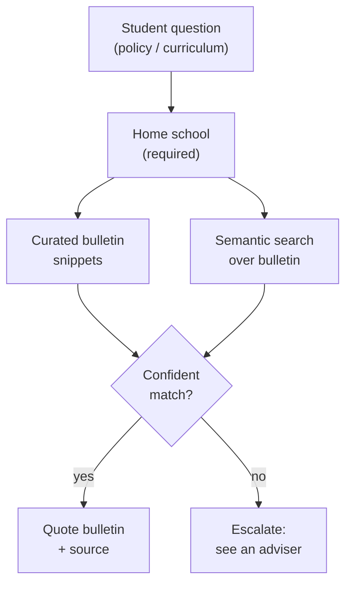
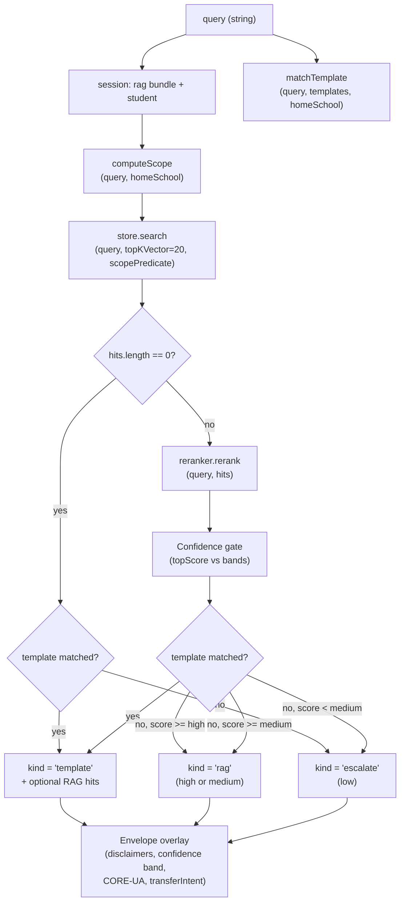

# Tool: `search_policy`

A deep technical audit of the `search_policy` agent tool, derived strictly from the implementation. All claims are anchored to file paths and line numbers in the engine source.

Primary source files:
- `packages/engine/src/agent/tools/searchPolicy.ts`
- `packages/engine/src/rag/policySearch.ts`
- `packages/engine/src/rag/ragScopeFilter.ts`
- `packages/engine/src/rag/reranker.ts`
- `packages/engine/src/rag/policyTemplate.ts`
- `packages/engine/src/agent/tool.ts` (tool framework contract)

---

## TL;DR

When a student asks something like "what's the P/F deadline?", "can I count this course toward my major?", "what does CORE-UA 400 fulfill?", or any other rules-and-bulletin question, the assistant fires this tool to look up the actual NYU bulletin text. Think of it as a smart search engine over NYU's policy and curriculum docs that knows which school the student belongs to (so it doesn't quote Stern rules at a CAS student). It first checks a small library of hand-curated, operator-verified policy snippets, and if none match it falls back to a semantic search over the whole bulletin corpus, then re-ranks the top results. The student's home school is required so we can scope the results properly. The tool also tags how confident it is — and if it's not confident, it tells the assistant "don't make up an answer, point them to an adviser." A nice bonus: when the query mentions a CORE-UA course code, it automatically attaches the corresponding requirement range.



> **Update (improvement plan, Phase B) — section-complete retrieval now exists.** The reality-check below described the *pre-Phase-B* behavior. Two changes closed the fragment-level gap:
> 1. **`search_policy` now expands the top hit to its FULL section.** After the rerank, the tool reassembles every chunk that shares the top hit's `(sourcePath, section)` and renders the complete section under a `FULL SECTION` block (`searchPolicy.ts` → `reassembleSection` in `rag/sectionRetrieval.ts`; see §9.1). So even when a policy section was split into several ~500-token windows, the agent now sees the whole section, not just the one window that won the rerank. The per-hit fragments still render below for cross-section breadth.
> 2. **A dedicated `get_program_requirements` tool** returns an entire program/major/minor/Core-Curriculum **page** (every requirement section reassembled in order) with a confidence band — see [get_program_requirements.md](get_program_requirements.md). For "what are ALL the requirements for major X" the agent uses that tool instead of `search_policy`.
>
> The original caveat still applies in spirit for **cross-section** policies whose parts live under *different* headings (e.g. Pass/Fail = a career cap under one heading + a Core exception under another): `search_policy` expands only the **top** hit's section in full, and the other sections still arrive as top-3 fragments. The whole-*page* tool covers that case for program pages; for multi-section *policies* the agent reads the expanded top section plus the fragment hits.

<details><summary>Pre-Phase-B reality check (historical)</summary>

> **Retrieval was single-shot and fragment-level, so multi-section policies could lose their exceptions.** One vector pass (top-20) → rerank → the tool returns the **top 5 chunks** (and `summarizeResult` renders only the top **3** of those, sliced to 1400 chars each — see §9.1). The corpus chunker splits each bulletin page into ~500-token fragments on `#/##/###` headings, so a single program or policy page fragments into a **median of ~13 chunks** (largest pages 73–98). A policy whose parts are scattered across one page — e.g. Pass/Fail = a career cap + a per-term cap + a Core exception + a foreign-language exception + a major-course restriction — could have some of those parts fall outside the top-5/top-3 window and **never reach the agent**. There was **no section-complete retrieval**: the tool returned ranked fragments, not the whole section/page. Each chunk carries `sourcePath` + `section` in `meta`, so whole-section retrieval was *implementable* — Phase B implemented it. Compounding this, the input schema has no result-count knob and the system prompt discourages re-querying (rule 7), so the agent generally can't widen the net on a single question.

</details>

---

## 1. Purpose

`search_policy` is the agent's gateway to NYU's bulletin / policy knowledge base. It serves two question families with one retrieval pipeline:

1. **Policy questions** — pass/fail rules, residency caps, withdrawal deadlines, double-counting, visa enrollment, study-away, internal transfer, declaration rules.
2. **Curriculum / program structure questions** — which courses fulfill a major or minor, what a CORE-UA requirement range means, what counts as an "advanced math elective" for the Math/CS joint major.

The tool returns up to two complementary artifacts:

- A **curated, operator-verified verbatim bulletin quote** ("CURATED TEMPLATE") when a hand-maintained policy template matches the query.
- The **top reranked RAG chunks** from the corpus for additional context.

The agent then decides what to quote and how to caveat it, guided by an envelope that carries a confidence band and an anti-hallucination disclaimer when retrieval was uncertain.

The tool is registered through `buildTool(...)` (`searchPolicy.ts:20`), which gives it the standard read-only, schema-validated, `summarizeResult`-rendered shape defined in `tool.ts:204-232`.

---

## 2. Input schema

Defined at `searchPolicy.ts:66-68`.

```
search_policy input:
  query: string (min length 2)
    Natural-language policy / curriculum question.
```

That is the entire surface: one free-text query. There are no flags for confidence, no scope overrides on the input, no result-count tuning. Every other behavior is computed from the query plus the session state.

---

## 3. Session prerequisites

Checked in `validateInput` at `searchPolicy.ts:75-81`. The tool refuses to run unless **both** conditions hold:

1. `session.rag` is populated — i.e. the engine has finished loading the RAG bundle: vector store, embedder, reranker, and curated templates (see the `ToolSession.rag` type at `tool.ts:65-74`).
2. `session.student` is set — the home school is needed to compute the scope filter (`policySearch` requires `homeSchool` per `policySearch.ts:71`, `ragScopeFilter.ts:23-29`).

Rejection messages (returned to the agent verbatim):

- Missing RAG: `"RAG corpus not loaded."`
- Missing student: `"I need your home school before I can scope a policy lookup."`

The tool also looks at `session.transferIntent` (read at `searchPolicy.ts:152`) and stamps the boolean onto the result. It does **not** read the student's catalog year as a filter — the year is forwarded into `policySearch` options at `searchPolicy.ts:93` but the scope predicate ignores it (`ragScopeFilter.ts:88-91`).

---

## 4. What it reads

### 4.1 The RAG bundle (`session.rag`)

`session.rag` is the typed object plumbed by the engine bootstrap. Its fields, as consumed by `searchPolicy`:

| Field | Where it's used |
|---|---|
| `rag.store` (`VectorStore`) | Vector top-K via `store.search(query, topK, predicate)` — `policySearch.ts:137` |
| `rag.embedder` (`Embedder`) | Implicitly — the store and reranker both rely on the embedder bound at bundle build time |
| `rag.reranker` (`Reranker`) | `reranker.rerank(query, hits)` — `policySearch.ts:169` |
| `rag.templates` (`PolicyTemplate[]`) | Curated bulletin templates checked by `matchTemplate` — `searchPolicy.ts:94`, `policySearch.ts:121-123` |
| `rag.confidenceBands` (optional) | Overrides the default confidence thresholds — `searchPolicy.ts:95`, `policySearch.ts:174` |

The reranker can be either:
- `LocalLexicalReranker` — deterministic token-overlap + heading-boost scorer, `reranker.ts:30-69`.
- `CohereReranker` — production cross-encoder calling Cohere Rerank v3.5 against `heading\n\nbody` documents, `reranker.ts:121-181`.

Each implementation returns scores normalized into `[0, 1]` (see clamps at `reranker.ts:58` and `reranker.ts:156`), so the downstream confidence bands work for either.

### 4.2 Curated templates

A `PolicyTemplate` carries `id`, `triggerQueries`, `body`, `source`, `school` (the school the template applies to, or `"all"` for NYU-wide), `lastVerified` (ISO date), and an optional `applicability` block with `excludeIfPrograms` and `requiresNoTransferIntent` flags (`policyTemplate.ts:23-44`).

### 4.3 CORE-UA / requirement-range data

The tool calls two synchronous detectors at `searchPolicy.ts:113-114`:

- `detectCoreUaReferences(query)` — picks up CORE-UA course ids in the query and maps them to their bulletin range (e.g. CORE-UA 400-499) plus the requirement name and bulletin source.
- `detectRequirementReferences(query)` — picks up bulletin requirement names ("Texts and Ideas", etc.) and maps them back to their CORE-UA numeric range.

These run **regardless of RAG outcome**. They are deterministic lookup tables: anytime the query references a known code or requirement, the structured mapping is attached to the result.

---

## 5. Algorithm

The high-level flow lives in `policySearch(query, options, deps)` at `policySearch.ts:98-222`, wrapped by `searchPolicy.call` (`searchPolicy.ts:86-158`) which adds the envelope (disclaimers, confidence, transferIntent, CORE-UA mappings).

### 5.1 Pipeline diagram



### 5.2 Step-by-step

**Step 1 — Scope filter.** `computeScope(query, options)` runs first (`policySearch.ts:119`, definition at `ragScopeFilter.ts:65-99`). It builds:

- `scopedSchools = [homeSchool, "all", ...explicitOverrideSchools]` (`ragScopeFilter.ts:76`).
- `predicate(chunk) -> bool` admitting only chunks whose `meta.school` is in `scopedSchools` (`ragScopeFilter.ts:88-91`).
- `overrideTriggered` and `overrideMatchedSchools` for telemetry.

The explicit-override patterns match literal school names: `cas`, `stern`, `tandon`, `tisch`, `steinhardt`, `nursing`, `liberal_studies`, `gallatin`, `sps` (`ragScopeFilter.ts:46-56`). `allowExplicitOverride` is passed as `true` from `searchPolicy.ts:93`. Year is **not** part of the predicate (`ragScopeFilter.ts:88-91`).

**Step 2 — Template match.** `matchTemplate(query, templates, homeSchool)` runs in parallel with the scope decision (`policySearch.ts:121-124`). Inside `matchTemplate` (`policyTemplate.ts:127-191`):

1. Reject early if the query starts with a context-pronoun phrase like "can I do that?" or "is it allowed?" (`policyTemplate.ts:140`, regex at `policyTemplate.ts:53`). Such queries are referent-ambiguous and must fall through to RAG.
2. Sort templates so the student's home-school templates win ties over `"all"` templates (`policyTemplate.ts:146-150`).
3. For each candidate, drop if `school` is neither the student's home nor `"all"`, or if `applicability.excludeIfPrograms` blocks it, or if `applicability.requiresNoTransferIntent` is set and the session is in transfer intent (`policyTemplate.ts:154-158`).
4. Check freshness: `lastVerified` must be within `freshnessDays` (default `365`) of `now` (`policyTemplate.ts:142-164`).
5. Match in two passes: contiguous substring first (`policyTemplate.ts:172-175`), then non-stop-token overlap with threshold `0.66` (`policyTemplate.ts:176-188`).

**Step 3 — Vector search.** `store.search(query, topKVector, scope.predicate)` returns up to `topKVector = 20` candidate chunks already filtered by the scope predicate (`policySearch.ts:135-137`).

**Step 4 — Empty-corpus branch.** If the vector store returns zero hits (`policySearch.ts:139-166`):

- If a template matched, return `kind: "template"`, confidence `"high"`, `candidateCount: 0`, with a note that no RAG context was available.
- Otherwise return `kind: "escalate"`, confidence `"low"`, an empty `hits` array, and a note that the scope had nothing to retrieve from.

**Step 5 — Rerank.** `reranker.rerank(query, hits)` returns the same hits each tagged with a `rerankScore` in `[0, 1]` (`policySearch.ts:169`). Top `topKRerank = 5` are kept (`policySearch.ts:170`). This `5` (and the further down-slice to 3 in `summarizeResult`) bounds how many *distinct* fragments are surfaced. **Phase B mitigates the within-section loss**: after the rerank, `searchPolicy.call` reassembles the **top** hit's entire section (`reassembleSection`) and renders it under a `FULL SECTION` block, so fragments of the *top* hit's section that ranked 6th+ are recovered. Fragments belonging to *other* sections that rank outside the top-5 are still dropped — for a whole program page, route to `get_program_requirements` instead.

**Step 6 — Confidence gate.** The top hit's `rerankScore` (`topScore`) is compared to the active bands (`policySearch.ts:171-192`):

- `topScore >= bands.high` (default `0.6` lexical / `0.7` Cohere): `confidence = "high"`, `kind = "rag"`.
- `topScore >= bands.medium` (default `0.3` for both): `confidence = "medium"`, `kind = "rag"`, plus a note instructing the agent to caveat the citation.
- Else: `confidence = "low"`, `kind = "escalate"`, plus a note instructing the agent **not** to synthesize an answer.

**Step 7 — Template-takes-priority merge.** If a template matched at step 2 AND RAG also produced reranked hits, the function returns `kind: "template"` with `template` set, `hits` populated as additional context, and `confidence` forced to `"high"` because curated templates are operator-verified (`policySearch.ts:199-211`).

**Step 8 — Envelope overlay (in `searchPolicy.call`).** After `policySearch` returns, `searchPolicy.ts:113-156` overlays:

- `coreUaClassifications` / `coreUaRequirements` from the deterministic detectors.
- A `disclaimers` array (initially empty).
- An `envelopeConfidence` band that **re-translates** the RAG numeric confidence into the four-state envelope band — see §6.2.
- A `transferIntent` boolean.

---

## 6. Confidence bands

There are two coexisting confidence representations: the policy-search RAG band (three values) and the agent envelope band (four values). They serve different purposes.

### 6.1 RAG band (computed in `policySearch`)

Type `ConfidenceBand = "high" | "medium" | "low"` (`policySearch.ts:27`). The thresholds:

| Band | LocalLexicalReranker default | CohereReranker default |
|---|---|---|
| `high` | `topScore >= 0.6` (`CONFIDENCE_HIGH`, `policySearch.ts:32`) | `topScore >= 0.7` (`COHERE_CONFIDENCE_BANDS.high`, `policySearch.ts:40-43`) |
| `medium` | `0.3 <= topScore < 0.6` (`CONFIDENCE_MEDIUM`, `policySearch.ts:33`) | `0.3 <= topScore < 0.7` |
| `low` | `topScore < 0.3` | `topScore < 0.3` |

When `kind = "template"` AND the template matched, the band is **always forced to `"high"`** regardless of RAG score (`policySearch.ts:148`, `policySearch.ts:205`). Templates trump scores because they are operator-curated.

The active band set comes from `options.confidenceBands` if supplied, otherwise the lexical defaults (`policySearch.ts:174`). Production wires `rag.confidenceBands` to whatever matches the deployed reranker.

### 6.2 Envelope band (computed in `searchPolicy.call`)

Type `EnvelopeConfidence = "high" | "medium" | "low" | "uncertain"` (imported from `toolEnvelope.ts`). The envelope band is derived from the RAG result but is **not** identical to it (`searchPolicy.ts:123-148`):

| Result shape | Envelope confidence |
|---|---|
| `kind === "escalate"` | `"uncertain"` plus a `policy_no_match_no_fabrication` disclaimer |
| `kind === "rag"` and `result.topScore < 0.5` | `"low"` plus a `policy_low_confidence_no_fabrication` disclaimer |
| `kind === "rag"` and `0.5 <= result.topScore < 0.7` | `"medium"` |
| anything else (template OR high-confidence rag) | `"high"` |

> **Fixed (improvement plan, Phase D).** This table previously read `result.confidence < 0.5`, where `result.confidence` is a band **string** (`"high"`/`"medium"`) — comparing a string to a number is always false in JS, so the `low` and `medium` envelope branches **never fired**: search_policy could only ever emit `"high"` or `"uncertain"`. Phase D exposes the numeric `result.topScore` from `policySearch` and bands the envelope on **that**, so a weak-but-present RAG hit now correctly ships as a low/medium-confidence, adviser-caveated estimate. (The fix also cleared 3 standing TypeScript errors in `searchPolicy.ts`.)

### 6.3 Anti-hallucination disclaimers

Set in `searchPolicy.ts:123-148`:

- **`policy_no_match_no_fabrication`** — fired when `kind === "escalate"`. Tells the user "I couldn't find a specific bulletin policy on '[query, truncated to 80 chars]'. Please contact your academic adviser for confirmation." The disclaimer's `reason` field instructs the agent to surface it verbatim instead of inventing a quote.
- **`policy_low_confidence_no_fabrication`** — fired when RAG numeric confidence `< 0.5`. Tells the user the citation is approximate and to verify with an adviser. The `reason` instructs the agent **not to format the snippet as a `§` verbatim quote**.

These disclaimers are emitted by the tool as data, not prose; they show up rendered through `renderEnvelopeMeta` at the bottom of the summary (`searchPolicy.ts:217-223`, `searchPolicy.ts:225-234`, `searchPolicy.ts:248-255`).

---

## 7. Returns shape

The raw call returns the `PolicySearchResult` shape (`policySearch.ts:50-69`) augmented by the envelope (`searchPolicy.ts:150-157`):

```
PolicySearchResult + envelope:
  kind: "template" | "rag" | "escalate"
  template?: {
    template: {
      id: string
      body: string
      source: string
      school: string
      lastVerified: string
      ...
    }
    matchedTrigger: string
  }
  hits?: array of RerankedHit, each:
    chunk: {
      text: string
      meta: {
        school: string
        section: string
        source: string
        sourcePath: string
        sourceLine: number
        chunkId: string
        ...
      }
    }
    rerankScore: number in [0, 1]
  confidence: "high" | "medium" | "low"   (RAG band, three-state)
  topScore: number in [0, 1]              (Phase D — numeric top rerank score the band came from; 0 on no-hit/template-only paths)
  scopedSchools: string[]                 (e.g. ["cas", "all", "stern"])
  overrideTriggered: boolean              (true if an explicit school name flipped scope)
  candidateCount: integer                 (chunks after scope filter, before rerank cap)
  notes: string[]                         (free-form, agent-readable hints)

  # Envelope overlays (added in searchPolicy.call):
  transferIntent: boolean
  coreUaClassifications: array of {
    courseId: string
    range?: { requirement: string, lo: number, hi: number, bulletinSource: string }
  }
  coreUaRequirements: array of {
    requirement: string, lo: number, hi: number, bulletinSource: string
  }
  disclaimers: array of { id, text, reason }
  confidence: "high" | "medium" | "low" | "uncertain"   (envelope band — OVERWRITES the RAG band)

  # Phase B overlay (added in searchPolicy.call):
  wholeSection?: {                         (the TOP hit's full reassembled section; null when no RAG hit)
    sourcePath: string
    source: string
    school: string
    sections: string[]                     (heading(s) reassembled)
    chunkCount: integer                    (how many chunks were stitched)
    text: string                           (the complete section, headings + bodies, overlap stripped)
  }
```

Note the overwrite at `searchPolicy.ts:156`: the spread `...result` writes the three-state RAG band, then `confidence: envelopeConfidence` overrides it with the four-state envelope band. Downstream consumers of the tool result see the four-state version; the RAG band is no longer accessible after this step.

---

## 8. Envelope behavior

### 8.1 Disclaimers

Two anti-hallucination disclaimers are emitted as described in §6.3. They are rendered into the summary via `renderEnvelopeMeta` so they are visible to the agent and downstream validators as part of the tool output, not as a side-channel.

### 8.2 Suggested follow-ups

Encoded as `notes` strings rather than typed actions. Examples in the code:

- Medium-confidence RAG result (`policySearch.ts:183-185`): "Confidence is medium (X.XX). Surface the cited policy text but caveat that the match may be partial."
- Low-confidence RAG result (`policySearch.ts:189-191`): "Confidence is low (X.XX). Do NOT synthesize an answer; recommend the student contact their adviser."
- Empty-scope corpus (`policySearch.ts:161-163`): "No chunks in scope ([list]). Cannot answer from indexed policy corpus."
- Template-with-RAG merge (`policySearch.ts:200`): "Curated template '[id]' matched ([school]); also returning [n] RAG hits for additional context."
- Cross-school override fired (`policySearch.ts:129-131`): "Query mentions [schools] — cross-school override applied."

When the session is in transfer intent and the kind is RAG, the summarizer appends a follow-up note pointing the agent at `check_transfer_eligibility` (`searchPolicy.ts:245-247`).

### 8.3 CORE-UA classifications as a follow-up surface

When `coreUaClassifications` or `coreUaRequirements` are non-empty, the summarizer emits a deterministic block **before** the curated template / RAG hits, so the agent always sees the bulletin range mapping first (`searchPolicy.ts:163-183`).

---

## 9. Summary text format

`summarizeResult` (`searchPolicy.ts:159-258`) renders to plain text in a stable layout, capped at `maxResultChars = 6000` (`searchPolicy.ts:74`, enforced via the `buildTool` truncator at `tool.ts:264-269`).

### 9.1 Order of blocks

1. **CORE-UA classifications block** (if any) — `searchPolicy.ts:166-183`. Lists each course id, its requirement range, and the bulletin source path, plus each requirement-name → range mapping.
2. **Curated template block** (when `kind === "template"`) — `searchPolicy.ts:191-216`. Renders as:
   - `CURATED TEMPLATE[ (transferIntent=on)]: [id] (school=..., last verified YYYY-MM-DD)`
   - `Source: ...`
   - blank line
   - the template `body` verbatim
   - if RAG hits also exist: an `-- ADDITIONAL RAG HITS (for context; not necessarily what the user asked) --` block with up to 3 hits.
3. **RAG-only block** (when `kind === "rag"`) — `searchPolicy.ts:236-247`. Renders as:
   - `RAG hits[ (transferIntent=on)] (confidence=[band]; scope=[schools]; override=[bool])`
   - up to 3 hits, each: `  [<school>/<section>] (rerank X.XX)` then a snippet (whitespace-collapsed, sliced to 1400 chars) and the source path with line number.
4. **Escalation block** (when `kind === "escalate"`) — `searchPolicy.ts:225-234`. Renders as:
   - `POLICY UNCERTAINTY[ (transferIntent=on)]: confidence=[band]. [notes joined by " | "]`
   - `Recommend: contact your academic adviser.`
4b. **FULL SECTION block** (Phase B; when a RAG hit exists) — the top hit's complete reassembled section, capped at 3000 chars so it can't crowd out the fragments or the envelope. Renders as:
   - `-- FULL SECTION (top hit, reassembled — read this for the complete rule) --`
   - `<source> › <section(s)> [<school>]`
   - the full section text (headings + bodies, splitter overlap removed)
   - `   Source: <sourcePath> (<n> chunks)`
5. **Notes block** — appended on every path with the joined `notes`.
6. **Envelope block** — `renderEnvelopeMeta` output appended last (`searchPolicy.ts:217-223`, `:226-234`, `:251-255`). When disclaimers exist they are rendered here.

The "transferIntent=on" tag is prepended to each top-line header when `session.transferIntent === true` (`searchPolicy.ts:160`).

### 9.2 Snippet handling

Each RAG hit's body is truncated to 1400 characters and has all whitespace runs collapsed to single spaces (`searchPolicy.ts:210`, `:239`). The trailing ellipsis `…` is appended after the slice.

---

## 10. Interactions with other tools and the system prompt

### 10.1 Pair with `run_full_audit`

The tool description (`searchPolicy.ts:46-51`) calls out a hard rule: when `run_full_audit` returns an unsatisfied requirement with a generic placeholder (e.g. "Complete the following courses:" or "complete 1 course from CORE-UA 400-499"), the agent must call `search_policy` with the program label and requirement category to fetch the bulletin's actual list. This is enforced by the system prompt rather than the tool itself, but the tool is the only path that resolves the placeholder into a citable course list.

### 10.2 Pair with transfer flow

`session.transferIntent` is read at `searchPolicy.ts:152` and tagged onto every result. The summarizer surfaces a transfer note on the RAG path (`searchPolicy.ts:245-247`) pointing the agent at `check_transfer_eligibility`. The scope predicate itself remains hard — transfer intent does **not** broaden the scope; explicit school names in the query do (`ragScopeFilter.ts:68-75`).

### 10.3 Policy-citation rule (system-prompt enforcement)

The system prompt instructs the agent to cite a bulletin section only when retrieval supports it. The tool's anti-hallucination disclaimers (`searchPolicy.ts:127-148`) are the structural backstop: when retrieval is uncertain, the disclaimer text appears in the result, and the validator can ground against it. The `reason` field on the low-confidence disclaimer explicitly tells the agent not to use `§`-style verbatim quoting on a moderate-confidence snippet.

### 10.4 CORE-UA range hand-off

When the query references a CORE-UA code or a College Core Curriculum requirement name, the deterministic mappings (`searchPolicy.ts:113-114`, `:166-183`) feed the agent before the RAG block. The system prompt's posture rule is that the agent surfaces these directly without per-case prose templates.

### 10.5 Composition mode

The tool inherits the default `outputMode: "synthesis"` from `buildTool` (`tool.ts:260`). It does **not** declare `outputMode: "semi_hardened"` even when a template matched — the curated body is surfaced through `summarizeResult` rather than enforced as a verbatim string. This means the agent can paraphrase or merge the template with RAG context, subject to the system-prompt rules.

---

## 11. Edge cases

### 11.1 RAG bundle missing

`validateInput` returns `{ ok: false, userMessage: "RAG corpus not loaded." }` (`searchPolicy.ts:76`). The agent loop short-circuits and surfaces the message.

### 11.2 No student profile

`validateInput` returns `{ ok: false, userMessage: "I need your home school before I can scope a policy lookup." }` (`searchPolicy.ts:77-79`).

### 11.3 Empty corpus / nothing in scope

`policySearch.ts:139-166` covers this. Branches:

- No vector hits **and** no template → `kind: "escalate"`, `confidence: "low"`, empty hits, `notes` includes "No chunks in scope ([list]). Cannot answer from indexed policy corpus." The envelope then upgrades to `"uncertain"` with a `policy_no_match_no_fabrication` disclaimer (`searchPolicy.ts:125-135`).
- No vector hits **but** a template matched → `kind: "template"`, `confidence: "high"`, `candidateCount: 0`, plus a note flagging the absent RAG context.

### 11.4 All RAG hits below threshold

When top rerank score is below `bands.medium`, `policySearch.ts:186-191` returns `kind: "escalate"`. The envelope adds the `uncertain` disclaimer. When a template also matched, the template overrides escalation (`policySearch.ts:199-211`) and confidence is forced to `"high"`.

### 11.5 Medium-confidence RAG (envelope is finer-grained than the RAG band)

Phase D bands the envelope on the numeric `result.topScore`, so it is intentionally **finer-grained** than the three-state RAG band: a RAG `"medium"` (topScore in `0.3–0.6`) splits into envelope `"low"` (`topScore < 0.5`, with a low-confidence disclaimer) vs envelope `"medium"` (`0.5 ≤ topScore < 0.7`). The envelope's word wins downstream because of the spread-then-overwrite at the end of `searchPolicy.call`. (Before Phase D this comparison was against the band string and silently never fired — see the §6.2 fix note.)

### 11.6 Context-pronoun queries

`matchTemplate` rejects queries that start with phrases like "can I do that", "is it allowed", "what about those" (regex at `policyTemplate.ts:53`, applied at `policyTemplate.ts:140`). These fall through to RAG-only because the referent is ambiguous without prior context.

### 11.7 Stale templates

A template whose `lastVerified` ISO date is older than `freshnessDays` (default 365) is skipped entirely (`policyTemplate.ts:142-164`). It does not produce a `kind: "template"` result even if its trigger matches.

### 11.8 Explicit-override school name

If the query contains a literal school name like "Stern", `computeScope` adds that school's chunks to scope (`ragScopeFilter.ts:68-76`) and `policySearch.ts:128-132` emits the override note. The home school chunks remain included.

### 11.9 Transfer intent excluding templates

Templates whose `applicability.requiresNoTransferIntent === true` are dropped when the session is in transfer mode (`policyTemplate.ts:158`). The query then falls back to RAG-only retrieval. The result's `transferIntent` flag still tells the agent which mode the session is in.

### 11.10 maxResultChars truncation

`maxResultChars = 6000` (`searchPolicy.ts:74`) is enforced by `buildTool`'s wrapper which slices the rendered summary and appends `…` (`tool.ts:264-269`). Long curated templates plus three RAG snippets (each up to 1400 chars) can hit this cap; when they do the truncation happens at the end of the rendered block. The 1400-char per-snippet slice (`searchPolicy.ts:210`, `:239`) is the dominant cost.

### 11.11 CORE-UA detector with no match

Both detectors return empty arrays when nothing matches. The CORE-UA block is skipped by `searchPolicy.ts:168` and the summary renders without it.

### 11.12 Empty hits but template matched (rendered output)

The template body is shown; the `-- ADDITIONAL RAG HITS --` block is skipped because `result.hits` is undefined or empty (`searchPolicy.ts:199-215`). Notes still render.
