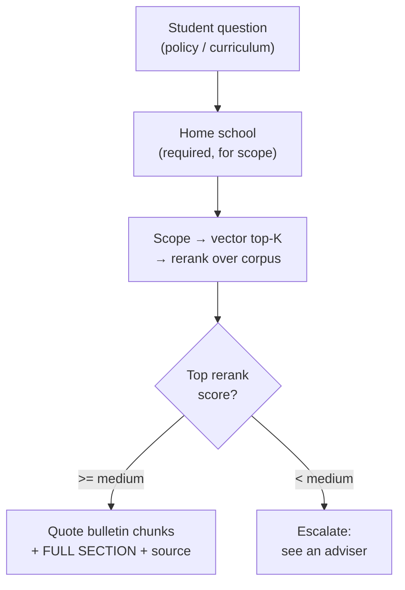
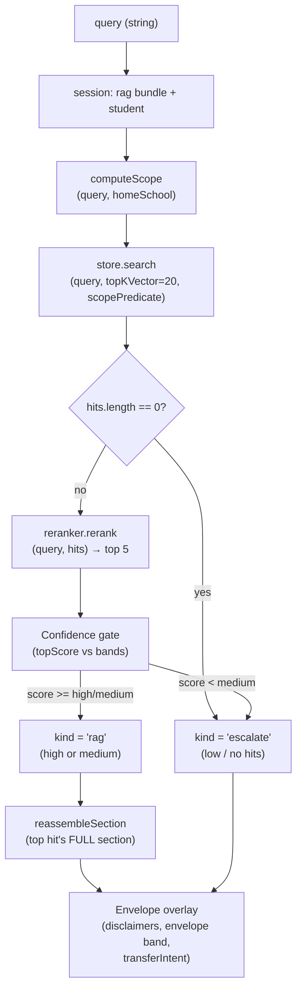

# Tool: `search_policy`

> Last verified against code: 2026-06-10 (post planning-engine rebuild, PRs #35-#41).

A deep technical audit of the `search_policy` agent tool, derived strictly from the implementation. All claims are anchored to file paths and line numbers in the engine source.

Primary source files:
- `packages/engine/src/agent/tools/searchPolicy.ts`
- `packages/engine/src/rag/policySearch.ts`
- `packages/engine/src/rag/ragScopeFilter.ts`
- `packages/engine/src/rag/reranker.ts`
- `packages/engine/src/rag/sectionRetrieval.ts` (whole-section reassembly of the top hit)
- `packages/engine/src/agent/tool.ts` (tool framework contract)

---

## Purpose

`search_policy` is the agent's gateway to NYU's bulletin / policy knowledge base. When a student asks something like "what's the P/F deadline?", "can I count this course toward my major?", or "what does CORE-UA 400 fulfill?", the assistant fires this tool to look up the actual NYU bulletin text. Think of it as a school-aware semantic search engine over NYU's policy and curriculum corpus: it scopes results to the student's home school (so it doesn't quote Stern rules at a CAS student), retrieves the best-matching fragments, reassembles the top hit's full bulletin section so the agent reads the complete rule (not a 500-token sliver), and tags how confident it is — if it isn't confident, it tells the agent "don't make up an answer, point them to an adviser."

It serves two question families with one retrieval pipeline:

1. **Policy questions** — pass/fail rules, residency caps, withdrawal deadlines, double-counting, visa enrollment, study-away, internal transfer, declaration rules.
2. **Curriculum / program structure questions** — which courses fulfill a major or minor, what a CORE-UA requirement range means, what counts as an "advanced math elective" for the Math/CS joint major.

> **It is now pure RAG.** The earlier curated-template layer (`policyTemplate.ts`, `matchTemplate`, `rag.templates`, and the deterministic CORE-UA range table) was **removed** in the "nothing hardcoded" pass (`searchPolicy.ts:1-9` header comment). There is no template matcher, no `kind: "template"` result, and no CORE-UA detector in this tool anymore. Every answer comes from the embedded bulletin corpus: scope filter → vector top-K → rerank → confidence gate → whole-section reassembly of the top hit. For a program's ENTIRE requirement set (a whole major/minor/core-curriculum page), the agent uses the dedicated [`get_program_requirements`](get_program_requirements.md) tool instead.



---

## 1. Input schema

Defined at `searchPolicy.ts:58-60`.

```
search_policy input:
  query: string (min length 2)
    Natural-language policy / curriculum question.
```

That is the entire surface: one free-text query. There are no flags for confidence, no scope overrides on the input, no result-count tuning. Every other behavior is computed from the query plus the session state.

---

## 2. Session prerequisites

Checked in `validateInput` at `searchPolicy.ts:64-69`. The tool refuses to run unless **both** conditions hold:

1. `session.rag` is populated — the engine has finished loading the RAG bundle (vector store, query embedder, reranker, optional confidence bands). The production bundle is built in `apps/web/lib/policyRagSetup.ts`.
2. `session.student` is set — the home school is needed to compute the scope filter (`policySearch` requires `homeSchool`; `ragScopeFilter.ts:65-99`).

Rejection messages (returned to the agent verbatim):

- Missing RAG: `"RAG corpus not loaded."`
- Missing student: `"I need your home school before I can scope a policy lookup."`

The tool also reads `session.transferIntent` (`searchPolicy.ts:136`) and stamps the boolean onto the result. The catalog year is forwarded into `policySearch` options (`searchPolicy.ts:81`) but the scope predicate **ignores it** — year was demoted from a hard gate to advisory in Phase 9 (`ragScopeFilter.ts:78-91`).

---

## 3. What it reads — the RAG bundle (`session.rag`)

`session.rag` is the typed object plumbed by the engine bootstrap. Its fields, as consumed by `searchPolicy`:

| Field | Where it's used |
|---|---|
| `rag.store` (`VectorStore`) | Vector top-K via `store.search(query, topK, predicate)`; `store.listAll()` during section reassembly — `policySearch.ts:113`, `sectionRetrieval.ts:163-165` |
| `rag.embedder` (`Embedder`) | Query-time embedding. Production is `OpenAIEmbedder` (`text-embedding-3-small`, 1536-dim); chunk vectors are precomputed in the corpus cache (`policyRagSetup.ts:57`) |
| `rag.reranker` (`Reranker`) | `reranker.rerank(query, hits)` — `policySearch.ts:132` |
| `rag.confidenceBands` (optional) | Overrides the default confidence thresholds — `searchPolicy.ts:83`, `policySearch.ts:137` |

There is **no** `rag.templates` field. The production bundle object (`policyRagSetup.ts:76-84`) carries only `store`, `embedder`, `reranker`, and — when `COHERE_API_KEY` is set — `confidenceBands`.

The reranker is one of:
- `CohereReranker` — production cross-encoder calling Cohere Rerank v3.5, used when `COHERE_API_KEY` is set (`reranker.ts:122`, wired at `policyRagSetup.ts:68-70`).
- `LocalLexicalReranker` — deterministic token-overlap + heading-boost fallback when no Cohere key is present (`reranker.ts:31-69`).

Both clamp scores into `[0, 1]`, so the downstream confidence bands work for either. The corpus itself is `data/policy-corpus/policy_chunks.jsonl` (14,273 chunks per `policy_chunks.meta.json`).

---

## 4. Algorithm

The core flow lives in `policySearch(query, options, deps)` at `policySearch.ts:92-167`, wrapped by `searchPolicy.call` (`searchPolicy.ts:75-141`) which adds the anti-hallucination envelope (disclaimers, envelope confidence, transferIntent) and the whole-section reassembly.

### 4.1 Pipeline diagram



### 4.2 Step-by-step

**Step 1 — Scope filter.** `computeScope(query, options)` runs first (`policySearch.ts:103`, definition at `ragScopeFilter.ts:65-99`). It builds:

- `scopedSchools = [homeSchool, "all", ...explicitOverrideSchools]` (`ragScopeFilter.ts:76`).
- `predicate(chunk) -> bool` admitting only chunks whose `meta.school` is in `scopedSchools` (`ragScopeFilter.ts:88-91`).
- `overrideTriggered` and `overrideMatchedSchools` for telemetry.

The explicit-override patterns match literal school names: `cas`, `stern`, `tandon`, `tisch`, `steinhardt`, `nursing`, `liberal_studies`, `gallatin`, `sps` (`ragScopeFilter.ts:46-56`). `allowExplicitOverride` is passed as `true` from `searchPolicy.ts:82`. Year is **not** part of the predicate.

**Step 2 — Vector search.** `store.search(query, topKVector, scope.predicate)` returns up to `topKVector = 20` candidate chunks already filtered by the scope predicate (`policySearch.ts:111-113`).

**Step 3 — Empty-corpus branch.** If the vector store returns zero hits (`policySearch.ts:115-129`), return `kind: "escalate"`, `confidence: "low"`, `topScore: 0`, an empty `hits` array, and a note that the scope had nothing to retrieve from.

**Step 4 — Rerank.** `reranker.rerank(query, hits)` returns the same hits each tagged with a `rerankScore` in `[0, 1]` (`policySearch.ts:132`). The top `topKRerank = 5` are kept (`policySearch.ts:112`, `:133`); `summarizeResult` later renders only the top **3** of those. This bounds how many *distinct* fragments are surfaced.

**Step 5 — Confidence gate.** The top hit's `rerankScore` (`topScore`) is compared to the active bands (`policySearch.ts:136-155`):

- `topScore >= bands.high` (default `0.6` lexical / `0.7` Cohere): `confidence = "high"`, `kind = "rag"`.
- `topScore >= bands.medium` (default `0.3` for both): `confidence = "medium"`, `kind = "rag"`, plus a note instructing the agent to caveat the citation.
- Else: `confidence = "low"`, `kind = "escalate"`, plus a note instructing the agent **not** to synthesize an answer.

`PolicySearchResult.kind` is therefore only ever `"rag" | "escalate"` (`policySearch.ts:52`). There is no `"template"` branch.

**Step 6 — Whole-section reassembly (in `searchPolicy.call`).** After `policySearch` returns, if there is a top RAG hit, `searchPolicy.ts:124-132` calls `reassembleSection(store, sourcePath, section)` to stitch back together **every** chunk that shares the top hit's `(sourcePath, section)`, in document order, with the splitter's inter-piece overlap stripped at the seams (`sectionRetrieval.ts:158-181`). The full section is rendered under a `FULL SECTION` block so the agent reads the complete rule, not just the one window that won the rerank.

> **Known limitation — cross-section policies.** `reassembleSection` expands only the **top** hit's section. Other sections that rank inside the top-5 still arrive only as fragments. For a policy whose parts live under *different* headings (e.g. Pass/Fail = a career cap under one heading + a Core exception under another), the agent sees the expanded top section plus the fragment hits, not every section in full. For a whole *program page*, route to [`get_program_requirements`](get_program_requirements.md) instead.

**Step 7 — Envelope overlay (in `searchPolicy.call`).** `searchPolicy.ts:95-140` overlays:

- A `disclaimers` array (anti-hallucination — see §6).
- An `envelopeConfidence` band that **re-translates** the RAG numeric `topScore` into the four-state envelope band — see §5.2.
- A `transferIntent` boolean.
- `wholeSection` (the reassembled top section, or `null`).

---

## 5. Confidence bands

There are two coexisting confidence representations: the policy-search RAG band (three values) and the agent envelope band (four values).

### 5.1 RAG band (computed in `policySearch`)

Type `ConfidenceBand = "high" | "medium" | "low"` (`policySearch.ts:26`). Thresholds:

| Band | LocalLexicalReranker default | CohereReranker default |
|---|---|---|
| `high` | `topScore >= 0.6` (`CONFIDENCE_HIGH`, `policySearch.ts:31`) | `topScore >= 0.7` (`COHERE_CONFIDENCE_BANDS.high`, `policySearch.ts:39-42`) |
| `medium` | `0.3 <= topScore < 0.6` (`CONFIDENCE_MEDIUM`, `policySearch.ts:32`) | `0.3 <= topScore < 0.7` |
| `low` | `topScore < 0.3` | `topScore < 0.3` |

The active band set comes from `options.confidenceBands` if supplied, otherwise the lexical defaults (`policySearch.ts:137`). Production wires `rag.confidenceBands` to `COHERE_CONFIDENCE_BANDS` only when Cohere is active (`policyRagSetup.ts:83`).

### 5.2 Envelope band (computed in `searchPolicy.call`)

Type `EnvelopeConfidence = "high" | "medium" | "low" | "uncertain"` (imported from `toolEnvelope.ts`). The envelope band is derived from the RAG result's **numeric `topScore`**, not the band string (`searchPolicy.ts:96-120`):

| Result shape | Envelope confidence |
|---|---|
| `kind === "escalate"` | `"uncertain"` plus a `policy_no_match_no_fabrication` disclaimer |
| `kind === "rag"` and `topScore < 0.5` | `"low"` plus a `policy_low_confidence_no_fabrication` disclaimer |
| `kind === "rag"` and `0.5 <= topScore < 0.7` | `"medium"` |
| otherwise (high-confidence rag) | `"high"` |

> **Why `topScore` and not the band string.** An earlier version compared `result.confidence` (a band **string** like `"medium"`) against the number `0.5`, which is always false in JS — so the `low` and `medium` envelope branches never fired and the tool could only ever emit `"high"` or `"uncertain"`. `policySearch` now exposes the numeric `topScore` (`policySearch.ts:57-61`) and the envelope bands on **that** (`searchPolicy.ts:108`, `:118`), so a weak-but-present RAG hit correctly ships as a low/medium-confidence, adviser-caveated estimate.

This makes the envelope **finer-grained** than the RAG band: a RAG `"medium"` (topScore `0.3–0.6`) splits into envelope `"low"` (`topScore < 0.5`) vs envelope `"medium"` (`0.5 <= topScore < 0.7`).

---

## 6. Anti-hallucination disclaimers

Set in `searchPolicy.ts:95-120`:

- **`policy_no_match_no_fabrication`** — fired when `kind === "escalate"`. Tells the user "I couldn't find a specific bulletin policy on '[query, truncated to 80 chars]'. Please contact your academic adviser for confirmation." The `reason` field tells the agent to surface it verbatim instead of inventing a quote.
- **`policy_low_confidence_no_fabrication`** — fired when RAG `topScore < 0.5`. Tells the user the citation is approximate and to verify with an adviser. The `reason` instructs the agent **not** to format the snippet as a `§` verbatim quote.

These disclaimers are emitted as data, then rendered via `renderEnvelopeMeta` at the bottom of the summary (`searchPolicy.ts:162-166`, `:186-190`).

---

## 7. Returns shape

The raw call returns the `PolicySearchResult` (`policySearch.ts:49-70`) spread with the envelope overlay (`searchPolicy.ts:134-140`):

```
PolicySearchResult + envelope:
  kind: "rag" | "escalate"
  hits?: array of RerankedHit, each:
    chunk: {
      text: string
      meta: { school, section, source, sourcePath, sourceLine, chunkId, category?, ... }
    }
    rerankScore: number in [0, 1]
  confidence: "high" | "medium" | "low" | "uncertain"   (envelope band — OVERWRITES the RAG band)
  topScore: number in [0, 1]              (numeric top rerank score; 0 on the no-hit path)
  scopedSchools: string[]                 (e.g. ["cas", "all", "stern"])
  overrideTriggered: boolean              (true if an explicit school name flipped scope)
  candidateCount: integer                 (chunks after scope filter, before rerank cap)
  notes: string[]                         (free-form, agent-readable hints)

  # Envelope overlays (added in searchPolicy.call):
  transferIntent: boolean
  disclaimers: array of { id, text, reason }

  # Whole-section overlay:
  wholeSection?: ReassembledUnit | null    (top hit's full reassembled section; null on no-hit path)
    { sourcePath, source, school, year, category?, sections: string[], chunkCount, text, chunks }
```

Note the overwrite at `searchPolicy.ts:138`: the spread `...result` writes the three-state RAG band, then `confidence: envelopeConfidence` overrides it with the four-state envelope band. Downstream consumers see the four-state version.

There are **no** `coreUaClassifications`, `coreUaRequirements`, or template fields on the result — those were removed with the template / deterministic-mapping layer.

---

## 8. Summary text format

`summarizeResult` (`searchPolicy.ts:142-192`) renders to plain text, capped at `maxResultChars = 6000` (`searchPolicy.ts:63`, enforced by the `buildTool` truncator at `tool.ts`).

### 8.1 Order of blocks

1. **Escalation block** (when `kind === "escalate"`) — `searchPolicy.ts:162-172`. Renders `POLICY UNCERTAINTY[ (transferIntent=on)]: confidence=<band>. <notes joined by " | ">` then `Recommend: contact your academic adviser.` then the envelope meta. (Returns early; no RAG/FULL SECTION blocks.)
2. **RAG hits block** (when `kind === "rag"`) — `searchPolicy.ts:174-180`. Header `RAG hits[ (transferIntent=on)] (confidence=<band>; scope=<schools>; override=<bool>)`, then up to **3** hits, each: `  [<school>/<section>] (rerank X.XX)`, a snippet (whitespace-collapsed, sliced to 1400 chars + `…`), and `Source: <source> (<sourcePath>:<sourceLine>)`.
3. **FULL SECTION block** (when a RAG hit exists) — `searchPolicy.ts:149-160`. The top hit's complete reassembled section, capped at 3000 chars: `-- FULL SECTION (top hit, reassembled — read this for the complete rule) --`, then `<source> › <section(s)> [<school>]`, the full section text, and `   Source: <sourcePath> (<n> chunks)`.
4. **Notes block** — the joined `notes` (`searchPolicy.ts:182`), plus a transfer-intent note when `transferIntent` is set (`searchPolicy.ts:183-185`).
5. **Envelope block** — `renderEnvelopeMeta` output appended last (`searchPolicy.ts:186-190`). When disclaimers exist they render here.

The `(transferIntent=on)` tag is prepended to the header when `session.transferIntent === true` (`searchPolicy.ts:143`).

---

## 9. Interactions with other tools and the system prompt

### 9.1 Boundary with `get_program_requirements`

For a program's COMPLETE requirement set (a whole major/minor/Core-Curriculum page), the agent uses [`get_program_requirements`](get_program_requirements.md), which returns the entire reassembled page. `search_policy` is for narrow lookups (one rule, deadline, cap, or one requirement's course list) and surfaces only the top hit's section in full. The tool description (`searchPolicy.ts:30-34`) states this boundary explicitly.

### 9.2 Pair with `run_full_audit`

When a student asks about themselves AND a policy (e.g. "how many P/F have I used? what's the cap?"), the agent pairs `search_policy` (the rule) with `run_full_audit` (the student's specific numbers). This is the system-prompt-enforced posture; the tool description calls it out at `searchPolicy.ts:48-51`.

### 9.3 Pair with transfer flow

`session.transferIntent` is read at `searchPolicy.ts:136` and tagged onto every result. The summarizer surfaces a transfer note on the RAG path (`searchPolicy.ts:183-185`) telling the agent to search the target school's internal-transfer requirements. Transfer intent does **not** broaden the scope; only explicit school names in the query do (`ragScopeFilter.ts:70-75`).

### 9.4 Policy-citation rule (system-prompt enforcement)

The anti-hallucination disclaimers (§6) are the structural backstop for the system prompt's "cite only when retrieval supports it" rule: when retrieval is uncertain, the disclaimer text appears in the result, and the validator can ground against it.

### 9.5 Composition mode

The tool inherits the default `outputMode: "synthesis"` from `buildTool`. There is no verbatim text the agent must include unchanged.

---

## 10. Edge cases

| Case | Behavior |
|---|---|
| RAG bundle missing | `validateInput` → `{ ok:false, "RAG corpus not loaded." }` (`searchPolicy.ts:65`) |
| No student profile | `validateInput` → `{ ok:false, "I need your home school before I can scope a policy lookup." }` (`searchPolicy.ts:66-68`) |
| Empty corpus / nothing in scope | `policySearch.ts:115-129`: `kind:"escalate"`, `confidence:"low"`, `topScore:0`, empty hits, note "No chunks in scope (…)". Envelope upgrades to `"uncertain"` with `policy_no_match_no_fabrication`. |
| All RAG hits below `bands.medium` | `policySearch.ts:149-155`: `kind:"escalate"`. Envelope adds the uncertain disclaimer. |
| Weak-but-present RAG hit (`topScore < 0.5`) | `kind:"rag"`, envelope `"low"` + `policy_low_confidence_no_fabrication` disclaimer. |
| Explicit-override school name | `computeScope` adds that school's chunks to scope and emits the override note (`policySearch.ts:104-108`). Home-school chunks remain. |
| `maxResultChars` truncation | 6000-char cap enforced by `buildTool`; the 1400-char per-snippet slice + 3000-char FULL SECTION cap are the dominant costs. |
| Stale catalog year | Year is advisory, not a hard gate — chunks are not dropped for year mismatch (`ragScopeFilter.ts:78-91`). |
