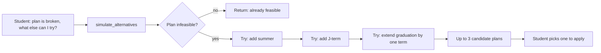

# `simulate_alternatives` — Technical Audit

> Last verified against code: 2026-06-10 (post planning-engine rebuild, PRs #35-#41).

## Purpose

When your current plan can't fit everything in (the system flagged it as infeasible) and you ask "are there other ways to make this work?" or "can I just take a summer term?" or "what if I extend by a semester?", this tool quietly tries three escape hatches and shows you which ones actually rescue the plan. The three options it tries are fixed and always in the same order: turn on summer, turn on January term, or push graduation out by one main term. It does a **full re-solve** under each relaxation, runs each result through the authoritative graduation validator, and returns up to three candidate plans you could pick from. It writes nothing — it's purely an explorer. If your current plan is already feasible, it just says so and returns an empty list. You need to have already built a plan and have your DPR loaded before this tool will work.



---

Source files:
- `packages/engine/src/agent/tools/simulateAlternatives.ts`
- `packages/engine/src/agent/forwardSchedule/alternatives.ts`
- `packages/engine/src/agent/forwardSchedule/planChangeHelpers.ts` (for `buildSolverInputFromSession`)
- `packages/engine/src/agent/forwardSchedule/solverHelpers.ts` (for `nextMainTermOrNull`)
- `packages/engine/src/agent/forwardSchedule/build.ts` (for `finalizeForwardSchedule`)
- `packages/engine/src/agent/forwardSchedule/solver.ts` (for `solveForwardSchedule`)
- `packages/shared/src/types.ts` (for `AlternativeCandidate`)

---

## 1. What it does

`simulate_alternatives` is the **read-only fallback explorer** for the case when the current forward plan is infeasible. It runs the solver up to **three** more times, each time with one constraint relaxed, and returns up to three `AlternativeCandidate` records that the agent can surface to the student as options.

The three relaxation strategies are fixed and applied in this order (`alternatives.ts:46-109`):

1. **`include_summer`** — set `preferences.includeSummer = true` and re-solve.
2. **`include_jterm`** — set `preferences.includeJTerm = true` and re-solve.
3. **`extend_grad_one_term`** — advance `graduationTerm` by one main term (spring → fall same year; fall → next-year spring) and re-solve.

When the current plan is already feasible, the tool short-circuits and returns an empty list plus a note. The tool writes nothing to session (`isReadOnly: true`).

> **Note (post-rebuild):** `AlternativeCandidate["relaxation"]` is typed in `@nyupath/shared` (`types.ts:1196-1201`) as a five-value union: `"include_summer" | "include_jterm" | "extend_grad_one_term" | "extend_grad_one_year" | "lower_credit_target"`. **This tool only ever emits the first three** — the other two are declared-but-unused in `simulate_alternatives`.

---

## 2. Input schema

The tool takes **no** input parameters:

```
{}   // empty object
```

(`simulateAlternatives.ts:44`: `inputSchema: z.object({})`.)

All decision-making is read from session state. The agent cannot pass mutations or hints; the three relaxation strategies are hard-coded inside `alternatives.ts`.

Contrast with [`propose_plan_change`](./propose_plan_change.md) / [`confirm_plan_change`](./confirm_plan_change.md), which accept a `PlanMutation[]` and let the caller specify what to change.

---

## 3. Session prerequisites and `validateInput` behavior

`validateInput` (`simulateAlternatives.ts:47-64`) is the same two-gate pattern as the plan-change tools:

1. **No prior plan**: neither `session.forwardSchedule` nor `session.studentDraftPlan` is set →
   `"No forward plan exists in this session. Call plan_forward_degree first, then simulate alternatives."`
2. **No DPR**: `session.degreeProgressReport` is absent →
   `"No Degree Progress Report loaded. Cannot simulate alternatives without DPR data."`

Both reject with `{ ok: false, userMessage }`. The DPR gate is one half of the DPR-first doctrine — without authoritative DPR data, this personalized tool hard-refuses.

The validator does NOT check whether the existing plan is actually infeasible — that check happens inside `call`. A feasible plan still passes validation; the tool then runs and returns the empty-list note.

---

## 4. What it reads from session

- `session.degreeProgressReport` — non-null after validation.
- `session.forwardSchedule` first, else `session.studentDraftPlan` (`simulateAlternatives.ts:73`) — used **only** for the feasibility short-circuit check.
- `session.schedulePreferences` — passed through to `buildSolverInputFromSession` (line 85).
- `session.student`, `session.schoolConfig`, `session.prereqs`, `session.courses` — consumed indirectly via `buildSolverInputFromSession`.

---

## 5. Algorithm

```mermaid
flowchart TD
    A[Agent emits simulate_alternatives with empty input] --> B{validateInput}
    B -- forwardSchedule and studentDraftPlan both absent --> Bx[Reject]
    B -- DPR absent --> By[Reject]
    B -- OK --> C[Read currentPlan = forwardSchedule ?? studentDraftPlan]
    C --> D{currentPlan.feasibility.feasible === true?}
    D -- yes --> Dx[Return candidates: [], note: 'already feasible']
    D -- no --> E["buildSolverInputFromSession(session, dpr, schedulePreferences)"]
    E --> F["simulateAlternatives(solverInput) — alternatives.ts"]
    F --> G[Generate up to 3 candidates via 3 relaxation strategies]
    G --> H[Return candidates array]
```

### Step-by-step inside the tool

**Step 1 — Feasibility short-circuit.**
`simulateAlternatives.ts:73-79`: if `currentPlan.feasibility.feasible === true`, return:
```
{ candidates: [], note: "Current plan is feasible; no alternatives needed." }
```
No solver run, no work. This is the happy path.

**Step 2 — Build the solver input.**
`simulateAlternatives.ts:82-86`: `buildSolverInputFromSession(session, dpr, session.schedulePreferences)`. This builds the exact same `SolverInput` that `plan_forward_degree` would have used — all derived fields (`currentTerm`, `graduationTerm`, `coursesTaken`, `coursesInProgress`, `unmetRequirements`, `programRules`, `dprCourseHistoryHash`, etc.) are identical to what the latest plan was solved against.

**Step 3 — Delegate to core generator.**
`simulateAlternatives.ts:88`: `coreSimulateAlternatives(solverInput)`. This is `simulateAlternatives` from `alternatives.ts:46-109`. Returns `AlternativeCandidate[]`.

### Step-by-step inside `alternatives.ts:simulateAlternatives`

```mermaid
flowchart TD
    A["simulateAlternatives(input)"] --> B[candidates = empty array]
    B --> C1{"input.preferences?.includeSummer?"}
    C1 -- false / undefined --> S1["clone input with includeSummer=true<br/>solveForwardSchedule(withSummer)"]
    C1 -- true --> SkipSummer[skip strategy 1]
    S1 --> BC1["buildCandidate('include_summer', summary, out, withSummer, fallback)"]
    BC1 --> C2
    SkipSummer --> C2

    C2{"input.preferences?.includeJTerm?"}
    C2 -- false / undefined --> S2["clone input with includeJTerm=true<br/>solveForwardSchedule(withJTerm)"]
    C2 -- true --> SkipJ[skip strategy 2]
    S2 --> BC2["buildCandidate('include_jterm', summary, out, withJTerm, fallback)"]
    BC2 --> C3
    SkipJ --> C3

    C3["extendedTerm = nextMainTermOrNull(input.graduationTerm)"]
    C3 --> C3Q{extendedTerm !== null?}
    C3Q -- yes --> S3["clone input with graduationTerm=extendedTerm<br/>solveForwardSchedule(extended)"]
    C3Q -- no --> SkipExt[skip strategy 3]
    S3 --> BC3["buildCandidate('extend_grad_one_term', summary, out, extended, fallback)"]
    BC3 --> End
    SkipExt --> End

    End[return candidates.slice(0, 3)]
```

**Strategy 1 — `include_summer`** (`alternatives.ts:49-66`).
Skipped if `input.preferences?.includeSummer` is already truthy. Otherwise:
- Build `withSummer: SolverInput = { ...input, preferences: { ...input.preferences, includeSummer: true } }`.
- Call `solveForwardSchedule(withSummer)` — a **full re-solve**.
- Wrap via `buildCandidate("include_summer", ..., out, withSummer, fallbackReason)`.

**Strategy 2 — `include_jterm`** (`alternatives.ts:70-85`).
Same shape, swapping `includeSummer` for `includeJTerm`. Skipped when already truthy.

**Strategy 3 — `extend_grad_one_term`** (`alternatives.ts:89-105`).
- `extendedTerm = nextMainTermOrNull(input.graduationTerm)` — imported from `solverHelpers.ts:61-67` (this is the real function; the helper was moved out of `alternatives.ts` during the rebuild, and there is no longer a local `computeNextMainTerm`). It regex-matches `^(\d{4})-(spring|summer|fall|january)$`; `YYYY-spring` → `YYYY-fall`; `YYYY-fall` → `(YYYY+1)-spring`. Returns `null` for any summer/january term and for unparseable strings.
- If `extendedTerm` is null, this strategy is skipped entirely.
- Otherwise: build `extended: SolverInput = { ...input, graduationTerm: extendedTerm }`. For strategy 3 the `preferences` object is NOT touched — only `graduationTerm` changes. Call `solveForwardSchedule(extended)` and wrap.

**Final cap.** `candidates.slice(0, 3)` (`alternatives.ts:108`). In practice the array is already at most 3 (one per strategy), but the slice is defensive.

### `buildCandidate` — the T8 validator-gating fix (`alternatives.ts:157-192`)

This is the most important change since the docs were last written. Each candidate is no longer built by a bare `buildScheduleFromOutput` that trusted the solver's coarse feasibility flag. Instead:

```
buildCandidate(relaxation, summary, out, input, fallbackReason):
    if (out.feasibility.feasible) {
        // Route through the validator to get the AUTHORITATIVE state (T8/M3).
        { schedule, validatorResult } =
            finalizeForwardSchedule(out, input, input.dpr, validatorRulesFromInput(input))
        if (validatorResult.feasible) {
            return { summary, relaxation, schedule }
        }
        // Coarse-feasible but validator-INFEASIBLE → surface as stillInfeasibleReason.
        reason = validatorResult.infeasibilityReport?.conflictDetail ?? fallbackReason
        return { summary, relaxation, schedule: null, stillInfeasibleReason: reason }
    }
    // Solver already knows it's infeasible — compose from concrete constraint violations.
    details = out.feasibility.constraintViolations.map(v => v.detail).filter(d => d.length > 0)
    stillInfeasibleReason =
        details.length > 0 ? details.join(" ")
                           : (out.feasibility.infeasibilityReason ?? fallbackReason)
    return { summary, relaxation, schedule: null, stillInfeasibleReason }
```

Two key consequences:

1. **Every feasible candidate is validator-checked.** `finalizeForwardSchedule` (`build.ts:64-110`) assembles the `ForwardSchedule` AND runs the authoritative 7-axis `runGraduationPathValidator`, deriving the `state` from the validator (not the solver's coarse state). A coarse-feasible-but-validator-infeasible alternative becomes a `stillInfeasibleReason` entry, NOT a falsely-valid schedule. The `validatorRulesFromInput` helper (`alternatives.ts:126-136`) reconstructs the `ValidatorRules` from the `SolverInput`, mirroring `buildProgramRules` (minor/school-core/upper-level minimums are always `null`).
2. **Infeasible candidates carry specific, concrete reasons.** When the solver already reports infeasible, the reason joins the per-requirement `constraintViolations[].detail` strings (offering / ceiling / coreq / NOT / prereq-depth / capacity), not a bare "N constraint violation(s)" count. The `fallbackReason` is used only when the solver reported no detail at all.

So each candidate has one of two shapes:
- **Feasible**: `{ summary, relaxation, schedule: ForwardSchedule }`. The schedule is the full, validator-confirmed plan for that relaxation. Because it was built via `finalizeForwardSchedule`, it carries its own validator-derived `state` and may itself carry nested `alternativeCandidates` (`build.ts:90-92`).
- **Infeasible**: `{ summary, relaxation, schedule: null, stillInfeasibleReason }`. The student is told the relaxation was tried and still didn't work, with the concrete binding constraint.

### Ranking

`simulate_alternatives` does **not** rank or reorder its candidates. The order is the strategy order: summer → J-term → extend. Any ranking is the agent's / route layer's job (perhaps via [`compare_plan_alternatives`](./compare_plan_alternatives.md)).

### Behavioral note: summer / J-term strategies now actually enumerate the term

The old docs warned that strategies 1 and 2 "may not actually produce different schedules" because the solver didn't read `preferences.includeSummer` / `preferences.includeJTerm`. **That is no longer true.** Per the file header (`alternatives.ts:13-24`) and the rebuilt solver (P2.8 / PLAN-5): `buildConstraintContext` enumerates the opted-in optional terms via `enumerateTerms` (`solverHelpers.ts:113-139`), treating summer and January as OPTIONAL (no F-1 floor, no force-fill, excluded from balance). So strategies 1 and 2 actually enumerate summer / January and **can** return a non-null `schedule` when an opted-in optional term lets remaining requirements fit. When the optional term still cannot fix the plan, the candidate carries `schedule: null` and `stillInfeasibleReason`.

**No combined relaxations.** The three strategies are independent. There is no candidate like "include_summer + include_jterm + extend_grad_one_term".

---

## 6. What it returns

Output type `SimulateAlternativesOutput` (`simulateAlternatives.ts:23-27`):

```
{
  candidates: AlternativeCandidate[],
  note?: string
}
```

Where `AlternativeCandidate` (`types.ts:1196-1201`) is one of:

```
// feasible variant
{ summary, relaxation, schedule: ForwardSchedule }

// infeasible variant
{ summary, relaxation, schedule: null, stillInfeasibleReason: string }
```

`note` is populated only on the feasibility short-circuit. When the tool actually ran the generator, `note` is omitted and the caller inspects `candidates.length` directly.

The maximum candidates length is 3 (one per strategy), and it can be fewer when:
- `preferences.includeSummer` was already true → strategy 1 skipped.
- `preferences.includeJTerm` was already true → strategy 2 skipped.
- `graduationTerm` is not in `YYYY-spring` or `YYYY-fall` shape → strategy 3 skipped (e.g., a current `graduationTerm` of `2027-summer` makes `nextMainTermOrNull` return null).

The returned `schedule` on feasible candidates is a fully-formed, validator-confirmed `ForwardSchedule` — the route layer or agent could in principle use it as a preview. It is NOT persisted; the tool is read-only.

---

## 7. No `pendingMutationId` contract

`simulate_alternatives` has **no** pending-mutation contract. It stages nothing in session, produces no ids, and has no partner "confirm" tool. The candidates it returns are options the agent surfaces; turning a candidate into a real change requires the agent to:

1. Pick a candidate.
2. Translate its `relaxation` into a `PlanMutation` (e.g., `include_summer` → `{ kind: "addTerm", term: "summer" }`; `include_jterm` → `{ kind: "addTerm", term: "january" }`).
3. Call `confirm_plan_change` (or `propose_plan_change` first for preview) with that mutation.

The `extend_grad_one_term` relaxation does NOT have a corresponding `PlanMutation` kind. Committing it requires re-invoking `plan_forward_degree` with a `graduationTermOverride` parameter — outside the plan-change mutation vocabulary.

---

## 8. What it writes to session

**Nothing.** `isReadOnly: true` (`simulateAlternatives.ts:45`). The tool reads session state, calls the solver up to three times against clones of the `SolverInput`, and returns the results. `session.forwardSchedule`, `session.studentDraftPlan`, `session.schedulePreferences`, `session.scheduleStore` — all untouched. The cloned `SolverInput` objects use spread syntax and never mutate the original input's `preferences` object.

---

## 9. Envelope behavior

From `buildTool`:

- `name`: `"simulate_alternatives"`
- `description`: the up-to-3-relaxation summary plus "Returns an empty list when the current plan is already feasible" and "isReadOnly: true" (`simulateAlternatives.ts:35-43`).
- `inputSchema`: `z.object({})` — empty.
- `isReadOnly`: `true`.
- `maxResultChars`: `3000`.
- `outputMode`: defaults to `"synthesis"` (no explicit setting). No `extractVerbatim`.
- `validateInput`: as described in §3.
- `prompt`: `simulateAlternatives.ts:65-68`.

---

## 10. Summary text format

`summarizeResult` (`simulateAlternatives.ts:92-107`) branches on three cases:

1. **`note` present** → return `note` verbatim (e.g., `"Current plan is feasible; no alternatives needed."`).
2. **`candidates.length === 0` and no `note`** → return `"No alternative candidates generated."` (all three strategies were skipped).
3. **Otherwise** — emit a multi-line block:
   - Header: `ALTERNATIVE CANDIDATES (<n>):`
   - One line per candidate:
     - Feasible: `  [<relaxation>] <summary> — feasible → grad <graduationTerm>`
     - Infeasible: `  [<relaxation>] <summary> — still infeasible (<stillInfeasibleReason | "unknown">)`

The output is then truncated at 3000 chars by the envelope wrapper.

---

## 11. Known limitations

- **Does NOT surface the double-count advisory.** The double-count advisory (over-counting one course toward two requirements) is assembled and surfaced on `plan_forward_degree`, `propose_plan_change`, and `confirm_plan_change` — the only three tools that call `buildDoubleCountAdvisory` (PR #41) — but **not** on `simulate_alternatives` (nor on `run_full_audit` or `update_profile`). A candidate schedule returned here may contain a double-count that the student is never warned about until they commit it through the plan-change path. This is a deliberate gap, not yet closed.
- **Only 3 of 5 declared relaxations are emitted.** `extend_grad_one_year` and `lower_credit_target` exist in the `AlternativeCandidate["relaxation"]` union but are never produced by this tool.
- **Greedy-skip diagnostics caveat (historical).** The pre-rebuild greedy solver is gone; the engine is now feasibility-first backtracking search, so candidates that come back `schedule: null` reflect a genuine search exhaustion (within budget) rather than a greedy skip hiding unmet requirements.

---

## 12. Interactions with other tools

### With `plan_forward_degree`
Direct upstream dependency. `plan_forward_degree` is the only tool that creates `session.forwardSchedule` and `session.studentDraftPlan`. `simulate_alternatives` cannot run without one of them. Intended workflow: `plan_forward_degree` returns an infeasible-draft plan → agent calls `simulate_alternatives` to enumerate the three relaxation options → agent presents them.

### With `propose_plan_change` and `confirm_plan_change`
Indirect partners. The relaxations `include_summer` / `include_jterm` map onto the `addTerm` mutation kind. After a feasible candidate, the agent can show the student `candidate.schedule` directly, or route `addTerm` through the propose/confirm two-step to commit. `confirm_plan_change` re-solves from scratch (also through `finalizeForwardSchedule`), so the committed plan may differ slightly from the candidate (timestamps, alternative-candidates field). The `extend_grad_one_term` relaxation has no `PlanMutation`; acting on it requires `plan_forward_degree` with a `graduationTermOverride`.

### With `compare_plan_alternatives`
Not referenced in `simulateAlternatives.ts`. [`compare_plan_alternatives`](./compare_plan_alternatives.md) reads a **different** data path — the `alternativeCandidates` array the solver attaches to a *feasible* schedule via `findDiverseValidPlans` → `buildAlternativeSummaries`. That is solver-internal diversity, distinct from this tool's three relaxation strategies for an *infeasible* plan.

### With `bind_free_elective` / `bind_pool_slot`
No interaction. The relaxation strategies operate on the solver input's `preferences` (strategies 1, 2) or `graduationTerm` (strategy 3), never on individual slots.
