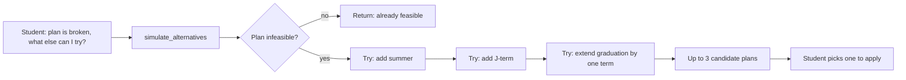
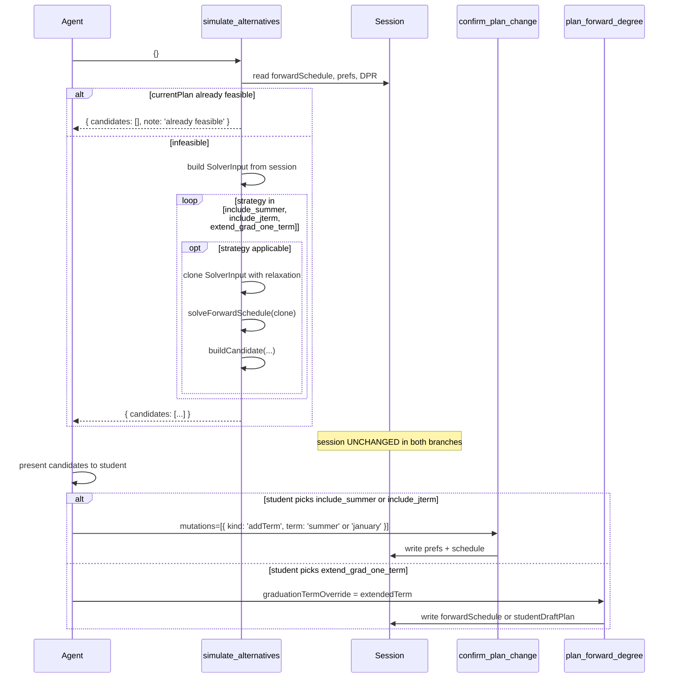

# `simulate_alternatives` — Technical Audit

## TL;DR

When your current plan can't fit everything in (the system flagged it as infeasible) and you ask "are there other ways to make this work?" or "can I just take a summer term?" or "what if I extend by a semester?", this tool quietly tries up to three escape hatches and shows you which ones actually rescue the plan. The three options it tries are fixed and always in the same order: turn on summer, turn on January term, or push graduation out by one main term. It re-runs the planner under each relaxation and returns up to three candidate plans you could pick from. It writes nothing — it's purely an explorer. If your current plan is already feasible, it just says so and returns an empty list. You need to have already built a plan and have your DPR loaded before this tool will work.



---

Source files referenced:
- `packages/engine/src/agent/tools/simulateAlternatives.ts`
- `packages/engine/src/agent/forwardSchedule/alternatives.ts`
- `packages/engine/src/agent/forwardSchedule/planChangeHelpers.ts` (for `buildSolverInputFromSession`)
- `packages/engine/src/agent/forwardSchedule/types.ts`
- `packages/engine/src/agent/forwardSchedule/forwardFeasibility.ts`
- `packages/engine/src/agent/tool.ts`

---

## 1. Purpose

`simulate_alternatives` is the **read-only fallback explorer** for the case when the current forward plan is infeasible. It runs the solver up to **three** more times, each time with one constraint relaxed, and returns up to three `AlternativeCandidate` records that the agent can surface to the student as options.

The three relaxation strategies are fixed and applied in this order:

1. **`include_summer`** — set `preferences.includeSummer = true` and re-solve.
2. **`include_jterm`** — set `preferences.includeJTerm = true` and re-solve.
3. **`extend_grad_one_term`** — advance `graduationTerm` by one main term (spring → fall same year; fall → next-year spring) and re-solve.

When the current plan is already feasible, the tool short-circuits and returns an empty list plus a note. The tool writes nothing to session (`isReadOnly: true`).

---

## 2. Input schema

The tool takes **no** input parameters:

```
{}   // empty object
```

(`simulateAlternatives.ts:44`: `inputSchema: z.object({})`.)

All decision-making is read from session state. The agent cannot pass mutations or hints; the three relaxation strategies are hard-coded inside `alternatives.ts`.

Contrast with `propose_plan_change` / `confirm_plan_change`, which accept a `PlanMutation[]` and let the caller specify what to change.

---

## 3. Session prerequisites and `validateInput` behavior

`validateInput` (`simulateAlternatives.ts:47-64`) is the same two-gate pattern as the plan-change tools:

1. **No prior plan**: neither `session.forwardSchedule` nor `session.studentDraftPlan` is set →
   `"No forward plan exists in this session. Call plan_forward_degree first, then simulate alternatives."`
2. **No DPR**: `session.degreeProgressReport` is absent →
   `"No Degree Progress Report loaded. Cannot simulate alternatives without DPR data."`

Both reject with `{ ok: false, userMessage }`.

The validator does NOT check whether the existing plan is actually infeasible — that check happens inside `call`. A feasible plan still passes validation; the tool then runs and returns the empty-list note.

---

## 4. What it reads from session

- `session.degreeProgressReport` — non-null after validation.
- `session.forwardSchedule` first, else `session.studentDraftPlan` (`simulateAlternatives.ts:73`) — used **only** for the feasibility short-circuit check.
- `session.schedulePreferences` — passed through to `buildSolverInputFromSession` (line 85).
- `session.student`, `session.schoolConfig`, `session.prereqs`, `session.courses` — consumed indirectly via `buildSolverInputFromSession`.

Notably, the tool does NOT need `session.forwardSchedule` to be populated to actually run the alternatives generator — only the feasibility check at line 74 reads it. If both `forwardSchedule` and `studentDraftPlan` are absent (which validation already prevented), the short-circuit check is skipped and the tool proceeds to generate alternatives anyway. In practice validation guards this.

---

## 5. Algorithm

```mermaid
flowchart TD
    A[Agent emits simulate_alternatives with empty input] --> B{validateInput}
    B -- forwardSchedule and studentDraftPlan both absent --> Bx[Reject]
    B -- DPR absent --> By[Reject]
    B -- OK --> C[Read currentPlan = forwardSchedule ?? studentDraftPlan]
    C --> D{currentPlan.feasibility.feasible === true?}
    D -- yes --> Dx[Return candidates: [], note: 'already feasible']
    D -- no --> E["buildSolverInputFromSession(session, dpr, schedulePreferences)"]
    E --> F["simulateAlternatives(solverInput) — alternatives.ts"]
    F --> G[Generate up to 3 candidates via 3 relaxation strategies]
    G --> H[Return candidates array]
```

### Step-by-step inside the tool

**Step 1 — Feasibility short-circuit.**
`simulateAlternatives.ts:73-79`: if `currentPlan.feasibility.feasible === true`, return:
```
{ candidates: [], note: "Current plan is feasible; no alternatives needed." }
```
No solver run, no work. This is the happy path.

**Step 2 — Build the solver input.**
`simulateAlternatives.ts:82-86`: `buildSolverInputFromSession(session, dpr, session.schedulePreferences)`. Note that the third argument is `session.schedulePreferences` **as-is** — the tool does NOT mutate or clone it for the base input. The mutations happen inside the core helper.

This builds the exact same `SolverInput` that `plan_forward_degree` would have used. All the derived fields (`currentTerm`, `graduationTerm` from `deriveGraduationTermFromCredits`, `coursesTaken`, `coursesInProgress`, `unmetRequirements`, `programRules`, `dprCourseHistoryHash`, etc.) are identical to what the latest plan was solved against.

**Step 3 — Delegate to core generator.**
`simulateAlternatives.ts:88`: `coreSimulateAlternatives(solverInput)`. This is `simulateAlternatives` from `alternatives.ts:39-102`. Returns `AlternativeCandidate[]`.

### Step-by-step inside `alternatives.ts:simulateAlternatives`

```mermaid
flowchart TD
    A["simulateAlternatives(input)"] --> B[candidates = empty array]
    B --> C1{"input.preferences?.includeSummer?"}
    C1 -- false / undefined --> S1["clone input with includeSummer=true<br/>solveForwardSchedule(withSummer)"]
    C1 -- true --> SkipSummer[skip strategy 1]
    S1 --> BC1["buildCandidate('include_summer', summary, out, withSummer, fallback)"]
    BC1 --> C2
    SkipSummer --> C2

    C2{"input.preferences?.includeJTerm?"}
    C2 -- false / undefined --> S2["clone input with includeJTerm=true<br/>solveForwardSchedule(withJTerm)"]
    C2 -- true --> SkipJ[skip strategy 2]
    S2 --> BC2["buildCandidate('include_jterm', summary, out, withJTerm, fallback)"]
    BC2 --> C3
    SkipJ --> C3

    C3["extendedTerm = computeNextMainTerm(input.graduationTerm)"]
    C3 --> C3Q{extendedTerm !== null?}
    C3Q -- yes --> S3["clone input with graduationTerm=extendedTerm<br/>solveForwardSchedule(extended)"]
    C3Q -- no --> SkipExt[skip strategy 3]
    S3 --> BC3["buildCandidate('extend_grad_one_term', summary, out, extended, fallback)"]
    BC3 --> End
    SkipExt --> End

    End[return candidates.slice(0, 3)]
```

**Strategy 1 — `include_summer`** (`alternatives.ts:44-59`).
Skipped if `input.preferences?.includeSummer` is already truthy. Otherwise:
- Build `withSummer: SolverInput = { ...input, preferences: { ...input.preferences, includeSummer: true } }`.
- Call `solveForwardSchedule(withSummer)`.
- Wrap via `buildCandidate("include_summer", "Adding a summer term may allow remaining requirements to fit.", out, withSummer, "Even with summer added, no feasible plan could be constructed.")`.

**Strategy 2 — `include_jterm`** (`alternatives.ts:62-78`).
Same shape, swapping `includeSummer` for `includeJTerm`. Skipped when already truthy.

**Strategy 3 — `extend_grad_one_term`** (`alternatives.ts:81-98`).
- `extendedTerm = computeNextMainTerm(input.graduationTerm)` (line 116-122). The helper regex-matches `^(\d{4})-(spring|fall)$`; `YYYY-spring` → `YYYY-fall`; `YYYY-fall` → `(YYYY+1)-spring`. Returns `null` for any other shape (e.g. `2026-summer`, `2026-january`, unparseable strings).
- If `extendedTerm` is null, this strategy is skipped entirely.
- Otherwise: build `extended: SolverInput = { ...input, graduationTerm: extendedTerm }`. Note that for strategy 3 the `preferences` object is NOT touched — only `graduationTerm` changes. Call `solveForwardSchedule(extended)` and wrap.

**Final cap.** `candidates.slice(0, 3)` (`alternatives.ts:101`). In practice the array is already at most 3 (one per strategy), but the slice is defensive.

### `buildCandidate` (`alternatives.ts:170-191`)

```
buildCandidate(relaxation, summary, out, input, fallbackReason):
    if (out.feasibility.feasible) {
        return {
            summary,
            relaxation,
            schedule: buildScheduleFromOutput(out, input)
        }
    }
    return {
        summary,
        relaxation,
        schedule: null,
        stillInfeasibleReason: out.feasibility.infeasibilityReason ?? fallbackReason
    }
```

So each candidate has one of two shapes:
- **Feasible**: `{ summary, relaxation, schedule: ForwardSchedule }`. The schedule is the full computed plan for that relaxation.
- **Infeasible**: `{ summary, relaxation, schedule: null, stillInfeasibleReason }`. The student is told the relaxation was tried and still didn't work; the reason is whatever the solver reported, or a fixed fallback string.

### `buildScheduleFromOutput` (`alternatives.ts:132-160`)

Mirrors the schedule construction used by `proposePlanChange` and `confirmPlanChange`:

- `studentId`, `homeSchoolId`, `creditTargetPerSemester`, `f1Floor`, `domesticPartTimeFloor`, `graduationCreditMinimum`, `dprCourseHistoryHash` copied from `input`.
- `graduationTerm` from `input.graduationTerm` (note: for strategy 3 this is the **extended** graduation term, not the original).
- `degreeCreditsMet` = `input.creditsEarned + sum(plannedCredits) >= input.graduationCreditMinimum`.
- `semesters`, `feasibility`, `state`, `balanceScore`, `assumptions` from `out`.
- `computedAt = Date.now()`.
- `alternativeCandidates` conditionally spread when `out.alternativeCandidates !== undefined`.

The candidate's `schedule.feasibility.feasible` will always be `true` when `schedule` is non-null (because `buildCandidate` only calls this builder on the feasible branch).

### Ranking

`simulate_alternatives` does **not** rank or reorder its candidates. The order is the strategy order: summer → J-term → extend. The agent or the route layer is responsible for any ranking step (perhaps by calling `compare_plan_alternatives`).

### Caveats from the source

Two important behaviors visible in the source:

1. **Strategies 1 and 2 may not actually produce different schedules.** The comment block at `alternatives.ts:13-21` (and the code at `solver.ts` not in scope here) notes that `enumerateMainTerms` in the solver may not yet read `preferences.includeSummer` / `preferences.includeJTerm` — meaning these strategies may emit candidates with `schedule: null` and a `stillInfeasibleReason` even when adding the term ought to help. Strategy 3 (`extend_grad_one_term`) is the one that reliably changes the solver's enumeration window.
2. **No combined relaxations.** The three strategies are independent. There is no candidate like "include_summer + include_jterm + extend_grad_one_term". The agent would need to call `confirm_plan_change` with a manual mutation sequence to combine relaxations.

---

## 6. What it returns

Output type `SimulateAlternativesOutput` (`simulateAlternatives.ts:23-27`):

```
{
  candidates: AlternativeCandidate[],
  note?: string
}
```

Where `AlternativeCandidate` is one of:

```
// feasible variant
{
  summary: string,
  relaxation: "include_summer" | "include_jterm" | "extend_grad_one_term",
  schedule: ForwardSchedule
}

// infeasible variant
{
  summary: string,
  relaxation: "include_summer" | "include_jterm" | "extend_grad_one_term",
  schedule: null,
  stillInfeasibleReason: string
}
```

`note` is populated only on the feasibility short-circuit. When the tool actually ran the generator, `note` is omitted and the caller inspects `candidates.length` directly.

The maximum candidates length is 3 (one per strategy), and it can be fewer when:
- `preferences.includeSummer` was already true → strategy 1 skipped.
- `preferences.includeJTerm` was already true → strategy 2 skipped.
- `graduationTerm` is not in `YYYY-spring` or `YYYY-fall` shape → strategy 3 skipped (e.g., a current `graduationTerm` of `2027-summer` would cause `computeNextMainTerm` to return null).

The returned `schedule` field on feasible candidates is a **fully-formed `ForwardSchedule`** — the route layer or agent could in principle use it as a preview. It is NOT persisted; the tool is read-only.

---

## 7. The `pendingMutationId` contract (and why it does not apply)

`simulate_alternatives` has **no** pending-mutation contract. It does not stage anything in session, it does not produce ids, and it does not have a partner "confirm" tool. The candidates it returns are options the agent surfaces; turning a candidate into a real change requires the agent to:

1. Pick a candidate.
2. Translate its `relaxation` into a `PlanMutation` (e.g., `include_summer` → `{ kind: "addTerm", term: "summer" }`; `include_jterm` → `{ kind: "addTerm", term: "january" }`).
3. Call `confirm_plan_change` (or `propose_plan_change` first for preview) with that mutation.

The `extend_grad_one_term` relaxation does NOT have a corresponding `PlanMutation` kind. Committing it requires re-invoking `plan_forward_degree` with a `graduationTermOverride` parameter — outside the plan-change mutation vocabulary.



---

## 8. What `simulate_alternatives` writes to session

**Nothing.** `isReadOnly: true` (`simulateAlternatives.ts:45`). The tool reads session state, calls the solver up to three times against clones of the `SolverInput`, and returns the results. `session.forwardSchedule`, `session.studentDraftPlan`, `session.schedulePreferences`, `session.scheduleStore` — all untouched.

The cloned `SolverInput` objects inside `alternatives.ts:simulateAlternatives` use spread syntax (`{ ...input, preferences: { ...input.preferences, includeSummer: true } }`) — they do not mutate the original input's `preferences` object. Same shallow-clone discipline as `applyMutationsToPreferences`.

---

## 9. Envelope behavior

From `buildTool` (`tool.ts:239-271`):

- `name`: `"simulate_alternatives"`
- `description`: `"When the current forward plan is infeasible, generate up to 3 alternative schedule candidates by progressively relaxing constraints (add summer term, add J-term, or extend graduation by one term). Returns an empty list when the current plan is already feasible — no alternatives are needed in that case. Use this after plan_forward_degree returns an infeasible-draft plan to show the student what options are available. isReadOnly: true — never writes to session state."` (lines 36-43).
- `inputSchema`: `z.object({})` — empty.
- `isReadOnly`: `true`.
- `maxResultChars`: `3000` (smaller than the plan-change tools' 4000).
- `outputMode`: defaults to `"synthesis"` (no explicit setting).
- `validateInput`: as described in §3.
- `prompt`: `"Generate alternative schedule candidates when the primary plan is infeasible. Returns an empty list if the plan is already feasible. Useful for presenting options to the student when the default graduation term cannot be met."` (lines 66-68).

No `extractVerbatim`. The LLM synthesizes a final reply from the summary string.

---

## 10. Summary text format

`summarizeResult` (`simulateAlternatives.ts:92-107`) branches on three cases:

1. **`note` present** → return `note` verbatim (e.g., `"Current plan is feasible; no alternatives needed."`).
2. **`candidates.length === 0` and no `note`** → return `"No alternative candidates generated."`. This is the case when all three strategies were skipped (`includeSummer` already true, `includeJTerm` already true, `graduationTerm` not in `YYYY-spring|fall` form).
3. **Otherwise** — emit a multi-line block:
   - Header: `ALTERNATIVE CANDIDATES (<n>):`
   - One line per candidate:
     - Feasible: `  [<relaxation>] <summary> — feasible → grad <graduationTerm>`
     - Infeasible: `  [<relaxation>] <summary> — still infeasible (<stillInfeasibleReason | "unknown">)`

The output is then truncated at 3000 chars by the envelope wrapper.

---

## 11. Interactions with other tools

### With `plan_forward_degree`
Direct upstream dependency. `plan_forward_degree` is the only tool that creates `session.forwardSchedule` and `session.studentDraftPlan`. `simulate_alternatives` cannot run without one of them. The intended workflow is:
1. `plan_forward_degree` returns an `infeasible-draft` plan.
2. The agent calls `simulate_alternatives` to enumerate the three relaxation options.
3. The agent presents the options to the student.

### With `propose_plan_change` and `confirm_plan_change`
Indirect partners. The relaxations `include_summer` and `include_jterm` map cleanly onto the `addTerm` mutation kind. After `simulate_alternatives` returns a feasible `include_summer` candidate, the agent can:
- Show the student the `candidate.schedule` directly (it's a complete `ForwardSchedule`), OR
- Call `propose_plan_change({ mutations: [{ kind: "addTerm", term: "summer" }] })` to get a `planDiff` + `explanation` for the change.

To commit, the agent calls `confirm_plan_change` with the same `addTerm` mutation. The route layer does NOT need to pass the candidate's schedule into confirm — `confirm_plan_change` re-solves from scratch and may produce a slightly different `ForwardSchedule` than the candidate (e.g., timestamps, alternative-candidates field). Equivalence of the two solver runs is a correctness assumption, not a code guarantee.

The `extend_grad_one_term` relaxation has **no** corresponding `PlanMutation`. Acting on it requires invoking `plan_forward_degree` with a `graduationTermOverride` argument (read from `session.graduationTarget` or supplied by the agent).

### With `compare_plan_alternatives`
Not referenced in `simulateAlternatives.ts`. Conceptually, `compare_plan_alternatives` would consume the `candidates` array returned by `simulate_alternatives` (or by `solverOutput.alternativeCandidates` embedded inside a schedule) and rank them. `simulate_alternatives` itself does no ranking — the strategies are emitted in fixed order.

### With `bind_free_elective` / `bind_pool_slot`
No interaction. The relaxation strategies operate on the solver input's `preferences` (Strategy 1, 2) or `graduationTerm` (Strategy 3), never on individual slots. Slot-level binding decisions are unrelated.

### With the solver's own internal alternatives (`solverOutput.alternativeCandidates`)
The solver may itself populate `alternativeCandidates` on its `SolverOutput` (Decision #44, see `types.ts:166`). When `buildScheduleFromOutput` runs (`alternatives.ts:132-160`), it conditionally spreads that field onto the candidate's `schedule`. So a feasible alternative candidate can itself carry **nested** alternative-plan summaries — these are the solver's internal top-5 alternatives, distinct from this tool's three relaxation strategies.

### With `forwardFeasibilityScreen`
Not invoked from this tool directly. The screen is a fast pruning heuristic the solver uses internally during placement (`forwardFeasibility.ts:43-83`). Each of the three `solveForwardSchedule` calls inside `simulate_alternatives` will internally use the screen. The screen does NOT participate in the alternatives generation logic itself.
