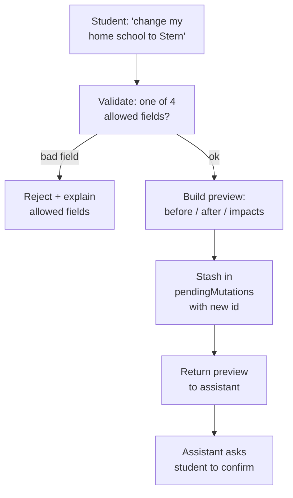
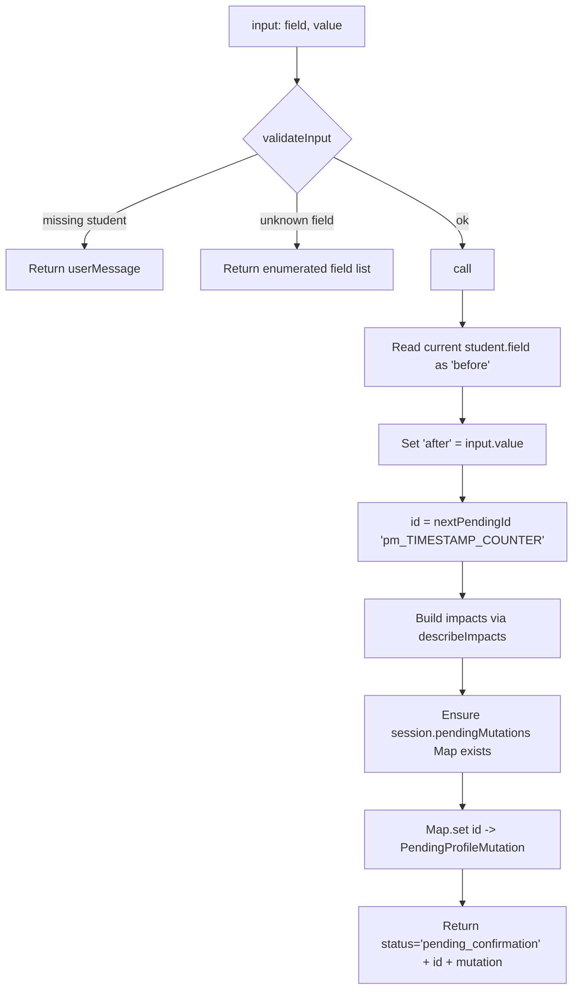
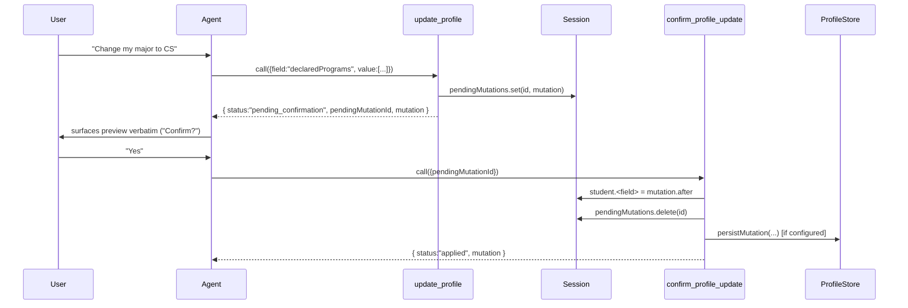

# `update_profile`

> Last verified against code: 2026-06-10 (post planning-engine rebuild, PRs #35-#41).

A technical audit of the staging half of the two-step profile-mutation contract. This tool was not touched by the Phase 0-2 solver rebuild — it is a Phase-5 profile tool and remains one of the 20 live tools in `packages/engine/src/agent/registry.ts`.

Source: `packages/engine/src/agent/tools/updateProfile.ts` (lines 89-192).

---

## TL;DR

When a student says "I want to switch from CAS to Stern", "change my catalog year to 2024", "add a math minor", or "I'm now on an F-1 visa", this tool is step one of a two-step write. It doesn't actually change anything yet — it builds a preview ("here's what would change, and here's what that would affect") and stashes it in a pending-mutations map under a generated id like `pm_1700000000000_42`. Only four fields are writable through this contract: home school, catalog year, declared programs, and visa status. Anything else (credit-cap overrides, adviser exceptions, etc.) is intentionally not supported — the assistant is told to handle those verbally. The assistant then shows the preview to the student and asks "confirm?" — only after a yes do they call the apply step with the same id. This guardrail means a typo'd tool call can never silently mutate the profile.



---

## 1. Purpose

`update_profile` is the **staging step** of a two-step write contract for the in-memory student profile (`session.student`). It does **not** mutate the profile. It builds a `PendingProfileMutation` preview describing exactly one field change, stores it in `session.pendingMutations` keyed by a generated id, and returns the preview to the agent. The agent is expected to surface the preview to the user verbatim and, only after the user explicitly confirms, call `confirm_profile_update` with the returned `pendingMutationId`.

Exactly four fields are writable:

- `homeSchool` (string id, e.g. `"cas"`)
- `catalogYear` (`"YYYY"` or `"YYYY-YYYY"`)
- `declaredPrograms` (array of `{programId, programType: "major"|"minor"|"concentration"}`)
- `visaStatus` (`"f1" | "domestic" | "other"`)

No other profile field can be staged through this tool — credit-cap overrides, adviser approvals, bulletin exceptions, transfer-credit overrides, etc. all live outside this contract. The tool's description text instructs the agent to acknowledge such requests verbally rather than encode them.

`isReadOnly: true` (`updateProfile.ts:111`). Staging the preview does not mutate the student profile, even though it writes to `session.pendingMutations`. The session-level mutation is captured by `confirm_profile_update`'s `isReadOnly: false`.

---

## 2. Input schema

`update_profile` uses a Zod **discriminated union** on the `field` literal (`updateProfile.ts:23-45`). One — and only one — of the following shapes is valid:

```pseudo
{ field: "homeSchool",       value: non-empty string }
{ field: "catalogYear",      value: string matching /^\d{4}(-\d{4})?$/ }
{ field: "declaredPrograms", value: ProgramDeclaration[] }
{ field: "visaStatus",       value: "f1" | "domestic" | "other" }
```

Where each `ProgramDeclaration` is:

```pseudo
{
  programId:                   non-empty string,
  programType:                 "major" | "minor" | "concentration",
  declaredAt?:                 string,
  declaredUnderCatalogYear?:   string,
}
```

`catalogYear` is regex-validated to either `"2024"` or `"2024-2025"` shapes only. Anything else fails Zod validation before `call` runs.

`maxResultChars: 2000` (`updateProfile.ts:112`).

---

## 3. Session prerequisites + `validateInput`

`validateInput` runs at `updateProfile.ts:113-132` and applies two checks in order:

1. **Student must be loaded.** If `session.student` is falsy, returns `{ ok: false, userMessage: "No student profile loaded." }`.
2. **Friendly field-allowlist check.** Reads the incoming `input.field` (typed loosely as `unknown` since Zod hasn't fully parsed it yet inside this hook). If it is not a string or not one of `["homeSchool", "catalogYear", "declaredPrograms", "visaStatus"]`, returns a user-facing message that explicitly enumerates the four allowed fields and instructs the agent that credit-cap overrides and adviser exceptions are NOT representable as profile fields.

This second check exists specifically because raw Zod errors on a discriminated union (`Invalid input`) give the model no signal about what to fix.

No other session fields are required at this stage — `update_profile` does not touch `degreeProgressReport`, `courses`, `prereqs`, `programs`, `schoolConfig`, or any persistence store.

---

## 4. What it reads

`update_profile.call` reads exactly:

- `session.student` (asserted non-null; see `updateProfile.ts:138`).
- One of `student.homeSchool`, `student.catalogYear`, `student.declaredPrograms`, `student.visaStatus`, depending on `input.field`. The current value becomes the `before` of the staged mutation.
- `input.field` and `input.value` from the user-supplied arguments.

It does NOT read the DPR, courses taken, schoolConfig, RAG, prereq graph, etc. The staging step is pure preview construction.

---

## 5. Algorithm



The `call` function (`updateProfile.ts:137-178`) executes the following steps deterministically:

### Step 1 — Capture before/after

A `switch` on `input.field` (`updateProfile.ts:141-158`) reads the current `student.<field>` value into a `before` accumulator and the new `input.value` into an `after` accumulator. Both are partial-shaped objects (`Partial<StudentProfile>`) so the type checker accepts only the relevant key per branch.

### Step 2 — Generate id

`nextPendingId()` (`updateProfile.ts:47-51`) returns `` `pm_${Date.now()}_${pendingIdCounter}` `` where `pendingIdCounter` is a **module-level integer that increments forever within the process**. The id is therefore unique per process per call but is NOT cryptographically random, NOT stable across process restarts, and NOT guaranteed to be unique across multiple parallel processes. The `Date.now()` prefix mitigates collisions during a single process restart at the same counter value.

### Step 3 — Build impacts

`describeImpacts(field, before, after)` (`updateProfile.ts:53-87`) produces a 2–3-line `string[]` of plain-language impact statements that vary per field:

- **`homeSchool`** — two lines: "Audit + planner will switch to the `<new>` SchoolConfig (residency, P/F, credit caps)" and "Internal-transfer eligibility checks become unsupported until the new home-school's data is loaded."
- **`catalogYear`** — two lines: "Program rules will be loaded from the `<new>` snapshot (per-§11.0.3 catalog-year pinning)" and "Already-completed courses are unaffected; only future audits use the new year."
- **`declaredPrograms`** — two lines: "Audits will run against the new program list. Existing courses will be re-counted." and "Cross-program double-counting limits re-evaluate immediately."
- **`visaStatus`** — two lines: a conditional one that flips between "Enrollment checks will REQUIRE F-1 full-time minimums" (when `after === "f1"`) and "Enrollment checks will no longer apply F-1 minimums" (otherwise), plus "Plan suggestions will be re-filtered for visa-specific rules."

After the field-specific lines, every field appends one more line: `` `Previous value: ${JSON.stringify(before)}.` ``.

### Step 4 — Stage in session

If `session.pendingMutations` is undefined the tool lazily initializes it as a `new Map()` (`updateProfile.ts:171`). It then sets the entry: `session.pendingMutations.set(id, mutation)`.

### Step 5 — Return

The return object is:

```pseudo
{
  status: "pending_confirmation",  // literal
  pendingMutationId: id,
  mutation: PendingProfileMutation,
}
```

Where `PendingProfileMutation` (defined in `tool.ts:29-37`) is:

```pseudo
{
  id:      string,
  field:   "homeSchool" | "catalogYear" | "declaredPrograms" | "visaStatus",
  before:  unknown,
  after:   unknown,
  impacts: string[],
}
```

---

## 6. What it writes to session

Exactly one write:

- `session.pendingMutations.set(id, mutation)` — adds a single entry to the staging map.

That's it. `session.student` is NOT mutated. `session.profileStore`, `session.scheduleStore`, and `session.chatHistoryStore` are NOT touched. No I/O.

If `session.pendingMutations` did not previously exist, the tool initializes it as a fresh `Map`. Re-invoking `update_profile` for the same field a second time does NOT overwrite or delete the prior entry — both staged mutations live in the map with distinct ids, and either one can be confirmed later (whichever id the agent passes to `confirm_profile_update`).

---

## 7. What it returns

```pseudo
{
  status:            "pending_confirmation",   // literal
  pendingMutationId: string,                   // "pm_<timestamp>_<counter>"
  mutation: {
    id:      string,                           // same as pendingMutationId
    field:   "homeSchool" | "catalogYear" | "declaredPrograms" | "visaStatus",
    before:  unknown,                          // prior value of the field
    after:   unknown,                          // proposed new value
    impacts: string[],                         // 3 lines of plain-language impact
  }
}
```

The `status` literal is always `"pending_confirmation"` on success. There is no `"applied"` or `"failed"` path in this tool — those are exclusively `confirm_profile_update`'s outputs.

---

## 8. Envelope behavior

`update_profile` does NOT call `renderEnvelopeMeta`. It does NOT produce `Disclaimer` objects. It does NOT participate in the Phase 10 envelope-rendering posture. The output is a plain preview, period.

`outputMode` is unset (defaults to `"synthesis"` per `tool.ts:260`). No verbatim-text contract.

---

## 9. Summary text format

`summarizeResult` (`updateProfile.ts:179-191`) emits a fixed multi-line string:

```
STATUS: pending_confirmation
pendingMutationId: <id>
field: <field>
before: <JSON.stringify(before)>
after:  <JSON.stringify(after)>
impacts:
  - <impact line 1>
  - <impact line 2>
  - <impact line 3>

To apply this change, call confirm_profile_update with pendingMutationId="<id>".
```

The closing line is unconditional — it always tells the agent how to apply the change. Truncation per `maxResultChars: 2000` is applied at the wrapper level (`tool.ts:264-268`) only if the string overflows.

---

## 10. The `pendingMutationId` two-step contract



Key invariants of the contract from the source:

- **`update_profile.isReadOnly = true`** — does not mutate the profile.
- **`confirm_profile_update.isReadOnly = false`** — actually mutates the profile.
- **Id format** — `pm_<unix-ms-timestamp>_<process-counter>`. Monotonic within a process, opaque to the agent.
- **Idempotency on consumption** — `confirm_profile_update` `.delete()`s the entry from the staging map after applying (`updateProfile.ts:247`). A second confirm of the same id hits the `validateInput` "No pending mutation with id" branch and is rejected at the gate (`updateProfile.ts:212-219`). This means the contract is **single-use, not idempotent in the strict sense** — the second call returns a validation error, not a no-op `"applied"`.
- **Cross-call survival** — entries persist in `session.pendingMutations` until consumed by `confirm_profile_update` or until the session itself is discarded. Nothing in `update_profile` expires them.

### How the chat UI recovers the id (brittle)

The id is not returned to the web client as a structured field on the tool invocation. Instead the web layer **regex-scrapes it out of the free-text `summarizeResult` string**. The summary always contains a line `pendingMutationId: pm_<timestamp>_<counter>` (§9), and `extractPendingMutationId` (`apps/web/lib/chatV2Client.ts:188-192`) pulls it back out with:

```js
summary.match(/pendingMutationId:\s*(pm_[a-zA-Z0-9_]+)/)
```

Both the SSE chat route (`apps/web/app/api/chat/v2/route.ts:799-804`, for transcript persistence) and the client restore path call this extractor. The coupling is fragile: if `summarizeResult`'s wording ever changes — e.g. the `pendingMutationId:` label is renamed or the `pm_` id prefix changes — the regex silently returns `null` and the confirm button never renders. There is no shared constant tying the producer (`updateProfile.ts:summarizeResult`) to the consumer regex; they are kept in sync only by the comment at `chatV2Client.ts:182-187`. Treat the summary line's exact shape as a load-bearing contract.

---

## 11. Persistence behavior

`update_profile` does NOT call `session.profileStore` at all. Persistence is exclusively the responsibility of `confirm_profile_update`. The staging step is purely an in-memory operation on the agent session, so a process crash between `update_profile` and `confirm_profile_update` discards the pending mutation with no side effect on the canonical profile store.

---

## 12. Edge cases

- **Missing `session.student`** — rejected by `validateInput` with `"No student profile loaded."`
- **Unknown field name** — rejected by `validateInput` with the explicit enumerated list and the credit-cap-override note. This fires BEFORE Zod's discriminated-union error, so the agent sees a helpful message instead of `Invalid input`.
- **Invalid `catalogYear` shape** — fails Zod's regex (`/^\d{4}(-\d{4})?$/`); `call` does not run.
- **Empty `declaredPrograms` array** — Zod allows this (no `.min(1)` on the array). The staged mutation will have `after: []`, which `confirm_profile_update` will eventually write into `student.declaredPrograms`. The tool does not check whether the student would be left with zero programs.
- **`programId` strings inside `declaredPrograms`** — only required to be non-empty (`z.string().min(1)`). The tool does NOT validate that the program actually exists in `session.programs`; that's a downstream concern.
- **Repeated staging for the same field** — both entries coexist in the map with distinct ids. There is no de-duplication. The agent must pick which id to confirm.
- **`session.pendingMutations` initially undefined** — lazily initialized to `new Map()`.
- **`pendingIdCounter` overflow** — counter is a normal JS number; not gated. In practice it would take 2^53 calls in one process before overflow, so this is theoretical.
- **Same `Date.now()` for two rapid calls** — disambiguated by the monotonic counter suffix; ids are still unique within the process.
- **Visa flip impacts** — the `describeImpacts` `"visaStatus"` branch uses a ternary on the `after` value: `after === "f1"` produces the "REQUIRE F-1 full-time minimums" line, every other value produces the "no longer apply" line. So flipping from `"domestic"` to `"other"` still emits the "no longer apply" copy, which is technically accurate (neither imposes F-1 minimums).
- **`before` is `undefined`** — if the student has no value set for the field (e.g., `student.visaStatus` not initialized), `before` will be `undefined` and `JSON.stringify(undefined)` returns `undefined` (the string) inside the summary. The tool does not specially handle this.
- **No I/O, no abort handling** — the tool ignores `ctx.signal` because it does only synchronous in-memory work. The `async` keyword on `call` is purely for interface conformance.
