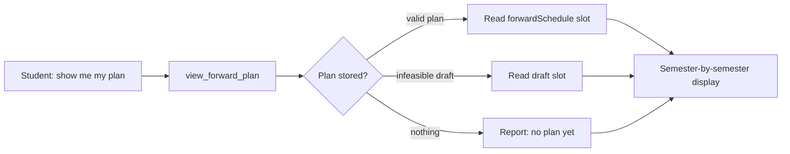
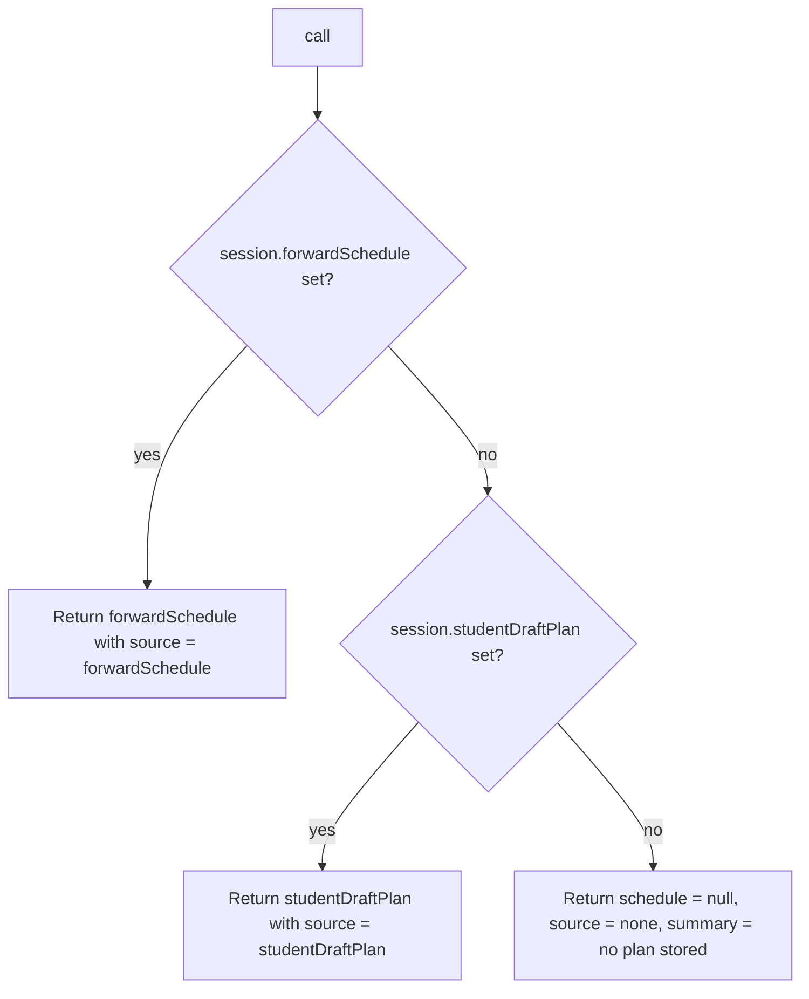

# `view_forward_plan` — Tool Audit

## TL;DR

When you ask "show me my degree plan," "what am I taking in Spring 2027?", or "when do I graduate according to my plan?", this tool just opens the file cabinet and shows you what's already there. It does not re-plan, does not call the solver, and does not change anything — it's purely a read of the most recent plan saved in your session. If you haven't asked for a plan yet, it'll politely report that there's nothing stored. If your last planning attempt produced something infeasible, it'll show you that draft (clearly marked) instead of pretending a valid plan exists. To regenerate or refresh the plan, you'd need the planning tool — this one is just the viewer.



---

Source files:
- Tool definition: `packages/engine/src/agent/tools/viewForwardPlan.ts`
- Tool contract: `packages/engine/src/agent/tool.ts`
- Forward schedule shape: imported from `@nyupath/shared` as `ForwardSchedule`

---

## 1. Purpose

`view_forward_plan` returns the student's **currently stored** forward degree plan without recalculating it. It's a pure session-slot reader. Used for:

- "Show me my degree plan."
- "What courses do I have planned for Spring 2027?"
- "When will I graduate according to my plan?"

It never recomputes the plan, never calls the solver, never mutates session state. To generate or refresh a plan, the LLM must call `plan_forward_degree` — this tool only displays what's already there.

---

## 2. Input schema

The input is empty:

```
{ /* no fields */ }
```

Defined at `viewForwardPlan.ts:42`.

- `isReadOnly` = `true` (line 43).
- `maxResultChars` = 4000 (line 44).
- `outputMode` is the default `"synthesis"`.

---

## 3. Session prerequisites + `validateInput`

There is **no `validateInput` hook**. The tool always runs. The result encodes "no plan stored" explicitly via `source: "none"` rather than as a rejection.

---

## 4. What it reads

From `ToolSession`:
- `session.forwardSchedule` — the canonical valid plan slot. Set only when the solver state is `"valid-clean"` or `"valid-with-trade-offs"`.
- `session.studentDraftPlan` — the draft-only slot. Holds plans whose state is `"infeasible-draft"` or `"student-preferred-invalid-draft"`. By design these never write to `forwardSchedule` so the agent does not endorse an illegal plan.

Each slot, if present, is a `ForwardSchedule` carrying:
- `state` — one of `"valid-clean"`, `"valid-with-trade-offs"`, `"infeasible-draft"`, or (per session-shape comments) `"student-preferred-invalid-draft"`.
- `graduationTerm` — the target term.
- `balanceScore` — numeric score from the solver.
- `degreeCreditsMet` — boolean.
- `semesters` — array of `{ term, plannedCredits, slots[] }`.
- `assumptions` — array of items including `IP_COURSE_COMPLETION` (`{ type, courseId }`).
- `computedAt` — timestamp (milliseconds).

It does NOT read the DPR, the student profile, or any catalog.

---

## 5. Algorithm

`call()` (`viewForwardPlan.ts:48-70`) runs a three-way precedence check:



Precedence is hard-coded:
1. **`forwardSchedule` wins** when set. The agent treats this as the validated plan.
2. **`studentDraftPlan` is the fallback** — returned only when there is no valid schedule. The summary line is annotated with `" [DRAFT — infeasible plan, not endorsed by the agent]"`.
3. **Otherwise** the output carries `schedule: null` with a fixed message: `"No forward degree plan is stored in this session. Call plan_forward_degree to generate one."`

The tool does NOT pick the "newest" plan by timestamp — `forwardSchedule` always wins over `studentDraftPlan` regardless of `computedAt`.

### Summary builder (`buildSummary`, lines 80-129)

For a present `ForwardSchedule`, the summary is composed as follows:

1. **State label** — one of:
   - `"VALID (no caveats)"` when `state === "valid-clean"`.
   - `"VALID with trade-offs (see assumptions)"` when `state === "valid-with-trade-offs"`.
   - `"INFEASIBLE DRAFT"` when `state === "infeasible-draft"`.
   - `"STUDENT-PREFERRED DRAFT"` for any other state (falls through to the default branch).
2. **Source suffix** — when called for `studentDraftPlan`, appends `" [DRAFT — infeasible plan, not endorsed by the agent]"` to the first line. Empty otherwise.
3. **Header lines** include: graduation target, balance score (2 decimals), `degreeCreditsMet` (yes/no), number of semesters, ISO-formatted `computedAt`.
4. **Per-semester rendering** — one line per semester, in the order they appear in `schedule.semesters`. Each line shows the term, planned credits, and a comma-separated slot list. Each slot is rendered by `kind`:
   - `specific_planned` → `"<courseId> (<credits>cr)"`
   - `placeholder`      → `"[placeholder: <category>] (<credits>cr)"`
   - `completed`        → `"<courseId> ✓"`
   - `in_progress`      → `"<courseId> (IP)"`
   - any other kind     → `"(unknown)"`
   - Empty slot list renders as `"(empty)"`.
5. **Assumptions tail** — when `schedule.assumptions.length > 0`, prints the count then the first three only. For each `IP_COURSE_COMPLETION` assumption, prints `"  [IP] <courseId>"`. Assumptions of other types fall through silently (no line printed). If more than three exist, appends `"  ... and <N> more"` at the end.

---

## 6. What it returns

```
{
  schedule:  ForwardSchedule | null,
  source:    "forwardSchedule" | "studentDraftPlan" | "none",
  summary:   string                                            // human-readable, see §8
}
```

Where `ForwardSchedule` (from `@nyupath/shared`) carries the fields described in §4.

When `source === "none"`, the structured `schedule` is literally `null` and the `summary` is the single-line `"No forward degree plan is stored in this session. Call plan_forward_degree to generate one."`

---

## 7. Envelope behavior

- **`outputMode: "synthesis"`** (default — no `extractVerbatim`). Validator does not pin any specific text.
- **`isReadOnly: true`** (line 43). The tool deliberately documents this and is a strict reader of two session slots.
- **`maxResultChars` = 4000**; summary truncated above that by `buildTool`.
- The tool never writes to `session.forwardSchedule`, `session.studentDraftPlan`, or any other field.

---

## 8. Summary text format

`summarizeResult` (lines 71-73) simply returns `output.summary` — the string `buildSummary` already composed.

### Layout (when a schedule is present):

```
FORWARD DEGREE PLAN[ [DRAFT — infeasible plan, not endorsed by the agent]] — <stateLabel>
Graduation target: <graduationTerm>
Balance score: <N.NN>
Degree credits met: <yes|no>
Semesters: <count>
Computed at: <ISO timestamp>

  <term1>: <credits>cr — <slot, slot, ...>
  <term2>: ...
  ...

Assumptions (<count>):
  [IP] <courseId>
  [IP] <courseId>
  [IP] <courseId>
  ... and <N> more
```

The empty line between the "Computed at:" block and the per-semester block is intentional (`buildSummary` line 102 pushes an empty string). The empty line before "Assumptions" is also intentional (line 116).

### Layout (when no schedule is stored):

```
No forward degree plan is stored in this session. Call plan_forward_degree to generate one.
```

---

## 9. Interactions with other tools

- **`plan_forward_degree`** — The writer counterpart. The tool description directs the LLM to call `plan_forward_degree` to generate or refresh the plan, and (when no plan exists) the "none" summary explicitly says so.
- **`confirm_plan_change`** — Lives on the same session slots; mutates `schedulePreferences` and triggers a re-solve that writes `forwardSchedule` or `studentDraftPlan`. `view_forward_plan` reads whatever those steps last wrote.
- **`compare_plan_alternatives`** — Reads `forwardSchedule.alternativeCandidates`. So when `view_forward_plan` shows a plan, `compare_plan_alternatives` can list the alternative variants attached to it.
- **`materialize_sections`** — Operates against the current `forwardSchedule` (specifically its semesters). The plan this tool surfaces is the plan that downstream materialization will use.
- **SSE / sidebar** — Per the session-shape comments in `tool.ts`, the SSE route and the chat sidebar both read `forwardSchedule`. `view_forward_plan` is the LLM-facing surface for the same data the UI shows.

This tool does NOT chain to anything itself; no `suggestedFollowUps`.

---

## 10. Edge cases

- **Both slots set** — `forwardSchedule` wins; `studentDraftPlan` is ignored. (By design: per the session-shape comments, `studentDraftPlan` exists precisely so a draft does not overwrite the valid plan.)
- **Only `studentDraftPlan` set** — Returned with `source: "studentDraftPlan"`. The summary's first line carries the `[DRAFT — infeasible plan, not endorsed by the agent]` annotation so the LLM cannot accidentally endorse it.
- **Neither slot set** — Output is `{ schedule: null, source: "none", summary: "No forward degree plan is stored in this session. Call plan_forward_degree to generate one." }`. The LLM is supposed to call `plan_forward_degree` next.
- **`state` is `"valid-clean"`** — Label is `"VALID (no caveats)"`.
- **`state` is `"valid-with-trade-offs"`** — Label is `"VALID with trade-offs (see assumptions)"`.
- **`state` is `"infeasible-draft"`** — Label is `"INFEASIBLE DRAFT"`. Realistically only happens via the `studentDraftPlan` slot.
- **`state` is anything else** (e.g. `"student-preferred-invalid-draft"`) — Falls through to `"STUDENT-PREFERRED DRAFT"`.
- **A semester with empty `slots[]`** — Renders as `<term>: <credits>cr — (empty)`.
- **A slot with an unrecognized `kind`** — Renders as `(unknown)`.
- **`assumptions.length === 0`** — The Assumptions block is omitted (including the leading empty line).
- **Assumptions but none are `IP_COURSE_COMPLETION`** — The "Assumptions (N):" header is printed but the inner loop renders nothing for assumptions of other types. The result is a header followed by no detail lines (and possibly a `"... and N more"` tail if more than 3 exist).
- **More than three assumptions** — Only the first three are inspected; the rest are summarized as `"... and <N - 3> more"`. So even if assumption #4 is the most important one, this tool doesn't surface it.
- **`computedAt` not a valid millisecond timestamp** — `new Date(schedule.computedAt).toISOString()` would throw on an invalid value. The tool does not guard against this.
- **`balanceScore` not a number** — `(score).toFixed(2)` would throw. The tool does not guard against this.
- **`schedule.semesters` undefined** — Would throw on `.length` access. The tool assumes a well-formed `ForwardSchedule`.
- **`maxResultChars` (4000) exceeded** — `buildTool` truncates with a trailing `…`. The structured output is unaffected.

---

## Summary

`view_forward_plan` is a strict, read-only session-slot reader. It checks `forwardSchedule` first, then `studentDraftPlan`, then returns a fixed "no plan" message. The summary surfaces graduation term, balance score, `degreeCreditsMet`, semester-by-semester slot listings (with per-`kind` rendering for `specific_planned` / `placeholder` / `completed` / `in_progress`), and up to three `IP_COURSE_COMPLETION` assumptions. When the source is the draft slot, the summary header carries an explicit "not endorsed by the agent" annotation. The tool itself never recomputes anything; `plan_forward_degree` is the writer.
