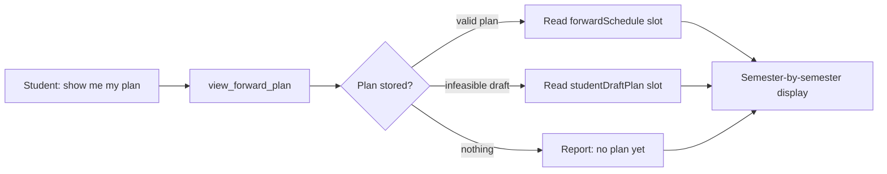
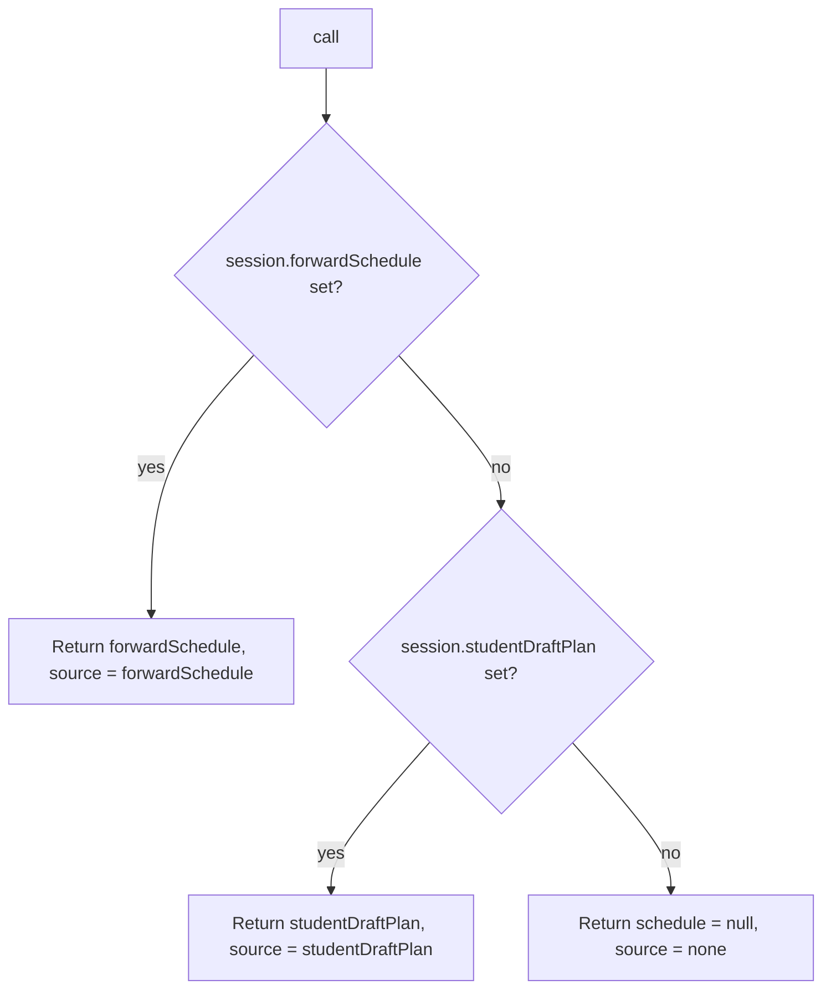

# view_forward_plan — Tool Audit

> Last verified against code: 2026-06-13 (doc-sync pass: corrected `call()` line range to viewForwardPlan.ts:64-87).

## Purpose

When a student asks "show me my degree plan," "what am I taking in Spring 2027?", or "when do I graduate according to my plan?", this tool just opens the file cabinet and shows what's already there. It does not re-plan, does not call the solver, and does not change anything — it is a pure read of the most recent plan saved in the session. If no plan has been generated yet, it reports that nothing is stored. If the last planning attempt produced an infeasible draft, it shows that draft (clearly marked) instead of pretending a valid plan exists. To regenerate or refresh the plan, the LLM must call [`plan_forward_degree`](plan_forward_degree.md) — this tool is only the viewer.



---

Source files:
- Tool definition: `packages/engine/src/agent/tools/viewForwardPlan.ts`
- Tool contract: `packages/engine/src/agent/tool.ts`
- Forward-schedule shape: `ForwardSchedule` from `@nyupath/shared`

---

## 1. What it does

`view_forward_plan` returns the student's **currently stored** forward degree plan without recalculating it. It is a strict session-slot reader. Used for:

- "Show me my degree plan."
- "What courses do I have planned for Spring 2027?"
- "When will I graduate according to my plan?"

It never recomputes the plan, never calls the solver, never mutates session state. To generate or refresh a plan, the LLM must call [`plan_forward_degree`](plan_forward_degree.md).

---

## 2. Input schema

One optional field — the detail level (D1.1):

```
{ detail?: "terse" | "rich" }   // default "terse"
```

- `detail: "terse"` (default, and what the no-arg call resolves to) → the compact one-line-per-term view (byte-identical to the pre-D1.1 output).
- `detail: "rich"` → surfaces the per-slot reasoning the stored plan already carries (see §4 / §7-rich): recorded rationale (the "why"), lock-vs-movable status, flexibility (earliest/latest term + alternatives), downstream impact, and critical-path flags. Use it to answer "why is `<course>` in `<term>`?", "which courses are locked vs. movable?", and "how flexible is this slot?".

- `isReadOnly` = `true`.
- `maxResultChars` = **8000** (raised from 4000 for the larger rich output; the terse path is well under the old cap).
- `outputMode` is the default `"synthesis"`.

There is **no `validateInput` hook** — the tool always runs. Unlike the planner, it does **not** hard-refuse without a DPR; "no plan stored" is encoded explicitly as `source: "none"` rather than as a rejection. The `detail` arg never gates the run — it only selects the summary renderer; an unknown/absent value resolves to `"terse"`.

---

## 3. What it reads

From `ToolSession`:
- `session.forwardSchedule` — the canonical valid-plan slot. Set only when the schedule's state is `valid-clean` or `valid-with-trade-offs`.
- `session.studentDraftPlan` — the draft-only slot. Holds plans whose state is `infeasible-draft` (or, in principle, `student-preferred-invalid-draft`). By design these never write to `forwardSchedule`, so the agent does not endorse an illegal plan.

Each slot, when present, is a `ForwardSchedule`. The tool reads `state`, `graduationTerm`, `balanceScore`, `degreeCreditsMet`, `semesters[]`, `assumptions[]`, and `computedAt`. It does NOT read the DPR, the student profile, or any catalog.

---

## 4. Algorithm

`call()` (`viewForwardPlan.ts:64-87`) runs a three-way precedence check:



Precedence is hard-coded:
1. **`forwardSchedule` wins** when set — treated as the validated plan.
2. **`studentDraftPlan` is the fallback** — returned only when there is no valid schedule. The summary's first line is annotated with `" [DRAFT — infeasible plan, not endorsed by the agent]"`.
3. **Otherwise** the output carries `schedule: null` with the fixed message `"No forward degree plan is stored in this session. Call plan_forward_degree to generate one."`

The tool does NOT pick the newest plan by `computedAt` — `forwardSchedule` always wins over `studentDraftPlan` regardless of timestamp.

### Summary builder (`buildSummary(schedule, source, detail)`)

`call()` reads `input.detail ?? "terse"` and threads it into `buildSummary`. The **header** (state label, source suffix, graduation target, balance, credits-met, semester count, ISO `computedAt`) and the **assumptions tail** are identical across both detail levels; only the per-semester body differs.

For a present `ForwardSchedule`:

1. **State label** — `valid-clean` → `"VALID (no caveats)"`; `valid-with-trade-offs` → `"VALID with trade-offs (see assumptions)"`; `infeasible-draft` → `"INFEASIBLE DRAFT"`; anything else → `"STUDENT-PREFERRED DRAFT"` (default branch).
2. **Source suffix** — when reading `studentDraftPlan`, appends `" [DRAFT — infeasible plan, not endorsed by the agent]"` to the first line.
3. **Header lines** — graduation target, balance score (2 decimals), `degreeCreditsMet` (yes/no), semester count, ISO-formatted `computedAt`.
4. **Per-semester rendering (terse — the default)** — one line per semester in `schedule.semesters` order: term, planned credits, comma-separated slot list. Each slot rendered by `kind`:
   - `specific_planned` → `"<courseId> (<credits>cr)"`
   - `placeholder`      → `"[placeholder: <category>] (<credits>cr)"`
   - `completed`        → `"<courseId> ✓"`
   - `in_progress`      → `"<courseId> (IP)"`
   - any other kind     → `"(unknown)"`
   - Empty slot list    → `"(empty)"`
5. **Per-semester rendering (rich — `detail: "rich"`)** — `appendRichSemester` / `appendRichSlot`. The terse one-liner is replaced by a labeled multi-line block per semester:
   - **Semester header** — `"  <term>: <plannedCredits>cr"` plus `" 🔒 LOCKED (slots fixed)"` when `sem.locked`, then a `load:` line from `loadRationale` (`strategy · target · slack · weighted · hard / easy`).
   - **Lock-vs-movable marker per slot** (the headline) — `completed` → `🔒 locked (taken/final)`; `in_progress` → `◐ in progress (fixed in term)`; `specific_planned`/`placeholder` → `○ planned (movable)`, OR `🔒 fixed (locked term)` when the semester is `locked`.
   - **`specific_planned` slot** — marker + `courseId` + `⚠ critical path` (when `isCriticalPath`); then labeled lines for `why:` (the recorded `reason` — load-bearing), `satisfies:` (`rationale.satisfiesRequirements`, when non-empty), `tier:` (`workloadTier`), `flexibility:` (`earliest → latest` from `flexibility`), `alternatives:` (when present), `downstream:` (dependent-course count + graduation delay, only when non-trivial), and `droppable:` (from `optionalReason`, when present).
   - **`placeholder` slot** — same fields keyed off `category` / `satisfiesRules`, plus `pool candidates:` from `poolBinding.candidates` when present.
   - **`completed` / `in_progress`** — marker + `courseId` + credits (+ `grade` for completed).
   - Only fields actually present are printed (optionals guarded); nothing is invented.
6. **Assumptions tail** — when `assumptions.length > 0`, prints the count then the **first three only**. Each `IP_COURSE_COMPLETION` assumption prints `"  [IP] <courseId>"`; other types render nothing. More than three → appends `"  ... and <N - 3> more"`.

---

## 5. What it returns

```
{
  schedule:  ForwardSchedule | null,
  source:    "forwardSchedule" | "studentDraftPlan" | "none",
  summary:   string
}
```

When `source === "none"`, `schedule` is literally `null` and `summary` is the single-line "no plan" message.

---

## 6. Envelope behavior

- `outputMode: "synthesis"` (default — no `extractVerbatim`). The validator pins no specific text.
- `isReadOnly: true`. The tool is a strict reader of two session slots and never writes.
- `maxResultChars` = **8000**; the summary is truncated above that by `buildTool` (slice + `"…"`). Raised from 4000 for the rich path. A fully-detailed rich slot is ~10 labeled lines (~400 chars), so a very large multi-semester plan in rich mode can still approach/exceed the cap and have its trailing semesters truncated — non-fatal (the header + early semesters always survive); ask for a specific term when a full plan is large. Terse output stays well under the cap.

---

## 7. Layout (when a schedule is present)

### Terse (`detail: "terse"`, default)

```
FORWARD DEGREE PLAN[ [DRAFT — infeasible plan, not endorsed by the agent]] — <stateLabel>
Graduation target: <graduationTerm>
Balance score: <N.NN>
Degree credits met: <yes|no>
Semesters: <count>
Computed at: <ISO timestamp>

  <term1>: <credits>cr — <slot, slot, ...>
  <term2>: ...

Assumptions (<count>):
  [IP] <courseId>
  ... and <N> more
```

The blank line after "Computed at:" and the blank line before "Assumptions" are intentional.

### Rich (`detail: "rich"`)

Same header + assumptions tail; the per-semester body is the labeled block:

```
  <term>: <credits>cr[ 🔒 LOCKED (slots fixed)]
    load: <strategy> · target <N>cr · slack <N> · weighted <N> · hard <N> / easy <N>
    🔒 locked (taken/final) <courseId> (<credits>cr, grade <G>)        # completed
    ◐ in progress (fixed in term) <courseId> (<credits>cr)            # in_progress
    ○ planned (movable) <courseId> (<credits>cr)[ ⚠ critical path]    # specific_planned (or 🔒 fixed in a locked term)
      why: <reason>
      satisfies: <ruleId, ...>
      tier: <workloadTier>
      flexibility: earliest <term> → latest <term>
      alternatives: <courseId, ...>
      downstream: <N> dependent course(s)[ · graduation delay <N> term(s) if moved]
    ○ planned (movable) [<category>] (<credits>cr)                    # placeholder
      ... (same labeled fields) ...
      droppable: <yes|no>
      pool candidates: <courseId, ...>
```

When no schedule is stored:

```
No forward degree plan is stored in this session. Call plan_forward_degree to generate one.
```

---

## 8. Interactions

- **`plan_forward_degree`** — the writer counterpart. The description directs the LLM to call it to generate/refresh; the "none" summary says so explicitly.
- **`confirm_plan_change`** — writes `forwardSchedule` or `studentDraftPlan` after a re-solve; `view_forward_plan` reads whatever it last wrote.
- **`compare_plan_alternatives`** — reads `forwardSchedule.alternativeCandidates`, the alternative variants attached to the plan this tool surfaces.
- **`materialize_sections`** — operates against the current `forwardSchedule` semesters; the plan this tool shows is the one downstream materialization uses.
- **SSE / sidebar** — both read `forwardSchedule`; this tool is the LLM-facing surface for the same data.

This tool chains to nothing and emits no `suggestedFollowUps`.

---

## 9. Edge cases

- **Both slots set** — `forwardSchedule` wins; `studentDraftPlan` is ignored. (By design: a draft never overwrites a valid plan.)
- **Only `studentDraftPlan` set** — returned with `source: "studentDraftPlan"` and the `[DRAFT …]` annotation.
- **Neither slot set** — `{ schedule: null, source: "none", summary: "No forward degree plan …" }`.
- **A semester with empty `slots[]`** — renders `<term>: <credits>cr — (empty)`.
- **A slot with an unrecognized `kind`** — renders `(unknown)`.
- **`assumptions.length === 0`** — the Assumptions block (including its leading blank line) is omitted.
- **Assumptions present but none `IP_COURSE_COMPLETION`** — the `Assumptions (N):` header prints but the loop renders no detail lines (and a `... and N more` tail when more than 3 exist).
- **More than three assumptions** — only the first three are inspected; the rest are summarized as `... and <N - 3> more`, so a more-important fourth assumption is not surfaced.
- **`computedAt` not a valid ms timestamp** — `new Date(...).toISOString()` would throw; the tool does not guard.
- **`balanceScore` not a number** — `.toFixed(2)` would throw; the tool does not guard.
- **`schedule.semesters` undefined** — `.length` would throw; the tool assumes a well-formed `ForwardSchedule`.

---

## 10. Explain-why affordance (D1.2 — verified, no per-question router)

"Why is course X planned for term Y?" is answered by **composing this tool**, not by a dedicated keyword-routed handler. The agent calls `view_forward_plan` with `detail: "rich"`, reads the target slot's recorded `reason` (the WHY) + flexibility window + critical-path flag from the summary, and cites it VERBATIM — never inventing a rationale. The affordance is wired by D1.1 (rich slot detail here) + the tool `description` (advertises rich detail for "why is `<course>` in `<term>`?" and says to cite the recorded reason, "never invent one") + D4.1's CORE RULE 9 (directs the agent to explain WHY citing the recorded rationale).

This composition is **verified** by `packages/engine/tests/agent/explainWhy.eval.ts`:

- **Deterministic affordance pin (runs in CI, no API key)** — builds a `ForwardSchedule` with a `specific_planned` slot carrying a known `reason` + flexibility window + `isCriticalPath`, drives `view_forward_plan` with `{ detail: "rich" }` over a session holding that schedule, and asserts the tool summary CONTAINS the recorded reason + the flexibility terms (and that terse mode does NOT carry the reason — so the affordance is detail-gated). This is the "compose, don't fabricate" data contract: the explain-why material the agent would cite is reachable through the tool. A light wiring check also asserts the tool `description` advertises rich detail for "why" questions.
- **Operator-gated agent-loop eval (`ANTHROPIC_API_KEY`)** — drives a REAL agent turn (`runAgentTurn` + `buildDefaultRegistry()` + `buildSystemPrompt(...)` over a `ToolSession` carrying the fixture `forwardSchedule`) asking "Why is CSCI-UA 102 planned for Fall 2027?" and asserts the reply (a) CITES the recorded reason and/or flexibility window, (b) did so by CALLING `view_forward_plan` (composition, not a hardcoded handler), and (c) does NOT fabricate a different rationale. Skips cleanly with no key.

---

## Known limitations

- **The rich per-slot plan data IS now surfaced — `detail: "rich"` (D1.1).** Every `specific_planned` / `placeholder` slot on the stored `ForwardSchedule` carries `reason`, `rationale`, `flexibility`, `downstreamImpact`, `workloadTier`, `optionalReason`, and `isCriticalPath` (`packages/shared/src/types.ts:931`), and each `ForwardSemester` carries `locked` + `loadRationale`. `detail: "rich"` renders all of these as labeled text (see §4.5 / §7-rich) so the "why this course here / what's locked vs movable / how flexible this slot is / what slips if it moves" reasoning reaches the LLM. The default `detail: "terse"` stays byte-identical to the pre-D1.1 one-liner. (No new fields invented — only what's present is printed.) **Remaining bound:** rich output for a maximal multi-semester plan can exceed `maxResultChars` (8000) and have trailing semesters truncated — the header + early terms always survive; narrow to a single term for very large plans.
- **Only the first three assumptions reach the summary**, and only `IP_COURSE_COMPLETION` types render a line (see edge cases above).
- **No defensive guards** on malformed `computedAt` / `balanceScore` / `semesters` — the tool trusts the stored shape.
