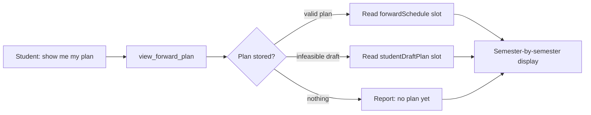
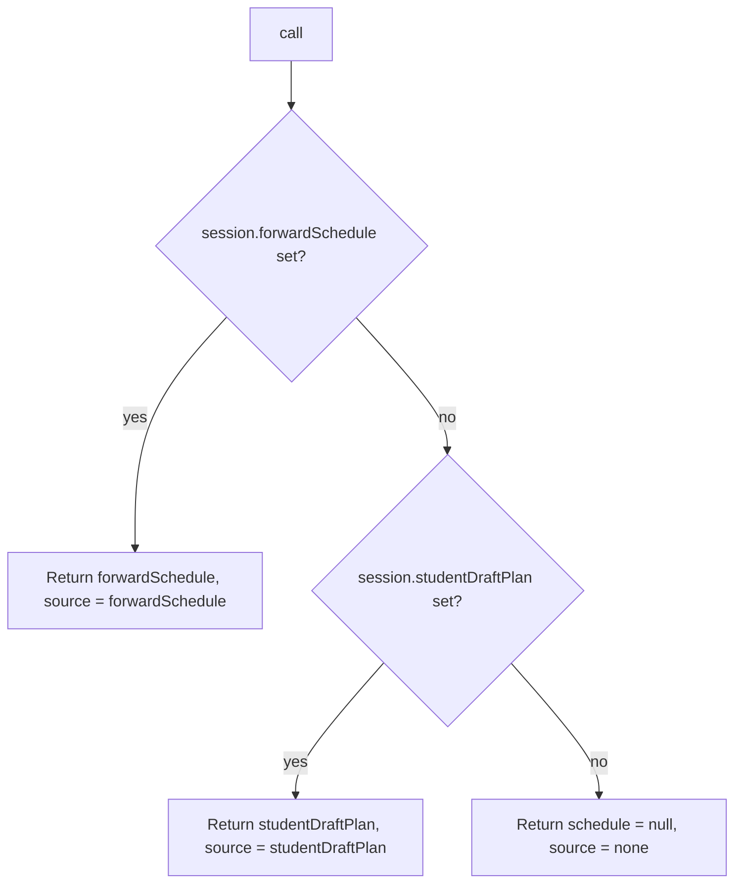

# view_forward_plan — Tool Audit

> Last verified against code: 2026-06-10 (post planning-engine rebuild, PRs #35-#41).

## Purpose

When a student asks "show me my degree plan," "what am I taking in Spring 2027?", or "when do I graduate according to my plan?", this tool just opens the file cabinet and shows what's already there. It does not re-plan, does not call the solver, and does not change anything — it is a pure read of the most recent plan saved in the session. If no plan has been generated yet, it reports that nothing is stored. If the last planning attempt produced an infeasible draft, it shows that draft (clearly marked) instead of pretending a valid plan exists. To regenerate or refresh the plan, the LLM must call [`plan_forward_degree`](plan_forward_degree.md) — this tool is only the viewer.



---

Source files:
- Tool definition: `packages/engine/src/agent/tools/viewForwardPlan.ts`
- Tool contract: `packages/engine/src/agent/tool.ts`
- Forward-schedule shape: `ForwardSchedule` from `@nyupath/shared`

---

## 1. What it does

`view_forward_plan` returns the student's **currently stored** forward degree plan without recalculating it. It is a strict session-slot reader. Used for:

- "Show me my degree plan."
- "What courses do I have planned for Spring 2027?"
- "When will I graduate according to my plan?"

It never recomputes the plan, never calls the solver, never mutates session state. To generate or refresh a plan, the LLM must call [`plan_forward_degree`](plan_forward_degree.md).

---

## 2. Input schema

Empty (`viewForwardPlan.ts:42`):

```
{ /* no fields */ }
```

- `isReadOnly` = `true` (line 43).
- `maxResultChars` = 4000 (line 44).
- `outputMode` is the default `"synthesis"`.

There is **no `validateInput` hook** — the tool always runs. Unlike the planner, it does **not** hard-refuse without a DPR; "no plan stored" is encoded explicitly as `source: "none"` rather than as a rejection.

---

## 3. What it reads

From `ToolSession`:
- `session.forwardSchedule` — the canonical valid-plan slot. Set only when the schedule's state is `valid-clean` or `valid-with-trade-offs`.
- `session.studentDraftPlan` — the draft-only slot. Holds plans whose state is `infeasible-draft` (or, in principle, `student-preferred-invalid-draft`). By design these never write to `forwardSchedule`, so the agent does not endorse an illegal plan.

Each slot, when present, is a `ForwardSchedule`. The tool reads `state`, `graduationTerm`, `balanceScore`, `degreeCreditsMet`, `semesters[]`, `assumptions[]`, and `computedAt`. It does NOT read the DPR, the student profile, or any catalog.

---

## 4. Algorithm

`call()` (`viewForwardPlan.ts:48-70`) runs a three-way precedence check:



Precedence is hard-coded:
1. **`forwardSchedule` wins** when set — treated as the validated plan.
2. **`studentDraftPlan` is the fallback** — returned only when there is no valid schedule. The summary's first line is annotated with `" [DRAFT — infeasible plan, not endorsed by the agent]"`.
3. **Otherwise** the output carries `schedule: null` with the fixed message `"No forward degree plan is stored in this session. Call plan_forward_degree to generate one."`

The tool does NOT pick the newest plan by `computedAt` — `forwardSchedule` always wins over `studentDraftPlan` regardless of timestamp.

### Summary builder (`buildSummary`, lines 80-129)

For a present `ForwardSchedule`:

1. **State label** — `valid-clean` → `"VALID (no caveats)"`; `valid-with-trade-offs` → `"VALID with trade-offs (see assumptions)"`; `infeasible-draft` → `"INFEASIBLE DRAFT"`; anything else → `"STUDENT-PREFERRED DRAFT"` (default branch).
2. **Source suffix** — when reading `studentDraftPlan`, appends `" [DRAFT — infeasible plan, not endorsed by the agent]"` to the first line.
3. **Header lines** — graduation target, balance score (2 decimals), `degreeCreditsMet` (yes/no), semester count, ISO-formatted `computedAt`.
4. **Per-semester rendering** — one line per semester in `schedule.semesters` order: term, planned credits, comma-separated slot list. Each slot rendered by `kind`:
   - `specific_planned` → `"<courseId> (<credits>cr)"`
   - `placeholder`      → `"[placeholder: <category>] (<credits>cr)"`
   - `completed`        → `"<courseId> ✓"`
   - `in_progress`      → `"<courseId> (IP)"`
   - any other kind     → `"(unknown)"`
   - Empty slot list    → `"(empty)"`
5. **Assumptions tail** — when `assumptions.length > 0`, prints the count then the **first three only**. Each `IP_COURSE_COMPLETION` assumption prints `"  [IP] <courseId>"`; other types render nothing. More than three → appends `"  ... and <N - 3> more"`.

---

## 5. What it returns

```
{
  schedule:  ForwardSchedule | null,
  source:    "forwardSchedule" | "studentDraftPlan" | "none",
  summary:   string
}
```

When `source === "none"`, `schedule` is literally `null` and `summary` is the single-line "no plan" message.

---

## 6. Envelope behavior

- `outputMode: "synthesis"` (default — no `extractVerbatim`). The validator pins no specific text.
- `isReadOnly: true`. The tool is a strict reader of two session slots and never writes.
- `maxResultChars` = 4000; the summary is truncated above that by `buildTool`.

---

## 7. Layout (when a schedule is present)

```
FORWARD DEGREE PLAN[ [DRAFT — infeasible plan, not endorsed by the agent]] — <stateLabel>
Graduation target: <graduationTerm>
Balance score: <N.NN>
Degree credits met: <yes|no>
Semesters: <count>
Computed at: <ISO timestamp>

  <term1>: <credits>cr — <slot, slot, ...>
  <term2>: ...

Assumptions (<count>):
  [IP] <courseId>
  ... and <N> more
```

The blank line after "Computed at:" (line 102) and the blank line before "Assumptions" (line 116) are intentional.

When no schedule is stored:

```
No forward degree plan is stored in this session. Call plan_forward_degree to generate one.
```

---

## 8. Interactions

- **`plan_forward_degree`** — the writer counterpart. The description directs the LLM to call it to generate/refresh; the "none" summary says so explicitly.
- **`confirm_plan_change`** — writes `forwardSchedule` or `studentDraftPlan` after a re-solve; `view_forward_plan` reads whatever it last wrote.
- **`compare_plan_alternatives`** — reads `forwardSchedule.alternativeCandidates`, the alternative variants attached to the plan this tool surfaces.
- **`materialize_sections`** — operates against the current `forwardSchedule` semesters; the plan this tool shows is the one downstream materialization uses.
- **SSE / sidebar** — both read `forwardSchedule`; this tool is the LLM-facing surface for the same data.

This tool chains to nothing and emits no `suggestedFollowUps`.

---

## 9. Edge cases

- **Both slots set** — `forwardSchedule` wins; `studentDraftPlan` is ignored. (By design: a draft never overwrites a valid plan.)
- **Only `studentDraftPlan` set** — returned with `source: "studentDraftPlan"` and the `[DRAFT …]` annotation.
- **Neither slot set** — `{ schedule: null, source: "none", summary: "No forward degree plan …" }`.
- **A semester with empty `slots[]`** — renders `<term>: <credits>cr — (empty)`.
- **A slot with an unrecognized `kind`** — renders `(unknown)`.
- **`assumptions.length === 0`** — the Assumptions block (including its leading blank line) is omitted.
- **Assumptions present but none `IP_COURSE_COMPLETION`** — the `Assumptions (N):` header prints but the loop renders no detail lines (and a `... and N more` tail when more than 3 exist).
- **More than three assumptions** — only the first three are inspected; the rest are summarized as `... and <N - 3> more`, so a more-important fourth assumption is not surfaced.
- **`computedAt` not a valid ms timestamp** — `new Date(...).toISOString()` would throw; the tool does not guard.
- **`balanceScore` not a number** — `.toFixed(2)` would throw; the tool does not guard.
- **`schedule.semesters` undefined** — `.length` would throw; the tool assumes a well-formed `ForwardSchedule`.

---

## Known limitations

- **The rich per-slot plan data is NOT surfaced — a Phase-3 gap.** Every `specific_planned` / `placeholder` slot on the stored `ForwardSchedule` carries `rationale`, `flexibility`, `downstreamImpact`, and `isCriticalPath` (`packages/shared/src/types.ts:931`). `buildSummary` (`viewForwardPlan.ts:104-113`) prints only `kind`, `courseId`, `credits`, and the placeholder `category`. The "why this course here / what moves if it slips / how flexible this slot is" reasoning exists on the plan but never reaches the LLM-visible summary. Surfacing it is deferred to a later phase.
- **Only the first three assumptions reach the summary**, and only `IP_COURSE_COMPLETION` types render a line (see edge cases above).
- **No defensive guards** on malformed `computedAt` / `balanceScore` / `semesters` — the tool trusts the stored shape.
