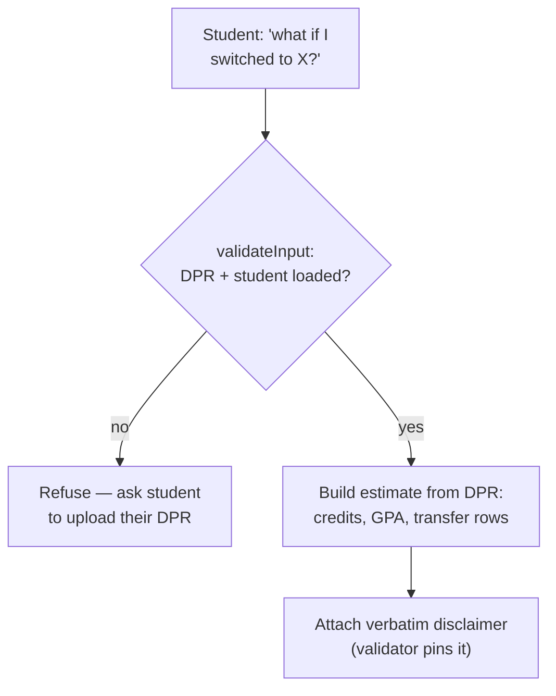

# `what_if_audit` — Tool Audit

> Last verified against code: 2026-06-10 (post planning-engine rebuild, PRs #35-#41).
>
> **Place in the plan-35 what-if taxonomy (2026-06-18):** `what_if_audit` is **Branch C** — the confidence-disclaimed read-only ESTIMATE for an open hypothetical (it never ingests a file). Two sibling branches now exist: **Branch A** = a hypothetical PROGRAM change resolved by UPLOADING the student's Albert What-If report (`/api/whatif-audit` → parses as a synthetic DPR → labeled NON-committed exploration; never overwrites `students.parsed_dpr`); **Branch B** = a current-term withdraw/pass-fail modeled deterministically via the `probe_counterfactual` what-if arms + the confirmable `propose_whatif_assumption` flow (see [../engine/dpr.md](../engine/dpr.md)). CORE RULE 16 routes between them.

Source files:
- Tool definition (the whole tool): `packages/engine/src/agent/tools/whatIfAudit.ts`
- Tool contract: `packages/engine/src/agent/tool.ts`
- Verbatim-disclaimer envelope shape: `packages/engine/src/agent/toolEnvelope.ts`

---

## Purpose

`what_if_audit` answers *hypothetical PROGRAM-change* questions — "what if I switched my major to econ?", "should I add a math minor?", "what would it look like if I did a second major in data science?" — **without modifying the student's profile**.

It is now a **pure-RAG estimate**, never a deterministic audit. There is never a real DPR for a hypothetical program, so NYU can only produce an audit-grade verdict by recomputing the student's DPR for the new program. This tool therefore returns one thing: a structured **estimate envelope** that (a) summarizes the student's current state from their real DPR, (b) points them at `search_policy` for the hypothetical program's bulletin requirements + an adviser, and (c) carries a **verbatim disclaimer** the response validator pins into the LLM's reply.

The old authored, deterministic path — a rule engine that cloned the profile and ran `crossProgramAudit` over `programs.json` — was **removed** in the rule-engine decommission (the entire `audit/whatIfAudit.ts` and `crossProgramAudit` engine no longer exist). The 1-program authored stub could only ever audit a single hypothetical, and the DPR-first design relies on the student's real audit plus bulletin RAG instead. See the [Known limitations](#known-limitations) note.

> Course-level "what if I take A instead of B" is a **different** question. It runs the forward-schedule solver via [`propose_plan_change`](./propose_plan_change.md) / [`simulate_alternatives`](./simulate_alternatives.md) against the student's plan — **not** this tool. The tool's own description routes the model there.



---

## 1. Input schema

Defined at `whatIfAudit.ts:53-58`:

```
{
  hypotheticalPrograms: string[]              // program ids, e.g. ["economics_ba", "mathematics_minor"]
  compareWithCurrent?: boolean = true         // RETAINED FOR COMPATIBILITY ONLY — see note below
}
```

- `maxResultChars` = 3000 (line 59).
- `outputMode` = `"semi_hardened"` (line 61).
- `isReadOnly` defaults to `true` (from `buildTool`).

`compareWithCurrent` is now inert: the schema still accepts it (line 56-57) so old callers don't break, but `call()` never reads it. The estimate is *always* framed against the student's current DPR — there is no longer a deterministic-diff branch to toggle.

---

## 2. Session prerequisites + `validateInput`

`validateInput` (`whatIfAudit.ts:62-77`) rejects, in this order:

1. **No DPR loaded, or no student** (`session.degreeProgressReport` or `session.student` missing). Returns: `"I need your Albert Degree Progress Report (DPR) to frame a what-if comparison. Please upload your DPR and try again."` This check runs FIRST — the estimate is framed against the student's real coursework, which comes from the DPR.
2. **Empty hypothetical list.** Returns: `"hypotheticalPrograms must be non-empty."`

The hook does **not** check whether each program id exists in any catalog — there is no catalog path left to route to. This is the DPR-first doctrine: DPR is the authoritative tier-1 record; the hypothetical program's requirements are tier-2 bulletin RAG fetched via `search_policy`, never an authored rule set.

---

## 3. What it reads

From `ToolSession`, `call()` reads only:
- `session.degreeProgressReport` — **required** (`validateInput` rejects without it). Used to compose the `guidance` string:
  - `dpr.cumulative.creditsUsed` (`?? 0`)
  - `dpr.cumulative.cumulativeGpa` (`?? 0`)
  - the count of `dpr.courseHistory` rows whose `type === "TE"` (transfer entries)
- `session.student` — required by `validateInput`, but `call()` itself does not read any field off it.

It no longer reads `session.programs`, `session.courses`, or `session.schoolConfig` — those imports and the audit engine they fed are gone.

---

## 4. Algorithm

`call()` (`whatIfAudit.ts:83-110`) has a single path. There is no longer a branch on whether programs are "in catalog."

1. Read `dpr = session.degreeProgressReport`.
2. Build the `guidance` string. Because `validateInput` guarantees a DPR, the with-DPR branch always runs:
   - **With DPR** (the live branch, lines 89-97):
     `"Your current state from the DPR: <credits> credits earned, cumulative GPA <gpa, fixed to 3 decimals>, <transferRowCount> transfer-credit row(s) recorded. Run search_policy for the hypothetical program's bulletin requirements; cross-reference your earned credits against those requirements; consult an adviser for the official audit."`
   - **Without DPR** (lines 98-102 — *now unreachable*, `validateInput` rejects first): a fallback string `"No DPR loaded — use search_policy to look up the hypothetical program's requirements in the bulletin, and consult an adviser for the official audit."` Kept only for defensive completeness.
3. Return an `UnauthoredProgramEstimate` (the only output shape):
   - `kind: "unauthored_program_estimate"`
   - `requestedProgramIds`: the input `hypotheticalPrograms` verbatim (all of them, not a filtered subset — there is no catalog to filter against)
   - `disclaimer`: the verbatim text (see §6)
   - `guidance`: the string above

### The verbatim disclaimer

Defined as the `DISCLAIMER` constant at `whatIfAudit.ts:37-39`:

> **"This estimate is based on AI-extracted requirements from NYU's bulletin. Verify with an academic adviser before applying for an internal transfer or program change."**

This exact string is:
1. Embedded in the returned `UnauthoredProgramEstimate.disclaimer` field (line 107).
2. Appended to the summary text with the prefix `"REQUIRED DISCLAIMER (must appear verbatim in your reply): "` (line 118).
3. Returned from `extractVerbatim()` (lines 121-123). The validator's verbatim-drift check pins this text — the LLM's reply MUST contain it unchanged.

---

## 5. What it returns

The output is always one shape — `UnauthoredProgramEstimate` (`whatIfAudit.ts:26-35`):

```
{
  kind: "unauthored_program_estimate",
  requestedProgramIds: string[],   // the hypothetical ids, echoed back
  disclaimer: string,              // the fixed verbatim text above
  guidance: string                 // DPR-derived next-step guidance
}
```

There is no longer a discriminated union; the `WhatIfResult` / `CrossProgramAuditResult` / `comparison` shapes from the old authored path are gone.

---

## 6. Envelope behavior

- **Output mode is `semi_hardened`** (line 61).
- **`extractVerbatim`** (lines 121-123) **always** returns the disclaimer — there is no longer a path that returns `null`. Every call pins the disclaimer into the reply.
- **`isReadOnly: true`** (default).
- **`maxResultChars` = 3000**; `summarizeResult` is truncated above that.
- The tool never mutates `session` and never mutates `student` — it only reads the DPR cumulative block.

---

## 7. Summary text format

`summarizeResult` (`whatIfAudit.ts:111-120`) emits a single shape:

```
WHAT-IF (estimate — there is no DPR for a hypothetical program)
  Requested program(s): <ids>
  Guidance: <guidance>
  REQUIRED DISCLAIMER (must appear verbatim in your reply): <disclaimer>
```

There is no longer an "authored path" branch in `summarizeResult` (no unmet-rule counts, no comparison block, no warnings line) — those were deleted with the audit engine.

---

## 8. Interactions with other tools

- **`search_policy`** — the `guidance` string explicitly tells the model to fire `search_policy` next for the hypothetical program's bulletin requirements. This is the intended chain. See [`search_policy`](./search_policy.md).
- **`run_full_audit`** — the authoritative DPR audit for the *current* declared programs. `what_if_audit` reads the same `dpr.cumulative` block to anchor its estimate, but does not call `run_full_audit`. See [`run_full_audit`](./run_full_audit.md).
- **`propose_plan_change` / `simulate_alternatives`** — the correct destination for *course-level* "what if I take A instead of B" questions; those run the forward-schedule solver. `what_if_audit` is only for *program-level* hypotheticals. See [`propose_plan_change`](./propose_plan_change.md) and [`simulate_alternatives`](./simulate_alternatives.md).
- **Verbatim contract enforcement** — depends on the response validator that consumes `outputMode: "semi_hardened"` and `extractVerbatim`. The exact `DISCLAIMER` string must appear unchanged in the LLM's reply.

---

## 9. Edge cases

- **No DPR loaded (or no student)** — rejected by `validateInput` before `call()` runs. Returns the "upload your DPR" message.
- **Empty `hypotheticalPrograms` array** — rejected by `validateInput` (after the DPR check passes).
- **Multiple hypothetical ids** — all are echoed back in `requestedProgramIds`; there is no per-program audit, so the count of ids does not change the output structure.
- **DPR loaded but `creditsUsed` / `cumulativeGpa` undefined** — fall back to `?? 0`. The guidance still composes; numbers render as `0` / `0.000`.
- **DPR loaded but `courseHistory` empty** — transfer row count is 0.
- **Disclaimer drift** — if the LLM paraphrases the disclaimer (e.g. "verify with your adviser before applying"), the verbatim-drift check fails because the validator does exact-string matching against `extractVerbatim`'s output.

---

## Known limitations

- **No deterministic program audit exists anymore.** The tool cannot tell a student how many of their courses would transfer to the hypothetical, how many extra requirements they'd face, or which programs they'd add/drop. Those numbers came from the now-removed `crossProgramAudit` engine. The replacement is: read the bulletin via `search_policy` and consult an adviser. This is intentional under the DPR-first doctrine, not a bug — there is no DPR for a program the student isn't in, so any structured number would be a guess.
- **`compareWithCurrent` is dead input.** It is accepted by the Zod schema for backward compatibility but never read. Passing `false` has no effect.
- **The "without DPR" guidance branch is unreachable.** `validateInput` rejects before `call()` can hit it; it remains only as defensive code.

---

## Summary

`what_if_audit` is a read-only, DPR-anchored **estimate** tool for hypothetical program changes. It requires a loaded DPR (refuses otherwise), composes a current-state guidance string from `dpr.cumulative` + the transfer-row count, and returns a structured estimate envelope carrying a fixed verbatim disclaimer that the response validator pins into the LLM's reply. It always points the student at `search_policy` and an adviser; it never produces audit numbers and never modifies the profile.
