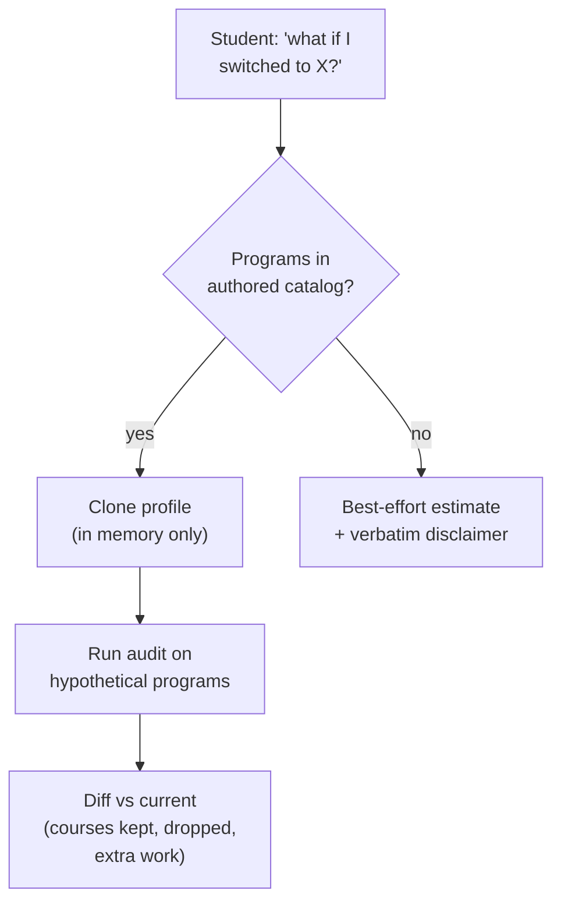
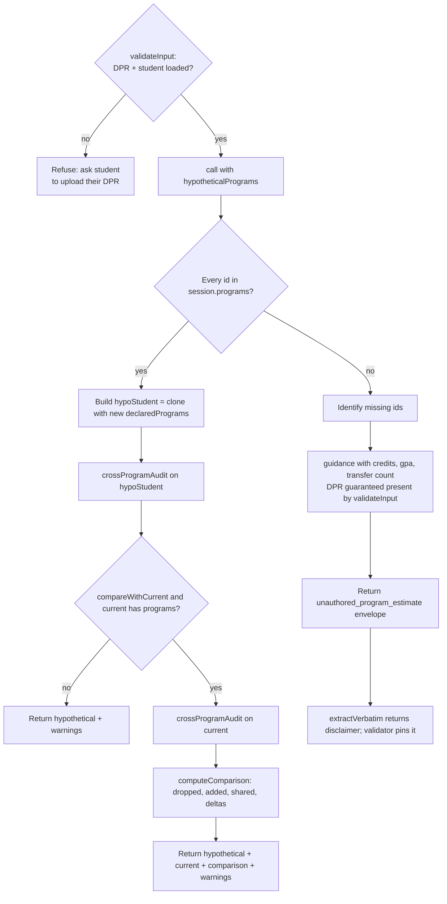

# `what_if_audit` — Tool Audit

Source files:
- Tool definition: `packages/engine/src/agent/tools/whatIfAudit.ts`
- Audit engine: `packages/engine/src/audit/whatIfAudit.ts`
- Cross-program audit (used internally): `packages/engine/src/audit/crossProgramAudit.ts`
- Tool contract: `packages/engine/src/agent/tool.ts`

---

## TL;DR

When a student asks "what if I switched my major to econ?", "should I add a math minor?", or "what would it look like if I dropped CS and majored in data science?", this tool runs a hypothetical audit without actually changing anything on their profile. It REQUIRES the student's Albert Degree Progress Report (DPR) to be loaded — the comparison is against the student's real coursework, which comes from the DPR — so if no DPR is loaded it refuses and asks the student to upload one. Otherwise it re-runs the full requirements check as if the student were already in the new program(s), then optionally diffs that against their current declared programs to tell them: how many courses they've already taken would transfer over, how many extra requirements they'd still need, which programs they'd add or drop. If the hypothetical program is in the authored catalog, you get a deterministic apples-to-apples comparison. If it's an unauthored program (no rules in the system), you get a structured estimate envelope with a hard-pinned disclaimer that the assistant MUST quote verbatim — something like "verify with an academic adviser before applying." The student's real profile is never modified.



> **⚠️ Reality check — in production this tool is an *estimate*, never an *audit*.** The authored (deterministic) path requires both `session.programs` and `session.courses`, but the deployed chat route (`apps/web/app/api/chat/v2/route.ts:245-267`) populates **neither**. So `allInCatalog && session.programs && session.courses` is never true in production and **every** call routes to the **unauthored "best-effort estimate + verbatim disclaimer" path** — the student never gets audit numbers (no courses-transferred count, no remaining-requirements delta), only the DPR-derived guidance string and the pinned adviser disclaimer. On top of that, the authored catalog itself is essentially empty: `data/programs/` has exactly **one** promoted program (`cas/cas_econ_ba.json`), so even if the route *did* load `programs`, only a hypothetical that is exactly `cas_econ_ba` could ever take the authored path. Net: read this tool as "look up the bulletin and talk to an adviser", framed as an estimate — not a structured what-if audit.

---

## 1. Purpose

`what_if_audit` lets the agent run a hypothetical audit against a different set of declared programs **without modifying the student's profile**. Used for:

- "What if I switched to economics?"
- "Compare CS major vs Data Science major."
- "Should I add a math minor?"

It returns a deterministic comparison whenever every hypothetical program id is in the authored catalog (`session.programs`). When one or more program ids are **not** in the authored catalog, the tool returns a structured "best-effort estimate" envelope with a non-removable disclaimer pointing the student at the bulletin and an adviser.

The disclaimer is enforced via the semi-hardened output mode: the validator string-matches it against the LLM's reply.

---

## 2. Input schema

Pseudo-type:

```
{
  hypotheticalPrograms: string[]              // program ids, e.g. ["cas_econ_ba", "cas_math_minor"]
  compareWithCurrent?: boolean = true         // if true, also runs current declarations and produces a diff
}
```

Defined at `whatIfAudit.ts:59-64`.

- `maxResultChars` = 3000 (line 65).
- `outputMode` = `"semi_hardened"` (line 68).
- `isReadOnly` defaults to `true` (from `buildTool`).

---

## 3. Session prerequisites + `validateInput`

The `validateInput` hook (`whatIfAudit.ts:69-84`) rejects if:

1. **No DPR loaded (or no student)** (`session.degreeProgressReport` or `session.student` missing). Returns: `"I need your Albert Degree Progress Report (DPR) to run a what-if comparison. Please upload your DPR and try again."` This check runs FIRST — a hypothetical audit compares against the student's real coursework, which comes from the DPR, so the tool refuses without it.
2. **Empty hypothetical list.** Returns: `"hypotheticalPrograms must be non-empty."`

The hook does **not** check whether each program id exists in the catalog. That check is performed inside `call()` to route between the two execution paths.

---

## 4. What it reads

From `ToolSession`:
- `session.degreeProgressReport` — **required** (`validateInput` rejects without it). Used in the unauthored path to populate the `guidance` string.
  - Reads `dpr.cumulative.creditsUsed` and `dpr.cumulative.cumulativeGpa`.
  - Counts rows in `dpr.courseHistory` whose `type === "TE"` (transfer entries).
- `session.student` — required, read-only profile.
- `session.programs` (a `Map<string, Program>`) — authored program catalog.
- `session.courses` — course catalog.
- `session.schoolConfig` — drives the cross-program audit semantics.

---

## 5. Algorithm

`call()` (`whatIfAudit.ts:90-139`) routes between two paths.

### Path selection

```
allInCatalog = every(hypotheticalPrograms, id => session.programs?.has(id))
```

- If `allInCatalog` is true AND both `session.programs` and `session.courses` are set → **Authored Path**.
- Otherwise → **Unauthored Path**.

> **Production note:** because the chat route never sets `session.programs` or `session.courses` (route.ts:245-267), `session.programs?.has(id)` is always `undefined`/falsy in production, so `allInCatalog` is always false and the Authored Path is **dead code on the live agent**. Path 2 (unauthored) is the only path that runs. Path 1 is exercised only by tests and direct engine callers that populate the catalogs themselves.

### Path 1 — Authored program path

Calls the audit engine at `audit/whatIfAudit.ts:66-115`:

```
whatIfAudit(
  session.student,
  input.hypotheticalPrograms,
  session.programs,
  session.courses,
  session.schoolConfig ?? null,
  input.compareWithCurrent ?? true,
)
```

The engine:

1. **Normalizes hypothetical entries** (`audit/whatIfAudit.ts:76-81`). Each string id is wrapped to `{ programId, programType: "major" }`. Callers passing full `ProgramDeclaration` shapes (e.g. a major + minor combo) bypass this default.
2. **Validates ids exist** (`audit/whatIfAudit.ts:84-90`). Any id missing from `programs` produces a warning `"Program "<id>" not found in catalog; it will be skipped in the audit."`. The audit still runs; the missing programs are simply omitted from the cross-program audit downstream.
3. **Clones the profile in memory** (`audit/whatIfAudit.ts:92-95`). Creates `hypoStudent = { ...student, declaredPrograms: hypoDeclarations }`. The original `student` object is **never mutated**.
4. **Runs `crossProgramAudit(hypoStudent, programs, courses, schoolConfig)`**. This is the same audit engine used by `check_overlap` — it produces a per-program audit with rules, credits completed / required, status, and any cross-program double-count warnings.
5. **If `compareWithCurrent` is false OR the student has no declared programs**, returns `{ hypothetical, warnings }` and stops.
6. **Otherwise** also runs `crossProgramAudit(student, programs, courses, schoolConfig)` against the **current** declarations, then calls `computeComparison(current, hypothetical)` (`audit/whatIfAudit.ts:119-144`):

   - `currentIds = set of program ids in current.programs`
   - `hypoIds = set of program ids in hypothetical.programs`
   - `droppedPrograms = currentIds - hypoIds`
   - `addedPrograms = hypoIds - currentIds`
   - `currentSatisfying = union of all rule.coursesSatisfying ids across current's audits`
   - `hypoSatisfying = same for hypothetical's audits`
   - `sharedRequirementCourses = hypoSatisfying ∩ currentSatisfying`
   - `coursesTransferred = hypoSatisfying.size` (how many distinct courses already taken count toward the hypothetical)
   - `currentRemaining = sum of rule.remaining across all current rules`
   - `hypoRemaining = sum of rule.remaining across all hypothetical rules`
   - `additionalRequirementsRemaining = hypoRemaining - currentRemaining` (positive means more work, negative means less)

Returns `{ hypothetical, current, comparison, warnings }`.

### Path 2 — Unauthored program path

When at least one hypothetical id is not in the catalog, `call()` does NOT run the deterministic audit (`whatIfAudit.ts:107-138`). Instead:

1. **Identify missing ids**: `missing = hypotheticalPrograms.filter(id => !session.programs?.has(id))`.
2. **Build `guidance` string** from the DPR. Because `validateInput` now requires a DPR, the with-DPR branch always runs in practice:
   - **With DPR** (the live branch): `"Your current state from the DPR: <credits> credits earned, cumulative GPA <gpa, fixed to 3 decimals>, <transferRowCount> transfer-credit row(s) recorded. Run search_policy for the hypothetical program's bulletin requirements; cross-reference your earned credits against those requirements; consult an adviser for the official audit."`
   - **Without DPR** (now unreachable — `validateInput` rejects before this point): the code still carries a fallback string `"No DPR loaded — use search_policy to look up the hypothetical program's requirements in the bulletin, and consult an adviser for the official audit."`
3. **Return an `UnauthoredProgramEstimate` envelope** with:
   - `kind: "unauthored_program_estimate"`
   - `requestedProgramIds`: the missing ids
   - `disclaimer`: the verbatim text (see below)
   - `guidance`: the string above.

### The verbatim disclaimer

Defined as the `DISCLAIMER` constant at `whatIfAudit.ts:45-47`:

> **"This estimate is based on AI-extracted requirements from NYU's bulletin. Verify with an academic adviser before applying for an internal transfer or program change."**

This exact string is:
1. Embedded in the returned `UnauthoredProgramEstimate.disclaimer` field.
2. Appended to the summary text with the prefix `"REQUIRED DISCLAIMER (must appear verbatim in your reply): "`.
3. Returned from `extractVerbatim()` (lines 175-184). The validator's verbatim-drift check pins this text — the LLM's reply MUST contain it unchanged.

For the **authored path**, `extractVerbatim` returns `null` (no verbatim requirement — the audit verdict is deterministic).

### Flow diagram



---

## 6. What it returns

Output is a discriminated union (`whatIfAudit.ts:41-43`):

**Authored path** — `WhatIfResult`:
```
{
  hypothetical: CrossProgramAuditResult,
  current?: CrossProgramAuditResult,
  comparison?: {
    coursesTransferred: number,
    additionalRequirementsRemaining: number,
    droppedPrograms: string[],
    addedPrograms: string[],
    sharedRequirementCourses: string[]
  },
  warnings: string[]
}
```

**Unauthored path** — `UnauthoredProgramEstimate`:
```
{
  kind: "unauthored_program_estimate",
  requestedProgramIds: string[],
  disclaimer: string,    // the fixed text above
  guidance: string
}
```

Each `CrossProgramAuditResult.programs[]` entry carries:
- `declaration` — `{ programId, programType }`
- `program` — the resolved Program object
- `audit` — including `programName`, `overallStatus`, `totalCreditsCompleted`, `totalCreditsRequired`, and a `rules[]` array with `status`, `coursesSatisfying[]`, `remaining`, etc.

---

## 7. Envelope behavior

- **Output mode is `semi_hardened`** (line 68).
- **`extractVerbatim`** returns the disclaimer ONLY on the unauthored-path branch; returns `null` for the authored path. The validator only pins text when `extractVerbatim` returns a non-null string — so the authored path stays under free synthesis.
- **`isReadOnly: true`** (default).
- **`maxResultChars` = 3000**; `summarizeResult` is truncated above that.
- The audit engine intentionally never mutates `student` — the hypothetical declarations are applied to a shallow clone (`audit/whatIfAudit.ts:92-95`).

---

## 8. Summary text format

`summarizeResult` (`whatIfAudit.ts:140-174`) emits one of two shapes:

**Unauthored estimate path** (when `result.kind === "unauthored_program_estimate"`):
```
WHAT-IF (estimate, no structured rules available)
  Requested programs without authored rules: <ids>
  Guidance: <guidance>
  REQUIRED DISCLAIMER (must appear verbatim in your reply): <disclaimer>
```

**Authored path:**
```
WHAT-IF: <N> program(s) hypothetically declared
  <PROGRAMTYPE_UPPER> <programName> — <unmetCount> unmet rules, <completed>/<required> credits
  ...
Comparison to current:                          (omitted when no comparison)
  Courses transferable to hypothetical: <coursesTransferred>
  Net additional requirements remaining: <delta>
  Dropped: <ids>                                (omitted when empty)
  Added: <ids>                                  (omitted when empty)
Warnings: <up to first 3 warnings>              (omitted when no warnings)
```

Notes:
- `unmetCount` = count of rules where `status !== "satisfied"`.
- `programType` is uppercased from the declaration (e.g. `MAJOR`, `MINOR`).
- Only the first 3 warnings are joined into the warnings line; rest are dropped from the summary (still in the structured output).

---

## 9. Interactions with other tools

- **Uses `crossProgramAudit` internally** — the same engine `check_overlap` uses. Calling `what_if_audit` with `compareWithCurrent: true` essentially runs the same audit twice (once for current, once for hypothetical) and diffs them.
- **Routes to `search_policy`** in the unauthored path's `guidance` string — the LLM should chain there to look up the missing program's bulletin requirements.
- **DPR pipeline** — the tool REQUIRES `session.degreeProgressReport` (`validateInput` rejects without it). In the unauthored path it pulls `creditsUsed`, `cumulativeGpa`, and TE-row count from the DPR to compose the guidance string.
- **Verbatim contract enforcement** — depends on the response validator that consumes `outputMode: "semi_hardened"` and `extractVerbatim`. The exact `DISCLAIMER` string must appear unchanged in the LLM's reply when the tool produced an unauthored estimate.

---

## 10. Edge cases

- **No DPR loaded** — rejected by `validateInput` before any other check (the DPR guard runs first). Returns the "upload your DPR" message.
- **Empty `hypotheticalPrograms` array** — rejected by `validateInput` (after the DPR check passes) before `call()` runs.
- **Mixed list (some ids in catalog, some not)** — the path selector requires `every()` to be in catalog. If any id is missing, the **entire call** routes to the unauthored path; the authored ids are never audited. `missing` reflects only the missing ids, not all hypothetical ids.
- **Authored ids passed as strings vs as ProgramDeclaration objects** — the audit engine normalizes strings to `{ programId, programType: "major" }`. To audit a hypothetical minor, callers must pass the full declaration object (the agent doesn't currently do this — the tool's input schema accepts strings only at the Zod layer).
- **Hypothetical id present in catalog but with no rules** — `crossProgramAudit` handles this; result includes the program with no rules and no satisfying courses.
- **`student.declaredPrograms` is empty** — when `compareWithCurrent === true`, the engine still skips the comparison branch (`audit/whatIfAudit.ts:99-104`). Only the hypothetical audit + warnings are returned.
- **`compareWithCurrent === false`** — same: no current audit, no comparison block.
- **`schoolConfig` is null** — passed through to `crossProgramAudit` which falls back to CAS defaults. No special handling at this layer.
- **DPR loaded but with `creditsUsed` undefined** — falls back to `?? 0`. Same for `cumulativeGpa`. The guidance still composes; numbers render as `0` / `0.000`.
- **DPR loaded but `courseHistory` empty** — transfer row count is 0.
- **Authored path with `warnings.length > 3`** — the summary shows the first 3 only with `" | "` separator; the structured output carries all of them.
- **`extractVerbatim` for authored path** — returns `null`, so the response validator does not enforce a verbatim contract. The authored-path verdict is deterministic; the LLM can synthesize freely around it.
- **Disclaimer drift** — if the LLM paraphrases the disclaimer (e.g. "verify with your adviser before applying"), the verbatim-drift check fails because the validator does exact-string matching against `extractVerbatim`'s output.

---

## Summary

`what_if_audit` runs a profile-cloning, deterministic cross-program audit against a hypothetical program set when all ids are in the authored catalog, with an optional diff against the current declarations. When any hypothetical program is unauthored, it returns a structured estimate envelope carrying a fixed, verbatim disclaimer that the response validator pins into the LLM's reply. The student's actual profile is never modified on either path.
