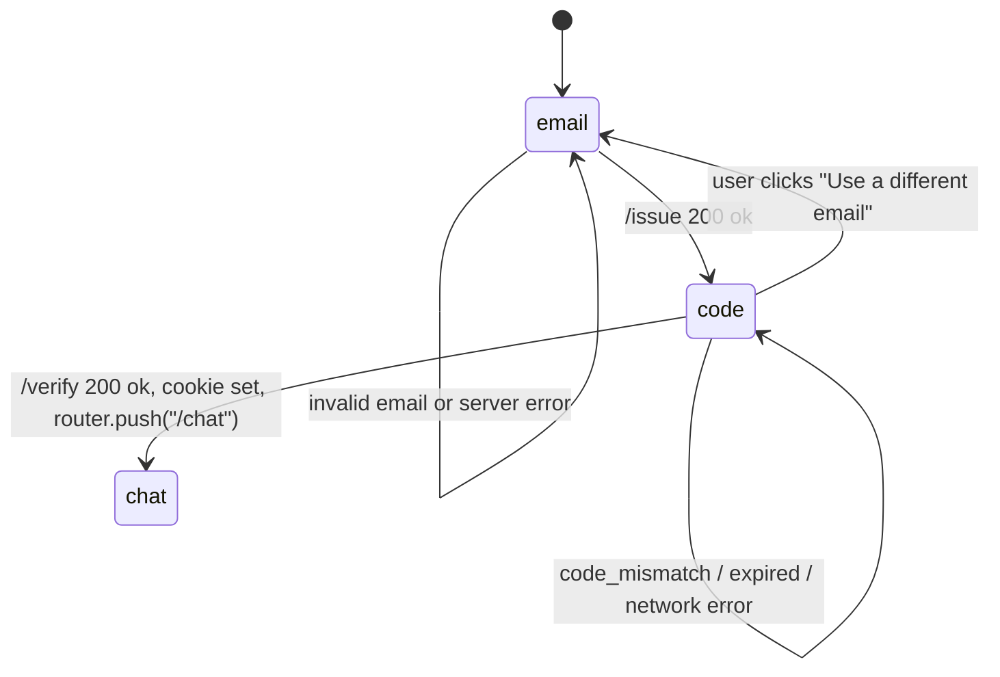

# Authentication Routes

## TL;DR

This is the login system — no passwords, just email codes. A student types their NYU email, the server sends a six-digit code to their inbox, the student types the code back in, and they're in. There's no separate signup step: the first successful login also creates the student's account in the database. After verification, the server hands the browser an invisible signed token that proves the student is who they say they are for the next 30 days. The student's NetID becomes their permanent identifier, used everywhere in the system to look up their plan, conversations, and preferences. Logging out simply throws the token away.


---

## 1. Overview

NYU Path uses passwordless email one-time-password (OTP) authentication. There is no signup flow — every successful OTP verification upserts a row into `students`, so login and signup are the same event. After verification the server hands the client a signed JWT, but only via an HttpOnly cookie; the token is never echoed in the JSON response body.

Three routes make up the surface area:

- `POST /api/auth/otp/issue` — student types their email, server emails a 6-digit code.
- `POST /api/auth/otp/verify` — student types the code, server sets the session cookie and returns the canonical studentId.
- `POST /api/auth/logout` — server clears the cookie.

The session is keyed on a JWT whose `sub` claim is the NYU NetID prefix (the local-part of the email before `@nyu.edu`). That same string is the studentId used as a foreign key across `students`, `forward_schedules`, `schedule_preferences`, `chat_messages`, `audit_log`, and `session_summaries`.

The `/login` page (`apps/web/app/login/page.tsx`) is the only place where humans interact with these routes directly. It is a two-step single-page UI: enter email, then enter the emailed code.

```mermaid
flowchart LR
    A[User on /login] -->|email| B[POST /api/auth/otp/issue]
    B -->|emails code via Resend| C[User mailbox]
    C -->|user types code| D[POST /api/auth/otp/verify]
    D -->|Set-Cookie: nyupath_session| E[router.push /chat]
    E -->|on chat page| F[v2 chat route reads cookie]
    G[Sidebar Sign out] -->|POST| H[/api/auth/logout]
    H -->|clears cookie| A
```

## 2. POST /api/auth/otp/issue

**File:** `apps/web/app/api/auth/otp/issue/route.ts:31`
**Runtime:** Node.js (`runtime = "nodejs"`).

### Request shape

JSON body with one field:
- `email` — required string.

If the body is not valid JSON, returns 400 with `"Body must be JSON with an email field."`. If `email` is missing or non-string, returns 400 with `"email is required."`.

### Rate limit (per IP)

Before any work, the route applies a per-IP daily quota of 5 issuances via `consumeRequest` (`apps/web/app/api/auth/otp/issue/route.ts:21,32`). The bucket key is `otp-ip:<ip>`, where the IP is taken from the first hop of `X-Forwarded-For`, falling back to `X-Real-IP`, falling back to the literal string `anonymous` (`apps/web/app/api/auth/otp/issue/route.ts:23-29`). On block, returns HTTP 429 with body `{ ok: false, error: "Too many login attempts from this IP. Try again after <resetAt>." }` and a `Retry-After` header in seconds.

### Email allowlist

`issueOtp` accepts the email only if it matches `^[a-z0-9._%+-]+@nyu\.edu$` (`apps/web/lib/auth/otp.ts:22`) OR appears in the comma-separated `AUTH_TEST_EMAILS` env var (`apps/web/lib/auth/otp.ts:29-36`). When neither matches, returns 400 with the message about only accepting `@nyu.edu` addresses (`apps/web/app/api/auth/otp/issue/route.ts:51-58`).

### Code generation and persistence

`issueOtp` (`apps/web/lib/auth/otp.ts:72`) does:
1. Generates a 6-digit decimal code using `crypto.randomInt(0, 1_000_000)` zero-padded to 6 characters (`apps/web/lib/auth/otp.ts:80`).
2. Records `issuedAt = now` and `expiresAt = now + 10 minutes` (TTL `OTP_TTL_MS = 10 * 60 * 1000` at `apps/web/lib/auth/otp.ts:23`).
3. Inserts a row into the `email_otps` table with the lowercased email, the sha256 hash of the code, `issuedAt`, and `expiresAt` (`apps/web/lib/auth/otp.ts:83-88`). The plaintext code is never written to the DB.

### Email send (Resend)

The send path branches on `RESEND_API_KEY`:
- Missing key → returns `{ ok: false, reason: "send_failed" }`, which the route maps to HTTP 502.
- Key equals literal string `__test__` → skips the network call entirely and returns `{ ok: true, debugCode: code }`. The route then echoes that debug code in the response body so tests can complete end-to-end (`apps/web/lib/auth/otp.ts:90-96`, `apps/web/app/api/auth/otp/issue/route.ts:71-74`).
- Any other value → constructs a `Resend` client, calls `resend.emails.send` with `from = RESEND_FROM ?? "NYU Path <onboarding@resend.dev>"`, `to = email`, subject `"Your NYU Path login code"`, and a plain-text body containing the code (`apps/web/lib/auth/otp.ts:98-105`).

### Response shapes

- Success: HTTP 200 `{ ok: true }`, plus `debugCode` when the test sentinel is active.
- Validation failure: HTTP 400 `{ ok: false, error: <message> }`.
- DB unavailable: HTTP 503.
- Send failure: HTTP 502.
- Rate-limited: HTTP 429 with `Retry-After` header.

Result reasons map to status codes at `apps/web/app/api/auth/otp/issue/route.ts:50-69`.

## 3. POST /api/auth/otp/verify

**File:** `apps/web/app/api/auth/otp/verify/route.ts:16`
**Runtime:** Node.js.

### Request shape

JSON body with two fields:
- `email` — required string.
- `code` — required string. Both fields are trimmed before being passed to `verifyOtp`.

### Code validation flow

`verifyOtp` (`apps/web/lib/auth/otp.ts:112`) executes:
1. Re-applies the same `isAllowedEmail` check (NYU domain or AUTH_TEST_EMAILS). Failure returns `reason: "invalid_email"`.
2. Selects the latest unconsumed, unexpired `email_otps` row for the lowercased email — ordered by `issuedAt DESC`, limited to 1 (`apps/web/lib/auth/otp.ts:124-135`). If no row matches, returns `reason: "no_pending_otp"`.
3. Compares the stored sha256 hash against `sha256(providedCode)` using `crypto.timingSafeEqual` (`apps/web/lib/auth/otp.ts:140-144`) — constant-time. If lengths or bytes differ, returns `reason: "code_mismatch"`.
4. Marks the row consumed by setting `consumedAt = now` on the matched (email, issuedAt) tuple (`apps/web/lib/auth/otp.ts:146-149`). This single-use marking guards against double redemption — subsequent verifies for that code will fail the "unconsumed" filter in step 2.
5. Derives the studentId by lowercasing the email and taking the prefix before `@` (`apps/web/lib/auth/otp.ts:66-70`). Upserts a `students` row with `(studentId, email)` ON CONFLICT updates `email` and `updatedAt` (`apps/web/lib/auth/otp.ts:152-158`). This is what makes login double as signup.
6. Signs an HS256 JWT with `sub = studentId`, custom claim `email = lowerEmail`, `iat = now`, `exp = +30d`, using `SECRET_KEY` from env (`apps/web/lib/auth/otp.ts:160-167`). Missing `SECRET_KEY` returns `reason: "db_unavailable"`.

### Session creation and cookie set

On success, the route builds `NextResponse.json({ ok: true, studentId })` and calls `setSessionCookie(res, token)` (`apps/web/app/api/auth/otp/verify/route.ts:44-46`). The JWT itself is never put in the response body.

### Failure messages and status mapping

All failure modes are funneled into a small set of human-readable messages so the client UI stays consistent (`apps/web/app/api/auth/otp/verify/route.ts:30-41`):

| `reason`           | Status | Message                                                              |
|--------------------|--------|----------------------------------------------------------------------|
| `expired`          | 401    | "That code has expired. Request a new one."                           |
| `code_mismatch`    | 401    | "That code doesn't match. Double-check the email and try again."      |
| `no_pending_otp`   | 401    | "No active code for that email. Request a new one."                   |
| `invalid_email`    | 400    | "That email isn't allowed."                                           |
| `db_unavailable`   | 503    | "Auth backend is unavailable. Try again in a moment."                 |
| (anything else)    | 401    | "Couldn't verify the code. Try again."                                |

Note: the `expired` mapping appears in the status switch but `verifyOtp`'s current SELECT filter (`gt(emailOtps.expiresAt, now)`) means an expired code falls into the `no_pending_otp` branch in practice — both render as 401 to the client.

## 4. POST /api/auth/logout

**File:** `apps/web/app/api/auth/logout/route.ts:15`
**Runtime:** Node.js.

The handler takes no arguments. It returns `{ ok: true }` and calls `clearSessionCookie(res)` (`apps/web/app/api/auth/logout/route.ts:16-19`). There is no server-side token blacklist: the JWT itself remains cryptographically valid until its 30-day expiry. Authentication state is bound entirely to the client holding the cookie — wipe the cookie, the client loses access.

## 5. Session cookie shape

**File:** `apps/web/lib/auth/session.ts`

The cookie is named `nyupath_session` (`apps/web/lib/auth/session.ts:23`). Its value is a JWT.

### JWT contents

- Algorithm: HS256 (HMAC-SHA256, symmetric, single shared secret).
- Secret: `process.env.SECRET_KEY`. If missing at sign time, OTP verify returns `db_unavailable`. If missing at verify time, the cookie is treated as invalid.
- Claims:
  - `sub` — studentId (NetID prefix). Used as the canonical key everywhere downstream.
  - `email` — lowercased email.
  - `iat` — set by `setIssuedAt()`.
  - `exp` — 30 days after issuance (`setExpirationTime("30d")` at `apps/web/lib/auth/otp.ts:166`).

The token is NOT encrypted, only signed — anyone with the cookie can decode the email and studentId, but they cannot forge new tokens without `SECRET_KEY`.

### Cookie attributes

Set in `setSessionCookie` (`apps/web/lib/auth/session.ts:35-45`):

| Attribute   | Value                                                            |
|-------------|------------------------------------------------------------------|
| `httpOnly`  | `true` — blocks JavaScript reads in the browser.                  |
| `sameSite`  | `lax` — blocks cross-site POSTs but lets navigation links work.   |
| `secure`    | `true` in production, `false` otherwise (for localhost dev).      |
| `path`      | `/` — visible to all routes under the domain.                     |
| `maxAge`    | `30 * 24 * 60 * 60` seconds (30 days) — matches the JWT `exp`.    |

`clearSessionCookie` (`apps/web/lib/auth/session.ts:48-58`) writes a same-named cookie with empty value and `maxAge: 0`, which the browser interprets as immediate deletion.

### Reading the cookie

Two helpers handle reads, depending on context:

- `readSessionFromRequest(req)` (`apps/web/lib/auth/session.ts:81-100`) — for Route Handlers receiving a `NextRequest`. Prefers `req.cookies.get(SESSION_COOKIE)`; if the request mock doesn't have that API (tests), falls back to parsing the `cookie` header by hand.
- `readSessionFromCookies()` (`apps/web/lib/auth/session.ts:104-109`) — for Server Components using `next/headers`.

Both call `verifySessionToken(token)` (`apps/web/lib/auth/session.ts:61-76`) which:
1. Returns `null` if `SECRET_KEY` is unset.
2. Calls `jose.jwtVerify` with `algorithms: ["HS256"]`.
3. Returns `null` if `sub` or `email` claims are not strings.
4. Catches any throw (expired, bad signature, malformed) and returns `null`.

A `null` from either helper means "no authenticated session" — the calling route returns 401.

## 6. OTP utility internals

**File:** `apps/web/lib/auth/otp.ts`

### Code generation

- 6-digit numeric, generated with `crypto.randomInt(0, 1_000_000)` (`apps/web/lib/auth/otp.ts:80`) — uses the OS CSPRNG, so codes are cryptographically unpredictable, not pseudo-random.
- Zero-padded to width 6 so leading-zero codes (e.g. `004217`) render correctly in the email and survive transit as strings.

### TTL

- `OTP_TTL_MS = 10 * 60 * 1000` (`apps/web/lib/auth/otp.ts:23`) — 10 minutes from `issuedAt` to `expiresAt`.
- Stored as an absolute timestamp on the row, not a relative TTL — clock drift on the server is the only window for off-by-N-seconds edge cases.

### Single-use guarantee

Single-use is enforced at the DB layer by the `consumedAt` column:
- On verify, the SELECT filter is `consumedAt IS NULL AND expiresAt > now`. A consumed row is invisible.
- The marking UPDATE sets `consumedAt = now` keyed on `(email, issuedAt)`. The `issuedAt` discriminator means re-issuing OTPs to the same email produces a new row each time; an earlier code can still be selected if it was the most recent unconsumed one, but each row is consumed at most once.

There is no per-email rate limit beyond what the `/issue` route's per-IP guard enforces; multiple `/issue` calls for the same email just create more rows. The verify path picks the latest (`orderBy(desc(emailOtps.issuedAt)).limit(1)`).

### Hashing

- `sha256` (no salt, no pepper) of the plain code (`apps/web/lib/auth/otp.ts:62-64`).
- A salt would block precomputed-rainbow attacks on the hash, but with a 6-digit code space the entire universe is 10^6 entries — anyone who exfiltrates the table can brute-force any single hash in milliseconds. The hash mostly prevents casual disclosure to an operator scanning logs/the DB.
- Comparison uses `timingSafeEqual` on the hex-decoded buffers (`apps/web/lib/auth/otp.ts:140-144`) — constant-time, no early-exit on first-byte mismatch.

## 7. Login page UI flow

**File:** `apps/web/app/login/page.tsx`

A client component (`"use client"` at `apps/web/app/login/page.tsx:15`). State machine has two visible steps:

- `"email"` — form with a single email input. Submit calls `POST /api/auth/otp/issue` with `{ email }`. On success (`res.ok && j.ok`), transitions to the `code` step and displays "We sent a 6-digit code to <email>. It expires in 10 minutes." On failure, shows the server's `error` field (or a fallback message). On a thrown fetch (network), shows "Network error. Check your connection and try again."
- `"code"` — form with a 6-digit numeric input. Submit calls `POST /api/auth/otp/verify` with `{ email, code }`. On success, `router.push("/chat")`. On failure, surfaces the server's error string.

The code input is constrained at the client side: `pattern="\d{6}"`, and the `onChange` strips non-digits and slices to 6 characters (`apps/web/app/login/page.tsx:122`). The submit button is disabled until exactly 6 digits are entered.

A "Use a different email" link lets the user return to the email step (clears the code field and any error/info messages).

The page links to `/PRIVACY.md` at the bottom (`apps/web/app/login/page.tsx:147`), described as "ephemeral DPR processing, no cross-session memory in cohort A."



Note: this `/login` page is the documented entry point. There is a separate Next.js `middleware.ts` in `apps/web/`, but it does NOT gate the `/login`, `/chat`, or `/api/auth/*` routes. Its `matcher` is `["/admin/:path*"]` only (`apps/web/middleware.ts:24`), meaning the only thing that file does is HTTP Basic-Auth gate the `/admin` observability dashboard. The session cookie is checked inside individual route handlers (`/api/session/*`, `/api/onboard/refresh-dpr`, and the chat route) by calling `readSessionFromRequest`, not by a global middleware pass.
