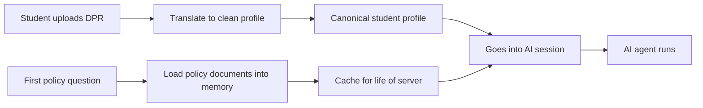
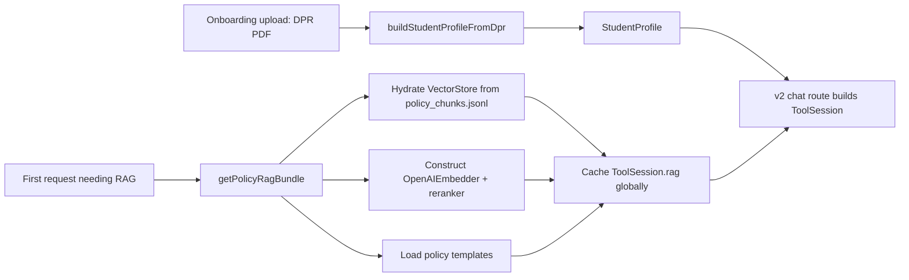
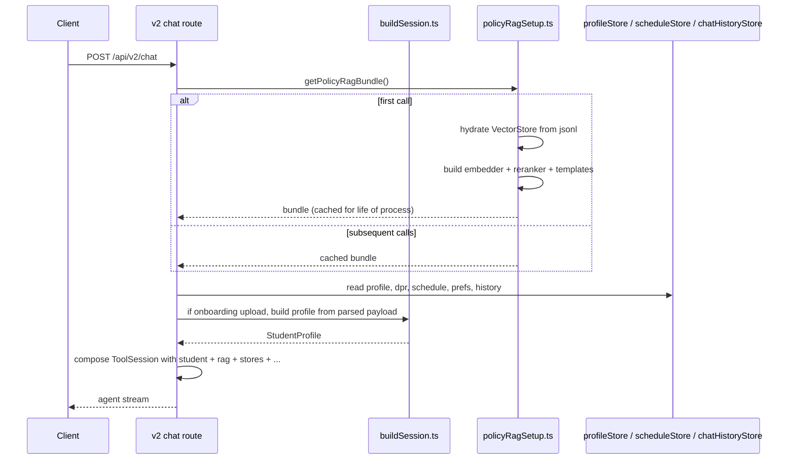

# Session Builders and Boot-time RAG

## TL;DR

When the AI agent answers a question, it needs a tidy summary of the student in front of it — their courses, grades, declared majors, school, visa status, all in one canonical shape. This piece of the system is the translator that turns the raw onboarding upload into that summary. It reads a parsed Albert Degree Progress Report (the only accepted onboarding artifact) and produces the clean student profile object the agent works from. It also handles a separate piece of one-time setup: loading the school's policy documents into memory the first time anyone asks a policy question, so the AI can cite real handbook text instead of making things up. Both pieces are quietly important plumbing — without them, the agent would either see a garbled student or have nothing to cite.

---

This document describes how the web layer assembles the data the agent loop sees as `ToolSession`. The actual `ToolSession` is composed inside the v2 chat route (out of scope here), but two of its biggest contributors live in `apps/web/lib`:

- `buildSession.ts` — converts the parsed DPR into the canonical `StudentProfile`. This is the input the chat route then layers stores, configs, RAG, and schedule preferences on top of. DPR-only: the legacy transcript builder has been removed.
- `policyRagSetup.ts` — lazy-loads the RAG bundle (`ToolSession["rag"]`) on first call, caching the result across requests.

## 1. Overview: what `buildSession.ts` actually contains

**File:** `apps/web/lib/buildSession.ts`

Despite the name, this file does NOT assemble a full `ToolSession`. DPR-only: it exports a single profile builder that returns a `StudentProfile`:

- `buildStudentProfileFromDpr(report, opts?)` — converts a deterministically parsed `DegreeProgressReport` into a canonical `StudentProfile` (`apps/web/lib/buildSession.ts:64`).

The legacy transcript builder (`buildStudentProfileV2`), the `TranscriptData` / `TranscriptSemester` types, and the `normalizeCourseId` helper were all deleted in the DPR-only pivot — the DPR is the sole onboarding artifact, so there is no transcript-shaped profile path.

The "build the full ToolSession" composition (stitching `student`, `degreeProgressReport`, `coursesCatalog`, `prereqs`, `programs`, `schoolConfig`, `rag`, all the store handles, `graduationTarget`, `forwardSchedule`, `schedulePreferences`, `transferIntent`, `lastUserMessage`, etc.) happens elsewhere — outside the four files in scope. The function here is the profile-shape contributor, plus the boot-time RAG hydrator.

## 2. `buildStudentProfileFromDpr` — the only profile builder

**File:** `apps/web/lib/buildSession.ts:64-144`

The DPR-driven canonical builder. Every field traces back to a parsed DPR field; there is no LLM synthesis in this path.

### Inputs

- `report: DegreeProgressReport` — the parsed Albert DPR from `@nyupath/engine`.
- `opts.visaStatus?` — `"f1"` or `"domestic"` (DPR doesn't expose visa status).
- `opts.catalogYearOverride?` — overrides the derived `"YYYY-YYYY"` range.
- `opts.declaredProgramsOverride?` — overrides the programs-table derivation.
- `opts.homeSchoolOverride?` — overrides the school-label heuristic.
- `opts.studentIdOverride?` — overrides the slugified-name fallback. The doc comment is explicit that this MUST be set to the authenticated JWT subject when a user is logged in; otherwise persistence splits across two phantom student rows. The May 2026 post-mortem traces the "schedule disappears on refresh" bug to exactly that divergence.

### Course history → `coursesTaken` and `currentSemester`

`apps/web/lib/buildSession.ts:82-110`. The walk has three phases:

1. Iterate `report.courseHistory`. Skip rows with `subject === "ELECTIVE"` (synthetic transfer-credit rows — no real course id).
2. For each remaining row, push to `coursesTaken`:
   - `courseId = "<subject> <catalogNbr>"` whitespace-collapsed.
   - `grade = row.grade ?? (row.type === "IP" ? "C" : "P")`. In-progress rows get a synthetic `"C"` so prereqs pass; other ungraded rows get `"P"`.
   - `semester = row.term`.
   - `credits = row.units`.
3. Separately, accumulate IP rows per term into a `Record<term, IPRow[]>` map.
4. After the walk, pick the latest term in the IP map via the `compareTerms` heuristic and populate `pendingCourses` from ONLY that term's rows.

The "latest term only" step is the May 2026 post-mortem fix: previously every IP row was lumped into `pendingCourses`, which broke when the DPR carried both current-term and pre-registered next-term IPs simultaneously (e.g. Spring + Fall coexisting), causing the agent to report 7 courses for the wrong term.

### `compareTerms`

`apps/web/lib/buildSession.ts:149-159`. Comparison helper for `"YYYY Season"` strings:

- Year is compared numerically first.
- Season ranking: `J-Term`/`January` → 0, `Spr`/`Spring` → 1, `Summer` → 2, `Fall` → 3.
- Unknown seasons rank as 0.

### `declaredPrograms` derivation

`apps/web/lib/buildSession.ts:161-180`. Walks `report.programs`; for each row whose `programType` (lowercased) contains:

- `"major"` → emit `{ programId, programType: "major" }`.
- `"minor"` → emit `{ programId, programType: "minor" }`.
- `"concentration"` → emit `{ programId, programType: "concentration" }`.

Rows with other types (career, administrative) are skipped. If the resulting list is empty, the function emits a single placeholder `{ programId: "unknown_major", programType: "major" }` so downstream tools see at least one declared program.

`programIdFromLabel` (`apps/web/lib/buildSession.ts:221-224`) slugifies the program label: lowercases, replaces non-alphanumeric runs with `_`, trims leading/trailing underscores.

### `homeSchool` derivation

`apps/web/lib/buildSession.ts:182-197`. Joins all program labels into one lowercased string, then matches substrings in this order (ordering matters because Steinhardt's published name contains "...the Arts" and would false-positive on Tisch):

1. `"steinhardt"` → `"steinhardt"`.
2. `"tisch"` → `"tisch"`.
3. `"arts & sci"` or `"ua-coll"` → `"cas"`.
4. `"tandon"` or `"engineering"` → `"tandon"`.
5. `"stern"` or `"business"` → `"stern"`.
6. `"gallatin"` or `"individualized"` → `"gallatin"`.
7. `"liberal studies"` → `"liberal_studies"`.
8. `"sps"` or `"professional studies"` → `"sps"`.
9. Fallback → `"cas"`.

### `catalogYear` derivation

`apps/web/lib/buildSession.ts:199-208`. Finds the program row whose `programType` contains `"major"`, takes its `requirementTerm`. Falls back to the first program's `requirementTerm` if no major found. Extracts a 4-digit year via regex; if none, returns `"2025-2026"`. Otherwise returns `"<year>-<year+1>"`.

### `genericTransferCredits`

`apps/web/lib/buildSession.ts:125-126`. Sum of `row.units` over `report.courseHistory.filter(r => r.type === "TE")` — transfer/AP credit aggregated straight from the DPR's TE rows.

### `id` derivation (fallback)

`apps/web/lib/buildSession.ts:210-219`. When no `studentIdOverride` is passed, the DPR builder synthesizes an ID from the student's display name by lowercasing, replacing non-alphanumeric runs with `_`, and trimming. The doc-comment warns explicitly that this fallback is dangerous in production — it diverges from the auth-session studentId and silently splits persistence across phantom rows.

### Fields hardcoded or defaulted

| Field         | Value when not overridden                                          |
|---------------|--------------------------------------------------------------------|
| `flags`       | `[]`                                                               |
| `visaStatus`  | `"domestic"` (the DPR doesn't carry visa info)                     |
| `id`          | Slugified `report.header.studentName` — DO NOT USE; override always |

## 3. Boot-time RAG setup (`policyRagSetup`)

**File:** `apps/web/lib/policyRagSetup.ts`

A lazy-loaded module-scope singleton constructs `ToolSession["rag"]` on first call and caches the result for the lifetime of the Node process.

### Module state

`apps/web/lib/policyRagSetup.ts:39-40`:

- `cached: ToolSession["rag"] | null` — the constructed bundle, or `null` until first successful construction.
- `cachedFailureReason: string | null` — once set, future calls fast-fail without retrying. A construction that fails is sticky for the process lifetime — restart required to recover.

### Path resolution

`apps/web/lib/policyRagSetup.ts:32-37`:

- `REPO_ROOT` — if `process.cwd()` contains `"apps/web"` (i.e., the Next.js dev server was launched from inside the app), points to `<cwd>/../..`. Otherwise just `process.cwd()`. This is a hack to make the same module work both in dev (cwd = `apps/web`) and in standalone scripts (cwd = repo root).
- `POLICY_CACHE_PATH = <REPO_ROOT>/data/policy-corpus/policy_chunks.jsonl`.
- `POLICY_META_PATH = <REPO_ROOT>/data/policy-corpus/policy_chunks.meta.json`.

### Construction sequence

`getPolicyRagBundle()` at `apps/web/lib/policyRagSetup.ts:42-97`:

1. If `cached` is set, return it immediately.
2. If `cachedFailureReason` is set, return `null` immediately (no retry).
3. Check `OPENAI_API_KEY`. Missing → set `cachedFailureReason = "OPENAI_API_KEY not set"`, return `null`.
4. Check `existsSync(POLICY_CACHE_PATH)`. Missing → log a warning, set `cachedFailureReason` to the path-plus-hint, return `null`. This means a deploy without the embed cache running degrades to "RAG corpus not loaded" rather than crashing.
5. Construct `new OpenAIEmbedder({ apiKey: openaiKey })`.
6. Call `loadPolicyCorpusFromCache({ embedder, cachePath, metaPath })` and destructure `{ store }`. The store is a hydrated `VectorStore` containing the precomputed chunk embeddings — query-time embedding is the only thing the OpenAIEmbedder does at runtime.
7. Choose a reranker:
   - `COHERE_API_KEY` set → `new CohereReranker({ apiKey: cohereKey })`.
   - Otherwise → `new LocalLexicalReranker()` plus a `console.warn` `"[policyRagSetup] COHERE_API_KEY not set — falling back to LocalLexicalReranker"`.
8. `loadPolicyTemplates().templates` — pulls the curated policy templates corpus.
9. Assemble the bundle:
   - `store` — the hydrated vector store.
   - `embedder` — for query-time embeddings.
   - `reranker` — Cohere or lexical.
   - `templates` — curated policy templates.
   - `confidenceBands: COHERE_CONFIDENCE_BANDS` — included only when Cohere is active. Cohere v3.5's score distribution differs from the lexical reranker, so the calibrated bands are needed only in that mode; the lexical path uses `policySearch`'s built-in lexical defaults.
10. Cache and return.

Any throw during construction is caught at `apps/web/lib/policyRagSetup.ts:91-96`. The error message is captured as `cachedFailureReason`, a warning is logged, and `null` is returned.

### Failure-mode matrix

| Missing dependency        | Behavior                                                      |
|---------------------------|---------------------------------------------------------------|
| `OPENAI_API_KEY`          | Bundle never builds; `search_policy` will surface "RAG corpus not loaded". |
| `policy_chunks.jsonl`     | Same; operator must run the embedder script.                   |
| `COHERE_API_KEY`          | Bundle still builds; reranker is the local lexical fallback.   |
| Constructor throw         | Bundle never builds; reason captured in module state.          |

## 4. The session lifecycle per request

The bundle returned by `getPolicyRagBundle` is the `rag` slot of the `ToolSession` the v2 chat route constructs per request. The `StudentProfile` returned by `buildStudentProfileFromDpr` is the `student` slot of that same `ToolSession`. Everything else on the `ToolSession` — `degreeProgressReport`, `coursesCatalog`, `prereqs`, `programs`, `schoolConfig`, store handles (`scheduleStore`, `profileStore`, `chatHistoryStore`), `graduationTarget`, `forwardSchedule`, `schedulePreferences`, `transferIntent`, `lastUserMessage` — is composed by code outside the four files documented here.

Lifecycle within scope:

Per-request, `policyRagSetup` is essentially free after the first call: the cache returns the same object reference on every subsequent invocation. Per-request, `buildSession.ts` is invoked only when an onboarding payload is being processed — restored sessions use the persisted `StudentProfile` directly from `profileStore.get(studentId)`. The `refresh-dpr` route is the one place outside the chat route that invokes `buildStudentProfileFromDpr` directly, as a fallback when no profile is persisted yet (`apps/web/app/api/onboard/refresh-dpr/route.ts:156-158`).
