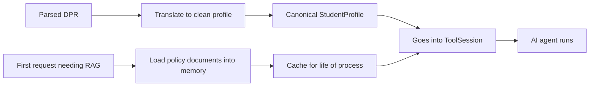
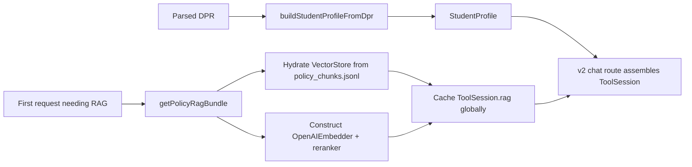
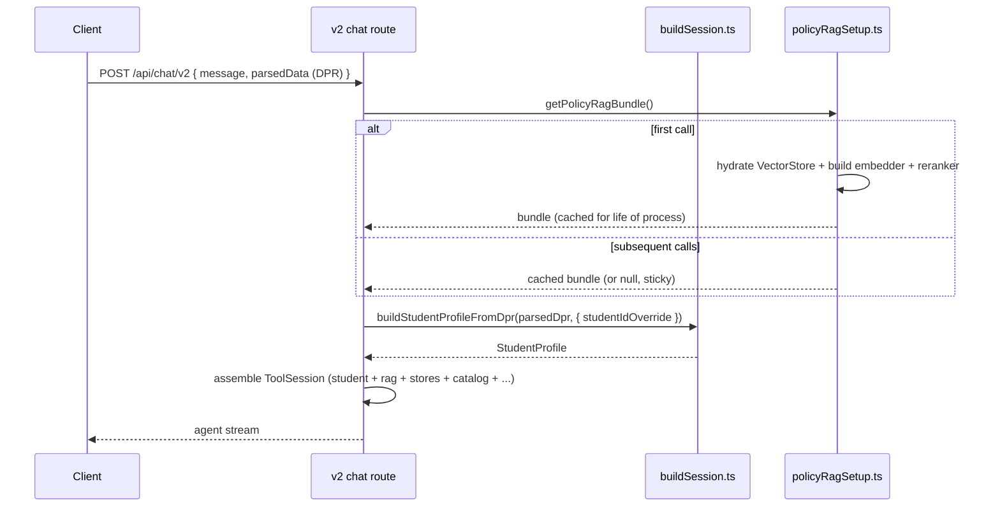

# Session Builders and Boot-time RAG

> Last verified against code: 2026-06-19 (Plan 37 C2 — `buildSession` in the orchestrator now loads and attaches `schoolConfig` to the ToolSession so `schoolConfig.passFail` reaches the engine for the 8th validator axis and the D-4 P/F-eligibility gate). Prior: 2026-06-16 (Phase 4 follow-ups F1-F3 — DPR-field authority, IP-window model, wizard mounted). **`deriveHomeSchool` is now EXPORTED** (`buildSession.ts:238`) and is the confident-vs-`"unknown"` **AUTHORITY signal** for the DPR-derived-field rule (F2): a confident return means the DPR deterministically shows the home school → READ-ONLY; only `"unknown"` lets a student pick one. The SAME signal gates both the v2 route home-school override (`route.ts:260-263`) and the wizard's `computeHomeSchoolProposal.derivedFromDpr` (§`homeSchool` derivation). Prior: 2026-06-16 (Phase 4 E5 — `homeSchoolOverride` now SENT by a client; `deriveDeclaredProgramsFromDpr` exported as the pre-fallback classification core the wizard reuses, §2); 2026-06-10 (post planning-engine rebuild, PRs #35-#41).

## Purpose

When the AI agent answers a question, it needs a tidy summary of the student in front of it — their courses, grades, declared majors, school, visa status, all in one canonical shape. This piece of the system is the translator that turns the parsed onboarding upload into that summary. It reads a parsed Albert Degree Progress Report (the only accepted onboarding artifact) and produces the clean `StudentProfile` the agent works from. It also handles a separate piece of one-time setup: lazily loading the school's policy documents into memory the first time anyone needs them, so the AI can cite real handbook text instead of making things up. Both pieces are quietly important plumbing — without them the agent would either see a garbled student or have nothing to cite.



---

This document covers the two `apps/web/lib` modules that contribute the biggest slices of the agent's `ToolSession`:

- `buildSession.ts` — converts a parsed DPR into the canonical `StudentProfile`. DPR-only: the legacy transcript builder has been removed.
- `policyRagSetup.ts` — lazy-loads the RAG bundle (`ToolSession["rag"]`) on first call, caching the result across requests for the lifetime of the Node process.

The full `ToolSession` is assembled inline in the v2 chat route — see [chat-route-sse.md §5](chat-route-sse.md#5-session-bootstrap). This doc covers only the two contributor modules.



## 1. Overview: what `buildSession.ts` actually contains

**File:** `apps/web/lib/buildSession.ts`

Despite the name, this file does NOT assemble a full `ToolSession`. It exports a single profile builder returning a `StudentProfile`:

- `buildStudentProfileFromDpr(report, opts?)` — converts a deterministically parsed `DegreeProgressReport` into a canonical `StudentProfile` (`apps/web/lib/buildSession.ts:64`).

The legacy transcript builder (`buildStudentProfileV2`), the `TranscriptData` / `TranscriptSemester` types, and the `normalizeCourseId` helper were all removed in the DPR-only pivot — the DPR is the sole onboarding artifact.

The full `ToolSession` composition (stitching `student`, `degreeProgressReport`, `courses`, `prereqs`, `schoolConfig`, `rag`, `searchCoursesFn`, the store handles, `graduationTarget`, `lastUserMessage`, etc.) happens in the v2 chat route, out of scope here. The function in this file is the profile-shape contributor; `policyRagSetup.ts` is the boot-time RAG hydrator.

## 2. `buildStudentProfileFromDpr` — the only profile builder

**File:** `apps/web/lib/buildSession.ts:64-159`

The DPR-driven canonical builder. Every field traces back to a parsed DPR field; there is no LLM synthesis in this path.

### Inputs (`BuildSessionFromDprOptions`, `buildSession.ts:40-62`)

- `report: DegreeProgressReport` — the parsed Albert DPR from `@nyupath/engine`.
- `opts.visaStatus?` — `"f1"` or `"domestic"` (DPR doesn't expose visa status).
- `opts.catalogYearOverride?` — overrides the derived `"YYYY-YYYY"` range.
- `opts.declaredProgramsOverride?` — overrides the programs-table derivation.
- `opts.homeSchoolOverride?` — overrides the school-label heuristic. **As of Phase 4 E5.2 a client DOES post this:** the onboarding/preference wizard (and the chat page) send the confirmed home-school code as `body.homeSchool`, which the v2 chat route VALIDATES via `isValidSchoolCode` (a forged / unknown code is dropped and never persisted) and then threads here as `homeSchoolOverride` (`apps/web/app/api/chat/v2/route.ts:232-261`). So the "no production client posts that value" caveat below is now superseded for the wizard/chat path.
- `opts.studentIdOverride?` — overrides the slugified-name fallback id. The doc comment is explicit that this MUST be set to the authenticated JWT subject when a user is logged in; otherwise persistence splits across two phantom student rows (the May 2026 "schedule disappears on refresh" post-mortem).

### Course history → `coursesTaken` and `currentSemester`

`buildSession.ts:82-112`. The walk:

1. Iterate `report.courseHistory`. Skip rows with `subject === "ELECTIVE"` (synthetic transfer-credit rows — no real course id).
2. For each remaining row, push a `CourseTaken` onto `coursesTaken`:
   - `courseId = "<subject> <catalogNbr>"`, whitespace-collapsed.
   - `grade = row.grade ?? null`. **No synthetic grade is injected** — an in-progress row with no grade keeps `grade: null`. (The flag that marks it in-progress is `isInProgress: true`, set when `row.type === "IP"`.)
   - `semester = row.term`, `credits = row.units`.
   - `repeatCode` is carried through when present.
3. Separately, in-progress (`type === "IP"`) rows are accumulated into a `Record<term, IPRow[]>` map (`ipRowsByTerm`).
4. After the walk, pick the latest term in the IP map via `compareTerms`, set it as `currentSemester.term`, and populate `currentSemester.courses` from ONLY that term's IP rows. When no IP rows exist, `currentSemester` is `undefined`.

> **Known limitation / honest note:** the `currentSemester.courses` entries are `{ courseId, title, credits }` (no grade), distinct from the `CourseTaken` shape pushed to `coursesTaken`.

The "latest term only" step is the May 2026 post-mortem fix: previously every IP row was lumped into the current semester, which broke when the DPR carried both current-term and pre-registered next-term IPs (e.g. Spring + Fall coexisting), causing the agent to report 7 courses for the wrong term.

### `compareTerms`

`buildSession.ts:164-174`. Comparison helper for `"YYYY Season"` strings:
- Year compared numerically first.
- Season ranking: `J-Term`/`January` → 0, `Spr`/`Spring` → 1, `Summer` → 2, `Fall` → 3.
- Unknown seasons rank as 0.

### `declaredPrograms` derivation — split into a pre-fallback core + the padded wrapper (Phase 4 E5.5)

The classification rule is now **two functions** so the wizard and the session path can each get what they need from a SINGLE source of truth:

- **`deriveDeclaredProgramsFromDpr(report)` — the EXPORTED pre-fallback core** (`buildSession.ts:197-212`). Walks `report.programs`; for each row whose lowercased `programType` contains `"major"` / `"minor"` / `"concentration"`, pushes the matching `{ programId, programType }` (career / administrative rows are skipped). Returns the genuine, **UN-padded** set: when the DPR lists no Major/Minor/Concentration row this returns `[]` — the true "undeclared" state. It deliberately does **NOT** append the `unknown_major` placeholder.
- **`deriveDeclaredPrograms(report)` — the session-path wrapper** (`buildSession.ts:214-224`, private). Calls the core, then, when it returns empty, appends a single placeholder `{ programId: "unknown_major", programType: "major" }` so downstream planning tools always see at least one declared program. Its output is **unchanged for existing callers** — the wrapper is what the profile builder still uses.

**Why the split (the wizard reason):** the onboarding wizard's undeclared-detection (`OnboardingWizard.tsx`, via `isUndeclared`) needs the RAW pre-fallback result — the `unknown_major` padding would make `isUndeclared` ALWAYS false and kill the intended-major-preview feature ([session-and-onboarding-routes.md §6.5](session-and-onboarding-routes.md#65-undeclared--intended-major-preview-hedged-e55)). So the wizard imports and calls `deriveDeclaredProgramsFromDpr` directly (one classification rule, not a hand-rolled second copy); the session path keeps the padded `deriveDeclaredPrograms`. This intentional divergence is documented on the exported function's docstring.

`programIdFromLabel` (`buildSession.ts:276-279`) slugifies the label: lowercase, non-alphanumeric runs → `_`, trim leading/trailing underscores.

### `homeSchool` derivation

`deriveHomeSchool`, `buildSession.ts:238-264`. **EXPORTED as of F2** (it was previously a file-local helper). Joins all program labels into one lowercased string, then matches substrings **in this order** (order matters because Steinhardt's published name contains "...the Arts" and would false-positive on Tisch):

1. `"steinhardt"` → `"steinhardt"`.
2. `"tisch"` → `"tisch"`.
3. `"arts & sci"` or `"ua-coll"` → `"cas"`.
4. `"tandon"` or `"engineering"` → `"tandon"`.
5. `"stern"` or `"business"` → `"stern"`.
6. `"gallatin"` or `"individualized"` → `"gallatin"`.
7. `"liberal studies"` → `"liberal_studies"`.
8. `"sps"` or `"professional studies"` → `"sps"`.
9. **No match → logs a `console.warn` and returns `"unknown"`** (NOT `"cas"`).

> **Correction from the prior doc:** the fallback is `"unknown"`, not `"cas"`. When the home school is `"unknown"`, `loadSchoolConfig("unknown")` yields no school-specific config and the planner runs in **school-agnostic mode** (DPR-only caps; falls back to `schoolDefaults` constants — no per-school requirement rules). The home school is meant to be confirmed at onboarding via `homeSchoolOverride`. **As of Phase 4 E5.2 the wizard / chat page DOES post a confirmed value** (`body.homeSchool`, validated by the v2 route via `isValidSchoolCode` before it threads here) — so the earlier "no production client posts that value" statement no longer holds for the wizard/chat path. The wizard's Confirm-profile step PROPOSES the derived school via `computeHomeSchoolProposal` (which reuses THIS `deriveHomeSchool`), and an `"unknown"` derivation surfaces as an explicit prompt — **never silently CAS** (see [session-and-onboarding-routes.md §6.3](session-and-onboarding-routes.md#63-confirm-profile--homeschool-propose--confirm-e52--visastatus-persist-e53) and [chat-route-sse.md §5.2](chat-route-sse.md#52-home-school-derivation-and-the-unknown-fallback)).

> **F2 — `deriveHomeSchool` is the DPR-derived-field AUTHORITY signal (exported).** Its return value decides whether the home school is overridable: a **confident** code means the DPR deterministically shows the school → it is a DPR-derived, **READ-ONLY** field; only the **`"unknown"`** fallback ("the DPR can't show it") lets the student pick one. This single signal is consumed in lockstep by (a) the v2 route gate — `dprConfidentlyDerivedSchool = deriveHomeSchool(parsedDpr) !== "unknown"`; when confident, the route **ignores + never persists** a `body.homeSchool` override (`route.ts:260-274`); and (b) the wizard via `computeHomeSchoolProposal(dpr).derivedFromDpr` (`homeSchool.ts:99-112`), which renders the school read-only when `true`. UI and server therefore never disagree on what's overridable. See [session-and-onboarding-routes.md §6.6](session-and-onboarding-routes.md#66-dpr-derived-field-enforcement-read-only--re-upload-redirect-f2).

### `catalogYear` derivation

`deriveCatalogYear`, `buildSession.ts:225-234`. Finds the program row whose `programType` contains `"major"`, takes its `requirementTerm`; falls back to the first program's `requirementTerm`. Extracts a 4-digit year via regex; if none, returns `"2025-2026"`. Otherwise returns `"<year>-<year+1>"`.

### `genericTransferCredits`

`buildSession.ts:127-128`. Sum of `row.units` over `report.courseHistory.filter(r => r.type === "TE")` — transfer/AP credit aggregated straight from the DPR's TE rows.

### `advisorNotations`

`buildSession.ts:148-157`. When `report.advisorNotations` is non-empty, each notation (`requestId`, `note`, `advisor`, `date`) is mapped onto the profile so the agent can quote adviser waivers verbatim and planning tools can factor them in.

### `id` derivation (fallback)

`deriveStudentId`, `buildSession.ts:236-245`. When no `studentIdOverride` is passed, the builder synthesizes an id from `report.header.studentName` by lowercasing, replacing non-alphanumeric runs with `_`, and trimming. The doc-comment warns explicitly that this fallback is dangerous in production — it diverges from the auth-session studentId and silently splits persistence across phantom rows.

### Fields hardcoded or defaulted

| Field         | Value when not overridden                                          |
|---------------|--------------------------------------------------------------------|
| `flags`       | `[]`                                                               |
| `visaStatus`  | `"domestic"` (the DPR doesn't carry visa info)                     |
| `id`          | Slugified `report.header.studentName` — DO NOT USE; override always |
| `homeSchool`  | `deriveHomeSchool(report)`; `"unknown"` when no school label matches |

## 3. Boot-time RAG setup (`policyRagSetup`)

**File:** `apps/web/lib/policyRagSetup.ts`

A lazy-loaded module-scope singleton constructs `ToolSession["rag"]` on first call and caches the result for the lifetime of the Node process.

### Module state (`policyRagSetup.ts:37-38`)

- `cached: ToolSession["rag"] | null` — the constructed bundle, or `null` until first successful construction.
- `cachedFailureReason: string | null` — once set, future calls fast-fail without retrying. A failed construction is sticky for the process lifetime — restart required to recover.

### Path resolution (`policyRagSetup.ts:30-35`)

- `REPO_ROOT` — if `process.cwd()` contains `"apps/web"` (Next.js dev server launched from inside the app), points to `<cwd>/../..`; otherwise `process.cwd()`. A hack so the same module works both in dev (cwd = `apps/web`) and in standalone scripts (cwd = repo root).
- `POLICY_CACHE_PATH = <REPO_ROOT>/data/policy-corpus/policy_chunks.jsonl`.
- `POLICY_META_PATH = <REPO_ROOT>/data/policy-corpus/policy_chunks.meta.json`.

### Construction sequence

`getPolicyRagBundle()` at `policyRagSetup.ts:40-92`:

1. If `cached` is set, return it immediately.
2. If `cachedFailureReason` is set, return `null` immediately (no retry).
3. Check `OPENAI_API_KEY`. Missing → set `cachedFailureReason = "OPENAI_API_KEY not set"`, return `null`.
4. Check `existsSync(POLICY_CACHE_PATH)`. Missing → set `cachedFailureReason` to a path-plus-hint string, log a warning, return `null`. A deploy without the embed cache degrades to "RAG corpus not loaded" rather than crashing.
5. Construct `new OpenAIEmbedder({ apiKey: openaiKey })`.
6. Call `loadPolicyCorpusFromCache({ embedder, cachePath, metaPath })` and destructure `{ store }` — a hydrated `VectorStore` of precomputed chunk embeddings (query-time embedding is the only thing the embedder does at runtime).
7. Choose a reranker:
   - `COHERE_API_KEY` set → `new CohereReranker({ apiKey: cohereKey })`.
   - Otherwise → `new LocalLexicalReranker()` plus a `console.warn` about falling back.
8. Assemble the bundle:
   - `store` — the hydrated vector store.
   - `embedder` — for query-time embeddings.
   - `reranker` — Cohere or lexical.
   - `confidenceBands: COHERE_CONFIDENCE_BANDS` — included **only** when Cohere is active (Cohere v3.5's score distribution differs from the lexical reranker, so the calibrated bands apply only there; the lexical path uses `policySearch`'s built-in defaults).
9. Cache and return.

> **Correction from the prior doc:** the bundle no longer carries a `templates` field, and `policyRagSetup` no longer calls `loadPolicyTemplates()`. The curated policy-template corpus was removed in the "nothing hardcoded" pass — `search_policy` is pure RAG over the bulletin corpus.

Any throw during construction is caught at `policyRagSetup.ts:86-91`: the message is captured as `cachedFailureReason`, a warning is logged, and `null` is returned.

### Failure-mode matrix

| Missing dependency        | Behavior                                                      |
|---------------------------|---------------------------------------------------------------|
| `OPENAI_API_KEY`          | Bundle never builds; `search_policy` surfaces "RAG corpus not loaded". |
| `policy_chunks.jsonl`     | Same; operator must run `tools/policy-corpus-embed/embed.ts`.  |
| `COHERE_API_KEY`          | Bundle still builds; reranker is the local lexical fallback.   |
| Constructor throw         | Bundle never builds; reason captured in sticky module state.   |

## 4. `buildSession` in the plan-action orchestrator (Plan 37 C2)

The plan-action orchestrator (`apps/web/lib/planActionOrchestrator.ts`) contains its own `buildSession` function (separate from the v2 chat route's inline session assembly) that rebuilds a `ToolSession` per propose/confirm call. **C2 (Plan 37)** added `schoolConfig` to this orchestrator-local session:

```typescript
function buildSession(state: LoadedSessionState, env): ToolSession {
    const schoolConfig = (() => {
        try { return loadSchoolConfig(state.profile.homeSchool); }
        catch { return null; }
    })();
    // ...
    return {
        student: state.profile,
        degreeProgressReport: state.dpr,
        scheduleStore, profileStore,
        ...(schoolConfig ? { schoolConfig } : {}),
        // ...
    };
}
```

**Why this matters:** `schoolConfig.passFail` carries per-school P/F rules (credit limits, per-term limits, `canElect`). Without `schoolConfig` on the session:
- The **8th validator axis** (per-school P/F credit-limit check, Plan 37) would not engage on the propose/confirm path — the engine tool calls would silently skip the P/F limit gate.
- The **D-4 P/F-eligibility gate** (`proposeWhatIfAssumptionTool.validateInput`) would not know whether the student's school allows P/F elections, so a `pass`/`fail` what-if at a `canElect:false` school (e.g. Tandon) would not be blocked on the route path.

A `loadSchoolConfig` throw (e.g. unknown school code) is silently swallowed; the session falls back to school-agnostic mode (uses `schoolDefaults` constants, no per-school P/F rules). The v2 chat route assembles its own session inline with its own `loadSchoolConfig` call — the orchestrator's `buildSession` is a parallel, independent session reconstruction.

## 5. The session lifecycle per request

`getPolicyRagBundle()` returns the `rag` slot of the `ToolSession` the v2 chat route assembles per request; `buildStudentProfileFromDpr` returns the `student` slot. Everything else on the session is composed inline in the chat route ([chat-route-sse.md §5](chat-route-sse.md#5-session-bootstrap)).

> **Honest note on hydration.** The v2 chat route rebuilds the `StudentProfile` from the **client-resent DPR on every turn** — it does NOT read the persisted profile back from `profileStore.get`. The persisted `StudentProfile` is read only by [`/api/session/restore`](session-and-onboarding-routes.md#2-get-apisessionrestore) (for repainting the page) and by `/api/onboard/refresh-dpr` (as a fallback when re-planning). So "restored sessions use the persisted profile directly" is true of the restore route, but the live chat turn always re-derives from the DPR. (As of P3.1 the chat route DOES hydrate the persisted forward schedule, draft plan, and scheduling preferences — only the *profile* is still re-derived from the DPR.) See [chat-route-sse.md §5.1 (per-turn plan + prefs hydration)](chat-route-sse.md#51-per-turn-plan--prefs-hydration).

Within scope:



After the first call, `getPolicyRagBundle` is essentially free — it returns the same object reference (or the same sticky `null`). `buildStudentProfileFromDpr` runs on every chat turn (the DPR is rebuilt each time) and is also called by `/api/onboard/refresh-dpr` when no profile is persisted yet (`apps/web/app/api/onboard/refresh-dpr/route.ts:156-160`).
