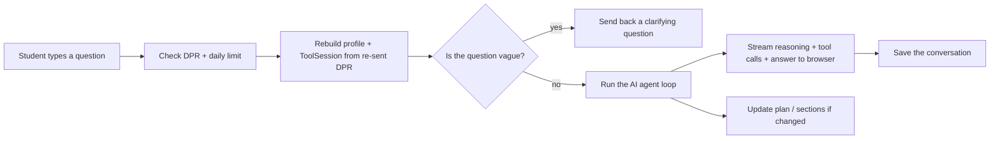

# Chat Route — `/api/chat/v2` (SSE Streaming Endpoint)

> Last verified against code: 2026-06-10 (post planning-engine rebuild, PRs #35-#41).

## Purpose

This is the main "ask the AI a question" endpoint — the brain on the server side. Every time a student types a message in the chat and hits send, the message lands here. The endpoint takes the student's degree progress report (which the browser re-sends with every message), rebuilds who the student is, makes sure they haven't asked too many questions today, and hands the question off to the AI agent. As the AI thinks, calls tools, and writes its reply, this endpoint pipes everything back to the browser live so the student sees the reasoning unfold in real time instead of waiting for one big block of text. It also watches the side effects: if a tool updated the student's plan or pulled in section times, it pushes those updates to the sidebar so the page stays in sync. After the turn ends, it quietly saves the conversation so the next visit can pick up where the student left off.

> **Honest caveat — the hydration gap.** Despite the "pick up where you left off" framing, this route does **not** read the student's persisted profile, forward schedule, draft plan, or scheduling preferences from Postgres. Each turn is rebuilt almost entirely from what the browser re-sends (the DPR + the last few messages). See [§5.1 The hydration gap](#51-the-hydration-gap) — it has real consequences (chat-driven confirms can clobber sidebar-set pins). The `/api/plan/*` orchestrator and [`/api/session/restore`](session-and-onboarding-routes.md#2-get-apisessionrestore) are the routes that *do* hydrate fully from Postgres.



---

## 1. Overview

`/api/chat/v2` (`apps/web/app/api/chat/v2/route.ts`, ~915 lines) is the production streaming chat endpoint that drives every post-onboarding turn in NYU Path. It accepts a single user message plus a **client-posted, parsed Albert Degree Progress Report (DPR)** — the sole accepted onboarding artifact post-pivot — rebuilds a `StudentProfile`, assembles a `ToolSession` inline, runs the engine's streaming agent loop, and streams tool invocations, reasoning chunks, plan updates, and the final reply back to the browser as Server-Sent Events. A valid DPR payload is **required**: if `parsedData` is missing or isn't a DPR payload, the route returns HTTP 400 asking the student to upload their DPR before reaching the agent.

The route is a Node.js (not Edge) runtime handler (`route.ts:69`, `export const runtime = "nodejs"`) because the engine's LLM clients use Node streams the Edge runtime does not support. The legacy `/api/chat` (`apps/web/app/api/chat/route.ts`) still exists but only handles onboarding state-machine steps and pre-onboarding chitchat — once `onboardingStep === "complete"` and `parsedData` is present it returns HTTP 410 Gone with a redirect pointer at `/api/chat/v2` (`apps/web/app/api/chat/route.ts:58-66`).

In short: every real "answer-the-student" turn flows through v2. The route does not block on the LLM — it opens the SSE stream synchronously and runs the agent loop in the background via `void runV2Turn({...})` (`route.ts:415-429`), so the browser sees event flow from `t=0`.

## 2. Request Shape

The client POSTs a JSON body of type `V2RequestBody` (`route.ts:95-115`):

- `message` — required string; the user's chat turn. Missing/non-string → HTTP 400 (`route.ts:124-126`).
- `parsedData` — required; DPR-only. The single accepted shape is `{ kind: "dpr"; report }`. The route checks the payload is a DPR payload (kind `"dpr"`) via the inline `isDprPayload` guard; if it isn't (or `parsedData` is absent) it returns HTTP 400 with an "I need your Albert Degree Progress Report (DPR)…" message and `onboardingStep: "awaiting_dpr"` (`route.ts:136-146`). When the kind matches, the route runs the engine's `degreeProgressReportSchema.safeParse` against `report` and rejects malformed payloads with a separate HTTP 400 listing the first three failing paths (`route.ts:151-161`).
- `visaStatus` — optional string. Only `"f1"` or `"domestic"` are threaded into the profile builder (`route.ts:223-225`).
- `graduationTarget` — optional, free-form (e.g., `"Spring 2027"` or `"spring2027"`). Normalized into `graduationTerm` for the system prompt by `normalizeGraduationTarget` (`route.ts:320`).
- `history` — optional array of prior `{ role: "user" | "assistant"; content }` items. The route forwards them into the loop as `priorMessages` (the page's client policy sends the last 10).
- `correlationId` — optional. Passed through to the agent loop for log tracing.
- `userId` — optional fallback identity. Only honored when the auth cookie is absent.
- `homeSchool` — optional. When a non-empty string, threaded through as `homeSchoolOverride` so `deriveHomeSchool` is bypassed (`route.ts:228-230`). **No production client currently sends this** — see [§5.2](#52-home-school-derivation-and-the-unknown-fallback).

## 3. Authentication / Authorization

`readSessionFromRequest(req)` (`route.ts:183`) extracts the auth subject from the session cookie. The cookie-derived `sub` always wins; the request body's `userId` is the fallback, and the literal string `"anonymous"` is the last-resort identity when neither is present (`route.ts:184`).

The route itself does **not** redirect or reject unauthenticated requests — that gate lives one layer above at `apps/web/app/chat/layout.tsx`, a Server Component that calls `readSessionFromCookies()` and `redirect("/login")` before any chat-page client JS runs. So `/api/chat/v2` only sees requests from users who already passed the layout gate (or direct curl traffic). Authenticated-only side-effects (bootstrap profile upsert, chat-history append, session-summary append) are explicitly gated on `userId !== "anonymous"` (`route.ts:289`, `785`, `846`).

## 4. Rate Limiting

`consumeRequest(userId)` (`route.ts:191`) enforces a per-student daily quota (default 30 messages / UTC day). When the bucket is empty the route returns HTTP 429 with diagnostic headers: `Retry-After` (seconds), `X-RateLimit-Limit`, `X-RateLimit-Remaining` (`"0"`), and `X-RateLimit-Reset` (ISO timestamp). The body carries a polite "Daily message limit reached, resets at … reach out to your adviser" message (`route.ts:192-210`).

Bucketing follows the resolved id:
- Authenticated users get a per-NetID bucket.
- Pre-auth callers get a per-browser-UUID bucket (the page mints a stable UUID; see the UI doc).
- The literal `"anonymous"` shares one global bucket.

## 5. Session Bootstrap

The route loads the `stores` registry (`route.ts:212`, `getStores()`) and rebuilds the `StudentProfile` from the **client-posted** DPR via `buildStudentProfileFromDpr(parsedDpr, { studentIdOverride: userId, visaStatus?, homeSchoolOverride? })` (`route.ts:215-231`). The `studentIdOverride` is critical: every persistence write must key on the SAME id the restore route reads from. Without it, writes land under a slugified DPR-name id while restore reads from `auth.sub`, splitting rows across `students`, `forward_schedules`, and `chat_messages` (the May 2026 DB-split post-mortem). See [build-session.md](build-session.md) for the builder's internals.

The `ToolSession` is assembled **inline** at `route.ts:256-278` with:
- `student` — the freshly built profile.
- `profileStore`, `scheduleStore`, `chatHistoryStore` — wired durable store handles.
- `lastUserMessage` — the current message (so tool `validateInput` hooks can apply scope guards).
- `schoolConfig` — `loadSchoolConfig(student.homeSchool)`, wrapped in try/catch → `null` on failure (`route.ts:238-244`).
- `courses` / `prereqs` — from the module-cached `getCatalog()`; file-read failure degrades to no catalog (`route.ts:249-255`, `272`).
- `rag` — the policy-RAG bundle from `getPolicyRagBundle()` (`route.ts:233`); `null` when the corpus/keys are missing (see [build-session.md §3](build-session.md#3-boot-time-rag-setup-policyragsetup)).
- `searchCoursesFn` — the semantic course-catalog search function from `getCourseSearchFn()` (`route.ts:232`); spread in only when present.
- `degreeProgressReport` — the parsed DPR (always present here).

Every one of those contributors degrades silently to `null`/omitted on failure, so a missing data file or unset key narrows the agent's abilities for the turn rather than crashing it.

Tools never write to `chatHistoryStore` directly — the route handles that AFTER the agent loop finishes ([§13](#13-persistence-after-the-turn)).

### 5.1 The hydration gap

This is the most important honest fact about the route. **Each turn hydrates ONLY:**
- the **client-resent** DPR (re-validated, rebuilt into a profile every turn),
- the **client-supplied** `history` (last ~10 messages),
- the rolling **session summaries** read from `sessionStore.get(userId)` (`route.ts:364-370`), and
- the **cohort flag** from `stores.cohortLookup(userId)` (`route.ts:358`).

It **never** reads the persisted profile, forward schedule, draft plan, or `schedulePreferences` from Postgres. There is no `scheduleStore.loadLatestSchedule`, no `scheduleStore.loadPreferences`, and no `profileStore.get` anywhere in this route — the store handles on the session are **write-only** here. The `session.forwardSchedule` / `session.studentDraftPlan` / `session.lastMaterializationResult` slots all start `undefined` and are only populated if a tool writes to them during *this* turn.

Consequences (documented honestly, not hypothetical):
- A chat-driven `confirm_plan_change` rebuilds scheduling preferences from `{}` (nothing loaded) and persists that, **clobbering pins the student set via the sidebar** (`/api/plan/*` path).
- The bootstrap upsert below rewrites `students.profile` from the freshly rebuilt DPR profile every message, **clobbering confirmed profile mutations** that a prior `confirm_profile_update` wrote, and appends a synthetic audit row per message.

Contrast: the `/api/plan/*` orchestrator and [`/api/session/restore`](session-and-onboarding-routes.md#2-get-apisessionrestore) DO hydrate fully from Postgres. The hydration gap is specific to this chat route.

### 5.2 Home-school derivation and the `unknown` fallback

When the client sends no `homeSchool`, the builder runs `deriveHomeSchool` over the DPR program labels. If no school indicator matches, it **does not** silently default to CAS — it logs a warning and returns `"unknown"`, putting the planner in school-agnostic mode (no school-specific caps/floors). No production client posts `homeSchool` today, so the override path is effectively dead for now. Details in [build-session.md §2](build-session.md#homeschool-derivation).

### 5.3 Bootstrap profile persistence

The route performs a no-throw bootstrap upsert (`route.ts:289-307`): when `userId !== "anonymous"`, it calls `profileStore.persistMutation(student, audit, parsedDpr)` with a synthetic `bootstrap-<ts>` audit record (`field: "homeSchool"`, used only as a discriminator) so a refresh or new login can restore profile + DPR via `/api/session/restore`. Failures are logged (`console.warn`) but never break the turn. As noted in §5.1, this upsert re-writes `students.profile` from the re-sent DPR on every message.

### 5.4 Temporal context + system prompt

`deriveTemporalContext(parsedDpr, { now })` (`route.ts:317-319`) computes `currentTerm`/`nextTerm` from the wall clock + NYU calendar and `enrolledNowTerm`/`preRegisteredTerms` from the DPR. The normalized `graduationTerm` is stashed on the session (`route.ts:329-331`) so `plan_forward_degree` can default `graduationTermOverride` when the LLM omits it. The final prompt is assembled by `buildSystemPrompt({ student, dprLoaded, today, currentTerm?, nextTerm?, enrolledNowTerm?, preRegisteredTerms?, graduationTerm? })` (`route.ts:333-343`).

## 6. Pre-Loop Dispatch (removed)

There is no longer a keyword/template short-circuit at the start of a turn. The old `preLoopDispatch` keyword router was removed; every question enters the agent loop directly, where `search_policy` (pure RAG over the bulletin corpus) is consulted only when the agent decides it's relevant. The **only** non-loop path is recovery mode ([§11](#11-recovery-mode-cohort-gate-failing)), and that no longer matches templates either — the curated template corpus was deleted.

## 7. Clarifier Gate

Before the loop, the route calls `detectAmbiguity(body.message, body.history ?? [])` (`route.ts:380`) — a deterministic, regex-style check, no LLM call. If `ambiguity.ambiguous` is true, it invokes `askClarification(primary, message, history, contextHints)` (`route.ts:383-395`), a cheap small-model (Haiku) one-shot with no tools. Context hints carry `homeSchool`, `declaredPrograms`, and `visaStatus` when known. Failures are caught and the route falls through to the main loop.

When the clarifier returns `!isClear && output.length > 0`, the route streams the clarifying question as this turn's reply (`route.ts:396-410`):
1. Chunks the output into 40-char segments, one `token` event per chunk.
2. Emits a `done` event with `finalText` = the clarifying question and `modelUsedId = primary.id`.
3. Closes the stream and returns immediately. The main loop is skipped; the student's next turn flows through the agent normally.

## 8. Multi-Intent Detection

`detectMultiIntent(body.message)` (`route.ts:349`) is a deterministic detector for messages with multiple distinct requests. `renderMultiIntentBriefing(multiIntent)` (`route.ts:350`) produces a system-prompt suffix telling the agent to enumerate and address each sub-question. The result is appended to the base system prompt with `\n\n` to form `finalSystemPrompt` (`route.ts:351-353`). Pure string assembly — no extra LLM call.

## 9. Agent Loop Invocation

The loop is `runAgentTurnStreaming(primary, buildDefaultRegistry(), session, userMessage, opts)` (`route.ts:554-609`). `buildDefaultRegistry()` returns the 20 live tools (see the agent/tools docs). The options object carries:

- `systemPrompt` — the final system prompt (with multi-intent briefing if any).
- `priorMessages` — the cross-session session-summary string as a leading system message (when present) plus the client-sent history as `LLMMessage`s (`route.ts:512-520`).
- `fallbackClient` — the secondary provider client (when configured); the loop tolerates its absence.
- `correlationId` — passed through when present.
- `maxTurns` — 10 (headroom for multi-tool "audit → search_policy → synthesize" flows).
- `maxTokens` — 4096 (the streaming path has no output-truncation recovery, so a final answer over the cap is simply cut off).
- `fallbackSink` — a `JsonlFileSink` (see [§12](#12-telemetry)).
- `validatorReplayLimit` — 1. The loop calls the route's inline `validateResponse` hook (`route.ts:590-607`) when it has a candidate final reply; if the verdict is not ok and budget remains, it appends a system message describing violations and runs one more pass.

The primary client is `createPrimaryClient()` (`route.ts:164`). The default primary model is **`claude-sonnet-4-6`** (override via `NYUPATH_PRIMARY_MODEL`); the default fallback is `gpt-4.1-mini`. When the primary returns `null` (no API key for the configured primary provider — default `anthropic` per `NYUPATH_PRIMARY_PROVIDER`), the route returns HTTP 503 with a `<PROVIDER>_API_KEY not configured` message (`route.ts:164-174`). The fallback (`createFallbackClient()`, `route.ts:175`) may be null with no liveness impact.

Before the loop runs, the route snapshots three side-channel timestamps to detect plan/schedule/materialization writes during the turn (`route.ts:538`, `546`, `552`):
- `beforeComputedAt` = `session.forwardSchedule?.computedAt`
- `beforeDraftComputedAt` = `session.studentDraftPlan?.computedAt`
- `beforeMaterializationComputedAt` = `session.lastMaterializationResult?.computedAt`

All three slots start `undefined` (see §5.1), so the "changed" comparison treats any write this turn as a change.

The loop yields a stream of typed events (`tool_invocation_start`, `tool_invocation_done`, `thinking_delta`, `text_delta`, `done`). The route converts each to an SSE event ([§10](#10-sse-event-types)).

## 10. SSE Event Types

The SSE encoder lives at `apps/web/lib/sseStream.ts`. The wire format per event is two lines:

```
event: <kind>
data: <stringified-json-of-the-event-object>
```

…followed by a blank line (the SSE block terminator). The JSON payload includes the `kind` field redundantly so the client can ignore the `event:` line entirely (the v2 client does — see UI doc).

The full event union (`sseStream.ts:13-29`) is:

| Event `kind` | Payload fields | When emitted |
|---|---|---|
| `tool_invocation_start` | `toolName`, `args` (object) | Each time the loop starts a tool (`route.ts:611-617`). |
| `tool_invocation_done` | `toolName`, `summary?`, `error?` | Each time a tool finishes (`route.ts:618-626`). `summary` is the tool's human-readable string; `error` is set when the tool threw. |
| `token` | `text` | Each `text_delta` from the loop, plus the chunked clarifier reply and the recovery-mode reply (`route.ts:631-633`, `398-401`, `480-481`). |
| `thinking` | `text` | Each `thinking_delta` from the loop (`route.ts:627-630`). The route also joins these into a string for chat-history persistence. |
| `validator_block` | `violations[]` (each `{ kind, detail, caveatId?, number? }`) | When the post-loop validator + completeness reviewer find any violations (`route.ts:766-770`). Advisory, not fatal — `done` still fires. |
| `forward_schedule_update` | `schedule` (full `ForwardSchedule`) | When `session.forwardSchedule.computedAt` changed, OR (only if the valid slot didn't change) when `session.studentDraftPlan.computedAt` changed. The valid plan wins when both changed (`route.ts:653-671`). |
| `forward_materialization_update` | `result` (full `ForwardMaterializationPayload`) | When `session.lastMaterializationResult.computedAt` changed during the turn (`route.ts:680-690`). |
| `done` | `finalText`, `modelUsedId` | The last event of a successful turn (`route.ts:772-776`, plus the clarifier and recovery and context-limit paths). `modelUsedId` may carry suffixes like `:context_limit` or `cohort:<name>:limited`. |
| `error` | `message` | Emitted when the loop ends in a non-ok kind, throws, or finds the primary client missing (`route.ts:468`, `706-709`, `865-868`). |

> **Correction from the prior doc:** there is **no `template_match` event kind**. The SSE union has never carried one in the current code; recovery mode emits only `token` + `done` ([§11](#11-recovery-mode-cohort-gate-failing)).

The encoder coalesces one event into one SSE block. It uses a `ReadableStream` with a queued-writes buffer: if `writer.write` is called before the stream controller exists, the encoded bytes are buffered and flushed on `start` (`sseStream.ts:39-83`).

## 11. Plan / Schedule / Materialization Update Detection

The route uses snapshot-and-compare to detect side-effect writes by tools during the turn (`route.ts:653-690`):

- **Valid schedule** — `session.forwardSchedule` is written by `plan_forward_degree`, `confirm_plan_change`, and reconciler tools. After the loop, the route compares `afterComputedAt` to `beforeComputedAt` and emits `forward_schedule_update` carrying the full schedule when changed.
- **Infeasible / student-preferred-invalid draft** — when the solver produces a plan that fails the validator it lands in `session.studentDraftPlan`, not `session.forwardSchedule` (Decision #32). The route emits `forward_schedule_update` carrying the draft when only the draft slot changed. The sidebar's 4-state banner (`valid-clean` / `valid-with-trade-offs` / `infeasible-draft` / `student-preferred-invalid-draft`) keys off `schedule.state`, so one event shape serves both slots.
- **Materialization** — `materialize_sections` writes to `session.lastMaterializationResult`. When `computedAt` changed, the route emits `forward_materialization_update` with the full payload.

All three checks run before the `done`/`error` event so the sidebar can react before the chat bubble settles.

### Recovery mode (cohort-gate failing)

When the user's cohort has `evalGateFailing: true` (passed in as `cohortGateFailing`, computed at `route.ts:359` from `getCohortConfig(cohort)`), the agent loop is bypassed entirely (`route.ts:478-484`). The route calls `runRecoveryMode(userMessage, session)`.

**Important:** `runRecoveryMode` (`packages/engine/src/cohort/gate.ts:136-144`) does **no template matching** — the curated template corpus was removed in the "nothing hardcoded" pass. It unconditionally returns a transparent "limited availability" message (`kind: "no_match"`). The route streams that reply as one `token` event, then a `done` event with `modelUsedId = cohort:<name>:limited`, then closes. There is no `template_match` event and no `:template-only` suffix.

### Context-limit graceful termination

When the loop returns `finalResult.kind === "context_limit"`, the route emits a `done` event with `finalText` = the polite "start a new session" reply and `modelUsedId` suffixed `:context_limit` (`route.ts:695-703`).

## 12. Telemetry

`getFallbackSink()` (`route.ts:79-87`) lazily constructs a `JsonlFileSink` the loop writes transition events to (`model_error_no_fallback`, `validator_replay`, `context_limit_terminate`, and other fallback transitions). Path resolution:
1. `NYUPATH_FALLBACK_LOG_PATH` env var (operator override).
2. `<cwd>/data/fallback_log.jsonl` (the dashboard's default scan target).

The `/admin/observability` dashboard reads the same file. Without this sink, fallback events would vanish silently. The route also logs `console.error` on persistence failures (chat-history append, session-summary append); both are best-effort and never break the turn.

## 13. Persistence After the Turn

After the `done` event is written but before the stream closes, the route performs best-effort writes — all gated on `userId !== "anonymous"`:

1. **Chat history append** (`route.ts:785-837`):
   - User message first (preserves user → assistant ordering on restore).
   - Assistant record with the resolved final text, ISO timestamp, and optional fields: `thinkingText` (joined `thinking_delta` chunks, when non-empty), `toolInvocations` (when non-empty), `validatorViolations` (validator + completeness reviewer violations, when any), and `pendingMutationId` extracted via `extractPendingMutationId(updateProfileInvocation.summary)` (the same extractor the client uses in `chatV2Client.ts`).
2. **Session summary append** (`route.ts:846-863`): a heuristic, NOT an extra LLM call. The route writes `Asked: "<first 140 chars>". Tools called: <names>.` via `sessionStore.appendSummary(userId, { date, summary })`. The next turn picks it up via `summariesAsPriorMessage(record, 3)` (top-3 recency window) as a leading priorMessage (`route.ts:365-366`).
3. **Profile / DPR bootstrap** — happens at session bootstrap ([§5.3](#53-bootstrap-profile-persistence)), not end-of-turn.

All writes are wrapped in try/catch with `console.error` on failure; persistence problems do not break the live turn.

## 14. Error Handling

1. **Request validation** — invalid JSON (`route.ts:122`), missing `message` (`route.ts:124-126`), missing/non-DPR `parsedData` → the "upload your DPR" 400 with `onboardingStep: "awaiting_dpr"` (`route.ts:136-146`), DPR schema failure (`route.ts:151-161`): all return HTTP 4xx synchronously, no SSE stream opened.
2. **Environment errors** — primary client not configured → HTTP 503 (`route.ts:164-174`); rate-limit exceeded → HTTP 429 (`route.ts:191-210`). Both before the stream opens.
3. **Runtime errors during the turn** — `runV2Turn`'s body is wrapped in try/catch that emits a final `error` SSE event and closes (`route.ts:864-871`). Unconditional — any throw in the loop, validator, or persistence path lands here.
4. **Non-ok loop termination** — when `finalResult` is null or `finalResult.kind !== "ok"` (and not `context_limit`), the route emits `error` with `Agent loop ended in non-ok state: <kind>` or `Agent loop did not yield a final result.` and closes (`route.ts:705-712`).
5. **Validator block** — when `validateResponse` (`route.ts:715-722`) plus `reviewCompleteness` (`route.ts:729-732`) produce any violations, the route emits `validator_block` with the combined violations BEFORE `done` (`route.ts:766-770`). The `done` event still fires — violations are advisory.
6. **Fabricated-attribution scrubbing** — when the validator catches `fabricated_attribution` violations after the replay budget is exhausted, the route runs `stripFabricatedBlockquotes(finalText)` (`route.ts:760-765`, helper at `route.ts:886-914`). This regex scrubber drops every blockquote (`> …`) and the immediately preceding attribution line, then appends a substitution note advising the student to confirm the policy with an adviser. The scrubbed text flows into the `done` event's `finalText`.

The route always closes the SSE stream in a `finally` block (`route.ts:869-871`) regardless of branch.

## 15. Mermaid Sequence Diagram

```mermaid
sequenceDiagram
    autonumber
    participant Client as Browser (chatV2Client)
    participant Route as /api/chat/v2
    participant Auth as readSessionFromRequest
    participant Rate as consumeRequest
    participant Stores as getStores()
    participant Session as ToolSession (inline)
    participant Clarifier as detectAmbiguity + askClarification
    participant Loop as runAgentTurnStreaming
    participant Persist as profileStore / chatHistoryStore / sessionStore

    Client->>Route: POST { message, parsedData (DPR), history, ... }
    Route->>Route: JSON-parse + require DPR payload + schema validate
    alt Invalid body / no DPR / schema fail
        Route-->>Client: 400 JSON (awaiting_dpr / issues)
    end
    Route->>Route: createPrimaryClient()
    alt No API key
        Route-->>Client: 503 JSON
    end
    Route->>Auth: read session cookie
    Auth-->>Route: { sub } or null
    Route->>Rate: consumeRequest(userId)
    alt Bucket empty
        Route-->>Client: 429 + Retry-After
    end
    Route->>Stores: profileStore, scheduleStore, chatHistoryStore, sessionStore, cohortLookup
    Route->>Session: buildStudentProfileFromDpr + assemble ToolSession inline
    Note over Route,Session: NO read of persisted schedule / prefs / profile (hydration gap)
    Route->>Persist: bootstrap persistMutation (DPR + profile, rewrites students.profile)
    Route->>Route: deriveTemporalContext + buildSystemPrompt + detectMultiIntent
    Route->>Stores: cohortLookup(userId) + getCohortConfig + sessionStore.get → summaries
    Route-->>Client: 200 text/event-stream (opened)
    Note over Route,Client: Stream live; runV2Turn runs in background

    Route->>Clarifier: detectAmbiguity(message, history)
    alt Ambiguous
        Route->>Clarifier: askClarification (Haiku, no tools)
        Clarifier-->>Route: clarifying question
        Route-->>Client: token (chunked) + done; close
    end

    alt cohortGateFailing
        Route->>Route: runRecoveryMode (no templates; "limited availability")
        Route-->>Client: token + done (cohort:<name>:limited)
    else Normal path
        Route->>Route: snapshot computedAt timestamps (3x)
        Route->>Loop: runAgentTurnStreaming(primary, registry, session, ...)
        loop For each yielded event
            Loop-->>Route: tool_invocation_start / _done
            Route-->>Client: tool_invocation_start / _done
            Loop-->>Route: thinking_delta / text_delta
            Route-->>Client: thinking / token
            Loop-->>Route: done (ChatTurnResult)
        end
        Route->>Session: compare computedAt (schedule / draft / materialization)
        Route-->>Client: forward_schedule_update / forward_materialization_update (if changed)

        alt context_limit
            Route-->>Client: done with :context_limit suffix
        else non-ok / no result
            Route-->>Client: error
        else ok
            Route->>Route: validateResponse + reviewCompleteness
            alt violations
                Route->>Route: stripFabricatedBlockquotes
                Route-->>Client: validator_block
            end
            Route-->>Client: done
            Route->>Persist: chatHistoryStore.appendMessage (user, then assistant)
            Route->>Persist: sessionStore.appendSummary
        end
    end

    Route->>Route: finally → writer.close()
```

## Related Files

- `apps/web/app/api/chat/v2/route.ts` — the route handler.
- `apps/web/lib/sseStream.ts` — the SSE encoder and event union.
- `apps/web/lib/chatV2Client.ts` — the browser-side SSE reader; `ForwardMaterializationPayload` + `extractPendingMutationId` live here.
- `apps/web/lib/buildSession.ts` — the profile builder ([build-session.md](build-session.md)).
- `apps/web/lib/policyRagSetup.ts` — the boot-time RAG hydrator ([build-session.md §3](build-session.md#3-boot-time-rag-setup-policyragsetup)).
- `apps/web/app/api/chat/route.ts` — the legacy v1 route (onboarding + chitchat only; 410 Gone post-onboarding) — see [session-and-onboarding-routes.md](session-and-onboarding-routes.md).
- `packages/engine/src/cohort/gate.ts` — `runRecoveryMode` (no-template "limited availability" path).
