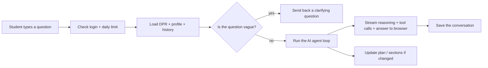

# Chat Route — `/api/chat/v2` (SSE Streaming Endpoint)

## TL;DR

This is the main "ask the AI a question" endpoint, the brain on the server side. Every time a student types a message in the chat and hits send, the message lands here. The endpoint pulls up the student's degree progress report, figures out who they are, makes sure they haven't asked too many questions today, and then hands the question off to the AI agent. As the AI thinks, calls tools, and writes its reply, this endpoint pipes everything back to the browser live so the student sees the reasoning unfold in real time instead of waiting for one big block of text. It also watches the side effects: if a tool updated the student's plan or pulled in section times, it pushes those updates to the sidebar so the page stays in sync. After the turn ends, it quietly saves the conversation so the next visit can pick up where the student left off.



---

## 1. Overview

`/api/chat/v2` is the production streaming chat endpoint that drives every post-onboarding turn in NYU Path. It accepts a single user message, builds a `ToolSession` from the student's parsed Albert Degree Progress Report (DPR) — the sole accepted onboarding artifact post-pivot — runs the engine's agent loop, and streams tool invocations, reasoning chunks, plan updates, and the final reply back to the browser as Server-Sent Events. A valid DPR payload is **required**: if `parsedData` is missing or isn't a DPR payload, the route returns HTTP 400 asking the student to upload their DPR before reaching the agent.

The route is a Node.js (not Edge) runtime handler (`apps/web/app/api/chat/v2/route.ts:73`) because the engine's primary LLM client uses Node streams that the Edge runtime does not support. The legacy `/api/chat` (`apps/web/app/api/chat/route.ts`) still exists but only handles onboarding state-machine steps and pre-onboarding chitchat — once `onboardingStep === "complete"` and `parsedData` is present, the legacy route returns HTTP 410 Gone with a redirect pointer at `/api/chat/v2` (`apps/web/app/api/chat/route.ts:58-66`).

In short: every real "answer-the-student" turn flows through v2. The route does not block on the LLM — it spins up the SSE stream synchronously and runs the agent loop in the background (`route.ts:429-451`), so the browser sees event flow from `t=0`.

## 2. Request Shape

The client POSTs a JSON body with these fields (`route.ts:111-130`):

- `message` — required string; the user's chat turn.
- `parsedData` — required; DPR-only. The single accepted shape is `{ kind: "dpr"; report }` (the legacy transcript variants were removed). The route first checks the payload is a DPR payload (kind `"dpr"`); if it isn't (or `parsedData` is absent), it returns HTTP 400 with an "I need your Albert Degree Progress Report (DPR)…" message and `onboardingStep: "awaiting_dpr"` (`route.ts:141-151`). When the kind matches, the route runs the engine's `degreeProgressReportSchema.safeParse` against `report` and rejects malformed payloads with a separate HTTP 400 (`route.ts:156-166`).
- `visaStatus` — optional string. Only `"f1"` or `"domestic"` are honored by the DPR builder.
- `graduationTarget` — optional string; free-form (e.g., `"Spring 2027"` or `"spring2027"`). Normalized into `graduationTerm` for the system prompt by `normalizeGraduationTarget`.
- `history` — optional array of prior `{ role: "user" | "assistant", content }` items. The route prepends the last 10 (per the page's client policy) as `LLMMessage`s for the agent loop.
- `correlationId` — optional. Passed through to the agent loop for log tracing.
- `userId` — optional fallback identity. Only honored when the auth cookie is absent.

Missing `message` produces HTTP 400 (`route.ts:129-131`). A missing or non-DPR `parsedData` produces the "upload your DPR" HTTP 400 (`route.ts:141-151`).

## 3. Authentication / Authorization

`readSessionFromRequest(req)` (`route.ts:188`) extracts the auth subject from the session cookie via the `lib/auth/session` helper. The cookie-derived `sub` always wins; the request body's `userId` is the fallback, and the literal string `"anonymous"` is the last-resort identity when neither is present (`route.ts:189`).

The route itself does **not** redirect or reject unauthenticated requests — that gate lives one layer above at `apps/web/app/chat/layout.tsx`. That layout is a Server Component that calls `readSessionFromCookies()` and `redirect("/login")` before any chat-page client JS runs. The `/api/chat/v2` route therefore only sees requests from users who already passed the layout gate (or direct curl traffic). Authenticated-only side-effects (chat history append, profile persistence, session-summary append) are explicitly gated on `userId !== "anonymous"` (`route.ts:278, 768, 829`).

## 4. Rate Limiting

`consumeRequest(userId)` (`route.ts:196`) enforces a per-student daily quota. When the bucket is empty the route returns HTTP 429 with three diagnostic headers: `Retry-After` (seconds), `X-RateLimit-Limit` (configured ceiling), `X-RateLimit-Remaining` ("0"), and `X-RateLimit-Reset` (ISO timestamp). The response body carries a polite "Daily message limit reached, resets at … reach out to your adviser" message (`route.ts:197-215`).

The userId used for bucketing is the same authenticated `sub` / body fallback / `"anonymous"` resolved earlier, which means:
- Authenticated users get a per-NetID bucket.
- Pre-auth callers get a per-browser-UUID bucket (the page mints a stable UUID in localStorage; see the UI doc).
- The literal `"anonymous"` shares a single global bucket.

## 5. Session Bootstrap

The route loads the `stores` registry (`route.ts:217`) which wires the profile store, schedule store, chat-history store, session-summary store, and cohort lookup.

The student profile is always built via `buildStudentProfileFromDpr(parsedDpr, { studentIdOverride: userId, visaStatus? })` (`route.ts:220-231`) — the DPR is the only onboarding artifact, so there is no transcript branch and no `buildStudentProfileV2` fallback. The `studentIdOverride` is critical: every persistence write must key on the SAME id the restore route reads from. Without this, tools persist under a slugified DPR-name id while the restore route reads from `auth.sub`, producing split rows across `students`, `forward_schedules`, and `chat_messages`.

The `ToolSession` is assembled at `route.ts:245-267` with:
- `student` — the built profile
- `profileStore`, `scheduleStore`, `chatHistoryStore` — wired durable stores
- `lastUserMessage` — the user's current message (so tool `validateInput` hooks can apply scope guards)
- `schoolConfig` — loaded by `loadSchoolConfig(student.homeSchool)`, optional (fail-soft on load error at `route.ts:238-244`)
- `rag` — the policy RAG bundle from `getPolicyRagBundle()`
- `searchCoursesFn` — the course-catalog search function
- `degreeProgressReport` — the parsed DPR (always present, since the DPR is required to reach this point)

Tools never write to `chatHistoryStore` directly — the route handles that AFTER the agent loop finishes.

The route also performs a bootstrap profile persistence (`route.ts:278-296`): a no-throw call to `profileStore.persistMutation` writes the parsed DPR plus the built profile so a refresh or new login can restore them via `/api/session/restore`. This is gated on `userId !== "anonymous"`; failures are logged but never break the live turn.

Temporal context (`route.ts:305-308`) is computed via `deriveTemporalContext(parsedDpr, { now })`. The wall clock determines `currentTerm` and `nextTerm`; the DPR contributes `enrolledNowTerm` and `preRegisteredTerms`. The graduation target is normalized into `graduationTerm` and stashed on the session (`route.ts:309-320`) so `plan_forward_degree` can default `graduationTermOverride` when the LLM forgets to pass it.

The final system prompt is assembled by `buildSystemPrompt({ student, dprLoaded, today, currentTerm?, nextTerm?, enrolledNowTerm?, preRegisteredTerms?, graduationTerm? })` (`route.ts:322-332`).

## 6. Pre-Loop Dispatch

The classic keyword/similarity-based template matcher is **demoted** from the active path (`route.ts:502-522`). The route imports `runTemplateMatcherOnly` (`route.ts:37`) but only invokes it inside the cohort recovery path (Section 11 below). Every normal question enters the agent loop directly, where `search_policy` consults the same template registry internally when the agent decides it's relevant.

This means: there is no longer a "template match" short-circuit at the start of a v2 turn. The only way a `template_match` SSE event reaches the client is via the recovery-mode branch when the cohort's eval gate is failing.

## 7. Clarifier Gate

Before the agent loop runs, the route calls `detectAmbiguity(body.message, body.history ?? [])` (`route.ts:370`). This is a deterministic, regex-style check — no LLM call.

If `ambiguity.ambiguous` is true, the route invokes `askClarification(primary, message, history, contextHints)` (`route.ts:374-385`). This is a cheap Haiku (small-model) one-shot call with no tools. The context hints carry `homeSchool`, `declaredPrograms`, and `visaStatus` when known. Failures are caught and the route falls through to the main agent loop.

When the clarifier returns `!isClear && output.length > 0`, the route streams the clarifying question as the agent's reply for this turn:
1. Chunks the output into 40-char segments and emits one `token` event per chunk (`route.ts:388-390`).
2. Emits a `done` event with `finalText` set to the clarifying question and `modelUsedId` set to the primary client's id.
3. Closes the SSE stream and returns immediately (`route.ts:391-400`). The main agent loop is skipped.

The student's next turn (presumably containing the clarification they were asked for) flows through the agent normally.

## 8. Multi-Intent Detection

`detectMultiIntent(body.message)` (`route.ts:338`) is a deterministic detector for messages containing multiple distinct requests (e.g., "What should I take next semester AND can I transfer my AP credit?"). `renderMultiIntentBriefing(multiIntent)` (`route.ts:339`) produces a system-prompt suffix that instructs the agent to enumerate and address each sub-question.

The result is appended to the base system prompt with a `\n\n` separator (`route.ts:340-342`), forming `finalSystemPrompt`. No extra LLM call is involved — purely string assembly.

## 9. Agent Loop Invocation

The agent loop is wired via `runAgentTurnStreaming(primary, buildDefaultRegistry(), session, userMessage, opts)` (`route.ts:546-592`). The options object carries:

- `systemPrompt` — the final system prompt (with multi-intent briefing if any).
- `priorMessages` — cross-session summary as a leading system message (when present) plus the client-sent history as `LLMMessage`s (`route.ts:504-512`).
- `fallbackClient` — the secondary provider client (when configured); the loop tolerates `null`.
- `correlationId` — passed through when present.
- `maxTurns` — 10 (room for multi-tool "audit → search_policy → synthesize" flows).
- `fallbackSink` — a JSONL file sink (`JsonlFileSink`) pointed at `NYUPATH_FALLBACK_LOG_PATH` env var or `<cwd>/data/fallback_log.jsonl` by default (`route.ts:91-98`). Surfaces fallback events for the `/admin/observability` dashboard.
- `validatorReplayLimit` — 1. The loop calls the route's `validateResponse` hook (`route.ts:573-590`) when it has a candidate final reply; if the verdict is not ok and budget remains, the loop appends a system message describing violations and runs one more pass.

The primary LLM client is created by `createPrimaryClient()` (`route.ts:169`). When this returns null (i.e., no API key configured for the configured primary provider — defaults to Anthropic per `NYUPATH_PRIMARY_PROVIDER`), the route returns HTTP 503 with a "PROVIDER_API_KEY not configured" message (`route.ts:169-179`). The fallback client (`createFallbackClient()` at `route.ts:180`) may be null with no impact on liveness.

Before the loop runs, the route snapshots three side-channel timestamps so it can detect plan/schedule/materialization writes during the turn:
- `beforeComputedAt` = `session.forwardSchedule?.computedAt` (`route.ts:530`)
- `beforeDraftComputedAt` = `session.studentDraftPlan?.computedAt` (`route.ts:538`)
- `beforeMaterializationComputedAt` = `session.lastMaterializationResult?.computedAt` (`route.ts:544`)

The loop yields a stream of typed events (`tool_invocation_start`, `tool_invocation_done`, `thinking_delta`, `text_delta`, `done`). The route converts each to an SSE event (Section 10).

## 10. SSE Event Types

The SSE encoder lives at `apps/web/lib/sseStream.ts`. The wire format per event is two lines:

```
event: <kind>
data: <stringified-json-of-the-event-object>
```

…followed by a blank line (the SSE block terminator). The JSON payload includes the `kind` field redundantly so the client can ignore the `event:` line entirely (and the v2 client does — see UI doc).

The full event union (`sseStream.ts:13-30`) is:

| Event `kind` | Payload fields | When emitted |
|---|---|---|
| `template_match` | `templateId`, `body`, `source` | Only inside cohort-failing recovery mode when a template matches (`route.ts:467`). |
| `tool_invocation_start` | `toolName`, `args` (object) | Each time the agent loop starts a tool (`route.ts:595-600`). |
| `tool_invocation_done` | `toolName`, `summary?`, `error?` | Each time a tool finishes (`route.ts:601-609`). `summary` is the tool's human-readable summary string; `error` is set when the tool threw. |
| `thinking` | `text` | Each `thinking_delta` from the loop (`route.ts:610-613`). The route also accumulates these into a string for chat-history persistence. |
| `token` | `text` | Each `text_delta` from the loop, plus the chunked clarifier reply and template recovery body (`route.ts:614-616`, `388-390`, `468-472`). |
| `validator_block` | `violations[]` (each `{ kind, detail, caveatId?, number? }`) | When the post-loop validator catches violations after the replay budget is spent (`route.ts:749-753`). |
| `forward_schedule_update` | `schedule` (full `ForwardSchedule` object) | When `session.forwardSchedule.computedAt` or `session.studentDraftPlan.computedAt` changed during the turn. Valid plan wins when both changed in the same turn (`route.ts:636-654`). |
| `forward_materialization_update` | `result` (full `ForwardMaterializationPayload`) | When `session.lastMaterializationResult.computedAt` changed during the turn (`route.ts:663-673`). |
| `done` | `finalText`, `modelUsedId` | Always the last event of a successful turn (`route.ts:755-759`, `391`, `469`, `472`). `modelUsedId` may carry suffixes like `:context_limit`, `cohort:<name>:template-only`, or `cohort:<name>:limited`. |
| `error` | `message` | Emitted when the agent loop ends in a non-ok kind, throws, or finds the primary client missing (`route.ts:453`, `690-692`, `848-851`). |

The encoder coalesces a single event into a single SSE block (no chunking inside one event). It uses a `ReadableStream` with a queued-writes pattern: if `writer.write` is called before the stream controller exists, the encoded bytes are buffered and flushed on `start` (`sseStream.ts:40-83`).

## 11. Plan / Schedule / Materialization Update Detection

The route uses a snapshot-and-compare pattern to detect side-effects writes performed by tools during the turn:

- **Valid schedule** — `session.forwardSchedule` is written by `plan_forward_degree`, `confirm_plan_change`, and reconciler tools. After the loop ends, the route compares `afterComputedAt` to `beforeComputedAt` and emits a `forward_schedule_update` carrying the full schedule when changed (`route.ts:644-648`).
- **Infeasible draft** — when the solver produces an infeasible plan it lands in `session.studentDraftPlan`, not `session.forwardSchedule`. The route emits a `forward_schedule_update` carrying the draft when it changed and the valid slot didn't (`route.ts:649-654`). The sidebar's 4-state banner (`valid-clean` / `valid-with-trade-offs` / `infeasible-draft` / `student-preferred-invalid-draft`) keys off `schedule.state`, so a single event shape works for both slots.
- **Materialization** — `materialize_sections` writes its result to `session.lastMaterializationResult`. When `computedAt` changed, the route emits `forward_materialization_update` with the full result payload (`route.ts:663-673`).

All three checks happen before the `done` or `error` event so the UI sidebar can react before the chat bubble settles.

### Recovery Mode (cohort-gate failing)

When `cohortConfig.evalGateFailing` is true (`route.ts:463`), the agent loop is bypassed entirely. The route calls `runTemplateMatcherOnly(userMessage, session, templates)`:
- On `kind === "template"`: emits `template_match` (with `templateId`, `body`, `source`), then `token` with the body, then `done` with `modelUsedId = cohort:<name>:template-only` (`route.ts:467-469`).
- Otherwise: emits a `token` with the recovery reply, then `done` with `modelUsedId = cohort:<name>:limited` (`route.ts:471-472`).

### Context-limit graceful termination

When the agent loop returns `finalResult.kind === "context_limit"`, the route emits a `done` event with `finalText` set to the polite "start a new session" reply and `modelUsedId` suffixed with `:context_limit` (`route.ts:678-686`).

## 12. Telemetry

The fallback log sink (`getFallbackSink()` at `route.ts:91-98`) is a `JsonlFileSink` that the engine's agent loop writes transition events to:
- `model_error_no_fallback`
- `validator_replay`
- `context_limit_terminate`
- and any other fallback transitions the engine raises.

The path resolution order is:
1. `NYUPATH_FALLBACK_LOG_PATH` env var (operator override).
2. `<cwd>/data/fallback_log.jsonl` (the default the operator dashboard scans).

The dashboard at `/admin/observability` reads the same file. Without this sink wired, every fallback event would disappear silently.

The route itself adds two console-error log lines on persistence failures (chat history append at `route.ts:818`, session summary append at `route.ts:844`); both are explicitly best-effort and never break the live turn.

## 13. Persistence After the Turn

After the `done` event is written but before the SSE stream closes, the route performs three best-effort persistence writes — all gated on `userId !== "anonymous"`:

1. **Chat history append** (`route.ts:768-820`):
   - User message first (preserves user → assistant timeline ordering on restore).
   - Assistant record with the resolved final text, ISO timestamp, and the following optional fields:
     - `thinkingText` — the joined `thinking_delta` chunks (only when non-empty).
     - `toolInvocations` — the full invocation list when non-empty.
     - `validatorViolations` — the violations from the post-loop validator + completeness reviewer (when any).
     - `pendingMutationId` — extracted via `extractPendingMutationId(updateProfileInvocation.summary)` (the same client-side extractor lives in `chatV2Client.ts:189-193`). Mirrors what the chat page does live so the restore path renders the confirm button without recomputing.

2. **Session summary append** (`route.ts:829-846`): a heuristic, NOT an extra LLM call. The route constructs a string of the form `Asked: "<first 140 chars of user message>". Tools called: <names>.` and writes it to `sessionStore.appendSummary(userId, { date, summary })`. The next turn picks this up via `summariesAsPriorMessage(record, 3)` (top-3 recency window) as a leading system priorMessage (`route.ts:354-360`).

3. **Profile / DPR bootstrap** — happens at session bootstrap (Section 5), not at end-of-turn.

All three writes are wrapped in try/catch with `console.error` on failure; persistence problems do not break the live turn.

## 14. Error Handling

The route handles four classes of errors:

1. **Request validation** — invalid JSON (`route.ts:127`), missing `message` (`route.ts:129-131`), missing or non-DPR `parsedData` → the "upload your DPR" 400 with `onboardingStep: "awaiting_dpr"` (`route.ts:141-151`), DPR schema validation failure (`route.ts:156-166`): all return HTTP 4xx synchronously, no SSE stream opened.
2. **Environment errors** — primary LLM client not configured returns HTTP 503 (`route.ts:169-179`). Rate-limit exceeded returns HTTP 429 (`route.ts:196-215`). Both happen before the SSE stream is opened.
3. **Runtime errors during the turn** — the `runV2Turn` wrapper is wrapped in a `try/catch` that emits a final `error` SSE event with the error message and then closes the stream (`route.ts:847-854`). The catch is unconditional, so any thrown exception inside the agent loop, validator, or persistence path lands here.
4. **Non-ok loop termination** — when the agent loop's `finalResult` is null or `finalResult.kind !== "ok"` (and not `context_limit`), the route emits an `error` event with the message `Agent loop ended in non-ok state: <kind>` or `Agent loop did not yield a final result.` and closes the stream (`route.ts:688-695`).
5. **Validator block** — when the post-loop validator (`validateResponse` at `route.ts:698-705`) plus the completeness reviewer (`reviewCompleteness` at `route.ts:712-715`) produce any violations, the route emits a `validator_block` event with the combined violations BEFORE the `done` event (`route.ts:749-753`). The `done` event still fires — the violations are advisory, not fatal.
6. **Fabricated attribution scrubbing** — when the validator catches `fabricated_attribution` violations AFTER the replay budget is exhausted, the route runs `stripFabricatedBlockquotes(finalText)` (`route.ts:869-897`). This regex-based scrubber drops every blockquote (`> …`) and the immediately preceding attribution introduction line (e.g., `Per the bulletin:`), then appends a substitution note: `(Note: a bulletin quotation was removed because the agent could not verify it against the indexed corpus. Please confirm the underlying policy with your academic adviser before relying on it.)`. The scrubbed text is what flows into the `done` event's `finalText`.

The route always closes the SSE stream in a `finally` block (`route.ts:852-854`) regardless of which branch was taken.

## 15. Mermaid Sequence Diagram

```mermaid
sequenceDiagram
    autonumber
    participant Client as Browser (chatV2Client)
    participant Route as /api/chat/v2
    participant Auth as readSessionFromRequest
    participant Rate as consumeRequest
    participant Stores as getStores()
    participant Session as ToolSession
    participant Clarifier as detectAmbiguity + askClarification
    participant Loop as runAgentTurnStreaming
    participant Sink as JsonlFileSink
    participant Persist as profileStore / chatHistoryStore / sessionStore

    Client->>Route: POST { message, parsedData, history, ... }
    Route->>Route: JSON-parse + shape validation
    alt Invalid body
        Route-->>Client: 400 JSON
    end
    Route->>Route: require DPR payload (kind=dpr)
    alt Missing / not a DPR payload
        Route-->>Client: 400 JSON "upload your DPR" (awaiting_dpr)
    end
    Route->>Route: DPR schema validate
    alt Schema fail
        Route-->>Client: 400 JSON with first issues
    end
    Route->>Route: createPrimaryClient()
    alt No API key
        Route-->>Client: 503 JSON
    end
    Route->>Auth: read session cookie
    Auth-->>Route: { sub } or null
    Route->>Rate: consumeRequest(userId)
    alt Bucket empty
        Route-->>Client: 429 + Retry-After
    end
    Route->>Stores: profileStore, scheduleStore, chatHistoryStore, sessionStore, cohortLookup
    Route->>Session: buildStudentProfileFromDpr + assemble ToolSession
    Route->>Persist: bootstrap persistMutation (DPR + profile)
    Route->>Route: deriveTemporalContext + buildSystemPrompt
    Route->>Route: detectMultiIntent → briefing
    Route->>Stores: cohortLookup(userId) + getCohortConfig
    Route->>Stores: sessionStore.get → summariesAsPriorMessage
    Route->>Route: createSseStream()
    Route-->>Client: 200 text/event-stream (opened)
    Note over Route,Client: Stream now live; loop runs in background

    Route->>Clarifier: detectAmbiguity(message, history)
    alt Ambiguous
        Route->>Clarifier: askClarification(primary)
        Clarifier-->>Route: clarifying question
        Route-->>Client: token (chunked) + done
        Route->>Route: close stream
    end

    alt cohortConfig.evalGateFailing
        Route->>Route: runTemplateMatcherOnly
        Route-->>Client: template_match? + token + done
    else Normal path
        Route->>Route: snapshot computedAt timestamps (3x)
        Route->>Loop: runAgentTurnStreaming(primary, registry, session, ...)
        loop For each yielded event
            Loop-->>Route: tool_invocation_start
            Route-->>Client: tool_invocation_start
            Loop-->>Route: tool_invocation_done
            Route-->>Client: tool_invocation_done
            Loop-->>Route: thinking_delta
            Route-->>Client: thinking
            Loop-->>Route: text_delta
            Route-->>Client: token
            Loop-->>Route: done (ChatTurnResult)
        end
        Loop->>Sink: fallback events (errors / replays / context-limit)

        Route->>Session: compare forwardSchedule.computedAt
        Route-->>Client: forward_schedule_update (if changed)
        Route->>Session: compare lastMaterializationResult.computedAt
        Route-->>Client: forward_materialization_update (if changed)

        alt context_limit
            Route-->>Client: done with :context_limit suffix
        else non-ok / no result
            Route-->>Client: error
        else ok
            Route->>Route: validateResponse + reviewCompleteness
            alt violations
                Route->>Route: stripFabricatedBlockquotes
                Route-->>Client: validator_block
            end
            Route-->>Client: done
            Route->>Persist: chatHistoryStore.appendMessage (user, then assistant)
            Route->>Persist: sessionStore.appendSummary
        end
    end

    Route->>Route: finally → writer.close()
```

## Related Files

- `/Users/edoardomongardi/Desktop/Ideas/NYU Path/apps/web/app/api/chat/v2/route.ts` — the route handler.
- `/Users/edoardomongardi/Desktop/Ideas/NYU Path/apps/web/lib/sseStream.ts` — the SSE encoder and event union.
- `/Users/edoardomongardi/Desktop/Ideas/NYU Path/apps/web/lib/agentStatusVerbs.ts` — the active/past verb + thought-sentence maps used by the UI to render the route's `tool_invocation_*` events.
- `/Users/edoardomongardi/Desktop/Ideas/NYU Path/apps/web/app/api/chat/route.ts` — the legacy v1 route (onboarding + chitchat only; 410 Gone post-onboarding).
