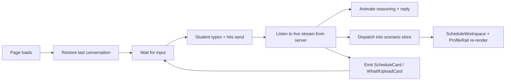

# Chat UI Client — React Page & SSE Consumer

> Last verified against code: 2026-06-19 (Plan 37 — workspace slot-editor + P/F validation + chat-confirm bridge + never-commit-invalid + visa-mandatory: slot-action popover + `SlotActionPopover`/`slotActionView`, `plan_proposal` SSE event + `applyPlanProposalEvent` + `shouldInterceptAsConfirm` typed-confirm intercept + consume-once pending-mutation store, render-only-valid scenarios (invalid proposed → red card, no Confirm; Branch-B what-if confirmable; Branch-A audit read-only), force/Override retired (M1/M2 — 422 on infeasible, `student-preferred-invalid-draft` no longer minted), visa-mandatory `canBuildPlan`/`visaChosen` (H1), sidebar deleted (G2).
>
> Plan 37 changes documented here: §2 event union gains `plan_proposal`; §3 plan-state store gains consume-once pending-mutation tracking; §3 send path gains the typed-confirm intercept; §4 bubble/Override path retired (force inert, no Override button); §7 gains the workspace slot-editor flow + the chat-confirm bridge; §7 visa-mandatory noted; §9 supporting modules gains `courseExists.ts` + `planProposalEvent.ts` + `typedConfirmIntercept.ts`. `next.config.ts` node:-stub is REVERTED (Plan 36 proper fix: a client-safe engine entry `@nyupath/engine/client` — the stub note in §1 is corrected below).
>
> Prior 2026-06-18: Plan 36 — scenarios workspace UI: 3-zone shell, scenario store, ScheduleWorkspace + CompareView + ProfileRail, chat ScheduleCard/WhatIfUploadCard, 3-branch what-if; engine + R1 + frozen contract untouched. Prior 2026-06-16: Phase 4 follow-ups F1-F3 (DPR-field authority, IP-window model, wizard mounted); Phase 4 E3 (never-instant preview/review card; drag removed). Prior 2026-06-15: Phase 4 E2 (badge row + slot-state glyphs); Phase 4 E1 (shared plan-state store + profile read-back). Prior 2026-06-13: removed non-existent `onboardingStep` `"unsupported_major"` member.

## TL;DR

This is the chat page the student actually sees and clicks on — the React component that runs in the browser. It owns everything visible: the conversation thread, the input box, the **3-zone workspace**, and the typing animation. When the student sends a message, this page calls the chat endpoint and listens to the live stream of events coming back, painting the AI's reasoning and reply character by character to feel responsive (like ChatGPT). **Plan 36** reshaped the layout into a 3-zone shell (`ThreeZoneShell`): the chat thread is the LEFT rail, a tabbed **ScheduleWorkspace** is the CENTER hero, and a profile-only **ProfileRail** is the RIGHT zone. **Plan 37** added a workspace slot-editor (per-slot popover on planned/in-progress slots; per-term "+ Add course" affordance), the chat-confirm bridge (`plan_proposal` SSE event → proposed scenario + Confirm rail; typed "confirm"/"yes" intercept; consume-once pending-mutation store), render-only-valid scenarios (invalid proposed → red explanation card, no Confirm; Branch-B what-if confirmable; Branch-A audit read-only), and never-commit-invalid (force/Override retired — 422 on infeasible). The page also remembers the last login, restores old conversations on refresh, emits compact **ScheduleCards** / **WhatIfUploadCards** into the thread, and handles drag-and-drop DPR uploads. Think of it as the storefront, while the chat endpoint is the kitchen.



---

## 1. Overview

The chat UI is a single React Client Component (`apps/web/app/chat/page.tsx`) that talks to `/api/chat/v2` over Server-Sent Events. The page is rendered inside an authenticated layout (`apps/web/app/chat/layout.tsx`) that runs server-side and redirects unauthenticated requests to `/login` before any client JS executes.

The component manages four kinds of state in parallel:
- The conversation thread (`messages[]` — a discriminated array of user / assistant / `plan_action_bubble` / `schedule_card` / `whatif_upload_card` records).
- The onboarding state machine (`onboardingStep` — drives whether v1 or v2 endpoint is used for a turn).
- The plan/scenario state (held in one shared `createPlanStore` snapshot read via `useSyncExternalStore`, Phase 4 E1.1; **Plan 36** made the store's internal state the pure `ScenarioState` model — a committed anchor + a list of proposed/whatif scenarios + an `activeId` + a `compare` pair — surfaced through both the new scenario API and a backward-compat `PlanState` facade) — plus a memoized `sidebarDpr` + `sidebarStudent`.
- The plan-action bubble lifecycle (per-bubble polish + Stage 2 streams, plus an AbortController registry).

> **`@nyupath/engine/client` — the client-safe engine entry (why `/chat` renders at all; Plan 36 proper fix, Plan 37 confirmed).** A pre-existing bug 500'd `/chat`: the `@nyupath/engine` barrel re-exports server-only modules (`dpr/fingerprint.ts → node:crypto`, catalog/RAG loaders → `node:fs`), and several CLIENT modules import pure symbols — `lib/wizard/homeSchool.ts` (→ `SCHOOL_DISPLAY_NAMES`) and Plan 36's `lib/scenarios/scheduleDiff.ts` (→ `canonicalizeCourseId`) — which dragged those `node:` builtins into the client bundle (`UnhandledSchemeError`). The fix is a **client-safe engine entry**: `packages/engine/src/client.ts` re-exports ONLY pure, node-free symbols (`canonicalizeCourseId`/`canonicalizeCourseIdSet` from `courseId.ts` + `SCHOOL_DISPLAY_NAMES` from `data/schoolDefaults.ts`), exposed as `@nyupath/engine/client` in `package.json` exports. The two client barrel-pullers (`lib/scenarios/scheduleDiff.ts`, `lib/wizard/homeSchool.ts`) now import from `@nyupath/engine/client`. The `next.config.ts` node:-stub (Plan 36 band-aid) is **reverted** — a future accidental client barrel-pull fails loudly at compile rather than silently. **Plan 37 added a third client consumer:** `apps/web/app/chat/workspace/slotActionView.ts` imports `slotActionMatrix` / `NYU_ACADEMIC_CALENDAR` / `campusForHomeSchool` / `classifyIpChangeability` from `@nyupath/engine/client`. If you add any future client→engine import, ALWAYS use `@nyupath/engine/client`, not the barrel.

Two streaming mechanics are layered on top:
1. **SSE consumption** — the `streamChatV2` async generator yields parsed events; the page's `applyEvent` reducer mutates the active assistant message.
2. **Typewriter animation** — a single `requestAnimationFrame` loop reveals `thinkingText` and `content` character-by-character so the UI feels like ChatGPT even when the underlying `/api/chat/v2` event is a single block-streamed token.

The page also handles login restore on mount (`/api/session/restore`) to skip onboarding for returning users, and exposes the workspace/profile-rail imperative paths for plan-action confirms, what-if uploads, DPR refresh, and a test-only "clear all" wipe (§7).

## 2. The `chatV2Client`

`apps/web/lib/chatV2Client.ts` is the browser-side SSE consumer. It exports three async generators (each yields parsed events for a different streaming route) plus a small extraction helper.

### Transport

`streamChatV2(body, init)` (`chatV2Client.ts:105-165`) is the main generator the chat page consumes. It does **not** use the browser's `EventSource` API — that would constrain it to GET requests. Instead it uses `fetch()` with a `POST` and reads `response.body.getReader()` directly. This lets it send the full request body (parsed DPR, history, userId, etc.) in one shot.

The transport flow:
1. POST to `endpoint` (defaults to `/api/chat/v2`) with `Content-Type: application/json` and an optional `AbortSignal`.
2. Network failure → yield a synthetic `{ kind: "error", message }` event and return.
3. Non-OK response → attempt to parse the JSON body for an `error` field; yield `{ kind: "error", message: detail }` and return.
4. Empty body → yield `{ kind: "error", message: "Server returned empty body." }` and return.
5. Otherwise enter the streaming loop.

### The SSE block parser

Inside the streaming loop, the reader yields raw `Uint8Array` chunks. The parser:
1. Decodes via a `TextDecoder` (stream-mode so multi-byte sequences split across chunks decode correctly).
2. Appends to a string buffer.
3. Splits on `\n\n` (the SSE block separator). Each complete block is handed to `parseBlock`; the trailing partial stays in the buffer until the next chunk arrives.
4. After the reader finishes, the buffer is flushed once more in case the server didn't emit a trailing `\n\n`.

`parseBlock(block)` (`chatV2Client.ts:167-181`) walks the block's lines, finds the first `data: …` line, strips the `data: ` prefix, and `JSON.parse`s it. The `event: …` line is intentionally ignored because the `kind` field also lives inside the JSON payload (the route encoder double-tracks it). Any parse failure returns `null` (skipped).

If the `AbortSignal` fires mid-stream, the generator returns silently (no synthetic error event) — the caller is responsible for cleaning up.

### Event union

`ChatV2Event` (`chatV2Client.ts:47-65`) is the mirror of the route's `SseEvent` union — same kinds, same payload shape:
- `tool_invocation_start` — `toolName`, `args`
- `tool_invocation_done` — `toolName`, `summary?`, `error?`
- `token` — `text`
- `thinking` — `text`
- `validator_block` — `violations[]`
- `forward_schedule_update` — `schedule` (ForwardSchedule)
- `forward_materialization_update` — `result` (ForwardMaterializationPayload)
- `whatif_audit_request` — `hypotheticalProgram` (Plan 36 H4.2b — Branch-A "upload your Albert What-If audit" offer; `chatV2Client.ts:63`). Emitted once per assistant turn when the agent called the `what_if_audit` tool, whose summary carries an `AUDIT_UPLOAD_OFFER: <label>` marker line. The client renders a `whatif_upload_card` for the hypothetical PROGRAM.
- `plan_proposal` — `pendingMutationId`, `schedule` (ForwardSchedule), `verdict`, `consequences[]`, `hedges[]` (Plan 37 I1 — emitted by the v2 route when a chat turn invokes a plan-change tool; drives the **chat-confirm bridge**: the client creates a proposed scenario + shows the workspace Confirm rail without a separate "Confirm?" agent message). Handled by `applyPlanProposalEvent` (`apps/web/app/chat/planProposalEvent.ts`).
- `done` — `finalText`, `modelUsedId`
- `error` — `message`

`extractAuditUploadOffer(summary)` (`chatV2Client.ts:219`) is the regex helper the v2 route uses to pull the `AUDIT_UPLOAD_OFFER: <label>` line out of the `what_if_audit` tool summary before emitting the `whatif_audit_request` event (mirrors the `extractPendingMutationId` pattern).

`ForwardMaterializationPayload` (`chatV2Client.ts:35-45`) is the per-event shape: a `MaterializationResult` plus `targetTerm`, `proposals[]` (each with `proposalId`, `sections[]`, `weeklyHours`), and `computedAt`.

### Plan-action bubble streams

Two additional generators (`chatV2Client.ts:200-367`) follow the same SSE parsing pattern but consume different routes:
- `streamPlanActionPolish({ slotKey, templateText })` → POSTs to `/api/plan/explain-polish`. Returns silently on HTTP 204 (env-flag gated off). Yields `plan_action_explanation_polish_chunk` / `_done` / `_error`.
- `streamPlanActionStage2({ slotKey, futureTerms })` → POSTs to `/api/plan/stage2`. Yields one `plan_action_stage2_enrichment` per term (best-effort: even transport failures yield a single `unavailable` enrichment so the bubble can surface "section data unavailable" instead of nothing), terminated by `plan_action_stage2_done`.

### `extractPendingMutationId`

`extractPendingMutationId(summary)` (`chatV2Client.ts:189-193`) is a regex helper used in two places:
- The chat page's `applyEvent` for the `tool_invocation_done` event (sets `pendingMutationId` on the message when `update_profile` was invoked).
- The route's persistence path (mirrors the same extraction so the chat history records the same id).

The regex matches `pendingMutationId: pm_<alphanumeric_underscores>` in the tool's summary string.

## 3. The Chat Page

### Page-level state

The page (`apps/web/app/chat/page.tsx:150-181`) holds:
- `messages` — array of `Message` records (see below).
- `input` — the textarea value.
- `isLoading` — true between `handleSend` invoke and finalize.
- `onboardingStep` — discriminated union of onboarding stages (`"awaiting_dpr" | "confirming_data" | "correcting_data" | "asking_visa" | "asking_graduation"`) plus `"complete"`.
- `isDragOver` — for the drag-drop file overlay.
- `parsedData` — the discriminated DPR/transcript payload (used in every v2 turn body).
- `visaStatus`, `graduationTarget` — collected during onboarding, threaded into each v2 body.
- the plan/scenario state — held in **one shared, subscribable store** (`createPlanStore()` from `apps/web/app/chat/planState.ts`, created once per mount via `useMemo`) and read through `useSyncExternalStore`. **Phase 4 E1.1** lifted the plan fields out of independent `useState`s; **Plan 36 (H0.2)** made the store's internal state the pure `ScenarioState` model. See [Page-level plan-state store](#page-level-plan-state-store) below.
- Refs: `fileInputRef`, `messagesEndRef`, `inputRef`, `bubbleAbortersRef` (a `Map<messageId, AbortController>`).

### Page-level plan-state store

**Phase 4 Task E1.1** lifted the plan fields into one shared, subscribable store (`apps/web/app/chat/planState.ts`). **Plan 36 (H0.2)** refactored that store ONTO the pure `ScenarioState` model (`apps/web/lib/scenarios/scenarioModel.ts`) via a **compat facade** — the legacy `PlanState` snapshot (`forwardSchedule` / `schedulePreferences` / `forwardMaterialization` / `pendingPreview` / `invalidProposal`) is now **derived + cached** from the scenario state, and a NEW scenario API is exposed alongside it. The store is **pure TypeScript with no React import** (unit-testable in the node-env vitest harness — `apps/web/tests/sharedPlanState.test.ts` + `planStore.scenarios.test.ts`); the `useSyncExternalStore` binding lives in `page.tsx`.

**The scenario model (`scenarioModel.ts`).** A `Scenario` = `{ id, kind: "committed"|"proposed"|"whatif", label, schedule, verdict: "valid"|"trade-offs"|"invalid", hedges?, pendingMutationId?(proposed), whatIfAssumption?(Branch-B), rederive?(whatif), createdAt }`. `ScenarioState` = `{ committed (the anchor — its OWN slot, NOT in scenarios[]), scenarios[], activeId, compare:{leftId,rightId}|null, invalidProposal }`. The reducers are pure (every one returns a NEW state, with no-op guards returning the SAME ref so `useSyncExternalStore` doesn't churn): `initialState`, `setCommitted`, `addScenario` (throws on id `"committed"`), `setActive`, `openCompare` (throws on equal/unresolvable ids), `closeCompare`, `discardScenario`, **`confirmProposed` = THE commit chokepoint** (proposed → committed; pure, does NOT persist), `setInvalidProposal`. Selectors: `getScenario` / `activeScenario` (committed synthesizes a view with a `createdAt:0` sentinel).

`createPlanStore(initial?)` (`planState.ts:210`) returns a `PlanStore` exposing the React-19 external-store surface, the **legacy facade**, and the **scenario API**:
- `getSnapshot()` — returns the cached `PlanState` compat snapshot **by reference** on a no-op read (materialized once per mutation; React 19 caching requirement).
- `subscribe(listener)` — registers a listener; returns an unsubscribe fn.
- **Legacy facade (unchanged semantics):** `setForwardSchedule` / `setSchedulePreferences` / `setForwardMaterialization` / `setPendingPreview` / `clearPendingPreview` / `setInvalidProposal` / `clearInvalidProposal`. `setForwardSchedule` is still the single commit chokepoint — it drops ALL staged scenarios + clears `invalidProposal` + resets active to `"committed"` (`planState.ts:283`). `setPendingPreview` maps to a single `kind:"proposed"` scenario (≤1 staged at a time = the original single-pending-edit semantics), with the exact `PendingPreview` object preserved in a `previewObjects` side-table so the identity contract `getSnapshot().pendingPreview === the object passed in` holds.
- **Scenario API (Plan 36):** `setCommitted` / `addScenario` / `setActive` / `openCompare` / `closeCompare` / `discardScenario` / `confirmProposed` (thin wrappers over the model reducers) + selectors `getCommitted` / `getScenarios` / `getActiveScenario` / `getScenarioState`.

Why it matters: chat-driven updates (SSE events + `/api/plan/*` HTTP responses) and confirm round-trips write to the **same** in-page state; every consumer — `<ScheduleWorkspace>` + `<ProfileRail>` — re-renders from the one snapshot with **no server round-trip for the render**. Existing consumers + tests stayed green because the compat facade preserves the legacy `PlanState` snapshot shape and the object-identity contract.

### The `Message` shape

`Message` (`page.tsx:70-130`) is the central row type. Fields:

- Identity / role / content / timestamp.
- `kind?: "plan_action_bubble" | "schedule_card" | "whatif_upload_card"` (`page.tsx:111`) — discriminator for the special render paths. `undefined` = a regular chat bubble.
- `scheduleCard?: { scenarioId, kind, label, summary?, verdict? }` (`page.tsx:115`) — populated only for `kind:"schedule_card"`; rendered as a `<ScheduleCard>` (Open / Compare) in the chat thread when the engine produces a new proposed/whatif scenario (Plan 36 H4.2a).
- `whatifUpload?: { hypotheticalProgram }` (`page.tsx:125`) — populated only for `kind:"whatif_upload_card"`; rendered as a `<WhatIfUploadCard>` offering a Branch-A Albert What-If audit upload (Plan 36 H4.2b).
- `bubble?: PlanActionBubbleState` — populated for the `plan_action_bubble` kind.
- `bubbleVerb?`, `bubbleResolved?` — bubble metadata.
- `toolStatuses?: ToolStatus[]` — per-tool `{ toolName, state, summary?, error? }`. Rendered inline above the bubble.
- `validatorViolations?` — surfaced as a warning chip below the bubble.
- `pendingMutationId?` — surfaced as a "Confirm profile update" button.
- `startedAt?`, `completedAt?`, `failedAt?` — epoch ms; drive the agent-status UX (header text + duration).
- `traceExpanded?` — whether the reasoning block is open.
- `thinkingText?`, `thinkingRevealed?` — the reasoning string and how many chars the typewriter has revealed so far.
- `contentRevealed?` — same for the final answer.
- `hasRealThinking?` — true once at least one `thinking` SSE event has arrived; suppresses the synthesized tool-thought fallback so we don't double-narrate.

### The send path

`handleSend()` (`page.tsx:709-733`) is the entry point for both the Enter key and the send button. It:
1. Adds a user `Message` immediately.
2. Sets `isLoading = true`.
3. Branches on `useV2 = onboardingStep === "complete" && parsedData`:
   - v2 → checks `shouldInterceptAsConfirm(text, hasPendingProposal)` **first** (Plan 37 I3 — typed-confirm intercept). If the student typed "confirm", "yes", "proceed", or a similar affirmation AND there is a pending `plan_proposal` proposal in the consume-once store, `handleSend` routes directly to `handleWorkspaceConfirm` (the canvas Confirm chokepoint) instead of sending the text to the agent. This makes the system-prompt statement "type 'confirm' to accept" truthful without letting the agent auto-confirm. The consume-once pending-mutation store is cleared on use so a double "yes" doesn't double-commit.
   - v2 otherwise → `handleSendV2(text)`.
   - v1 → `handleSendV1(text)`.
4. Catches errors and adds a fallback assistant message.
5. Resets `isLoading` and refocuses the input.

`handleSendV2(userText)` (`page.tsx:492-533`) is the SSE driver:
1. Builds `recentHistory` from the last 10 non-welcome messages.
2. Pre-creates an empty assistant `Message` so tokens stream INTO it (sets `startedAt`, empty `thinkingText`, `thinkingRevealed=0`, `contentRevealed=0`).
3. Iterates `streamChatV2({ message, parsedData, visaStatus, graduationTarget, history, userId: getOrCreateClientId() })`.
4. Dispatches each event to `applyEvent(ev, assistant.id, toolStatuses)`.

`getOrCreateClientId()` (`page.tsx:48-61`) reads/creates a UUID from `localStorage` under the key `nyupath:client-id`. Falls back to a `cohortA-<timestamp>-<random>` if `crypto.randomUUID` is unavailable; falls back to `"anonymous"` when `localStorage` itself throws.

`handleSendV1(userText)` (`page.tsx:685-707`) is the legacy onboarding path. It POSTs to `/api/chat` (JSON, not SSE), receives a single response, and adds the assistant message plus any returned `onboardingStep`, `visaStatus`, or `graduationTarget` updates.

### The `applyEvent` reducer

`applyEvent` (`page.tsx:536-683`) is a per-event mutator that updates the active assistant `Message`. Note: there is **no** `template_match` case in the live reducer — the `ChatV2Event` union (`chatV2Client.ts:47-56`) has no `template_match` member, so the page never receives one. The handled kinds are:

- `tool_invocation_start` → push the tool onto `toolStatuses` with state `"running"`. Look up the tool's "thought sentence" via `getThoughtSentence(toolName)` from `lib/agentStatusVerbs.ts` and append it to `thinkingText` (with single-space joiner, deduped against the last sentence) — UNLESS `hasRealThinking` is set, in which case the canned sentences would conflict with the model's actual chain-of-thought (`page.tsx:538-566`).
- `tool_invocation_done` → patch the matching running status with `state: "done"` or `"error"`, plus `summary` and `error` fields. If the tool was `update_profile`, run `extractPendingMutationId(summary)` and set the message's `pendingMutationId` (`page.tsx:567-583`).
- `token` → APPEND the text to `content`. The handler comment notes the route emits a single block-streamed token today; the append-rather-than-overwrite pattern is forward-compatible with a future intra-token streaming upgrade (`page.tsx:584-592`).
- `thinking` → first event sets `hasRealThinking = true` and REPLACES any synthesized sentence narration (resets `thinkingRevealed = 0` so the typewriter restarts on the new text). Subsequent events append (`page.tsx:594-615`).
- `forward_schedule_update` → call `planStore.setForwardSchedule(ev.schedule)` (`page.tsx:616-618`).
- `whatif_audit_request` → appends a `whatif_upload_card` Message to the thread (Branch-A upload card; `page.tsx:619-640`).
- `forward_materialization_update` → call `planStore.setForwardMaterialization(ev.result)` (`page.tsx:641-648`).
- `validator_block` → set `validatorViolations` on the message (`page.tsx:649-657`).
- `plan_proposal` → **Plan 37 chat-confirm bridge (I1/I2).** Delegates to the pure `applyPlanProposalEvent(ev, { planStore, addScenario, messages, setMessages })` (`apps/web/app/chat/planProposalEvent.ts`). On a valid/trade-offs result: adds a proposed scenario to the store (calling `planStore.setPendingPreview`) and emits a `schedule_card` message so the student sees an Open/Compare card in the thread. On an invalid result: stages the red invalid-proposal card (`planStore.setInvalidProposal`) — no Confirm rail. The `pendingMutationId` is held in a **consume-once** in-memory map (`pendingMutationStore`) so a double-click or a typed "confirm" can't double-submit.
- `done` → server's `finalText` is authoritative; set `content = ev.finalText` and `completedAt = Date.now()`. Guards against any future partial-chunk artifact in the accumulated tokens (`page.tsx:658-664`).
- `error` → don't leak the raw exception to the student. Log `ev.message` to console (for operator correlation), then either keep any partial content that arrived or fall back to a generic "something went wrong, email the operator" copy. Set `failedAt = Date.now()` (`page.tsx:665-683`).

### The typewriter ticker

A single `useEffect` hook (`page.tsx:188-233`) runs a `requestAnimationFrame` loop that walks the messages array each frame and bumps `thinkingRevealed` / `contentRevealed` forward by `(rate × elapsed_ms) / 1000` chars, with `rate` = `THINKING_CHARS_PER_SEC` (60) or `CONTENT_CHARS_PER_SEC` (220).

- Before settlement (`!completedAt && !failedAt`), only the thinking counter advances (so the reasoning streams in first).
- Once `completedAt` or `failedAt` is set, the thinking counter snaps to full immediately, and the content typewriter starts.
- On `failedAt`, content also snaps to full (no animation for the error fallback).
- Elapsed time per frame is clamped at 100ms so a backgrounded tab doesn't catch up by suddenly revealing thousands of characters.

The ticker uses a `changed` flag and bails out by returning `prev` when no message advanced — keeps React from re-rendering when every message is settled.

### Login restore

A second `useEffect` (`page.tsx:245-361`) runs once on mount and fetches `/api/session/restore`. When the response carries `dpr` and `profile`:
1. Set `onboardingStep = "complete"`.
2. Wrap the restored DPR in `{ kind: "dpr", report }` and set as `parsedData`.
3. Hydrate `visaStatus` (only when `"f1"` or `"domestic"`) and `graduationTarget` (from the restored schedule).
4. Set `forwardSchedule` (prefer the valid slot; fall back to the draft).
5. Hydrate `schedulePreferences`.
6. Replay `chatMessages[]`: build `Message` records where assistant entries are marked already-settled (`startedAt === completedAt === createdAt` timestamp), `contentRevealed` is pre-filled to the full length, and `thinkingText` (when present) is pre-revealed with `hasRealThinking = true`. Tool invocations are surfaced as past-tense `ToolStatus`es.

All restore failures are caught and logged; the page falls back to the existing onboarding flow.

### Message bubble rendering

The render loop (`page.tsx:1161-1399`) walks `messages` and branches early when `msg.kind === "plan_action_bubble" && msg.bubble`. For regular messages:

1. **Avatar** — assistant rows render the 🎓 avatar; user rows do not.
2. **Reasoning block** (`page.tsx:1283-1353`) — only rendered when `msg.role === "assistant" && msg.startedAt`. The header text is derived from settlement state:
   - In-flight: `"Thinking"` (shimmering style, `role="status" aria-live="polite"`).
   - Settled: `"Reasoned for <duration>"` via `formatDuration(completedAt - startedAt)`.
   - Failed: `"Failed after <duration>"`.
   Settled reasoning is collapsible (button toggles `traceExpanded`). In-flight is always expanded. Body shows the `thinkingText` sliced to `thinkingRevealed`, split on `\n\n` into paragraphs, with a blinking caret on the last paragraph during in-flight. Below the paragraphs, the per-tool list renders via `getPastVerb(toolName)` plus the tool state icon (`•` running, `✓` done, `⚠` error).
3. **Final answer** (`page.tsx:1354-1371`) — the content sliced to `contentRevealed` rendered through the lightweight `renderMarkdown` function (`apps/web/lib/renderMarkdown.ts`: HTML-escapes `&`/`<`/`>` FIRST, then handles `**bold**`, `*italic*`, `` `code` ``, and `\n` → `<br />`) and injected via `dangerouslySetInnerHTML`. The leading entity-escape neutralizes any raw HTML in the (untrusted) string before the markdown transforms run, so injection via LLM output / restored transcripts / user messages is closed. Hidden while text is empty so an empty white card isn't shown during early thinking.
4. **Validator warning chip** (`page.tsx:1372-1385`) — yellow background card listing each violation's `kind`, optional `caveatId`, and `detail`.
5. **Confirm profile update button** (`page.tsx:1386-1395`) — rendered when `pendingMutationId` is set. Calls `handleConfirmPending(pendingMutationId)`, which injects a "Yes, please apply…" user message and runs the v2 path so the agent picks up the confirmation.

### Loading indicator (v1 only)

The legacy bouncing-dots typing indicator (`page.tsx:1398-1407`) only renders when `isLoading && !(onboardingStep === "complete" && parsedData)` — v2 turns have the streaming reasoning block as their own progress indicator.

### Mermaid render-flow diagram

```mermaid
sequenceDiagram
    autonumber
    participant User
    participant Page as ChatPage
    participant Stream as streamChatV2 (async gen)
    participant Apply as applyEvent reducer
    participant Ticker as rAF typewriter
    participant Workspace as ScheduleWorkspace + ProfileRail
    participant Restore as session restore

    Note over Page,Restore: Mount
    Page->>Restore: GET /api/session/restore
    alt Has DPR + profile
        Restore-->>Page: { dpr, profile, schedule, prefs, chatMessages }
        Page->>Page: setOnboardingStep("complete"), hydrate state, replay messages (settled)
    else
        Restore-->>Page: 401 or null
        Page->>Page: Onboarding flow (welcome message + drag-drop)
    end
    Page->>Ticker: requestAnimationFrame loop (always running)

    Note over User,Page: User sends a turn
    User->>Page: Type + Enter
    Page->>Page: addMessage(user) + pre-create empty assistant
    Page->>Stream: streamChatV2({ message, parsedData, history, userId })
    Stream->>Page: POST /api/chat/v2 (SSE)

    loop For each SSE block
        Stream-->>Page: ChatV2Event
        Page->>Apply: dispatch
        alt tool_invocation_start
            Apply->>Page: push ToolStatus (running) + append thought sentence (if no real thinking)
        else tool_invocation_done
            Apply->>Page: update ToolStatus → done/error; extract pendingMutationId
        else thinking
            Apply->>Page: set hasRealThinking; replace synthesized text on first event
        else token
            Apply->>Page: append to content
        else forward_schedule_update
            Apply->>Workspace: planStore.setForwardSchedule
        else forward_materialization_update
            Apply->>Workspace: planStore.setForwardMaterialization
        else whatif_audit_request
            Apply->>Page: append whatif_upload_card Message (Branch-A)
        else validator_block
            Apply->>Page: set validatorViolations
        else done
            Apply->>Page: set content = finalText; completedAt = now
        else error
            Apply->>Page: console.error; failedAt = now; friendly copy
        end
        Ticker->>Page: each frame, advance thinkingRevealed / contentRevealed
    end

    Note over Page,Workspace: Plan edits (CHAT-ONLY — scenarios)
    User->>Page: ask the agent to add/drop/swap/withdraw…
    Page->>Page: handlePlanActionResult / handleWhatIfResult → planActionSurfaces
    alt feasible (proposed scenario)
        Page->>Workspace: setPendingPreview / addScenario → a proposed tab
        Page->>Page: emit schedule_card (Open / Compare)
        User->>Workspace: workspace Confirm → handleWorkspaceConfirm
    else feasible:false
        Page->>Workspace: setInvalidProposal → RED card
        Page->>Page: inject plan_action_bubble Message (Override-anyway / hard-refusal)
    end
    Note over User,Page: Branch-A what-if (read-only)
    User->>Page: WhatIfUploadCard → upload Albert audit → handleWhatIfAuditUpload
    Page->>Workspace: addScenario(kind:"whatif") (NO pendingMutationId — never committable)
    Page->>Page: POST /api/plan/confirm → setForwardSchedule + confirmProposed (R1: parsed_dpr untouched)
```

## 4. Plan-Action Bubble Helpers

`apps/web/lib/planActionBubbleHelpers.ts` owns the bubble lifecycle math so the JSX in `page.tsx` stays slim.

> **Phase 4 E3 — the bubble now fires ONLY for `feasible:false`.** As of the E3 group the FEASIBLE path (clean + trade-offs) no longer mints a chat bubble at all — its sole surface is the **canvas review card** in the sidebar (the "◷ Preview" overlay + the verdict card, see [ui-components.md](./ui-components.md) "Canvas edit-model surfaces"). The page's `handlePlanActionResult` routes through the pure `planActionSurfaces` helper (`apps/web/lib/planActionSurfaces.ts`), which returns `showBubble:false` for feasible and `showBubble:true` for `feasible:false`; only the latter appends a `plan_action_bubble`, because it carries Override-anyway / hard-refusal copy the cards lack. The classifier + bubble-state machinery below is therefore exercised **only on the refusal path** now — but the classifier itself is unchanged.

### Bubble kinds

`PlanActionBubbleKind` (`planActionBubbleHelpers.ts:64-68`) is a discriminated union of four values. The classifier still returns all four (it runs on the propose response regardless of surface), but post-E3 only the two refusal kinds ever mint a chat bubble:
- `clean` — feasible AND empty consequences. **No chat bubble** (E3); the canvas review card (✓ Valid) is the sole surface and applies only on Confirm. The classifier still returns this so the call site can branch.
- `trade_offs` — feasible BUT non-empty consequences. **No chat bubble** (E3); the canvas review card (⚠ trade-offs) is the surface. (Pre-E3 this minted a Confirm + Keep-as-is bubble.)
- `soft_refusal` — not feasible, but the violations are caps/floors/exclusion sets the student can override. Bubble (Confirm + Keep-as-is + Override-anyway) renders ALONGSIDE the E3.3 RED invalid-proposal card.
- `hard_refusal` — not feasible, with violations the student cannot override at the engine level. Bubble (NO buttons) renders alongside the RED card.

`HARD_CONFLICT_KINDS` (`planActionBubbleHelpers.ts:82-90`) is the explicit set of solver conflict kinds that map to hard refusals:
- `prereq_unsatisfiable`, `prereqChain`, `not_clause`, `graduation_total`, `offering`, `offering_pattern`, `no_plan`.

Everything else is treated as soft (Decision #32's `student-preferred-invalid-draft` override path applies).

### Classifier and predicates

- `classifyPlanActionOutcome(response)` (`planActionBubbleHelpers.ts:96-113`) — runs the discriminator:
  1. `feasible && consequences.length === 0` → `clean`.
  2. `feasible` → `trade_offs`.
  3. Otherwise, scan `conflicts` for any hard kind → `hard_refusal`, else → `soft_refusal`.
- `bubbleHasButtons(kind)` — true except for `hard_refusal`.
- `bubbleHasOverrideButton(kind)` — true only for `soft_refusal`.
- `bubbleSlotKey(pendingMutationId)` — returns `bubble:<pendingMutationId>`. Stable per-bubble key so polish + Stage 2 SSE events route back to the right bubble.

### Bubble state shape

`PlanActionBubbleState` (`planActionBubbleHelpers.ts:158-181`) carries:
- `slotKey` (matches the SSE `slotKey` echoed by the polish + Stage 2 routes).
- `text` — current rendered body. Starts at the deterministic template (`response.explanation`); replaced by polish output when it lands.
- `polishStatus` — `idle | streaming | done | error`.
- `stage2: Map<termKey, { status, message }>` — per-term enrichment signals; keyed by the message's leading `[term]` prefix when present.
- `kind` — echo of the classifier output.
- `pendingMutationId` — the id Confirm / Override-anyway POST to `/api/plan/confirm`.
- `futureTerms` — the route's future-term hint; drives the Stage 2 fan-out.

### Reducers

`applyPolishEvent(state, ev)` (`planActionBubbleHelpers.ts:203-236`):
- Guards by `ev.slotKey === state.slotKey`.
- On `_chunk`: replace `text` with the first chunk, accumulate on subsequent chunks. Status → `streaming`.
- On `_done`: server's `polishedText` wins (mirrors the v2 `done` event's `finalText` authority). Status → `done`.
- On `_error`: keep the deterministic template; status → `error`.

`applyStage2Event(state, ev)` (`planActionBubbleHelpers.ts:241-272`):
- Guards by `ev.slotKey === state.slotKey` and `ev.kind === "plan_action_stage2_enrichment"`.
- Extract the term key from the leading `[<term>]` prefix in `ev.message` (falls back to the full message).
- Last-write-wins per term (pending → ok / warn / unavailable overwrites).

`initBubbleState(response)` (`planActionBubbleHelpers.ts:184-195`) bootstraps from a route response: classifies, sets text from `response.explanation`, polish idle, empty stage2 map, copies `pendingMutationId` and `futureTerms`.

### Page-side wiring

The chat page (`page.tsx:1112-1625`) owns the bubble lifecycle:

1. **Injection (E3-reworked; Plan 36 — chat-triggered)** — `handlePlanActionResult(verb, result)` (`page.tsx:1190`) handles a plan-action route response. **Plan 36 note:** the live trigger is now CHAT (the agent's tool call), NOT a sidebar ⋯-menu — there is no `<ScheduleSidebar>` mount any more. On route failure (HTTP / network), inject a plain assistant message with the verb + status. On success it runs the pure `planActionSurfaces(result.data)` to decide the surfaces (and, on the feasible path, emits a `schedule_card` into the chat thread — see §7):
   - **feasible (clean OR trade-offs)** → stage the E3.1 preview into the store (`planStore.setPendingPreview`) and clear any stale red card; **return without a bubble** (`showBubble:false`) — the canvas review card is the sole surface. (There is NO `kind === "clean"` early return any more; a clean apply now previews like every feasible verb instead of silently committing.)
   - **`feasible:false`** → stage the E3.3 red card (`planStore.setInvalidProposal`), clear any stale preview, AND (because `showBubble:true`) build a chat bubble via `initBubbleState`, give it id `bubble-<pendingMutationId>`, append to messages, and call `spawnBubbleEnrichers`. The bubble carries the Override-anyway / hard-refusal copy the red card doesn't.
   The committed plan (`planStore.forwardSchedule`) is NEVER mutated here — only Confirm commits.

2. **Enrichment** — `spawnBubbleEnrichers(messageId, bubble)`:
   - Creates an `AbortController` (or reuses an existing one) in `bubbleAbortersRef`.
   - When `process.env.NEXT_PUBLIC_PLAN_CHANGE_LLM_POLISH === "1"` AND `bubble.kind !== "clean"`, fires `streamPlanActionPolish` in a fire-and-forget async IIFE, dispatching each event through `applyPolishEvent` via `patchBubble`.
   - When `bubble.futureTerms.length > 0` AND `bubble.kind !== "hard_refusal"`, fires `streamPlanActionStage2`, dispatching each event through `applyStage2Event`.
   - Both fetches respect the controller's `signal`; aborted streams return silently. (Post-E3 this only runs on the `feasible:false` path, which is the only path that mints a bubble.)

3. **Resolution — the chat-bubble handlers** (`page.tsx:1322-1503`):
   - `handleBubbleConfirm(messageId, pendingMutationId)` — set `bubbleResolved: true` immediately (lock buttons), abort enrichers, POST `/api/plan/confirm` via `planConfirm`. On success: persist any returned `forwardSchedule` (`planStore.setForwardSchedule`) and `clearPendingPreview`; set `content = "✓ Applied."`. On failure: re-enable buttons (`bubbleResolved: false`) and put the failure copy in `content`. **Plan 37 M1:** the server now returns HTTP 422 if the re-solve is infeasible — the confirm route NEVER persists an invalid plan; the prior valid row survives unchanged.
   - `handleBubbleKeepAsIs(messageId)` — abort enrichers, `clearPendingPreview` + `clearInvalidProposal` (so dismissing a `feasible:false` bubble also drops its red card), set `bubbleResolved: true`, `content = "Kept the plan as-is."`.
   - **`handleBubbleOverrideAnyway` — REMOVED (Plan 37 M2).** The "Override anyway" UI button was deleted. The `force` param on `/api/plan/confirm` is now inert (`DEPRECATED / INERT` comment in the route); no UI path passes `force:true` after M2. `student-preferred-invalid-draft` is no longer minted (retained only for display/restore back-compat of old data rows). An invalid proposed change surfaces as a red explanation card — no commit path.

4. **Resolution — the canvas review/red-card handlers (E3)** (`page.tsx:1517-1580`): the feasible path's surface is the sidebar review card, whose three buttons wire to:
   - `handleReviewConfirm(pendingMutationId)` (`page.tsx:1517`) — delegates to the pure `applyReviewConfirm(planStore, planConfirm, …)` (`reviewCard.ts:223`), which shares the SAME commit path as the bubble Confirm (`planConfirm` → `setForwardSchedule` → `clearPendingPreview`) so the two surfaces can't double-commit. On failure the preview stays staged and a brief assistant note is injected.
   - `handleReviewCancel()` (`page.tsx:1535`) — `applyReviewCancel(planStore)` (`reviewCard.ts:247`): drops the staged preview without a confirm round-trip; the committed plan was never touched.
   - `handleReviewAskWhy(_id, verb?)` (`page.tsx:1550`) — injects a scoped "why … trade-offs" user message and runs the v2 tool-use loop (basic now; E4 builds the full ⋯ Explain).
   - `handleDismissInvalid()` (`page.tsx:1542`) — `planStore.clearInvalidProposal()`: clears the red card (nothing was staged or committed).

### Bubble render path

The render branch (`page.tsx:1188-1289`) is a separate JSX block that returns early. Layout:
- Avatar (🎓) + bubble content.
- Bubble text — `msg.bubble.text` while unresolved (polish reducer writes here), `msg.content` once `bubbleResolved` (the resolution caption). Rendered through `renderMarkdown`.
- Stage 2 enrichment list — `<ul>` of `msg.bubble.stage2.values()`'s `message` strings (when non-empty).
- Buttons (only when `bubbleHasButtons(bubble.kind) && !bubbleResolved`):
  - Confirm (blue) — `handleBubbleConfirm`.
  - Keep as-is (gray) — `handleBubbleKeepAsIs`.
  - **Override anyway — REMOVED (Plan 37 M2).** The "Override anyway" button no longer renders; the soft-refusal bubble only shows Confirm + Keep-as-is. The `bubbleHasOverrideButton` predicate still exists in `planActionBubbleHelpers.ts` but is not called from any live render path.

The block sets `data-kind="plan_action_bubble"` and `data-bubble-kind="<kind>"` attributes for test selectors.

## 5. Live Formatting

### `formatDuration`

`apps/web/lib/formatDuration.ts` exports a single function `formatDuration(ms)` used by the agent-status header ("Reasoned for Xs" / "Failed after Xs"). Four tiers (`formatDuration.ts:8-21`):
- `< 1000ms` → `"450ms"` (no decimal).
- `< 9.95s` → `"4.7s"` (one decimal).
- `< 60s` → `"45s"` (whole seconds).
- `≥ 60s` → `"1m 5s"` (minutes + remaining seconds), with rollover when rounding pushes seconds to 60.

`Math.max(0, ms)` clamps negative inputs to zero.

### `groupCoursesByTerm`

`apps/web/lib/groupCoursesByTerm.ts` is a pure helper that produces the sidebar's chronological render plan: prior credits (transfer rows) plus an ordered list of historical → in-progress → future term buckets.

`groupCoursesByTerm({ student, forwardSchedule, dpr })` (`groupCoursesByTerm.ts:78-129`):
1. **Prior credits** — walks `dpr.courseHistory`, picks rows where `type === "TE"`, builds `PriorCreditEntry`s via `makePriorCreditEntry` (synthesizes a friendly label for synthetic `subject = "ELECTIVE"` rows by falling back to `courseTitle`, otherwise renders `${subject} ${catalogNbr}`).
2. **Historical + IP buckets** — preferred path is `buildTermsFromDpr(dpr)` (`groupCoursesByTerm.ts:143-166`):
   - Skip `TE` rows (already in prior credits) and `subject === "ELECTIVE"` synthetic rows.
   - Group rows by `term`.
   - For each term, if ANY row has `type === "IP"`, the whole bucket is unlocked and rows render as `in_progress` slots (avoids the C-grade leakage where `buildStudentProfileFromDpr` stamps `grade="C"` on IP rows for audit consumption). Otherwise, completed slots with the real DPR grade.
   - Each row converts to a `ScheduleSlot` via `dprRowToSlot` (`groupCoursesByTerm.ts:168-189`) using the row's `courseTitle` when present (avoids the "CSCI-UA 4 CSCI-UA 4" duplication bug where falling back to `courseId` doubles the label).
   - Fallback path `buildTermsFromCoursesTaken` (`groupCoursesByTerm.ts:198-234`) — used when no DPR is available (transcript-only flow). Less accurate (no real titles).
3. **Future buckets** — walk `forwardSchedule.semesters`, dedup against history+IP via `normalizeTermKey`.
4. **Merge** — concat then `sort` by `compareTerms`.

`normalizeTermKey(term)` (`groupCoursesByTerm.ts:260-284`) canonicalizes the season + year into `<year>-<season>` lowercased. Handles the DPR's `"2024 Fall"` / `"2026 Spr"`, the planner's `"2026-fall"`, and the inverted `"Fall 2026"` interchangeably. Season aliases: `january` / `j-term` / `jterm`, `spring` / `spr`, `summer` / `sum`, `fall`. This was the fix for the two-card Fall-2026 duplicate bug (literal string comparison missed the `"Fall 2026"` vs `"2026 Fall"` pair).

`compareTerms(a, b)` (`groupCoursesByTerm.ts:291-325`) parses both inputs into `{ year, season }` (season ordinal 0–3) and returns `a.year - b.year` if years differ, else season delta. Tolerates both term shapes the same way `normalizeTermKey` does.

The helper performs no LLM synthesis and no fabrication — when upstream data is missing, the entry is omitted rather than guessed.

## 6. Optimistic Updates

The page is **mostly NOT optimistic on the chat side** — the regular chat flow only renders state the server has confirmed. The pre-created assistant `Message` is empty until `token` / `thinking` / `done` events arrive; content is set on `done` (server-authoritative), not optimistically.

There is one explicit optimistic UI affordance: **plan-action bubble button locking**. When the user clicks Confirm / Override-anyway, `handleBubbleConfirm` and `handleBubbleOverrideAnyway` immediately call `patchMessage(messageId, { bubbleResolved: true })` BEFORE awaiting the `/api/plan/confirm` round-trip (`page.tsx:1324`, `1473`). This locks the buttons so a double-click can't double-submit. If the route fails, the buttons re-enable (`bubbleResolved: false`) and the failure copy lands in `content`.

The schedule workspace IS optimistic-on-the-server-side: when `/api/plan/confirm` returns a fresh `forwardSchedule`, the page calls `planStore.setForwardSchedule(result.data.forwardSchedule)` directly — no waiting for the next chat-turn `forward_schedule_update` event. This bridges the gap between the route's HTTP-JSON response and the chat-side SSE channel; because the workspace + profile rail read the same `createPlanStore` snapshot, the commit lands in the render immediately.

**The scenario preview is the deliberate "never-instant" surface.** A proposed scenario (staged in chat) renders as its own workspace tab — read-only — and the committed plan ("📌 My Plan") stays byte-identical until the student clicks **Confirm** (which runs `planConfirm` → `setForwardSchedule`/`confirmProposed`). A `feasible:false` proposal surfaces as the red invalid-proposal card and never previews. So the only true optimistic affordance remains the bubble-button locking above; the scenario preview is intentionally NOT a commit.

## 7. The 3-zone shell mount + workspace handlers

**Plan 36** replaced the single `<ScheduleSidebar>` mount with the 3-zone shell. The page renders `<ThreeZoneShell>` (`page.tsx:1879`) with:
- `planStore` — the SAME shared `createPlanStore` instance the page holds.
- `onConfirmProposed={handleWorkspaceConfirm}` / `onAskWhy={handleWorkspaceAskWhy}` — the workspace's proposed-scenario callbacks.
- `left` — the chat thread + composer JSX (messages map + the onboarding wizard + the input box), passed by the page.
- `right={<ProfileRail … />}` — the profile-only RIGHT zone (`page.tsx:2297`). **There is no `<ScheduleSidebar>` mount any more** — the old `scheduleSidebar.tsx` is referenced only in `page.tsx` comments and is slated for deletion.

The CENTER zone (`<ScheduleWorkspace>`, mounted inside `ThreeZoneShell`) and the RIGHT `<ProfileRail>` both read the store via `useSyncExternalStore` and are documented in [ui-components.md](./ui-components.md) ("ScheduleWorkspace" / "ProfileRail" / "ScheduleView" / "CompareView").

### Workspace / scenario handlers (page-side)

- **`handlePlanActionResult(verb, result)`** (`page.tsx:1190`) — still runs the pure `planActionSurfaces` to decide preview vs invalid card. On the feasible path it stages the preview (`setPendingPreview`) AND, when the active scenario is `kind:"proposed"`, **emits a `schedule_card` into the chat thread** via `buildScheduleCardMessage` so the student can Open/Compare it. On `feasible:false` it stages the red card.
- **`handleWhatIfResult`** (`page.tsx:1284`) — the Branch-B current-term withdraw/pass-fail path (from `propose_whatif_assumption` → `/api/plan/whatif`). Stages a CONFIRMABLE proposed scenario carrying the `whatIfAssumption` marker + emits a `schedule_card`.
- **`handleWorkspaceConfirm(scenario)`** (`page.tsx:1584`) — the workspace Confirm. A proposed scenario carries the same `pendingMutationId` the review card uses; it **reuses `applyReviewConfirm(planStore, planConfirm, …)`** (the shared `planConfirm` → `setForwardSchedule` → `clearPendingPreview` path) and, on success, also calls `planStore.confirmProposed(scenario.id)` to promote + drop the scenario in the model. **R1:** only the `forward_schedule` is persisted — `students.parsed_dpr` is never overwritten. **Plan 37 M1:** both the plan-change confirm path (`runConfirmStage`/`confirmPlanChange`) and the what-if confirm path (`runConfirmWhatIfAssumption`) refuse an infeasible re-solve with HTTP 422; `handleWorkspaceConfirm` surfaces the 422 as a brief failure note without touching the committed plan. This is THE ONLY commit chokepoint — slot-editor actions, chat-driven changes, and the typed "confirm" intercept ALL route through here.
- **`handleWorkspaceAskWhy(scenario)`** (`page.tsx:1619`) — derives a verb hint from the scenario label and routes into the grounded chat agent via the SAME `handleReviewAskWhy` / `explainQuestion.ts` module the review card used.
- **`handleWhatIfAuditUpload(file, cardMessageId)`** (`page.tsx:1377`) — the Branch-A path. POSTs the student's Albert What-If audit PDF (multipart field `dpr`) to `/api/whatif-audit`; on success builds a READ-ONLY 🔍 what-if scenario via `buildWhatIfScenarioFromAudit` (no `pendingMutationId` ⇒ NOT confirmable), calls `planStore.addScenario`, and emits a `schedule_card` + a narration message. **R1:** this NEVER calls `/api/plan/confirm` and NEVER writes `parsed_dpr`; the file bytes / PII are never logged.
- The `whatif_audit_request` SSE event is handled in `applyEvent` (`page.tsx:619`): it appends a `whatif_upload_card` message naming the `hypotheticalProgram` (the upload round-trip is owned by `handleWhatIfAuditUpload`).
- **Note:** `onConfirmCombination` (materialization-apply path) is not wired into `page.tsx` — it exists only in the unmounted `scheduleSidebar.tsx` / `sidebar/SectionsView.tsx` / `sidebar/TermCard.tsx` tree, which is slated for deletion. The Sections-view combination-picker path went dark with the sidebar unmount (Plan 36 H5).

### Workspace slot-editor flow (Plan 37 F1–F4)

The committed-plan workspace grid (`<ScheduleView>` inside `<ScheduleWorkspace>`) now supports **propose-only per-slot editing** for `specific_planned` and `in_progress` slots. `completed` slots are locked (🔒) and `placeholder` slots have no editor.

**The slot-action matrix (`slotActionMatrix.ts`, imported via `@nyupath/engine/client`).** A pure function `slotActionMatrix(slot, term, dpr, campus, calendar, passFailConfig, now)` returns which of `{add, drop, withdraw, passFail}` are allowed for a slot, keyed by the slot's engine kind (FINAL/REGISTERED/PLANNED) × the F3 `classifyIpChangeability` window (`add_drop` / `withdraw_pf` / `closed` / `unknown` / `future`) × the school's P/F policy (`canElect`, `pfEligibility`). The matrix is computed **client-side** from `@nyupath/engine/client`; known UX limitation: the per-school `passFail` config is server-only, so `canElect:false` schools' Pass/Fail button isn't pre-disabled in the popover — but the server rejects the election (not a correctness hole).

**`SlotActionPopover.tsx`** (`apps/web/app/chat/workspace/SlotActionPopover.tsx`) — the presentational popover mounted on a slot click. It receives the pre-computed `SlotActionMatrix` (via `slotActionView.ts`, the pure matrix→view mapper) and renders 0–4 action buttons (each with a tooltip/hedge from the view). Actions are: **Add course** (term-level, window-gated — only on planned/IP terms inside the add/drop window; hedged with a deadline reminder), **Drop** (removes the slot from the plan; free for planned slots, window-gated for IP slots), **Withdraw** (IP only, withdraw-window gated; triggers the Branch-B what-if path with an F-1 floor advisory when applicable), **Pass/Fail** (IP only, withdraw/PF-window gated; `canElect:false` schools are server-rejected).

**Per-term "+ Add course" affordance (F4).** Each future/IP term in the committed-plan grid has a `+ Add course` text input that calls `/api/plan/add` with the typed course id. Course-existence is validated client-side + server-side via `courseExists.ts` (a pure catalog lookup); unknown course ids → HTTP 422 surfaced as an inline error.

**Propose-only (D-8).** A slot action clicks → calls `/api/plan/{add,drop}` or `/api/plan/whatif` → enters the SAME propose pipeline as a chat-driven change → the result appears as a **proposed scenario** in the workspace (a preview tab + a chat ScheduleCard). The ONLY path to DB commit is the "Confirm — make this My Plan" button in `ScheduleWorkspace`. The slot-editor adds NO new confirm surface and NO new persistence path.

### Chat-confirm bridge (Plan 37 I1–I3)

The v2 route emits a `plan_proposal` SSE event when a chat turn's tool call produces a plan change (previously the agent had to say "Confirm?" and the user typed a reply). The client handles this in `applyPlanProposalEvent` (`apps/web/app/chat/planProposalEvent.ts`):

- **Valid/trade-offs result:** adds a `kind:"proposed"` scenario with the `pendingMutationId` + stages the pending preview; emits a `schedule_card` chat artifact so the student sees an Open/Compare card; stores the `pendingMutationId` in the **consume-once** `pendingMutationStore`.
- **Invalid result:** stages the red invalid-proposal card (`planStore.setInvalidProposal`); no Confirm rail, no scenario tab; the committed plan is untouched.

**Typed-confirm intercept (`shouldInterceptAsConfirm`, `typedConfirmIntercept.ts`).** If the student types a bare "confirm", "yes", "proceed", or synonym while a pending proposal exists in the consume-once store, `handleSend` routes directly to `handleWorkspaceConfirm` instead of the agent (`page.tsx:757-780`). This makes the system-prompt instruction truthful. The consume-once store (`pendingMutationStore`) is cleared on first use so a double "yes" is a no-op (not a double-commit). **The agent no longer auto-confirms** — it proposes via `plan_proposal` and the student confirms via the button or typed "confirm".

### Render-only-valid scenarios (Plan 37 I4 + owner correction)

- A **valid or trade-offs proposed change** → proposed scenario tab + Confirm button.
- An **invalid proposed change** → red explanation card only (no Confirm, no scenario tab). The chat route's `plan_proposal` event carries `verdict: "invalid"` which triggers the red-card path.
- A **Branch-B what-if (withdraw/pass-fail via `/api/plan/whatif`)** that is valid → CONFIRMABLE proposed scenario + Confirm (per owner decision — branch-B what-ifs are treated like plan changes, not read-only audits).
- A **Branch-A audit what-if** → always read-only (`pendingMutationId` absent, `kind:"whatif"` with no confirm path); if the audit makes the plan invalid, it surfaces as a chat-only narration (no scenario tab, no compare).

### Never commit an invalid plan (Plan 37 M1/M2)

**M1:** BOTH confirm routes (`/api/plan/confirm` for plan changes + `/api/plan/whatif` confirm for Branch-B what-ifs) refuse an infeasible re-solve with **HTTP 422**. The prior valid `forward_schedule` row in the DB is never touched. `handleWorkspaceConfirm` surfaces the 422 as a brief failure note.

**M2:** The "Override anyway" UI affordance is **removed** from the bubble render path. The `force` param on `/api/plan/confirm` is kept inert (marked `DEPRECATED / INERT` in the route comment) so any stale client call passes `force:true` harmlessly but still gets 422 on an infeasible result. `student-preferred-invalid-draft` is no longer minted; old rows with that state still display correctly (back-compat).

### Visa-mandatory onboarding (Plan 37 H1)

`canBuildPlan(state, parsedDpr)` (`OnboardingWizard.tsx`) now requires `state.values.visaChosen === true` before the "Build my plan" button enables. The wizard sets `visaChosen: true` when the student selects either "F-1 visa" or "domestic/other" from the radio group. This prevents launching the forward planner without knowing the visa status (which drives the F-1 full-time-floor check in the engine).

### ProfileRail callbacks

`<ProfileRail>` (`page.tsx:2297`) is fed `student=sidebarStudent` / `dpr=sidebarDpr` / `planStore` plus:
- `onRefreshDpr={handleRefreshDpr}` + `refreshing={refreshingDpr}` — the "↻ Update DPR" control. On a mismatch the page now updates BOTH the committed schedule AND the parsed DPR (so the SummaryCard fields don't go stale).
- `onClearAll={handleClearAll}` (env-gated test wipe) + `onDeleteAccount={handleDeleteAccount}` / `deletingAccount` (standing self-serve deletion).
- `onSelectScenario={(id) => planStore.setActive(id)}` and `onCompareScenario={(id) => planStore.openCompare("committed", id)}` (guarded against null-committed / equal ids — `openCompare` throws otherwise).

Two utility paths talk to non-chat routes:
- `handleRefreshDpr(file)` — POSTs the new PDF to `/api/onboard/refresh-dpr`. On match → `window.alert("No changes detected …")`. On mismatch → updates the committed schedule + parsed DPR and alerts the user.
- `handleClearAll()` — test-only wipe gated server-side on `NEXT_PUBLIC_ENABLE_TEST_CLEAR=1`. Confirms via `window.confirm`, DELETEs `/api/session/clear`, then reloads.

## 8. Loading + Error States

### Per-message loading

The agent-status reasoning block IS the per-message loading indicator for v2 turns:
- In-flight assistant message: shimmering `"Thinking"` header with `role="status" aria-live="polite"`. Reasoning body is always expanded, with the typewriter ticker advancing `thinkingRevealed` and a blinking caret on the last paragraph.
- Settled: `"Reasoned for Xs"` (collapsible button).
- Failed: `"Failed after Xs"` (also collapsible, only if `hasAnyThought`).

The legacy bouncing-dots indicator (`page.tsx:1398-1407`) only renders for v1 turns (`isLoading && !(onboardingStep === "complete" && parsedData)`).

### Page-level loading

`isLoading` (`page.tsx:151`) is set to `true` at the top of `handleSend` and the various injection helpers, and reset to `false` in the `finally` block. While true:
- The textarea is disabled.
- The send button is disabled (`!input.trim() || isLoading`).
- The "Confirm profile update" buttons are disabled.

### Send-path errors

If `handleSendV2` or `handleSendV1` throws (rare — the v2 generator yields synthetic error events instead of throwing), `handleSend` catches and adds a fallback assistant `Message` with `err.message` (`page.tsx:726-729`).

### SSE error events

The `error` SSE event is handled by `applyEvent` (`page.tsx:665-683`). The raw `ev.message` is logged to `console.error` for operator correlation but never shown verbatim to the student. Instead, the message's content is set to:
- Any partial content that already arrived (when available), OR
- The friendly copy: `"Something went wrong on our side handling that turn. Try resending — if it keeps happening, email the operator at edoardo.mongardi18@gmail.com."`

`failedAt = Date.now()` is set so the reasoning header flips to `"Failed after Xs"`.

### Validator block warnings

When a `validator_block` event arrives, the violations render as a yellow-background card under the bubble (`page.tsx:1372-1385`) with the header `"⚠ Could not fully ground this reply."` followed by a `<ul>` listing each violation's `kind` (as `<code>`), optional `caveatId` (in parentheses), and `detail`. The reply text itself is still rendered (validator violations are advisory).

### File-upload errors

`handleFileUpload(file)` (`page.tsx:1018-1049`) rejects non-PDF files with `addMessage("assistant", "Please upload a PDF file (your Degree Progress Report).")`. Network or parse failures surface as `addMessage("assistant", "I had trouble processing that file. Please try uploading again.")`.

### DPR refresh + clear failures

Both `handleRefreshDpr` and `handleClearAll` use `window.alert()` for failure surfaces — operator-level affordances, not student-facing chat copy.

## Known limitations

- **Profile rail is client-derived and can disagree with the server (narrowed by E1.2, not eliminated).** `sidebarStudent` (the profile fed to `<ProfileRail>`'s `SummaryCard`) is still built purely from the raw DPR via `buildStudentProfileFromDpr`, with `visaStatus` forced to `"domestic"` whenever the page state is not `"f1"`. It never consults the authenticated `studentId` or any server-side home-school / program overrides, so the rail's identity fields remain a best-effort **client** reconstruction. **Phase 4 Task E1.2** fixed the SERVER/agent view of this divergence — the v2 route reads the four confirmed `confirm_profile_update` fields (`homeSchool` / `catalogYear` / `declaredPrograms` / `visaStatus`) back into the per-turn `session.student` (see [chat-route-sse.md §5.5](chat-route-sse.md#55-confirmed-profile-read-back-into-sessionstudent-e12)) — so a corrected home school no longer gets clobbered by the fresh body-DPR derivation each turn. But that read-back lands on the SERVER session only; the rail's own `sidebarStudent` is still client-derived, so the two can still disagree until the page itself surfaces the confirmed profile.
- **In-session the plan state is shared; cross-channel AGENT visibility is still next-turn (by design).** **Phase 4 Task E1.1** made the chat page, the workspace, and the profile rail share ONE live state — the `createPlanStore` snapshot. A confirm round-trip and a chat-driven update both write the store, and every consumer re-renders from it with **no server round-trip for the render**. What is **still intentionally next-turn** is the AGENT *seeing* a change: it observes a confirmed change via the v2 route's per-turn re-hydration — the persisted plan/prefs (P3.1) and the confirmed profile read-back (E1.2) are reloaded into the agent's session at the start of each turn — not from mid-turn awareness of in-flight client state. So it is NOT fully bidirectional: render-state is shared live; agent-state converges on the next turn. (Proposed/whatif **scenarios are session-only** — only the committed plan persists; R1 keeps any synthetic DPR out of `students.parsed_dpr`.)

## Related Files

(Paths relative to the repo root.)

- `apps/web/lib/chatV2Client.ts` — SSE consumer + plan-action stream consumers; the `ChatV2Event` union (+ `whatif_audit_request` + `plan_proposal`) + `extractAuditUploadOffer`.
- `apps/web/app/chat/page.tsx` — the chat client component; mounts `<ThreeZoneShell>` + the workspace/what-if handlers + typed-confirm intercept.
- `apps/web/app/chat/planState.ts` — the shared `createPlanStore` store; **Plan 36** refactored it onto the `ScenarioState` model via a compat facade (new scenario API + the legacy `PlanState` snapshot).
- `apps/web/app/chat/planProposalEvent.ts` — **Plan 37 I2** — pure `applyPlanProposalEvent` (handles `plan_proposal` SSE event; proposed scenario or red card).
- `apps/web/app/chat/typedConfirmIntercept.ts` — **Plan 37 I3** — pure `shouldInterceptAsConfirm` (detects typed "confirm"/"yes" when a pending proposal exists).
- `apps/web/lib/scenarios/scenarioModel.ts` — pure `Scenario` type + reducers (`addScenario` / `confirmProposed` / `openCompare` / …).
- `apps/web/lib/scenarios/scheduleDiff.ts` — pure `diffSchedules` (the compare engine) + `slotKey`.
- `apps/web/app/chat/workspace/ThreeZoneShell.tsx` — the 3-zone grid shell.
- `apps/web/app/chat/workspace/ScheduleWorkspace.tsx` — the CENTER tabbed workspace.
- `apps/web/app/chat/workspace/ScheduleView.tsx` — the committed-plan diff-aware term grid; mounts `<SlotActionPopover>` on editable slots (Plan 37 F3).
- `apps/web/app/chat/workspace/SlotActionPopover.tsx` — **Plan 37 F2** — matrix-gated slot action menu (add/drop/withdraw/pass-fail).
- `apps/web/app/chat/workspace/slotActionView.ts` — **Plan 37 F1** — pure `SlotActionMatrix → view-item` mapper (button labels + hedge tooltips).
- `apps/web/app/chat/workspace/CompareView.tsx` — the any-two side-by-side compare.
- `apps/web/app/chat/workspace/scenarioBadges.ts` — shared kind/verdict badge helpers.
- `apps/web/app/chat/ProfileRail.tsx` — the RIGHT-zone profile-only rail (reuses `SummaryCard`).
- `apps/web/app/chat/ScheduleCard.tsx` + `apps/web/app/chat/buildScheduleCardMessage.ts` — the `schedule_card` chat artifact + its builder.
- `apps/web/app/chat/WhatIfUploadCard.tsx` + `apps/web/app/chat/buildWhatIfScenarioFromAudit.ts` — the `whatif_upload_card` + the read-only Branch-A what-if scenario builder.
- `apps/web/app/chat/wizard/OnboardingWizard.tsx` — **Plan 37 H1** — visa-mandatory `canBuildPlan`/`visaChosen` gate.
- `apps/web/lib/reviewCard.ts` — pure `computeReviewCard` / `computeInvalidCard` + `applyReviewConfirm` / `applyReviewCancel`.
- `apps/web/lib/planActionSurfaces.ts` — pure `planActionSurfaces` (decides preview / invalid card from a propose response).
- `apps/web/lib/courseExists.ts` — **Plan 37 E3** — pure catalog lookup for add-course existence validation.
- `apps/web/app/api/plan/confirm/route.ts` — **Plan 37 M1** — 422 on infeasible re-solve; `force` param inert.
- `apps/web/app/api/plan/add/route.ts` — **Plan 37 E3** — course-existence 422.
- `packages/engine/src/client.ts` — client-safe engine entry (`@nyupath/engine/client`); `slotActionMatrix` + `classifyIpChangeability` + `NYU_ACADEMIC_CALENDAR` + `campusForHomeSchool` + `canonicalizeCourseId` + `SCHOOL_DISPLAY_NAMES` (all pure, node-free).
- `packages/engine/src/agent/forwardSchedule/slotActionMatrix.ts` — **Plan 37 D1** — pure 3-state × window × P/F-policy action gate.
- `apps/web/app/chat/layout.tsx` — server-side auth gate (redirects to `/login`).
- `apps/web/lib/groupCoursesByTerm.ts` — pure term-grouping render-plan builder.
- `apps/web/lib/planActionBubbleHelpers.ts` — bubble classifier + state reducers.
