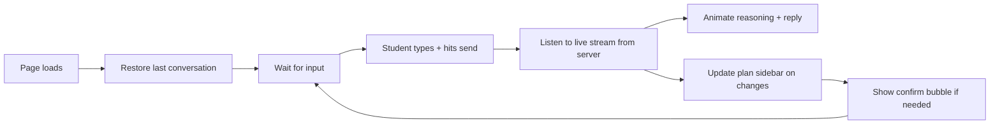

# Chat UI Client — React Page & SSE Consumer

> Last verified against code: 2026-06-10 (post planning-engine rebuild, PRs #35-#41).

## TL;DR

This is the chat page the student actually sees and clicks on — the React component that runs in the browser. It owns everything visible: the conversation thread, the input box, the sidebar, and the typing animation. When the student sends a message, this page calls the chat endpoint and listens to the live stream of events coming back, painting the AI's reasoning and reply character by character to feel responsive (like ChatGPT). It also takes care of the small details: remembering the last login, restoring old conversations on refresh, showing confirmation bubbles when a plan change needs approval, and handling drag-and-drop file uploads for the degree progress report. Think of it as the storefront, while the chat endpoint is the kitchen.



---

## 1. Overview

The chat UI is a single React Client Component (`apps/web/app/chat/page.tsx`) that talks to `/api/chat/v2` over Server-Sent Events. The page is rendered inside an authenticated layout (`apps/web/app/chat/layout.tsx`) that runs server-side and redirects unauthenticated requests to `/login` before any client JS executes.

The component manages four kinds of state in parallel:
- The conversation thread (`messages[]` — a discriminated array of user / assistant / `plan_action_bubble` records).
- The onboarding state machine (`onboardingStep` — drives whether v1 or v2 endpoint is used for a turn).
- The forward-schedule sidebar inputs (`forwardSchedule`, `schedulePreferences`, `forwardMaterialization`, plus a memoized `sidebarDpr` + `sidebarStudent`).
- The plan-action bubble lifecycle (per-bubble polish + Stage 2 streams, plus an AbortController registry).

Two streaming mechanics are layered on top:
1. **SSE consumption** — the `streamChatV2` async generator yields parsed events; the page's `applyEvent` reducer mutates the active assistant message.
2. **Typewriter animation** — a single `requestAnimationFrame` loop reveals `thinkingText` and `content` character-by-character so the UI feels like ChatGPT even when the underlying `/api/chat/v2` event is a single block-streamed token.

The page also handles login restore on mount (`/api/session/restore`) to skip onboarding for returning users, and exposes sidebar-driven imperative paths for plan actions, DPR refresh, and a test-only "clear all" wipe.

## 2. The `chatV2Client`

`apps/web/lib/chatV2Client.ts` is the browser-side SSE consumer. It exports three async generators (each yields parsed events for a different streaming route) plus a small extraction helper.

### Transport

`streamChatV2(body, init)` (`chatV2Client.ts:105-165`) is the main generator the chat page consumes. It does **not** use the browser's `EventSource` API — that would constrain it to GET requests. Instead it uses `fetch()` with a `POST` and reads `response.body.getReader()` directly. This lets it send the full request body (parsed DPR, history, userId, etc.) in one shot.

The transport flow:
1. POST to `endpoint` (defaults to `/api/chat/v2`) with `Content-Type: application/json` and an optional `AbortSignal`.
2. Network failure → yield a synthetic `{ kind: "error", message }` event and return.
3. Non-OK response → attempt to parse the JSON body for an `error` field; yield `{ kind: "error", message: detail }` and return.
4. Empty body → yield `{ kind: "error", message: "Server returned empty body." }` and return.
5. Otherwise enter the streaming loop.

### The SSE block parser

Inside the streaming loop, the reader yields raw `Uint8Array` chunks. The parser:
1. Decodes via a `TextDecoder` (stream-mode so multi-byte sequences split across chunks decode correctly).
2. Appends to a string buffer.
3. Splits on `\n\n` (the SSE block separator). Each complete block is handed to `parseBlock`; the trailing partial stays in the buffer until the next chunk arrives.
4. After the reader finishes, the buffer is flushed once more in case the server didn't emit a trailing `\n\n`.

`parseBlock(block)` (`chatV2Client.ts:167-181`) walks the block's lines, finds the first `data: …` line, strips the `data: ` prefix, and `JSON.parse`s it. The `event: …` line is intentionally ignored because the `kind` field also lives inside the JSON payload (the route encoder double-tracks it). Any parse failure returns `null` (skipped).

If the `AbortSignal` fires mid-stream, the generator returns silently (no synthetic error event) — the caller is responsible for cleaning up.

### Event union

`ChatV2Event` (`chatV2Client.ts:47-56`) is the mirror of the route's `SseEvent` union — same kinds, same payload shape:
- `tool_invocation_start` — `toolName`, `args`
- `tool_invocation_done` — `toolName`, `summary?`, `error?`
- `token` — `text`
- `thinking` — `text`
- `validator_block` — `violations[]`
- `forward_schedule_update` — `schedule` (ForwardSchedule)
- `forward_materialization_update` — `result` (ForwardMaterializationPayload)
- `done` — `finalText`, `modelUsedId`
- `error` — `message`

`ForwardMaterializationPayload` (`chatV2Client.ts:35-45`) is the per-event shape: a `MaterializationResult` plus `targetTerm`, `proposals[]` (each with `proposalId`, `sections[]`, `weeklyHours`), and `computedAt`.

### Plan-action bubble streams

Two additional generators (`chatV2Client.ts:200-367`) follow the same SSE parsing pattern but consume different routes:
- `streamPlanActionPolish({ slotKey, templateText })` → POSTs to `/api/plan/explain-polish`. Returns silently on HTTP 204 (env-flag gated off). Yields `plan_action_explanation_polish_chunk` / `_done` / `_error`.
- `streamPlanActionStage2({ slotKey, futureTerms })` → POSTs to `/api/plan/stage2`. Yields one `plan_action_stage2_enrichment` per term (best-effort: even transport failures yield a single `unavailable` enrichment so the bubble can surface "section data unavailable" instead of nothing), terminated by `plan_action_stage2_done`.

### `extractPendingMutationId`

`extractPendingMutationId(summary)` (`chatV2Client.ts:189-193`) is a regex helper used in two places:
- The chat page's `applyEvent` for the `tool_invocation_done` event (sets `pendingMutationId` on the message when `update_profile` was invoked).
- The route's persistence path (mirrors the same extraction so the chat history records the same id).

The regex matches `pendingMutationId: pm_<alphanumeric_underscores>` in the tool's summary string.

## 3. The Chat Page

### Page-level state

The page (`apps/web/app/chat/page.tsx:148-174`) holds:
- `messages` — array of `Message` records (see below).
- `input` — the textarea value.
- `isLoading` — true between `handleSend` invoke and finalize.
- `onboardingStep` — discriminated union of onboarding stages plus `"complete"` and `"unsupported_major"`.
- `isDragOver` — for the drag-drop file overlay.
- `parsedData` — the discriminated DPR/transcript payload (used in every v2 turn body).
- `visaStatus`, `graduationTarget` — collected during onboarding, threaded into each v2 body.
- `forwardSchedule`, `schedulePreferences`, `forwardMaterialization` — sidebar inputs hydrated from `/api/session/restore` and updated by SSE events.
- `sidebarOpen` — sidebar visibility toggle.
- Refs: `fileInputRef`, `messagesEndRef`, `inputRef`, `bubbleAbortersRef` (a `Map<messageId, AbortController>`).

### The `Message` shape

`Message` (`page.tsx:70-130`) is the central row type. Fields:

- Identity / role / content / timestamp.
- `kind?: "plan_action_bubble"` — discriminator for the special render path.
- `bubble?: PlanActionBubbleState` — populated for the bubble kind.
- `bubbleVerb?`, `bubbleResolved?` — bubble metadata.
- `toolStatuses?: ToolStatus[]` — per-tool `{ toolName, state, summary?, error? }`. Rendered inline above the bubble.
- `validatorViolations?` — surfaced as a warning chip below the bubble.
- `pendingMutationId?` — surfaced as a "Confirm profile update" button.
- `startedAt?`, `completedAt?`, `failedAt?` — epoch ms; drive the agent-status UX (header text + duration).
- `traceExpanded?` — whether the reasoning block is open.
- `thinkingText?`, `thinkingRevealed?` — the reasoning string and how many chars the typewriter has revealed so far.
- `contentRevealed?` — same for the final answer.
- `hasRealThinking?` — true once at least one `thinking` SSE event has arrived; suppresses the synthesized tool-thought fallback so we don't double-narrate.

### The send path

`handleSend()` (`page.tsx:565-589`) is the entry point for both the Enter key and the send button. It:
1. Adds a user `Message` immediately.
2. Sets `isLoading = true`.
3. Branches on `useV2 = onboardingStep === "complete" && parsedData`:
   - v2 → `handleSendV2(text)`.
   - v1 → `handleSendV1(text)`.
4. Catches errors and adds a fallback assistant message.
5. Resets `isLoading` and refocuses the input.

`handleSendV2(userText)` (`page.tsx:386-412`) is the SSE driver:
1. Builds `recentHistory` from the last 10 non-welcome messages.
2. Pre-creates an empty assistant `Message` so tokens stream INTO it (sets `startedAt`, empty `thinkingText`, `thinkingRevealed=0`, `contentRevealed=0`).
3. Iterates `streamChatV2({ message, parsedData, visaStatus, graduationTarget, history, userId: getOrCreateClientId() })`.
4. Dispatches each event to `applyEvent(ev, assistant.id, toolStatuses)`.

`getOrCreateClientId()` (`page.tsx:48-61`) reads/creates a UUID from `localStorage` under the key `nyupath:client-id`. Falls back to a `cohortA-<timestamp>-<random>` if `crypto.randomUUID` is unavailable; falls back to `"anonymous"` when `localStorage` itself throws.

`handleSendV1(userText)` (`page.tsx:541-563`) is the legacy onboarding path. It POSTs to `/api/chat` (JSON, not SSE), receives a single response, and adds the assistant message plus any returned `onboardingStep`, `visaStatus`, or `graduationTarget` updates.

### The `applyEvent` reducer

`applyEvent` (`page.tsx:414-538`) is a per-event mutator that updates the active assistant `Message`. Note: there is **no** `template_match` case in the live reducer — the `ChatV2Event` union (`chatV2Client.ts:47-56`) has no `template_match` member, so the page never receives one. The handled kinds are:

- `tool_invocation_start` → push the tool onto `toolStatuses` with state `"running"`. Look up the tool's "thought sentence" via `getThoughtSentence(toolName)` from `lib/agentStatusVerbs.ts` and append it to `thinkingText` (with single-space joiner, deduped against the last sentence) — UNLESS `hasRealThinking` is set, in which case the canned sentences would conflict with the model's actual chain-of-thought (`page.tsx:416-444`).
- `tool_invocation_done` → patch the matching running status with `state: "done"` or `"error"`, plus `summary` and `error` fields. If the tool was `update_profile`, run `extractPendingMutationId(summary)` and set the message's `pendingMutationId` (`page.tsx:445-461`).
- `token` → APPEND the text to `content`. The handler comment notes the route emits a single block-streamed token today; the append-rather-than-overwrite pattern is forward-compatible with a future intra-token streaming upgrade (`page.tsx:462-471`).
- `thinking` → first event sets `hasRealThinking = true` and REPLACES any synthesized sentence narration (resets `thinkingRevealed = 0` so the typewriter restarts on the new text). Subsequent events append (`page.tsx:472-493`).
- `forward_schedule_update` → call `setForwardSchedule(ev.schedule)` (`page.tsx:494-496`).
- `forward_materialization_update` → call `setForwardMaterialization(ev.result)` (`page.tsx:497-504`).
- `validator_block` → set `validatorViolations` on the message (`page.tsx:505-513`).
- `done` → server's `finalText` is authoritative; set `content = ev.finalText` and `completedAt = Date.now()`. Guards against any future partial-chunk artifact in the accumulated tokens (`page.tsx:514-520`).
- `error` → don't leak the raw exception to the student. Log `ev.message` to console (for operator correlation), then either keep any partial content that arrived or fall back to a generic "something went wrong, email the operator" copy. Set `failedAt = Date.now()` (`page.tsx:521-536`).

### The typewriter ticker

A single `useEffect` hook (`page.tsx:188-233`) runs a `requestAnimationFrame` loop that walks the messages array each frame and bumps `thinkingRevealed` / `contentRevealed` forward by `(rate × elapsed_ms) / 1000` chars, with `rate` = `THINKING_CHARS_PER_SEC` (60) or `CONTENT_CHARS_PER_SEC` (220).

- Before settlement (`!completedAt && !failedAt`), only the thinking counter advances (so the reasoning streams in first).
- Once `completedAt` or `failedAt` is set, the thinking counter snaps to full immediately, and the content typewriter starts.
- On `failedAt`, content also snaps to full (no animation for the error fallback).
- Elapsed time per frame is clamped at 100ms so a backgrounded tab doesn't catch up by suddenly revealing thousands of characters.

The ticker uses a `changed` flag and bails out by returning `prev` when no message advanced — keeps React from re-rendering when every message is settled.

### Login restore

A second `useEffect` (`page.tsx:245-361`) runs once on mount and fetches `/api/session/restore`. When the response carries `dpr` and `profile`:
1. Set `onboardingStep = "complete"`.
2. Wrap the restored DPR in `{ kind: "dpr", report }` and set as `parsedData`.
3. Hydrate `visaStatus` (only when `"f1"` or `"domestic"`) and `graduationTarget` (from the restored schedule).
4. Set `forwardSchedule` (prefer the valid slot; fall back to the draft).
5. Hydrate `schedulePreferences`.
6. Replay `chatMessages[]`: build `Message` records where assistant entries are marked already-settled (`startedAt === completedAt === createdAt` timestamp), `contentRevealed` is pre-filled to the full length, and `thinkingText` (when present) is pre-revealed with `hasRealThinking = true`. Tool invocations are surfaced as past-tense `ToolStatus`es.

All restore failures are caught and logged; the page falls back to the existing onboarding flow.

### Message bubble rendering

The render loop (`page.tsx:1161-1399`) walks `messages` and branches early when `msg.kind === "plan_action_bubble" && msg.bubble`. For regular messages:

1. **Avatar** — assistant rows render the 🎓 avatar; user rows do not.
2. **Reasoning block** (`page.tsx:1283-1353`) — only rendered when `msg.role === "assistant" && msg.startedAt`. The header text is derived from settlement state:
   - In-flight: `"Thinking"` (shimmering style, `role="status" aria-live="polite"`).
   - Settled: `"Reasoned for <duration>"` via `formatDuration(completedAt - startedAt)`.
   - Failed: `"Failed after <duration>"`.
   Settled reasoning is collapsible (button toggles `traceExpanded`). In-flight is always expanded. Body shows the `thinkingText` sliced to `thinkingRevealed`, split on `\n\n` into paragraphs, with a blinking caret on the last paragraph during in-flight. Below the paragraphs, the per-tool list renders via `getPastVerb(toolName)` plus the tool state icon (`•` running, `✓` done, `⚠` error).
3. **Final answer** (`page.tsx:1354-1371`) — the content sliced to `contentRevealed` rendered through the lightweight `renderMarkdown` function (`page.tsx:1087-1093`: handles `**bold**`, `*italic*`, `` `code` ``, and `\n` → `<br />`) and injected via `dangerouslySetInnerHTML`. Hidden while text is empty so an empty white card isn't shown during early thinking. **See "Known limitations" — `renderMarkdown` does no HTML sanitization.**
4. **Validator warning chip** (`page.tsx:1372-1385`) — yellow background card listing each violation's `kind`, optional `caveatId`, and `detail`.
5. **Confirm profile update button** (`page.tsx:1386-1395`) — rendered when `pendingMutationId` is set. Calls `handleConfirmPending(pendingMutationId)`, which injects a "Yes, please apply…" user message and runs the v2 path so the agent picks up the confirmation.

### Loading indicator (v1 only)

The legacy bouncing-dots typing indicator (`page.tsx:1426-1435`) only renders when `isLoading && !(onboardingStep === "complete" && parsedData)` — v2 turns have the streaming reasoning block as their own progress indicator.

### Mermaid render-flow diagram

```mermaid
sequenceDiagram
    autonumber
    participant User
    participant Page as ChatPage
    participant Stream as streamChatV2 (async gen)
    participant Apply as applyEvent reducer
    participant Ticker as rAF typewriter
    participant Sidebar as ScheduleSidebar
    participant Restore as session restore

    Note over Page,Restore: Mount
    Page->>Restore: GET /api/session/restore
    alt Has DPR + profile
        Restore-->>Page: { dpr, profile, schedule, prefs, chatMessages }
        Page->>Page: setOnboardingStep("complete"), hydrate state, replay messages (settled)
    else
        Restore-->>Page: 401 or null
        Page->>Page: Onboarding flow (welcome message + drag-drop)
    end
    Page->>Ticker: requestAnimationFrame loop (always running)

    Note over User,Page: User sends a turn
    User->>Page: Type + Enter
    Page->>Page: addMessage(user) + pre-create empty assistant
    Page->>Stream: streamChatV2({ message, parsedData, history, userId })
    Stream->>Page: POST /api/chat/v2 (SSE)

    loop For each SSE block
        Stream-->>Page: ChatV2Event
        Page->>Apply: dispatch
        alt tool_invocation_start
            Apply->>Page: push ToolStatus (running) + append thought sentence (if no real thinking)
        else tool_invocation_done
            Apply->>Page: update ToolStatus → done/error; extract pendingMutationId
        else thinking
            Apply->>Page: set hasRealThinking; replace synthesized text on first event
        else token
            Apply->>Page: append to content
        else forward_schedule_update
            Apply->>Sidebar: setForwardSchedule
        else forward_materialization_update
            Apply->>Sidebar: setForwardMaterialization
        else validator_block
            Apply->>Page: set validatorViolations
        else done
            Apply->>Page: set content = finalText; completedAt = now
        else error
            Apply->>Page: console.error; failedAt = now; friendly copy
        end
        Ticker->>Page: each frame, advance thinkingRevealed / contentRevealed
    end

    Note over Page,Sidebar: Sidebar interactions
    User->>Sidebar: Add/Swap/Drop/Lock/Move click
    Sidebar->>Page: onPlanActionResult(verb, result)
    alt clean apply
        Page->>Page: silent (no bubble)
    else trade_offs / soft / hard refusal
        Page->>Page: inject plan_action_bubble Message
        Page->>Stream: streamPlanActionPolish (background, if enabled)
        Page->>Stream: streamPlanActionStage2 (background, if futureTerms)
    end
    User->>Page: Confirm / Keep-as-is / Override-anyway
    Page->>Page: abort polish + stage2 streams
    Page->>Page: POST /api/plan/confirm (with force? for override)
```

## 4. Plan-Action Bubble Helpers

`apps/web/lib/planActionBubbleHelpers.ts` owns the bubble lifecycle math so the JSX in `page.tsx` stays slim.

### Bubble kinds

`PlanActionBubbleKind` (`planActionBubbleHelpers.ts:64-68`) is a discriminated union of four values:
- `clean` — feasible AND empty consequences. Bubble is NOT injected (silent commit; the sidebar's own re-render is the only feedback). The classifier still returns this so the call site can branch.
- `trade_offs` — feasible BUT non-empty consequences. Buttons: Confirm + Keep-as-is.
- `soft_refusal` — not feasible, but the violations are caps/floors/exclusion sets the student can override. Buttons: Confirm + Keep-as-is + Override-anyway.
- `hard_refusal` — not feasible, with violations the student cannot override at the engine level. NO buttons.

`HARD_CONFLICT_KINDS` (`planActionBubbleHelpers.ts:82-90`) is the explicit set of solver conflict kinds that map to hard refusals:
- `prereq_unsatisfiable`, `prereqChain`, `not_clause`, `graduation_total`, `offering`, `offering_pattern`, `no_plan`.

Everything else is treated as soft (Decision #32's `student-preferred-invalid-draft` override path applies).

### Classifier and predicates

- `classifyPlanActionOutcome(response)` (`planActionBubbleHelpers.ts:96-113`) — runs the discriminator:
  1. `feasible && consequences.length === 0` → `clean`.
  2. `feasible` → `trade_offs`.
  3. Otherwise, scan `conflicts` for any hard kind → `hard_refusal`, else → `soft_refusal`.
- `bubbleHasButtons(kind)` — true except for `hard_refusal`.
- `bubbleHasOverrideButton(kind)` — true only for `soft_refusal`.
- `bubbleSlotKey(pendingMutationId)` — returns `bubble:<pendingMutationId>`. Stable per-bubble key so polish + Stage 2 SSE events route back to the right bubble.

### Bubble state shape

`PlanActionBubbleState` (`planActionBubbleHelpers.ts:158-181`) carries:
- `slotKey` (matches the SSE `slotKey` echoed by the polish + Stage 2 routes).
- `text` — current rendered body. Starts at the deterministic template (`response.explanation`); replaced by polish output when it lands.
- `polishStatus` — `idle | streaming | done | error`.
- `stage2: Map<termKey, { status, message }>` — per-term enrichment signals; keyed by the message's leading `[term]` prefix when present.
- `kind` — echo of the classifier output.
- `pendingMutationId` — the id Confirm / Override-anyway POST to `/api/plan/confirm`.
- `futureTerms` — the route's future-term hint; drives the Stage 2 fan-out.

### Reducers

`applyPolishEvent(state, ev)` (`planActionBubbleHelpers.ts:203-236`):
- Guards by `ev.slotKey === state.slotKey`.
- On `_chunk`: replace `text` with the first chunk, accumulate on subsequent chunks. Status → `streaming`.
- On `_done`: server's `polishedText` wins (mirrors the v2 `done` event's `finalText` authority). Status → `done`.
- On `_error`: keep the deterministic template; status → `error`.

`applyStage2Event(state, ev)` (`planActionBubbleHelpers.ts:241-272`):
- Guards by `ev.slotKey === state.slotKey` and `ev.kind === "plan_action_stage2_enrichment"`.
- Extract the term key from the leading `[<term>]` prefix in `ev.message` (falls back to the full message).
- Last-write-wins per term (pending → ok / warn / unavailable overwrites).

`initBubbleState(response)` (`planActionBubbleHelpers.ts:184-195`) bootstraps from a route response: classifies, sets text from `response.explanation`, polish idle, empty stage2 map, copies `pendingMutationId` and `futureTerms`.

### Page-side wiring

The chat page (`page.tsx:696-877`) owns the bubble lifecycle:

1. **Injection** — `handlePlanActionResult(verb, result)` is the `<ScheduleSidebar onPlanActionResult>` callback. On route failure (HTTP / network), inject a plain assistant message with the verb + status. On success, run `classifyPlanActionOutcome`: if `"clean"`, return silently; otherwise build a bubble via `initBubbleState`, give it id `bubble-<pendingMutationId>`, append to messages, and call `spawnBubbleEnrichers`.

2. **Enrichment** — `spawnBubbleEnrichers(messageId, bubble)` (`page.tsx:754-811`):
   - Creates an `AbortController` (or reuses an existing one) in `bubbleAbortersRef`.
   - When `process.env.NEXT_PUBLIC_PLAN_CHANGE_LLM_POLISH === "1"` AND `bubble.kind !== "clean"`, fires `streamPlanActionPolish` in a fire-and-forget async IIFE, dispatching each event through `applyPolishEvent` via `patchBubble`.
   - When `bubble.futureTerms.length > 0` AND `bubble.kind !== "hard_refusal"`, fires `streamPlanActionStage2`, dispatching each event through `applyStage2Event`.
   - Both fetches respect the controller's `signal`; aborted streams return silently.

3. **Resolution** — three handlers (`page.tsx:880-951`):
   - `handleBubbleConfirm(messageId, pendingMutationId)` — set `bubbleResolved: true` immediately (lock buttons), abort enrichers, POST `/api/plan/confirm` via `planConfirm`. On success: persist any returned `forwardSchedule`; set `content = "✓ Applied."`. On failure: re-enable buttons (`bubbleResolved: false`) and put the failure copy in `content`.
   - `handleBubbleKeepAsIs(messageId)` — abort enrichers, set `bubbleResolved: true`, `content = "Kept the plan as-is."`.
   - `handleBubbleOverrideAnyway(messageId, pendingMutationId)` — same as Confirm but POSTs with `force: true`. Success copy: `"⚠ Override applied — plan saved as student-preferred-invalid-draft."`.

### Bubble render path

The render branch (`page.tsx:1188-1289`) is a separate JSX block that returns early. Layout:
- Avatar (🎓) + bubble content.
- Bubble text — `msg.bubble.text` while unresolved (polish reducer writes here), `msg.content` once `bubbleResolved` (the resolution caption). Rendered through `renderMarkdown`.
- Stage 2 enrichment list — `<ul>` of `msg.bubble.stage2.values()`'s `message` strings (when non-empty).
- Buttons (only when `bubbleHasButtons(bubble.kind) && !bubbleResolved`):
  - Confirm (blue) — `handleBubbleConfirm`.
  - Keep as-is (gray) — `handleBubbleKeepAsIs`.
  - Override anyway (white with red border) — `handleBubbleOverrideAnyway`, only when `bubbleHasOverrideButton(kind)`.

The block sets `data-kind="plan_action_bubble"` and `data-bubble-kind="<kind>"` attributes for test selectors.

## 5. Live Formatting

### `formatDuration`

`apps/web/lib/formatDuration.ts` exports a single function `formatDuration(ms)` used by the agent-status header ("Reasoned for Xs" / "Failed after Xs"). Four tiers (`formatDuration.ts:8-21`):
- `< 1000ms` → `"450ms"` (no decimal).
- `< 9.95s` → `"4.7s"` (one decimal).
- `< 60s` → `"45s"` (whole seconds).
- `≥ 60s` → `"1m 5s"` (minutes + remaining seconds), with rollover when rounding pushes seconds to 60.

`Math.max(0, ms)` clamps negative inputs to zero.

### `groupCoursesByTerm`

`apps/web/lib/groupCoursesByTerm.ts` is a pure helper that produces the sidebar's chronological render plan: prior credits (transfer rows) plus an ordered list of historical → in-progress → future term buckets.

`groupCoursesByTerm({ student, forwardSchedule, dpr })` (`groupCoursesByTerm.ts:78-129`):
1. **Prior credits** — walks `dpr.courseHistory`, picks rows where `type === "TE"`, builds `PriorCreditEntry`s via `makePriorCreditEntry` (synthesizes a friendly label for synthetic `subject = "ELECTIVE"` rows by falling back to `courseTitle`, otherwise renders `${subject} ${catalogNbr}`).
2. **Historical + IP buckets** — preferred path is `buildTermsFromDpr(dpr)` (`groupCoursesByTerm.ts:143-166`):
   - Skip `TE` rows (already in prior credits) and `subject === "ELECTIVE"` synthetic rows.
   - Group rows by `term`.
   - For each term, if ANY row has `type === "IP"`, the whole bucket is unlocked and rows render as `in_progress` slots (avoids the C-grade leakage where `buildStudentProfileFromDpr` stamps `grade="C"` on IP rows for audit consumption). Otherwise, completed slots with the real DPR grade.
   - Each row converts to a `ScheduleSlot` via `dprRowToSlot` (`groupCoursesByTerm.ts:168-189`) using the row's `courseTitle` when present (avoids the "CSCI-UA 4 CSCI-UA 4" duplication bug where falling back to `courseId` doubles the label).
   - Fallback path `buildTermsFromCoursesTaken` (`groupCoursesByTerm.ts:198-234`) — used when no DPR is available (transcript-only flow). Less accurate (no real titles).
3. **Future buckets** — walk `forwardSchedule.semesters`, dedup against history+IP via `normalizeTermKey`.
4. **Merge** — concat then `sort` by `compareTerms`.

`normalizeTermKey(term)` (`groupCoursesByTerm.ts:260-284`) canonicalizes the season + year into `<year>-<season>` lowercased. Handles the DPR's `"2024 Fall"` / `"2026 Spr"`, the planner's `"2026-fall"`, and the inverted `"Fall 2026"` interchangeably. Season aliases: `january` / `j-term` / `jterm`, `spring` / `spr`, `summer` / `sum`, `fall`. This was the fix for the two-card Fall-2026 duplicate bug (literal string comparison missed the `"Fall 2026"` vs `"2026 Fall"` pair).

`compareTerms(a, b)` (`groupCoursesByTerm.ts:291-325`) parses both inputs into `{ year, season }` (season ordinal 0–3) and returns `a.year - b.year` if years differ, else season delta. Tolerates both term shapes the same way `normalizeTermKey` does.

The helper performs no LLM synthesis and no fabrication — when upstream data is missing, the entry is omitted rather than guessed.

## 6. Optimistic Updates

The page is **mostly NOT optimistic on the chat side** — the regular chat flow only renders state the server has confirmed. The pre-created assistant `Message` is empty until `token` / `thinking` / `done` events arrive; content is set on `done` (server-authoritative), not optimistically.

There is one explicit optimistic UI affordance: **plan-action bubble button locking**. When the user clicks Confirm / Override-anyway, `handleBubbleConfirm` and `handleBubbleOverrideAnyway` immediately call `patchMessage(messageId, { bubbleResolved: true })` BEFORE awaiting the `/api/plan/confirm` round-trip (`page.tsx:875`, `920`). This locks the buttons so a double-click can't double-submit. If the route fails, the buttons re-enable (`bubbleResolved: false`) and the failure copy lands in `content`.

The schedule sidebar IS optimistic-on-the-server-side: when `/api/plan/confirm` returns a fresh `forwardSchedule`, the page calls `setForwardSchedule(result.data.forwardSchedule)` directly (`page.tsx:894-896`, `931-933`) — no waiting for the next chat-turn `forward_schedule_update` event. This bridges the gap between the route's HTTP-JSON response and the chat-side SSE channel.

## 7. Sidebar Interactions

The `<ScheduleSidebar>` is rendered at the bottom of the page (`page.tsx:1465-1479`) with these props:
- `schedule` ← `forwardSchedule` state (updated by `forward_schedule_update` SSE events AND by `/api/plan/confirm` HTTP responses).
- `student` ← memoized `sidebarStudent` (rebuilt from `sidebarDpr` and `visaStatus` via `buildStudentProfileFromDpr` whenever either changes; null when no DPR is loaded — `page.tsx:1068-1078`). NOTE: this profile is derived **entirely client-side from the raw DPR** with `visaStatus` defaulting to `"domestic"` whenever the page has not captured `"f1"`; it has no access to the server's authenticated `studentId` / home-school overrides, so the sidebar's identity fields can disagree with the server-side profile. See "Known limitations".
- `dpr` ← memoized `sidebarDpr` (extracted from `parsedData` when `parsedData.kind === "dpr"`; null otherwise — `page.tsx:1064-1067`).
- `materialization` ← `forwardMaterialization` state (updated by `forward_materialization_update` SSE events).
- `schedulePreferences` ← `schedulePreferences` state (hydrated from `/api/session/restore`; updated by plan-action route responses).
- `open` / `onClose` — visibility.

The sidebar drives back into the page via four callbacks:
- `onProposeLoadStyle(style)` (`page.tsx:597-609`) — injects a chat-visible user message like `"Please propose a balanced load style for my schedule — call propose_plan_change with loadStyle="balanced"."` and runs it through `handleSendV2`. The agent's tool-use behavior handles the round-trip.
- `onProposeSlotChange(slot, action)` (`page.tsx:617-642`) — similar pattern for `lock` / `replace` / `drop` / `pin` on a specific slot. Constructs a slotId from `courseId` (for specific/in-progress/completed) or `placeholder(<category>)` (for pool/free-elective slots). In practice the sidebar passes this only as a legacy no-op shim; the live verb result flows through `onPlanActionResult`.
- `onPlanActionResult(verb, result)` (`page.tsx:825-870`) — the sidebar's verb routes return responses through this callback; the page classifies the outcome and injects a `plan_action_bubble` (Section 4) or stays silent (clean apply).
- `onConfirmCombination(proposalId)` (`page.tsx:673-687`) — for the materialization picker. Injects `"Yes, please apply section combination <id> — call confirm_section_combination with proposalId="<id>"."` and runs v2.

The sidebar toggle button (`page.tsx:1115-1123`) is always visible in the header (no longer gated on `forwardSchedule !== null`), so students can inspect their DPR-derived term cards even before computing a forward plan.

Two sidebar utility paths talk to non-chat routes:
- `handleRefreshDpr(file)` (`page.tsx:955-989`) — POSTs the new PDF to `/api/onboard/refresh-dpr` as multipart form-data. The route fingerprint-compares with the stored DPR. On match → `window.alert("No changes detected …")`. On mismatch → updates `forwardSchedule` directly and alerts the user. Failures surface via `window.alert`.
- `handleClearAll()` (`page.tsx:997-1016`) — test-only wipe gated server-side on `NEXT_PUBLIC_ENABLE_TEST_CLEAR=1`. Confirms via `window.confirm`, DELETEs `/api/session/clear`, then `window.location.reload()` to re-run onboarding from a clean slate.

## 8. Loading + Error States

### Per-message loading

The agent-status reasoning block IS the per-message loading indicator for v2 turns:
- In-flight assistant message: shimmering `"Thinking"` header with `role="status" aria-live="polite"`. Reasoning body is always expanded, with the typewriter ticker advancing `thinkingRevealed` and a blinking caret on the last paragraph.
- Settled: `"Reasoned for Xs"` (collapsible button).
- Failed: `"Failed after Xs"` (also collapsible, only if `hasAnyThought`).

The legacy bouncing-dots indicator (`page.tsx:1405-1414`) only renders for v1 turns (`isLoading && !(onboardingStep === "complete" && parsedData)`).

### Page-level loading

`isLoading` (`page.tsx:151`) is set to `true` at the top of `handleSend` and the various injection helpers, and reset to `false` in the `finally` block. While true:
- The textarea is disabled.
- The send button is disabled (`!input.trim() || isLoading`).
- The "Confirm profile update" buttons are disabled.

### Send-path errors

If `handleSendV2` or `handleSendV1` throws (rare — the v2 generator yields synthetic error events instead of throwing), `handleSend` catches and adds a fallback assistant `Message` with `err.message` (`page.tsx:582-585`).

### SSE error events

The `error` SSE event is handled by `applyEvent` (`page.tsx:521-536`). The raw `ev.message` is logged to `console.error` for operator correlation but never shown verbatim to the student. Instead, the message's content is set to:
- Any partial content that already arrived (when available), OR
- The friendly copy: `"Something went wrong on our side handling that turn. Try resending — if it keeps happening, email the operator at edoardo.mongardi18@gmail.com."`

`failedAt = Date.now()` is set so the reasoning header flips to `"Failed after Xs"`.

### Validator block warnings

When a `validator_block` event arrives, the violations render as a yellow-background card under the bubble (`page.tsx:1372-1385`) with the header `"⚠ Could not fully ground this reply."` followed by a `<ul>` listing each violation's `kind` (as `<code>`), optional `caveatId` (in parentheses), and `detail`. The reply text itself is still rendered (validator violations are advisory).

### File-upload errors

`handleFileUpload(file)` (`page.tsx:1018-1049`) rejects non-PDF files with `addMessage("assistant", "Please upload a PDF file (your Degree Progress Report).")`. Network or parse failures surface as `addMessage("assistant", "I had trouble processing that file. Please try uploading again.")`.

### DPR refresh + clear failures

Both `handleRefreshDpr` and `handleClearAll` use `window.alert()` for failure surfaces — operator-level affordances, not student-facing chat copy.

## Known limitations

- **No HTML sanitization (XSS).** `renderMarkdown` (`page.tsx:1087-1093`) is a four-`String.replace` regex transform that handles `**bold**`, `*italic*`, `` `code` ``, and `\n` → `<br />`, and the result is injected with `dangerouslySetInnerHTML` in both the regular final-answer bubble and the plan-action bubble. There is **no escaping or sanitization step**, so any raw HTML in the string is rendered as live markup. The string can come from LLM output (final-answer text), the plan-action template / Haiku polish output, and — via the session-restore replay (`page.tsx:303-353`) — stored chat transcripts and the student's own past messages. This is a stored/reflected XSS exposure that should be treated as a real bug, not a styling shortcut.
- **Sidebar profile is client-derived and can disagree with the server.** `sidebarStudent` (`page.tsx:1068-1078`) is built purely from the raw DPR via `buildStudentProfileFromDpr`, with `visaStatus` forced to `"domestic"` whenever the page state is not `"f1"`. It never consults the authenticated `studentId` or any server-side home-school / program overrides, so the sidebar's `SummaryCard` identity fields are a best-effort client reconstruction, not the authoritative server profile.
- **State flows one way.** The agent never observes sidebar edits mid-conversation: server SSE events and HTTP confirm responses flow `route → page → sidebar`, and sidebar verbs round-trip through their own deterministic `/api/plan/*` routes. A schedule the student edited via the sidebar is only visible to the agent on the next chat turn once the persisted `forwardSchedule` is reloaded into the request body.

## Related Files

- `/Users/edoardomongardi/Desktop/Ideas/NYU Path/apps/web/lib/chatV2Client.ts` — SSE consumer + plan-action stream consumers.
- `/Users/edoardomongardi/Desktop/Ideas/NYU Path/apps/web/app/chat/page.tsx` — the chat client component.
- `/Users/edoardomongardi/Desktop/Ideas/NYU Path/apps/web/app/chat/layout.tsx` — server-side auth gate (redirects to `/login`).
- `/Users/edoardomongardi/Desktop/Ideas/NYU Path/apps/web/lib/formatDuration.ts` — duration formatter for the agent-status header.
- `/Users/edoardomongardi/Desktop/Ideas/NYU Path/apps/web/lib/groupCoursesByTerm.ts` — pure sidebar render-plan builder.
- `/Users/edoardomongardi/Desktop/Ideas/NYU Path/apps/web/lib/planActionBubbleHelpers.ts` — bubble classifier + state reducers.
- `/Users/edoardomongardi/Desktop/Ideas/NYU Path/apps/web/lib/agentStatusVerbs.ts` — active/past verb + thought-sentence maps used by the page's tool-status rendering.
