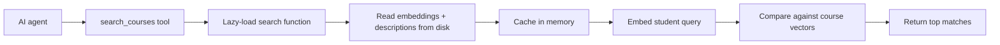
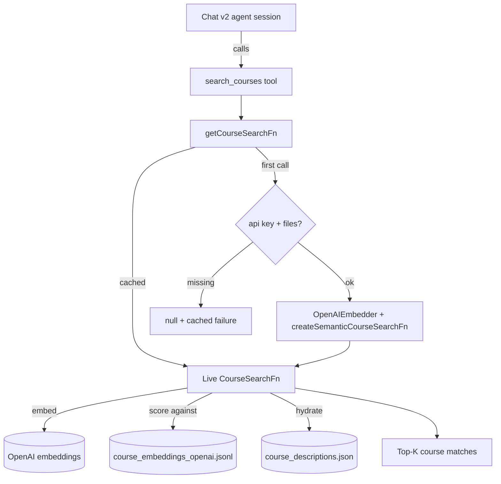

# Course Catalog Search

> Last verified against code: 2026-06-10 (post planning-engine rebuild, PRs #35-#41).

## TL;DR

When the AI agent needs to find courses that match a vague description — "intro econ classes that count for my major," "advanced data structures electives," "anything with a coding focus" — it can't just do a keyword match across the full NYU course catalog. This piece wires up a smarter search: it embeds the student's query into a vector (a numeric fingerprint of meaning), compares it against precomputed fingerprints of every course description, and returns the closest matches. The whole index lives on disk and is loaded into memory once on first use, then cached for the life of the server (the on-disk artifacts total ~575 MB — the 17,122-line embeddings JSONL alone is ~560 MB — so paying that cost lazily matters). If the OpenAI key or the data files are missing, the search quietly fails closed and the agent simply doesn't get this capability. A small helper alongside it formats class meeting times like "Tu 8a–9:15a" for display.

---

## Overview

The web layer wires an embedding-backed semantic search across the full NYU course catalog into the chat agent's `search_courses` tool. The wiring lives in `apps/web/lib/courseCatalogSearch.ts`. The actual embedding + nearest-neighbor logic is provided by the engine package (`@nyupath/engine`); this file is the lazy-loaded glue that constructs the search function once and hands it to whichever caller needs it.

The same wiring underpins the eventual upgrade of the sidebar's `+ Add course` affordance from the client-side prefix match it ships with today to a real catalog-backed semantic search call.

A second small file — `apps/web/lib/formatMeetingPatterns.ts` — provides the pure helpers the sidebar uses when rendering section meeting times. It is included in this doc because it lives in the same lib subtree and supports the "course view" UX, though it has no direct dependency on the search file.

## Files

- `apps/web/lib/courseCatalogSearch.ts` — singleton factory for the engine's semantic search function.
- `apps/web/lib/formatMeetingPatterns.ts` — small text formatters for weekly meeting patterns.

## How the search is wired

`getCourseSearchFn()` (`courseCatalogSearch.ts:32`) returns a `CourseSearchFn` (the engine's type) or null when the search cannot be initialized.

### Inputs

- `OPENAI_API_KEY` from the environment. Required for the OpenAI embedder.
- Three on-disk artifacts under `data/course-catalog/` at the repo root:
  - `course_descriptions.json` — the catalog content. Resolved at `courseCatalogSearch.ts:25`.
  - `course_embeddings_openai.jsonl` — the precomputed embedding vectors per course. Resolved at `courseCatalogSearch.ts:26`.
  - `course_embeddings_openai.meta.json` — metadata accompanying the embeddings (model id, dimension, etc.). Resolved at `courseCatalogSearch.ts:27`.

The repo root is derived from `process.cwd()`: when the process runs from `apps/web`, `REPO_ROOT` walks up two levels; otherwise it uses cwd directly (`courseCatalogSearch.ts:21`).

### Algorithm

The construction itself is `createSemanticCourseSearchFn` from the engine package — this file just hands it the right inputs. From the engine's perspective, the function it returns implements the standard catalog-search contract: take a free-text query, embed it, score against the loaded vectors, and return the top matches.

In plain steps:

1. Embed the incoming query string with `OpenAIEmbedder` (constructed at `courseCatalogSearch.ts:49`).
2. Run a vector-similarity comparison against the preloaded `course_embeddings_openai.jsonl` set.
3. Return the top-K matches as descriptor records sourced from `course_descriptions.json`.

The "load" step is paid lazily on first call — the descriptions JSON (~14 MB) plus the JSONL of vectors (~560 MB, one line per course, 17,122 courses) totals roughly 575 MB on disk, and endpoints that never invoke the agent (e.g. onboarding pages) never pay for it. (The module's own header comment and the marketing landing page quote different round numbers — "17,122-course catalog" and "13,000+ NYU courses" respectively; the embeddings file's line count, 17,122, is the ground truth.)

### Filters supported

The web-layer file itself does not parameterize filters — those are part of the engine's `CourseSearchFn` surface. From the perspective of this file, the function is a black box that the caller invokes with whatever filter shape the engine exposes. The only thing this layer enforces is the binary "can we even search at all" decision via the gates below.

### Failure modes and caching

Two module-level caching slots at the top of the file (`courseCatalogSearch.ts:29-30`):

- `cached: CourseSearchFn | null` — the live function once constructed.
- `cachedFailureReason: string | null` — a sticky failure reason if construction failed previously.

The factory short-circuits on each call:

1. If `cached` is set, return it.
2. If `cachedFailureReason` is set, return null without retrying.
3. If `OPENAI_API_KEY` is missing — set the failure reason to `"OPENAI_API_KEY not set"` and return null.
4. If either of `course_descriptions.json` or `course_embeddings_openai.jsonl` is missing — set the failure reason to a string naming the missing paths, log a warning to the console, and return null. (`courseCatalogSearch.ts:41`)
5. Otherwise attempt to construct the embedder and the semantic search function. On success, cache and return. On a thrown exception, capture the error message into `cachedFailureReason`, log a warning, and return null. (`courseCatalogSearch.ts:48`)

Once a failure is cached, the singleton never retries within the lifetime of the module. A fresh process is required to re-attempt construction.

### Callers

The function the factory hands out is plugged into the agent session that the `/api/chat/v2` route assembles. Tools like `search_courses` invoke it during a chat turn. Endpoints that never construct an agent session never trigger the factory.

## `formatMeetingPatterns` helper

`apps/web/lib/formatMeetingPatterns.ts` exports two pure functions used by the sidebar's Sections view.

### `formatHmm(min)` — `formatMeetingPatterns.ts:18`

Takes a minutes-since-midnight integer and renders a compact 12-hour clock label. Conversion rules:

- Integer hours: `Math.floor(min / 60)`.
- Integer minutes: `min % 60`.
- AM/PM marker: `a` when `hours < 12`, otherwise `p`.
- 12-hour conversion: `(hours + 11) % 12 + 1` (maps 0→12, 13→1, etc.).
- Minutes block is dropped entirely on the hour: `570` (9:30 AM) renders as `9:30a`, `780` (1:00 PM) renders as `1p`, `0` renders as `12a`.

This produces the compact strings the sidebar's narrow column can fit, e.g. `9:30a`, `1p`, `12a`.

### `formatPatterns(patterns)` — `formatMeetingPatterns.ts:32`

Takes an array of `MeetingPattern` records (from `@nyupath/shared`) and joins them into a single human-readable line.

- Empty input: returns the literal string `"Asynchronous"`. This matches the semantics of `SectionView.isAsynchronous`.
- Non-empty input: maps each pattern to `<day> <formatHmm(startMin)>–<formatHmm(endMin)>` and joins with ` · `.

Example output: `Tu 8a–9:15a · Th 8a–9:15a` for a Tuesday/Thursday section.

These live outside the `.tsx` sidebar files specifically so they can be exercised by `vitest` from `apps/web/tests/`, which only runs `.test.ts` modules.

## Known limitations

- **Singleton never retries within a process.** Once `cachedFailureReason` is set (missing key, missing data files, or a thrown construction error), every subsequent `getCourseSearchFn()` returns `null` without re-attempting. A fresh process is required to re-construct the search function after fixing the cause.
- **The sidebar autocomplete is NOT backed by this search.** `gatherAddCourseSuggestions` / `gatherSwapAlternatives` (in [ui-components.md](./ui-components.md)) are still client-side prefix matches over courses already in the loaded schedule. The catalog-backed upgrade described in the Overview is aspirational — no `/api/v2/search-courses` route currently consumes `getCourseSearchFn`; only the chat agent's `search_courses` tool does.

## Diagram

