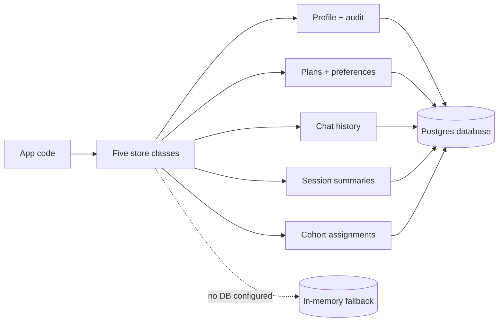
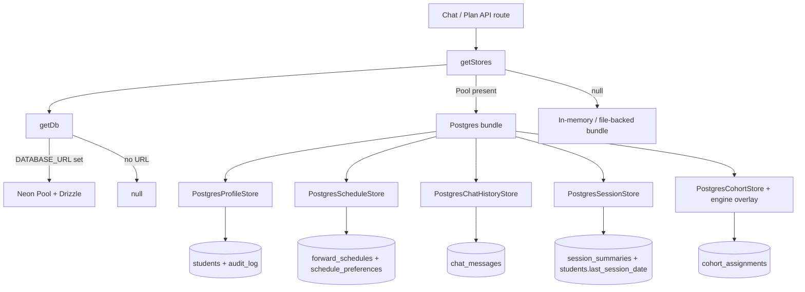

# Database and Stores

## TL;DR

This is the long-term memory of the app — the Postgres database where everything that needs to survive a refresh lives. When a student logs in for the first time, a row is created for them; from then on, every plan they generate, every preference they set, every chat message they send, and every confirmed change to their profile gets stored under their NetID. The code is organized into five "store" classes, each owning one slice (profile, schedule, chat history, session summaries, cohort assignment) and each speaking a clean interface so the rest of the app doesn't have to know about SQL. If no database is configured (local dev without setup), everything quietly falls back to in-memory storage that disappears on restart. Migrations are managed separately and applied during deploys.

---

## Overview

The web app persists everything to a Postgres database accessed through Drizzle ORM. Five concrete store classes — ProfileStore, ScheduleStore, ChatHistoryStore, SessionStore, and CohortStore — sit on top of the same Drizzle client. Four of them implement persistence interfaces that the engine package (`@nyupath/engine`) defines; the fifth (CohortStore) is a web-layer addition that overlays the engine's in-memory cohort map.

When no `DATABASE_URL` is configured, every store falls back to an in-memory implementation that the engine package already exports. This means local development without Postgres still works — only durability is lost.

A single factory (`getStores`) wires the bundle together and caches it at module scope, so warm serverless containers reuse the same Neon connection pool across requests.

## Drizzle schema

All tables are declared in `apps/web/lib/db/schema.ts`. They are intentionally narrow — only what the engine actively reads and writes.

### Enum: cohort

Defined at `schema.ts:26`. Five legal cohort values: `alpha`, `beta`, `invite`, `public`, `limited`. This is the type used by the `cohort_assignments` table.

### Table: students

The canonical row per student. One row per `studentId`. Defined at `schema.ts:28`.

| Column | Type | Purpose |
|---|---|---|
| student_id | text, primary key | Stable identifier issued at onboarding |
| email | text, unique | Optional email; used by the email-OTP login flow |
| parsed_transcript | jsonb | Optional cached transcript parse |
| declared_programs | jsonb, not null, default `[]` | Array of declared programs the engine plans against |
| visa_status | text | Optional visa string (e.g. F-1) |
| catalog_year | text | The student's catalog year (e.g. `2026-fall`) |
| home_school | text | NYU school code (CAS, Tandon, etc.) |
| flags | jsonb, not null, default `[]` | Free-form profile flags the engine cares about |
| profile | jsonb | Full `StudentProfile` snapshot, written by every `confirm_profile_update` |
| parsed_dpr | jsonb | Most-recent parsed Degree Progress Report; written by onboarding and Update-DPR |
| last_session_date | timestamptz | Wall-clock of the latest session summary append |
| created_at | timestamptz, not null, default now | First insert |
| updated_at | timestamptz, not null, default now | Updated on every upsert |

### Table: session_summaries

A rolling window of natural-language summaries per student. Defined at `schema.ts:51`.

| Column | Type | Purpose |
|---|---|---|
| id | serial, primary key | Monotonic ordering key |
| student_id | text, FK to students.student_id, cascade delete | Owner |
| date | text, not null | ISO date string of the session |
| summary | text, not null | ~600-token natural-language summary the agent emitted at end of turn |
| created_at | timestamptz, not null, default now | Insert time |

Index `session_summaries_student_idx` on `(student_id, id)` lets the loader pull the last N rows for one student cheaply.

### Table: audit_log

An immutable append-only history of confirmed profile mutations. Defined at `schema.ts:63`.

| Column | Type | Purpose |
|---|---|---|
| id | serial, primary key | Monotonic ordering key |
| student_id | text, FK to students, cascade delete | Owner |
| pending_mutation_id | text, not null | Echo of the `PendingProfileMutation.id` the agent surfaced |
| field | text, not null | Which `StudentProfile` field changed |
| before | jsonb | Prior value |
| after | jsonb | New value |
| confirmed_at | timestamptz, not null, default now | When the confirm happened |

Index `audit_log_student_idx` on `(student_id, confirmed_at)`.

### Table: cohort_assignments

Per-user cohort overrides. Defined at `schema.ts:76`.

| Column | Type | Purpose |
|---|---|---|
| user_id | text, primary key | Identifier of the user the cohort applies to |
| cohort | cohort enum, not null | One of `alpha`/`beta`/`invite`/`public`/`limited` |
| assigned_at | timestamptz, not null, default now | When the assignment was made |
| assigned_by | text | Optional actor identifier |

### Table: email_otps

One row per outstanding one-time password. Defined at `schema.ts:89`.

| Column | Type | Purpose |
|---|---|---|
| email | text, not null | Recipient |
| code_hash | text, not null | Hashed OTP — the plaintext is never stored |
| issued_at | timestamptz, not null, default now | When the code was sent |
| expires_at | timestamptz, not null | When the code stops being valid |
| consumed_at | timestamptz | Marker that the OTP was redeemed (prevents double-redemption) |

Composite primary key over `(email, issued_at)`. Index `email_otps_email_idx` on `email` for cheap lookup of the live row.

### Table: forward_schedules

Durable plan history. Soft-delete via `superseded_at`. Defined at `schema.ts:106`.

| Column | Type | Purpose |
|---|---|---|
| id | serial, primary key | Monotonic ordering |
| student_id | text, FK to students, cascade delete | Owner |
| schedule | jsonb, not null | Full `ForwardSchedule` snapshot |
| state | text, not null | The schedule's state string (e.g. `valid`, `valid-with-trade-offs`, `infeasible-draft`) |
| dpr_fingerprint | text, not null | Hash of the DPR that produced this plan |
| computed_at | timestamptz, not null | Wall-clock the planner stamped on the schedule |
| superseded_at | timestamptz | Null while the row is the live plan; set when a newer plan supersedes it |

Index `forward_schedules_student_active_idx` on `(student_id, computed_at)`.

### Table: schedule_preferences

One row per student — preferences are intent, not history. Defined at `schema.ts:124`.

| Column | Type | Purpose |
|---|---|---|
| student_id | text, primary key, FK to students, cascade delete | Owner |
| preferences | jsonb, not null | The current `SchedulePreferences` object (includes `pins[]`) |
| updated_at | timestamptz, not null, default now | Last write |

### Table: chat_messages

Append-only chat transcript. Defined at `schema.ts:139`.

| Column | Type | Purpose |
|---|---|---|
| id | serial, primary key | Monotonic ordering key for the timeline |
| student_id | text, FK to students, cascade delete | Owner |
| role | text, not null | `user`, `assistant`, or `system` |
| content | text, not null | The rendered message text |
| thinking_text | text | Optional extended-thinking content for assistant messages |
| tool_invocations | jsonb | Structured tool-call payloads attached to the message |
| validator_violations | jsonb | Structured validator violations attached to the message |
| pending_mutation_id | text | Optional reference to a still-pending `PendingProfileMutation` |
| created_at | timestamptz, not null, default now | Insert time |

Index `chat_messages_student_idx` on `(student_id, id)`.

## Per-store documentation

### ProfileStore — `profileStorePostgres.ts`

Implements the engine's `ProfileStore` interface. Owns the `students` row and the `audit_log` rows.

**get(studentId)** — Selects `profile` from `students` where the row matches. Returns the JSONB column cast to `StudentProfile` or null if no row exists or the column is null. (`profileStorePostgres.ts:20`)

**persistMutation(profile, audit, parsedDpr?)** — Runs as a single Drizzle transaction. Upserts the `students` row keyed on `studentId`: inserts when missing, updates the canonical columns (`declaredPrograms`, `visaStatus`, `catalogYear`, `homeSchool`, `flags`, `profile`, `updatedAt`) when present. When `parsedDpr` is supplied, the `parsed_dpr` column is co-written in the same upsert; when omitted, the column is left untouched so a profile-only mutation does not wipe a previously stored DPR. The same transaction inserts an `audit_log` row with `pendingMutationId`, `field`, `before`, `after`, and `confirmedAt`. (`profileStorePostgres.ts:31`)

**getParsedDpr(studentId)** — Selects `parsed_dpr` from `students`. Returns the JSONB cast to `DegreeProgressReport` or null. (`profileStorePostgres.ts:83`)

### ScheduleStore — `scheduleStorePostgres.ts`

Implements the engine's `ScheduleStore` interface. Owns `forward_schedules` and `schedule_preferences`.

**persistSchedule(studentId, schedule, dprFingerprint)** — Inside a transaction: (1) idempotently ensures the `students` row exists via insert-on-conflict-do-nothing; (2) updates every previously-live `forward_schedules` row for this student (i.e. those with null `superseded_at`) to set `superseded_at = now`; (3) inserts a fresh row with `schedule`, `state`, `dprFingerprint`, and the schedule's own `computedAt`. (`scheduleStorePostgres.ts:26`)

**loadLatestSchedule(studentId)** — Selects the single live row (`superseded_at IS NULL`) ordered by `computed_at DESC` and limit 1. Returns the schedule plus its `dprFingerprint` or null. (`scheduleStorePostgres.ts:62`)

**persistPreferences(studentId, prefs)** — Idempotently ensures the `students` row exists, then upserts `schedule_preferences` keyed on `studentId`. The full preferences object replaces whatever was there. (`scheduleStorePostgres.ts:87`)

**loadPreferences(studentId)** — Selects `preferences` from `schedule_preferences`. Returns the JSONB cast to `SchedulePreferences` or null. (`scheduleStorePostgres.ts:111`)

**clearScheduleForStudent(studentId)** — Hard-deletes every `forward_schedules` row for the student. Used by the Update-DPR flow when the new DPR invalidates all prior plans. (`scheduleStorePostgres.ts:122`)

### ChatHistoryStore — `chatHistoryStorePostgres.ts`

Implements the engine's `ChatHistoryStore` interface. Owns `chat_messages`.

**appendMessage(studentId, message)** — Ensures the `students` FK target exists (insert-on-conflict-do-nothing), then inserts a single `chat_messages` row. All optional fields (`thinkingText`, `toolInvocations`, `validatorViolations`, `pendingMutationId`) are explicitly nulled when absent on the input record. (`chatHistoryStorePostgres.ts:22`)

**loadRecentMessages(studentId, limit = 50)** — Selects the last N rows for the student ordered by `id DESC`, then reverses the array in JS so the caller sees chronological order (oldest first). Optional columns are filtered out of the output if they came back null. (`chatHistoryStorePostgres.ts:46`)

**clearForStudent(studentId)** — Hard-deletes every `chat_messages` row for the student. (`chatHistoryStorePostgres.ts:91`)

**loadAllForTest(studentId)** — Test-only helper. Loads every row ordered by `id ASC` with no limit. (`chatHistoryStorePostgres.ts:102`)

### SessionStore — `sessionStorePostgres.ts`

Implements the engine's `SessionStore` interface. Owns `session_summaries` and also bumps `students.last_session_date`. Mirrors the rolling-window behavior of the engine's `FileBackedSessionStore` (`MAX_SESSION_SUMMARIES` = 5).

**get(studentId)** — Selects up to `MAX_SESSION_SUMMARIES * 4` rows ordered by `id ASC` (defensive cap; the trim below normally keeps the count at 5). Slices the tail to keep only the last 5 and returns a `StudentSessionRecord` with `lastSessionDate` set from the most-recent date. (`sessionStorePostgres.ts:22`)

**appendSummary(studentId, summary)** — Ensures the `students` row exists, inserts the new `session_summaries` row, updates `students.last_session_date` and `students.updated_at`, then trims the window. Returns the freshly loaded record. (`sessionStorePostgres.ts:43`)

**replace(record)** — Replaces the entire window. Ensures the `students` row, deletes all existing summaries for the student, then bulk-inserts the new array (if non-empty). (`sessionStorePostgres.ts:58`)

**trim(studentId)** (private) — Selects the IDs of the latest `MAX_SESSION_SUMMARIES` rows for the student, then issues `DELETE FROM session_summaries WHERE student_id = X AND id NOT IN (those IDs)`. Survives concurrent inserts because the delete is a single statement. (`sessionStorePostgres.ts:86`)

### CohortStore — `cohortStorePostgres.ts`

This one is web-layer-specific; the engine has no `CohortStore` interface, so this class implements its own two-method surface.

**lookup(userId)** — Selects `cohort` from `cohort_assignments` keyed on `userId`. Returns the cohort or null. (`cohortStorePostgres.ts:22`)

**assign(userId, cohort, assignedBy?)** — Upserts a row with `cohort`, fresh `assignedAt`, and optional `assignedBy`. (`cohortStorePostgres.ts:31`)

In the factory bundle, the cohort lookup is wired through an overlay: the database row wins; if there is no row, the engine's in-memory `userInCohort` helper supplies a default (which itself respects any process-wide `setCohortAssignment` overrides).

## The DB client — `client.ts`

A lazy module-level singleton over Neon's serverless driver.

The first call to `getDb(env)` reads `DATABASE_URL` from the supplied env (defaulting to `process.env`). If the URL is missing, returns null and callers are expected to use the in-memory fallback. Otherwise constructs a Neon `Pool` over the URL, wraps it with the `drizzle-orm/neon-serverless` adapter, caches both, and returns the Drizzle instance. (`client.ts:40`)

Because the Neon serverless driver opens WebSocket connections under the hood, the file boots by wiring a WebSocket constructor into `neonConfig`. Node 22+ has a built-in global `WebSocket`; on older runtimes it falls back to `require("ws")`. (`client.ts:26`)

`closeDb()` is a test-only helper that ends the pool and resets the cache. `getDbStatus()` returns `{ connected, cachedAt }` for ops introspection.

## Migration story

Migrations are managed by `drizzle-kit`. The config lives at `apps/web/drizzle.config.ts`:

- Schema source: `./lib/db/schema.ts`
- Output directory for generated migrations: `./drizzle`
- Dialect: `postgresql`
- Connection: `DATABASE_URL` from the environment, defaulting to an empty string when missing
- `strict: true` — drizzle-kit will fail closed on schema diffs that look risky

This is the standard drizzle-kit setup: editing `schema.ts` and running the kit's generate command produces a new SQL file under `apps/web/drizzle/`. The runtime app itself doesn't apply migrations — that's an out-of-band deploy step.

## The store factory — `store.ts`

`getStores(env)` returns a `StoreBundle` containing the four engine-required stores plus a `cohortLookup` callback. It is memoized at module scope so subsequent calls reuse the same bundle (and the same connection pool).

The branching logic is:

1. Call `getDb(env)`. If a Drizzle handle comes back:
   - Construct a `PostgresCohortStore`.
   - Build the bundle with `PostgresSessionStore`, `PostgresProfileStore`, `PostgresScheduleStore`, `PostgresChatHistoryStore`, and a `cohortLookup` that prefers the DB row and falls through to `userInCohort` (the engine's in-memory map) when the DB has nothing.
2. Otherwise, build an in-memory bundle:
   - `sessionStore` is either `FileBackedSessionStore` (if `NYUPATH_SESSION_STORE_PATH` is set) or `InMemorySessionStore`.
   - The others are the engine's `InMemoryProfileStore`, `InMemoryScheduleStore`, `InMemoryChatHistoryStore`.
   - `cohortLookup` calls the engine's `userInCohort` directly.

`resetStoresForTests()` clears the cache so the next call rebuilds. (`store.ts:79`)

## Diagram

