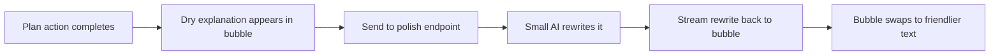
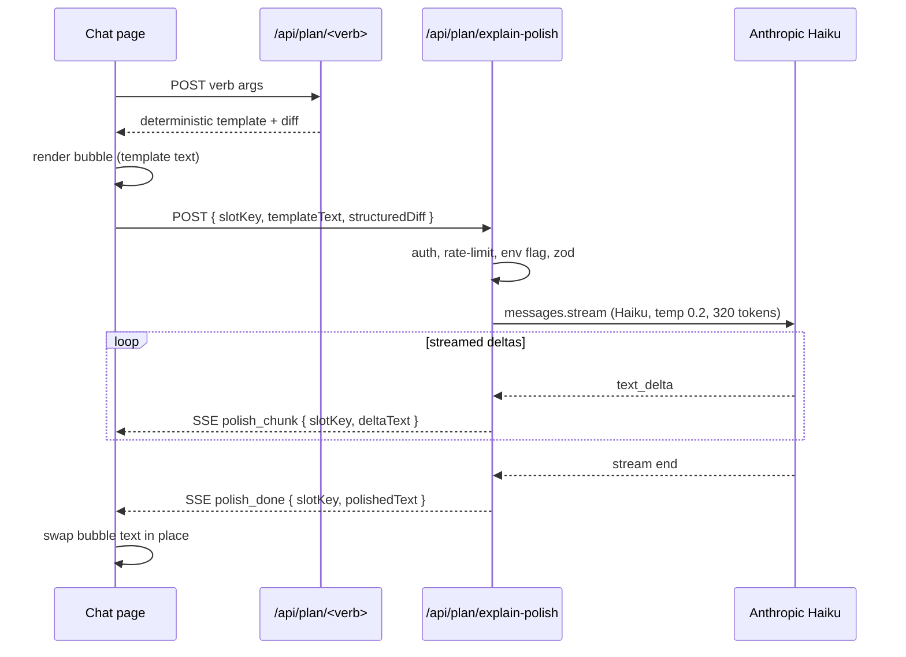

# LLM Polish

> Last verified against code: 2026-06-10 (post planning-engine rebuild, PRs #35-#41).

## TL;DR

When the student clicks "Swap this course," the planning engine produces a correct but slightly robotic explanation — something like "Pinned CSCI-UA 480 to Fall 2026; total credits in that term went from 14 to 18." Helpful, but stiff. The polish endpoint takes that explanation and runs it through a small, fast AI model (Haiku) with strict instructions: rewrite this in friendlier language, but don't add facts, drop facts, or change any course code, credit number, or term name. The result streams back to the chat bubble character by character and quietly replaces the dry version once it lands. The whole thing is gated behind an environment flag, so it can be turned off completely if it's not desired, and it uses a separate quota so it doesn't drain the main chat allowance.

---

## Overview

The "polish" is a second-stage LLM call that runs after a deterministic plan-action route has already produced a natural-language template explanation. The template is rendered instantly into the chat-side confirm bubble; the polish call then rewrites it into more natural prose and streams the result back via Server-Sent Events. The bubble swaps the template text for the polished text once the stream finishes, while the Confirm / Keep-as-is / Override-anyway buttons stay live throughout.

The polish is intentionally constrained: a small Anthropic Haiku call with a tight system prompt that forbids the model from adding facts, dropping facts, or altering any course code, credit number, or term label. It only rephrases.

The whole feature is gated by an environment flag — when off, the route returns 204 and burns no tokens.

## Files

- `apps/web/lib/llmPolishPrompt.ts` — system prompt, user-message builder, and the small set of tuning constants
- `apps/web/app/api/plan/explain-polish/route.ts` — the SSE-streaming route

## The polish prompt

Defined as `LLM_POLISH_SYSTEM_PROMPT` at `llmPolishPrompt.ts:31`. It is built once at module load by joining a fixed array of lines with newlines.

### Structure

1. **Role line** — declares that the model rewrites plan-change explanations from a degree-planning tool.
2. **Job statement** — the model's ONLY job is to rephrase the input more naturally.
3. **Strict rules** — seven numbered rules:
   - Preserve every course code verbatim (e.g. `CSCI-UA 101`, `MATH-UA 343`).
   - Preserve every credit number verbatim (e.g. `4cr`, `16 credits`).
   - Preserve every term label verbatim (e.g. `Fall 2026`, `2027-spring`).
   - Do not add new facts, prerequisites, claims, or speculation.
   - Do not remove information that is present in the input.
   - Output 1–3 sentences of plain English — no markdown, no lists.
   - Do not mention "the input" or that the model is rephrasing — just give the rephrased explanation.
4. **Examples header** — `EXAMPLES:` literal label.
5. **Three input/output few-shot pairs** — each pair shows a deterministic template explanation and an acceptable polished form. The three pairs cover:
   - A pin/move action with multi-term credit shifts (mentions the 18-credit cap, the F-1 floor).
   - A simple add action with a "no prereq issues" note.
   - A drop action that exposes an unmet major requirement.

Each pair anchors the model on a specific kind of phrasing transformation. Three pairs is intentional: the polish prompt is short by design, and a fourth would push the prompt past comfortable headroom for typical templates given Haiku's input budget.

### User-message builder

`buildPolishUserMessage({ templateText, structuredDiffJson? })` at `llmPolishPrompt.ts:63` assembles the per-request user message:

1. Line: `Rephrase this plan-change explanation:`
2. Blank line.
3. The deterministic template text.
4. When a structured diff is supplied: a blank line, then a paragraph instructing the model that the structured JSON is provided for disambiguation only and is NOT a license to add new facts, then the JSON itself.

The structured diff is optional — the route only forwards it when the inbound request carries one.

### Tuning constants

- `LLM_POLISH_MAX_TOKENS = 320` (`llmPolishPrompt.ts:88`). The output ceiling — 1 to 3 sentences fits comfortably under this.
- `LLM_POLISH_MODEL_ID = "claude-haiku-4-5-20251001"` (`llmPolishPrompt.ts:96`). A pinned Anthropic Haiku snapshot so a future model bump doesn't silently change behavior.

## The `/api/plan/explain-polish` route

Defined at `app/api/plan/explain-polish/route.ts`. Runs on the Node runtime (`runtime = "nodejs"`, `route.ts:42`). POST-only.

### Request shape

A JSON body validated by Zod (`route.ts:44`):

| Field | Type | Notes |
|---|---|---|
| `slotKey` | string, 1–200 chars | Stable identifier for the bubble the polish belongs to. The route echoes it back into every SSE event so the client can route deltas to the right bubble when several are open simultaneously. |
| `templateText` | string, 1–4000 chars | The deterministic template explanation, copied verbatim into the user message. |
| `structuredDiff` | unknown, optional | Optional structured plan-diff object. When present it is stringified and truncated to 2000 characters before being appended to the user message. |

### Response shape

When the polish is enabled and the auth/rate-limit gates pass, the route returns `200 OK` with `Content-Type: text/event-stream`, `Cache-Control: no-cache, no-transform`, and `X-Accel-Buffering: no`. It opens a `ReadableStream` that emits SSE blocks. Three event kinds (see `PolishSseEvent` at `route.ts:68`):

- **`plan_action_explanation_polish_chunk`** — fired on every Anthropic `content_block_delta` of type `text_delta`. Payload: `{ slotKey, deltaText }`. The deltas accumulate into the full polished string on the client.
- **`plan_action_explanation_polish_done`** — fired exactly once after the Anthropic stream completes. Payload: `{ slotKey, polishedText }` where `polishedText` is the accumulated string with surrounding whitespace trimmed. The stream controller closes immediately after.
- **`plan_action_explanation_polish_error`** — fired if anything in the stream loop throws. Payload: `{ slotKey, message }`. The controller closes after.

Each SSE block is encoded as a `event: <kind>\n` line followed by `data: <json>\n\n` (see `encodeEvent` at `route.ts:73`).

### Non-streaming responses

The route also returns plain JSON responses for several failure modes:

- **401** when `readSessionFromRequest` returns no auth.
- **429** when the per-student-per-UTC-day rate limit is exhausted. Bucket prefix `plan-polish`, cap `PLAN_POLISH_LIMIT_PER_DAY = 200` calls per day. Includes a `Retry-After` header in seconds.
- **204** (No Content) when the env-flag gate is off — `NEXT_PUBLIC_PLAN_CHANGE_LLM_POLISH` and `PLAN_CHANGE_LLM_POLISH` are both checked, and either being `"1"` enables the route. This is defense-in-depth: the page-side flag is authoritative; if the client fires anyway, the 204 keeps the fetch clean without spending tokens.
- **400** when the JSON body fails to parse or fails Zod validation.
- **503** when `ANTHROPIC_API_KEY` is missing in the environment.

### What the route polishes

The route does NOT consult the database, the engine session, or any other state. It is purely a text-transform service:

1. Reads `templateText` and optional `structuredDiff` from the body.
2. Builds the user message via `buildPolishUserMessage`.
3. Calls `client.messages.stream` from the Anthropic SDK with:
   - `model: LLM_POLISH_MODEL_ID` (the pinned Haiku snapshot)
   - `max_tokens: LLM_POLISH_MAX_TOKENS` (320)
   - `temperature: 0.2`
   - `system: LLM_POLISH_SYSTEM_PROMPT`
   - `messages: [{ role: "user", content: userMessage }]`
4. Iterates the Anthropic event stream and forwards each `text_delta` as a polish chunk SSE event.
5. Emits a final `done` event with the accumulated and trimmed text.

The polish output replaces the deterministic template text in the bubble client-side; the deterministic explanation remains the source of truth for what the action actually does.

## Model and temperature choices

- **Model** — `claude-haiku-4-5-20251001`. Haiku is chosen because the polish call is short, cheap, and latency-sensitive (the page renders the deterministic template in 180–600ms and then fires the polish; Haiku at sub-200-token outputs typically streams in under a second).
- **Temperature** — 0.2 (`route.ts:160`). Low enough to keep the rephrasing close to the template, high enough to allow natural-sentence variation.
- **Max tokens** — 320. Keeps Haiku from overrunning the 1–3 sentence guideline and bounds the worst-case stream length.
- **Snapshot pinning** — both the model ID and the prompt are in source. A future Haiku bump requires an explicit code change, not a silent rollout.

## Diagram

