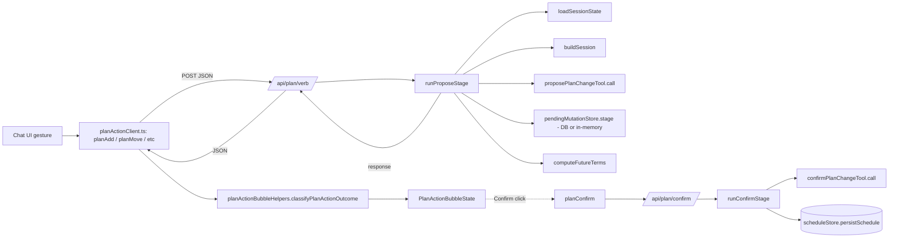

# Plan Action Orchestrator — Server Coordinator and Browser Client

> Last verified against code: 2026-06-16 (Phase 4 E6 — DB-backed pending-mutation staging; live exit gates). Prior: 2026-06-16 (Phase 4 E3: never-instant preview/review card; drag removed); 2026-06-10 (post planning-engine rebuild, PRs #35-#41).

## Purpose

The orchestrator is the conductor between the sidebar buttons and the planning engine. When the student clicks something like "swap this course," the orchestrator pulls up everything the engine needs to think clearly — the student's profile, their parsed degree report, their current plan, their saved preferences — and packages it into a request the engine can handle. After the engine answers, the orchestrator stashes the proposed change in a short-lived, durable staging table (the `pending_mutations` row, keyed by a minted UUID; an in-memory entry when no database is wired) so when the student clicks Confirm a moment later, it can apply that exact same change atomically — even if a different server instance handles the confirm. It also categorizes the outcome into one of four buckets (clean / trade-offs / soft refusal / hard refusal), which is what tells the UI whether to show a confirm button, an override button, or no buttons at all. The browser-side companion to the orchestrator is the small layer that fires the actual HTTP calls and turns errors into friendly results.

```mermaid
flowchart LR
    Gesture[Sidebar click] --> Client[Browser fetch wrapper]
    Client --> Server[Plan-action route]
    Server --> Assemble[Load student state]
    Assemble --> Engine[Engine validates change]
    Engine --> Stage[Stash proposal in pending_mutations]
    Stage --> Classify[Classify outcome]
    Classify --> Bubble[Bubble appears in chat]
    Bubble --> Apply[Confirm click applies + persists]
```



---

## 1. Overview

The plan-action orchestrator is the server-side coordinator that the per-verb routes (`/api/plan/add`, `move`, `swap`, `drop`, `lock`, `confirm`) all funnel through. It sits between the thin HTTP route shells and the engine's plan-change tools, owning four responsibilities:

1. **State assembly.** Loading the student's persisted state (profile, parsed DPR, latest schedule, scheduling preferences) via the store bundle (see [db-and-stores.md](./db-and-stores.md)) and reconstructing a minimal `ToolSession` the engine tools can consume.
2. **Two-stage handshake.** Splitting every mutation into a propose stage (`runProposeStage`) that stages but does not persist, and a confirm stage (`runConfirmStage`) that applies and persists.
3. **Pending-mutation staging.** Stashing the staged `PlanMutation[]` keyed by minted UUID so a propose→confirm round-trip can re-apply it atomically. **As of Phase 4 E6.3 this is DB-backed** (`getStores().pendingMutationStore` — a `pending_mutations` row when a DB handle exists, an in-memory singleton otherwise), replacing the pre-E6.3 in-process `Map`; the single-use delete + cross-tenant guard + 10-min TTL now live inside the store's `take`. See [db-and-stores.md](./db-and-stores.md#pendingmutationstore--pendingmutationstorets-phase-4-e63).
4. **Stage-2 hint computation.** Deriving the list of `futureTerms` the confirm-bubble UI uses to fan out FOSE section enrichments.

Alongside it on the client side, `planActionClient.ts` is the browser-side typed fetch layer that maps each UI gesture to the corresponding `/api/plan/*` POST. The third file in this slice, `planActionBubbleHelpers.ts`, owns the pure reducer logic for the chat-thread `plan_action_bubble` message kind (classification, polish/Stage 2 SSE event reduction).

> **Phase 4 E3 — the orchestrator is UNCHANGED; the CLIENT now makes "edits are never instant" visible.** The `/api/plan/*` routes and `planActionOrchestrator.ts` were *not* touched by the E3 group (commits `c35cd13` / `24e605d` / `0d5c90b` / `b209559`): propose still stages a `pendingMutationId` + a non-persisted, validated `forwardSchedule`, and confirm still applies. What E3 reworked is the **client-side edit model**: a successful propose no longer ever commits silently. Instead the page stages the proposal in the shared plan-state store and the canvas renders it as a read-only **"◷ Preview"** overlay (credit delta + consequences) plus a **review card** (verdict ✓/⚠ + Confirm / Cancel / Ask-why); the committed plan is byte-identical until the student clicks Confirm, which fires the same `/api/plan/confirm` round-trip. A `feasible:false` propose renders a separate RED invalid-proposal card and never previews. The orchestrator's four-bucket classification still exists and still drives the *chat bubble*, but the bubble now only fires on the `feasible:false` path (see §2.1 + the client docs in [ui-components.md](./ui-components.md) and [chat-ui-client.md](./chat-ui-client.md)). NO orchestrator/route logic changed — this is purely how the browser surfaces the already-staged proposal.



## 2. State Machine — Plan Action Lifecycle

A single plan action progresses through clearly-defined states. The state lives partly on the server (the staging map entry) and partly on the client (the bubble state in `planActionBubbleHelpers.ts`).

```mermaid
stateDiagram-v2
    [*] --> Idle
    Idle --> Proposing : UI gesture (⋯-menu verb)
    Proposing --> Proposed : runProposeStage success
    Proposing --> ProposeError : runProposeStage failure
    Proposed --> Classified : classifyPlanActionOutcome
    Classified --> Clean : feasible AND no consequences
    Classified --> TradeOffs : feasible AND consequences > 0
    Classified --> SoftRefusal : infeasible AND no hard conflicts
    Classified --> HardRefusal : infeasible AND any hard conflict
    Clean --> [*] : no bubble; canvas review card (E3) applies on Confirm
    TradeOffs --> Confirming : user clicks Confirm
    SoftRefusal --> Confirming : user clicks Confirm (force=false)
    SoftRefusal --> ConfirmingForce : user clicks Override-anyway (force=true)
    TradeOffs --> Dismissed : user clicks Keep-as-is
    SoftRefusal --> Dismissed : user clicks Keep-as-is
    HardRefusal --> Dismissed : no buttons; UI auto-dismisses
    Confirming --> Confirmed : runConfirmStage success
    Confirming --> ConfirmError : runConfirmStage failure
    ConfirmingForce --> Reclassified : runConfirmStage success with force
    Reclassified --> [*] : state = student-preferred-invalid-draft
    Confirmed --> [*]
    ProposeError --> [*]
    ConfirmError --> [*]
    Dismissed --> [*]
```

### 2.1 The four bubble kinds

`classifyPlanActionOutcome` (`apps/web/lib/planActionBubbleHelpers.ts:96-113`) still maps a propose response into one of four kinds. As of Phase 4 E3 the **chat bubble itself only renders on the `feasible:false` path** — the page's `planActionSurfaces` gate (`apps/web/lib/planActionSurfaces.ts`) returns `showBubble: false` for the two feasible kinds (their sole surface is now the canvas review card), and `showBubble: true` for the two refusal kinds (which carry Override-anyway / hard-refusal copy the cards don't). The classification + button table is unchanged for the bubble that *does* render:

| Kind | Trigger | Where it surfaces (E3) | Buttons | Notes |
|---|---|---|---|---|
| `clean` | `feasible === true` AND `consequences.length === 0` | **Canvas review card (✓ Valid)** — no bubble | Confirm + Cancel + Ask-why (on the card) | A clean apply is no longer a silent commit; it previews like every feasible verb |
| `trade_offs` | `feasible === true` AND `consequences.length > 0` | **Canvas review card (⚠ trade-offs)** — no bubble | Confirm + Cancel + Ask-why (on the card) | Engine considers it valid but flags side-effects |
| `soft_refusal` | `feasible === false` AND no conflict in `HARD_CONFLICT_KINDS` | RED invalid-proposal card **+ chat bubble** | bubble: Confirm + Keep-as-is + Override-anyway | Override-anyway sends `force: true` |
| `hard_refusal` | `feasible === false` AND any conflict in `HARD_CONFLICT_KINDS` | RED invalid-proposal card **+ chat bubble** | bubble: No buttons | Pure refusal; cannot override prereq/graduation/offering violations |

The hard-conflict list (`apps/web/lib/planActionBubbleHelpers.ts:82-90`) contains: `prereq_unsatisfiable`, `prereqChain`, `not_clause`, `graduation_total`, `offering`, `offering_pattern`, `no_plan`.

### 2.2 The Decision #32 force path

When the user clicks Override-anyway on a soft refusal, the client calls `planConfirm` with `force: true`. The orchestrator's confirm stage applies the mutation through the engine (which still emits `feasible: false` with `infeasible-draft` state) and then performs a route-layer reclassification:

- The persisted `ForwardSchedule.state` is mutated from `infeasible-draft` to `student-preferred-invalid-draft`.
- Both `session.studentDraftPlan` and `session.forwardSchedule` are kept in lockstep with the reclassified object.
- The schedule is re-persisted via `scheduleStore.persistSchedule` with the original `dprCourseHistoryHash` so the login-restore agrees with the live UI.
- Persistence failures are logged but never throw — the in-memory mutation has already landed.

Source: `apps/web/lib/planActionOrchestrator.ts:583-612`.

### 2.3 Server-side pending-mutation states

As of Phase 4 E6.3 these states are resolved **inside the store's `take`** (`pendingMutationStore.ts`), which returns a discriminated `TakeResult` the orchestrator maps to the HTTP outcome. The store is `PostgresPendingMutationStore` (a `pending_mutations` row) when a DB handle exists, else `InMemoryPendingMutationStore`.

| Store state | How to reach it | `take` result → Resolution |
|---|---|---|
| Absent | UUID never minted, or already consumed/expired | `not_found` → `unknown_mutation_id` → 404 |
| Present + matching studentId, unexpired | Within 10-minute TTL | `ok` (entry returned + **deleted single-use**) → Confirmable |
| Present + mismatched studentId | Cross-tenant id guess | `tenant_mismatch` (entry left **intact** for its owner) → `studentId_mismatch` → 403 |
| Present but stale | Older than `PENDING_MUTATION_TTL_MS` (10 minutes) | Swept by `sweepExpired` (runs on every `stage`; the Postgres `take` also treats a matched-but-expired row as `not_found`) → 404 |
| Just consumed | `take` deleted the entry on the matched read | `not_found` on a second `take` → 404 |

Source: `apps/web/lib/db/pendingMutationStore.ts:101`/`:182` (the `take` seam); `apps/web/lib/planActionOrchestrator.ts:526-551` (the orchestrator mapping).

## 3. Optimistic Updates

The server-side orchestrator and the client wrappers themselves do not write the UI optimistically — they return a structured proposed `forwardSchedule` (when available) and the client decides whether to render that proposed schedule against the user's view before they confirm.

The optimistic-update affordance lives in three concrete pieces:

### 3.1 `proposedSchedule` on the propose response

The propose stage extracts `proposedSchedule` from the engine's tool output (`apps/web/lib/planActionOrchestrator.ts:469-470`) and ships it back as `forwardSchedule` on the `PlanActionResponse`. This is a non-persisted preview — the actual write does not happen until confirm. **As of Phase 4 E3 the client renders exactly this `forwardSchedule` as the canvas "◷ Preview" overlay** — the page stages it into the shared store's `pendingPreview` slot and `planPreview.ts` computes the credit delta vs the committed plan; the committed plan stays untouched until Confirm. (A `feasible:false` response is never staged as a preview — see the RED invalid-proposal card in the client docs.)

`proposePlanChangeTool` produces `proposedSchedule` by running the same `finalizeForwardSchedule` path the build/confirm/simulate flows use — the feasibility-first backtracking search plus the 7-axis `runGraduationPathValidator` (`packages/engine/src/agent/tools/proposePlanChange.ts:153`). So the propose preview is already validated, not a greedy guess.

The Phase 17 follow-up that introduced this single-solver-pass pattern eliminated a second `confirm_plan_change` invocation that was previously needed just to extract the post-mutation schedule, halving Stage 1 latency (`apps/web/lib/planActionOrchestrator.ts:461-468`).

### 3.2 Per-term Stage 2 enrichment

The orchestrator computes `futureTerms` via `computeFutureTerms` (`apps/web/lib/planActionOrchestrator.ts:194-233`). The algorithm:

1. Parses each mutation's term reference (`pin.term`, `swap.term`, `move.fromTerm`/`toTerm`, `unpin.term`, `addTerm.term`, `exclude.term?`, `loadStyleOverride.term?`) into a `{ year, season }` pair using the regex `^(\d{4})-(spring|summer|fall|january|winter)$`.
2. Filters to terms that are not in the past (`ord >= todayOrd`) and within roughly 6 months (`ord <= todayOrd + 2`). The bucketing uses the current month: Jan-May → spring, Jun-Aug → summer, Sep-Dec → fall.
3. Deduplicates via a `Set`.
4. Sorts chronologically (not alphabetically) using a season-ordinal map (`spring=0, summer=1, fall=2, january=3, winter=3`) — without this, `["2026-fall", "2026-spring"]` would surface fall before spring.

The client uses this list as the `futureTerms` body for `/api/plan/stage2`, which fans out one `materialize_sections` call per term. The bubble accumulates per-term enrichment signals via `applyStage2Event` (`apps/web/lib/planActionBubbleHelpers.ts:241-272`).

### 3.3 Polish stream replacement

The propose stage returns a deterministic `explanation` string immediately (engine-computed from the diff). The client also fires `/api/plan/explain-polish` fire-and-forget, and as polish chunks stream in, `applyPolishEvent` (`apps/web/lib/planActionBubbleHelpers.ts:203-236`) updates the bubble's display text. The first chunk replaces the deterministic template entirely (it does not append); the `done` event's `polishedText` wins over the chunk accumulator.

## 4. Rollback — Failure Handling

The orchestrator's failure modes are strictly typed via two discriminated unions.

### 4.1 `RunProposeError`

Source: `apps/web/lib/planActionOrchestrator.ts:100-104`. Variants:

- `no_profile` — `profileStore.get` returned null or threw. The student has not completed onboarding.
- `no_dpr` — `profileStore.getParsedDpr` returned null or threw. No parsed degree progress report available.
- `no_schedule` — `scheduleStore.loadLatestSchedule` returned null/threw, or returned a schedule that wasn't classifiable into either `forwardSchedule` or `studentDraftPlan`.
- `engine_error` — `proposePlanChangeTool.call` threw.

Mapped by `mapProposeError` (invoked from `handleProposeRoute`) to 409 / 409 / 409 / 500 respectively (`apps/web/lib/planActionRouteHelpers.ts:101-110`).

### 4.2 `RunConfirmError`

Source: `apps/web/lib/planActionOrchestrator.ts:106-109`. Variants — the propose error union, plus two confirm-specific kinds:

- `unknown_mutation_id` — the staging map has no entry for the supplied UUID (expired or already confirmed). HTTP 404.
- `studentId_mismatch` — the staging entry's studentId differs from the requesting student. HTTP 403.

### 4.3 Server-side rollback semantics

The orchestrator does not implement an explicit rollback. Each stage is atomic with respect to persistence:

- **Propose** never writes to the schedule/preference stores. A failure leaves both untouched. A successful propose only calls `pendingMutationStore.stage` — a single row in `pending_mutations` (or a single in-memory entry); no plan/preference DB writes.
- **Confirm** writes via the engine's `confirmPlanChangeTool`. The staging entry is **consumed (deleted) by `take`** at the start of confirm (single-use). If the session-load or the engine tool then throws, the orchestrator **re-stages** the same entry best-effort (`restageBestEffort` — a swallowed `stage` retry) so the single-use guarantee holds only on a *successful* apply and the user can retry the same id. A best-effort re-stage DB blip is logged, never thrown. If the tool returns successfully, the entry stays consumed regardless of `feasible`.
- **Force reclassification** persists via `scheduleStore.persistSchedule` after the engine apply lands. Persistence failures here are logged (`console.warn`) but swallowed — the in-memory state is the source of truth.

### 4.4 Client-side rollback semantics

The browser client (`planActionClient.ts`) maps every transport and HTTP failure into a typed `PlanActionResult<T>`:

- Network drop (fetch threw) → `{ ok: false, status: 0, error: <message> }`.
- Non-2xx with parseable JSON body → `{ ok: false, status, error, kind? }` where `kind` is the engine-side error variant when present.
- Non-2xx with empty/malformed body → `{ ok: false, status, error: "HTTP <code>" }`.
- 2xx with empty body → `{ ok: true, data: {} as T }` (forward-compat for future 204 responses).

Source: `apps/web/lib/planActionClient.ts:121-169`.

The discriminated `ok` field lets callers pattern-match without try/catch. Rollback at the UI layer typically means: drop the optimistic preview, surface the `error` string in the bubble, and leave the pre-action plan visible.

## 5. `planActionClient` — Browser Fetch Layer

**Source:** `apps/web/lib/planActionClient.ts`

The client module exposes one wrapper per verb, each returning `Promise<PlanActionResult<T>>`. All wrappers use a shared `postJson` helper that:

1. Sends `POST` with `Content-Type: application/json`.
2. Includes `credentials: "same-origin"` so the session cookie reaches the route's auth gate.
3. Accepts an optional `AbortSignal` via `init`.
4. Parses the response body and unifies success/failure into the typed result.

### 5.1 Public verb functions

Source: `apps/web/lib/planActionClient.ts:175-226`.

| Function | Endpoint | Input | Response data |
|---|---|---|---|
| `planAdd(input, init?)` | `/api/plan/add` | `{ courseId, term }` | `PlanActionRouteResponse` |
| `planMove(input, init?)` | `/api/plan/move` | `{ courseId, fromTerm, toTerm }` | `PlanActionRouteResponse` |
| `planSwap(input, init?)` | `/api/plan/swap` | single-term OR exchange-batch | `PlanActionRouteResponse` |
| `planDrop(input, init?)` | `/api/plan/drop` | `{ courseId, term? }` | `PlanActionRouteResponse` |
| `planLock(input, init?)` | `/api/plan/lock` | `{ courseId, term, locked }` | `PlanActionRouteResponse` |
| `planConfirm(input, init?)` | `/api/plan/confirm` | `{ pendingMutationId, force? }` | `PlanConfirmRouteResponse` |

### 5.2 Strict-mode body construction

`planDrop` and `planConfirm` both rebuild their request body to drop the optional field when undefined (`apps/web/lib/planActionClient.ts:195-198` and `222-224`). This matters because the route schemas use Zod `.strict()`, which would reject `{ term: undefined }` or `{ force: undefined }` as unrecognized keys. The client guarantees wire-level compatibility with the strict server-side validators by only including the optional fields when they have meaningful values.

### 5.3 Response-shape duplication

`PlanActionRouteResponse` (`apps/web/lib/planActionClient.ts:42-48`) and `PlanConfirmRouteResponse` (`apps/web/lib/planActionClient.ts:51-56`) intentionally duplicate the shapes from `planActionOrchestrator.ts`. The duplication exists so the browser bundle doesn't transitively import the engine + Node-only orchestrator code (which would fail at build time). The shapes are kept in sync by convention.

### 5.4 The discriminated result type

`PlanActionResult<T>` (`apps/web/lib/planActionClient.ts:59-61`):

- Success: `{ ok: true, data: T }`
- Failure: `{ ok: false, status: number, error: string, kind?: string }`

A `status` of 0 indicates a network-level failure (fetch threw). Any other status mirrors the HTTP response code. The optional `kind` echoes the orchestrator's typed error variant when the server provided one.

## 6. Interaction with Bubble Helpers

**Source:** `apps/web/lib/planActionBubbleHelpers.ts`

The bubble helpers module owns three pure concerns: outcome classification, SSE event reduction, and stable slot-key construction. None of these touch the DOM — they operate against plain objects so they can be unit-tested without a React render harness.

### 6.1 Classification → button set

`classifyPlanActionOutcome` (`apps/web/lib/planActionBubbleHelpers.ts:96-113`) maps a route response into one of four `PlanActionBubbleKind` values: `clean`, `trade_offs`, `soft_refusal`, `hard_refusal`. The kind drives:

- `bubbleHasButtons(kind)` — false only for `hard_refusal` (`apps/web/lib/planActionBubbleHelpers.ts:121-123`).
- `bubbleHasOverrideButton(kind)` — true only for `soft_refusal` (`apps/web/lib/planActionBubbleHelpers.ts:130-132`).

### 6.2 Bubble state shape

`PlanActionBubbleState` (`apps/web/lib/planActionBubbleHelpers.ts:158-181`) is the persistent in-memory representation of a single bubble. Fields:

- `slotKey` — stable identifier (matches SSE `slotKey`).
- `text` — currently-rendered body. Starts at the deterministic template; replaced by polish.
- `polishStatus` — `idle` | `streaming` | `done` | `error`.
- `stage2` — `Map<term, { status, message }>` accumulating per-term enrichments.
- `kind` — the classification result, cached to avoid re-classifying on every reduce.
- `pendingMutationId` — passed to `/api/plan/confirm` on Confirm/Override-anyway click.
- `futureTerms` — copied from the route response to drive Stage 2 fan-out.

The initial state is built via `initBubbleState(response)` (`apps/web/lib/planActionBubbleHelpers.ts:184-195`).

### 6.3 The slot-key contract

`bubbleSlotKey(pendingMutationId)` returns `"bubble:<id>"` (`apps/web/lib/planActionBubbleHelpers.ts:144-146`). Because each propose mints a fresh UUID and the bubble lifecycle ends when the user clicks Confirm / Keep-as-is / Override-anyway (consuming or discarding the mutation), the slot key is unique per bubble lifetime. The polish and Stage 2 routes echo the `slotKey` into every SSE event so the reducer can route events to the right bubble in a multi-bubble UI.

### 6.4 SSE reducers

Both reducers gate on `ev.slotKey !== state.slotKey` and return the same state object on mismatch — defensive isolation in case a caller doesn't pre-route by slot.

**`applyPolishEvent`** (`apps/web/lib/planActionBubbleHelpers.ts:203-236`):

- `plan_action_explanation_polish_chunk` — accumulates `deltaText` only if `polishStatus === "streaming"`. The first chunk replaces the existing template text entirely.
- `plan_action_explanation_polish_done` — replaces `text` with `polishedText` (server's authoritative final string) and sets `polishStatus: "done"`.
- `plan_action_explanation_polish_error` — sets `polishStatus: "error"`; leaves `text` as the deterministic template.
- Any other event kind — passthrough.

**`applyStage2Event`** (`apps/web/lib/planActionBubbleHelpers.ts:241-272`):

- Only handles `plan_action_stage2_enrichment`.
- Extracts the term key by parsing the leading `[<term>]` from the message text (falling back to the full message if absent).
- Sets `state.stage2[term] = { status, message }`, overwriting prior per-term entries (last-write-wins so a `pending` → `ok` transition replaces cleanly).

### 6.5 Lifecycle wiring

```mermaid
sequenceDiagram
    participant Page as chat/page.tsx
    participant Client as planActionClient
    participant Route as /api/plan/<verb>
    participant Bubble as planActionBubbleHelpers
    participant Polish as /api/plan/explain-polish (SSE)
    participant Stage2 as /api/plan/stage2 (SSE)

    Page->>Client: planAdd / planMove / etc
    Client->>Route: POST JSON
    Route-->>Client: PlanActionRouteResponse
    Client-->>Page: { ok: true, data }
    Page->>Page: planActionSurfaces(data) (E3)
    alt feasible (clean OR trade-offs)
        Note over Page: stage ◷ Preview overlay + review card on the canvas; NO bubble
    else feasible:false
        Note over Page: stage RED invalid card; ALSO mint the bubble (Override-anyway / hard-refusal)
        Page->>Bubble: initBubbleState(data)
        Bubble-->>Page: PlanActionBubbleState
        Page->>Page: insert plan_action_bubble Message
        Page->>Polish: POST { slotKey, templateText }
        loop polish chunks
            Polish-->>Page: SSE chunk event
            Page->>Bubble: applyPolishEvent(state, ev)
            Bubble-->>Page: patched state
        end
        Polish-->>Page: SSE done event
        Page->>Stage2: POST { slotKey, futureTerms }
        loop per future term
            Stage2-->>Page: enrichment event
            Page->>Bubble: applyStage2Event(state, ev)
            Bubble-->>Page: patched state
        end
        Stage2-->>Page: done event
        alt user clicks Confirm or Override-anyway
            Page->>Client: planConfirm({ pendingMutationId, force? })
            Client->>Route: POST /api/plan/confirm
            Route-->>Client: PlanConfirmRouteResponse
        else user clicks Keep-as-is
            Note over Page: discard bubble; staging entry expires after 10 min
        end
    end
```

### 6.6 Where the orchestrator does and does not show up

- **Server-only.** `planActionOrchestrator.ts` is Node-only — it imports `node:crypto`, the engine package, and the persistence stores. It must never be imported from the browser bundle. The shape duplication in `planActionClient.ts` is exactly to enforce this separation.
- **Staging is store-backed (E6.3).** The orchestrator no longer owns a module-scope `Map` — it calls `getStores().pendingMutationStore.stage` on propose and `.take` on confirm. With a DB handle this is the durable `PostgresPendingMutationStore` (`pending_mutations` table), so a propose served by instance A and a confirm served by instance B agree across a multi-instance deploy and survive a restart. Without a DB handle it is the `InMemoryPendingMutationStore` singleton (dev/offline), whose volatility matches the old Map. The test-only `_resetPendingMutationsForTests` / `_pendingMutationsSizeForTests` helpers (`apps/web/lib/planActionOrchestrator.ts:135-150`) delegate to the in-memory store.
- **Cached bundled data.** `loadCourses` and `loadPrereqs` are cached at module scope (`apps/web/lib/planActionOrchestrator.ts:361-382`) so a flurry of plan-action calls doesn't re-read the JSON catalog repeatedly.
- **Session reconstruction is per-call.** Every propose and every confirm rebuilds a fresh `ToolSession` from the persistence stores (`apps/web/lib/planActionOrchestrator.ts:388-413`). There is no session caching across requests — the staged entry carries only the `studentId` and `PlanMutation[]`, not the heavyweight session state.

### 6.7 Known limitations

- **Single-instance staging only WITHOUT a DB (resolved with one).** Pre-E6.3 the staging was a purely in-process `Map`, so a restart or a multi-instance deploy lost staged mutations. **Phase 4 E6.3 closed this** when a `DATABASE_URL` is wired: `PostgresPendingMutationStore` persists each proposal to `pending_mutations`, so the propose→confirm pair survives a restart and is visible across instances (no sticky routing needed). The residual limitation only applies to the **in-memory fallback** (dev/offline), where the in-process singleton still loses staged mutations on a cold restart.
- **Confirm returns no preferences → stale Lock labels.** `PlanConfirmResponse` (`apps/web/lib/planActionOrchestrator.ts:89-98`) has no `preferences`/`schedulePreferences` field, and the confirm stage never reloads or returns one. The client's confirm handlers (`apps/web/app/chat/page.tsx:944` and `994`) only call `planStore.setForwardSchedule(...)`. After a `lock`/`unlock` confirm mutates `pins[]` server-side, the sidebar's `schedulePreferences` state — which drives the Lock/Unlock popover label — is never refreshed; it only re-syncs on a full reload via `/api/session/restore`. This is a known UI bug. (Phase 4 E3 did not touch this — the new review-card Confirm shares the same `setForwardSchedule`-only commit path via `applyReviewConfirm`, so it has the same gap.)
