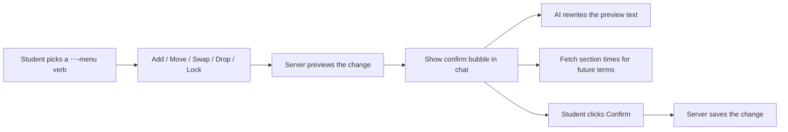
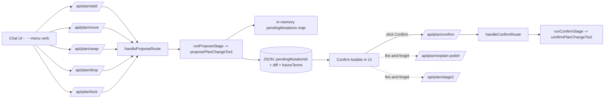
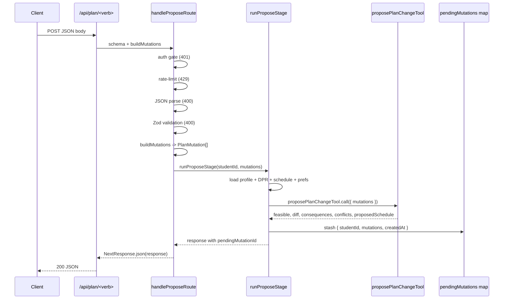
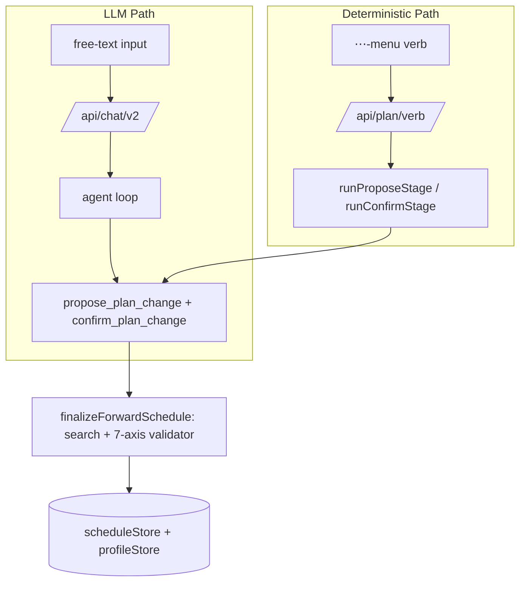

# Plan Action Routes — Deterministic Plan Mutation API

> Last verified against code: 2026-06-19 (Plans 35/36/37 — `/api/plan/whatif` now validates input (D-7/D-4); `/api/plan/add` returns 422 on unknown course; `/api/plan/confirm` returns 422 on infeasible regardless of `force`; `/api/plan/drop` releases matching pin; what-if route added; error-mapping updated). Prior: 2026-06-16 (Phase 4 E3: never-instant preview/review card; drag removed); 2026-06-10 (post planning-engine rebuild, PRs #35-#41).

> **Phase 4 E3 — the routes are UNCHANGED; the edit GESTURE and the edit SURFACE changed (both client-side).** The `/api/plan/*` routes stayed propose-only through the E3 group — propose stages a `pendingMutationId` + a non-persisted validated schedule, confirm applies. Two things changed in the browser only: (1) **drag-to-move/exchange was removed ENTIRELY** — the per-course ⋯ menu (Swap / Drop / Lock / Move) + the `+ Add course` input are now the sole edit inputs, which **supersedes the Phase-17 instant-move / drag-grid** description in this doc (the §7 "drag should feel instant" framing below is historical); and (2) every ⋯ verb now PROPOSES and the staged proposal is reconciled into a canvas **preview + review card** (or a RED invalid card on `feasible:false`) — applying only on Confirm. That reconciliation is entirely client-side; see [ui-components.md](./ui-components.md) and [chat-ui-client.md](./chat-ui-client.md). The route contracts, schemas, two-stage handshake, and error mapping in the sections below are unaffected.

## Purpose

These are the endpoints behind the sidebar's clickable buttons — Add, Move, Swap, Drop, Lock, Confirm. When the student opens a course's ⋯ menu and picks "Move," or clicks "Lock this course in place," the request lands here instead of going through the AI. That's intentional: there's nothing for the AI to interpret about an unambiguous gesture, and skipping the model keeps it fast and token-free. Each action runs in two steps: first the server checks if the change is valid and returns a preview (without saving anything), then the student clicks "Confirm" and a second call actually commits the change. (Phase 4 E3 removed the drag gesture — the ⋯ menu is now the sole edit input — and made the preview *visible* on the canvas before Confirm; the routes themselves are unchanged.) Two extra endpoints sweeten the experience: one rewrites the dry preview into friendly prose using a small AI call, and another fetches available section times for upcoming terms. Skipping the AI keeps things fast, predictable, and free of token cost.

---

## 1. Overview

The plan-action routes form a deterministic, non-LLM HTTP layer under `/api/plan/*` that the chat UI calls when a student interacts with direct affordances (open a slot's ⋯ menu and pick Move / Swap / Drop / Lock, or type into `+ Add course`). These routes do **not** invoke the agent loop or any model — they are pure plumbing from a UI gesture, through input validation, into the engine's `proposePlanChangeTool` and `confirmPlanChangeTool`, and back as a typed JSON response.

The architecture splits each mutation into a strict two-stage handshake:

- **Stage 1 — Propose.** Five "verb" routes (`add`, `move`, `swap`, `drop`, `lock`) construct a canonical `PlanMutation[]` from the request body, run it through the engine's structural validator without persisting anything, and return a freshly minted `pendingMutationId`. A sixth route `/api/plan/whatif` proposes a current-term IP-course what-if assumption (Plan 35 G3.1 — see §2.10). The orchestrator stashes the staged mutations (or assumption) in the durable pending-mutation store.
- **Stage 2 — Confirm.** `/api/plan/confirm` looks up the staged entry by `pendingMutationId` and applies it atomically. **M1 (Plan 37): an infeasible re-solve is refused with HTTP 422 — nothing is persisted and the prior valid plan survives.** The `force` parameter is accepted but inert.

Two auxiliary routes wrap the bubble UX: `/api/plan/explain-polish` streams an LLM rewrite of the deterministic explanation text, and `/api/plan/stage2` streams per-term FOSE section enrichments.

All routes run on the Node.js runtime (each file declares `runtime = "nodejs"`). All routes share the same auth contract (cookie-based session) and the same daily rate-limit bucket — except `explain-polish` and `stage2`, which use dedicated buckets.

## 2. Per-Route Documentation

### 2.1 `/api/plan/add` — Pin a course to a term

**Source:** `apps/web/app/api/plan/add/route.ts`

**Request body:**
- `courseId` — string (required, min length 1)
- `term` — string (required, min length 1)

**What it does:** Constructs a single-element mutation array containing one `pin` mutation with `freeze: true`. This semantic encodes that the student is expressing an explicit preference: the placement stays sticky until they explicitly unlock it through `/api/plan/lock` with `locked: false`. Delegates to `handleProposeRoute` (`apps/web/lib/planActionRouteHelpers.ts`).

**E3 (Plan 37) — course-existence check:** Before delegating to `handleProposeRoute`, the route clones the request and peeks at `body.courseId`. If the course is NOT found in the NYU undergraduate planning catalog (`courseExists(body.courseId)` returns false), the route immediately returns HTTP **422** with `{ message: "I couldn't find <courseId> in the NYU course catalog — check the course number, or ask me to search by name." }`. This check runs on a clone so the original request body stream is intact for the downstream `handleProposeRoute` auth + rate-limit + parse pipeline. A malformed / unreadable body at this peek step falls through silently (the downstream pipeline surfaces the 400 as normal).

**Response shape (200):** `PlanActionResponse` — see Section 4.

**Error cases:**
- 401 — no session cookie
- 422 — courseId not found in the NYU undergraduate catalog (E3)
- 429 — daily plan-action quota exhausted (60/day per student)
- 400 — malformed JSON body or schema validation failure
- 409 — student has no persisted profile, no parsed DPR, or no plan to mutate
- 500 — engine threw inside the tool call

---

### 2.2 `/api/plan/move` — Atomic relocate between terms

**Source:** `apps/web/app/api/plan/move/route.ts:40-62`

**Request body:**
- `courseId` — string (required)
- `fromTerm` — string (required)
- `toTerm` — string (required)

**What it does:** When `fromTerm === toTerm`, returns an empty mutation list (which the shared helper rejects with 400 — see Section 3). For a genuine move, emits a two-mutation batch:

1. A `move` mutation describing the from→to relocation (writes the from-term exclusion).
2. A `pin` mutation on the destination term with `freeze: true` (writes the to-term placement).

The second mutation is load-bearing: the solver's exclusion set is term-agnostic, so without an explicit pin on `toTerm` the moved course would simply vanish rather than land in the new term. Delegates to `handleProposeRoute`.

**Response shape (200):** `PlanActionResponse`.

**Error cases:** Same as `/api/plan/add` plus 400 for the no-op `fromTerm === toTerm` case (surfaced by the helper's "empty mutation list" check at `apps/web/lib/planActionRouteHelpers.ts:160-162`).

---

### 2.3 `/api/plan/swap` — Replace one course with another

**Source:** `apps/web/app/api/plan/swap/route.ts:49-61`

**Request body — discriminated union:**

*Single-term swap* (`apps/web/app/api/plan/swap/route.ts:31-35`):
- `drop` — string (required)
- `add` — string (required)
- `term` — string (required)

*Cross-term batch* (`apps/web/app/api/plan/swap/route.ts:37-44`):
- `exchanges` — non-empty array of `{ aCourseId, aTerm, bCourseId, bTerm }`

Both schemas are declared `.strict()` so a body that mixes both shapes fails the union match cleanly.

**What it does:**
- Single-term branch: emits one `swap` mutation with `{ drop, add, term }`.
- Exchange branch: for each exchange, emits two `swap` mutations — one placing `bCourseId` in `aTerm` (dropping `aCourseId`) and one placing `aCourseId` in `bTerm` (dropping `bCourseId`).

Delegates to `handleProposeRoute`.

**Response shape (200):** `PlanActionResponse`.

**Error cases:** Same shared set as `/api/plan/add`.

---

### 2.4 `/api/plan/drop` — Exclude a course

**Source:** `apps/web/app/api/plan/drop/route.ts`

**Request body:**
- `courseId` — string (required)
- `term` — string (optional)

**What it does:** Emits a single `exclude` mutation. When `term` is provided, the exclusion is scoped to that term only; when absent, the exclusion is global (the engine's `SchedulePreferences.exclusions[]` entry has `term: undefined`). Delegates to `handleProposeRoute`.

**Pin-release (Plan 37):** Inside `applyMutationsToPreferences` (`packages/engine/src/agent/forwardSchedule/planChangeHelpers.ts`), an `exclude` mutation now also **removes any matching pin** from `prefs.pins[]` before adding to `exclusions[]`. A term-scoped exclude removes only the pin for that `(courseId, term)` pair; a global exclude removes ALL pins for that `courseId`. Without this, a course that was bound (added via a `pin` mutation) and then dropped would silently re-appear because the lingering pin would win over the exclusion. This fix is in the engine's helpers layer — the route itself is unchanged.

**Response shape (200):** `PlanActionResponse`.

**Error cases:** Same shared set as `/api/plan/add` (but no 422 course-existence check — the existence check lives only on `/api/plan/add`).

---

### 2.5 `/api/plan/lock` — Toggle solver freeze on a slot

**Source:** `apps/web/app/api/plan/lock/route.ts:31-49`

**Request body:**
- `courseId` — string (required)
- `term` — string (required)
- `locked` — boolean (required)

**What it does:**
- `locked: true` → emits a `pin` mutation with `freeze: true`. The slot is written into `SchedulePreferences.pins[]`; the solver respects this on every subsequent re-plan.
- `locked: false` → emits an `unpin` mutation. The matching pin entry is removed; the slot becomes solver-eligible again.

Delegates to `handleProposeRoute`.

**Response shape (200):** `PlanActionResponse`.

**Error cases:** Same shared set as `/api/plan/add`.

---

### 2.6 `/api/plan/confirm` — Apply a staged mutation

**Source:** `apps/web/app/api/plan/confirm/route.ts`

**Request body:**
- `pendingMutationId` — UUID string (required)
- `force` — boolean (optional, **DEPRECATED / INERT** since M1/M2, Plan 37)

**What it does:** Delegates to `handleConfirmRoute` (`apps/web/lib/planActionRouteHelpers.ts`), which:

1. Runs preflight (auth + rate-limit + JSON parse).
2. Looks up and consumes the staged mutation via `runConfirmStage` (I3 — consume-once via `pendingMutationStore.take`).
3. For a **plan-change** entry: applies via `confirmPlanChangeTool` — routes through the engine's `runGraduationPathValidator` via `finalizeForwardSchedule` (the frozen 7-axis + 8th P/F-limit axis gate). If `feasible: false`, **returns HTTP 422** with the failing-axis explanation; nothing is persisted.
4. For a **what-if assumption** entry (Plan 35 G3.1): re-applies the DPR transform + re-solves via `solveWhatIfAssumption`. If `feasible: false`, **returns HTTP 422** (C1 fix). On success, persists ONLY the resulting `forward_schedule` — **never** `students.parsed_dpr` (R1 guardrail).

**M1 (Plan 37) — `force` is INERT.** The schema still accepts `force: boolean` for back-compat, but the confirm path ignores it entirely. An infeasible re-solve returns HTTP 422 regardless of `force`. The Phase-17 "force → `student-preferred-invalid-draft`" reclassification has been removed. No UI path sends `force: true` after M2.

**I3 (Plan 37) — consume-once.** A successful confirm removes the staging entry. A second confirm of the same `pendingMutationId` returns 404 "expired or already confirmed" (benign no-op).

**Response shape (200):** `PlanConfirmResponse` — see Section 4. Note the response carries the resulting `forwardSchedule` but **no updated preferences** — see the Known limitations note in Section 4.

**Error cases:**
- 401 — no session
- 429 — quota exhausted
- 400 — malformed body / not a valid UUID
- 404 — `unknown_mutation_id` (staging entry expired after 10 minutes or already consumed / double-clicked)
- 403 — `studentId_mismatch` (the staging entry was minted for a different student)
- 409 — `no_profile` / `no_dpr` / `no_schedule`
- **422** — `infeasible` (M1): the re-solved plan is infeasible; the prior committed plan is untouched
- 500 — `engine_error`

---

### 2.7 `/api/plan/lock` (variant — see 2.5 above)

(No additional route; `lock` is documented in 2.5.)

---

### 2.10 `/api/plan/whatif` — Propose a current-term what-if assumption (Plan 35 G3.1)

**Source:** `apps/web/app/api/plan/whatif/route.ts`

**Request body:**
- `courseId` — string (required)
- `outcome` — `"withdraw" | "pass" | "fail"` (required)

**What it does:** Proposes a Branch-B what-if assumption on a course the student's current DPR already shows in-progress (IP). Delegates to `handleProposeWhatIfRoute` → `runProposeWhatIfStage` in the orchestrator. The orchestrator:

1. Loads the session state (profile + authoritative DPR + latest schedule).
2. **Runs `proposeWhatIfAssumptionTool.validateInput` BEFORE `.call`** (guard-bypass fix, Plan 37). This enforces:
   - **D-7 IP-membership guard:** the `courseId` must appear as an in-progress enrollment in the authoritative DPR. Non-IP or absent courses are rejected with 400 `bad_input`.
   - **D-4 P/F-eligibility gate:** `"pass"` and `"fail"` outcomes are rejected when the student's school has `canElect: false` (e.g. Tandon). `"withdraw"` is always allowed. Rejection → 400 `bad_input` with the user-facing message.
   - **DPR-presence guard:** requires `session.degreeProgressReport` to be loaded.
3. Calls `proposeWhatIfAssumptionTool.call` — builds a synthetic in-memory DPR via the matching transform (`applyWithdrawalToDpr` / `applyPassFailToDpr`), re-solves through the frozen pipeline, returns the proposed (un-persisted) plan + a `whatIfAssumption` marker.
4. Mints a `pendingMutationId` and stages the assumption in the shared `pending_mutations` store. The follow-up `/api/plan/confirm` re-applies the transform at confirm time and persists ONLY the resulting `forward_schedule` — **never** `students.parsed_dpr` (R1 guardrail).

**Response shape (200):** `WhatIfAssumptionResponse` — a superset of `PlanActionResponse` that adds `whatIfAssumption: WhatIfAssumptionMarker` (the label + hedges + optional `windowCaveat` the review card / canvas badge uses).

**This route is CONFIRMABLE** (Branch-B — owner decision, Plan 37): the `pendingMutationId` can be passed to `/api/plan/confirm`. Contrast with Branch-A (program-change What-If audit upload via `/api/whatif-audit`) which is read-only / never confirmable.

**Error cases:**
- 401 — no session
- 429 — daily plan-action quota exhausted (shared `plan-action:<studentId>` bucket)
- 400 — malformed body / invalid outcome enum / `bad_input` from `validateInput` (D-7 IP-membership or D-4 P/F-eligibility rejection, with the student-facing message in the body)
- 409 — `no_profile` / `no_dpr` / `no_schedule`
- 500 — `engine_error`

---

### 2.8 `/api/plan/explain-polish` — Stream an LLM rewrite of the explanation

**Source:** `apps/web/app/api/plan/explain-polish/route.ts:79-204`

**Request body:**
- `slotKey` — string (required, 1-200 chars). The bubble's stable identifier; echoed verbatim into every SSE event so the client can route polish chunks to the correct bubble in a multi-bubble UI.
- `templateText` — string (required, 1-4000 chars). The deterministic explanation produced by the propose stage; passed verbatim into the model.
- `structuredDiff` — optional unknown JSON. When provided, serialized and trimmed to 2000 chars then included as disambiguation context for the model.

**What it does:**

1. Auth gate (`apps/web/app/api/plan/explain-polish/route.ts:81-87`).
2. Per-day rate limit on a dedicated bucket `plan-polish:<studentId>` with a cap of 200 (`apps/web/app/api/plan/explain-polish/route.ts:93-107`).
3. Feature gate: if neither `NEXT_PUBLIC_PLAN_CHANGE_LLM_POLISH` nor `PLAN_CHANGE_LLM_POLISH` equals `"1"`, returns 204 with empty body (`apps/web/app/api/plan/explain-polish/route.ts:112-116`).
4. Parses and validates the body.
5. Requires `ANTHROPIC_API_KEY`; returns 503 if missing (`apps/web/app/api/plan/explain-polish/route.ts:138-144`).
6. Calls Anthropic `messages.stream` with the locked polish system prompt (constants from `lib/llmPolishPrompt`).
7. Returns a streaming `Response` (Content-Type `text/event-stream`).

**Response (200) — Server-Sent Events.** Three event kinds, each carrying the original `slotKey`:

- `plan_action_explanation_polish_chunk` — payload `{ slotKey, deltaText }`, emitted per token delta from the model.
- `plan_action_explanation_polish_done` — payload `{ slotKey, polishedText }`, emitted once with the final accumulated text after the stream closes.
- `plan_action_explanation_polish_error` — payload `{ slotKey, message }`, emitted if the Anthropic call throws mid-stream.

**Error cases:**
- 401 — no session
- 429 — polish quota exhausted
- 204 — polish disabled by env
- 400 — invalid JSON or schema failure
- 503 — `ANTHROPIC_API_KEY` missing

---

### 2.9 `/api/plan/stage2` — Stream FOSE section enrichments per future term

**Source:** `apps/web/app/api/plan/stage2/route.ts:130-292`

**Request body:**
- `slotKey` — string (required, 1-200 chars). Bubble identifier.
- `futureTerms` — array of solver-format term strings (e.g. `"2026-fall"`), 1-8 entries, each 1-50 chars.

**What it does:**

1. Auth gate.
2. Rate-limit on dedicated bucket `plan-stage2:<studentId>`, cap 200/day.
3. Parses and validates body.
4. Loads the student's latest persisted schedule and scheduling preferences (best-effort — failures fall through to per-term unavailable signals).
5. For each term in `futureTerms`:
   - Extracts the `specific_planned` slot `courseId`s from the schedule.
   - If no schedule loaded → emits an `unavailable` enrichment event.
   - If no concrete courses in that term → emits a `warn` event.
   - Otherwise calls `materializeSections` (engine) with the term code, course ids, a no-op swap hook, and the loaded preferences. The result is classified by `classifyMaterialization` (`apps/web/app/api/plan/stage2/route.ts:80-108`) into `ok` / `warn` / `unavailable`.
6. After every term emits, sends a single `plan_action_stage2_done` event and closes the stream.

**Response (200) — Server-Sent Events.** Two event kinds:

- `plan_action_stage2_enrichment` — payload `{ slotKey, term, status, message }` where status is one of `pending` | `ok` | `warn` | `unavailable`. The message format starts with `[<term>]` so the bubble reducer can key per-term entries from the substring.
- `plan_action_stage2_done` — payload `{ slotKey }`, terminator.

Stage 2 is best-effort: a FOSE failure for one term produces an `unavailable` enrichment, never a 5xx that would block the bubble's Confirm button.

**Error cases:**
- 401 — no session
- 429 — stage2 quota exhausted
- 400 — invalid JSON or schema failure

---

## 3. The `planActionRouteHelpers` Utility Module

**Source:** `apps/web/lib/planActionRouteHelpers.ts`

The helper module centralizes the boilerplate that every per-verb route would otherwise duplicate. It exports two main entry points:

### 3.1 `preflight` (internal — `apps/web/lib/planActionRouteHelpers.ts:46-96`)

Runs the gates every plan-action route needs, in order:

1. **Auth.** `readSessionFromRequest(req)` resolves the session from cookies. Missing session → 401 `{ error: "Unauthorized" }`.
2. **Rate-limit.** `consumeRequest("plan-action:<studentId>", PLAN_ACTION_LIMIT_PER_DAY)` debits one unit from the per-student per-day bucket. The cap is 60 (`apps/web/lib/planActionRouteHelpers.ts:35`). On exhaustion, returns 429 with `Retry-After`, `X-RateLimit-Limit`, `X-RateLimit-Remaining`, and `X-RateLimit-Reset` headers.
3. **JSON parse.** Attempts `req.json()`. Malformed JSON → 400 with the underlying parse error in the body.

On success, returns `{ ok: true, studentId, body }`. The studentId is extracted from `auth.sub`.

### 3.2 `handleProposeRoute<T>` (`apps/web/lib/planActionRouteHelpers.ts:141-168`)

Each propose verb (`add`, `move`, `swap`, `drop`, `lock`) calls this with three arguments: the request, a Zod schema for the body, and a `buildMutations` callback that lifts the validated input to a `PlanMutation[]`.

Flow:
1. Run `preflight`. Early-return its response on any 4xx/5xx.
2. Validate the body via `schema.parse`. On failure, format Zod issues via `formatZodIssues` (`apps/web/lib/planActionRouteHelpers.ts:127-134`) and return 400.
3. Call `buildMutations(parsed)`. If the resulting array is empty, return 400 `"Empty mutation list — nothing to propose."` (this is how `/api/plan/move` surfaces the no-op same-term case).
4. Call `runProposeStage(studentId, mutations)` from the orchestrator.
5. On orchestrator failure, map the typed error to an HTTP status via `mapProposeError`.
6. On success, return 200 JSON with the orchestrator's response.

### 3.3 `handleConfirmRoute` (`apps/web/lib/planActionRouteHelpers.ts:176-201`)

Used only by `/api/plan/confirm`. Same preflight as propose, then:

1. Validate the body against the schema (expects `{ pendingMutationId, force? }`).
2. Call `runConfirmStage(studentId, pendingMutationId, { force })`.
3. On orchestrator failure, map via `mapConfirmError`.
4. On success, return 200 JSON.

### 3.4 Error mapping

| Error kind | HTTP | Meaning |
|---|---|---|
| `no_profile` | 409 | Student has no persisted profile row |
| `no_dpr` | 409 | No parsed DPR available |
| `no_schedule` | 409 | No forward plan exists yet |
| `bad_input` | 400 | Validation rejected the input (D-7 IP-membership / D-4 P/F-eligibility on `/whatif`; used by `validateInput` guard) |
| `engine_error` | 500 | The engine tool threw |
| `unknown_mutation_id` | 404 | Confirm-only: staging entry expired or missing (incl. already consumed — I3) |
| `studentId_mismatch` | 403 | Confirm-only: cross-tenant id attempt |
| `infeasible` | **422** | Confirm-only (M1, Plan 37): re-solved plan is infeasible; nothing persisted; prior valid plan survives |

Source: `apps/web/lib/planActionRouteHelpers.ts` (`mapProposeError` + `mapConfirmError`).

### 3.5 Test-only exports

`_PLAN_ACTION_LIMIT_PER_DAY_FOR_TESTS` and `_RATE_BUCKET_PREFIX_FOR_TESTS` are re-exported for the route test suites (`apps/web/lib/planActionRouteHelpers.ts:204-205`).

## 4. Common Patterns

All five propose routes follow the same six-step pattern:

### 4.1 The `PlanActionResponse` shape

Returned by every propose route (source: `apps/web/lib/planActionOrchestrator.ts:77-86`). Pseudo-shape:

- `feasible` — boolean from the engine.
- `diff` — engine's diff summary.
- `consequences` — engine-emitted list of side effects.
- `conflicts` — optional list of solver-tagged conflicts (present on infeasible outcomes).
- `planDiff` — optional structured `PlanDiff`.
- `explanation` — deterministic template explanation string.
- `pendingMutationId` — UUID for the staged mutation (to be passed back to `/api/plan/confirm`).
- `futureTerms` — chronologically-sorted array of solver-format term strings that fall within the FOSE data window (~6 months ahead). The client uses this to drive `/api/plan/stage2` fan-out.
- `forwardSchedule` — optional. The proposed (non-persisted, preview-only) `ForwardSchedule` the apply would produce.

### 4.2 The `PlanConfirmResponse` shape

Returned by `/api/plan/confirm` **only on HTTP 200** (an infeasible result returns HTTP 422, not a 200 with `feasible: false`). Source: `apps/web/lib/planActionOrchestrator.ts`.

- `feasible`, `diff`, `consequences`, `conflicts`, `planDiff` — same as above. `feasible` is always `true` on a 200 response (M1 guarantee).
- `storedIn` — discriminated string: `"forwardSchedule"` or `"studentDraftPlan"`. For a plan-change confirm this reflects the engine's Decision #32 slot; for a what-if assumption confirm it is always `"forwardSchedule"` (a feasible what-if always commits to the forward slot).
- `forwardSchedule` — the persisted schedule (in either slot).
- `consumedMutationId` — the UUID just consumed; no longer resolvable in the staging map.
- `whatIfAssumption?` — present only when this confirm applied a what-if assumption (Plan 35 G3.1), so the UI can label the now-committed plan "assumes you withdrew / P-F'd X".

> **Known limitation — stale Lock/Unlock labels.** `PlanConfirmResponse` does **not** carry an updated `SchedulePreferences`. After a `lock`/`unlock` confirm mutates `pins[]` server-side, the client's confirm handler only calls `setForwardSchedule(...)` — it never refreshes the `schedulePreferences` state that drives the Lock/Unlock popover label. The label only re-syncs on a full reload via `/api/session/restore`. This is a known UI bug, not intended behavior.

### 4.3 Per-route concerns shared by the verbs

- **Runtime.** Each route declares `export const runtime = "nodejs"` — required because the engine relies on Node-only APIs (`crypto.randomUUID`, filesystem reads for the bundled catalog).
- **Auth.** Cookie-based session via `readSessionFromRequest`; the studentId is the JWT `sub`.
- **Rate-limit bucket.** Five propose verbs + confirm share `plan-action:<studentId>` (60/day). Polish uses `plan-polish:<studentId>` (200/day). Stage2 uses `plan-stage2:<studentId>` (200/day). Separation prevents a click flurry from draining the chat quota.
- **Body validation.** Zod schemas declared in the route file. `swap` uses `.strict()` on both arms of the union so a body containing fields from both arms fails.
- **Cross-tenant safety.** The confirm route checks that the staged mutation's stored `studentId` equals the requesting student's `sub` — a guessed UUID from another student returns 403, not 404.
- **Single-use.** A successful confirm deletes the staging entry; double-clicking returns 404.

### 4.4 Why these complement `/api/chat/v2`

`/api/chat/v2` is the LLM-driven path: free-text input, the agent loop runs, the model decides which tools to call. The agent can itself invoke `propose_plan_change` and `confirm_plan_change` mid-conversation.

The plan-action routes bypass the agent loop entirely. They are the deterministic counterpart, designed for student-initiated UI gestures where:

- **Latency matters.** A ⋯-menu Move/Swap should feel responsive. The agent loop adds at minimum one model round-trip; the plan-action routes hit the engine directly in ~180-600ms. (Phase 4 E3: the propose is fast, but the *commit* is now a deliberate Confirm on the canvas review card — "never instant" is intentional, not a latency regression.)
- **No ambiguity exists.** A "move CSCI-UA 101 from term A to term B" verb has a single, unambiguous `PlanMutation[]` encoding. There is nothing for the LLM to interpret.
- **Token budget is precious.** Every edit should not cost Anthropic credits. The propose stage costs zero tokens. The polish call is optional, env-gated, and uses Anthropic Haiku (`claude-haiku-4-5-20251001`, pinned in `apps/web/lib/llmPolishPrompt.ts:96`) with a strict rewrite-only prompt; the engine output is the source of truth. (This Haiku polish model is independent of the agent loop's default primary model, `claude-sonnet-4-6`.)
- **Side-by-side bubble UX.** The agent loop emits chat turns. The plan-action routes emit a structured `pendingMutationId` plus a deterministic template that the UI surfaces as a confirm-bubble — clearly distinct from a model reply.

The two paths share the engine's two tools (`proposePlanChangeTool`, `confirmPlanChangeTool` — both still live in the registry at `packages/engine/src/agent/registry.ts`), so the validation semantics, the conflict-kind taxonomy, and the persisted state model are identical. Both tools route the post-mutation schedule through `finalizeForwardSchedule`, which runs the feasibility-first backtracking search (`findFirstValidPlan` → `localImprove` → `materializePlan`) and the authoritative 7-axis `runGraduationPathValidator` — the legacy greedy solver was removed in the Phase 0-2 rebuild (PRs #35-#41). The plan-action routes simply skip the agent shell and call the tools directly, in a fresh `ToolSession` rebuilt from the persistence stores.

