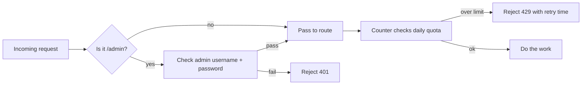
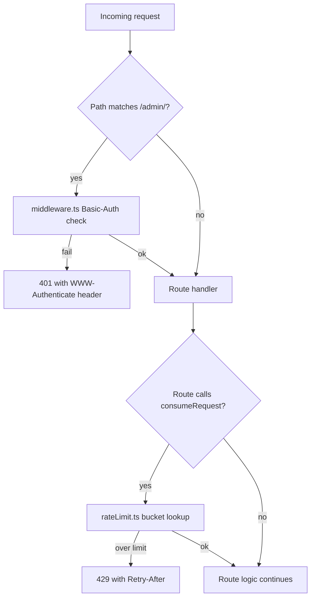
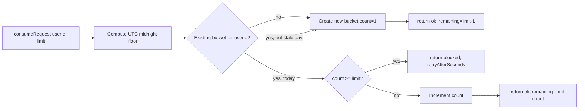

# Rate Limit and Middleware

> Last verified against code: 2026-06-10 (post planning-engine rebuild, PRs #35-#41).

## TL;DR

Two pieces of background plumbing protect the app from abuse. The first is a simple daily counter that caps how many questions a student (or an unauthenticated visitor) can fire at the server in a 24-hour window — say, 30 chat messages, 60 sidebar clicks, 5 login attempts from one IP. Each route picks its own cap and key, so a flood of login attempts doesn't burn the chat allowance. The second is a gatekeeper that sits in front of the operator-only admin dashboard, asking for a username and password before letting anyone in. Together they keep the system polite to honest users and unfriendly to bad actors, without getting in the way of normal usage.



---

This document describes the two infrastructure pieces that wrap most other web routes: the daily rate-limiter in `apps/web/lib/rateLimit.ts` and the global Next.js middleware in `apps/web/middleware.ts`.



## 1. Rate limit (`lib/rateLimit.ts`)

**File:** `apps/web/lib/rateLimit.ts`

### Algorithm

Fixed-window counter, NOT a sliding window or token bucket. Each bucket holds `{ count, windowStart }` where `windowStart` is the most recent UTC-midnight epoch ms (`apps/web/lib/rateLimit.ts:22-26`). A request "consumes" one slot by incrementing `count`; once `count >= limit` further consumes return blocked until the next UTC midnight rollover.

Concretely (`consumeRequest` at `apps/web/lib/rateLimit.ts:63-97`):

1. Compute `winStart = utcMidnightFloor(Date.now())` and `winEnd = winStart + 24*60*60*1000`.
2. Look up the bucket for the given key.
3. **Cold path:** if no bucket exists OR `existing.windowStart < winStart` (yesterday's bucket), write a fresh `{ count: 1, windowStart: winStart }` and return ok with `remaining = limit - 1`.
4. **At cap:** if `existing.count >= limit`, return blocked with `retryAfterSeconds = ceil((winEnd - now) / 1000)`.
5. **Hot path:** increment `existing.count`, return ok with `remaining = limit - existing.count`.

The bucket is mutated in place — Map identity is preserved.

`utcMidnightFloor(t)` (`apps/web/lib/rateLimit.ts:49-52`) takes a millisecond epoch and returns the UTC midnight of that day via `Date.UTC(year, month, date)`.



### Per-IP vs per-student bucketing

The rate-limit module itself is agnostic about what `userId` means — it's just a Map key. Callers choose the bucketing strategy:

| Route                              | Key shape                                                | Limit |
|------------------------------------|----------------------------------------------------------|-------|
| `/api/auth/otp/issue`              | `otp-ip:<first hop of X-Forwarded-For or X-Real-IP>`     | 5/day |
| `/api/onboard`                     | `onboard-ip:<first hop of X-Forwarded-For or X-Real-IP>` | 10/day |
| `/api/onboard/refresh-dpr`         | `refresh-dpr:<studentId from JWT sub>`                   | 10/day |
| Chat route (default `DEFAULT_LIMIT`) | (caller passes a studentId or `"anonymous"`)            | 30/day |

The `DEFAULT_LIMIT = 30` constant (`apps/web/lib/rateLimit.ts:19`) is only used when callers omit the second argument. The OTP issue and onboard routes pass their own smaller caps explicitly.

The auth and onboard routes derive the IP themselves — neither uses a shared helper — by reading `X-Forwarded-For` (taking the first comma-separated entry, trimmed), falling back to `X-Real-IP`, falling back to the literal string `"anonymous"`. Each route prefixes its key with a route-specific namespace (`otp-ip:`, `onboard-ip:`, `refresh-dpr:`) so the same IP can hit different routes without sharing counters.

### Storage

A module-level `Map<string, Bucket>` (`apps/web/lib/rateLimit.ts:28`). Single-process, in-memory. This is the ONLY backing store — there is no Postgres or Redis path. Even on a deployment where Postgres is provisioned (it backs the OTP table, sessions, schedules, etc.), the rate limiter still uses this in-process Map and ignores the database entirely. Several consequences:

- **Restart wipes state.** On a server restart, every bucket disappears, and every quota resets to zero. The header comment frames this as acceptable for cohort A where the server runs continuously and a restart would lose at most ~30 counts for ~10 active users. In practice a restart is a free reset of every limit on this page.
- **No coordination across instances.** A multi-instance deployment would let a flood land 5 OTP issues per instance per IP, not 5 globally. The header comment flags this as deferred: it says that when "W12 + Postgres land" the storage should migrate to Redis or a Postgres counter, keeping the same `consume(userId)` shape. That migration has NOT happened — see [Known limitations](#known-limitations).
- **No eviction.** Buckets accumulate indefinitely; stale-day buckets aren't garbage-collected, just overwritten when their key is touched again. With ~10 active users in cohort A this is unbounded but small.

### Result shapes

`ConsumeOk` (`apps/web/lib/rateLimit.ts:30-36`):

```
{ ok: true, remaining, limit, resetAt: ISO string of UTC midnight }
```

`ConsumeBlocked` (`apps/web/lib/rateLimit.ts:38-44`):

```
{ ok: false, remaining: 0, limit, resetAt, retryAfterSeconds }
```

Callers map blocked responses to HTTP 429 with `Retry-After: <retryAfterSeconds>` (and, in the onboard routes, `X-RateLimit-Limit`, `X-RateLimit-Remaining: 0`, `X-RateLimit-Reset: <ISO>` for client visibility).

### Test affordance

`_clearBuckets()` (`apps/web/lib/rateLimit.ts:100-102`) — exported test-only escape hatch that calls `buckets.clear()`. The underscore prefix is the convention signaling "don't call this from production code".

### Anonymous users

The comment block at `apps/web/lib/rateLimit.ts:53-62` notes that `userId === "anonymous"` is bucketed globally, so any caller that passes the literal `"anonymous"` shares a single soft cap. In the live routes today this only happens when no IP header is present: the OTP-issue and onboard keys fall back to `otp-ip:anonymous` / `onboard-ip:anonymous` when both `X-Forwarded-For` and `X-Real-IP` are absent. The `refresh-dpr` route always has a real studentId (it is auth-gated), so it never buckets anonymously. The comment's framing — "once W12 lands and real userIds arrive, each student gets their own bucket" — describes a future state; for authenticated routes the studentId bucketing is already in place via `auth.sub`.

### What rateLimit.ts does NOT do

- No per-route configuration table. Each route calls `consumeRequest` with its own key and limit; there is no central declaration of "which routes have which caps."
- No leaky-bucket smoothing or token refill. A user who fires 30 requests in one second is rate-limited identically to one who paces them evenly across 24 hours.
- No second-level burst protection. The window is 24 hours and only 24 hours.
- No header injection — the caller is responsible for translating the `ConsumeBlocked` into a 429 response with `Retry-After`.

## 2. Middleware (`middleware.ts`)

**File:** `apps/web/middleware.ts`

This file's `config.matcher` (`apps/web/middleware.ts:24`) is set to `["/admin/:path*"]`. That single matcher means Next.js invokes this middleware ONLY for routes under `/admin/`. Every other route in the app — `/login`, `/chat`, `/api/auth/*`, `/api/onboard/*`, `/api/session/*`, the v2 chat route — bypasses the middleware entirely.

### What the middleware actually does

Gates the operator-only observability dashboard at `/admin/observability` (and any other future `/admin/*` route) with HTTP Basic Authentication.

### Env-var gate

`apps/web/middleware.ts:36-45`. Reads `OBSERVABILITY_USER` and `OBSERVABILITY_PASS`. If either is missing, returns HTTP 503 with body `"Observability dashboard auth not configured. Set OBSERVABILITY_USER and OBSERVABILITY_PASS in the deploy environment."` and `Content-Type: text/plain`. This is a fail-closed posture: an admin dashboard without configured auth cannot be served safely.

### Authorization header handling

`apps/web/middleware.ts:47-66`:

1. Read the `Authorization` header (defaulting to empty string).
2. If it doesn't start with `"basic "` (case-insensitive), return HTTP 401 with body `"Authentication required."` and `WWW-Authenticate: Basic realm="NYU Path Admin"`. The browser sees this and presents its native login dialog.
3. Slice off the `"Basic "` prefix, base64-decode the remainder. A throw during decode returns HTTP 400 `"Malformed authorization header."`.
4. Split the decoded payload on the first colon. No colon → HTTP 400 `"Malformed credentials."`.
5. Compare both halves to `OBSERVABILITY_USER` and `OBSERVABILITY_PASS` using `constantTimeEq`. If either fails, returns HTTP 401 `"Invalid credentials."` again with the `WWW-Authenticate` header so the browser re-prompts.
6. Both match → `NextResponse.next()` passes the request through to the route handler.

### Constant-time comparison

`constantTimeEq(a, b)` at `apps/web/middleware.ts:28-33`. Converts both strings to Buffers; bails out early only on length mismatch (lengths themselves are non-secret), and uses `crypto.timingSafeEqual` for the byte-wise comparison. This blocks the classic "compare prefix bytes" timing oracle on the password check.

### Runtime declaration

`config.runtime = "nodejs"` (`apps/web/middleware.ts:25`). Edge runtime can't use `node:crypto`'s `timingSafeEqual`, so the middleware forces Node.

### What the middleware does NOT do

Critically for understanding the app's auth posture:

- It does NOT touch the `nyupath_session` cookie. Session auth for `/login`, `/chat`, `/api/session/*`, `/api/onboard/refresh-dpr`, and the v2 chat route is enforced by each route handler calling `readSessionFromRequest` (from `apps/web/lib/auth/session.ts`), not by the middleware.
- It does NOT apply CORS headers. Same-origin requests from the Next.js app don't need them; cross-origin requests would simply fail without any middleware intervention.
- It does NOT call `consumeRequest`. The rate limiter is invoked by individual route handlers (OTP issue, onboard, refresh-dpr, the chat route), not by the middleware.
- It does NOT redirect unauthenticated visitors of `/chat` to `/login`. That gate lives in the `/chat` Server Component layout (`apps/web/app/chat/layout.tsx`), which calls `readSessionFromCookies()` and `redirect("/login")` when there is no valid session — see the [auth-routes doc, §8](./auth-routes.md#8-chat-route-gating).

### Why one middleware, two surfaces in this doc

The original instructions listed `middleware.ts` under both "auth-routes" and "rate-limit-and-middleware" contexts. The file plays a role in neither of those two themes in any deep way — it is purely the `/admin/*` Basic-Auth gate. Its presence in the auth-routes doc is for completeness (it's still authentication, just of a different surface); its presence here is to make explicit that the global middleware does NOT participate in rate-limiting. Rate-limit decisions live inside each route handler.

## 3. End-to-end interaction

A consolidated view of what wraps what:

| Wrapper                | Applies to                                       | Concern                                  |
|------------------------|--------------------------------------------------|------------------------------------------|
| `middleware.ts`         | `/admin/*` only                                  | Basic-Auth gate for the operator dash    |
| `consumeRequest` per IP | `/api/auth/otp/issue`, `/api/onboard`            | Pre-auth abuse guard                     |
| `consumeRequest` per student | `/api/onboard/refresh-dpr`, chat route       | Post-auth daily quota                    |
| `readSessionFromRequest` | `/api/session/clear`, `/api/session/restore`, `/api/onboard/refresh-dpr`, chat route | JWT cookie verification |

The rate limiter and the auth check are independent — neither calls the other, and a request can be rejected by either without ever reaching the route's business logic. The order is NOT uniform across routes, because the bucket key dictates it:

- **IP-keyed, pre-auth routes** (`/api/auth/otp/issue`, `/api/onboard`) run rate-limit FIRST, then parse the body. They have no session to read, and the IP-derived key needs no auth, so an unauthenticated flood is rejected before any work (`apps/web/app/api/auth/otp/issue/route.ts:32`).
- **Student-keyed, post-auth route** (`/api/onboard/refresh-dpr`) runs auth FIRST (`readSessionFromRequest`), then rate-limit, then parses the multipart body. It must derive `studentId = auth.sub` before it can build the `refresh-dpr:<studentId>` bucket key, so auth necessarily precedes the limiter (`apps/web/app/api/onboard/refresh-dpr/route.ts:51,59`). The rate-limit still runs before the body is read, so a flood of 10 MB PDFs can't allocate an `ArrayBuffer`.

## 4. Known limitations

- **Rate limiting is entirely in-process and resets on restart.** `lib/rateLimit.ts` is a single-process `Map` with no Postgres or Redis backing, even on deployments where Postgres is provisioned. Every server restart resets every quota to zero, and a multi-instance deployment would multiply each cap by the instance count (5 OTP issues per IP per instance, not 5 globally). The code's own comments describe migrating to Redis/Postgres "when W12 lands"; that has not happened.
- **IP-keyed limits are spoofable.** The OTP-issue and onboard buckets key on the first hop of the client-supplied `X-Forwarded-For` header (then `X-Real-IP`). Neither is validated against a trusted proxy, so a caller that sets a fresh `X-Forwarded-For` value per request gets a fresh 5/day (OTP) or 10/day (onboard) bucket each time. This is an abuse-signal speed bump, not a hard control.
- **Per-route caps are honest but small.** The live caps are: OTP issue 5/day per IP, onboard 10/day per IP, refresh-dpr 10/day per student. The `DEFAULT_LIMIT = 30` constant exists for callers that omit a limit; it is the documented chat-route default but is only applied wherever a caller invokes `consumeRequest` without a second argument.
- **Stale code comment in the observability page.** The header comment in `apps/web/app/admin/observability/page.tsx:17-19` still claims the dashboard runs with "no auth" and that an IP allow-list is a "TODO once W12 ships." That is stale: `apps/web/middleware.ts` already Basic-Auth gates every `/admin/*` route (constant-time credential compare, fail-closed 503 when `OBSERVABILITY_USER` / `OBSERVABILITY_PASS` are unset). The dashboard is not publicly reachable; only the comment is out of date.
