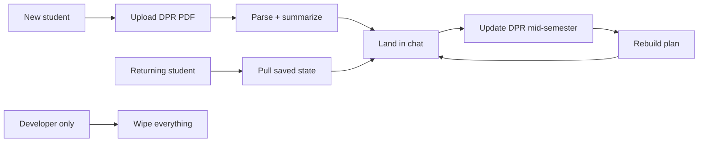

# Session and Onboarding Routes

> Last verified against code: 2026-06-13 (doc-sync pass: corrected the §Purpose hydration framing for P3.1 per-turn plan+prefs hydration + fixed the dead chat-route-sse.md §5.1 anchor).

## Purpose

These endpoints handle the "before and around" of the chat experience — getting a student set up, picking up where they left off, and updating their data when something changes. When a brand-new student lands on the chat page, they upload their degree progress report PDF, and the onboarding endpoint reads it, extracts the courses and programs, and hands back a structured summary. When a returning student reopens the page, the restore endpoint quietly fetches their saved profile, plan, preferences, and recent messages so the page can rehydrate the entire conversation — **this is the route that hydrates the persisted profile from Postgres** (the live chat turn also hydrates the persisted plan + preferences each turn since P3.1, but it rebuilds `StudentProfile` from the client-resent DPR rather than reading the stored profile back; see [chat-route-sse.md §5.1](chat-route-sse.md#51-per-turn-plan--prefs-hydration)). When the student gets a new degree report mid-semester (say, after registering for next term), they hit refresh and the system rebuilds their plan from scratch. There's also a test-only "wipe everything" endpoint, hidden behind an environment flag, used during development. A separate legacy `/api/chat` route still handles the pre-DPR onboarding chitchat state machine; it is covered in [§5](#5-legacy-apichat-onboarding-state-machine).



---

This document covers four endpoints that sit on either side of the chat experience: clearing a student's footprint, restoring it on page mount, performing the initial DPR-driven onboarding, and refreshing the DPR mid-stream.

```mermaid
flowchart TB
    A[Authenticated student lands on /chat] --> B[GET /api/session/restore]
    B -->|profile null| C[Onboarding sidebar opens]
    C -->|POST DPR pdf| D[/api/onboard]
    D -->|parsedData returned| E[Confirm to chat agent]
    E -->|agent persists profile+dpr| A
    A -->|Sidebar Update DPR| F[/api/onboard/refresh-dpr]
    F -->|new schedule| A
    A -->|Settings Clear my data| G[DELETE /api/session/clear]
    G -->|on test gate only| A
```

## 1. DELETE /api/session/clear

**File:** `apps/web/app/api/session/clear/route.ts:35`
**Runtime:** Node.js.
**HTTP method:** `DELETE` only.

### Gate

This route is intentionally hidden behind two layers:

1. Server env gate: `process.env.NEXT_PUBLIC_ENABLE_TEST_CLEAR !== "1"` returns HTTP 403 `{ error: "Forbidden" }` immediately (`apps/web/app/api/session/clear/route.ts:40-42`). The `NEXT_PUBLIC_` prefix means Next.js exposes the var to the client bundle, but the route re-reads it server-side so a hand-crafted POST in prod can't bypass it.
2. Auth gate: `readSessionFromRequest(req)` must return a valid session. Failure → HTTP 401 `{ error: "Unauthorized" }` (`apps/web/app/api/session/clear/route.ts:44-47`).

### Targeted studentId

The studentId is taken from the JWT `sub` claim (`apps/web/app/api/session/clear/route.ts:48`). A logged-in user can only clear their own rows.

### What gets wiped

If `getDb(env)` returns `null` (in-memory mode, no DB wired), the route calls `resetStoresForTests()` and returns 200 — the in-memory store bundle is dropped and re-initialized on the next request (`apps/web/app/api/session/clear/route.ts:50-57`).

With a real DB, all deletes run inside a single `db.transaction` so the wipe is atomic (`apps/web/app/api/session/clear/route.ts:63-95`). Deletions happen in this order:

1. `chat_messages WHERE studentId = $1`
2. `forward_schedules WHERE studentId = $1`
3. `schedule_preferences WHERE studentId = $1`
4. `audit_log WHERE studentId = $1`
5. `session_summaries WHERE studentId = $1`
6. `cohort_assignments WHERE userId = $1` — note this table keys on `userId` (which equals the JWT sub in this auth model), not `studentId`.
7. `students WHERE studentId = $1` — parent row last.

The first five tables also have `ON DELETE CASCADE` foreign keys to `students`, so dropping the parent alone would technically handle them — but the route deletes them explicitly first so the wipe stays legible and survives any future FK drift.

The cookie is NOT cleared by this route. A user who clears their data is still authenticated; the next request will simply rebuild a fresh `students` row on first write.

### Error handling

A failing transaction logs `[session/clear] transaction failed:` to the server console and returns HTTP 500 with the error message in the body (`apps/web/app/api/session/clear/route.ts:96-102`).

### Response

Success: HTTP 200 `{ ok: true }`.

## 2. GET /api/session/restore

**File:** `apps/web/app/api/session/restore/route.ts:35`
**Runtime:** Node.js.
**HTTP method:** `GET` only.

### Purpose

When a returning student lands on `/chat`, the page issues one `GET /api/session/restore` to pull everything needed to repaint the last conversation state: who they are, what their DPR says, the current forward schedule, their scheduling preferences, and the most recent chat messages.

### Auth

`readSessionFromRequest(req)` must succeed. Failure → HTTP 401 `{ error: "Unauthorized" }` (`apps/web/app/api/session/restore/route.ts:36-39`). The JWT `sub` becomes the studentId for every subsequent store read (`apps/web/app/api/session/restore/route.ts:40`).

### Stores read

The route calls `getStores(process.env)` and reads five separate slices, each in its own try/catch so a single failure does not blank the whole response (`apps/web/app/api/session/restore/route.ts:42-98`):

| Field                  | Source                                                | On error            |
|------------------------|-------------------------------------------------------|---------------------|
| `profile`              | `profileStore.get(studentId)`                          | logs, returns null  |
| `dpr`                  | `profileStore.getParsedDpr?.(studentId)` (optional)    | logs, returns null  |
| `forwardSchedule` OR `studentDraftPlan` | `scheduleStore.loadLatestSchedule(studentId)` | logs, both null |
| `schedulePreferences`  | `scheduleStore.loadPreferences(studentId)`             | logs, returns null  |
| `chatMessages`         | `chatHistoryStore.loadRecentMessages(studentId, N)`    | logs, returns `[]`  |

### Schedule slot routing (Decision #32)

The latest schedule row is routed into either `forwardSchedule` or `studentDraftPlan` based on its `state` (`apps/web/app/api/session/restore/route.ts:64-78`):

- `state === "infeasible-draft"` → goes into `studentDraftPlan`.
- `state === "student-preferred-invalid-draft"` → goes into `studentDraftPlan`.
- Anything else → goes into `forwardSchedule`.

This is the engine's discipline that the agent never endorses an illegal plan as the official forward schedule; an infeasible draft lives in a quarantine slot the UI can render differently.

### Chat-history limit

The number of messages restored defaults to 50 (`DEFAULT_RESTORE_LIMIT` at `apps/web/app/api/session/restore/route.ts:26`) and is configurable via `NYUPATH_CHAT_HISTORY_RESTORE_LIMIT`. The resolver parses it as a base-10 integer, defaulting to 50 if non-numeric or non-positive (`apps/web/app/api/session/restore/route.ts:28-33`). Messages come back in chronological order from `chatHistoryStore.loadRecentMessages`.

### Response shape

Always HTTP 200 (when authenticated):

```
{
  profile: StudentProfile | null,
  dpr: DegreeProgressReport | null,
  forwardSchedule: ForwardSchedule | null,
  studentDraftPlan: ForwardSchedule | null,
  schedulePreferences: SchedulePreferences | null,
  chatMessages: ChatMessageRecord[]
}
```

The page's logic (per the comment header) is:
- `profile === null` → fall through to onboarding.
- `profile !== null && dpr === null` → re-onboard (pre-Phase-16 legacy data).
- Otherwise → land the user back in the conversation.

## 3. POST /api/onboard

**File:** `apps/web/app/api/onboard/route.ts:40`
**Runtime:** default (no `runtime = "nodejs"` set, but `extractText` from `unpdf` is Node-only — the route depends on the Node runtime in practice).

This route is **DPR-only**: it accepts a single `dpr` PDF and parses it deterministically via the engine's `parseDpr` (no LLM). The legacy unofficial-transcript upload path — its `transcript` formData branch, the `handleTranscriptUpload` handler, the `gpt-4o-mini` `PARSE_SYSTEM_PROMPT` parser, the `TranscriptData` types, and the `OpenAI` import — has been removed.

### Auth

This route is NOT auth-gated. A student uploads their DPR before they have any persisted state, so there's no studentId to key off. The per-IP rate limit is the only abuse guard (see below).

### Per-IP daily rate limit

Bucket key: `onboard-ip:<first hop of X-Forwarded-For || X-Real-IP || "anonymous">` (`apps/web/app/api/onboard/route.ts:32-38`). Daily cap: 10 uploads per IP per UTC day (`ONBOARD_LIMIT_PER_DAY` at `apps/web/app/api/onboard/route.ts:30`).

Critically, the rate-limit check happens BEFORE `req.formData()` is invoked (`apps/web/app/api/onboard/route.ts:43-63`). This is deliberate: a flood of 10 MB PDFs would otherwise allocate ArrayBuffers before the guard could reject them. Over-limit responses include `Retry-After`, `X-RateLimit-Limit`, `X-RateLimit-Remaining: 0`, and `X-RateLimit-Reset` headers.

### Body shape

`multipart/form-data` with a single field:

- `dpr` — a PDF file. The only accepted artifact; the route parses the Albert Degree Progress Report deterministically (via `parseDpr`) without an LLM.

A missing `dpr` field → HTTP 400 with the message "Please upload your Albert Degree Progress Report as a PDF..." and `onboardingStep: "awaiting_dpr"` (`apps/web/app/api/onboard/route.ts:74-82`).

Any thrown exception in the handler returns HTTP 500 `{ message: "Something went wrong. Please try uploading again.", onboardingStep: "awaiting_dpr" }` (`apps/web/app/api/onboard/route.ts:83-92`).

### DPR path (`handleDprUpload`)

`apps/web/app/api/onboard/route.ts:99`:

1. **Extension check:** filename must end in `.pdf` (case-insensitive). Otherwise HTTP 400 with `awaiting_dpr` and the message about re-exporting from Albert via Print → Save as PDF.
2. **Size check:** `bytes.byteLength > 10 * 1024 * 1024` (10 MB hard cap) → HTTP 400 with the size echoed back in megabytes (`apps/web/app/api/onboard/route.ts:112-120`). The DPR is normally under 200 KB.
3. **Text extraction:** `unpdf.extractText(new Uint8Array(bytes), { mergePages: false })`. The result is an array of per-page text strings, joined with `\n`. `totalPages` is captured for the parser context (`apps/web/app/api/onboard/route.ts:126-140`). A throw here is reported back as "I couldn't read text out of that PDF..." with `awaiting_dpr`.
4. **Structured parse:** `parseDpr(rawText, { pageCount })` from `@nyupath/engine`. This is a deterministic, regex/heuristic parser — no LLM call. Failure (`!result.ok`) → HTTP 400 with the layout-recognition error message and the engine's `result.error` echoed in the body (`apps/web/app/api/onboard/route.ts:143-157`).
5. **Summary message:** `buildDprSummary(report, fileName, sizeMB)` (`apps/web/app/api/onboard/route.ts:170-214`) renders a Markdown-style block containing:
   - "Got it! I read your Degree Progress Report (**filename**, sizeMB MB)."
   - Student name, comma-joined programs as `label (programType)`.
   - Credits used out of credits required (or "credits not parsed").
   - Cumulative GPA to 3 decimals (or "GPA not parsed").
   - Pass/Fail used and outside-home credits (only when both halves of each pair are non-null).
   - Count of `status === "not_satisfied"` requirements (recursive walk over `requirementGroups`).
   - Closing question: "Does this look right? (**yes** / **no**)".
   - Any parser `_meta.warnings` are logged server-side with `console.warn` but NOT shown to the student.
6. **Response:** HTTP 200 with:
   - `message` — the summary string.
   - `onboardingStep: "confirming_data"`.
   - `parsedData: { kind: "dpr", report }` — the full parsed `DegreeProgressReport` so the chat session can adopt it as `session.degreeProgressReport` on the next message.

### Transcript path — removed

There is no longer a transcript upload path. The legacy `handleTranscriptUpload` handler, the `transcript` formData branch, the `gpt-4o-mini` LLM parser (`PARSE_SYSTEM_PROMPT`), the `TranscriptData` types, and the `OpenAI` import were all deleted in the DPR-only pivot. The DPR carries everything the transcript did (coursework, grades, in-progress, transfer/AP credit) plus declared programs and NYU's pre-computed audit, so the only accepted onboarding artifact is now the DPR (`handleDprUpload`). A student who can't access their DPR no longer has an in-app fallback.

### Onboarding step state machine

The route returns one of two `onboardingStep` values that the client uses to render the right UI:

- `awaiting_dpr` — initial (and the value returned on every error / rate-limit response); show the DPR upload prompt.
- `confirming_data` — parse succeeded; show "Does this look right?" and let the user confirm in chat.

## 4. POST /api/onboard/refresh-dpr

**File:** `apps/web/app/api/onboard/refresh-dpr/route.ts:50`
**Runtime:** Node.js.

### Purpose

The sidebar's "Update DPR" button posts here with a fresh DPR PDF. The route compares the new DPR's fingerprint against the fingerprint stored alongside the current `forward_schedule`; on no-change it short-circuits, on change it wipes the schedule, prunes now-stale pins, and runs `plan_forward_degree` programmatically. The new schedule is returned as JSON so the page can update without a full SSE round-trip.

### Auth

`readSessionFromRequest(req)` must succeed; otherwise HTTP 401 (`apps/web/app/api/onboard/refresh-dpr/route.ts:51-54`). The JWT `sub` becomes the studentId for every downstream operation.

### Per-student daily rate limit

Bucket key: `refresh-dpr:<studentId>`. Daily cap: 10 uploads (`apps/web/app/api/onboard/refresh-dpr/route.ts:34, 59`). Same shape as the `/api/onboard` rate-limit response (429 with `Retry-After`, `X-RateLimit-*` headers). Like `/api/onboard`, the check happens BEFORE `formData()` is touched.

Note the bucketing difference: `/api/onboard` keys on IP because there's no authenticated user yet; `/api/onboard/refresh-dpr` keys on studentId because by definition the caller is logged in.

### Request validation

`apps/web/app/api/onboard/refresh-dpr/route.ts:79-100`:

1. `req.formData()` — throw → HTTP 400 with `error: "Invalid multipart body: <message>"`.
2. `formData.get("dpr")` — must be a `File`. Missing → HTTP 400 `"Missing dpr file in multipart body."`.
3. Filename must end in `.pdf` → HTTP 400 `"DPR file must be a PDF."`.
4. Size must be ≤ 10 MB → HTTP 400 `"DPR PDF must be under 10 MB."`.

### Parse pipeline (matches `/api/onboard`)

`apps/web/app/api/onboard/refresh-dpr/route.ts:102-122`:

1. `unpdf.extractText` over the bytes; failure returns HTTP 400 with the extraction error.
2. `parseDpr(rawText, { pageCount })`; failure returns HTTP 400 with the parser error.
3. New parsed report becomes `newDpr`.

### Fingerprint short-circuit

`apps/web/app/api/onboard/refresh-dpr/route.ts:124-138`:

1. `computeDprFingerprint(newDpr)` → `newFingerprint` (string from `@nyupath/engine`).
2. `scheduleStore.loadLatestSchedule(studentId)` → `{ schedule, dprFingerprint }` or `null`. A store throw is logged but not fatal — the route proceeds as if there were no stored schedule.
3. If a stored schedule exists AND its `dprFingerprint === newFingerprint` → return HTTP 200 `{ changed: false }` immediately without re-parsing anything.

### Re-plan flow (on fingerprint change or no stored schedule)

If the fingerprint differs (or there's no prior schedule), the route does six operations:

**Step 1 — Persist the new DPR onto the profile** (`apps/web/app/api/onboard/refresh-dpr/route.ts:146-198`):

1. Read the current `StudentProfile` via `profileStore.get(studentId)`.
2. If none exists (rare — student normally onboards first), synthesize one from the new DPR via `buildStudentProfileFromDpr(newDpr)`. Then overwrite `.id` with `studentId` so the FK lines up with auth.
3. If one exists, defensively spread it into a new object with `id: studentId` so the upsert PK matches.
4. Call `profileStore.persistMutation(currentProfile, audit, newDpr)`. The audit record uses:
   - `pendingMutationId: "dpr_refresh_" + Date.now()`.
   - `field: "dpr_refresh"` (cast through `unknown` because the type union is the set of `StudentProfile` field names; the runtime accepts arbitrary strings).
   - `before: { dprFingerprint: <old> } | null`, `after: { dprFingerprint: <new> }`. Only fingerprints, not full DPRs, are stored in the audit row to keep the table from bloating.
   - `confirmedAt: now.toISOString()`.
5. A `persistMutation` throw returns HTTP 500 `"Failed to persist new DPR: <message>"`.

**Step 2 — Wipe the stored schedule:** `scheduleStore.clearScheduleForStudent(studentId)` (`apps/web/app/api/onboard/refresh-dpr/route.ts:201-205`). A throw is logged but non-fatal.

**Step 3 — Prune pins on now-completed courses** (`apps/web/app/api/onboard/refresh-dpr/route.ts:208-237`):

1. Load `schedulePreferences` for the student.
2. Walk `newDpr.courseHistory` and build a Set of `"<subject> <catalogNbr>"` IDs that count as "completed" per Decision #16.1: `row.type === "EN"` OR (`row.grade !== null && row.grade !== undefined && row.grade !== "F"`). This conservative read keeps `P` and `TE` (pass and transfer) rows in the completed set so transferred courses also drop their pins.
3. Call `pruneCompletedPins(prefs, completedIds)`. If the result is a different object, persist it via `scheduleStore.persistPreferences`. Failures on either step are logged but non-fatal.

**Step 4 — Re-load school config** (`apps/web/app/api/onboard/refresh-dpr/route.ts:248-254`): `loadSchoolConfig(currentProfile.homeSchool)`. A throw is caught and the variable falls back to `null`; the planner just won't have school-specific overrides like `maxCreditsPerSemester` or `f1FullTimeMinCredits`.

**Step 5 — Run `plan_forward_degree` programmatically** (`apps/web/app/api/onboard/refresh-dpr/route.ts:255-276`):

1. Synthesize a minimal `ToolSession` carrying:
   - `student`: the profile from step 1.
   - `degreeProgressReport`: the new DPR.
   - `scheduleStore`: the live store (the planner's 16.A persist hook writes through this).
   - `schoolConfig` (when non-null).
   - `schedulePreferences` (when non-null, the pruned set).
2. Synthesize a `ctx` with `signal: new AbortController().signal` and the session.
3. Call `planForwardDegreeTool.call({}, ctx)`. The tool itself persists the new schedule via `session.scheduleStore` per its existing wiring. A throw returns HTTP 500 `"Re-plan failed: <message>"`.

**Step 6 — Return the new schedule:** HTTP 200 `{ changed: true, schedule: planOutput.schedule, state: planOutput.schedule.state }` (`apps/web/app/api/onboard/refresh-dpr/route.ts:279-284`).

### Response shapes

| Outcome                | Status | Body                                                                   |
|------------------------|--------|------------------------------------------------------------------------|
| Unauthenticated        | 401    | `{ error: "Unauthorized" }`                                            |
| Rate-limited           | 429    | `{ error: "You've uploaded the maximum..." }` + `Retry-After`           |
| Bad multipart          | 400    | `{ error: "Invalid multipart body: ..." }`                              |
| Missing file           | 400    | `{ error: "Missing dpr file in multipart body." }`                     |
| Wrong extension        | 400    | `{ error: "DPR file must be a PDF." }`                                  |
| Oversize               | 400    | `{ error: "DPR PDF must be under 10 MB." }`                             |
| Extract/parse failure  | 400    | `{ error: "PDF text extraction failed: ..." }` or "DPR parse failed:"   |
| No fingerprint change  | 200    | `{ changed: false }`                                                    |
| Persist failure        | 500    | `{ error: "Failed to persist new DPR: ..." }`                           |
| Re-plan failure        | 500    | `{ error: "Re-plan failed: ..." }`                                      |
| Success                | 200    | `{ changed: true, schedule, state }`                                    |

## 5. Legacy `/api/chat` — onboarding state machine

**File:** `apps/web/app/api/chat/route.ts`

This is the legacy v1 chat route. Post-DPR turns no longer touch it — they go to [`/api/chat/v2`](chat-route-sse.md). What remains here is narrow:

1. **Onboarding state-machine steps** — the keyword-driven flow after the DPR is parsed: `confirming_data` → (`correcting_data`) → `asking_visa` → `asking_graduation` → `complete` (`route.ts:83-174`). These transitions are deterministic string matching on the user's reply (no LLM), returning the next `onboardingStep` and canned prompt text. The `asking_visa` step infers `visaStatus` (`"f1"` / `"domestic"`); `asking_graduation` parses a `graduationTarget` like `"2027-spring"`.
2. **Pre-onboarding chitchat** — when there's no `parsedData` yet, `handleBasicChat` (`route.ts:180-230`) answers warmly. If `OPENAI_API_KEY` is set it runs a single tool-less completion through `new OpenAIEngineClient({ modelId: DEFAULT_PRIMARY_MODEL, ... })`; otherwise it falls back to hardcoded greeting/help strings. (Note: this is the one place in the chat surface that still instantiates an OpenAI client directly, using the engine's `DEFAULT_PRIMARY_MODEL` constant — currently `claude-sonnet-4-6` — as the model id, even though the client class is `OpenAIEngineClient`.)
3. **Deprecation guard** — any POST with `onboardingStep === "complete"` AND `parsedData` present returns HTTP 410 Gone with `{ error: "…Use POST /api/chat/v2 (SSE).", redirect: "/api/chat/v2" }` (`route.ts:58-66`).

### Known limitation — the `correcting_data` step stores nothing

When the student replies "no" at `confirming_data`, the route advances to `correcting_data` and, for any free-form correction that isn't a re-upload or a "done" signal, replies `"Got it, I've noted that correction! ✅"` (`route.ts:127-130`). **This is cosmetic — the route persists nothing.** There is no profile mutation, no store write, no record of the stated correction. The acknowledgement is a canned string. A student who corrects "my GPA is 3.7" here is told it was noted, but nothing downstream sees the change unless they re-upload a corrected DPR. This is a known bug, documented here so the friendly copy isn't mistaken for real behavior.
