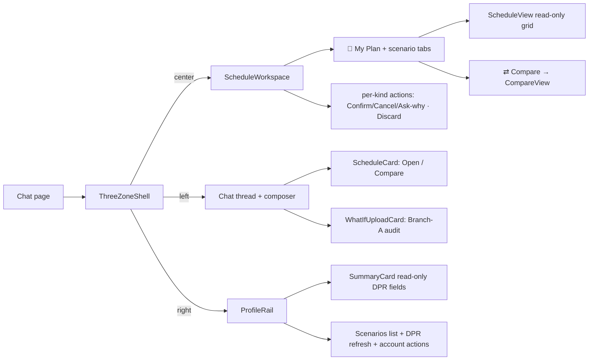

# UI Components

> Last verified against code: 2026-06-18 (Plan 36 — scenarios workspace UI: 3-zone shell, scenario store, ScheduleWorkspace + CompareView + ProfileRail, chat ScheduleCard/WhatIfUploadCard, 3-branch what-if; engine + R1 + frozen contract untouched).
>
> Prior 2026-06-16: Phase 4 follow-up F3 (window-aware IP slot-state); Phase 4 E3 (never-instant preview/review card; drag removed). Prior 2026-06-15: Phase 4 E2 (badge row + slot-state glyphs + violet light/dark); 2026-06-10 (post planning-engine rebuild, PRs #35-#41).

## TL;DR

This is everything the student sees on screen — the landing page, the chat thread, and especially the **3-zone workspace** that lives next to the conversation. **Plan 36 replaced the single right-hand "ScheduleSidebar" with a 3-zone shell** (`ThreeZoneShell`): the chat thread becomes a supporting LEFT rail, a tabbed **ScheduleWorkspace** is the CENTER hero, and a profile-only **ProfileRail** is the RIGHT zone. The schedule is no longer edited from a sidebar ⋯-menu — **editing is now CHAT-ONLY** (propose in chat → the engine returns a labeled *scenario* → preview it as a tab → Confirm). The committed plan ("📌 My Plan") is always anchored as the first tab; every derived schedule (a proposed edit, a what-if assumption, a Branch-A audit exploration) is a labeled scenario tab (✓ committed / ⏳ proposed / 🔍 what-if), and you can put **any two** side-by-side in a CompareView with diff highlights. The workspace grids are purely presentational (read-only); the chat thread emits a compact **ScheduleCard** when a scenario is staged (Open / Compare) and a **WhatIfUploadCard** when the agent offers the Branch-A "upload your Albert What-If audit" path. The old `scheduleSidebar.tsx` still exists on disk but is **no longer mounted** (slated for deletion — see "Deprecated / unmounted" below).



---

## Overview

The chat UI is a Next.js app with three layers:

1. The Next.js root layout (`app/layout.tsx`) — `<html>` and `<body>` plus global metadata.
2. The marketing landing page (`app/page.tsx`) — static hero, features, footer, with a link to `/chat`.
3. The chat experience — a page-level orchestrator (`app/chat/page.tsx`) that mounts the **3-zone shell**, where the CENTER zone mirrors the student's forward schedule + every derived scenario as the conversation drives changes.

This doc focuses on the **scenarios workspace tree** (Plan 36), which is the densest and most stateful part of the UI. The chat page subscribes to the v2 SSE stream + plan-action route responses and dispatches them into ONE shared scenario store (`createPlanStore`, see [chat-ui-client.md](./chat-ui-client.md)); the workspace + profile rail render off that single snapshot via `useSyncExternalStore`. **Editing is chat-only** — there is NO slot ⋯-menu, no `+ Add course` input, and no drag in the live UI; a student proposes a change in the conversation, the engine returns a scenario, and the workspace previews it as a tab the student can Confirm.

> **Engine / R1 / frozen contract — UNTOUCHED.** Plan 36 is **web-only**: it reshaped the web state store + presentation. The engine's `finalizeForwardSchedule`, the 7-axis validator, and the solver were not modified; the only engine touch was a new `offerAuditUpload` marker + an `AUDIT_UPLOAD_OFFER:` summary line on the `what_if_audit` tool (`packages/engine/src/agent/tools/whatIfAudit.ts`), which does not touch the frozen pipeline. **R1 holds:** a what-if / synthetic schedule is NEVER written to `students.parsed_dpr`; confirming a proposed scenario persists ONLY the `forward_schedule` (via `/api/plan/confirm`); the read-only Branch-A what-if scenario has no `pendingMutationId` and is never confirmable.

## The 3-zone shell — `app/chat/workspace/ThreeZoneShell.tsx`

The live chat layout. `ThreeZoneShell` is a THIN presentational component (`ThreeZoneShell.tsx:55`) that renders a CSS-grid of three zones and is mounted in `page.tsx` (`page.tsx:1879`):

```
┌──────────────┬──────────────────────┬────────────────┐
│  chat (LEFT) │  ScheduleWorkspace   │  ProfileRail   │
│  thread +    │  (CENTER — the HERO) │  (RIGHT)       │
│  composer    │  tabs + scenarios    │  profile-only  │
└──────────────┴──────────────────────┴────────────────┘
```

- The grid columns are `minmax(320px, 1fr) minmax(420px, 1.4fr) minmax(280px, 0.9fr)` (`chat.module.css` `.threeZone` `:31-35`) — desktop-only (≥1100px), no mobile breakpoint.
- Props (`ThreeZoneShell.tsx:42`): `planStore` (the SAME shared store `page.tsx` holds), `onConfirmProposed` + `onAskWhy` (wired to the page's existing confirm round-trip + chat injection), `left` (the chat thread + composer JSX, passed by `page.tsx`), and `right` (the JSX for the RIGHT zone).
- The CENTER zone mounts `<ScheduleWorkspace>` directly; the LEFT and RIGHT zones render the `left` / `right` slots.
- **The RIGHT slot is `<ProfileRail>`** (`page.tsx:2297`), NOT `ScheduleSidebar` — that's the H5 cutover. (The `ThreeZoneShell.tsx` header comment still describes the right zone as "the existing ScheduleSidebar … H5 will repurpose it"; that comment is stale prose — the working code passes `ProfileRail`.)

## ScheduleWorkspace — `app/chat/workspace/ScheduleWorkspace.tsx`

The CENTER hero: a tabbed workspace that shows the committed plan plus any proposed/whatif scenarios and lets the student confirm, cancel, ask-why, discard, or compare them. It reads scenario state via `useSyncExternalStore` (`ScheduleWorkspace.tsx:76`) and holds NO local copy of the scenario list — all writes go through the store.

### Tab bar (`ScheduleWorkspace.tsx:161`)

- A **pinned 📌 "My Plan" committed tab** is always first (`:170`) — no close button.
- One tab per proposed/whatif scenario (`:199`), each badge-colored (via `kindBadgeClass`) with a close ✕ button.
- A `⇄ Compare` toggle (`:243`) — a SIBLING of the tablist (a tablist must contain only `role="tab"` children).
- **NO "+ New what-if" control** — what-ifs are created from chat only (owner decision, plan 36).
- **ARIA tabs pattern (H6):** the tablist owns the ArrowLeft/Right roving-tabindex handler (`handleTablistKeyDown` `:130`); the active tab gets `tabIndex=0` / `aria-selected` and all others `tabIndex=-1`; each tab carries `aria-controls` pointing to the single `role="tabpanel"` body (`:256`). The close ✕ is a real sibling `<button>` (M3 restructure — no `<button>` nested in `<button>`, no hydration warning).

### Body — per-kind action bodies (`ScenarioBody`, `ScheduleWorkspace.tsx:362`)

The body renders the active scenario's header (label + kind badge + verdict glyph), an optional assumption/hedge block, a per-kind action bar, and a read-only `<ScheduleView>` of the scenario's schedule:

| Kind | Action bar | Notes |
|---|---|---|
| **committed** | none — "it IS the plan" | read-only grid |
| **proposed** | **Confirm — make this My Plan** (→ `onConfirmProposed`) · **Cancel** (→ `planStore.discardScenario`) · **Ask why** (→ `onAskWhy`) | shows the assumption/hedge block (`:388`) |
| **whatif** | **Discard** (→ `planStore.discardScenario`) — NO Confirm | + two read-only notes: "nothing is saved unless you adopt it as your plan" / "a what-if never changes your plan; to adopt it, declare it in Albert & upload a new DPR" (`:439-444`) |

When `compare` is set the body swaps to `<CompareBody>` (`:296`) which resolves the compare pair from the store and renders `<CompareView>`. Empty states cover no-DPR and no-scenario-selected.

The workspace re-exports `kindBadgeLabel` / `kindBadgeClass` / `verdictDisplay` + the `ScenarioKind` type (`:48-49`) so older consumers that imported them from here keep working (the real source is `scenarioBadges.ts`).

## ScheduleView — `app/chat/workspace/ScheduleView.tsx`

A presentational one-schedule term grid (`ScheduleView.tsx:115`). It reuses the sidebar low-level helpers (`renderSlotInner` / `slotGradeText` from `slotRenderHelpers`, `formatTermLabel` / `slotCredits` from `sidebarFormatters`, `slotTierClassName` from `slotTier`) and applies diff highlights on top.

- Props (`:40`): `schedule`, an optional `diff: AnnotatedColumn` (from `scheduleDiff.ts`), `readOnly` (default false), `singleColumn` (compare columns force a one-term-per-row layout).
- **As of H6 it is PURELY presentational** — NO slot click handler, NO popover, NO "clickable" affordance (`:169-177`). Editing is chat-only, so the workspace has no slot editor; the `readOnly` prop is retained for API compatibility but the grid is non-interactive either way. The only per-slot status signal is a minimal 🔒 (completed) / ◐ (in-progress) glyph.
- **Diff keying:** `slotCourseKey` (`:107`) delegates to `scheduleDiff.slotKey` so the diff-lookup key is BYTE-IDENTICAL to the key the diff stored (canonical course id for courses, `placeholder:${placeholderId}` for placeholders) — a divergent key would silently drop highlights. `diffClassFor` (`:64`, exported for unit test) maps a course's diff annotation to a CSS-module class (`diff-added` / `-removed` / `-moved` / `-retake`; `same` → no highlight).

## Schedule diff — `lib/scenarios/scheduleDiff.ts`

The pure compare engine (`scheduleDiff.ts:164`). `diffSchedules(base, other) → { base, other }` — two `AnnotatedColumn`s for a side-by-side view. PURE: no React, no I/O, no `Date.now()`; reads the engine only via the public barrel (`canonicalizeCourseId`).

- `CourseDiff` is `same | added | removed | moved | retake` (`:55`).
- `slotKey(slot)` (`:86`, exported) is the SINGLE keying source — `placeholder:${placeholderId}` for placeholders, the canonical course id otherwise — shared with `ScheduleView` so highlights can't miss.
- `termOrdinal(term)` (`:389`) = `year*10 + {spring:0, summer:1, fall:2, january:3}`, mirroring the engine's `SEASON_ORD` (J-term follows fall of the SAME label-year, no year rollover) — used for the retake heuristic (a course removed from its base term that re-appears at a strictly later term in `other`).

## CompareView — `app/chat/workspace/CompareView.tsx`

Presentational side-by-side comparison of ANY two scenarios (`CompareView.tsx:58`) — no store reads; all data is passed as props so it is trivially unit-testable.

- Props (`:43`): `left` + `right` (resolved `Scenario`s, either may be the committed anchor), `options` (ALL selectable scenarios for the two pickers), and `onPick(side, id)`.
- Two `<select>` pickers (`:88` / `:114`); the left picker disables the option equal to `right.id` and vice-versa, so the student can never submit a same-scenario pair (the store's `openCompare` throws on equal ids).
- Computes `diffSchedules(left.schedule, right.schedule)` and feeds `d.base` → the left column and `d.other` → the right column (`:65`, `:144` / `:155`); each column is a `singleColumn readOnly` `<ScheduleView>` with a column header (label + kind badge).
- A `DiffLegend` (`:221`) maps each diff color to a description (added / removed / moved / retake).

`CompareBody` in `ScheduleWorkspace.tsx` (`:296`) is the store-connected wrapper: it resolves the pair via `getScenario`, builds the `options` list (committed anchor + `state.scenarios`), and the `onPick` handler keeps the unchanged side stable + guards against equal ids before calling `openCompare`.

## Scenario badges — `app/chat/workspace/scenarioBadges.ts`

Pure shared badge helpers (no React, no I/O) consumed by the workspace, the profile rail, and both chat cards (`scenarioBadges.ts`):

- `kindBadgeLabel(kind)` — `✓ Committed` / `⏳ Proposed` / `🔍 What-if` (`:14`).
- `kindBadgeClass(kind)` — `badge badge-committed` / `badge-proposed` / `badge-whatif` (`:23`).
- `verdictDisplay(verdict)` — `{ glyph, label, className }` for `valid` (✓) / `trade-offs` (⚠) / `invalid` (✗) (`:32`).

## ProfileRail — `app/chat/ProfileRail.tsx`

The RIGHT zone (`ProfileRail.tsx:89`) — profile-only; it **replaces the schedule sidebar's render duties**. The schedule grid + slot editing moved to the CENTER workspace; what-if creation is chat-only (the rail has NO spawn control). It subscribes to the store via `useSyncExternalStore` (`:106`) so the scenarios list re-renders on every mutation, and it holds NO decision logic (badge labels/classes come from `scenarioBadges`; the SummaryCard owns its own field derivation).

Top → bottom (`:123`):
1. A "Your profile" header.
2. **`<SummaryCard>`** (`:135`) — the DPR-derived READ-ONLY fields (home school / major-minor / catalog year / GPA / credits / grad target; CORE RULE 14 — change only via a corrected DPR). It is fed the **COMMITTED schedule** (not an active scenario), so the profile always reflects the authoritative plan, never a hypothetical.
3. The **"↻ Update DPR"** refresh control (`:139`) — the single path to change the authoritative plan (upload a fresh DPR PDF); driven by the page's `onRefreshDpr` + `refreshing` busy state. (On success the page now updates BOTH the committed schedule AND the parsed DPR so the profile fields don't go stale — see [chat-ui-client.md](./chat-ui-client.md).)
4. The **scenarios list** (`ScenarioList`, `:237`) — the committed anchor pinned at top as "📌 My Plan" (✓ committed, NO compare affordance) + one `ScenarioRow` (`:301`) per proposed/whatif scenario (badge-colored; click the row body → `onSelectScenario` → `store.setActive`; the per-row ⇄ Compare → `onCompareScenario` → `store.openCompare("committed", id)`). The select control + the compare control are SIBLINGS (`data-select` / `data-compare`) so neither nests inside the other. A muted placeholder row shows when no DPR is loaded.
5. The privacy note (`:179`) — "Only **My Plan** is saved. Your DPR is never changed … Proposed changes and what-ifs are explorations and are not recorded until you confirm them into My Plan." — plus the STANDING self-serve **Delete my account & data** action (`:189`, always shown to a signed-in student) and the env-gated **⚠ Clear all data** test affordance (`:204`, gated on `NEXT_PUBLIC_ENABLE_TEST_CLEAR === "1"`, read at render time).

## Chat cards — `ScheduleCard.tsx` + `WhatIfUploadCard.tsx`

Two compact card variants the chat thread renders (both presentational — no store reads; the page owns the wiring):

### ScheduleCard — `app/chat/ScheduleCard.tsx`

A `schedule_card` chat-message artifact (`ScheduleCard.tsx:52`): a kind badge + label + an optional one-line summary + a verdict glyph + two buttons — **Open** (→ `onOpen(scenarioId)` → `store.setActive`) and **Compare** (→ `onCompare(scenarioId)` → `store.openCompare` vs committed). It is emitted into the chat thread by `page.tsx` whenever a proposed scenario is staged (the `handlePlanActionResult` / `handleWhatIfResult` feasible path) or a Branch-A what-if scenario is built — built by the pure `buildScheduleCardMessage(scenario, id, timestamp)` (`app/chat/buildScheduleCardMessage.ts:105`), which derives the label (prefers `whatIfAssumption.label`) + summary (prefers the first hedge) from the scenario.

### WhatIfUploadCard — `app/chat/WhatIfUploadCard.tsx`

A `whatif_upload_card` chat-message artifact (`WhatIfUploadCard.tsx:42`) the page renders when the agent offers the Branch-A "explore precisely" path: an "Explore precisely" heading, a body naming the `hypotheticalProgram`, and an **Upload What-If audit (PDF)** button (hidden file input, PDF-only) → `onUpload(file)`. The page's `handleWhatIfAuditUpload` POSTs the audit to `/api/whatif-audit` and builds a READ-ONLY 🔍 what-if scenario (see [chat-ui-client.md](./chat-ui-client.md) for the full flow). Shows a spinner while uploading + an inline error on failure.

---

## Deprecated / unmounted (`app/chat/scheduleSidebar.tsx`)

> **`scheduleSidebar.tsx` STILL EXISTS on disk but is NO LONGER MOUNTED** (Plan 36, H5). The chat page imports `ProfileRail` for the RIGHT zone instead; `ScheduleSidebar` is referenced only in `page.tsx` *comments*. Its render duties were split: the schedule grid → the CENTER `ScheduleWorkspace` (read-only `ScheduleView`), slot editing → CHAT-ONLY (propose → scenario → Confirm), the profile fields + DPR refresh + account actions → `ProfileRail`. It is slated for deletion in a follow-up. The sections below describe the sidebar as it stood at the end of Phase 4 (E3 + F3) and are retained for historical reference only — they no longer reflect the LIVE UI.

### The chat sidebar — `app/chat/scheduleSidebar.tsx` (historical)

The single live component that owned sidebar state. It was rendered by the chat page when the user opened the sidebar.

### Props received (`scheduleSidebar.tsx:133`)

| Prop | Source | Purpose |
|---|---|---|
| `schedule: ForwardSchedule \| null` | chat page's `forward_schedule_update` SSE handler | The committed plan to render |
| `pendingPreview: PendingPreview \| null` (E3.1) | chat page's `pendingPreview` store slot | A staged (not-yet-committed) proposal; when set, the sidebar renders the "◷ Preview" overlay + review card over the proposed plan, committed plan untouched |
| `invalidProposal: InvalidProposalCard \| null` (E3.3) | chat page's `invalidProposal` store slot | An engine-rejected (`feasible:false`) proposal; renders the RED card naming the binding constraint(s). Mutually exclusive with `pendingPreview` |
| `student: StudentProfile \| null` | chat page's session restore | Drives the SummaryCard |
| `dpr: DegreeProgressReport \| null` | chat page (loaded via login restore) | Drives the SummaryCard credit/GPA fields |
| `materialization: ForwardMaterializationPayload \| null` | chat page's `forward_materialization_update` SSE handler | Drives the IMMEDIATE-term Sections view |
| `schedulePreferences: SchedulePreferences \| null` | chat page (loaded via `/api/session/restore`) | Walked to compute frozen slot keys |
| `open: boolean` | chat page | Sidebar visibility |
| `onClose` | chat page | Close button handler |
| `onProposeLoadStyle` | chat page | Balanced / Frontload / Backload pill clicks |
| `onProposeSlotChange` | chat page (legacy) | No-op shim from the older slot-action verb set |
| `onPlanActionResult` | chat page | Fires after every deterministic plan-action route — the page runs `planActionSurfaces` to stage the preview / red card and (only on `feasible:false`) render an inline `plan_action_bubble` message in the chat thread |
| `onReviewConfirm` (E3.2) | chat page | Review-card Confirm — applies the staged mutation via the shared `/api/plan/confirm` path |
| `onReviewCancel` (E3.2) | chat page | Review-card Cancel — drops the staged preview without a confirm round-trip |
| `onReviewAskWhy` (E3.2) | chat page | Review-card Ask-why — routes a scoped "why" question into the grounded chat agent |
| `onDismissInvalid` (E3.3) | chat page | Dismiss the RED invalid-proposal card (nothing staged/committed, just clears the slot) |
| `onConfirmCombination` | chat page | Apply-combination button inside the Sections view |
| `onRefreshDpr` | chat page | Update-DPR file picker handler |
| `onClearAll` | chat page | Test-only Clear button handler |

### Event subscription model

The sidebar itself does not subscribe to any event source — it is a pure render of its props. The chat page subscribes to the v2 SSE stream and forwards two relevant payload kinds into the sidebar:

- `forward_schedule_update` → updates the `schedule` prop.
- `forward_materialization_update` → updates the `materialization` prop.

The schedule preferences arrive separately via the per-mount restore call.

### Local state held inside the sidebar

- `openPopover: string \| null` — which slot's verb popover is open.
- `openSubmenu: { key, verb } \| null` — which submenu inside that popover (Swap candidates or Move targets) is open.
- `pendingSlots: Set<string>` — keys of slots with an in-flight plan-action round-trip. Drives per-row spinners.
- `pendingSince: number \| null` — first-spinner-on timestamp. Used to gate a sidebar-bottom "Validating plan change..." toast.
- `showToast: boolean` — whether the sidebar-bottom toast is currently rendered. Becomes true 600ms after `pendingSince` is set (constant `SIDEBAR_TOAST_THRESHOLD_MS = 600` at `scheduleSidebar.tsx:56`); becomes false the instant `pendingSlots` drains.
- `addCourseDraft: Map<term, string>` — the open Add-course inputs per term and their current draft text.
- `selectedComboIdx: number` — which proposal index is selected in the Sections view. Reset to 0 on every `materialization.computedAt` change.

(Phase 4 E3 removed the former `dragSourceRef` / `dropTargetTerm` drag state along with the drag gesture; the sidebar holds no drag state now.)
- `refreshing: boolean` — Update-DPR in flight.

### Slot key derivation

A slot's stable identity key is `${term}::${courseId}` for concrete slots; placeholders use `${term}::placeholder(${category})` so a swap on a placeholder still surfaces a spinner (`scheduleSidebar.tsx:280`).

### Frozen keys

A `frozenKeys` set is derived via `useMemo` from `schedulePreferences.pins[]` — each pin contributes `${pin.term}::${pin.courseId}` (`scheduleSidebar.tsx:251`). This set is passed to every TermCard and is what makes the Lock/Unlock label inside a popover bidirectional.

### Plan-action handlers

Every verb is wired to a deterministic POST endpoint via the `planActionClient`, reachable through the per-slot ⋯ menu (Phase 4 E3 removed drag-and-drop, so the ⋯ menu + the `+ Add course` input are the only ways to fire these):

- `handleLockToggle` → `planLock` with `locked: !wasFrozen` (`scheduleSidebar.tsx:387`).
- `handleDrop` → `planDrop` (`scheduleSidebar.tsx:407`).
- `handleSwap` → `planSwap` with `{ drop, add, term }` (`scheduleSidebar.tsx:426`).
- `handleMove` → `planMove` with `{ courseId, fromTerm, toTerm }` (`scheduleSidebar.tsx:451`).
- `handleAddCourseSubmit` → `planAdd` with `{ courseId, term }` (`scheduleSidebar.tsx:474`).

Each handler does the same shape of work: derive a slot key, mark it pending (which lights up the spinner and may start the toast timer), call the deterministic route, then announce the result via `announceResult` (`scheduleSidebar.tsx:364`). The helper logs by category (clean / trade-offs / refusal / error) and bubbles up through `onPlanActionResult`; the chat page then runs `planActionSurfaces` to stage the canvas preview / red card (and, only on `feasible:false`, an inline chat bubble). Always clears the pending flag and closes the popover in `finally`.

### Drag-and-drop — REMOVED (Phase 4 E3.4)

Drag-to-move/exchange was removed entirely in E3.4 (commit `b209559`). The per-course ⋯ menu (Swap / Drop / Lock / Move) is now the **sole edit input**, the literal §8 "no drag" reading; this supersedes the Phase-17 drag-grid. The sidebar tree (`scheduleSidebar.tsx`, `SlotRow.tsx`, `TermCard.tsx`) carries **no** `onDragStart` / `onDragOver` / `onDrop` / `draggable` handlers and no `application/x-nyupath-slot` dataTransfer; the former drag refs were deleted with the gesture.

### Top-level chrome

- Header with title and close button (`scheduleSidebar.tsx:600`).
- Optional toolbar with an "Update DPR" file picker that triggers `onRefreshDpr` (`scheduleSidebar.tsx:604`).
- Empty state ("No plan yet...") when neither a student nor a schedule is loaded (`scheduleSidebar.tsx:629`).
- Otherwise the body: `SummaryCard`, schedule meta line ("Targeting graduation in ... · N credits per semester"), load-style pills (Balanced / Frontload / Backload), state banners (trade-offs / infeasibility / student-preferred-invalid), the **plan-level badge row** (`<PlanBadges>`, mounted directly above the term cards — `scheduleSidebar.tsx:687`; see "Plan-level badge row" below), `PriorCreditsCard`, and one `TermCard` per term bucket.
- The body invokes `groupCoursesByTerm` (from `lib/groupCoursesByTerm`) to produce `{ priorCredits, terms }` from the student + schedule + DPR.
- Sidebar-bottom toast (`scheduleSidebar.tsx:752`) — renders only when `showToast && pendingSlots.size > 0`. Includes a spinner and "Validating plan change…" copy.
- Test-only Clear button at the bottom when `NEXT_PUBLIC_ENABLE_TEST_CLEAR === "1"` (`scheduleSidebar.tsx:761`).

### Load-style pills

Three constants at `scheduleSidebar.tsx:42`:
- Balanced — propose a balanced credit load across all semesters.
- Frontload — heavier early, lighter later.
- Backload — lighter early, heavier later.

Clicking a pill calls `onProposeLoadStyle` with the value.

### State banners

Three banners stack above the term cards (and above the plan-level badge row) depending on `schedule.state`:
- `valid-with-trade-offs` + at least one assumption → trade-offs banner, listing the first five assumptions via `assumptionLabel` (`scheduleSidebar.tsx:660`).
- `infeasible-draft` → infeasibility banner, listing the first five constraint violations from `feasibility.constraintViolations` (`scheduleSidebar.tsx:670`).
- `student-preferred-invalid-draft` → student-preferred banner (`scheduleSidebar.tsx:680`).

### Env flags

Two helpers (`scheduleSidebar.tsx:29`, `scheduleSidebar.tsx:37`):
- `isTestClearEnabled()` reads `NEXT_PUBLIC_ENABLE_TEST_CLEAR === "1"` — surfaces the bottom Clear-all-data button.
- `isLlmPolishEnabled()` reads `NEXT_PUBLIC_PLAN_CHANGE_LLM_POLISH === "1"` — kept here as the single source of the env-flag check, even though the page is the actual consumer. The sidebar references it via `void` so the import isn't pruned.

### Plan-level badge row — `lib/planBadges.ts` + `PlanBadges` (Phase 4 E2.1)

A four-badge summary row mounted directly above the term-card list (after the state banners) — `<PlanBadges>` at `scheduleSidebar.tsx:687`, defined inline at `scheduleSidebar.tsx:93`. The component is a **thin consumer**: it holds no decision logic and renders whatever the pure helper returns.

All derivation lives in `apps/web/lib/planBadges.ts` — `computePlanBadges(schedule, consequences?)` (`planBadges.ts:61`) — a pure, framework-agnostic function unit-tested directly in node (`apps/web/tests/planBadges.test.ts`), since `apps/web` ships no DOM render harness. It returns four badges:

| Badge | Source | Detail |
|---|---|---|
| **Validity** | `schedule.state` | ✓ for `valid-clean` / `valid-with-trade-offs`; a clearly-marked "✗ Invalid draft" for the two draft states (`infeasible-draft`, `student-preferred-invalid-draft`). |
| **Confidence** | derived (see below) | "✓ Grounded" when not hedged; otherwise "Confidence: hedged — verify with your adviser". |
| **Graduation term** | `schedule.graduationTerm` | Formatted via the sidebar's deterministic `formatTermLabel` (e.g. `2027-spring` → "Spring 2027"); unrecognized shapes pass through verbatim — no invention. Rendered with a 🎓 prefix. |
| **Trade-off count** | `consequences?.length ?? 0` | The latest plan-action diff's `consequences[]`, threaded down as a param. At rest (no pending diff) it is absent → count 0. (Live consequences wiring is E3's job; the component currently mounts `<PlanBadges>` without it.) |

**Confidence hedge — no-invention derivation (binding §11 / philosophy #3).** There is **no** structured "CAS-approximated" / confidence field on `ForwardSchedule` (the D4.4 hedge lives in the agent's narration, not on the plan object). So the confidence badge **derives** its hedge only from real engine-produced fields (`planBadges.ts:80-86`): it is hedged when `schedule.optimality` is `"best-effort"` or `"feasibility-unconfirmed"`, OR `schedule.assumptions[]` is non-empty, OR the state is an invalid draft. It computes **no new number** and fabricates **no CAS-coupling claim** — when any of those markers holds, the label carries a "verify with your adviser" hedge.

### Slot-state glyphs — `sidebar/slotState.ts` (Phase 4 E2.2; IP window-aware F3)

Each slot pill renders a design-§8 state glyph (🔒 / ◐ / none) sourced from a pure helper. `computeSlotState(slot, { isFrozen, semesterLocked, ipChangeability? })` (`apps/web/app/chat/sidebar/slotState.ts`) is the **single source of truth** for the glyph + human label + aria-label + an `editable` flag (+ an optional `title` tooltip for the F3 hedge); `SlotRow` consumes it and holds no slot-state decision logic of its own. It is unit-tested directly in node (`apps/web/tests/slotStates.test.ts` + `ipSlotChangeability.test.ts`).

The helper resolves by precedence (highest first — `slotState.ts:98-152`):

| Glyph | State | Label | Editable |
|---|---|---|---|
| 🔒 | `kind === "completed"` (checked **kind-first**) | "Taken (final)" | false |
| 🔒 | `semesterLocked` (the bucket's `ForwardSemester.locked` — DPR history / in-progress term) | "Locked — past or in-progress term" | false |
| 🔒 | `isFrozen` (student-pinned via `SchedulePreferences.pins[]`) | "Locked by you" | true (unlock / move via the ⋯ menu; the lock travels with it) |
| ◐ | `kind === "in_progress"` (window-aware — see F3 below) | window-honest label (e.g. "within add/drop", "withdraw/pass-fail only", "change windows closed") | from `ipChangeability.editable` (closed → false; else true) |
| _(none)_ | `specific_planned` / `placeholder` | "Planned (movable)" | true |

Notes worth flagging:
- **The ◐ in-progress glyph is NEW** — before E2.2 an in-progress slot showed no state glyph. This makes the `core_philosophy.md` IP rule visible on the canvas.
- **`completed` is checked kind-first**, BEFORE the generic `semesterLocked` branch, so a completed course shows the design-§8 "Taken (final)" label even though it always renders inside a `locked: true` history bucket — otherwise the generic term-lock label would mask it.
- **IP movability is now WINDOW-AWARE (Phase 4 follow-up F3) — the prior "deferred open question" is RESOLVED.** When an `in_progress` slot carries an `ipChangeability` classification (threaded from `TermBucket.ipChangeability`, computed once per IP bucket in `groupCoursesByTerm` from the engine's `classifyIpChangeability` + `deriveTemporalContext` + `campusForHomeSchool` + the academic-calendar config — see `Docs/current-system/engine/dpr.md`), the ◐ slot's `editable` + label come from the real NYU registration window: a **future** (pre-registered) IP term is freely changeable; a **current** term inside add/drop is changeable; inside the withdraw/pass-fail window it surfaces those options (editable, hedged — a W doesn't fulfill the requirement, P/F may not satisfy a letter-grade major rule); **past the withdraw window it is NOT editable** (effectively locked); when the calendar lacks that term/campus's dates it stays editable with a generic "verify with your adviser" hedge (we never falsely lock for lack of data). The full hedge rides through as the slot `title` tooltip; the agent surfaces it in chat (`systemPrompt.ts` CORE RULE 15). Any *claimed* current-term change (drop/withdraw/pass-fail) is an UNVERIFIED assumption, planned as a draft/what-if, never recorded as fact (only a new DPR confirms it). When `ipChangeability` is absent (e.g. the no-DPR transcript fallback), the slot keeps the back-compat ◐ "fixed in its term" / editable behavior.

### NYU-violet light/dark theme — `globals.css` + `chat.module.css` (Phase 4 E2.3)

E2.3 was a CSS-only pass: it lifted E2.1's hardcoded badge hex into semantic tokens and added a token-override dark theme. **There is no toggle UI** — the dark variant resolves from an explicit `data-theme="dark"` opt-in or the OS-level preference.

- **New tokens in `globals.css :root`** (`globals.css:40-61`, light values): `--badge-valid-*`, `--badge-invalid-*`, `--badge-hedged-*`, `--badge-neutral-*`, `--badge-grounded-*` (the validity-positive "grounded" badge folds in the NYU-violet brand — `--badge-grounded-bg/-border/-text` resolve to `--nyu-violet-faint`/`--nyu-violet`), and `--slot-glyph-color` (the 🔒/◐ glyph accent, `--nyu-violet`). They live in `globals.css` rather than `chat.module.css` because Next 16's CSS-Modules loader rejects a bare `:root` block inside `*.module.css`.
- **`chat.module.css` references the vars** (no hardcoded hex remains in the `.planBadge*` / `.slotLockIcon` rules — `chat.module.css:606-651`, `:1019`): the badge row gets an on-brand NYU-violet left accent (`border-left: 3px solid var(--nyu-violet)`), the grounded badge folds in the violet brand, and the slot glyph reads in `var(--slot-glyph-color)`.
- **Dark layer** (`globals.css:111-148`): a `[data-theme="dark"]` block re-points the neutral (`--bg-*`/`--text-*`/`--border-*`) and `--badge-*` tokens to dark values while keeping the NYU-violet brand. A mirrored `@media (prefers-color-scheme: dark) :root:not([data-theme="light"])` gate (`globals.css:152-181`) applies the same overrides for an OS-level dark preference, while an explicit `data-theme="light"` opt-out wins. The light `:root` values are untouched, so light mode does not regress. Because every component already styles through these tokens, flipping `data-theme="dark"` re-themes the shell app-wide with no markup change.

### Canvas edit-model surfaces — the never-instant preview / review / invalid card (Phase 4 E3)

E3 made "edits are never instant" *visible* on the canvas. Every ⋯-menu verb PROPOSES (the routes are unchanged — see [plan-action-orchestrator.md](./plan-action-orchestrator.md)); the page stages the result into the shared store and the sidebar renders one of two mutually-exclusive surfaces at the **top of the sidebar body** (above `SummaryCard`), while the committed plan below stays byte-identical until Confirm. The decision logic is pure and node-tested (`apps/web` ships no DOM render harness); the sidebar is a thin consumer.

**The pure helpers (no React import):**
- `apps/web/app/chat/planState.ts` — the shared store gained two slots: `pendingPreview: PendingPreview | null` (E3.1) and `invalidProposal: InvalidProposalCard | null` (E3.3). They are **mutually exclusive**, and `setForwardSchedule` is the single commit chokepoint that clears BOTH (`planState.ts:149-161`) — so any commit (clean apply, bubble confirm, override-anyway, SSE `forward_schedule_update`, DPR refresh) drops a stale card with no per-call-site enumeration.
- `apps/web/lib/planPreview.ts` — `computePreviewView(committed, preview)` (`planPreview.ts:72`) computes the credit delta (`total` + per-`byTerm`) of the proposed plan vs the committed plan, over the union of all terms in either. Pure; tested in `apps/web/tests/canvasPreview.test.ts`.
- `apps/web/lib/reviewCard.ts` — `computeReviewCard(response)` (`reviewCard.ts:82`) derives the verdict (✓ valid / ⚠ valid-with-trade-offs / ✗ invalid) + trade-off lines **strictly** from the engine's `feasible` + `consequences` (+ an optional deterministic `planDiff` graduation-shift summary) — it NEVER fabricates a delta. `computeInvalidCard(response, verb)` (`reviewCard.ts:163`) builds the red card's binding constraints from `response.conflicts ∪ response.forwardSchedule.feasibility.constraintViolations`, mapped to `{kind, detail}` and deduped by `detail` — both sources empty → `[]` (no invented field; there is NO `infeasibilityReport`). `applyReviewConfirm` / `applyReviewCancel` (`reviewCard.ts:223`/`247`) are the store-mutating, injectable-confirm actions (node-tested in `apps/web/tests/reviewCard.test.ts` / `invalidProposal.test.ts`).
- `apps/web/lib/planActionSurfaces.ts` — `planActionSurfaces(response, verb)` (`planActionSurfaces.ts:64`) is the single decision of which surfaces a response drives: `{ preview, invalidCard, showBubble }`. Feasible (clean OR trade-offs) with a proposed schedule → a `preview`, `showBubble:false` (the review card is the sole surface — no chat bubble); `feasible:false` → an `invalidCard` + `showBubble:true` (the chat bubble carries Override-anyway / hard-refusal copy the red card lacks, so it renders alongside the red card).

**The three rendered surfaces (`scheduleSidebar.tsx`):**

| Surface | When | What renders | Cite |
|---|---|---|---|
| **"◷ Preview" overlay** (E3.1) | `pendingPreview` set (feasible proposal) | A read-only overlay above the committed cards: a "◷ Preview" badge + "not applied yet" banner, the credit-delta line + per-term list, the first five `consequences`, and the proposed term cards rendered with **no slot handlers** (read-only) | `scheduleSidebar.tsx:583-669` (overlay), `:307` (`computePreviewView` call) |
| **Review card** (E3.2) | inside the overlay | The verdict glyph + label (only ✓/⚠ here — a staged preview is always feasible) + up to six trade-off lines + three buttons: **Confirm** (disabled if `!canConfirm`) / **Cancel** / **Ask why** | `scheduleSidebar.tsx:681-756` |
| **RED invalid card** (E3.3) | `invalidProposal` set (`feasible:false`) | `role="alert"` red card: a "✗ Can't `<verb>` — invalid change" heading, the first five binding-constraint `detail` lines (or a generic "could not validate — verify with your adviser" fallback when the list is empty), a "Your plan was not changed" line, and a **Dismiss** button. NO proposed-plan overlay — committed cards stay as they are | `scheduleSidebar.tsx:776-812` |

CSS for the three surfaces lives in `chat.module.css` (`.schedulePreviewOverlay`/`.schedulePreviewBadge` `:606`, `.reviewCard`/`.reviewBtn*` `:671`, `.invalidProposalCard`/`.invalidProposalDismiss` `:753`). The page-side wiring (`handlePlanActionResult` → `planActionSurfaces`, the `onReviewConfirm`/`onReviewCancel`/`onReviewAskWhy`/`onDismissInvalid` handlers) is documented in [chat-ui-client.md](./chat-ui-client.md) §4 / §7.

## TermCard — `app/chat/sidebar/TermCard.tsx`

Renders one term bucket. Owns the drop-target plumbing at term-card level, the assumption/notes list, the structural slot list (or the Sections-view swap-in), and the per-term `+ Add course` affordance.

### What it decides

- `matApplies` — true when this card is the IMMEDIATE term AND a materialization payload exists AND its target term matches this card's term (`TermCard.tsx:79`).
- `showSectionsView` — true when `matApplies && materialization.state === "full" && materialization.semester` is set. When true, the slot list is replaced by the Sections view (`TermCard.tsx:84`).
- `showBanner` — true when `matApplies` but the materializer state is `partial` or `unavailable`. The card shows a status message instead of section data (`TermCard.tsx:87`).
- `headerCredits` — taken from `forwardSemester.plannedCredits` when a forward semester exists, otherwise summed from the bucket's slots via `slotCredits` (`TermCard.tsx:90`).
- `isDropEligible` — true when the bucket is not locked. Locked buckets (history / completed) stay read-only (`TermCard.tsx:97`).
- `showAddCourse` — true when the term is non-locked AND a forward semester exists. IP terms don't get an Add-course button (`TermCard.tsx:103`).

### Structure rendered

1. A `<section>` with class names derived from locked / drop-target state (`TermCard.tsx:106`).
2. Header row: term label (via `formatTermLabel`) and the credit total.
3. Optional notes list pulled from `forwardSemester.notes`.
4. Optional materialization banner if `showBanner`.
5. Either the Sections view (`renderSectionsView`) or the slot list (one `SlotRow` per slot in the bucket). Slot keys are derived as `${semIdx}-${slotIdx}` for the local popover key and `slotKeyOf(slot, bucket.term)` for the global pending/frozen sets.
6. Optional `AddCourseAffordance` if `showAddCourse`.

(Phase 4 E3.4 removed drag-and-drop, so `TermCard` no longer passes any `draggable` / drag-handler props to `SlotRow`; edits flow exclusively through the slot's ⋯ menu.)

## SectionsView — `app/chat/sidebar/SectionsView.tsx`

Exports `renderSectionsView(materialization, selectedIdx, setSelectedIdx, onConfirmCombination)`. Not a component class — just a renderer function so TermCard can call it inline.

### When it runs

Only when TermCard has decided `showSectionsView` is true: the materialization payload's state is `full` and there is a `semester` block.

### What it renders

1. `<h4>` heading "Sections" (`SectionsView.tsx:36`).
2. Combination picker: a row of tab buttons, one per proposal. Each button is labeled with its index (1-based) and has a tooltip `Combination N (weeklyHours h/wk)`. The active tab gets an extra CSS class (`SectionsView.tsx:37`).
3. For each section in the selected proposal: a card with the course id, course title (from the semester's courses, falling back to the section's own title), section meta line (`CRN ${crn} · ${schd} · §${section}`), meeting patterns (formatted by `formatPatterns` from `formatMeetingPatterns.ts`, or the literal `"Asynchronous"` when `section.isAsynchronous` is true), and instructor (defaulting to "Staff" when missing) (`SectionsView.tsx:54`).
4. Optional "Apply combination" button — only when `onConfirmCombination` is passed (`SectionsView.tsx:82`).
5. Optional truncated-note line when `semester.combinationsTruncated` is true, telling the user there are more conflict-free combinations than what's shown (`SectionsView.tsx:91`).

If `proposals` is empty, the renderer instead shows the materializer's `message` inside a banner.

## AddCourseAffordance — `app/chat/sidebar/AddCourseAffordance.tsx`

Per-term `+ Add course` UX. Receives the term's current draft from the parent (`undefined` = closed, string = open with current contents).

### Closed state

Renders a single pill-style `+ Add course` button. Clicking calls `onOpen(term)` (`AddCourseAffordance.tsx:44`).

### Open state

Renders:
1. An auto-focused text input with placeholder `e.g. CSCI-UA 480`. `onChange` calls `onChange(term, value)`. `onKeyDown` handles Enter (calls `onSubmit`) and Escape (calls `onClose`) (`AddCourseAffordance.tsx:54`).
2. When the trimmed draft is at least 2 characters, a suggestions list. The suggestions come from `gatherSuggestions(schedule, draft)` — the parent injects this. The current implementation is a client-side prefix match over the courses already in the schedule (V1 stub; the eventual `/api/v2/search-courses`-backed version slots in here). Each suggestion is clickable and replaces the draft (`AddCourseAffordance.tsx:66`).
3. An "Add" submit button (disabled when the trimmed draft is empty) and a "Cancel" button (closes the input).

## SlotRow — `app/chat/sidebar/SlotRow.tsx`

Renders one slot pill inside a term card's slot list.

### CSS classes

The `<li>` accumulates classes for: the slot kind, the optional flag (placeholder + optional), locked vs clickable, tier tint (via `slotTierClassName`), frozen (`SlotRow.tsx:76-83`). (Phase 4 E3.4 removed the former `draggable` class along with the drag gesture.)

### Title text

- Locked → "Completed — locked".
- Frozen → "Locked — click to open verbs (unlock / move via the ⋯ menu)".
- In progress → the slot-state label ("In progress (fixed in its term)") from `computeSlotState`.
- Otherwise → "Click to open verbs" (`SlotRow.tsx:85-93`).

(Phase 4 E3.4 dropped the old "drag to move" copy — the ⋯ menu is the only edit input now.)

### Inner content

`renderSlotInner(slot)` from `slotRenderHelpers.tsx` does the rendering — see below. Then either a spinner (when `isPending`) or the grade cell (via `slotGradeText(slot)`). Then the **slot-state glyph span** (`SlotRow.tsx:107-114`): the glyph + label + aria-label come straight from the pure `computeSlotState` helper (🔒 for taken/final, locked-by-you, or a term-locked slot; ◐ for an in-progress slot; empty for a planned/movable slot, whose `aria-hidden` is set when the glyph is empty). See "Slot-state glyphs" under the scheduleSidebar section above for the full state table and the precedence rules.

### Popover trigger

When `isOpen && !isLocked`, the row appends `renderSlotPopover(...)` with the slot, term, frozen flag, submenu state, the parent's submenu toggle, the schedule, and the handler bundle. (Phase 4 E3.4: with drag gone, this ⋯ popover is the sole edit affordance on a slot — `SlotRow` carries no drag handlers.)

## slotPopover — `app/chat/sidebar/slotPopover.tsx`

The 4-verb popover. `SLOT_VERBS` constant at `slotPopover.tsx:23`:

| Verb | Label | Submenu? |
|---|---|---|
| swap | "Swap with…" | yes |
| drop | "Drop" | no |
| lock | "Lock / Unlock" | no (but the label flips to "Unlock" when the slot is frozen) |
| move | "Move to…" | yes |

The popover renders one button per verb. Clicking Swap or Move toggles the matching submenu; clicking Drop fires `handlers.onDrop`; clicking Lock fires `handlers.onLock` (the parent decides direction from `isFrozen`).

### Swap submenu

`renderSwapSubmenu` (`slotPopover.tsx:76`) shows:
- An "Alternatives" header and a list of buttons, one per candidate course id from `gatherSwapAlternatives` (described below).
- An "Or search…" header followed by `SwapFreeSearch` — a small inline text input with an Enter handler and a Swap button.

### Move submenu

`renderMoveSubmenu` (`slotPopover.tsx:139`) shows either:
- "No eligible terms" header when there are no targets.
- A list of buttons labeled with each target term (via the local `formatTermLabel` helper at `slotPopover.tsx:248`).

### `gatherSwapAlternatives`

Walks the entire forward schedule. For a slot that has `satisfiesRules` (specific_planned or placeholder), collects course IDs from other slots that share at least one rule. For slots without rules (completed / in-progress), falls back to "other concrete slots in the same term". Skips the slot's own course id, dedupes, and caps at five (`slotPopover.tsx:175`).

### `gatherMoveTargets`

Walks the schedule's semesters, returns the terms of all non-locked semesters except the source term (`slotPopover.tsx:211`).

### `gatherAddCourseSuggestions`

Exported and consumed by AddCourseAffordance. Walks the schedule and returns concrete course IDs that start with the uppercase-trimmed draft. Requires 2+ characters; dedupes; caps at five (`slotPopover.tsx:228`).

## slotRenderHelpers — `app/chat/sidebar/slotRenderHelpers.tsx`

Two pure helpers consumed by SlotRow.

### `slotGradeText(slot)` — `slotRenderHelpers.tsx:16`

- `completed` → the letter grade (`slot.grade`).
- `in_progress` → `"IP"`.
- `specific_planned` and `placeholder` → em-dash (`"—"`).

### `renderSlotInner(slot)` — `slotRenderHelpers.tsx:33`

Returns the icon + identifier + optional title + credits for each slot kind:

- `completed` → `✓ ${courseId} ${optional title} ${credits}cr`.
- `in_progress` → `⏳ ${courseId} ${optional title} ${credits}cr`.
- `specific_planned` → `📅 ${courseId} ${optional title} ${credits}cr ${optional ⚠ for petition}`.
- `placeholder` → `○` (optional) or `●` (required), then the category name, then `${credits}cr` with an inline ` · optional` tag when the placeholder is optional.

The title span is rendered only when `title` is present and differs from the course id.

## SummaryCard — `app/chat/sidebar/SummaryCard.tsx`

> **STILL LIVE** (despite the `sidebar/` path): `ProfileRail` reuses `<SummaryCard>` for the RIGHT-zone profile fields (`ProfileRail.tsx:135`), fed the COMMITTED schedule. It is the identity + degree-progress widget; only the *sidebar that hosted it* is deprecated.

### What it pulls from where

- **Name** — prefers `dpr.header.studentName` if present; otherwise falls back to the trimmed `student.id`; otherwise the literal `"Student"` (`SummaryCard.tsx:28`).
- **Programs** — formatted from `student.declaredPrograms` as `${programType} ${programId}` joined by commas (`SummaryCard.tsx:32`).
- **School** — `student.homeSchool` upper-cased.
- **Visa** — formatted via `formatVisa(student.visaStatus)`.
- **GPA** — `dpr.cumulative.cumulativeGpa` if available, rendered to three decimals.
- **Credits earned vs required** — `dpr.cumulative.creditsUsed` and `creditsRequired`.
- **Progress percentage** — `creditsUsed / creditsRequired * 100`, clamped to [0, 100].
- **Graduation label** — `formatTermLabel(schedule.graduationTerm)` if a schedule exists, else `"TBD"`.

### Structure rendered

1. `<h3>` with the name.
2. Meta row joining programs / school / visa with ` · `. Skipped if all are empty.
3. GPA + credits row. Each half renders only when its source is non-null; the ` · ` separator only appears when both halves render.
4. Graduation row.
5. A progress bar (`role="progressbar"` with proper ARIA attributes) that renders only when both credit numbers were available.

Each field gracefully degrades when its source is unavailable — missing values drop their row entirely instead of showing "null" or "0".

> Known limitation: the `student` prop is reconstructed **client-side from the raw DPR** by the chat page (`buildStudentProfileFromDpr`, with `visaStatus` forced to `"domestic"` unless the page captured `"f1"`). It does not carry the server's authenticated `studentId` or any home-school / program overrides, so these identity fields can disagree with the server-side profile. See [chat-ui-client.md](./chat-ui-client.md) "Known limitations".

## PriorCreditsCard — `app/chat/sidebar/PriorCreditsCard.tsx`

Renders the AP/IB/transfer (TE) credits as a single card above all term cards.

### Behavior

- Renders nothing when `entries` is empty (`PriorCreditsCard.tsx:19`).
- Otherwise: a card with header "Prior Credits" and the total credit count, then a list with one row per entry.
- Each row has a ★ icon, the course id, an optional source label (rendered only when the source differs from the course id), and the credit count. The `<li>`'s `title` attribute is set to the source string.

There is no grade column — TE rows in PeopleSoft don't carry a letter grade.

## Layout structure

### `app/layout.tsx`

Tiny root layout. Exports a `metadata` object with `title: "NYU Path — AI Course Planner"`, a description, and an inline SVG `🎓` data-URI favicon. The default export is a `RootLayout` component that wraps its `children` in `<html lang="en">` and `<body>`. Imports `./globals.css` so all routes inherit the global stylesheet.

### `app/page.tsx`

The marketing landing page. Pure server component, no state. Layout:

1. Top nav with `🎓 NYU Path` logo and a "Get Started" link to `/chat`.
2. Hero section with a "AI-Powered Course Planning" badge, a two-line title ("Plan your NYU degree" / "with AI"), a paragraph subtitle, and a primary CTA link to `/chat`.
3. Features section with three cards: "Degree Progress Report Upload" (drop your Albert DPR PDF), "Smart Course Search" (mentions 13,000+ NYU courses), "Degree Tracking".
4. Footer paragraph: "Built for NYU students. Not affiliated with New York University."

Styling comes from `./page.module.css`.

## State flow (Plan 36)

```mermaid
flowchart TD
    Chat[/api/chat/v2 SSE/] -->|forward_schedule_update / whatif_audit_request| Page[Chat page + createPlanStore]
    Restore[/api/session/restore/] -->|StudentProfile, DPR, prefs, committed schedule| Page
    PlanAPI[/api/plan/whatif · /api/whatif-audit/] -->|scenario| Page
    Page -->|addScenario / setCommitted / setActive / openCompare| Store[(scenario store)]
    Store -->|useSyncExternalStore| Workspace[ScheduleWorkspace]
    Store -->|useSyncExternalStore| Profile[ProfileRail]
    Workspace -->|active scenario| View[ScheduleView read-only grid]
    Workspace -->|compare pair| Compare[CompareView ⇄]
    Workspace -->|Confirm proposed| Confirm[/api/plan/confirm → setCommitted]
    Page -->|schedule_card / whatif_upload_card| ChatThread[Chat thread]
    ChatThread -->|Open → setActive · Compare → openCompare| Store
```

The workspace + profile rail are pure renderers of the one shared `createPlanStore` snapshot. Every meaningful schedule change is dispatched into the store by the chat page (SSE events, `/api/plan/*` responses, `/api/whatif-audit`), and every consumer re-renders from that single snapshot. Editing is chat-only — there is no slot-level edit input in the live UI.

## Known limitations

- **Render-state is shared in-session; AGENT visibility is still next-turn.** Since Phase 4 E1.1 the chat page and the workspace/profile rail read ONE shared `createPlanStore` snapshot, so a chat-driven update and a confirm/round-trip write the same state and every consumer re-renders with no server round-trip. What is still next-turn (by design) is the AGENT *seeing* a confirmed change: it becomes visible to the agent on the next chat turn, once the persisted `forwardSchedule` is reloaded into the request body. There is no mid-turn back-channel into the live agent loop. (See [chat-ui-client.md](./chat-ui-client.md) "Known limitations" for the full framing.)
- **Scenarios are session-state, not server-persisted.** Only the committed plan ("My Plan") persists (to `forward_schedules`); proposed/whatif scenarios live in the in-page store. The chat *thread* persists (Phase 4), so the schedule **cards** persist; re-deriving a scenario from a stale card (re-running its `rederive` spec) is a deferred follow-on. **R1:** a what-if / synthetic DPR is NEVER stored — confirming a proposed scenario persists only the `forward_schedule`.
- **Chat bubble markup is rendered by the chat page via `dangerouslySetInnerHTML`** (the markup transform lives in `apps/web/lib/renderMarkdown.ts`). `renderMarkdown` HTML-escapes `&`/`<`/`>` before applying its markdown transforms, so raw HTML is neutralized rather than rendered as live markup.
