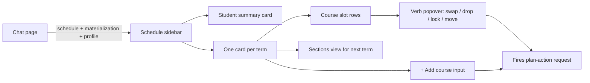
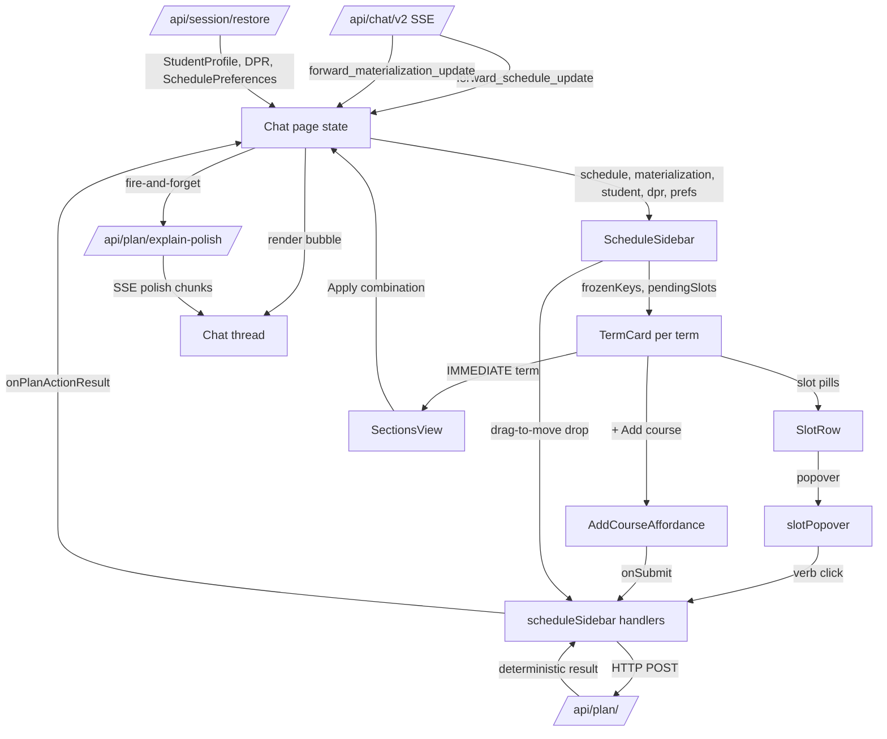

# UI Components

> Last verified against code: 2026-06-10 (post planning-engine rebuild, PRs #35-#41).

## TL;DR

This is everything the student sees on screen — the landing page, the chat thread, and especially the sidebar that lives next to the conversation. The sidebar is the dense, interactive part: it shows a card per academic term, each with the courses planned for it, the credit total, and a row of little pill-shaped buttons for actions like swap, drop, lock, or move. The student can drag a course from one term to another, click a slot to open a verb menu, or type a new course id into a free-form "+ Add course" input. For the very next term, if section times have been loaded, the sidebar swaps the basic course list for a richer "Sections" view showing meeting patterns, instructors, and CRNs. The whole sidebar is a pure reflection of state piped in from the chat page — it never fetches its own data, just renders what's handed to it.

---

## Overview

The chat UI is a Next.js app with three layers:

1. The Next.js root layout (`app/layout.tsx`) — `<html>` and `<body>` plus global metadata.
2. The marketing landing page (`app/page.tsx`) — static hero, features, footer, with a link to `/chat`.
3. The chat experience, which is split into a page-level orchestrator and a live sidebar that mirrors the student's forward schedule as the conversation drives changes.

This doc focuses on the sidebar tree, which is the densest and most stateful part of the UI. The sidebar receives schedule snapshots from the chat page (which streams them out of the chat v2 SSE channel) and renders per-term cards. Each card lists slots with verbs (Swap / Drop / Lock / Move) plus an inline `+ Add course` affordance. When the IMMEDIATE term has materialized section data, the structural slot list is swapped for a Sections view.

## The chat sidebar — `app/chat/scheduleSidebar.tsx`

The single live component that owns sidebar state. It is rendered by the chat page when the user opens the sidebar.

### Props received (`scheduleSidebar.tsx:75`)

| Prop | Source | Purpose |
|---|---|---|
| `schedule: ForwardSchedule \| null` | chat page's `forward_schedule_update` SSE handler | The plan to render |
| `student: StudentProfile \| null` | chat page's session restore | Drives the SummaryCard |
| `dpr: DegreeProgressReport \| null` | chat page (loaded via login restore) | Drives the SummaryCard credit/GPA fields |
| `materialization: ForwardMaterializationPayload \| null` | chat page's `forward_materialization_update` SSE handler | Drives the IMMEDIATE-term Sections view |
| `schedulePreferences: SchedulePreferences \| null` | chat page (loaded via `/api/session/restore`) | Walked to compute frozen slot keys |
| `open: boolean` | chat page | Sidebar visibility |
| `onClose` | chat page | Close button handler |
| `onProposeLoadStyle` | chat page | Balanced / Frontload / Backload pill clicks |
| `onProposeSlotChange` | chat page (legacy) | No-op shim from the older slot-action verb set |
| `onPlanActionResult` | chat page | Fires after every deterministic plan-action route — the page renders an inline `plan_action_bubble` message in the chat thread from this |
| `onConfirmCombination` | chat page | Apply-combination button inside the Sections view |
| `onRefreshDpr` | chat page | Update-DPR file picker handler |
| `onClearAll` | chat page | Test-only Clear button handler |

### Event subscription model

The sidebar itself does not subscribe to any event source — it is a pure render of its props. The chat page subscribes to the v2 SSE stream and forwards two relevant payload kinds into the sidebar:

- `forward_schedule_update` → updates the `schedule` prop.
- `forward_materialization_update` → updates the `materialization` prop.

The schedule preferences arrive separately via the per-mount restore call.

### Local state held inside the sidebar

- `openPopover: string \| null` — which slot's verb popover is open.
- `openSubmenu: { key, verb } \| null` — which submenu inside that popover (Swap candidates or Move targets) is open.
- `pendingSlots: Set<string>` — keys of slots with an in-flight plan-action round-trip. Drives per-row spinners.
- `pendingSince: number \| null` — first-spinner-on timestamp. Used to gate a sidebar-bottom "Validating plan change..." toast.
- `showToast: boolean` — whether the sidebar-bottom toast is currently rendered. Becomes true 600ms after `pendingSince` is set (constant `SIDEBAR_TOAST_THRESHOLD_MS = 600` at `scheduleSidebar.tsx:55`); becomes false the instant `pendingSlots` drains.
- `addCourseDraft: Map<term, string>` — the open Add-course inputs per term and their current draft text.
- `dragSourceRef: ref<{ courseId, term }>` — the slot the user started dragging.
- `dropTargetTerm: string \| null` — the term card currently highlighted as a drop target.
- `selectedComboIdx: number` — which proposal index is selected in the Sections view. Reset to 0 on every `materialization.computedAt` change.
- `refreshing: boolean` — Update-DPR in flight.

### Slot key derivation

A slot's stable identity key is `${term}::${courseId}` for concrete slots; placeholders use `${term}::placeholder(${category})` so a swap on a placeholder still surfaces a spinner (`scheduleSidebar.tsx:222`).

### Frozen keys

A `frozenKeys` set is derived via `useMemo` from `schedulePreferences.pins[]` — each pin contributes `${pin.term}::${pin.courseId}` (`scheduleSidebar.tsx:193`). This set is passed to every TermCard and is what makes the Lock/Unlock label inside a popover bidirectional.

### Plan-action handlers

Every verb is wired to a deterministic POST endpoint via the `planActionClient`:

- `handleLockToggle` → `planLock` with `locked: !wasFrozen` (`scheduleSidebar.tsx:280`).
- `handleDrop` → `planDrop` (`scheduleSidebar.tsx:300`).
- `handleSwap` → `planSwap` with `{ drop, add, term }` (`scheduleSidebar.tsx:319`).
- `handleMove` → `planMove` with `{ courseId, fromTerm, toTerm }` (`scheduleSidebar.tsx:344`).
- `handleAddCourseSubmit` → `planAdd` with `{ courseId, term }` (`scheduleSidebar.tsx:367`).

Each handler does the same shape of work: derive a slot key, mark it pending (which lights up the spinner and may start the toast timer), call the deterministic route, then announce the result. The result is announced via a small helper that logs by category (clean / trade-offs / refusal / error) and bubbles up through `onPlanActionResult` so the chat page can render an inline confirm bubble. Always clears the pending flag and closes the popover in `finally`.

### Drag-and-drop

The sidebar implements three drag interactions:

- **Slot pill `onDragStart`** — captures `{ courseId, term }` into a ref and sets `application/x-nyupath-slot` dataTransfer with effect "move" (`scheduleSidebar.tsx:408`).
- **Term card `onDragOver/onDrop`** — when the drop target term differs from the source term, calls `planMove` (`scheduleSidebar.tsx:440`).
- **Slot `onDragOver/onDrop`** — when the drop target is another slot, calls `planSwap` (same-term drops use the `{ drop, add, term }` form; cross-term drops use the `exchanges: [...]` form with both ends specified) (`scheduleSidebar.tsx:470`).

### Top-level chrome

- Header with title and close button (`scheduleSidebar.tsx:542`).
- Optional toolbar with an "Update DPR" file picker that triggers `onRefreshDpr` (`scheduleSidebar.tsx:546`).
- Empty state ("No plan yet...") when neither a student nor a schedule is loaded (`scheduleSidebar.tsx:570`).
- Otherwise the body: `SummaryCard`, schedule meta line ("Targeting graduation in ... · N credits per semester"), load-style pills (Balanced / Frontload / Backload), state banners (trade-offs / infeasibility / student-preferred-invalid), `PriorCreditsCard`, and one `TermCard` per term bucket.
- The body invokes `groupCoursesByTerm` (from `lib/groupCoursesByTerm`) to produce `{ priorCredits, terms }` from the student + schedule + DPR.
- Sidebar-bottom toast (`scheduleSidebar.tsx:691`) — renders only when `showToast && pendingSlots.size > 0`. Includes a spinner and "Validating plan change…" copy.
- Test-only Clear button at the bottom when `NEXT_PUBLIC_ENABLE_TEST_CLEAR === "1"` (`scheduleSidebar.tsx:700`).

### Load-style pills

Three constants at `scheduleSidebar.tsx:41`:
- Balanced — propose a balanced credit load across all semesters.
- Frontload — heavier early, lighter later.
- Backload — lighter early, heavier later.

Clicking a pill calls `onProposeLoadStyle` with the value.

### State banners

Three banners stack above the term cards depending on `schedule.state`:
- `valid-with-trade-offs` + at least one assumption → trade-offs banner, listing the first five assumptions via `assumptionLabel` (`scheduleSidebar.tsx:602`).
- `infeasible-draft` → infeasibility banner, listing the first five constraint violations from `feasibility.constraintViolations` (`scheduleSidebar.tsx:612`).
- `student-preferred-invalid-draft` → student-preferred banner (`scheduleSidebar.tsx:622`).

### Env flags

Two helpers (`scheduleSidebar.tsx:28`, `scheduleSidebar.tsx:36`):
- `isTestClearEnabled()` reads `NEXT_PUBLIC_ENABLE_TEST_CLEAR === "1"` — surfaces the bottom Clear-all-data button.
- `isLlmPolishEnabled()` reads `NEXT_PUBLIC_PLAN_CHANGE_LLM_POLISH === "1"` — kept here as the single source of the env-flag check, even though the page is the actual consumer. The sidebar references it via `void` so the import isn't pruned.

## TermCard — `app/chat/sidebar/TermCard.tsx`

Renders one term bucket. Owns the drop-target plumbing at term-card level, the assumption/notes list, the structural slot list (or the Sections-view swap-in), and the per-term `+ Add course` affordance.

### What it decides

- `matApplies` — true when this card is the IMMEDIATE term AND a materialization payload exists AND its target term matches this card's term (`TermCard.tsx:79`).
- `showSectionsView` — true when `matApplies && materialization.state === "full" && materialization.semester` is set. When true, the slot list is replaced by the Sections view (`TermCard.tsx:84`).
- `showBanner` — true when `matApplies` but the materializer state is `partial` or `unavailable`. The card shows a status message instead of section data (`TermCard.tsx:87`).
- `headerCredits` — taken from `forwardSemester.plannedCredits` when a forward semester exists, otherwise summed from the bucket's slots via `slotCredits` (`TermCard.tsx:90`).
- `isDropEligible` — true when the bucket is not locked. Locked buckets (history / completed) stay read-only (`TermCard.tsx:97`).
- `showAddCourse` — true when the term is non-locked AND a forward semester exists. IP terms don't get an Add-course button (`TermCard.tsx:103`).

### Structure rendered

1. A `<section>` with class names derived from locked / drop-target state (`TermCard.tsx:106`).
2. Header row: term label (via `formatTermLabel`) and the credit total.
3. Optional notes list pulled from `forwardSemester.notes`.
4. Optional materialization banner if `showBanner`.
5. Either the Sections view (`renderSectionsView`) or the slot list (one `SlotRow` per slot in the bucket). Slot keys are derived as `${semIdx}-${slotIdx}` for the local popover key and `slotKeyOf(slot, bucket.term)` for the global pending/frozen sets.
6. Optional `AddCourseAffordance` if `showAddCourse`.

A slot is draggable when it is not locked AND has a concrete `courseId` — i.e. specific-planned, in-progress, or completed slots. Placeholders are not draggable (`TermCard.tsx:152`).

## SectionsView — `app/chat/sidebar/SectionsView.tsx`

Exports `renderSectionsView(materialization, selectedIdx, setSelectedIdx, onConfirmCombination)`. Not a component class — just a renderer function so TermCard can call it inline.

### When it runs

Only when TermCard has decided `showSectionsView` is true: the materialization payload's state is `full` and there is a `semester` block.

### What it renders

1. `<h4>` heading "Sections" (`SectionsView.tsx:36`).
2. Combination picker: a row of tab buttons, one per proposal. Each button is labeled with its index (1-based) and has a tooltip `Combination N (weeklyHours h/wk)`. The active tab gets an extra CSS class (`SectionsView.tsx:37`).
3. For each section in the selected proposal: a card with the course id, course title (from the semester's courses, falling back to the section's own title), section meta line (`CRN ${crn} · ${schd} · §${section}`), meeting patterns (formatted by `formatPatterns` from `formatMeetingPatterns.ts`, or the literal `"Asynchronous"` when `section.isAsynchronous` is true), and instructor (defaulting to "Staff" when missing) (`SectionsView.tsx:54`).
4. Optional "Apply combination" button — only when `onConfirmCombination` is passed (`SectionsView.tsx:82`).
5. Optional truncated-note line when `semester.combinationsTruncated` is true, telling the user there are more conflict-free combinations than what's shown (`SectionsView.tsx:91`).

If `proposals` is empty, the renderer instead shows the materializer's `message` inside a banner.

## AddCourseAffordance — `app/chat/sidebar/AddCourseAffordance.tsx`

Per-term `+ Add course` UX. Receives the term's current draft from the parent (`undefined` = closed, string = open with current contents).

### Closed state

Renders a single pill-style `+ Add course` button. Clicking calls `onOpen(term)` (`AddCourseAffordance.tsx:44`).

### Open state

Renders:
1. An auto-focused text input with placeholder `e.g. CSCI-UA 480`. `onChange` calls `onChange(term, value)`. `onKeyDown` handles Enter (calls `onSubmit`) and Escape (calls `onClose`) (`AddCourseAffordance.tsx:54`).
2. When the trimmed draft is at least 2 characters, a suggestions list. The suggestions come from `gatherSuggestions(schedule, draft)` — the parent injects this. The current implementation is a client-side prefix match over the courses already in the schedule (V1 stub; the eventual `/api/v2/search-courses`-backed version slots in here). Each suggestion is clickable and replaces the draft (`AddCourseAffordance.tsx:66`).
3. An "Add" submit button (disabled when the trimmed draft is empty) and a "Cancel" button (closes the input).

## SlotRow — `app/chat/sidebar/SlotRow.tsx`

Renders one slot pill inside a term card's slot list.

### CSS classes

The `<li>` accumulates classes for: the slot kind, the optional flag (placeholder + optional), locked vs clickable, tier tint (via `slotTierClassName`), draggable, frozen (`SlotRow.tsx:65`).

### Title text

- Locked → "Completed — locked".
- Frozen → "Locked — click to unlock or drag to move (the lock will travel with it)".
- Otherwise → "Click to open verbs · drag to move".

### Inner content

`renderSlotInner(slot)` from `slotRenderHelpers.tsx` does the rendering — see below. Then either a spinner (when `isPending`) or the grade cell (via `slotGradeText(slot)`). Then an optional lock-icon span (🔒 for locked or frozen).

### Popover trigger

When `isOpen && !isLocked`, the row appends `renderSlotPopover(...)` with the slot, term, frozen flag, submenu state, the parent's submenu toggle, the schedule, and the handler bundle.

### Drag handlers

Wired when `isDraggable` is true (the slot has a concrete courseId AND is not locked):
- `onDragStart` — captures the slot.
- `onDragOver` — accepts drops from other slots.
- `onDrop` — receives a drop target object `{ courseId, term }` from the source ref via the parent's plumbing.

## slotPopover — `app/chat/sidebar/slotPopover.tsx`

The 4-verb popover. `SLOT_VERBS` constant at `slotPopover.tsx:23`:

| Verb | Label | Submenu? |
|---|---|---|
| swap | "Swap with…" | yes |
| drop | "Drop" | no |
| lock | "Lock / Unlock" | no (but the label flips to "Unlock" when the slot is frozen) |
| move | "Move to…" | yes |

The popover renders one button per verb. Clicking Swap or Move toggles the matching submenu; clicking Drop fires `handlers.onDrop`; clicking Lock fires `handlers.onLock` (the parent decides direction from `isFrozen`).

### Swap submenu

`renderSwapSubmenu` (`slotPopover.tsx:76`) shows:
- An "Alternatives" header and a list of buttons, one per candidate course id from `gatherSwapAlternatives` (described below).
- An "Or search…" header followed by `SwapFreeSearch` — a small inline text input with an Enter handler and a Swap button.

### Move submenu

`renderMoveSubmenu` (`slotPopover.tsx:139`) shows either:
- "No eligible terms" header when there are no targets.
- A list of buttons labeled with each target term (via the local `formatTermLabel` helper at `slotPopover.tsx:248`).

### `gatherSwapAlternatives`

Walks the entire forward schedule. For a slot that has `satisfiesRules` (specific_planned or placeholder), collects course IDs from other slots that share at least one rule. For slots without rules (completed / in-progress), falls back to "other concrete slots in the same term". Skips the slot's own course id, dedupes, and caps at five (`slotPopover.tsx:175`).

### `gatherMoveTargets`

Walks the schedule's semesters, returns the terms of all non-locked semesters except the source term (`slotPopover.tsx:211`).

### `gatherAddCourseSuggestions`

Exported and consumed by AddCourseAffordance. Walks the schedule and returns concrete course IDs that start with the uppercase-trimmed draft. Requires 2+ characters; dedupes; caps at five (`slotPopover.tsx:228`).

## slotRenderHelpers — `app/chat/sidebar/slotRenderHelpers.tsx`

Two pure helpers consumed by SlotRow.

### `slotGradeText(slot)` — `slotRenderHelpers.tsx:16`

- `completed` → the letter grade (`slot.grade`).
- `in_progress` → `"IP"`.
- `specific_planned` and `placeholder` → em-dash (`"—"`).

### `renderSlotInner(slot)` — `slotRenderHelpers.tsx:33`

Returns the icon + identifier + optional title + credits for each slot kind:

- `completed` → `✓ ${courseId} ${optional title} ${credits}cr`.
- `in_progress` → `⏳ ${courseId} ${optional title} ${credits}cr`.
- `specific_planned` → `📅 ${courseId} ${optional title} ${credits}cr ${optional ⚠ for petition}`.
- `placeholder` → `○` (optional) or `●` (required), then the category name, then `${credits}cr` with an inline ` · optional` tag when the placeholder is optional.

The title span is rendered only when `title` is present and differs from the course id.

## SummaryCard — `app/chat/sidebar/SummaryCard.tsx`

Top-of-sidebar identity + degree progress widget.

### What it pulls from where

- **Name** — prefers `dpr.header.studentName` if present; otherwise falls back to the trimmed `student.id`; otherwise the literal `"Student"` (`SummaryCard.tsx:28`).
- **Programs** — formatted from `student.declaredPrograms` as `${programType} ${programId}` joined by commas (`SummaryCard.tsx:32`).
- **School** — `student.homeSchool` upper-cased.
- **Visa** — formatted via `formatVisa(student.visaStatus)`.
- **GPA** — `dpr.cumulative.cumulativeGpa` if available, rendered to three decimals.
- **Credits earned vs required** — `dpr.cumulative.creditsUsed` and `creditsRequired`.
- **Progress percentage** — `creditsUsed / creditsRequired * 100`, clamped to [0, 100].
- **Graduation label** — `formatTermLabel(schedule.graduationTerm)` if a schedule exists, else `"TBD"`.

### Structure rendered

1. `<h3>` with the name.
2. Meta row joining programs / school / visa with ` · `. Skipped if all are empty.
3. GPA + credits row. Each half renders only when its source is non-null; the ` · ` separator only appears when both halves render.
4. Graduation row.
5. A progress bar (`role="progressbar"` with proper ARIA attributes) that renders only when both credit numbers were available.

Each field gracefully degrades when its source is unavailable — missing values drop their row entirely instead of showing "null" or "0".

> Known limitation: the `student` prop is reconstructed **client-side from the raw DPR** by the chat page (`buildStudentProfileFromDpr`, with `visaStatus` forced to `"domestic"` unless the page captured `"f1"`). It does not carry the server's authenticated `studentId` or any home-school / program overrides, so these identity fields can disagree with the server-side profile. See [chat-ui-client.md](./chat-ui-client.md) "Known limitations".

## PriorCreditsCard — `app/chat/sidebar/PriorCreditsCard.tsx`

Renders the AP/IB/transfer (TE) credits as a single card above all term cards.

### Behavior

- Renders nothing when `entries` is empty (`PriorCreditsCard.tsx:19`).
- Otherwise: a card with header "Prior Credits" and the total credit count, then a list with one row per entry.
- Each row has a ★ icon, the course id, an optional source label (rendered only when the source differs from the course id), and the credit count. The `<li>`'s `title` attribute is set to the source string.

There is no grade column — TE rows in PeopleSoft don't carry a letter grade.

## Layout structure

### `app/layout.tsx`

Tiny root layout. Exports a `metadata` object with `title: "NYU Path — AI Course Planner"`, a description, and an inline SVG `🎓` data-URI favicon. The default export is a `RootLayout` component that wraps its `children` in `<html lang="en">` and `<body>`. Imports `./globals.css` so all routes inherit the global stylesheet.

### `app/page.tsx`

The marketing landing page. Pure server component, no state. Layout:

1. Top nav with `🎓 NYU Path` logo and a "Get Started" link to `/chat`.
2. Hero section with a "AI-Powered Course Planning" badge, a two-line title ("Plan your NYU degree" / "with AI"), a paragraph subtitle, and a primary CTA link to `/chat`.
3. Features section with three cards: "Degree Progress Report Upload" (drop your Albert DPR PDF), "Smart Course Search" (mentions 13,000+ NYU courses), "Degree Tracking".
4. Footer paragraph: "Built for NYU students. Not affiliated with New York University."

Styling comes from `./page.module.css`.

## State flow

The sidebar is a pure renderer of its props plus its local interaction state. Every meaningful schedule change comes in via `schedule` and `materialization` props from the chat page, which in turn derives them from the v2 SSE stream and the session-restore call.

## Known limitations

- **State flows one way.** Server SSE events and `/api/plan/*` HTTP responses flow `route → page → sidebar`. The agent never observes sidebar edits mid-conversation — a slot the student dragged, swapped, or locked in the sidebar is only visible to the agent on the next chat turn, once the persisted `forwardSchedule` is reloaded into the request body. There is no back-channel from the sidebar into the live agent loop.
- **The `plan_action_bubble` text the sidebar's verbs produce is rendered by the chat page via `dangerouslySetInnerHTML` with no sanitization** (the markup transform lives in `page.tsx`, not in the sidebar tree). See [chat-ui-client.md](./chat-ui-client.md) "Known limitations" for the XSS exposure.
- **`gatherAddCourseSuggestions` / `gatherSwapAlternatives` are V1 client-side stubs.** Both only match against course IDs already present in the loaded `forwardSchedule` — they do NOT hit the catalog. The eventual catalog-backed autocomplete (`/api/v2/search-courses`, see [course-catalog-search.md](./course-catalog-search.md)) is not wired in yet.
