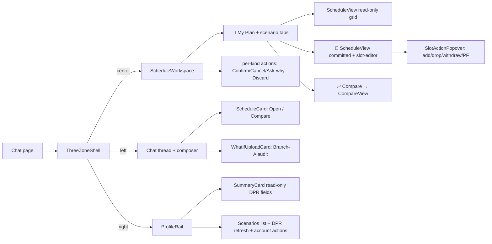

# UI Components

> Last verified against code: 2026-06-19 (Plan 37 — G1+G2 sidebar subtree deleted + helpers relocated; D1 `slotActionMatrix` + F1 `slotActionView` + F2 `SlotActionPopover` + F3 slot-editor mounted on committed plan + F4 per-term `+ Add course` affordance; I4 render-only-valid scenarios; M1/M2 never-commit-invalid + Override retired; H1 visa-mandatory; 8th validator axis; Plan 36 base).
>
> Prior 2026-06-18: Plan 36 — scenarios workspace UI: 3-zone shell, scenario store, ScheduleWorkspace + CompareView + ProfileRail, chat ScheduleCard/WhatIfUploadCard, 3-branch what-if; engine untouched (Plan 37 extends the engine — see forward-schedule.md). Prior 2026-06-16: Phase 4 follow-up F3 (window-aware IP slot-state); Phase 4 E3 (never-instant preview/review card; drag removed). Prior 2026-06-15: Phase 4 E2 (badge row + slot-state glyphs + violet light/dark); 2026-06-10 (post planning-engine rebuild, PRs #35-#41).

## TL;DR

This is everything the student sees on screen — the landing page, the chat thread, and especially the **3-zone workspace** that lives next to the conversation. **Plan 36 replaced the single right-hand "ScheduleSidebar" with a 3-zone shell** (`ThreeZoneShell`): the chat thread becomes a supporting LEFT rail, a tabbed **ScheduleWorkspace** is the CENTER hero, and a profile-only **ProfileRail** is the RIGHT zone. **Plan 37 added a workspace slot-editor**: clicking a `specific_planned` or `in_progress` slot on the committed-plan tab opens a `<SlotActionPopover>` with matrix-gated actions (add/drop/withdraw/pass-fail); each term also shows a `+ Add course` affordance when the term is inside the add/drop window. All edits are **propose-only** — a slot action runs the same pipeline as a chat-driven change and stages a proposed scenario; the only DB commit is the "Confirm — make this My Plan" button. The committed plan ("📌 My Plan") is always anchored as the first tab; every derived schedule is a labeled scenario tab (✓ committed / ⏳ proposed / 🔍 what-if), and you can put **any two** side-by-side in a CompareView with diff highlights. Scenario/compare grids are purely presentational (no popover). The chat thread emits a compact **ScheduleCard** when a scenario is staged (Open / Compare) and a **WhatIfUploadCard** when the agent offers the Branch-A "upload your Albert What-If audit" path. The old `scheduleSidebar.tsx` and its editing subtree (`TermCard`, `SlotRow`, `slotPopover`, `AddCourseAffordance`, `SectionsView`, `PriorCreditsCard`, `slotState`) have been **deleted** (Plan 37 G2). The live shared helpers (`slotRenderHelpers`, `slotTier`, `sidebarFormatters`) now live in `app/chat/shared/`; `SummaryCard` now lives in `app/chat/profile/`.



---

## Overview

The chat UI is a Next.js app with three layers:

1. The Next.js root layout (`app/layout.tsx`) — `<html>` and `<body>` plus global metadata.
2. The marketing landing page (`app/page.tsx`) — static hero, features, footer, with a link to `/chat`.
3. The chat experience — a page-level orchestrator (`app/chat/page.tsx`) that mounts the **3-zone shell**, where the CENTER zone mirrors the student's forward schedule + every derived scenario as the conversation drives changes.

This doc covers the **scenarios workspace tree** (Plan 36 + Plan 37). The chat page subscribes to the v2 SSE stream + plan-action route responses and dispatches them into ONE shared scenario store (`createPlanStore`, see [chat-ui-client.md](./chat-ui-client.md)); the workspace + profile rail render off that single snapshot via `useSyncExternalStore`. **Plan 37** added a workspace **slot-editor**: clicking a `specific_planned` or `in_progress` slot on the committed-plan grid opens a `<SlotActionPopover>` with matrix-gated actions (add/drop/withdraw/pass-fail). All slot actions are **propose-only** — they run the same propose pipeline as a chat-driven change and stage a proposed scenario; the only DB commit is the "Confirm — make this My Plan" button. Drag and the sidebar ⋯-menu remain gone; `completed` and `placeholder` slots are non-interactive.

> **Engine / R1 / frozen contract.** Plan 36 was **web-only** (engine untouched). **Plan 37** extended the validator with a new **8th axis** (`passFailLimitsRespected` — per-school P/F career cap; owner-approved first deliberate extension of the formerly-frozen 7-axis contract) and added a pure `slotActionMatrix` module — the solver/search/`finalizeForwardSchedule` seam is unchanged. **R1 holds throughout:** a what-if / synthetic schedule is NEVER written to `students.parsed_dpr`; confirming a proposed scenario persists ONLY the `forward_schedule` (via `/api/plan/confirm`); the read-only Branch-A what-if scenario has no `pendingMutationId` and is never confirmable; plan 37 M1 makes both confirm paths return 422 on an infeasible re-solve (prior valid row survives).

## The 3-zone shell — `app/chat/workspace/ThreeZoneShell.tsx`

The live chat layout. `ThreeZoneShell` is a THIN presentational component (`ThreeZoneShell.tsx:55`) that renders a CSS-grid of three zones and is mounted in `page.tsx` (`page.tsx:1879`):

```
┌──────────────┬──────────────────────┬────────────────┐
│  chat (LEFT) │  ScheduleWorkspace   │  ProfileRail   │
│  thread +    │  (CENTER — the HERO) │  (RIGHT)       │
│  composer    │  tabs + scenarios    │  profile-only  │
└──────────────┴──────────────────────┴────────────────┘
```

- The grid columns are `minmax(320px, 1fr) minmax(420px, 1.4fr) minmax(280px, 0.9fr)` (`chat.module.css` `.threeZone` `:31-35`) — desktop-only (≥1100px), no mobile breakpoint.
- Props (`ThreeZoneShell.tsx:42`): `planStore` (the SAME shared store `page.tsx` holds), `onConfirmProposed` + `onAskWhy` (wired to the page's existing confirm round-trip + chat injection), `left` (the chat thread + composer JSX, passed by `page.tsx`), and `right` (the JSX for the RIGHT zone).
- The CENTER zone mounts `<ScheduleWorkspace>` directly; the LEFT and RIGHT zones render the `left` / `right` slots.
- **The RIGHT slot is `<ProfileRail>`** (`page.tsx:2297`), NOT `ScheduleSidebar` — that's the H5 cutover. (The `ThreeZoneShell.tsx` header comment still describes the right zone as "the existing ScheduleSidebar … H5 will repurpose it"; that comment is stale prose — the working code passes `ProfileRail`.)

## ScheduleWorkspace — `app/chat/workspace/ScheduleWorkspace.tsx`

The CENTER hero: a tabbed workspace that shows the committed plan plus any proposed/whatif scenarios and lets the student confirm, cancel, ask-why, discard, or compare them. It reads scenario state via `useSyncExternalStore` (`ScheduleWorkspace.tsx:76`) and holds NO local copy of the scenario list — all writes go through the store.

### Tab bar (`ScheduleWorkspace.tsx:161`)

- A **pinned 📌 "My Plan" committed tab** is always first (`:170`) — no close button.
- One tab per proposed/whatif scenario (`:199`), each badge-colored (via `kindBadgeClass`) with a close ✕ button.
- A `⇄ Compare` toggle (`:243`) — a SIBLING of the tablist (a tablist must contain only `role="tab"` children).
- **NO "+ New what-if" control** — what-ifs are created from chat only (owner decision, plan 36). The committed-plan slot-editor (Plan 37) can trigger Branch-B what-ifs (withdraw/pass-fail) via the popover — but the popover itself is a per-slot UI, not a "+ new what-if" affordance.
- **ARIA tabs pattern (H6):** the tablist owns the ArrowLeft/Right roving-tabindex handler (`handleTablistKeyDown` `:130`); the active tab gets `tabIndex=0` / `aria-selected` and all others `tabIndex=-1`; each tab carries `aria-controls` pointing to the single `role="tabpanel"` body (`:256`). The close ✕ is a real sibling `<button>` (M3 restructure — no `<button>` nested in `<button>`, no hydration warning).

### Body — per-kind action bodies (`ScenarioBody`, `ScheduleWorkspace.tsx:362`)

The body renders the active scenario's header (label + kind badge + verdict glyph), an optional assumption/hedge block, a per-kind action bar, and a read-only `<ScheduleView>` of the scenario's schedule:

| Kind | Action bar | Notes |
|---|---|---|
| **committed** | none — "it IS the plan" | read-only grid; slot-editor popover on `specific_planned`/`in_progress` slots (Plan 37) |
| **proposed** (valid/trade-offs) | **Confirm — make this My Plan** (→ `onConfirmProposed`) · **Cancel** (→ `planStore.discardScenario`) · **Ask why** (→ `onAskWhy`) | shows the assumption/hedge block (`:388`) |
| **proposed** (invalid) | no Confirm — red explanation card only | Plan 37 I4: an invalid proposed scenario shows the red card; no commit path; no Override |
| **whatif** (Branch-B — confirmable) | **Confirm — make this My Plan** · **Discard** | Branch-B what-ifs (withdraw/pass-fail) are CONFIRMABLE per owner decision; valid → Confirm; invalid → red card only |
| **whatif** (Branch-A audit — read-only) | **Discard** only — NO Confirm | Branch-A audit what-ifs are always read-only; `pendingMutationId` absent; adopt by declaring in Albert + uploading a new DPR |

When `compare` is set the body swaps to `<CompareBody>` (`:296`) which resolves the compare pair from the store and renders `<CompareView>`. Empty states cover no-DPR and no-scenario-selected.

The workspace re-exports `kindBadgeLabel` / `kindBadgeClass` / `verdictDisplay` + the `ScenarioKind` type (`:48-49`) so older consumers that imported them from here keep working (the real source is `scenarioBadges.ts`).

## ScheduleView — `app/chat/workspace/ScheduleView.tsx`

A presentational one-schedule term grid (`ScheduleView.tsx:115`). It reuses the shared low-level helpers (`renderSlotInner` / `slotGradeText` from `app/chat/shared/slotRenderHelpers`, `formatTermLabel` / `slotCredits` from `app/chat/shared/sidebarFormatters`, `slotTierClassName` from `app/chat/shared/slotTier`) and applies diff highlights on top.

- Props (`:40`): `schedule`, an optional `diff: AnnotatedColumn` (from `scheduleDiff.ts`), `readOnly` (default false), `singleColumn` (compare columns force a one-term-per-row layout), `onSlotAction` callback, and the slot-editor context props (`dpr`, `campus`, `passFailConfig`, `now`) needed by the popover.
- **Plan 37 F3 — slot-editor on the committed-plan grid.** When `!readOnly` (committed-plan view only), clicking a `specific_planned` or `in_progress` slot opens a `<SlotActionPopover>` with matrix-gated actions (add/drop/withdraw/pass-fail). `completed` slots show a 🔒 glyph and are non-interactive; `placeholder` slots have no popover. The `readOnly` prop suppresses the popover entirely (scenario/compare views remain purely presentational). Each term also renders a `+ Add course` text input (Plan 37 F4) when the term is inside the add/drop window (window-gated per D-2, hedged with a deadline reminder).
- **Diff keying:** `slotCourseKey` (`:107`) delegates to `scheduleDiff.slotKey` so the diff-lookup key is BYTE-IDENTICAL to the key the diff stored (canonical course id for courses, `placeholder:${placeholderId}` for placeholders) — a divergent key would silently drop highlights. `diffClassFor` (`:64`, exported for unit test) maps a course's diff annotation to a CSS-module class (`diff-added` / `-removed` / `-moved` / `-retake`; `same` → no highlight).

## SlotActionPopover — `app/chat/workspace/SlotActionPopover.tsx` (Plan 37 F2)

The presentational per-slot action menu, mounted by `ScheduleView` on `specific_planned` and `in_progress` slots in the committed-plan tab.

- **Purely presentational** — all decision logic is in `slotActionView.ts` (the pure mapper) and the engine's `slotActionMatrix` (imported via `@nyupath/engine/client`). The popover renders whatever buttons the view mapper says to render.
- The popover receives the slot, the pre-computed `SlotActionViewItems[]` from `slotActionView.ts`, and an `onAction(kind)` callback wired to the page's `handleSlotAction`.
- Each action button is enabled/disabled per the matrix + carries a tooltip/hedge string from the view (`hedgeText`). A disabled button still renders (with reduced opacity) so the student can see what actions exist and why they're unavailable.
- **Actions:** `add` (triggers the `+ Add course` affordance for the slot's term), `drop` (calls `/api/plan/drop` → propose pipeline), `withdraw` (calls `/api/plan/whatif` withdraw arm → Branch-B what-if propose pipeline), `passFail` (calls `/api/plan/whatif` pass-fail arm → Branch-B what-if propose pipeline).
- `completed` slots: no popover (locked glyph only). `placeholder` slots: no popover.

## slotActionView — `app/chat/workspace/slotActionView.ts` (Plan 37 F1)

Pure client-side mapper: takes a `SlotActionMatrix` (from `slotActionMatrix()`) and produces `SlotActionViewItem[]` (one per action) with `{ kind, label, enabled, hedgeText }`. No React import, no I/O; unit-tested in node.

- Maps the matrix's `{allowed, reason, hedge}` per action to a display-ready enabled/disabled item + tooltip copy.
- Hedge strings are plain English (e.g. "Typical add/drop deadline for this season — verify with your registrar"). A `canElect:false` action (Tandon P/F) gets a clear "Your school does not allow students to elect P/F" tooltip even though the server is the enforcer.

## Schedule diff — `lib/scenarios/scheduleDiff.ts`

The pure compare engine (`scheduleDiff.ts:164`). `diffSchedules(base, other) → { base, other }` — two `AnnotatedColumn`s for a side-by-side view. PURE: no React, no I/O, no `Date.now()`; reads the engine only via the public barrel (`canonicalizeCourseId`).

- `CourseDiff` is `same | added | removed | moved | retake` (`:55`).
- `slotKey(slot)` (`:86`, exported) is the SINGLE keying source — `placeholder:${placeholderId}` for placeholders, the canonical course id otherwise — shared with `ScheduleView` so highlights can't miss.
- `termOrdinal(term)` (`:389`) = `year*10 + {spring:0, summer:1, fall:2, january:3}`, mirroring the engine's `SEASON_ORD` (J-term follows fall of the SAME label-year, no year rollover) — used for the retake heuristic (a course removed from its base term that re-appears at a strictly later term in `other`).

## CompareView — `app/chat/workspace/CompareView.tsx`

Presentational side-by-side comparison of ANY two scenarios (`CompareView.tsx:58`) — no store reads; all data is passed as props so it is trivially unit-testable.

- Props (`:43`): `left` + `right` (resolved `Scenario`s, either may be the committed anchor), `options` (ALL selectable scenarios for the two pickers), and `onPick(side, id)`.
- Two `<select>` pickers (`:88` / `:114`); the left picker disables the option equal to `right.id` and vice-versa, so the student can never submit a same-scenario pair (the store's `openCompare` throws on equal ids).
- Computes `diffSchedules(left.schedule, right.schedule)` and feeds `d.base` → the left column and `d.other` → the right column (`:65`, `:144` / `:155`); each column is a `singleColumn readOnly` `<ScheduleView>` with a column header (label + kind badge).
- A `DiffLegend` (`:221`) maps each diff color to a description (added / removed / moved / retake).

`CompareBody` in `ScheduleWorkspace.tsx` (`:296`) is the store-connected wrapper: it resolves the pair via `getScenario`, builds the `options` list (committed anchor + `state.scenarios`), and the `onPick` handler keeps the unchanged side stable + guards against equal ids before calling `openCompare`.

## Scenario badges — `app/chat/workspace/scenarioBadges.ts`

Pure shared badge helpers (no React, no I/O) consumed by the workspace, the profile rail, and both chat cards (`scenarioBadges.ts`):

- `kindBadgeLabel(kind)` — `✓ Committed` / `⏳ Proposed` / `🔍 What-if` (`:14`).
- `kindBadgeClass(kind)` — `badge badge-committed` / `badge-proposed` / `badge-whatif` (`:23`).
- `verdictDisplay(verdict)` — `{ glyph, label, className }` for `valid` (✓) / `trade-offs` (⚠) / `invalid` (✗) (`:32`).

## ProfileRail — `app/chat/ProfileRail.tsx`

The RIGHT zone (`ProfileRail.tsx:89`) — profile-only; it **replaces the schedule sidebar's render duties**. The schedule grid + slot editing moved to the CENTER workspace; what-if creation is chat-only (the rail has NO spawn control). It subscribes to the store via `useSyncExternalStore` (`:106`) so the scenarios list re-renders on every mutation, and it holds NO decision logic (badge labels/classes come from `scenarioBadges`; the SummaryCard owns its own field derivation).

Top → bottom (`:123`):
1. A "Your profile" header.
2. **`<SummaryCard>`** (`:135`) — the DPR-derived READ-ONLY fields (home school / major-minor / catalog year / GPA / credits / grad target; CORE RULE 14 — change only via a corrected DPR). It is fed the **COMMITTED schedule** (not an active scenario), so the profile always reflects the authoritative plan, never a hypothetical.
3. The **"↻ Update DPR"** refresh control (`:139`) — the single path to change the authoritative plan (upload a fresh DPR PDF); driven by the page's `onRefreshDpr` + `refreshing` busy state. (On success the page now updates BOTH the committed schedule AND the parsed DPR so the profile fields don't go stale — see [chat-ui-client.md](./chat-ui-client.md).)
4. The **scenarios list** (`ScenarioList`, `:237`) — the committed anchor pinned at top as "📌 My Plan" (✓ committed, NO compare affordance) + one `ScenarioRow` (`:301`) per proposed/whatif scenario (badge-colored; click the row body → `onSelectScenario` → `store.setActive`; the per-row ⇄ Compare → `onCompareScenario` → `store.openCompare("committed", id)`). The select control + the compare control are SIBLINGS (`data-select` / `data-compare`) so neither nests inside the other. A muted placeholder row shows when no DPR is loaded.
5. The privacy note (`:179`) — "Only **My Plan** is saved. Your DPR is never changed … Proposed changes and what-ifs are explorations and are not recorded until you confirm them into My Plan." — plus the STANDING self-serve **Delete my account & data** action (`:189`, always shown to a signed-in student) and the env-gated **⚠ Clear all data** test affordance (`:204`, gated on `NEXT_PUBLIC_ENABLE_TEST_CLEAR === "1"`, read at render time).

## Chat cards — `ScheduleCard.tsx` + `WhatIfUploadCard.tsx`

Two compact card variants the chat thread renders (both presentational — no store reads; the page owns the wiring):

### ScheduleCard — `app/chat/ScheduleCard.tsx`

A `schedule_card` chat-message artifact (`ScheduleCard.tsx:52`): a kind badge + label + an optional one-line summary + a verdict glyph + two buttons — **Open** (→ `onOpen(scenarioId)` → `store.setActive`) and **Compare** (→ `onCompare(scenarioId)` → `store.openCompare` vs committed). It is emitted into the chat thread by `page.tsx` whenever a proposed scenario is staged (the `handlePlanActionResult` / `handleWhatIfResult` feasible path) or a Branch-A what-if scenario is built — built by the pure `buildScheduleCardMessage(scenario, id, timestamp)` (`app/chat/buildScheduleCardMessage.ts:105`), which derives the label (prefers `whatIfAssumption.label`) + summary (prefers the first hedge) from the scenario.

### WhatIfUploadCard — `app/chat/WhatIfUploadCard.tsx`

A `whatif_upload_card` chat-message artifact (`WhatIfUploadCard.tsx:42`) the page renders when the agent offers the Branch-A "explore precisely" path: an "Explore precisely" heading, a body naming the `hypotheticalProgram`, and an **Upload What-If audit (PDF)** button (hidden file input, PDF-only) → `onUpload(file)`. The page's `handleWhatIfAuditUpload` POSTs the audit to `/api/whatif-audit` and builds a READ-ONLY 🔍 what-if scenario (see [chat-ui-client.md](./chat-ui-client.md) for the full flow). Shows a spinner while uploading + an inline error on failure.

---

### Historical note — `scheduleSidebar.tsx` (Plan 37 G2: DELETED)

The old `scheduleSidebar.tsx` and its editing subtree (`TermCard`, `SlotRow`, `slotPopover`, `AddCourseAffordance`, `SectionsView`, `PriorCreditsCard`, `sidebar/slotState.ts`, `lib/groupCoursesByTerm.ts`, `lib/whatIfSlotControl.ts`) were deleted in Plan 37 G2. The live shared helpers (`slotRenderHelpers`, `slotTier`, `sidebarFormatters`) now live in `app/chat/shared/`; `SummaryCard` now lives in `app/chat/profile/`. Editing is CHAT-ONLY — the 3-zone workspace is purely presentational.

### Plan-level badge row — `lib/planBadges.ts` + `PlanBadges` (Phase 4 E2.1)

All derivation lives in `apps/web/lib/planBadges.ts` — `computePlanBadges(schedule, consequences?)` (`planBadges.ts:61`) — a pure, framework-agnostic function unit-tested directly in node (`apps/web/tests/planBadges.test.ts`). It returns four badges:

| Badge | Source | Detail |
|---|---|---|
| **Validity** | `schedule.state` | ✓ for `valid-clean` / `valid-with-trade-offs`; a clearly-marked "✗ Invalid draft" for the two draft states (`infeasible-draft`, `student-preferred-invalid-draft`). |
| **Confidence** | derived (see below) | "✓ Grounded" when not hedged; otherwise "Confidence: hedged — verify with your adviser". |
| **Graduation term** | `schedule.graduationTerm` | Formatted via the deterministic `formatTermLabel` from `app/chat/shared/sidebarFormatters` (e.g. `2027-spring` → "Spring 2027"); unrecognized shapes pass through verbatim — no invention. Rendered with a 🎓 prefix. |
| **Trade-off count** | `consequences?.length ?? 0` | The latest plan-action diff's `consequences[]`, threaded down as a param. |

**Confidence hedge — no-invention derivation (binding §11 / philosophy #3).** There is **no** structured "CAS-approximated" / confidence field on `ForwardSchedule`. So the confidence badge **derives** its hedge only from real engine-produced fields (`planBadges.ts:80-86`): it is hedged when `schedule.optimality` is `"best-effort"` or `"feasibility-unconfirmed"`, OR `schedule.assumptions[]` is non-empty, OR the state is an invalid draft. It computes **no new number** and fabricates **no CAS-coupling claim** — when any of those markers holds, the label carries a "verify with your adviser" hedge.

### Canvas edit-model surfaces — pure helpers (Phase 4 E3)

E3 made "edits are never instant" visible on the canvas. Every plan-action PROPOSES; the page stages the result into the shared store. The decision logic is pure and node-tested; the workspace is a thin consumer.

**The pure helpers (no React import):**
- `apps/web/app/chat/planState.ts` — the shared store has `pendingPreview: PendingPreview | null` (E3.1) and `invalidProposal: InvalidProposalCard | null` (E3.3). They are **mutually exclusive**, and `setForwardSchedule` is the single commit chokepoint that clears BOTH (`planState.ts:149-161`).
- `apps/web/lib/planPreview.ts` — `computePreviewView(committed, preview)` (`planPreview.ts:72`) computes the credit delta (`total` + per-`byTerm`) of the proposed plan vs the committed plan. Pure; tested in `apps/web/tests/canvasPreview.test.ts`.
- `apps/web/lib/reviewCard.ts` — `computeReviewCard(response)` (`reviewCard.ts:82`) derives the verdict (✓ valid / ⚠ valid-with-trade-offs / ✗ invalid) + trade-off lines **strictly** from the engine's `feasible` + `consequences`. `computeInvalidCard(response, verb)` (`reviewCard.ts:163`) builds the red card's binding constraints from `response.conflicts ∪ response.forwardSchedule.feasibility.constraintViolations`. `applyReviewConfirm` / `applyReviewCancel` (`reviewCard.ts:223`/`247`) are the store-mutating, injectable-confirm actions (node-tested in `apps/web/tests/reviewCard.test.ts` / `invalidProposal.test.ts`).
- `apps/web/lib/planActionSurfaces.ts` — `planActionSurfaces(response, verb)` (`planActionSurfaces.ts:64`) is the single decision of which surfaces a response drives: `{ preview, invalidCard, showBubble }`.

## slotRenderHelpers — `app/chat/shared/slotRenderHelpers.tsx`

Two pure helpers consumed by `ScheduleView` (relocated from `sidebar/` to `shared/` in Plan 37 G1).

### `slotGradeText(slot)` — `slotRenderHelpers.tsx:16`

- `completed` → the letter grade (`slot.grade`).
- `in_progress` → `"IP"`.
- `specific_planned` and `placeholder` → em-dash (`"—"`).

### `renderSlotInner(slot)` — `slotRenderHelpers.tsx:33`

Returns the icon + identifier + optional title + credits for each slot kind:

- `completed` → `✓ ${courseId} ${optional title} ${credits}cr`.
- `in_progress` → `⏳ ${courseId} ${optional title} ${credits}cr`.
- `specific_planned` → `📅 ${courseId} ${optional title} ${credits}cr ${optional ⚠ for petition}`.
- `placeholder` → `○` (optional) or `●` (required), then the category name, then `${credits}cr` with an inline ` · optional` tag when the placeholder is optional.

The title span is rendered only when `title` is present and differs from the course id.

## SummaryCard — `app/chat/profile/SummaryCard.tsx`

`ProfileRail` mounts `<SummaryCard>` for the RIGHT-zone profile fields (`ProfileRail.tsx:135`), fed the COMMITTED schedule. It is the identity + degree-progress widget. Relocated from `sidebar/` to `profile/` in Plan 37 G1.

### What it pulls from where

- **Name** — prefers `dpr.header.studentName` if present; otherwise falls back to the trimmed `student.id`; otherwise the literal `"Student"` (`SummaryCard.tsx:28`).
- **Programs** — formatted from `student.declaredPrograms` as `${programType} ${programId}` joined by commas (`SummaryCard.tsx:32`).
- **School** — `student.homeSchool` upper-cased.
- **Visa** — formatted via `formatVisa(student.visaStatus)` from `shared/sidebarFormatters`.
- **GPA** — `dpr.cumulative.cumulativeGpa` if available, rendered to three decimals.
- **Credits earned vs required** — `dpr.cumulative.creditsUsed` and `creditsRequired`.
- **Progress percentage** — `creditsUsed / creditsRequired * 100`, clamped to [0, 100].
- **Graduation label** — `formatTermLabel(schedule.graduationTerm)` if a schedule exists, else `"TBD"`.

### Structure rendered

1. `<h3>` with the name.
2. Meta row joining programs / school / visa with ` · `. Skipped if all are empty.
3. GPA + credits row. Each half renders only when its source is non-null; the ` · ` separator only appears when both halves render.
4. Graduation row.
5. A progress bar (`role="progressbar"` with proper ARIA attributes) that renders only when both credit numbers were available.

Each field gracefully degrades when its source is unavailable — missing values drop their row entirely instead of showing "null" or "0".

> Known limitation: the `student` prop is reconstructed **client-side from the raw DPR** by the chat page (`buildStudentProfileFromDpr`, with `visaStatus` forced to `"domestic"` unless the page captured `"f1"`). It does not carry the server's authenticated `studentId` or any home-school / program overrides, so these identity fields can disagree with the server-side profile. See [chat-ui-client.md](./chat-ui-client.md) "Known limitations".

## Layout structure

### `app/layout.tsx`

Tiny root layout. Exports a `metadata` object with `title: "NYU Path — AI Course Planner"`, a description, and an inline SVG `🎓` data-URI favicon. The default export is a `RootLayout` component that wraps its `children` in `<html lang="en">` and `<body>`. Imports `./globals.css` so all routes inherit the global stylesheet.

### `app/page.tsx`

The marketing landing page. Pure server component, no state. Layout:

1. Top nav with `🎓 NYU Path` logo and a "Get Started" link to `/chat`.
2. Hero section with a "AI-Powered Course Planning" badge, a two-line title ("Plan your NYU degree" / "with AI"), a paragraph subtitle, and a primary CTA link to `/chat`.
3. Features section with three cards: "Degree Progress Report Upload" (drop your Albert DPR PDF), "Smart Course Search" (mentions 13,000+ NYU courses), "Degree Tracking".
4. Footer paragraph: "Built for NYU students. Not affiliated with New York University."

Styling comes from `./page.module.css`.

## State flow (Plan 36)

```mermaid
flowchart TD
    Chat[/api/chat/v2 SSE/] -->|forward_schedule_update / whatif_audit_request| Page[Chat page + createPlanStore]
    Restore[/api/session/restore/] -->|StudentProfile, DPR, prefs, committed schedule| Page
    PlanAPI[/api/plan/whatif · /api/whatif-audit/] -->|scenario| Page
    Page -->|addScenario / setCommitted / setActive / openCompare| Store[(scenario store)]
    Store -->|useSyncExternalStore| Workspace[ScheduleWorkspace]
    Store -->|useSyncExternalStore| Profile[ProfileRail]
    Workspace -->|active scenario| View[ScheduleView read-only grid]
    Workspace -->|compare pair| Compare[CompareView ⇄]
    Workspace -->|Confirm proposed| Confirm[/api/plan/confirm → setCommitted]
    Page -->|schedule_card / whatif_upload_card| ChatThread[Chat thread]
    ChatThread -->|Open → setActive · Compare → openCompare| Store
```

The workspace + profile rail are pure renderers of the one shared `createPlanStore` snapshot. Every meaningful schedule change is dispatched into the store by the chat page (SSE events, `/api/plan/*` responses, `/api/whatif-audit`, slot-editor popover actions), and every consumer re-renders from that single snapshot. Slot-editor actions are **propose-only** — they run the same propose pipeline as a chat-driven change and write the store only through the workspace Confirm chokepoint. The chat path and the slot-editor path use identical routes and confirm mechanics.

## Known limitations

- **Render-state is shared in-session; AGENT visibility is still next-turn.** Since Phase 4 E1.1 the chat page and the workspace/profile rail read ONE shared `createPlanStore` snapshot, so a chat-driven update and a confirm/round-trip write the same state and every consumer re-renders with no server round-trip. What is still next-turn (by design) is the AGENT *seeing* a confirmed change: it becomes visible to the agent on the next chat turn, once the persisted `forwardSchedule` is reloaded into the request body. There is no mid-turn back-channel into the live agent loop. (See [chat-ui-client.md](./chat-ui-client.md) "Known limitations" for the full framing.)
- **Scenarios are session-state, not server-persisted.** Only the committed plan ("My Plan") persists (to `forward_schedules`); proposed/whatif scenarios live in the in-page store. The chat *thread* persists (Phase 4), so the schedule **cards** persist; re-deriving a scenario from a stale card (re-running its `rederive` spec) is a deferred follow-on. **R1:** a what-if / synthetic DPR is NEVER stored — confirming a proposed scenario persists only the `forward_schedule`.
- **Chat bubble markup is rendered by the chat page via `dangerouslySetInnerHTML`** (the markup transform lives in `apps/web/lib/renderMarkdown.ts`). `renderMarkdown` HTML-escapes `&`/`<`/`>` before applying its markdown transforms, so raw HTML is neutralized rather than rendered as live markup.
