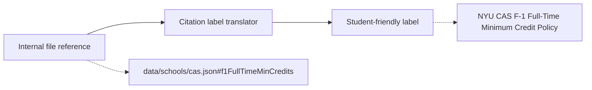

# Citation Labels

> **Source file:** `packages/engine/src/agent/citationLabels.ts`

## TL;DR

Internally, the system tracks where a piece of policy data came from using paths that look like raw file references — useful for engineers, but ugly and confusing for a student to read. When the AI needs to cite a source, it shouldn't say "see data/schools/cas.json line 42" — it should say "see NYU CAS F-1 Full-Time Minimum Credit Policy." This tiny utility is the translator. Give it the internal reference, and it returns a clean, human-friendly label that names the school and what the rule is about. It's the difference between handing a student a debug log versus a properly cited statement they could repeat to an advisor.



---

A tiny utility that converts internal JSON-pointer-style references like `data/schools/cas.json#f1FullTimeMinCredits` into user-facing labels like `"NYU CAS F-1 Full-Time Minimum Credit Policy"`. Used by verifiers (e.g., `verifiers/planFeasibility.ts`) and tools that need to cite policy data without leaking filesystem paths to the student.

---

## 1. The function

```
formatCitation(pointer: string) → string
```

Takes a pointer of shape `data/schools/<school>.json#<field>`. Returns a human-readable label. Never contains filesystem-path characters or hash marks in the output.

---

## 2. The lookup tables

### School display names (closed allowlist)

| Key | Label |
|---|---|
| `cas` | NYU CAS |
| `stern` | NYU Stern |
| `tisch` | NYU Tisch |
| `tandon` | NYU Tandon |
| `steinhardt` | NYU Steinhardt |
| `silver` | NYU Silver |
| `gallatin` | NYU Gallatin |

### Field display names (closed allowlist)

| Key | Label |
|---|---|
| `f1FullTimeMinCredits` | F-1 Full-Time Minimum Credit Policy |
| `maxCreditsPerSemester` | Per-Semester Credit Ceiling |
| `minGraduationCredits` | Minimum Credits for Graduation |

---

## 3. The matching algorithm

The pointer is matched against the regex:
```
^data/schools/([a-z]+)\.json#(\w+)$
```

If it doesn't match, return the fallback label `"NYU policy reference"`.

If it matches, look up the school and field labels. Four cases:

| Has school label | Has field label | Returns |
|---|---|---|
| ✓ | ✓ | `"<school> <field>"` |
| ✓ | ✗ | `"<school> policy"` |
| ✗ | ✓ | `"NYU <field>"` |
| ✗ | ✗ | `"NYU policy reference"` |

The partial-knowledge fallbacks let the system gracefully degrade when a new school config or new field is shipped before the dictionary is updated — the student still sees a useful label rather than an opaque generic.

---

## 4. Why this exists as its own module

Three reasons the code shows:

1. **No filesystem paths in user-facing output.** Citations need to surface where data came from without exposing internal file structures.
2. **Verifier-friendly.** Verifiers like `planFeasibility.ts` build violation messages that include citations; they call this helper rather than each owning their own labeling logic.
3. **Add-new = one row.** Adding a new school or field is a one-line change to a record literal, no logic changes.

---

## 5. Where it's called

Currently the production callers are:

- `agent/verifiers/planFeasibility.ts` — uses `formatCitation` when building violation `detail` strings about per-semester ceiling and F-1 floor breaches.

Other modules can adopt it incrementally.
