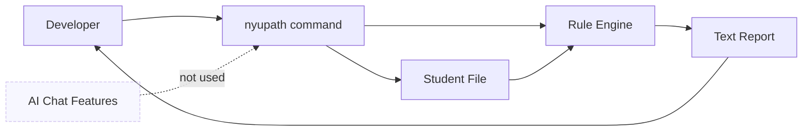
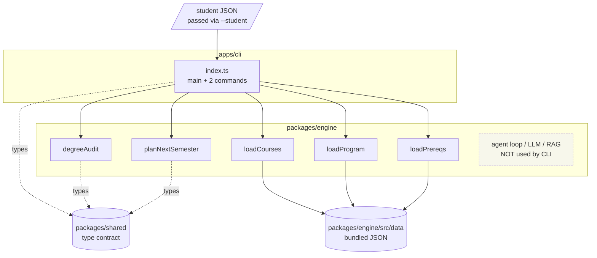

# `apps/cli` — Command-Line Front-End for the NYUPath Engine

> DEPRECATED — documents code REMOVED from the codebase (see [README.md](README.md) in this folder). Kept for history; do not trust as current.

## TL;DR

The CLI is a small debugging tool, not the main product students use. It is a one-file command-line program that lets a developer point at a student record on disk and quickly see either a degree audit or a single-semester course suggestion. It exists so engineers can sanity-check the engine's rule logic without spinning up the web app, the chat agent, or any AI machinery. Everything happens in a single shot: read a file, run the calculation in memory, print a nicely formatted report, exit. There is no conversation, no memory between runs, and no connection to AI models or databases. Think of it as a flashlight for poking at the rule engine during development, not something a student would ever touch. If you need the full conversational planning experience, that lives in the web app instead.



---

## 1. Overview

`@nyupath/cli` is a thin executable wrapper around the engine package. It exposes the engine's two non-agentic entry points — the rule-based degree audit and the single-semester planner — as a Unix-style command. There is no LLM, no conversation, no HTTP server: the CLI reads a student JSON file off disk, calls the engine in-process, and prints a pretty-formatted text report.

The whole tool is a single file (`/Users/edoardomongardi/Desktop/Ideas/NYU Path/apps/cli/src/index.ts`, 192 lines) plus a `package.json` declaring a `nyupath` bin shim. There are no subcommand modules, no argument-parsing library, no persistence, and no session state — everything runs to completion in one process.

The package (`/Users/edoardomongardi/Desktop/Ideas/NYU Path/apps/cli/package.json`) declares:
- `name`: `@nyupath/cli`
- `bin.nyupath`: `./src/index.ts` (the script is invoked via the `#!/usr/bin/env tsx` shebang at line 1)
- `dependencies`: `@nyupath/engine` and `@nyupath/shared`, both as workspace dependencies
- `scripts.audit`: `tsx src/index.ts audit`

So the CLI is shipped as TypeScript that runs through `tsx`, not as a built JavaScript bundle — there is no compilation step before invocation.

## 2. Command Surface

The CLI dispatches off `process.argv[2]` (the first positional argument). Three branches exist:

### 2.1 `audit`

Usage: `nyupath audit --student <path.json> [--program <programId>]`

Runs a full degree audit for the student JSON at `<path.json>` against either:
- the explicitly named `--program <id>`, or
- the first entry in the student's `declaredPrograms[0].programId` (the legacy fallback)

If neither resolves to a real program, the CLI exits non-zero with an error.

The audit itself is delegated entirely to the engine — see `degreeAudit(...)` from `@nyupath/engine` called at `apps/cli/src/index.ts:41`.

### 2.2 `plan`

Usage: `nyupath plan --student <path.json> --semester <YYYY-term> [--program <id>] [--max-courses <n>] [--max-credits <n>]`

Plans the *next* semester (single-term planner — not the multi-term forward planner). The defaults baked into the CLI at `apps/cli/src/index.ts:47-48` are:
- `--max-courses 5`
- `--max-credits 18`

These are CLI-only defaults; the engine itself does not impose them.

The actual planning is delegated to `planNextSemester(...)` from `@nyupath/engine` at `apps/cli/src/index.ts:73`.

### 2.3 Anything else (help)

When `argv[2]` matches neither `audit` nor `plan`, the CLI prints a static help block listing the two commands and their options, and exits 0.

There is no `--help` flag handler, no version flag, no shell-completion output, and no command other than the two above. This is deliberately minimal.

### Argument parsing

There is no `commander`, `yargs`, or `minimist` dependency. The local helper `getArg(args, flag)` at `apps/cli/src/index.ts:98-102` does a literal `args.indexOf(flag)` and returns the next token. Consequences:
- Flags are space-separated; `--program=value` is NOT recognized.
- Flag order does not matter, but the value must be the token immediately after the flag name.
- Unknown flags are silently ignored — `getArg` returns null when the flag is absent.

## 3. How It Wires the Engine

The CLI uses four engine exports plus the type re-exports from `@nyupath/shared`:

```
imports (apps/cli/src/index.ts:7-9)
  @nyupath/shared    → StudentProfile, AuditResult, SemesterPlan (types only)
  @nyupath/engine    → degreeAudit, planNextSemester, loadCourses, loadProgram, loadPrereqs
```

These five engine functions are the *pure* (non-LLM) surface of the engine — they read JSON off disk and return structured results. Importantly, the CLI does **not** touch any of the agent infrastructure:
- No `runAgentTurn`, no `buildDefaultRegistry`, no `buildSystemPrompt`.
- No `LLMClient`, `AnthropicEngineClient`, `OpenAIEngineClient`.
- No RAG, no policy templates, no semantic course search.
- No session, no DPR upload, no FOSE materializer.

The CLI is the rule-evaluator-only slice of the engine, packaged for command-line consumption. Everything else (the chat agent that backs the web app) lives in the engine but is unreachable from the CLI.

### Wiring sequence

```mermaid
flowchart LR
    A[argv parse] --> B{command}
    B -->|audit| C[loadStudent JSON]
    B -->|plan|  C
    C --> D[loadCourses from engine bundle]
    D --> E[loadProgram programId catalogYear]
    E --> F{plan only}
    F -->|yes| G[loadPrereqs]
    F -->|no| H[degreeAudit]
    G --> I[planNextSemester]
    H --> J[printAuditResult]
    I --> K[printPlanResult]
```

The student file path is the only data the CLI reads from outside the engine bundle. `loadCourses`, `loadProgram`, and `loadPrereqs` all pull JSON from `packages/engine/src/data/` (which is shipped as part of `@nyupath/engine`) — they are not parameterized on a data root.

### Program resolution

For both commands the same resolution rule applies (`apps/cli/src/index.ts:26-39, 60-71`):

1. If `--program <id>` was passed, use it.
2. Otherwise read `student.declaredPrograms[0].programId` and use that.
3. If still no programId, print an error and exit 1.

The lookup at `loadProgram(targetProgramId, student.catalogYear)` returns the program JSON for that `(programId, catalogYear)` pair. If the engine cannot find a matching program file, it returns null and the CLI exits 1 with `Program "<id>" (catalog year <year>) not found.`

## 4. Input / Output Flow

### Input

A single student JSON file passed via `--student <path>`. `loadStudent` at `apps/cli/src/index.ts:93-96` is a one-liner — `JSON.parse(readFileSync(resolve(path), "utf-8")) as StudentProfile`. There is no schema validation; whatever the file contains is cast to `StudentProfile`. A malformed file will fail downstream inside the engine.

The student JSON shape is governed by `StudentProfile` from `@nyupath/shared/types.ts`, which carries:
- `id`, `catalogYear`, `homeSchool`
- `declaredPrograms[]` (each with `programId`, `programType`, etc.)
- `coursesTaken[]` (each with `courseId`, `grade`, `semester`, optional `credits`, `isOnline`, `gradeMode`)
- Transfer/AP credits, generic transfer credits
- Optional `flags`, `visaStatus`, `currentSemester`, suffix-credit counters, `passfailCredits`, `matriculationYear`

### Output

Both branches write formatted plain text to stdout via `console.log`. The CLI uses three classes of visual markers, all in the source as literal Unicode:
- Status icons (`apps/cli/src/index.ts:105-106`): `✅` satisfied, `🔶` in_progress, `⬜` not_started.
- Risk icons (`apps/cli/src/index.ts:147-148`): `🔴` critical, `🟠` high, `🟡` medium, `🟢` low/none.
- Box-drawing characters (`═`, `─`) repeated 60 times as visual dividers.

#### `audit` output structure

Printed by `printAuditResult(...)` at `apps/cli/src/index.ts:104-144`. The block contains:
1. Header card — Program name, Catalog Year, Student ID, Credits completed/required, Overall status with icon.
2. Per-rule list — each `RuleAuditResult` from the audit. For every rule:
   - status icon + label
   - `Completed:` line listing `coursesSatisfying[]` when non-empty
   - `Remaining:` line with the remaining count, plus `Options:` showing `coursesRemaining[]` *only when there are between 1 and 6 of them* (defensive against printing 100-course pools).
3. Warnings block — bullets the engine emitted in `result.warnings[]`.

There is no exit code differentiation between satisfied / unsatisfied audits — the process always exits 0 unless the inputs failed to load.

#### `plan` output structure

Printed by `printPlanResult(...)` at `apps/cli/src/index.ts:146-189`. The block contains:
1. Header card — Student, target semester, estimated semesters left (`~`-prefixed), planned credits, projected total credits.
2. Suggested-courses list — `plan.suggestions[]` numbered 1..N, each showing:
   - `courseId — title`
   - `Credits | Priority | Unlocks: <blockedCount> course(s)`
   - `Reason:` (the engine-generated rationale string)
   - `Satisfies:` listing `satisfiesRules[]` when non-empty
3. Graduation risks — each `GraduationRisk` rendered with its level icon and message.

The CLI shows the "Unlocks N course(s)" hint by reading `CourseSuggestion.blockedCount` — the count of downstream courses transitively gated by the suggested course (semantics owned by the engine).

## 5. Persistence and State

There is none.

- The CLI does not write any files.
- The CLI does not maintain a session between invocations.
- The CLI does not cache anything to disk.
- The CLI does not read `.env` files (the engine's RAG/agent stack does, but the CLI never reaches that code).
- The CLI does not connect to the web app, the DPR uploader, or FOSE.

Each invocation is a one-shot: read student JSON, run engine in-memory, print, exit. This matches the position in the architecture — the CLI is the "deterministic-only smoke test" path; conversational planning is the web app's job.

## 6. Architectural Position



The CLI is a strict subset of the engine's capability. Anything that requires conversation (DPR ingestion, RAG, sectioning, forward planning across many semesters with mutations) is unreachable from `nyupath audit` and `nyupath plan` — those features only ship in the web front-end which wires the agent loop.

## 7. File Reference

| Path | Purpose |
| --- | --- |
| `apps/cli/src/index.ts` | Sole source file; defines `main()`, both commands, both printers, the student loader, and the arg helper. |
| `apps/cli/package.json` | Declares `bin.nyupath`, workspace deps on `@nyupath/engine` and `@nyupath/shared`. |
| `apps/cli/tsconfig.json` | TypeScript compile config (no behavioral effect — runtime uses `tsx` directly). |
