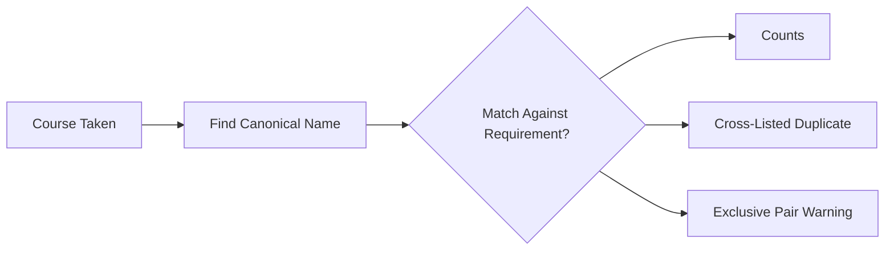
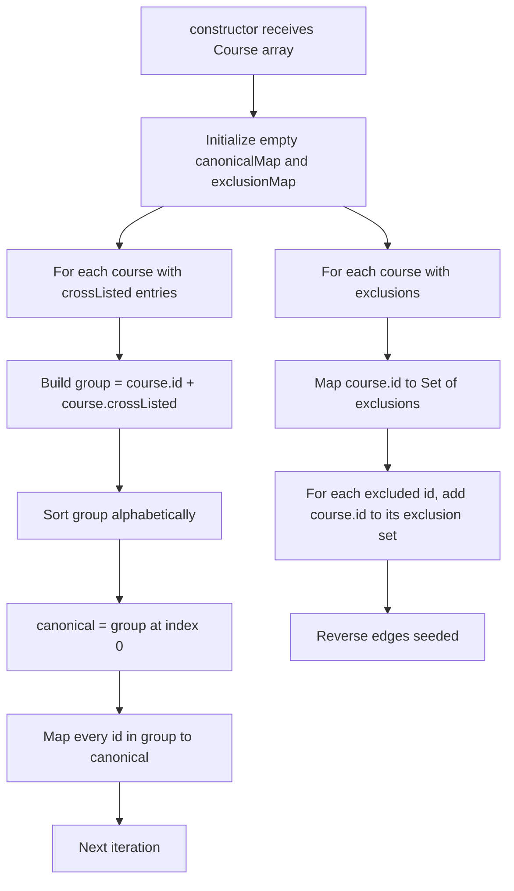

# Equivalence Resolver

## TL;DR

At NYU some courses have multiple names. The same exact class can be listed under two different course codes because different departments cross-list it. There are also "exclusive" pairs where two courses overlap so much that NYU only lets one count toward a major. This subsystem handles both of those quirks. If a student took the class under one name, the engine still recognizes it as completed when checking requirements that name it differently. And if a student took two mutually exclusive courses, it raises a warning that only one will count. It picks a single "canonical" name for each cross-listed group so the rest of the engine can treat that group as one thing without juggling aliases.

---

## Purpose

The equivalence module collapses two course-graph realities NYU's catalog tracks but most callers want abstracted away:

1. **Cross-listings** — the same class taught under multiple course IDs (for example, an NYU course that also bears a legacy department code). When the student has taken one, every cross-listed sibling counts as the same course.
2. **Exclusions** — courses that NYU treats as mutually exclusive for credit. A student can sit through both but only one will count toward CS requirements.

`EquivalenceResolver` is a single class built once from the course catalog. It owns the canonical-id lookup, the exclusion lookup, a normalize step that dedupes a transcript, and a set-membership check that respects cross-listings.

## Interface / shape

`EquivalenceResolver` (equivalenceResolver.ts:6) is a class constructed with the full `Course[]` catalog. Public surface:

| Method | Shape | Notes |
|---|---|---|
| `getCanonical(courseId)` | `(string) -> string` | Returns the canonical id, or the input id unchanged when the course is in no cross-listing group. |
| `areCrossListed(a, b)` | `(string, string) -> boolean` | True iff `a` and `b` share a canonical id and are not the same id. |
| `areExclusive(a, b)` | `(string, string) -> boolean` | True iff `a`'s exclusion set contains `b`. Lookup is one-directional but the constructor seeds the reverse direction (see below). |
| `normalizeCompleted(courseIds)` | `(string[]) -> { normalized: Set<string>, warnings: string[] }` | Walks the transcript, dropping cross-listed duplicates and emitting warnings for cross-list collapses and exclusion violations. |
| `isInSet(courseId, courseSet)` | `(string, Set<string>) -> boolean` | True iff the set contains the id directly OR contains any course with the same canonical id. |

Two private maps back the class:

- `canonicalMap: Map<string, string>` — every member of a cross-list group maps to that group's canonical id (equivalenceResolver.ts:9).
- `exclusionMap: Map<string, Set<string>>` — symmetric: each course points to the set of courses it excludes.

## Algorithm / behavior

### Construction

Canonical id selection is purely lexicographic — the alphabetically first id in the cross-list group wins (equivalenceResolver.ts:18-26). There is no notion of "the prefix XYZ is always primary"; it falls out of string sort order.

Exclusions are stored symmetrically. When the constructor sees `course A excludes B`, it also adds `A` to `B`'s exclusion set (equivalenceResolver.ts:29-40). The catalog only needs to declare exclusions once per pair.

### Normalize a transcript

`normalizeCompleted` walks the input id list in order with two pieces of state: `normalized` (the Set being built) and `seenCanonicals` (a Map from canonical id to the original id that already represented it).

For each input id:

1. Compute its canonical id via `getCanonical`.
2. If `seenCanonicals` already has that canonical *and* the previously-seen original id is different from this one, emit a warning `${id} is cross-listed with ${previous}; counted only once as ${canonical}` and `continue` — the duplicate is dropped (equivalenceResolver.ts:83-89).
3. Otherwise, loop the current `normalized` set and for each `existing` id check `areExclusive(id, existing)`. Any match emits a warning `${id} and ${existing} are mutually exclusive; both taken but only one may count toward CS requirements` (equivalenceResolver.ts:91-98). The id is still added — exclusions surface as warnings, not deletions.
4. Record the id in `seenCanonicals` and `normalized`.

The cross-list dedupe and the exclusion check are separate passes per id: a course can simultaneously be a cross-list of one transcript entry and exclusive with another.

### Set membership respecting cross-lists

`isInSet` first does a direct `courseSet.has(courseId)` check. If that fails, it computes the canonical for the input and walks the entire set, comparing each member's canonical to the input's canonical (equivalenceResolver.ts:110-117). This is O(n) in the set size on miss.

## Inputs / outputs

| Method | Input | Output |
|---|---|---|
| `getCanonical` | course id string | canonical course id string (echoes input when unknown) |
| `areCrossListed` | two course ids | boolean |
| `areExclusive` | two course ids | boolean — directional check, but the constructor symmetrizes |
| `normalizeCompleted` | array of course ids | `{ normalized: Set<string>, warnings: string[] }` |
| `isInSet` | course id, set of course ids | boolean |

## Dependencies

- Imports `Course` from `@nyupath/shared`.
- The constructor expects each `Course` to expose `id`, `crossListed: string[]`, and `exclusions: string[]`.
- No other engine modules are imported.

## Edge cases / failure modes

- A course with `crossListed = []` never enters `canonicalMap`. `getCanonical` for such a course returns the input id unchanged, which means `areCrossListed(a, b)` returns `false` for any pair of non-cross-listed ids (the canonicals would just be `a` and `b`).
- `areCrossListed` rules out the trivial `a === b` case explicitly (`a !== b` clause) so it never reports a course as cross-listed with itself.
- `areExclusive` is *not* symmetric on its own — it only reads `exclusionMap.get(a)`. The constructor's reverse-edge seeding is what makes the call work in either order. Adding exclusions to a resolver post-construction would not seed the reverse.
- `normalizeCompleted` warnings about exclusions still include the conflicting id in the output set. The caller decides how to surface the conflict.
- Iteration order in `normalized` (used by the exclusion check inside `normalizeCompleted`) is JavaScript `Set` insertion order, so warnings come in transcript order.
- Cross-list dedupe uses `seenCanonicals.get(canonical) !== id` to decide whether the duplicate is a true alias or the literal same id appearing twice. If the same id appears twice, no warning fires and the dedupe still drops it (the `seenCanonicals.has(canonical)` branch).
- `isInSet` falls back to scanning the whole set when the direct hit misses — for large sets this is the slow path.
- The class does not expose mutators after construction. To incorporate a catalog change, build a new resolver.

## Where it's consumed

The resolver is the equivalence backbone for any code that compares transcripts to requirements. Typical consumers include:

- DPR ingestion and audit, where one student-id might appear in catalog as a different canonical id and the audit must match either form.
- Program-rule evaluation, where pool membership questions ("does the student satisfy this `choose_n` pool") need to respect cross-listings.
- The planner's "already taken" gates, where retaking under a different cross-listing should not count as new credit.

Concretely, the resolver is the dependency injection point for cross-list-aware set membership in any tool that hands the planner or audit a student's `completedCourses`.
