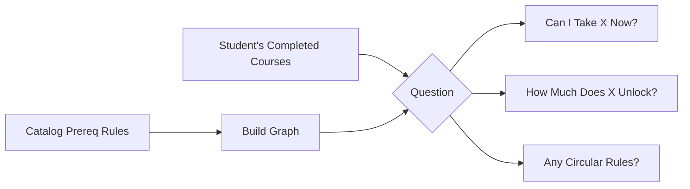
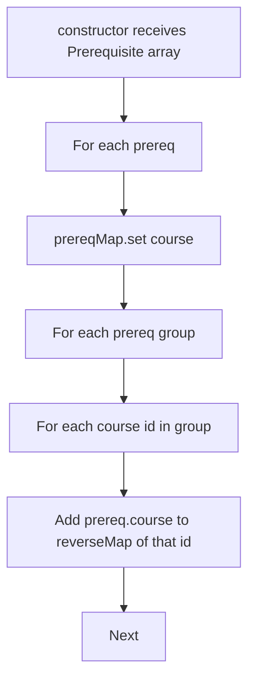
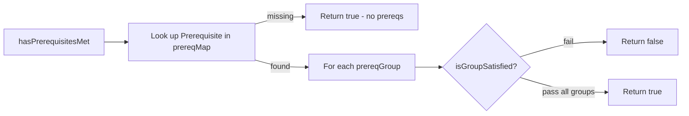
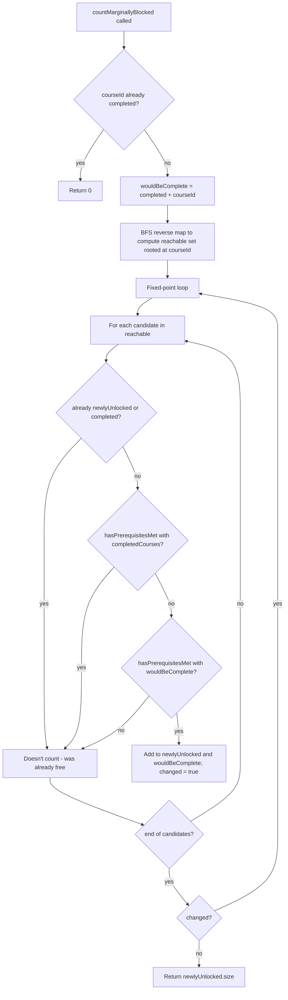

# Prerequisite Graph

## TL;DR

Courses have prerequisites, and prerequisites have prerequisites, and the whole thing forms a web of "you have to take A before you can take B." This subsystem builds that web as a graph in memory and answers three core questions about it. First: can this student take course X right now, given what they've already finished? Second: if they take course X, how many doors does it open downstream? Third (a build-time check): does the catalog itself have any circular requirements that would be impossible to satisfy? The "doors opened" calculation is smarter than just counting; it specifically counts the courses that this class would newly unlock for this particular student, ignoring courses that were already unlocked through some other path. That's what lets the planner pick the highest-impact courses first.

---

## Purpose

`PrereqGraph` builds an in-memory directed graph of course prerequisite relations. It is the structure every planning and audit pass goes through when it needs to ask either "can this student take course X now" or "what does completing course X unlock for this student". It also exposes a cycle detector for build-time validation of the catalog, plus two different downstream-counting metrics: one static (the catalog-wide count) and one student-relative (the marginal unlock count).

## Interface / shape

`PrereqGraph` (prereqGraph.ts:6) is a class constructed with a list of `Prerequisite` objects from the catalog.

Backing state (private):

- `prereqMap: Map<courseId, Prerequisite>` — direct lookup of the prereq definition for any course.
- `reverseMap: Map<courseId, Set<courseId>>` — for each course mentioned inside any prereq group, the set of courses that list it as a dependency. This is the reverse adjacency list used by `getDependents`, `countTransitivelyBlocked`, and `countMarginallyBlocked`.

Public API:

| Method | Shape | Notes |
|---|---|---|
| `detectCycles()` | returns `string[][]` | List of cycles. Empty list means valid DAG. |
| `hasPrerequisitesMet(courseId, completedCourses)` | `(string, Set<string>) -> boolean` | True iff every prereq group is satisfied. Courses with no entry in `prereqMap` return true. |
| `getUnlockedCourses(completedCourses, allCourseIds)` | `(Set<string>, string[]) -> string[]` | The subset of `allCourseIds` that is not already in `completedCourses` and whose prereqs are now met. |
| `getPrereqs(courseId)` | `(string) -> Prerequisite \| undefined` | Direct lookup. |
| `getCoreqs(courseId)` | `(string) -> string[]` | Returns `prereqMap[courseId].coreqs ?? []`. |
| `getDependents(courseId)` | `(string) -> string[]` | Direct dependents (one hop downstream). |
| `countTransitivelyBlocked(courseId)` | `(string) -> number` | Size of the transitive closure of dependents in the static graph. |
| `countMarginallyBlocked(courseId, completedCourses)` | `(string, Set<string>) -> number` | Count of downstream courses that would *newly* unlock for THIS student if `courseId` were added. |

The `Prerequisite` and `PrereqGroup` types come from `@nyupath/shared`. A `PrereqGroup` carries `type` (`AND` / `OR` / something else handled via `notCourses`), `courses`, and optional `notCourses`.

## Algorithm / behavior

### Construction

The reverse-map build is purely forward: it iterates every group and every course id in that group and registers the *defining* course as a dependent (prereqGraph.ts:17-29). Courses referenced from `notCourses` are not included in the reverse map.

### Cycle detection

`detectCycles` runs a recursive DFS with two sets — `visited` (globally seen) and `inStack` (on the current recursion path). When the DFS hits a node already in `inStack`, it slices the path from `cycleStart` to the end and pushes that as one cycle (prereqGraph.ts:35-69). After the recursion returns from a node, `inStack.delete(node)` happens but `visited` is not reset.

One subtle behavior: every course in `prereqMap.keys()` is used as a starting point in turn (prereqGraph.ts:65-67), so a cycle reachable from multiple starts can surface more than once, sliced from different offsets along the cycle.

The recursion clones `path` on each recursive call (`dfs(dep, [...path])`), so each branch maintains its own path snapshot.

### Prereq satisfaction

`isGroupSatisfied` (prereqGraph.ts:216-227) is a dispatch on `group.type`:

- `AND` — every id in `group.courses` is in `completedCourses`.
- `OR` — at least one id in `group.courses` is in `completedCourses`.
- otherwise — treat as a "NOT" group: every id in `group.notCourses ?? []` must *not* be in `completedCourses`.

The "no prereq entry → trivially met" rule means catalog completeness is not required for `hasPrerequisitesMet` to work — but anything missing from `prereqMap` is invisible to the unlock counters as well.

### Static transitive blocking

`countTransitivelyBlocked` runs a BFS over the reverse adjacency map starting at `courseId`. It uses an explicit queue (via `pop` — so the traversal order is LIFO, effectively a DFS, but unordered relative to results) and a `blocked` Set to avoid re-visits. The returned count is the size of the closure, *not* including `courseId` itself (prereqGraph.ts:133-151).

This count is independent of any student's completion state. It answers "how many courses sit downstream of this one in the catalog."

### Marginal unlock — student-aware

`countMarginallyBlocked` (prereqGraph.ts:165-214) is the student-relative metric. It is more expensive than `countTransitivelyBlocked` because it runs a fixed-point expansion:

Two design points are worth calling out:

1. The candidate set is restricted to the **transitive dependents** of `courseId` (the `reachable` set computed up front). Anything outside that subgraph cannot be affected by adding `courseId`, so the loop ignores it.
2. The "was already unlocked WITHOUT courseId" guard prevents over-counting in OR-prereq topologies. For example, when 101 and 110 both unlock 18+ downstream courses but the student has already taken 101, adding 110 would naively look like it unlocks 18 — the guard catches it because those 18 already pass `hasPrerequisitesMet(candidate, completedCourses)`.

The fixed-point loop runs until a full pass produces no new `newlyUnlocked` entries. The loop adds each newly unlocked candidate back into `wouldBeComplete` so cascading unlocks (course B unlocks C unlocks D) all surface in one call.

## Inputs / outputs

| Method | Input | Output |
|---|---|---|
| `detectCycles` | none | `string[][]` |
| `hasPrerequisitesMet` | `courseId`, `Set<completed>` | boolean |
| `getUnlockedCourses` | `Set<completed>`, list of all course ids | string[] |
| `getPrereqs` | `courseId` | `Prerequisite` or undefined |
| `getCoreqs` | `courseId` | string[] (empty when none) |
| `getDependents` | `courseId` | string[] (one hop) |
| `countTransitivelyBlocked` | `courseId` | number (closure size, excludes self) |
| `countMarginallyBlocked` | `courseId`, `Set<completed>` | number (newly unlocked count) |

## Dependencies

- Imports `Prerequisite` and `PrereqGroup` types from `@nyupath/shared`. No other engine modules are imported.
- Stateless after construction — instances are safe to share across requests.

What depends on this module: any planner, audit, or recommendation surface that needs to ask whether a course is takeable or how impactful it would be. The marginal unlock count is the metric a "what to take next" priority system can sort on.

## Edge cases / failure modes

- A course with no entry in `prereqMap` is treated as having no prerequisites — `hasPrerequisitesMet` returns true unconditionally for it (prereqGraph.ts:79-81).
- `getCoreqs` returns `[]` when the course has no `Prerequisite` entry at all. It does not distinguish "no entry" from "entry with no coreqs."
- `detectCycles` can report the same cycle multiple times from different DFS starts; callers that want a unique cycle list need to canonicalize.
- `countMarginallyBlocked` returns `0` when `courseId` is already in `completedCourses`. Re-adding a completed course never unlocks anything new.
- `countTransitivelyBlocked` does not include the seed `courseId` in the count and ignores student completion entirely.
- `isGroupSatisfied` treats anything that is not `AND` and not `OR` as a NOT-group keyed on `notCourses ?? []`. A group with `type === 'AND'` but empty `courses` array trivially returns true via `every` on an empty array — caller must avoid empty AND groups if that is undesired.
- The reverse map only carries forward references from `courses` arrays inside groups; courses referenced only through `notCourses` are not part of the dependents graph.
- DFS in `detectCycles` uses recursion with cloned path arrays — for very deep prereq chains, stack depth could be a concern; the catalog should keep depth reasonable.
- `getUnlockedCourses` is a simple filter over `allCourseIds`; passing a small `allCourseIds` to avoid scanning the whole catalog is the caller's responsibility.

## Where it's consumed

`PrereqGraph` is the prereq oracle. Typical consumers:

- The forward planner uses `hasPrerequisitesMet` and `getUnlockedCourses` to enumerate candidates per term, and `countMarginallyBlocked` to sort candidates by how much they unlock.
- DPR audit logic uses `hasPrerequisitesMet` to detect students who have signed up for courses without prereq satisfaction.
- Build-time tooling and catalog validators use `detectCycles` to guarantee the catalog is a DAG before shipping.
- Tools that need direct lookups (e.g., a "what does this unlock" question) use `getDependents` for one-hop or `countTransitivelyBlocked` for static reach.
