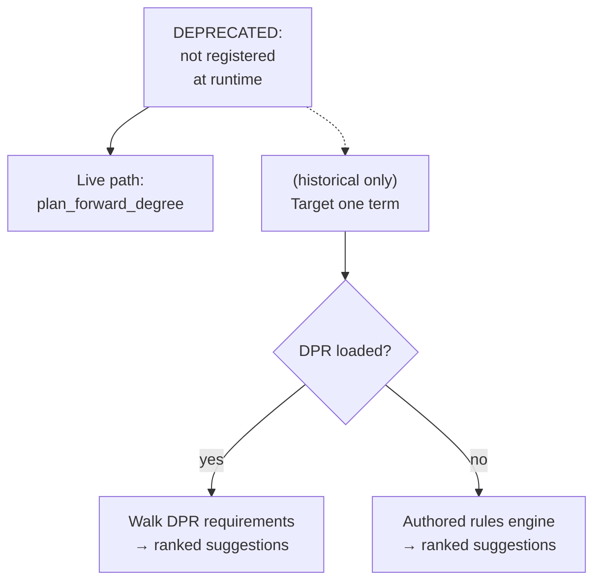

# `plan_semester` — REMOVED (historical)

> **REMOVED (improvement plan, Phase F).** `plan_semester` and its `planFeasibility` verifier have been **deleted** from the source tree (`tools/planSemester.ts` + `verifiers/planFeasibility.ts` are gone, along with the barrel exports and dedicated tests). It had been unregistered since May 2026 and is fully superseded by `plan_forward_degree`, which solves the full remaining-degree horizon (every term to graduation), writes `session.forwardSchedule` for the sidebar, and cooperates with `propose_plan_change` for what-if exploration. `plan_semester` only planned the immediate next term and wrote no schedule.
>
> This document is retained as a **historical record** of the tool's mechanics; the code it describes no longer exists.

Source: `packages/engine/src/agent/tools/planSemester.ts`, with helpers from `packages/engine/src/planner/semesterPlanner.ts`, `packages/engine/src/planner/balancedSelector.ts`, `packages/engine/src/planner/priorityScorer.ts`, and `packages/engine/src/planner/enrollmentValidator.ts`.

---

## TL;DR

**This tool is DEPRECATED and not used at runtime.** It is not registered in the agent's tool list, so the assistant cannot call it — every "plan my next semester" question routes to `plan_forward_degree` instead, which plans the whole remaining degree (not just one term) and writes the result so the sidebar can render it. The code is kept around because test suites and the underlying helpers (credit-fill, suggestion-ranking, enrollment validation) are still imported elsewhere. Historically this tool answered "what should I take next semester?" using one of two paths: a DPR-primary path that walked the official Degree Progress Report's not-yet-satisfied requirements, or an authored-rules fallback that used the local rule engine. Both produced a ranked list of courses with credits, prereq risk, and feasibility warnings. Read this doc only if you're working on legacy tests or rescuing pieces of the algorithm — it's not part of the live experience.



---

## 1. Purpose

`plan_semester` recommends courses for **one** target term. It has two execution paths and chooses dynamically based on what is loaded into the session:

1. **DPR-primary path** (`planSemester.ts:275-593`) — when a parsed NYU Degree Progress Report is present in the session, walk the DPR's not-satisfied requirements, extract candidate course IDs from each requirement's prose, filter against already-taken courses and the credit budget, and return ranked `CourseSuggestion[]`. Honors prereq graph annotations when present. Optionally runs a FOSE offering check when `session.searchAvailabilityFn` is wired.
2. **Authored-rules fallback** (`planSemester.ts:595-607`) — when no DPR is present but the full data trio (`courses`, `prereqs`, `programs`) is loaded, delegate to `planNextSemester(...)` (`semesterPlanner.ts:39`). This is the legacy local rule engine that runs a degree audit, computes unlocked courses, scores them, balanced-selects, and validates enrollment.

It is intentional that the live agent no longer calls this tool — the algorithms below describe a tool that exists only in the codebase, not in the runtime registry.

---

## 2. Input schema

`plan_semester` accepts an object schema (`planSemester.ts:195-218`):

```pseudo
{
  targetSemester:  string,                                       // e.g. "2025-fall"
  maxCourses?:     positive integer,                             // default 5
  maxCredits?:     positive number,                              // default 18
  programId?:      string,                                       // optional; see §3
  graduationTerm?: string,                                       // e.g. "2027-spring"
  loadStyle?:      "balanced" | "frontload" | "backload",        // default "balanced"
}
```

`maxResultChars: 3500` (`planSemester.ts:219`).

---

## 3. Session prerequisites + `validateInput`

`validateInput` (`planSemester.ts:220-264`) applies the following checks in order:

1. **Student must be loaded.** Otherwise: `"I need your transcript or Degree Progress Report first."`
2. **`programId` auto-default + multi-program guard.** Runs BEFORE the DPR-vs-authored split so both paths get the same behavior.
   - If `input.programId` is omitted AND `student.declaredPrograms` is empty: reject with `"You haven't declared a program. Either declare one first or pass an explicit programId."`
   - If `input.programId` is omitted AND `student.declaredPrograms` has exactly one entry: **mutates `input.programId`** to that program's id and continues.
   - If `input.programId` is omitted AND `student.declaredPrograms` has multiple entries: reject with a message listing all declared `programId`s and asking the agent to be explicit.
3. **Path-specific data check.**
   - DPR path: if `session.degreeProgressReport` is set, accept.
   - Authored-rules fallback: requires all of `session.courses`, `session.prereqs`, `session.programs`. If any is missing, reject with `"Required engine data not loaded."`.

`validateInput` modifies the input object in place when auto-defaulting `programId` for a single-program student. This is the only tool in scope that does so.

---

## 4. What it reads

Across both paths, the tool reads:

- `session.student` (asserted non-null after validate).
- `session.degreeProgressReport` — when present, drives the DPR path.
- `session.schoolConfig` — for `maxCreditsPerSemester` (planner ceiling) and `f1FullTimeMinCredits` (F-1 floor).
- `session.prereqs` — used in both paths.
  - DPR path: builds a `prereqIndex` and annotates suggestions with `prereqRisk` for any direct prereq not in `takenIds`.
  - Authored path: passed through to `planNextSemester` and `PrereqGraph`.
- `session.courses` and `session.programs` — only in the authored path.
- An ad-hoc `session.searchAvailabilityFn` (`(termCode, keyword) => Promise<unknown[]>`) cast from `session as unknown`, when present in the DPR path. Used to verify offering availability in the target term.

The DPR path additionally reads from inside the DPR:

- `dpr.requirementGroups` — walked by `notSatisfiedRequirements(...)`.
- `dpr.courseHistory` — used to derive `takenIds` (`subject` + `catalogNbr` joined, filtered to non-`TE` rows or `TE` rows with a non-empty grade), and to compute IP rows for the target term.
- `dpr.cumulative.creditsUsed` and `dpr.cumulative.creditsRequired` (defaults to 128 if absent).

---

## 5. Algorithm

```mermaid
flowchart TD
    A[Input + Session] --> B[validateInput<br/>resolve programId<br/>choose path]
    B -->|DPR present| C[DPR-primary path]
    B -->|DPR absent, full trio| D[Authored-rules fallback]
    C --> C1[notSatisfiedRequirements]
    C1 --> C2[Compute takenIds + IP rows for target]
    C2 --> C3[Compute planBudget = min(maxCredits, schoolCeiling) - ipCreditsForTarget]
    C3 --> C4[Compute hardQuotaForThisTerm via computeHardQuota]
    C4 --> C5[Iterate requirements:<br/>extract candidates, defer or include]
    C5 --> C6[Fill remaining budget with free electives]
    C6 --> C7[Annotate prereqRisk from session.prereqs]
    C7 --> C8[Compute F-1 floor gap]
    C8 --> C9[Run verifyPlanFeasibility, build disclaimers]
    C9 --> C10[Add 'could not fill credits' disclaimer if applicable]
    C10 --> R[Return PlanSemesterOutput with source='dpr']
    D --> D1[Look up program in session.programs]
    D1 --> D2[planNextSemester]
    D2 --> R2[Return + source='authored']
```

### 5.1 DPR-primary path

#### Step 1 — Read not-satisfied requirements + taken courses

`const ns = notSatisfiedRequirements(dpr.requirementGroups)` (`planSemester.ts:277`). This helper flattens the DPR's tree of requirement groups into a flat array of leaf requirements with status ≠ `"satisfied"`.

`const takenIds = new Set(...)` (`planSemester.ts:278-282`). The student's taken-courses set is built from `dpr.courseHistory` filtered to rows where `type !== "TE"` OR `(type === "TE" AND grade !== "")`. Each remaining row contributes `` `${subject} ${catalogNbr}` `` to the set. This means transfer-equivalent (TE) rows without a recorded grade are excluded — they don't count as taken for the purpose of avoiding duplicate suggestions.

#### Step 2 — Compute the credit budget

(`planSemester.ts:291-298`)

- `targetDprTermPreview = normalizeToDprTerm(input.targetSemester)` — translates the input shape (e.g. `"2025-fall"`, `"Fall 2025"`, `"2025 Fall"`, `"2025 Fa"`) into the canonical DPR form `"2025 Fall"`. Returns `null` for unrecognized shapes; the planner then treats target IP rows as empty.
- `ipForTarget = dpr.courseHistory.filter(c => c.type === "IP" && c.term === targetDprTermPreview)` — already-registered (in-progress) courses for that term.
- `ipCreditsForTarget = sum(c.units)` across `ipForTarget`.
- `ceiling = min(input.maxCredits, session.schoolConfig?.maxCreditsPerSemester ?? input.maxCredits)` — the lower of the user-supplied cap and the school's per-semester ceiling.
- `planBudget = max(0, ceiling - ipCreditsForTarget)` — credits actually available to suggest in this term.

#### Step 3 — Program scoping (no-op placeholder)

(`planSemester.ts:300-313`) The current DPR schema has no per-leaf-requirement `programId` field; the line `scopedRequirements = ns` is a deliberate no-op left for forward compatibility.

#### Step 4 — Compute hard-requirement quota

(`planSemester.ts:315-333`)

`isHardRequirement(req)` (`planSemester.ts:715-718`) tests whether the requirement is "hard" by regex-matching the concatenation of `title`, `rId`, and `description` against two patterns:

- Title regex: `/\b(?:major|core curriculum|college core|required course|school requirement|university requirement|texts and ideas|cultures and contexts|expressive culture|societies and the social sciences|writing the essay|foreign language|natural science|quantitative reasoning)\b/i`
- rId regex: `/\b(?:CORE|MAJOR|MJREQ|REQ|MIN)\b/i`

Either match flags the requirement as "hard". Soft requirements are everything else (e.g., free electives, language proficiency).

`isHardCourseId(courseId)` (`planSemester.ts:720-722`) tests whether a course id starts with one of a fixed list of NYU subject prefixes: `CSCI-UA | MATH-UA | CORE-UA | EXPOS-UA | WRTG-UA | CHEM-UA | BIOL-UA | PHYS-UA | ECON-UA | FINC-UB | MGMT-UB`. Used to count hard courses already in the target term's IP rows.

`semestersUntilGrad`:
- If `input.graduationTerm` is set: `countTermsBetween(input.targetSemester, input.graduationTerm)` (`planSemester.ts:729-752`). Counts Spring and Fall terms inclusively between the two endpoints; summer terms are NOT counted in the divisor (most students do not take a full load in summer). Returns `1` on parse failure. Capped at 6 years past the end year as a sanity bound.
- Else: `1`.

`computeHardQuota(totalHardRemaining, semestersAvailable, style, hardAlreadyInTerm)` (`planSemester.ts:784-803`):

| `loadStyle` | Target before adjustment |
|---|---|
| `"frontload"` | `target = totalHardRemaining` (try to take everything now) |
| `"backload"` | `target = floor(totalHardRemaining / semesters)` |
| `"balanced"` (default) | `target = ceil(totalHardRemaining / semesters)` |

Then `return max(0, target - hardAlreadyInTerm)` so hard IP rows already in the target term reduce the quota.

#### Step 5 — Offering-pattern check (optional)

(`planSemester.ts:343-357`)

If `session.searchAvailabilityFn` is wired AND `encodeTermCodeForFose(input.targetSemester)` produces a non-null code, the planner defines an async helper `isOfferedInTargetTerm(courseId)` that calls `searchAvailabilityFn(termCode, courseId)`. If the call returns a non-empty array, returns `true`; if empty, `false`; if it throws, `"unknown"`. If either of the prereqs (function or term code) is missing, all calls short-circuit to `"unknown"`.

`encodeTermCodeForFose` (`planSemester.ts:811-821`) maps to a FOSE 4-digit code: `1<yy><season-suffix>` where suffix is `4` for spring, `6` for summer, `8` for fall.

#### Step 6 — Walk requirements, generate suggestions

(`planSemester.ts:359-443`)

For each `req` in `scopedRequirements`, in DPR order:

1. **Cap check.** If `suggestions.length >= maxCourses`, break.
2. **Hard-quota cap.** If `isHard(req)` AND `hardSuggested >= hardQuotaForThisTerm`: extract the candidate ids, take the first one (if any), push a `deferredToFutureTerms` entry citing the balanced spread, and `continue`.
3. **Extract candidates.** `extractCandidateCourseIds(req)` (`planSemester.ts:678-685`) runs the regex `/\b([A-Z][A-Z0-9]*-[A-Z]{2,3})\s+(\d{1,4}[A-Z]?)\b/g` against the concatenation of `description`, `statusText`, and `title`, deduping. Programs that describe their requirements only narratively (e.g., "any 300-level Math elective") yield zero matches.
4. **Filter freshness.** `fresh = candidates.filter(id => !takenIds.has(id))`.
5. **Placeholder suggestion when no fresh candidates.** If `fresh.length === 0`, push a single placeholder suggestion with `courseId: "(see search_courses)"`, priority `5`, category `"required"`, and a reason citing the unmet counter remainder. `counterRemainingText(req)` (`planSemester.ts:687-700`) handles three counter shapes:
   - GPA: `"GPA threshold met (x ≥ y)"` if hit; else `"Need GPA ≥ y (currently x)"`.
   - `"needed"` field present: `"Need <n> more."`.
   - Otherwise: `"Used <used> of <required>; <remaining> remaining."`.
6. **Real candidates.** For each of the first 3 fresh candidates (`fresh.slice(0, 3)`):
   - Break if `suggestions.length >= maxCourses`.
   - Each candidate is assumed `credits = 4` (hardcoded; the DPR path does NOT consult the courses catalog for actual credits).
   - Run `isOfferedInTargetTerm(courseId)`. If it returns `false` (not `"unknown"`), push a `deferredToFutureTerms` entry citing the FOSE result and `continue`.
   - If `suggestedCredits + 4 > planBudget`: push a `deferredToFutureTerms` entry citing the ceiling and `continue`.
   - Else push a `CourseSuggestion` with `priority: isHard ? 1 : 3`, `category: "required"`, `satisfiesRules: [req.rId]`, `reason: "Required for <rId> (<title>). <counterText>"`. Accumulate `suggestedCredits += 4` and `hardSuggested++` if hard.

#### Step 7 — Free-elective fill

(`planSemester.ts:445-474`)

After the requirement walk: `remainingBudget = planBudget - suggestedCredits`. If `remainingBudget >= 4` AND `hardSuggested >= hardQuotaForThisTerm`, compute `slotsAvailable = min(maxCourses - suggestions.length, floor(remainingBudget / 4))` and append that many placeholder suggestions with `courseId: "(free elective — your choice)"`, `priority: 4`, `category: "elective"`, `satisfiesRules: []`, `credits: 4`.

The gate `semestersUntilGrad > 1` that previously guarded this block was intentionally removed; free-elective fill now fires unconditionally as long as the budget allows.

#### Step 8 — Prereq-risk annotation

(`planSemester.ts:478-493`)

If `session.prereqs` is loaded, build a `Map<courseId, Prerequisite>`. For each suggestion, look up its prereq def; collect any `prereqGroups[*].courses[*]` ids that are NOT in `takenIds`; if non-empty, annotate `suggestion.prereqRisk = dedup(those ids)`.

Note: this is a simple presence check against the `takenIds` set; the DPR path does NOT model prereq-group OR semantics or canonical-equivalence the way `PrereqGraph` does in the authored path.

#### Step 9 — Aggregate counts

(`planSemester.ts:495-499`)

- `plannedCredits = sum(s.credits)`.
- `cumulativeCreditsToDate = dpr.cumulative.creditsUsed ?? 0`.
- `totalRequired = dpr.cumulative.creditsRequired ?? 128`.
- `remainingCredits = max(0, totalRequired - cumulativeCreditsToDate - plannedCredits)`.
- `estimatedSemestersLeft = max(1, ceil(remainingCredits / max(1, maxCredits)))`.

#### Step 10 — Already-registered for target term

(`planSemester.ts:506-517`) Recomputes `targetDprTerm = normalizeToDprTerm(input.targetSemester)` and produces an `alreadyRegisteredForTarget` list (`courseId`, `title`, `units`, `term`) from `dpr.courseHistory` filtered to `type === "IP"` AND `term === targetDprTerm`. `creditsAlreadyInTarget = sum(units)`.

#### Step 11 — F-1 floor gap

(`planSemester.ts:521-526`)

- `isF1 = session.student.visaStatus === "f1"`.
- `f1Min = isF1 ? (session.schoolConfig?.f1FullTimeMinCredits ?? 12) : null`.
- `remainingCreditsToReachF1Floor = f1Min !== null ? max(0, f1Min - creditsAlreadyInTarget - plannedCredits) : null`.

#### Step 12 — Plan-feasibility verifier

(`planSemester.ts:528-548`)

Calls `verifyPlanFeasibility({suggestions, plannedCredits, targetSemester, creditsAlreadyInTarget, alreadyRegisteredForTargetIds, schoolConfig, visaStatus, dpr, prereqs})`. Each `FeasibilityViolation` returned is mapped to a `Disclaimer`:

```pseudo
{
  id:     "plan_feasibility_<kind>" + ("_<courseId-with-underscores>" if courseId set),
  text:   violation.detail,
  reason: "Plan-feasibility verifier flagged a <kind-with-spaces> violation. Surface this verbatim — the student needs to know before acting."
}
```

#### Step 13 — "Could not fill credits" disclaimer

(`planSemester.ts:550-573`) When `input.maxCredits` was EXPLICITLY passed (not the default-18 fallback) AND `plannedCredits < input.maxCredits`, append a `Disclaimer` with id `"plan_could_not_fill_credits"` whose `text` cites the gap and `reason` instructs the agent to surface it. Triggered only when the agent asked for a specific credit target and the planner under-delivered.

#### Step 14 — Build return

(`planSemester.ts:575-593`) `PlanSemesterOutput` with `source: "dpr"` and the optional fields included only when non-empty:

```pseudo
{
  studentId,
  targetSemester:  input.targetSemester,
  suggestions:     CourseSuggestion[],
  risks:           [],                           // DPR path emits no GraduationRisk[]
  estimatedSemestersLeft,
  plannedCredits,
  projectedTotalCredits: cumulativeCreditsToDate + plannedCredits,
  freeSlots:       max(0, maxCourses - suggestions.length),
  enrollmentWarnings: [],                        // DPR path emits no enrollment warnings
  source:          "dpr",
  alreadyRegisteredForTarget?:        only if non-empty,
  creditsAlreadyInTarget,
  remainingCreditsToReachF1Floor?:    only if non-null,
  deferredToFutureTerms?:             only if non-empty,
  disclaimers?:                       only if non-empty,
  feasibilityViolations?:             only if non-empty,
}
```

### 5.2 Authored-rules fallback path

(`planSemester.ts:595-607`) When the DPR is absent and the full trio is loaded:

```pseudo
programId = input.programId ?? student.declaredPrograms[0].programId
program   = session.programs.get(programId)
if !program: throw "plan_semester: program '<id>' not found in catalog."
plan = planNextSemester(student, program, session.courses, session.prereqs, {targetSemester, maxCourses, maxCredits})
return { ...plan, source: "authored" }
```

This delegates almost entirely to `planNextSemester` in `semesterPlanner.ts`. The full algorithm runs eleven steps:

#### Step 1 — Audit (`semesterPlanner.ts:51`)

`degreeAudit(student, program, courses)` produces `{rules: RuleAuditResult[], totalCreditsCompleted}`. (The `degreeAudit` helper is outside the files in scope; treated here as a black box.)

#### Step 2 — Completed-course set (`semesterPlanner.ts:54-69`)

Built from `student.coursesTaken` filtered to grades in `{A, A-, B+, B, B-, C+, C}` (uppercased) plus all `student.transferCourses[*].nyuEquivalent` ids. Then `equivalence.normalizeCompleted(passedIds)` collapses equivalent course ids.

#### Step 3 — Unlocked courses (`semesterPlanner.ts:72-73`)

`prereqGraph.getUnlockedCourses(completedCourses, allCourseIds)` returns the subset of the catalog whose prereqs are satisfied by `completedCourses`.

#### Step 4 — Term availability filter (`semesterPlanner.ts:75-83`)

`parseTerm(config.targetSemester)` returns one of `"fall" | "spring" | "summer" | "january"`. The unlocked list is filtered to courses whose `termsOffered` includes that term. Throws on unrecognized term shapes.

#### Step 5 — Avoid + in-progress filter (`semesterPlanner.ts:85-93`)

Drops any course id in `config.avoidCourses` (passed from the planner config), and any course in `student.currentSemester.courses` (resolved via `equivalence.getCanonical`).

#### Step 6 — Remaining-semesters estimate (`semesterPlanner.ts:96-99`)

`estimateRemainingSemesters(student, targetSemester)` computes `(startYear + 4)-spring` and returns `max(1, gradOrdinal - targetOrdinal + 1)` where each ordinal is `year * 4 + termOffset` (january=1, spring=2, summer=3, fall=4). Assumes a 4-year graduation timeline anchored to `student.catalogYear`.

#### Step 7 — Priority scoring (`semesterPlanner.ts:102-112` and `priorityScorer.ts`)

`scoreCourses(candidates, completedCourses, program, ruleResults, prereqGraph, courseCatalog, equivalence, preferredCourses, remainingSemesters)` returns `ScoredCourse[]` sorted descending by total score. Scoring weights (`priorityScorer.ts:33-39`):

| Component | Weight per unit |
|---|---|
| `BLOCKED` | 10 per marginally-blocked downstream course |
| `REQUIREMENT` | 25 per unmet rule the course helps satisfy |
| `URGENCY` | 15 (multiplied by `4 - remainingSemesters`) when `remainingSemesters ≤ 3` AND the course is both a prereq for something AND satisfies at least one rule |
| `PREFERENCE` | 20 if `courseId ∈ preferredCourses` |
| `CORE_PREREQ` | 30 added to urgency if the course is in a hardcoded set AND relevant to the program |

For each candidate the scorer:

- Looks up the `Course` in `courseCatalog`; nulls are filtered out.
- `blockedCount = prereqGraph.countMarginallyBlocked(courseId, completedCourses)` — marginal downstream unlock count, excluding courses already unlocked via OR-prereqs the student has completed.
- `blockedScore = blockedCount * 10`.
- For each unmet rule, calls `courseHelpsRule(courseId, rule, program, equivalence)` (`priorityScorer.ts:132-162`):
  - True if `courseId` is in `rule.coursesRemaining` directly.
  - True if any course in `rule.coursesRemaining` has the same canonical form.
  - For `choose_n` rules (rules with `fromPool`): true if any pool pattern matches (wildcard prefix or canonical equality).
- `requirementScore = satisfiesRules.length * 25`.
- Urgency boost when `remainingSemesters !== undefined && remainingSemesters <= 3`: if the course is BOTH a prereq (blockedCount > 0) AND helps satisfy something, add `15 * (4 - remainingSemesters)`.
- Core-prereq boost: if `courseId ∈ {CSCI-UA 101, CSCI-UA 110, CSCI-UA 102, CSCI-UA 201, CSCI-UA 310, MATH-UA 120, MATH-UA 121}` AND `isRelevantToProgram(courseId, program, equivalence)` (any rule pool contains a matching id or wildcard), add 30.
- `preferenceBonus = 20 if courseId ∈ preferredCourses else 0`.
- `score = blockedScore + requirementScore + urgencyScore + preferenceBonus`.
- A human-readable `reason` string is built from non-zero components.

Sort: `(a, b) => b.score - a.score`.

#### Step 8 — Balanced selection (`semesterPlanner.ts:115-123` and `balancedSelector.ts`)

`balancedSelect(scored, auditRules, config, remainingSemesters, creditsCompleted, totalCreditsRequired, visaStatus)` partitions the scored list into:

- `relevantScored` — those that satisfy at least one rule.
- `otherScored` — those that satisfy zero rules.

If `config.targetGraduation` is absent: falls through to `greedySelect` (`balancedSelector.ts:207-256`) — fills `relevantScored` first up to `maxCourses` and `maxCredits`, then `otherScored`, marking each as `category: "required"` or `category: "elective"` respectively. No pacing logic.

If `config.targetGraduation` is set:

1. `totalRequiredRemaining = sum(rule.remaining for unmet rules)`.
2. `semestersToGrad = countFallSpringSemesters(targetSemester, targetGraduation)` (`balancedSelector.ts:262-300`) — counts only Spring and Fall terms strictly after `current` up to and including `target`. Summer and January are excluded from the divisor.
3. `effectiveSemesters = max(1, semestersToGrad)`.
4. If `effectiveSemesters <= 1`: final-semester override — pack everything via `greedySelect`.
5. Otherwise pacing logic:
   - `requiredCap = ceil(totalRequiredRemaining / effectiveSemesters)`.
   - `credsDone = creditsCompleted ?? 0`; `credTotal = totalCreditsRequired ?? 128`; `creditsNeeded = max(0, credTotal - credsDone)`.
   - `minCreditsPerSemester = ceil(creditsNeeded / effectiveSemesters)`.
   - F-1 floor: `isF1 = visaStatus === "f1"`; `creditFloor = isF1 ? 12 : minCreditsPerSemester`.
   - `semesterTarget = min(config.maxCredits, max(creditFloor, minCreditsPerSemester))`.
   - `pacingNote` is a human-readable string explaining whether the student is on track (≤ 12 credits/semester needed) or needs attention (> 12 needed), with different copy for F-1 vs. domestic.
   - **Pass 1**: from `relevantScored`, fill until `selected.length >= maxCourses` OR `requiredCount >= requiredCap` OR adding the next course would overflow `maxCredits`. Each pick is category `"required"`.
   - **Pass 2**: from `otherScored`, fill until `selected.length >= maxCourses` OR `plannedCredits >= semesterTarget` OR adding the next would overflow `maxCredits`. Category `"elective"`.
   - **Pass 3**: if `plannedCredits < semesterTarget`, spill additional `relevantScored` into the plan (skipping duplicates already selected) up to the same caps. Category `"required"`. The comment in source describes this as "better to be ahead on required".

Returns `BalancedSelection`:

```pseudo
{
  suggestions:         CourseSuggestion[],
  plannedCredits:      number,
  freeSlots:           max(0, maxCourses - selected.length),
  requiredThisSemester:requiredCount,
  electiveSlots:       max(0, maxCourses - requiredCap),
  pacingNote?:         string,
}
```

#### Step 9 — Graduation risks (`semesterPlanner.ts:126-135`)

`detectGraduationRisks(student, program, auditRules, completedCourses, totalCreditsCompleted, prereqGraph, courseCatalog, remainingSemesters)` returns a `GraduationRisk[]`. (Implementation outside the files in scope.)

#### Step 10 — Enrollment validation (`semesterPlanner.ts:138` and `enrollmentValidator.ts`)

`validateEnrollment(selection.suggestions, student, config)` returns `{valid, warnings: string[]}` and is appended to the plan as `enrollmentWarnings`.

The validator's logic:

- `parseTerm(targetSemester)` to identify the term type. If `summer` or `january`: returns immediately with no warnings.
- Compute `totalCredits = sum(s.credits)`, `onlineCredits` (filtered by `config.onlineCourseIds`), `inPersonCredits = totalCredits - onlineCredits`.
- Branch on `student.visaStatus ?? "domestic"`.

For **F-1** (`enrollmentValidator.ts:66-134`):

- **Final-semester branch** (when `config.isFinalSemester` is set):
  - If `totalCredits < 12`: warn that OGS Reduced Course Load approval is required.
  - If `inPersonCredits === 0 && totalCredits > 0`: warn that at least one in-person course is advised.
  - Returns `{valid: true, warnings}` regardless of credit count (final semester is valid even below 12 with RCL).
- **Regular Fall/Spring branch**:
  - `minCredits = config.minCredits ?? 12`.
  - If `totalCredits < minCredits`: `valid = false`, warns of F-1 SEVIS violation.
  - If `onlineCourseCount > 1`: `valid = false`, warns of online-course cap.
  - Else if `onlineCredits > 3`: `valid = false`, warns of 3-credit online cap.
  - If `inPersonCredits < 9 && totalCredits >= 12`: `valid = false`, warns of 9-credit in-person floor.

For **domestic** (`enrollmentValidator.ts:55-61`):

- If `totalCredits < 12 && !config.isFinalSemester`: advisory warning that half-time may affect financial aid, housing, and scholarships.
- `valid` stays `true` regardless.

For all other visa statuses: treated identically to domestic.

#### Step 11 — Prereq-risk annotation (`semesterPlanner.ts:141-176`)

For each suggestion, look up its direct prereqs via `prereqGraph.getPrereqs(courseId)`. Cross-reference against `student.currentSemester.courses` ids (resolved via `equivalence.getCanonical`). If any direct prereq is currently in-progress, annotate `suggestion.prereqRisk = [those ids]`. Additionally, if any suggestions have `prereqRisk`, append a `GraduationRisk` of level `"medium"` to `risks` listing all at-risk prereq course ids and noting that a grade below C will shift those suggestions to a later semester.

#### Step 12 — Return

`planNextSemester` returns `SemesterPlan` (`semesterPlanner.ts:178-188`):

```pseudo
{
  studentId,
  targetSemester,
  suggestions:           annotatedSuggestions,
  risks:                 GraduationRisk[],
  estimatedSemestersLeft,
  plannedCredits,
  projectedTotalCredits: totalCreditsCompleted + plannedCredits,
  freeSlots,
  enrollmentWarnings:    warnings,
}
```

`plan_semester` then spreads `{ ...plan, source: "authored" }` to mark the path.

---

## 6. What it writes to session

**Nothing.** `plan_semester` is `isReadOnly` by default in `buildTool` (`tool.ts:258`), and the source defines no override. The tool does not write to `session.forwardSchedule`, `session.studentDraftPlan`, `session.schedulePreferences`, `session.pendingMutations`, etc. The output is returned and discarded after the agent loop consumes it.

This is the most visible architectural delta vs. `plan_forward_degree`, which DOES write to `session.forwardSchedule` so the sidebar can render the persistent plan.

The only mutation `validateInput` performs is on the **input** object (auto-defaulting `input.programId` for a single-program student); the session itself is untouched.

---

## 7. What it returns

`PlanSemesterOutput` (`planSemester.ts:73-103`) extends `SemesterPlan` (`semesterPlanner.ts:178`) with several DPR-specific optional fields:

```pseudo
{
  studentId:               string,
  targetSemester:          string,
  suggestions:             CourseSuggestion[],
  risks:                   GraduationRisk[],
  estimatedSemestersLeft:  number,
  plannedCredits:          number,
  projectedTotalCredits:   number,
  freeSlots:               number,
  enrollmentWarnings:      string[],
  source:                  "dpr" | "authored",
  // DPR-path-only fields:
  alreadyRegisteredForTarget?:        Array<{courseId, title, units, term}>,
  creditsAlreadyInTarget?:            number,
  remainingCreditsToReachF1Floor?:    number | null,
  deferredToFutureTerms?:             Array<{courseId, title, credits, reason}>,
  disclaimers?:                       Disclaimer[],
  feasibilityViolations?:             FeasibilityViolation[],
}
```

Each `CourseSuggestion` carries:

```pseudo
{
  courseId,
  title,
  credits,
  reason,
  priority,
  blockedCount,
  satisfiesRules,
  category:       "required" | "elective",
  prereqRisk?:    string[],
}
```

The authored path produces all base `SemesterPlan` fields and `source: "authored"`; it does NOT produce `alreadyRegisteredForTarget`, `creditsAlreadyInTarget`, `remainingCreditsToReachF1Floor`, `deferredToFutureTerms`, `disclaimers`, or `feasibilityViolations`.

---

## 8. Envelope behavior

The DPR path produces `Disclaimer[]` from two sources:

1. **Plan-feasibility verifier** — each `FeasibilityViolation` is mapped to a `Disclaimer` with id `plan_feasibility_<kind>[_<courseId>]`, text `violation.detail`, and a reason instructing the agent to surface it verbatim.
2. **"Could not fill credits"** — only when the agent passed `input.maxCredits` explicitly AND `plannedCredits < input.maxCredits`. Id `plan_could_not_fill_credits`.

These disclaimers are rendered into the summary via `renderEnvelopeMeta({disclaimers})` at the end of `summarizeResult` (`planSemester.ts:661-667`). The renderer's exact output format lives in `toolEnvelope.ts` (outside scope); when it returns a non-empty string, the planner appends a blank line and the rendered block to the summary.

The authored path produces NO disclaimers. It uses the older `enrollmentWarnings` channel and `GraduationRisk[]` instead.

`outputMode` is unset (defaults to `"synthesis"`). No verbatim-text contract.

---

## 9. Summary text format

`summarizeResult` (`planSemester.ts:609-669`) emits the following block (newline-separated):

```
PLAN for <targetSemester> (<tag>)
```

Where `tag` is `"from your DPR's not-satisfied requirements"` if `source === "dpr"` else `"from authored program rules"`.

Then, if `alreadyRegisteredForTarget` is non-empty:

```
ALREADY REGISTERED FOR <targetSemester> (<ipCredits> credits — these are ALREADY in the student's schedule):
  <courseId> (<units>cr) — <title>
  ... (one line per IP course)
```

Else:

```
ALREADY REGISTERED FOR <targetSemester>: (none — student has no IP rows in this term)
```

If `remainingCreditsToReachF1Floor` is a number:

- If `> 0`: `F-1 floor gap: <n> more credit(s) needed in <term> to keep full-time status (already-registered <ipCredits> cr + planned <plannedCredits> cr).`
- Else: `F-1 floor: already met (already-registered <ipCredits> cr + planned <plannedCredits> cr ≥ floor).`

Then:

```
  <n> suggestion(s), <plannedCredits> credits planned, ~<estimatedSemestersLeft> semester(s) left to graduation
  <courseId> (<credits>cr) priority=<priority>: <reason>[ ⚠ prereqs needed: <prereqRisk-list>]
  ... (up to 8 suggestions)
```

If `risks.length > 0`: `Risks: [<level>] <message> | ...` (first 3 risks joined by ` | `).

If `enrollmentWarnings.length > 0`: `Enrollment warnings: <warning> | ...` (first 3 joined).

If `deferredToFutureTerms` is non-empty:

```
Deferred to a later term (would have exceeded the per-semester ceiling for <targetSemester>):
  <courseId> (<credits>cr): <title>
    Reason: <reason>
  ... (one block per deferred entry)
```

Finally, the envelope render is appended (separated by a blank line) when `disclaimers` produces output.

Truncated at `maxResultChars: 3500` by the wrapper.

---

## 10. (Not applicable — no `pendingMutationId` two-step)

`plan_semester` does not stage anything, does not write a `pendingMutationId`, and has no apply step. The session's `pendingMutations` map is untouched.

---

## 11. (Not applicable — no `profileStore` interaction)

`plan_semester` does not invoke `session.profileStore`, `session.scheduleStore`, or any other persistence hook. The tool is fully ephemeral — the result is consumed by the agent loop and otherwise lost.

---

## 12. Edge cases

### DPR-path edge cases

- **Unrecognized `targetSemester` shape.** `normalizeToDprTerm` returns `null`; `ipForTarget` is treated as `[]`, `ipCreditsForTarget = 0`, `alreadyRegisteredForTarget` is empty, and `encodeTermCodeForFose` returns `null` so the FOSE check short-circuits to `"unknown"`. The DPR walk still produces suggestions.
- **No declared programs.** Rejected at `validateInput` before either path runs.
- **Multiple declared programs without explicit `programId`.** Rejected at `validateInput` listing all declared ids.
- **DPR with no `cumulative` block.** `creditsUsed ?? 0` and `creditsRequired ?? 128` defaults kick in. `estimatedSemestersLeft` may overstate or understate.
- **All requirements describe option pools narratively.** `extractCandidateCourseIds` returns empty for each; the tool emits placeholder suggestions citing `search_courses`. The whole plan may collapse to "(see search_courses)" rows.
- **Hard quota of zero.** `computeHardQuota` returns `0` when `totalHardRemaining === 0`; every hard requirement encountered then gets deferred — but if there are no hard requirements at all, the loop simply doesn't see any.
- **Budget exhausted mid-walk.** Suggestions stop being added; remaining candidates get deferred entries with a ceiling-citing reason.
- **`schoolConfig` missing.** `maxCreditsPerSemester` falls back to `input.maxCredits` so `ceiling` collapses to the user-supplied cap. `f1FullTimeMinCredits` falls back to 12 when the student is F-1.
- **`searchAvailabilityFn` throws.** `isOfferedInTargetTerm` catches and returns `"unknown"`; the candidate is added (the FOSE check is conservative — only `false` defers).
- **`prereqs` not loaded.** Step 8 (prereq-risk annotation) is skipped; suggestions still emit but `prereqRisk` is never set.
- **TE rows with empty grade.** Excluded from `takenIds` per the filter at `planSemester.ts:280-281`. Such courses can still be suggested as fresh candidates.
- **Hardcoded `credits = 4`.** The DPR path treats every suggestion as 4 credits regardless of the catalog course's real credit value. F-1 floor math, budget math, and `plannedCredits` all use 4. Catalogs with 2-, 3-, or 6-credit major requirements will be mis-counted.
- **`extractCandidateCourseIds` regex limitations.** Pattern `/\b([A-Z][A-Z0-9]*-[A-Z]{2,3})\s+(\d{1,4}[A-Z]?)\b/g` accepts subjects like `CSCI-UA`, `MATH-UY` (engineering), `FINC-UB` (Stern), etc. Course ids with non-uppercase patterns or unusual catalog numbers won't match.
- **`isHardRequirement` regex overlaps.** Title regex catches Core curriculum + several CAS Core area names by keyword. rId regex catches anything containing `CORE | MAJOR | MJREQ | REQ | MIN` as a whole word. False positives are possible (e.g., a requirement titled "Foreign Language Proficiency" matches via "foreign language").
- **`countTermsBetween` collapses to 1 on parse failure or reverse order.** When the math says `diff < 0`, the function returns `1` rather than throwing, so a misordered (targetSemester, graduationTerm) pair silently degrades to a frontload-equivalent quota.
- **`countTermsBetween` ignores summer.** Even if the student is enrolling in summer, the divisor counts only spring+fall. The quota math therefore biases toward spreading across regular terms only.
- **`encodeTermCodeForFose` for `"J Term"` is unsupported.** The function only handles `spring | summer | fall` and returns `null` for J Term, so the FOSE check short-circuits to `"unknown"` for January terms.
- **Free-elective fill triggers without checking `loadStyle`.** As long as the hard quota is met and the budget allows, free electives fill. `loadStyle === "frontload"` is honored only by the hard-quota math, not by the free-elective fill.

### Authored-path edge cases

- **Program id not in `session.programs`.** `planNextSemester` is never called; instead the tool throws `plan_semester: program "<id>" not found in catalog.`
- **`config.targetGraduation` absent.** `balancedSelect` short-circuits to greedy mode — fills relevant first, then otherSe. No pacing. (Note: the tool's input schema does not expose `targetGraduation`; it is set internally by callers — within `plan_semester` proper, the call to `planNextSemester` does NOT pass it, so the authored path always runs greedy.)
- **Final-semester collapse.** `effectiveSemesters <= 1` triggers greedy mode (pack everything).
- **Transfer-equivalent injection.** `student.transferCourses[*].nyuEquivalent` is added to `passedIds` BEFORE normalization. Courses without an NYU equivalent are silently dropped from the completed set.
- **Grade filter is strict.** Only `A | A- | B+ | B | B- | C+ | C` count as passed. Anything else (`D+`, `D`, `F`, `IP`, `W`, `P`) is treated as not-passed and the course remains a candidate for re-suggestion.
- **In-progress filter uses canonical AND raw id.** Both `equivalence.getCanonical(id) ?? id` and `id` are checked against `inProgressSet`, so equivalence aliases are properly skipped.
- **`parseTerm` throws on unrecognized terms.** `"2025-january"` is valid (returns `"january"`); anything else throws `Invalid semester format`.
- **Enrollment validator with `summer` or `january`.** Returns immediately with no warnings, regardless of credit count or visa status.
- **F-1 final-semester branch needs `config.isFinalSemester`.** This config flag is not derived from the input or session in `plan_semester`; it would have to be threaded by an outer caller. Within `plan_semester`'s direct call to `planNextSemester`, it is undefined, so the regular Fall/Spring F-1 branch always runs.
- **Domestic students with 0 credits.** `validateEnrollment` issues an advisory warning citing half-time impacts; `valid` stays `true`.
- **`config.onlineCourseIds` undefined.** `onlineCourses` becomes empty; F-1 online-cap warnings never fire even if some suggestions are in fact online.
- **`PrereqGraph` with no entry for a suggestion.** Step 11 short-circuits and skips the annotation for that suggestion.
- **`student.currentSemester` undefined.** `inProgressIds` is empty; Step 11 short-circuits the entire prereq-risk loop.
- **`detectGraduationRisks` unmodeled here.** Lives outside the files in scope; treated as a black box that produces a `GraduationRisk[]`.

### Deprecation-driven edge case

- **Tool is unreachable from the agent loop.** Because `plan_semester` is not in `ALL_NYUPATH_TOOLS`, the agent will never invoke it via the model-facing tool registry. Any code path that imports `planSemesterTool` directly (test harnesses, dev scripts) still works because the export exists; the tool's algorithms remain executable in isolation.
