# Planner Subsystem — Technical Audit

## TL;DR

This is the original "what should I take next semester" recommender. Given a student's progress and major, it picks a handful of courses for the upcoming term, balancing required-for-major classes against electives and trying to keep the credit load reasonable. It scores each candidate course based on how many other classes it unlocks, how many requirements it satisfies, how urgent it is given how few semesters are left, and whether the student preferred it. It also flags risks like "you're carrying too many credits" or "this class is only offered once a year and you're cutting it close." Variations of the same picker handle students with no declared major, students preparing to transfer between NYU schools, and students juggling two or more programs. This planner has largely been replaced by the newer multi-term forward-schedule solver, but it still powers some single-semester recommendation flows.

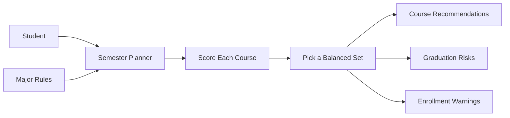

---

## 1. Overview

The planner subsystem under `packages/engine/src/planner/` is the legacy/supporting
planner stack that powers single-semester course recommendations (the `plan_semester`
tool surface) and multi-semester projection. It is also drawn upon by the newer
forward-schedule subsystem (`agent/forwardSchedule/`) for some primitives.

The subsystem ingests a `StudentProfile`, a `Program`, the full `Course` catalog,
prerequisite definitions, and a `PlannerConfig`, then produces ranked
`CourseSuggestion`s, graduation-risk warnings, enrollment-rule warnings, and
multi-semester projections.

Files audited:

- `packages/engine/src/planner/semesterPlanner.ts`
- `packages/engine/src/planner/balancedSelector.ts`
- `packages/engine/src/planner/priorityScorer.ts`
- `packages/engine/src/planner/multiSemesterProjector.ts`
- `packages/engine/src/planner/transferPrepPlanner.ts`
- `packages/engine/src/planner/crossProgramPlanner.ts`
- `packages/engine/src/planner/graduationRisk.ts`
- `packages/engine/src/planner/explorePlanner.ts`
- `packages/engine/src/planner/enrollmentValidator.ts`

### Cross-module pipeline (high level)

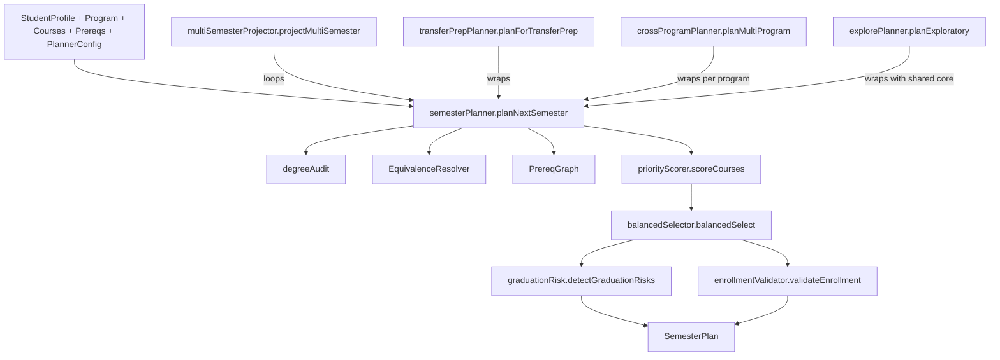

All higher-level planners (multi-semester, transfer-prep, cross-program, exploratory)
are thin wrappers around `planNextSemester`, never duplicating its core flow.

---

## 2. Semester Planner

File: `packages/engine/src/planner/semesterPlanner.ts`

### Inputs

- `student: StudentProfile`
- `program: Program`
- `courses: Course[]` (full catalog)
- `prereqs: Prerequisite[]`
- `config: PlannerConfig` — provides `targetSemester`, `maxCourses`, `maxCredits`,
  optional `avoidCourses`, `preferredCourses`, `targetGraduation`, `onlineCourseIds`,
  `isFinalSemester`, `minCredits`.

### Returned `SemesterPlan` shape

- `studentId`
- `targetSemester`
- `suggestions: CourseSuggestion[]` (possibly with `prereqRisk`)
- `risks: GraduationRisk[]`
- `estimatedSemestersLeft`
- `plannedCredits`
- `projectedTotalCredits`
- `freeSlots`
- `enrollmentWarnings`

### Step-by-step flow (`planNextSemester`, lines 39-189)

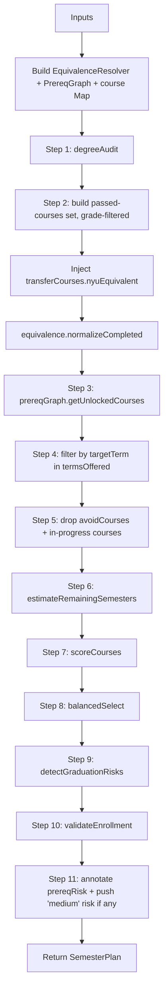

Key details:

- **Grade gate** (line 55): only grades in `{A, A-, B+, B, B-, C+, C}` count as passed.
- **Transfer equivalents** (lines 61-67): `student.transferCourses[*].nyuEquivalent`
  is concatenated into the passed-ID list before normalization, so AP/IB/A-Level
  credit satisfies prerequisites.
- **Term filter** (lines 76-83): drops any unlocked course whose `course.termsOffered`
  doesn't include the target term.
- **In-progress dedup** (lines 86-93): courses in `student.currentSemester.courses`
  are excluded by both their stated ID and their canonical (equivalence-resolved) ID.
- **`parseTerm`** (lines 194-201): accepts `YYYY-fall|spring|summer|january`; throws
  otherwise.
- **`estimateRemainingSemesters`** (lines 208-219): assumes graduation in spring of
  `catalogYear + 4`, returning `max(1, gradOrdinal - targetOrdinal + 1)`.
- **`semesterToOrdinal`** (lines 228-233): `year*4 + termOffset`, with offsets
  `january=1, spring=2, summer=3, fall=4`.

### Prereq-risk annotation (lines 142-176)

After balanced selection, each suggestion is checked against the student's
in-progress courses:

1. Collect canonical IDs of all `student.currentSemester.courses`.
2. For each suggestion, look up its direct `prereqGroups`.
3. Any direct prerequisite present in the in-progress set is recorded into
   `suggestion.prereqRisk`.
4. If any suggestion ends up with a `prereqRisk`, a single consolidated `medium`
   `GraduationRisk` is pushed listing the affected prereq IDs and warning that a
   grade below C will shift those suggestions.

### Outputs

The returned `SemesterPlan` aggregates:

- `suggestions`: from `balancedSelect`, then annotated with `prereqRisk`.
- `plannedCredits` / `freeSlots`: from `balancedSelect`.
- `projectedTotalCredits = audit.totalCreditsCompleted + selection.plannedCredits`.
- `risks`: from `detectGraduationRisks`, plus the optional in-progress prereq risk.
- `enrollmentWarnings`: from `validateEnrollment`.

---

## 3. Balanced Selector

File: `packages/engine/src/planner/balancedSelector.ts`

Picks N courses from the scored candidate pool, targeting a credit count
consistent with the student's pacing toward graduation.

### Output shape (`BalancedSelection`, lines 11-24)

- `suggestions`
- `plannedCredits`
- `freeSlots`
- `requiredThisSemester`
- `electiveSlots`
- optional `pacingNote`

### Mode selection

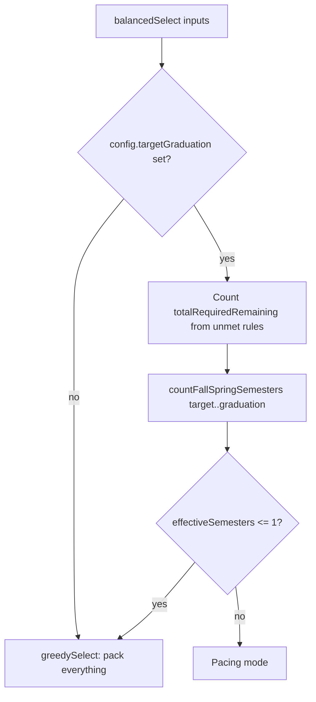

### Pacing mode (lines 91-201)

1. **`requiredCap = ceil(totalRequiredRemaining / effectiveSemesters)`** (line 91) —
   how many required courses to schedule in this semester so the load distributes
   evenly. Example: 7 required across 4 semesters → 2,2,2,1.
2. **Credits needed**: `creditsNeeded = max(0, totalCreditsRequired - creditsCompleted)`,
   defaulting `totalCreditsRequired` to 128.
3. **`minCreditsPerSemester = ceil(creditsNeeded / effectiveSemesters)`** (line 97).
4. **Credit floor**: F-1 students → hard floor of 12; domestic → floor equals
   `minCreditsPerSemester` (no floor below pacing need).
5. **`semesterTarget = min(config.maxCredits, max(creditFloor, minCreditsPerSemester))`** (line 104).
6. **`pacingNote`** explains: "on track" if ≤12 cred/sem needed; "needs attention"
   otherwise.

### Three selection passes (lines 130-189)

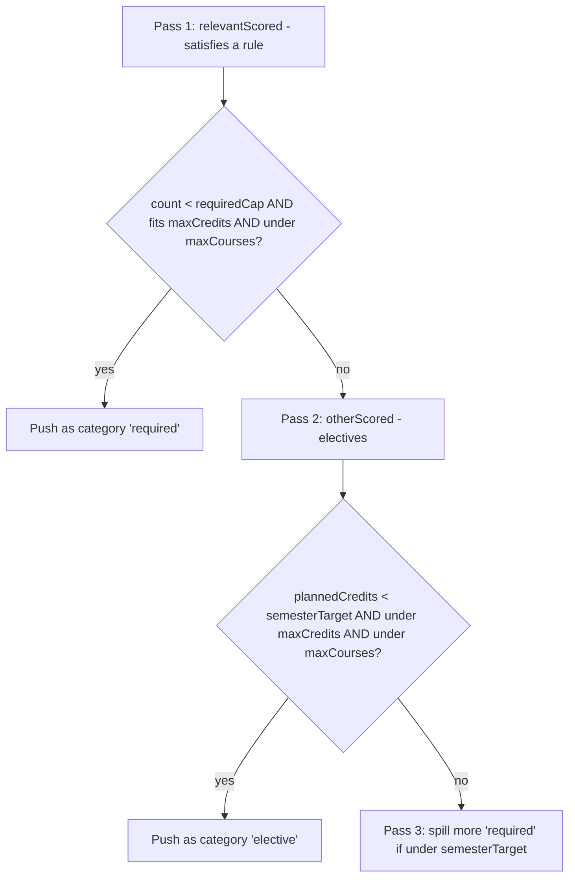

- Pass 1 stops when either `maxCourses` is reached, `requiredCap` is hit, or no more
  relevant candidates fit `maxCredits`.
- Pass 2 fills electives up to `semesterTarget`.
- Pass 3 (lines 169-189): if still under `semesterTarget`, allows extra required
  courses beyond `requiredCap` to fill the load (the system prefers being ahead on
  required over being short on credits). Skips IDs already chosen.

### Greedy fallback (lines 207-256)

When `targetGraduation` is missing or only one Fall/Spring semester remains:

1. Drain `relevantScored` first as required (subject to `maxCourses` and `maxCredits`).
2. Then drain `otherScored` as electives under the same caps.

No pacing note is produced.

### `countFallSpringSemesters` (lines 262-300)

Counts only Fall + Spring semesters strictly between `current` (exclusive) and
`target` (inclusive). Summer and January are explicitly skipped. The hard cap of
20 iterations (line 296) prevents infinite loops on malformed inputs.

---

## 4. Priority Scorer

File: `packages/engine/src/planner/priorityScorer.ts`

Scores every candidate course and returns them sorted by total score descending
(line 126).

### Score weights (lines 33-39)

| Component | Weight |
|---|---|
| `BLOCKED` (per transitively blocked future course) | 10 |
| `REQUIREMENT` (per unmet rule satisfied) | 25 |
| `URGENCY` (critical-path multiplier) | 15 |
| `PREFERENCE` (student-preferred) | 20 |
| `CORE_PREREQ` (gatekeeper boost) | 30 |

### Per-candidate scoring algorithm (lines 61-127)

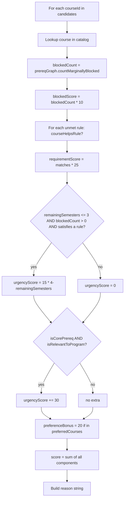

### `blockedScore` — marginal blocking (line 72)

Uses `prereqGraph.countMarginallyBlocked` so OR-prereq alternatives that don't
add new unlocks aren't double-counted. Example: if a student already has CSCI-UA 101,
then CSCI-UA 110 (an OR alternative) marginally blocks 0 downstream courses.

### `courseHelpsRule` (lines 132-162)

Three checks in order:

1. Course ID literally present in `rule.coursesRemaining`.
2. Canonical (equivalence-resolved) of the course matches the canonical of any
   `coursesRemaining` entry.
3. For rules with a `fromPool` (choose-N rules), match wildcards (`prefix*`) or
   canonical equality. Only applies when `rule.remaining > 0`.

### Urgency boost conditions

- The semester-pressure boost (lines 86-91) only triggers when `remainingSemesters
  <= 3`, the course unblocks something (`blockedCount > 0`), AND it satisfies at
  least one unmet rule. The multiplier is `15 * (4 - remainingSemesters)`, so a
  course planned 1 semester out gets 45, 2 out gets 30, 3 out gets 15.
- The core-prereq boost (lines 93-95) applies a flat 30 when the course is on the
  `corePrereqs` allowlist AND `isRelevantToProgram` returns true.

### `isCorePrereq` (lines 168-178)

Hard-coded allowlist:

- CSCI-UA 101, CSCI-UA 110 (intro variants)
- CSCI-UA 102 (data structures)
- CSCI-UA 201 (computer systems org.)
- CSCI-UA 310 (algorithms)
- MATH-UA 120 (discrete math)
- MATH-UA 121 (calculus I)

### `isRelevantToProgram` (lines 185-203)

Iterates all `program.rules`, extracts each rule's pool (either `rule.courses` or
`rule.fromPool`), and checks if the candidate matches any pool entry by literal
ID, canonical ID, or wildcard prefix.

### Reason string (lines 103-108)

Built by concatenating: "unlocks N future course(s)", "satisfies N requirement(s)",
"critical path course", "preferred by student". Falls back to "available elective"
if nothing applies.

---

## 5. Multi-Semester Projector

File: `packages/engine/src/planner/multiSemesterProjector.ts`

Projects `semesterCount` Fall/Spring semesters by repeatedly calling
`planNextSemester` and folding each output's suggestions back into the working
student profile as completed with an assumed grade.

### Input request (`MultiSemesterRequest`, lines 28-47)

- `student`, `program`, `courses`, `prereqs`
- `startSemester` (must be `YYYY-fall` or `YYYY-spring`)
- `semesterCount`
- `mode?: "default" | "exploratory" | "transfer_prep"`
- `maxCoursesPerSemester?` (default 5)
- `maxCreditsPerSemester?` (default 18)
- `schoolConfig?`
- `assumedGrade?` (default "B")

### Start-semester validation (lines 83-95)

Throws if the start isn't `YYYY-(fall|spring|summer|january)` and explicitly rejects
`summer` and `january` starts, since the projector advances Fall→Spring→Fall only.

### Loop (lines 100-158)

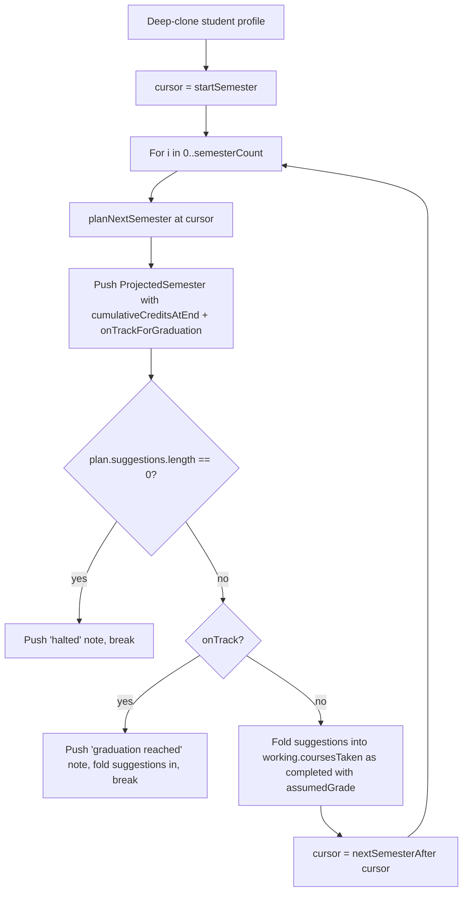

### Halt conditions

1. Zero suggestions returned → projector halted (line 116-122).
2. `cumulativeCreditsAtEnd >= program.totalCreditsRequired` → folds the semester
   in (so the graduating semester appears in output) then breaks (lines 129-145).

### Result (`MultiSemesterResult`, lines 59-65)

- `semesters: ProjectedSemester[]` where each item carries the semester label,
  the full `SemesterPlan`, the cumulative credits, and an `onTrackForGraduation`
  boolean.
- `projectedGraduationSemester` = earliest semester whose `onTrackForGraduation`
  is true (line 160-161).
- `notes` — includes mode tag (prepended), halt reasons, and an "Assumed grade"
  footer (lines 163-167) that warns real grades affect grade-floor rules
  (CAS major: ≥C; CAS Core: ≥D).

### `nextSemesterAfter` (lines 181-190)

Pure stepper:

- `YYYY-fall` → `YYYY+1-spring`
- `YYYY-spring` → `YYYY-fall`
- `YYYY-january` or `YYYY-summer` → `YYYY-fall`
- Malformed → returns input unchanged.

Summer and January never appear as cursors in normal operation because the start
is constrained to Fall/Spring.

### Purity

Mutates only a local deep-clone of the student profile (`JSON.parse(JSON.stringify(...))`
line 97). Input `req.student` is never modified.

---

## 6. Transfer-Prep Planner

File: `packages/engine/src/planner/transferPrepPlanner.ts`

Plans a semester for a student preparing for an internal NYU school transfer.
The student's **current** major continues to drive the audit; courses needed to
satisfy the target school's missing prereqs are merely promoted.

### Flow (`planForTransferPrep`, lines 54-148)

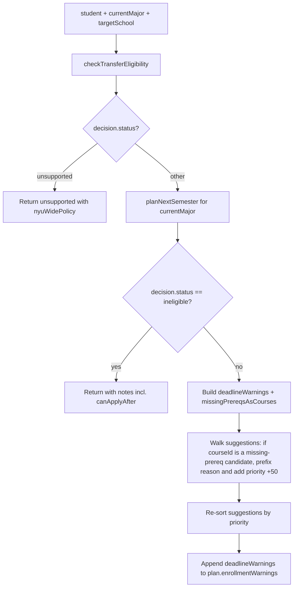

### Result shapes

**Success** (`TransferPrepPlanResult`, lines 35-46):

- `plan: SemesterPlan` (the student's current-major plan with promoted prereq
  suggestions)
- `transferDecision: TransferDecision`
- `missingPrereqsAsCourses: Array<{category, description, candidates: string[]}>`
  — built from `decision.missingPrereqs`
- `deadlineWarnings: string[]` — one per call, formatted as
  `"{school} internal-transfer application deadline: {deadline}. Accepted terms: {list}."`
- `notes: string[]`

**Unsupported** (lines 71-81): returns `{ kind: "unsupported", reason, contact,
nyuWidePolicy }` — preserves the NYU-wide policy floor so the chat layer can still
provide guidance.

**Ineligible** (lines 89-101): returns the plan but with empty
`missingPrereqsAsCourses` and `deadlineWarnings`, and notes including a
`canApplyAfter` re-evaluation hint if present.

### Promotion mechanics (lines 119-137)

- Build `promotedIds` = union of every `candidate` from `decision.missingPrereqs`.
- For each suggestion whose `courseId` is in `promotedIds`:
  - Prefix `reason` with `[transfer-prereq for {targetSchool}: {category}]`
    (idempotent: skipped if already prefixed).
  - Add `+50` to `priority`.
- Re-sort by `priority` descending.
- Append `deadlineWarnings` to `plan.enrollmentWarnings`.

The student's `declaredPrograms` is **not** mutated (audit still runs against
current major).

---

## 7. Cross-Program Planner

File: `packages/engine/src/planner/crossProgramPlanner.ts`

Handles students declaring multiple programs (major + minor, two majors, etc.).
Runs the planner once per declared program, then merges suggestions with
shared-course boosts and double-count penalties.

### Boost / penalty constants (lines 49-54)

- `SHARED_COURSE_BOOST = +30` — applied when the suggestion appears in 2+
  per-program plans.
- `OVER_LIMIT_PENALTY = -40` — applied when this course pushes the student past
  the school's double-count pair limit (per `crossProgramAudit.warnings` of kind
  `exceeds_pair_limit`).

### Flow (`planMultiProgram`, lines 56-146)

```mermaid
flowchart TD
    A[student + programs Map] --> B[crossProgramAudit]
    B --> C[For each declared program: planNextSemester then push to perProgram]
    C --> D[Merge: Map keyed by courseId, union satisfiesRules, track _programs Set]
    D --> E[For each merged entry]
    E --> F{programsCount >= 2?}
    F -- yes --> G[priority += 30, prefix reason '[shared across N programs: ...]']
    F -- no --> H{overflowIds has courseId?}
    H -- yes --> I[priority += -40, prefix reason '[would exceed school double-count limit]']
    H -- no --> J{sharedCourseIds has courseId AND programsCount < 2?}
    J -- yes --> K[prefix reason '[helps multiple programs]' but no priority change]
    J -- no --> L[no annotation]
    G --> M[Strip _programs Set, push to result]
    I --> M
    K --> M
    L --> M
    M --> N[Sort result by priority descending]
```

### Result (`CrossProgramPlanResult`, lines 34-43)

- `perProgram: Array<{programId, plan: SemesterPlan}>` in `declaredPrograms`
  declaration order.
- `merged: CourseSuggestion[]` — deduped across programs, with combined
  `satisfiesRules` lists, priority boosts/penalties applied, and sorted.
- `audit: CrossProgramAuditResult` (from `crossProgramAudit`).
- `notes` — includes the count of double-counting warnings and the shared-course
  total.

### Edge cases

- Unknown `programId` in `student.declaredPrograms` (line 70-73): pushes a
  "skipped" note and continues.
- The internal `_programs` Set used for tracking which programs surfaced each
  suggestion is stripped from the output (line 131) to avoid serializing to `{}`.

---

## 8. Graduation Risk

File: `packages/engine/src/planner/graduationRisk.ts`

Produces an ordered list of `GraduationRisk` (level: `critical|high|medium|low|none`)
warnings about the student's path to graduation.

### Inputs

- `student`, `program`, `ruleResults`, `completedCourses`,
  `totalCreditsCompleted`, `prereqGraph`, `courseCatalog`,
  `remainingSemesters`
- Optional `schoolConfig`

### CAS defaults (lines 23-32)

| Threshold | Value |
|---|---|
| `criticalPerSemester` (credits) | 20 |
| `highPerSemester` (credits) | 18 |
| `mediumPerSemester` (credits) | 16 |
| `highPerSemester` (course count) | 5 |

`schoolConfig.maxCreditsPerSemester` overrides `highPerSemester` (credits); the
critical and medium thresholds remain CAS defaults regardless.

### Four risk checks (lines 50-140)

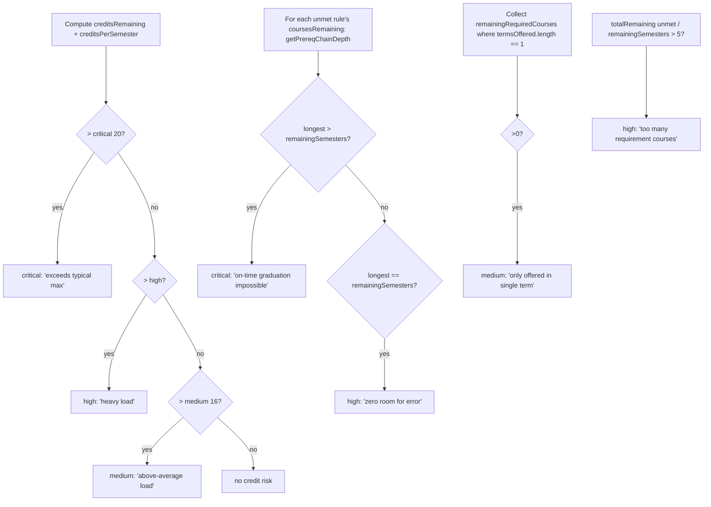

### `getPrereqChainDepth` (lines 153-194)

Memoized recursive depth calculation:

- If already completed → 0.
- If no prereqs → 1 (can take next semester).
- For each prereq group:
  - `AND` group: depth = max over members.
  - `OR` group: depth = min over members (Infinity if empty group, mapped to 0).
- Overall depth for the course = max across groups + 1.

### Sorting (lines 142-144)

Final risks are sorted by severity: `critical < high < medium < low < none`.

---

## 9. Explore Planner

File: `packages/engine/src/planner/explorePlanner.ts`

Surface for undeclared students. A thin wrapper around `planNextSemester` that
runs the audit against the school's shared core program.

### Flow (`planExploratory`, lines 44-107)

```mermaid
flowchart TD
    A[Inputs] --> B{declaredPrograms.length > 0?}
    B -- yes --> C[Return unsupported: 'use planNextSemester directly']
    B -- no --> D{schoolConfig.sharedPrograms set?}
    D -- no --> E[Return unsupported: 'no sharedPrograms']
    D -- yes --> F[targetProgramId = sharedPrograms 0]
    F --> G{program present in programs Map?}
    G -- no --> H[Return unsupported: 'must load before invoking']
    G -- yes --> I[planNextSemester against shared core]
    I --> J[Prefix every suggestion.reason with '[exploratory mode — toward {programName}]']
    J --> K[Return ExploratoryPlanResult]
```

### Result (`ExploratoryPlanResult`, lines 28-37)

- `plan: SemesterPlan`
- `basis: string` — e.g., "Student has no declaredPrograms; audit run against shared core 'CAS Core' (cas_core)."
- `auditedProgramId`
- `notes: string[]` (three default notes about exploratory mode being active, that
  suggestions count toward the school core, and to re-run after declaring).

### Unsupported cases

The function never fabricates a program. It returns
`{ kind: "unsupported", reason }` when:

- The student already has declared programs.
- The school config has no `sharedPrograms` array (or it's empty).
- The first shared program ID isn't in the resolved programs Map.

### Reason prefix idempotency

The reason-prefix mutation (lines 90-94) is guarded by
`!reason.startsWith("[exploratory")` so re-running won't double-prefix.

---

## 10. Enrollment Validator

File: `packages/engine/src/planner/enrollmentValidator.ts`

Runs after balanced selection. Returns a `{ valid: boolean, warnings: string[] }`
object that powers `plan.enrollmentWarnings`.

### Input

- `suggestions: CourseSuggestion[]`
- `student: StudentProfile`
- `config: PlannerConfig` — uses `targetSemester`, `onlineCourseIds`,
  `isFinalSemester`, `minCredits`

### Top-level dispatch (lines 29-64)

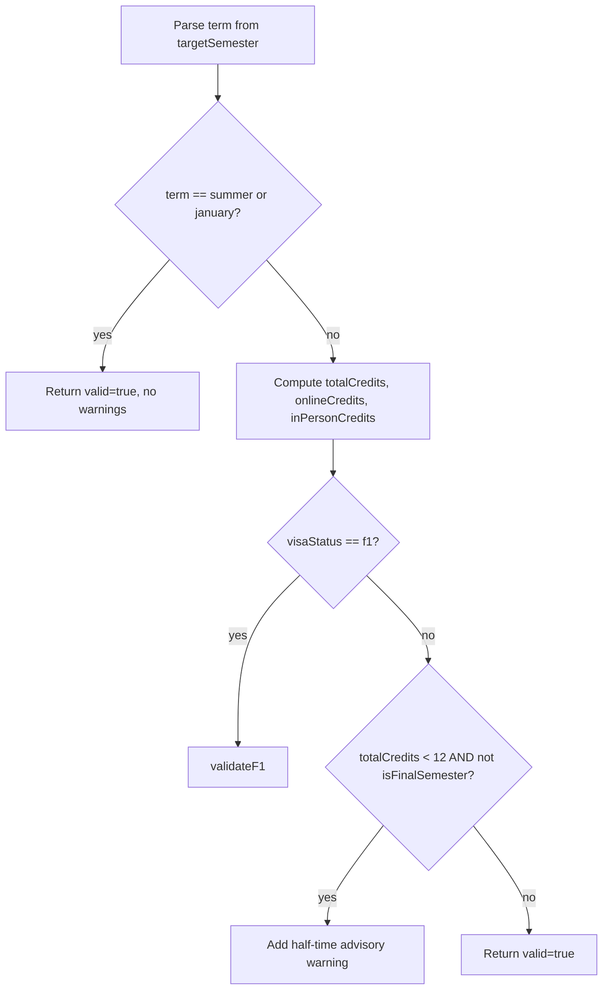

### F-1 rules (`validateF1`, lines 66-134)

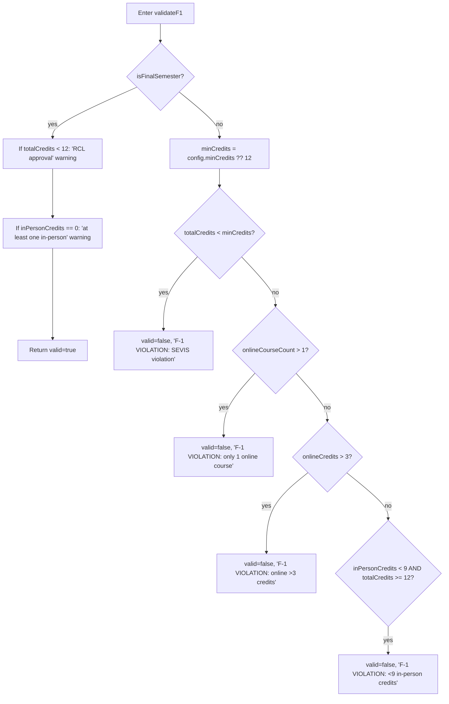

Key constants:

- Minimum credits default: 12 (overridable via `config.minCredits`).
- Online cap: 1 course, max 3 credits.
- In-person minimum: 9 credits (only checked when `totalCredits >= 12`).

### Domestic rules (lines 55-61)

Pure advisory: enrolling in `< 12` credits emits a half-time warning unless
`isFinalSemester` is set. Always returns `valid: true`.

### Summer / January

Returns `{ valid: true, warnings: [] }` immediately — no enrollment requirements
for any visa status during these terms.

### Note on returned `valid` flag

The semester planner reads only `enrollment.warnings`. The `valid` boolean is
exposed by the function but not consumed elsewhere within the planner subsystem.

---

## 11. Relationship to the Forward-Schedule Subsystem

The newer `agent/forwardSchedule/` solver (under the `planForwardDegree` tool) is
a separate path from this subsystem. It is its own solver — not implemented in
the files audited here — but it draws on shared engine primitives used by the
planner:

- `audit/degreeAudit` (called by `semesterPlanner.planNextSemester`, line 51)
- `equivalence/equivalenceResolver` (canonical course IDs)
- `graph/prereqGraph` (transitively-blocked counts, prereq groups, chain depth)
- The single-semester planner itself can be used as a building block by
  `forwardSchedule` when a per-term recommendation is needed; the orchestration
  patterns used by `multiSemesterProjector` (calling `planNextSemester` in a loop
  while folding fake "B" grades forward) are the legacy model that `forwardSchedule`
  evolved beyond.

Within the files audited here, no module imports from `agent/forwardSchedule/`,
and the existing four wrappers (`multiSemesterProjector`, `transferPrepPlanner`,
`crossProgramPlanner`, `explorePlanner`) all call `planNextSemester` (file
`semesterPlanner.ts`, line 39) as their sole engine entry point.
