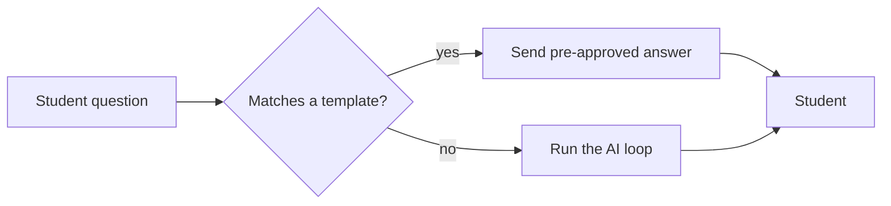
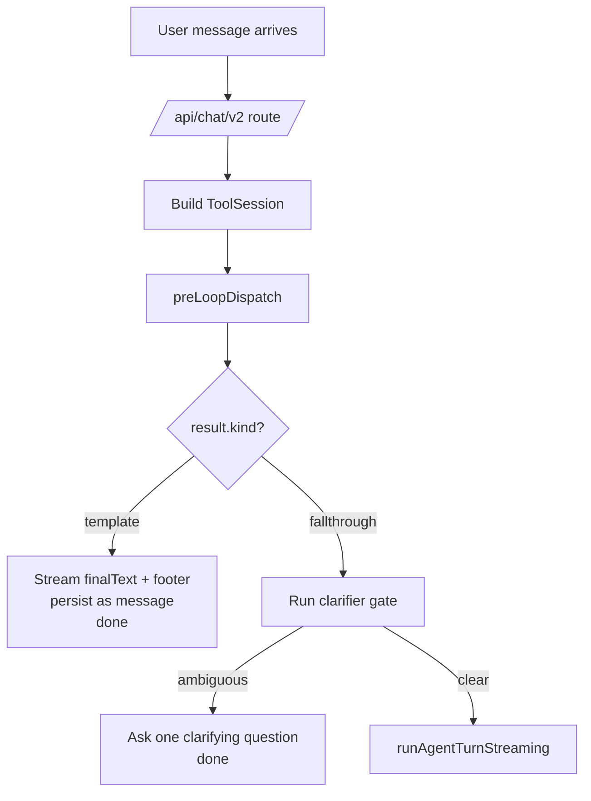

# Template Matcher (pre-loop dispatch)

> DEPRECATED — documents code REMOVED from the codebase (see [README.md](README.md) in this folder). Kept for history; do not trust as current.

> **Source files:** `packages/engine/src/agent/templateMatcher.ts`, `rag/policyTemplate.ts`

## TL;DR

Some questions get asked over and over — "what's the GPA requirement for my major?" or "what's NYU's drop deadline?" — and they always have the same correct answer. For these, calling the full AI is overkill, slower, and adds risk. So before the AI is ever invoked, the system checks the student's message against a curated list of "policy templates," like a library of pre-written FAQ answers. If the message matches one closely enough and passes a few sanity checks (right student, right context, not too long, not stale), the template's pre-approved answer is sent straight to the student with a "verified on this date" footer. No AI call needed. If nothing matches, the system falls through to the regular AI loop.



---

This is the **first thing** the chat route runs after assembling the session. Before the agent loop spends a single LLM call, every user message is checked against a curated set of "policy templates". If one matches under all five gates, its body is returned as the final reply directly — no model invocation, no validator pass.

The matcher is pure and stateless. Inputs in, decision out.

---

## 1. What it returns

```
PreLoopResult =
  | { kind: "template", match: TemplateMatchResult, finalText: string }
  | { kind: "fallthrough", reason: string }
```

- `kind: "template"` — a template fired. `finalText` is the template body plus a citation footer:
  ```
  <template.body>
  
  _— Curated policy answer (last verified <template.lastVerified>; source: <template.source>)_
  ```
  The chat route ships this directly to the user as the reply.
- `kind: "fallthrough"` — no template fired. The chat route proceeds to the agent loop.

---

## 2. Early-exit fallthroughs

Before invoking the matcher, `preLoopDispatch` short-circuits when:

- `!session.student` → `"no student in session"`
- `options.templates.length === 0` → `"no templates loaded"`

---

## 3. The five gates (in `matchTemplate`)

The dispatcher delegates to `matchTemplate(userMessage, templates, homeSchool, { transferIntent, now })`. A template only fires when all five of the following gates pass:

1. **Similarity gate** — the user message must score above the template's threshold on the template's trigger comparison (the implementation lives in `rag/policyTemplate.ts`; the gate is a per-template lexical match against trigger phrases).
2. **Context-pronoun gate** — short pronoun-heavy queries that depend on context don't auto-match templates that need a fresh question.
3. **School gate** — the template's school list must include `homeSchool` (or be unrestricted).
4. **Applicability gate** — fields like `requiresTransferIntent` must match the session.
5. **Freshness gate** — `template.lastVerified` must be within the freshness window relative to `now`.

When a template clears all five, `matchTemplate` returns a `TemplateMatchResult` carrying the matched `PolicyTemplate`, the trigger phrase that hit, and the matched score.

---

## 4. Why a citation footer is mandatory

By contract, every curated answer surfaces its source. The footer is the chat layer's contract:

> `_— Curated policy answer (last verified <date>; source: <url-or-section>)_`

This is appended verbatim by `preLoopDispatch` after the template body. The user sees both the answer and where it came from; the chat history persists both.

---

## 5. Where this fits in the request flow



A template hit ends the turn there. No agent loop, no validator, no tool calls.

---

## 6. Why this exists

Curated answers are deterministic, immediately auditable, and cheap. For high-frequency questions that have a single correct answer ("What's the P/F deadline?", "When is the add/drop window?", "How do I declare a major?"), the template path:

- Costs zero LLM tokens.
- Never hallucinates — the body is operator-verified text.
- Is verifiable — the footer's `lastVerified` date tells the user (and the operator) how recent the curation is.
- Is unambiguous — if the answer ships, the operator knows exactly which template fired.

If a template's gates don't all pass, the agent loop is the more flexible (but more expensive) fallback.

---

## 7. What it never does

- It never calls the LLM. The matcher is pure substring + metadata checks.
- It never modifies the session.
- It never reads tool results — there are none, the loop hasn't run.
- It never persists anything. The route is responsible for that.
