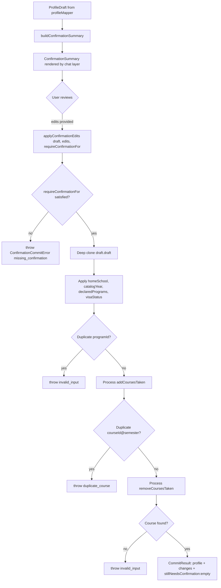

# Transcript Parser Subsystem

> DEPRECATED — documents code REMOVED from the codebase (see [README.md](README.md) in this folder). Kept for history; do not trust as current.

> ## ⚠️ DEPRECATED — NOT USED IN PRODUCTION
>
> **This deterministic transcript module is no longer part of the live product.** NYU Path pivoted to **DPR-only onboarding**: a student's record now comes exclusively from the Albert Degree Progress Report (DPR), and the **unofficial-transcript upload path has been removed from the product entirely.**
>
> Two clarifications about what this module ever was:
> - It was **never wired into the live web app.** Production onboarding parsed the uploaded document with an **LLM parser** in the web onboard route — *that* LLM parser is the path that has now been removed. This deterministic lexer/parser/invariants/mapper pipeline was the engine-side alternative that production never adopted.
> - It survives in the codebase only as **orphaned, test-only code.** Its single remaining consumer is the test suite; nothing in production imports it.
>
> The rest of this document is retained as **historical reference** for how the deterministic parser works. Do not treat any of it as describing a live code path. For the authoritative current record pipeline, see `dpr.md`.

## TL;DR

Some students don't have an official Degree Progress Report handy, so they upload their own unofficial transcript instead. This subsystem reads that pasted text, finds each term, each course row, the grade, and the credits, and turns it into a draft profile the rest of the app can use. It double-checks the math: the GPA per term should match the points and hours printed, and the cumulative GPA should match the sum. If anything is off, it stops and reports the mismatch rather than guessing. It also tries to figure out which NYU school the student belongs to by looking at course-code patterns, spots AP/IB credits, and notices if the student switched schools mid-college. Because this is a student-uploaded document and not the official record, nothing gets saved until the student reviews the draft and confirms it.


---

## 1. Overview

This subsystem parses the **unofficial transcript** that a student uploads themselves and converts it into a typed `StudentProfile` draft, which the chat layer then surfaces for user confirmation before any persistence. It is the "self-uploaded transcript" ingestion path and is intentionally distinct from the DPR (Degree Progress Report) parser, which handles the authoritative Albert-issued document.

The full module surface is re-exported from `packages/engine/src/transcript/index.ts:1-17`:

- Token/AST types and the `TranscriptParseError` class (`types.ts`)
- `lexTranscript` — raw text to token stream (`lexer.ts:40`)
- `parseTranscript` — token stream to `TranscriptDocument` (`parser.ts:39`)
- `reconcileTranscript` — three arithmetic invariants on a parsed document (`invariants.ts:13`)
- `transcriptToProfileDraft` — `TranscriptDocument` to `ProfileDraft` (`profileMapper.ts:51`)
- `buildConfirmationSummary`, `applyConfirmationEdits`, `ConfirmationCommitError` — the two-step confirmation flow (`confirmationFlow.ts:54`, `confirmationFlow.ts:166`, `confirmationFlow.ts:146`)

The pipeline is fully deterministic. There are no LLM calls anywhere in this module. On any structural or arithmetic failure, the parser throws — it never falls back.

---

## 2. Types

All shapes live in `packages/engine/src/transcript/types.ts`.

### TranscriptHeader (`types.ts:5-10`)
Pseudo-type:
```
TranscriptHeader = {
  name?: string
  studentId?: string
  program?: string
  datePrinted?: string
}
```

### TranscriptGrade (`types.ts:12-14`)
A closed union of letter grades and symbolic markers:
`A, A-, B+, B, B-, C+, C, C-, D+, D, F, P, W, I, NR, WF, TR, ***`
The token `***` denotes an in-progress course.

### TranscriptCourseRow (`types.ts:16-28`)
One row inside a term block:
```
TranscriptCourseRow = {
  courseId: string        // "CSCI-UA 101" as printed
  title: string
  grade: TranscriptGrade
  ehrs: number            // earned hours
  qhrs: number            // quality hours (GPA participation)
  qpts: number            // quality points (GPA participation)
}
```

### TranscriptTerm (`types.ts:30-41`)
A term block with its courses and printed totals:
```
TranscriptTerm = {
  label: string           // "Fall 2023" as printed
  semester: string        // normalized "2023-fall"
  courses: TranscriptCourseRow[]
  ahrs, ehrs, qhrs, qpts: number
  printedGpa: number
}
```

### TranscriptOverall (`types.ts:43-49`)
The bottom-of-transcript cumulative block: `ahrs, ehrs, qhrs, qpts, printedGpa`.

### TranscriptExamCredit (`types.ts:51-60`)
Exam-credit row (AP, IB, transfer):
```
TranscriptExamCredit = {
  source: string                 // "AP Calculus BC"
  scoreOrGrade: string
  credits: number
  nyuEquivalent?: string         // "MATH-UA 121" if listed
}
```

### TranscriptDocument (`types.ts:62-73`)
The full parsed document:
```
TranscriptDocument = {
  header: TranscriptHeader
  terms: TranscriptTerm[]
  overall: TranscriptOverall
  examCredits: TranscriptExamCredit[]
  schoolTransition?: { fromSemester, previousSuffixes[], newSuffixes[] }
  suffixHistory: Record<suffix, firstSemesterObserved>
  inProgress: TranscriptCourseRow[]   // grade === "***"
}
```

### Errors (`types.ts:75-103`)
- `TranscriptParseErrorKind` is one of: `term_gpa_mismatch`, `overall_qpts_mismatch`, `cumulative_gpa_mismatch`, `lex_error`, `parse_error`, `missing_overall_block`, `no_terms`.
- `TranscriptParseError` is a typed `Error` subclass holding the `kind` plus optional `term`, `computed`, `printed`, `summed`, `line`, `snippet`, and `detail` fields.

---

## 3. Lexer

File: `packages/engine/src/transcript/lexer.ts`.

The lexer splits raw text by `\r?\n` (`lexer.ts:41`) and walks each line, classifying it into exactly one `LexedToken` (`lexer.ts:12-19`):

| Token kind | When emitted |
|---|---|
| `blank` | Trimmed line is empty (`lexer.ts:49-52`) |
| `term_header` | Line matches the term-header regex (`lexer.ts:54-63`) |
| `term_totals` | Line matches the term-totals regex (`lexer.ts:65-78`) |
| `overall_label` | Line is a single overall-cumulative label/value (`lexer.ts:80-90`) |
| `course_row` | Line begins with a recognisable course id (`lexer.ts:92-101`) |
| `exam_credit` | Line matches the exam-credit regex (`lexer.ts:103-115`) |
| `header_line` | Any non-empty line that matched nothing above (`lexer.ts:117`) |

### Regex patterns (verbatim from `lexer.ts:21-34`)

- **Term header** (`lexer.ts:22`): `^\s*(?:Term\s*[:\-]\s*)?(Fall|Spring|Summer|January)\s+(\d{4})\s*$` (case-insensitive). The first capture is the season, the second is the four-digit year. The emitted `label` is built by capitalizing the season and joining with the year (`lexer.ts:60`).
- **Course-id anchor** (`lexer.ts:26`): `^([A-Z]{2,6}\d?-[A-Z]{2})\s+(\d+(?:-\d+)?)\b`. Matches a department code (`CSCI-UA`, `MATH-UA`, sub-section forms like `CORE-UA1-` are tolerated by the `\d?`) followed by a course number that optionally has a `-N` sub-section.
- **Term totals** (`lexer.ts:29`): `Term\s*Totals?\s*[:\-]?\s*AHRS\s+(\d+(?:\.\d+)?)\s+EHRS\s+(\d+(?:\.\d+)?)\s+QHRS\s+(\d+(?:\.\d+)?)\s+QPTS\s+(\d+(?:\.\d+)?)\s+GPA\s+(\d+(?:\.\d+)?)` (case-insensitive). Captures AHRS/EHRS/QHRS/QPTS/GPA in order.
- **Overall label** (`lexer.ts:31`): `^\s*(AHRS|EHRS|QHRS|QPTS|GPA)\s+(\d+(?:\.\d+)?)\s*$`. Matches a single overall-block line of the form `AHRS 120` etc.
- **Exam credit** (`lexer.ts:33-34`): `^(.*?)\s+Score\s+(\S+)\s*(?:→|->)\s*([A-Z]{2,6}-[A-Z]{2}\s+\d+(?:-\d+)?)?\s*\(?\s*(\d+(?:\.\d+)?)\s*cr\)?` (case-insensitive). Captures the source name, the score, an optional NYU equivalent course id, and the credit count.

### Course-row field splitting (`lexer.ts:137-143`)

`tokenizeCourseRow` keeps the course id together as a single field. It re-runs the course-id regex against the line and, if it matches, returns `[courseId, ...rest.split(/\s+/)]`. The course id is therefore always `fields[0]`; the title is the slice between the id and the trailing four columns (`grade, ehrs, qhrs, qpts`). If the id regex does not match, the line is split on whitespace as a fallback.

### Order of classification matters

Inside the per-line loop (`lexer.ts:44-118`) the order is: `blank` → `term_header` → `term_totals` → `overall_label` → `course_row` → `exam_credit` → `header_line`. The first matching branch wins and `continue`s; nothing falls through. This means a course row that happens to also contain the substring "Term Totals" cannot mis-fire because `term_totals` is checked before `course_row`. Conversely, anything that the term-totals regex would reject because of bad formatting will fall through to be tried as a course row.

---

## 4. Parser

File: `packages/engine/src/transcript/parser.ts`. Entry point: `parseTranscript(text, opts?)` at `parser.ts:39`.

### Step 1 — Lex
The parser first calls `lexTranscript(text)` (`parser.ts:40`) and operates on the resulting token stream.

### Step 2 — Token-stream state machine (`parser.ts:50-137`)

The parser keeps three pieces of state:

- `currentTerm: TranscriptTerm | null` — the term currently being filled.
- `lastSawTermTotals: boolean` — whether the immediately preceding event flushed a `term_totals` line into `currentTerm`.
- `inOverallBlock: boolean` — set true once any `overall_label` token appears.

The transitions by token kind:

- **`blank`** — ignored (`parser.ts:54-55`).
- **`header_line`** — only used as a best-effort student-name capture from the very first line, and only when no term has been opened yet (`parser.ts:57-63`).
- **`term_header`** — if there is a pending `currentTerm`, flush it (synthesizing totals if `lastSawTermTotals` is false), then open a fresh term via `newTerm(label)` and reset both flags (`parser.ts:65-77`).
- **`course_row`** — must have a `currentTerm` open, else throw `parse_error` with snippet (`parser.ts:79-87`). Otherwise call `parseCourseRow` and push to the current term's `courses` array.
- **`term_totals`** — must have a `currentTerm` open, else throw `parse_error` (`parser.ts:93-101`). Overwrites the term's `ahrs/ehrs/qhrs/qpts/printedGpa` from the token, and sets `lastSawTermTotals = true`.
- **`overall_label`** — flushes any pending term (with synthesis if needed), then writes the value into the partial `overall` object indexed by `tok.field` (`parser.ts:111-125`). After this point the per-term machinery is effectively done.
- **`exam_credit`** — appended directly to `examCredits` (`parser.ts:127-135`).

### Step 3 — End-of-file flush (`parser.ts:140-143`)
After the token loop, any still-pending `currentTerm` is flushed (with synthesis if needed).

### Step 4 — Required-presence checks (`parser.ts:145-163`)

- If `terms` is empty, throw `TranscriptParseError({ kind: "no_terms" })`.
- If any of `overall.ahrs / ehrs / qhrs / qpts / printedGpa` is undefined, throw `TranscriptParseError({ kind: "missing_overall_block" })`.

### Step 5 — Derived data (`parser.ts:165-181`)

- `inProgress` — every course whose grade is `"***"` is collected across all terms.
- `suffixHistory` — for each course id, extract the suffix (one of `-UA`, `-UB`, `-UD`, `-UE`, `-UF`, `-UG`, `-UH`, `-UN`, `-UT`, `-UY`, `-CE`) and record the first semester it was observed.
- `schoolTransition` — set only when the **dominant** suffix changes between two consecutive terms (see `detectSchoolTransition` at `parser.ts:294-334`). Mixed terms do not by themselves trigger a transition — only a change of which suffix dominates does.

### Step 6 — Invariants (`parser.ts:183`)
Unless `opts.skipInvariants` is true, `reconcileTranscript(doc)` is called. See section 7.

### Course-row parser (`parser.ts:208-263`)

`parseCourseRow` enforces:

1. At least five fields in the tokenized row (`parser.ts:210-217`); otherwise `parse_error` with detail `Course row has only N fields; expected at least 5 (id, title, grade, ehrs, qhrs, qpts).`
2. `fields[0]` must match `^([A-Z]{2,6}\d?-[A-Z]{2})\s+(\d+(?:-\d+)?)$` (`parser.ts:32`); else `parse_error` with detail `First field "X" is not a recognisable course id.`
3. The three trailing fields are parsed via `parseFloat` as `qpts`, `qhrs`, `ehrs` (last-three-of-array, in reverse: `parser.ts:231-233`). If any is NaN, throw `parse_error` with detail mentioning the non-numeric trailing field.
4. The fourth-from-last field is the grade. It must be in the closed set `KNOWN_GRADES` (`parser.ts:27-30`); else throw `parse_error` with the full known-grade list in the detail.
5. The title is `fields.slice(1, fields.length - 4).join(" ")`.

### Term-totals synthesis (`parser.ts:265-279`)

When a term ends without a printed `Term Totals` line, the parser synthesizes the totals by summing per-course `ehrs/qhrs/qpts` and computing `printedGpa = round(qpts / qhrs, 3)` when `qhrs > 0` else `0`. Since transcript rows do not print row-level AHRS, the synthesized `ahrs` is set equal to `ehrs` as a baseline. When a real `Term Totals` line is present, it overrides this entirely.

### Semester normalization (`parser.ts:202-206`)
`normalizeSemester(label)` matches `(Fall|Spring|Summer|January)\s+(\d{4})` and returns `"YYYY-season"` in lowercase. If the regex misses, the fallback is `label.toLowerCase().replace(/\s+/g, "-")`.

### Suffix history (`parser.ts:281-292`)
Per course id, suffix is `-(U[ABDEFGHNTY]|CE)`. The first term in which a suffix appears is the value stored.

### School-transition detection (`parser.ts:294-334`)
For each term, `dominantOf` counts suffix frequencies and picks the most common. The first time the dominant suffix differs from the previous term's dominant suffix, the function returns an object with `fromSemester` set to the new term's semester, `previousSuffixes` set to the previous term's full suffix set (falling back to `[lastDominant]` only if the prior set is unrecorded), and `newSuffixes` set to the current term's full suffix set. Only the first transition is reported.

### Error recovery
There is none in the structural sense. Every failure is fatal and raised as `TranscriptParseError`. The only soft-recovery behavior is:

- Synthesizing term totals when a term ends without a `term_totals` token.
- Best-effort name capture from the first non-empty line.
- Default `header.studentId = "transcript_draft"` only emerges later in `profileMapper.ts:130`, not the parser.

---

## 5. Profile mapper

File: `packages/engine/src/transcript/profileMapper.ts`. Entry: `transcriptToProfileDraft(doc, options?)` at `profileMapper.ts:51`.

The mapper returns a `ProfileDraft` (`profileMapper.ts:18-27`):

```
ProfileDraft = {
  draft: StudentProfile        // a draft, not a committed profile
  notes: string[]              // human-readable inference notes
  needsConfirmation: (keyof StudentProfile)[]
}
```

### Options (`profileMapper.ts:29-36`)
Optional overrides: `homeSchoolOverride`, `declaredProgramsOverride`, `visaStatus`. When set, these bypass inference.

### Suffix-to-school table (`profileMapper.ts:38-49`)
```
-UA → cas
-UB → stern
-UY → tandon
-UE → steinhardt
-UT → tisch
-UN → nursing
-UF → liberal_studies
-UG → gallatin
-UC → sps
-CE → sps
```

### Mapping rules

**`coursesTaken` (`profileMapper.ts:58-87`)** — iterate every course across every term, skipping in-progress (`grade === "***"`). Credit attribution priority:

1. If `ehrs > 0`, use `ehrs`.
2. Else if `qhrs > 0`, use `qhrs`.
3. Else if `grade === "P"`, use `0` (intentional — a passing pass/fail with 0 hours stays 0; do not invent credits).
4. Else use `4` (the catalog-policy default for `W/I/NR` rows where both `ehrs` and `qhrs` are zero).

Each emitted record has `{ courseId, grade, semester: term.semester, credits }`.

**`transferCourses` (`profileMapper.ts:89-94`)** — every `examCredits` entry maps 1:1 to a `TransferCredit { source, scoreOrGrade, credits, nyuEquivalent }`. Set only when at least one exam credit exists (`profileMapper.ts:135`).

**`homeSchool` (`profileMapper.ts:96-99` + `profileMapper.ts:152-194`)** — inferred by `inferHomeSchool`. Walks terms **most-recent first** until it finds one with at least one `-U*` suffixed course. The dominant suffix of that term is mapped via `SUFFIX_TO_SCHOOL`. The note text distinguishes:

- An in-progress-only term (every course graded `"***"`) — the note appends ` (currently in-progress enrollment)`.
- A historical term — no qualifier.

If the suffix is not in the table, the result is `"unknown"`, `"homeSchool"` is added to `needsConfirmation`, and a note explains. If no term has any `-U*` suffixed courses, the result is `"unknown"` and `"homeSchool"` is added to `needsConfirmation`.

The mapper finalizes the value with `canonicalSchoolId(...)` from `@nyupath/shared` (`profileMapper.ts:132`). `options.homeSchoolOverride` short-circuits the whole inference (`profileMapper.ts:98-99`).

**`catalogYear` (`profileMapper.ts:101-105`)** — the calendar year of the earliest term, extracted as `doc.terms[0].semester.split("-")[0]`. Defaults to `"2024"` if there are no terms (which would already have been rejected by `no_terms`).

**`currentSemester` (`profileMapper.ts:107-119`)** — set only when `doc.inProgress` is non-empty. Its `term` is set to the last term's `semester`. Each in-progress course becomes `{ courseId, title, credits: ehrs }` (the lexer's row-level AHRS is unavailable, so `ehrs` stands in for intended credit).

**`declaredPrograms` (`profileMapper.ts:121-127`)** — defaults to `options.declaredProgramsOverride` if provided, else `[]`. When the default empty array is used, a note is added and `declaredPrograms` is appended to `needsConfirmation`.

**`visaStatus` (`profileMapper.ts:137`)** — only included when `options.visaStatus` is set.

**`id` (`profileMapper.ts:130`)** — `doc.header.studentId ?? "transcript_draft"`.

**`schoolTransition` note (`profileMapper.ts:140-145`)** — when `doc.schoolTransition` is present on the parsed document, a free-form `"Detected home-school transition at <semester>: <prev> → <new>."` note is added. This is the basis the confirmation summary later parses to surface `earlierProgram`.

---

## 6. Confirmation flow

File: `packages/engine/src/transcript/confirmationFlow.ts`. The flow has two strictly-ordered steps. Neither step is allowed to call an LLM, and `applyConfirmationEdits` does not mutate its input.

### Step 1 — Summary preview

`buildConfirmationSummary(draft)` at `confirmationFlow.ts:54` returns a `ConfirmationSummary` (`confirmationFlow.ts:29-48`). Calculations:

- **Credit aggregates** (`confirmationFlow.ts:57-79`) — iterate `profile.coursesTaken` and per row:
  - `credits = ct.credits ?? 4` (default to 4 when the credits field is missing).
  - If `grade === "TR"` (uppercased), skip entirely.
  - Else `attempted += credits`.
  - If grade is in the `PASSING` set `{A, A-, B+, B, B-, C+, C, C-, D+, D, P}` (`confirmationFlow.ts:68`), `completed += credits`.
  - If grade is in `GRADE_POINTS` (`confirmationFlow.ts:61-67`, A through F mapped, P/W/I/NR/WF excluded), `qpts += GRADE_POINTS[grade] * credits` and `qhrs += credits`.
- **Cumulative GPA** (`confirmationFlow.ts:80`) — `round(qpts / qhrs, 3)` when `qhrs > 0`, else `0`.
- **Home-school basis** (`confirmationFlow.ts:82-83`) — the first note from `draft.notes` that starts with `"homeSchool:"`, with a synthetic fallback string when none is found.
- **Earlier program** (`confirmationFlow.ts:85-87`) — the first note that starts with `"Detected home-school transition"` is regex-matched against `transition at .+?: (\S+) →` and the first capture (e.g., `"-UT"`) is used.
- **In-progress courses** (`confirmationFlow.ts:89, 99-102`) — `profile.currentSemester?.courses ?? []`. Each is projected to `{ courseId, title, credits }`.
- **Exam credits** (`confirmationFlow.ts:103-106`) — sum of `transferCourses.credits` plus a per-row `{ source, credits, nyuEquivalent }` list.
- **Required-confirmation fields** (`confirmationFlow.ts:108`) — straight pass-through of `draft.needsConfirmation`.
- **Inference notes** (`confirmationFlow.ts:109`) — straight pass-through of `draft.notes`.

### Step 2 — Field-level edit

`applyConfirmationEdits(draft, edits, requireConfirmationFor)` at `confirmationFlow.ts:166`.

The third argument is **required**, not optional. It is the set of fields that must be supplied in `edits` (or already non-default in the draft) before commit can succeed; callers typically pass `draft.needsConfirmation`. Per `confirmationFlow.ts:172-175`, this is intentional — there is no `[]` default so a caller cannot silently commit a draft with outstanding uncertainties.

#### Validation (`confirmationFlow.ts:182-194`)

For each field in `requireConfirmationFor`:
- `provided` is true iff the field key exists in `edits` and its value is not `undefined`.
- A field is "unset" in the draft when its value is `undefined`/`null`, an empty array, or an empty string (`isFieldUnset`, `confirmationFlow.ts:274-280`).
- If a required field is neither provided in `edits` nor already non-default on the draft, it goes into `stillNeedsConfirmation`.

If `stillNeedsConfirmation` is non-empty, throw `ConfirmationCommitError("missing_confirmation", "Fields still need confirmation: ...")`.

#### Mutation (`confirmationFlow.ts:196-265`)

The draft is **deep-cloned via `JSON.parse(JSON.stringify(...))`** before any mutation (`confirmationFlow.ts:197`). All edits are applied to the clone. Edits supported:

- **`homeSchool`** — canonicalised via `canonicalSchoolId(...)`. Emits a `replace` audit entry only when it differs from the draft's current value.
- **`catalogYear`** — replaced if different; audit logged.
- **`declaredPrograms`** — replaces the entire array. Throws `ConfirmationCommitError("invalid_input", "Duplicate programId in declaredPrograms: ...")` if any `programId` repeats (`confirmationFlow.ts:212-221`).
- **`visaStatus`** — replaced if different; audit logged.
- **`addCoursesTaken`** — for each entry, key is `${courseId}@@${semester}`. If a course with that key is already in `coursesTaken`, throw `ConfirmationCommitError("duplicate_course", ...)`. Otherwise push and audit-log `add`.
- **`removeCoursesTaken`** — find by `courseId === target.courseId && semester === target.semester`. If no such row exists, throw `ConfirmationCommitError("invalid_input", "Cannot remove ... not present in coursesTaken")`. Otherwise splice and audit-log `remove`.

Return shape (`CommitResult` at `confirmationFlow.ts:137-144`):
```
{
  profile: StudentProfile         // new reference
  changes: AuditLogEntry[]        // op = replace|add|remove
  stillNeedsConfirmation: []      // always empty on success
}
```

#### Error kinds (`confirmationFlow.ts:146-155`)

`ConfirmationCommitError` carries one of:
- `duplicate_course`
- `unknown_field`
- `missing_confirmation`
- `invalid_input`

(The `unknown_field` kind exists in the type union but is not thrown anywhere in the current implementation.)

### Confirmation flow diagram



---

## 7. Invariants

File: `packages/engine/src/transcript/invariants.ts`. Tolerance `EPS = 0.01` (`invariants.ts:11`).

`reconcileTranscript(doc)` (`invariants.ts:13`) enforces three checks. Any failure throws `TranscriptParseError`; nothing is fixed up silently.

1. **Per-term GPA = QPTS / QHRS** (`invariants.ts:14-29`).
   For every term where `qhrs > 0`, compute `qpts / qhrs` and require it to be within `EPS` of `printedGpa`. Terms with `qhrs <= 0` (all P/F or all in-progress) are skipped. Failure: `kind = "term_gpa_mismatch"`, with `term`, `computed` (rounded to 3 dp), and `printed`.

2. **Sum of term QPTS = overall QPTS** (`invariants.ts:31-39`).
   `summedQpts = Σ term.qpts`. Require `|summedQpts - doc.overall.qpts| <= EPS`. Failure: `kind = "overall_qpts_mismatch"`, with `summed` (rounded to 3 dp) and `printed`.

3. **Cumulative GPA = overall.qpts / overall.qhrs** (`invariants.ts:41-51`).
   Only when `overall.qhrs > 0`. Require the computed quotient to be within `EPS` of `overall.printedGpa`. Failure: `kind = "cumulative_gpa_mismatch"`, with `computed` (rounded to 3 dp) and `printed`.

The parser invokes this unconditionally unless `parseTranscript` is called with `opts.skipInvariants: true` (a test-only escape hatch, `parser.ts:36-37, 183`).

---

## 8. End-to-end pipeline

```mermaid
flowchart LR
    RAW[Raw transcript text] --> L[lexTranscript]
    L --> TOK[LexedToken stream]
    TOK --> P[parseTranscript]
    P --> SM[Term/course state machine]
    SM --> SYN[Synthesize missing term totals]
    SYN --> CHK1{terms.length > 0?}
    CHK1 -- no --> ERRNT[throw no_terms]
    CHK1 -- yes --> CHK2{overall block complete?}
    CHK2 -- no --> ERRMOB[throw missing_overall_block]
    CHK2 -- yes --> DER[Derive inProgress, suffixHistory, schoolTransition]
    DER --> INV[reconcileTranscript]
    INV --> I1{Per-term GPA OK?}
    I1 -- no --> ERR1[throw term_gpa_mismatch]
    I1 -- yes --> I2{Sum QPTS OK?}
    I2 -- no --> ERR2[throw overall_qpts_mismatch]
    I2 -- yes --> I3{Cumulative GPA OK?}
    I3 -- no --> ERR3[throw cumulative_gpa_mismatch]
    I3 -- yes --> DOC[TranscriptDocument]
    DOC --> M[transcriptToProfileDraft]
    M --> MAP[Map coursesTaken / transferCourses / homeSchool / catalogYear / currentSemester]
    MAP --> PD[ProfileDraft draft + notes + needsConfirmation]
    PD --> CS[buildConfirmationSummary]
    CS --> UI[ConfirmationSummary rendered to user]
    UI --> EDIT[applyConfirmationEdits]
    EDIT --> CR{Validation pass?}
    CR -- no --> CERR[throw ConfirmationCommitError]
    CR -- yes --> OUT[CommitResult: committed StudentProfile + audit log]
```



---

## 9. Comparison to DPR

This module is the **self-uploaded transcript** path. The user pastes or uploads the unofficial transcript from Albert; the engine then:

1. Lexes the printed layout via `lexTranscript`.
2. Parses to a `TranscriptDocument`.
3. Reconciles three arithmetic invariants.
4. Maps to a `ProfileDraft` requiring user confirmation.
5. Surfaces a typed `ConfirmationSummary` for the chat layer to render.
6. Accepts typed edits via `applyConfirmationEdits`, producing an audited `StudentProfile`.

The DPR parser, by contrast, is the **Albert authoritative** path — it ingests the official Degree Progress Report (a different printed layout) and produces a richer requirements-fulfillment document. The DPR parser is intentionally not reachable from this module: there are no imports of DPR types here, and `index.ts` only re-exports lexer/parser/invariants/mapper/confirmation entries from this directory.

Behavioural differences worth noting (derived from this module alone):

- This module's parser **must** see a complete overall (cumulative) block or it raises `missing_overall_block`. The DPR parser, being a different printed artifact, would not honour this contract.
- This module enforces only term GPA, overall QPTS sum, and cumulative GPA arithmetic. Requirement/degree-progress claims (e.g., "X credits remaining in major Y") are out of scope.
- The output type here is `ProfileDraft` requiring confirmation before any `StudentProfile` is written. The DPR path is treated as authoritative and typically does not gate writes behind a per-field confirmation flow.

---

## 10. Edge cases

### Lexer-stage edge cases

- **Blank lines** preserve their line numbers in `blank` tokens so downstream errors can cite them precisely (`lexer.ts:49-52`).
- **Unmatched lines** become `header_line` tokens (`lexer.ts:117`). The parser uses only the very first such line for a best-effort student name (`parser.ts:57-63`); all subsequent header lines are silently ignored.
- **Term-header variants** — leading `Term:` or `Term-` prefixes are tolerated by the `(?:Term\s*[:\-]\s*)?` prefix in `TERM_HEADER_RE` (`lexer.ts:22`). Only four seasons are recognised: Fall, Spring, Summer, January.
- **Course id without sub-section** vs. `99-1` style sub-sections — both are accepted by `COURSE_ID_RE` (`lexer.ts:26`).
- **Exam-credit lines without NYU equivalent** — the third regex capture group is optional; `nyuEquivalent` is left undefined (`lexer.ts:111-113`).
- **Exam-credit arrow** — both `→` and `->` are accepted (`lexer.ts:34`).

### Parser-stage edge cases

- **Course row before any term header** — fatal `parse_error` with snippet (`parser.ts:80-87`).
- **Term totals without a current term** — fatal `parse_error` with snippet (`parser.ts:93-101`). This guards against malformed transcripts that lead with a totals line.
- **Term that ends without `Term Totals`** — non-fatal. `synthesizeTermTotals` reconstructs the totals from the per-course fields (`parser.ts:265-279`) and a real later line, if any, will overwrite them.
- **Course row with fewer than 5 fields** — fatal `parse_error` mentioning the actual field count (`parser.ts:210-217`).
- **Course row whose `fields[0]` is not a recognisable course id** — fatal `parse_error` (`parser.ts:219-226`). Note that `tokenizeCourseRow` only runs when the lexer already accepted the line as a `course_row`, so this guard exists for defence in depth against malformed inputs that match the lexer anchor but not the strict parser regex.
- **Course row with a non-numeric trailing field** — fatal `parse_error` (`parser.ts:236-243`).
- **Unknown grade token** — fatal `parse_error` listing all known grades (`parser.ts:244-251`). This protects against OCR substitutions like `8` for `B`.
- **Term label that does not match the season-year regex** — falls back to `label.toLowerCase().replace(/\s+/g, "-")` for the normalized `semester` (`parser.ts:204-205`). This is the only soft-recovery path in semester normalization.
- **No terms found** — fatal `no_terms` (`parser.ts:145-150`).
- **Incomplete overall block** — fatal `missing_overall_block` with a JSON dump of what was found (`parser.ts:151-163`).
- **Course with an unrecognised department suffix** — does not contribute to `suffixHistory` or `schoolTransition` (the inner regex on `parser.ts:285-287` and `parser.ts:304-306` only counts suffixes in the closed set).
- **Mixed-suffix terms with no dominance change** — do not trigger a `schoolTransition`; only when the dominant suffix changes between consecutive terms is one recorded (`parser.ts:294-334`).
- **All-in-progress most-recent terms** — `inferHomeSchool` still picks the dominant suffix but its note appends `(currently in-progress enrollment)` (`profileMapper.ts:174-179, 184-186`).

### Invariant-stage edge cases

- **Term with `qhrs === 0`** — invariant 1 is skipped (`invariants.ts:16-19`). This covers all-P/F or all-in-progress terms.
- **Floating-point arithmetic** — every comparison uses `Math.abs(... - ...) > 0.01` (`invariants.ts:11, 21, 33, 44`). Computed values reported in error payloads are rounded to 3 decimal places (`invariants.ts:25, 36, 47`).
- **Overall block with `qhrs === 0`** — invariant 3 is skipped (`invariants.ts:42`).

### Mapper-stage edge cases

- **Course row with `ehrs === 0`, `qhrs === 0`, grade `P`** — emitted with `credits = 0` deliberately (workshops, IBEX seminars, 0-credit IMA rows). The mapper does not invent 4 credits for these (`profileMapper.ts:75-79`).
- **Course row with `ehrs === 0`, `qhrs === 0`, grade `W/I/NR`** — emitted with `credits = 4` as the catalog-policy attempted-credit default (`profileMapper.ts:79`).
- **No exam credits** — `transferCourses` is omitted entirely from the draft (`profileMapper.ts:135`).
- **No declared programs supplied** — `declaredPrograms` defaults to `[]`, a note is added, and the field is appended to `needsConfirmation` (`profileMapper.ts:123-127`).
- **Home school suffix not in the SUFFIX_TO_SCHOOL table** — `homeSchool` becomes `"unknown"` (canonicalised by `canonicalSchoolId`) and `needsConfirmation` includes `"homeSchool"` (`profileMapper.ts:180-188`).
- **No terms with any `-U*` courses** — `homeSchool` becomes `"unknown"` and a separate note explains (`profileMapper.ts:191-193`).
- **No in-progress courses** — `currentSemester` is omitted from the draft entirely (`profileMapper.ts:108-119, 136`).
- **Empty `header.studentId`** — `draft.id` defaults to `"transcript_draft"` (`profileMapper.ts:130`).
- **Empty `terms` (impossible after parser checks, but defensive)** — `catalogYear` defaults to `"2024"` (`profileMapper.ts:105`).

### Confirmation-stage edge cases

- **Re-entrant commit with required-confirmation field still missing** — fatal `missing_confirmation`. The error message enumerates the offending fields (`confirmationFlow.ts:189-194`).
- **Field present in `edits` with value `undefined`** — counts as not provided (`confirmationFlow.ts:184`); the strict `!== undefined` check.
- **`declaredPrograms` containing a duplicate `programId`** — fatal `invalid_input` (`confirmationFlow.ts:212-221`).
- **`addCoursesTaken` with a `(courseId, semester)` already on the draft** — fatal `duplicate_course` (`confirmationFlow.ts:234-250`).
- **`removeCoursesTaken` for a non-existent `(courseId, semester)`** — fatal `invalid_input` (`confirmationFlow.ts:251-264`).
- **No-op edits** — supported. The mapper only records audit entries when the post-edit value actually differs from the pre-edit one for scalar fields (`confirmationFlow.ts:201-204, 206-209, 230-233`). `declaredPrograms` always records a `replace` when provided, even if functionally identical (`confirmationFlow.ts:222-229`).
- **Mutation isolation** — guaranteed by `JSON.parse(JSON.stringify(before))` deep clone (`confirmationFlow.ts:197`). The input `draft.draft` is never written to.
