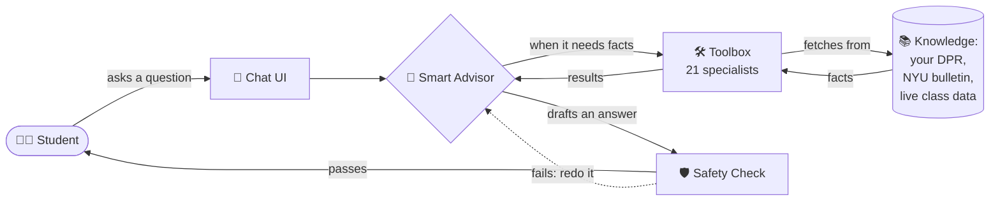
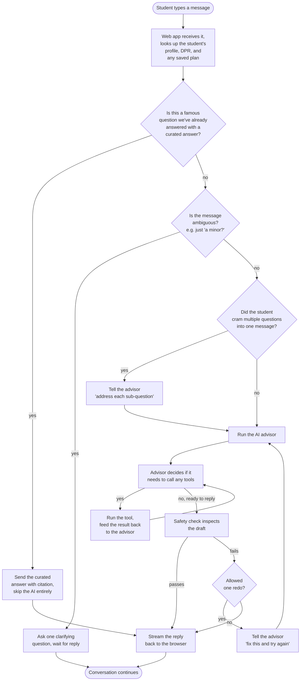
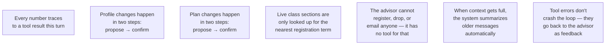
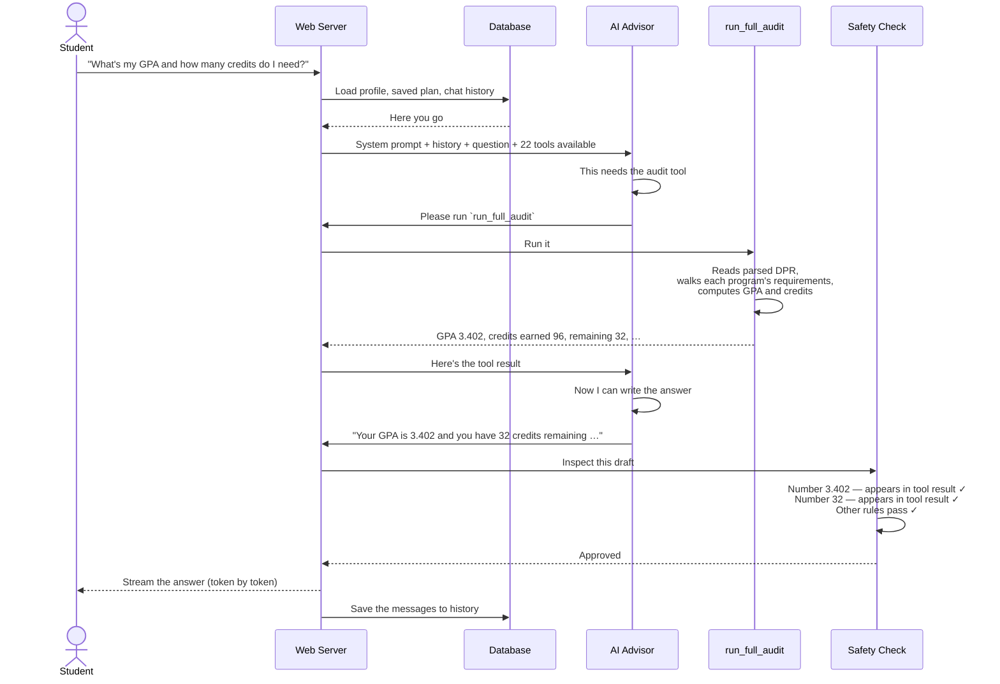

# NYU Path — Project Audit

> **About this document set.** This is a code-truth audit of the NYU Path codebase. Every claim was derived from reading the actual source files. No code comments, no existing documentation, and no narrative prose were used as evidence. Where code and surrounding writing disagreed, the code won.

---

## 1. What NYU Path is, in one paragraph

NYU Path is a **chat-based academic advisor** for **NYU undergraduates**. A student logs in, uploads their official Albert Degree Progress Report (DPR) — the sole accepted onboarding artifact — and starts chatting. The system can answer "how many credits do I still need?", build a term-by-term graduation plan, simulate hypotheticals like "what if I added a math minor?", pull live class sections from NYU's class search, and check internal-transfer eligibility between NYU schools. The DPR is **required** to reach the agent: the chat route returns an "upload your DPR" error if it's missing, and the personal-record tools (`run_full_audit`, `get_academic_standing`) refuse without it (the legacy unofficial-transcript upload path has been removed; there is no authored-rules fallback). Impersonal lookups (policy search, course search) don't need a DPR at the tool level, but the product flow gates the whole conversation on one anyway.

> **Scope — intent vs. current state (important).** The **intended** scope is *all* NYU undergraduate schools, and the architecture's spine supports it: the student's home school is read from their DPR (not hardcoded), school config is loaded by that home school, and the policy RAG corpus already covers every undergrad school. **However, the system is currently CAS-*pinned* in several specific, fixable spots** — the agent's system prompt hardcodes "College of Arts & Science"; only 3 of ~9 school configs exist (`cas`, `stern`, `tandon`); a few audit/planner rules (academic-standing dismissal, graduation-risk, credit-cap) use CAS-only defaults; and `deriveHomeSchool` falls back to `"cas"`. So today it behaves **CAS-first**, with non-CAS schools partially supported or degrading. Making it work equally for all schools is a **data-population + de-hardcoding effort, not an architecture rewrite** — see the implementation plan ([improvement-plan.md](improvement-plan.md)).

---

## 2. The simplest possible picture



That's the whole product in one picture. The "smart advisor" is a language model. The "toolbox" is 22 deterministic functions (no language model — pure logic) that handle audit math, planning, and policy/curriculum lookup. The "safety check" is a set of rules that inspect the draft reply for hallucinations before it ever reaches the student.

---

## 3. What happens when a student sends a message

Think of it as a relay race. Each runner does its part and passes the baton.



---

## 4. The three pieces of the runtime

Almost everything in the codebase serves one of these three pieces. Knowing which is which is enough to navigate.

### The advisor (the language model)

This is the "brain" — an LLM (Anthropic's Claude Haiku by default, OpenAI's GPT-4.1-mini as fallback). It receives a long instructions document (the system prompt), the chat history, and a list of tools it's allowed to call. It either replies with text or asks the system to run a tool. It cannot do math on the student's transcript itself, cannot look up policy, and cannot save anything — every action requires a tool.

### The tools (deterministic functions)

There are **21 of them**. Each one knows how to do one thing — for example, "run a full degree audit", "plan every term until graduation", or "search the policy bulletin for the rule on pass/fail courses". Tools are written in TypeScript. They read data files and the student's session, they run their algorithm, and they return a result. They never call the language model. The advisor uses tools the way a doctor uses a calculator and a reference book — to get numbers and facts the doctor shouldn't be guessing.

### The safety check (response validator)

Before the advisor's draft answer reaches the student, seven rules inspect it. The most important rule: **every number in the answer must come from a tool result that ran this turn.** If the advisor wrote "your GPA is 3.4", and no tool returned 3.4 this turn, the safety check rejects the draft. The advisor gets one chance to fix it before the answer ships anyway (the system never blocks the student with a blank screen).

---

## 5. The big invariants the system enforces

These are the rules the code actually enforces. They're worth knowing because they explain why the system behaves the way it does.



**1. Grounded numbers.** The advisor cannot write a number from memory. Every credit count, GPA, deadline, or section count in the reply must come from a tool result this turn — or be derivable as the sum/difference of two such numbers.

**2. Two-step writes.** When the student says "change my catalog year to 2024-2025", the advisor doesn't immediately mutate the profile. It stages the change, surfaces the consequences ("this will move requirement X to category Y"), and waits for explicit confirmation before applying.

**3. Two-step plan changes.** Same idea for "drop CSCI-UA 421 from Fall 2026" or "add a minor in Math". The change is proposed and its impact shown; only an explicit confirmation applies it.

**4. Lazy section data.** The student's forward schedule is initially structural — "this term has slots for two CS electives and a Core requirement". Only when the student is registering for the next term does the system fetch live sections (CRN, meeting times, instructor) from NYU's class search. Terms more than ~6 months out stay structural because NYU hasn't published sections that far ahead.

**5. Read-only posture.** The advisor cannot register the student for a class, drop a class, submit a transfer application, or send an email. There is no tool for any of those actions. When asked, the advisor refuses and explains the steps the student would take in Albert / advising / OGS portals.

**6. Self-healing context.** As the conversation grows, the system automatically summarizes older messages when it's about to run out of room. If it's nearly out of room, it ends the turn gracefully and asks the student to start a fresh chat with a summary preserved.

**7. Recoverable tool failures.** If a tool throws an error, the loop doesn't crash — it tells the advisor "this tool failed, here's why", and the advisor either tries something else or explains the problem to the student.

---

## 6. The shape of the codebase

```mermaid
graph TB
    subgraph Browser["What the student sees (Browser)"]
        UI[Chat page<br/>app/chat/page.tsx]
        SIDEBAR[Schedule sidebar with<br/>term-by-term plan]
    end

    subgraph NextJS["The web server (Next.js — apps/web)"]
        CHATAPI[Streaming chat endpoint<br/>/api/chat/v2]
        PLANAPI[Plan-edit endpoints<br/>/api/plan/{add,move,swap,...}]
        ONBOARD[Onboarding<br/>/api/onboard]
        AUTH[Email OTP login<br/>/api/auth/*]
        DB[(Postgres database<br/>via Drizzle ORM:<br/>chat history,<br/>saved schedules,<br/>profiles,<br/>cohort assignments)]
    end

    subgraph Engine["The brain + tools (packages/engine)"]
        AGENT[Agent loop<br/>orchestrates LLM + tools]
        VALIDATOR[Response validator<br/>7 safety checks]
        TOOLS[22 tools]
        ALGOS[Audit, planner,<br/>section materializer,<br/>RAG retriever,<br/>DPR parser]
        SESSION[Session state<br/>the shared bag every<br/>tool reads from]
    end

    subgraph Data["Static data (data/)"]
        BULLETIN[Bulletin pages<br/>scraped]
        PROGRAMS[Program rules<br/>for CAS degrees]
        SCHOOLS[Per-school configs:<br/>CAS, Stern, Tandon]
        POLICY[Policy text<br/>embedded for RAG]
        CATALOG[Course catalog<br/>with embeddings]
    end

    subgraph BuildTools["Build-time pipeline (tools/)"]
        SCRAPER[Bulletin scraper]
        PARSER[Bulletin parser]
        EMBEDDER[Course + policy<br/>embedders]
        FOSE_REC[FOSE recorder]
    end

    UI <-->|SSE| CHATAPI
    SIDEBAR -->|fetch| PLANAPI
    CHATAPI --> AGENT
    PLANAPI --> TOOLS
    ONBOARD --> ALGOS
    AUTH --> DB
    AGENT --> VALIDATOR
    AGENT --> TOOLS
    TOOLS --> ALGOS
    TOOLS --> SESSION
    ALGOS --> Data
    SCRAPER --> BULLETIN
    BULLETIN --> PARSER
    PARSER --> PROGRAMS
    EMBEDDER --> POLICY
    EMBEDDER --> CATALOG
    FOSE_REC --> CATALOG
```

**What lives where:**

- **`apps/web/`** — the Next.js website. The chat page, the sidebar, the database, the login flow, the streaming endpoint, the deterministic plan-edit endpoints.
- **`apps/cli/`** — a tiny command-line front end (mostly for debugging/scripting, not the main product).
- **`packages/engine/`** — the brain and the toolbox. Everything that thinks, retrieves, calculates, or validates lives here.
- **`packages/shared/`** — type definitions and grade utilities shared between engine and web.
- **`data/`** — the static knowledge: bulletin scrapes, parsed program rules, school configs, policy text for the AI to retrieve, course catalog with embeddings.
- **`tools/`** — build-time scripts that produce the contents of `data/` (scrapers, parsers, embedders). The runtime never runs them.

---

## 7. What this audit covers

The audit is split into four folders:

### `engine/` — 28 documents
Every subsystem of the AI brain. The most important ones:
- **`agent-loop.md`** — the central orchestrator that runs the AI in a loop with the tools
- **`system-prompt.md`** — the instructions the AI is given before every turn
- **`response-validator.md`** — the seven safety checks
- **`tool-registry.md`** — how tools are organized and dispatched
- **`session-state.md`** — the shared data bag every tool reads from
- **`dpr.md`** — how the official transcript (Albert DPR) is parsed
- **`audit.md`** — the degree-audit engine (does it satisfy your major?)
- **`forward-schedule.md`** — the live multi-term planning solver
- **`rag.md`** — how policy text is retrieved when the AI needs to cite the bulletin
- **`section-materialization.md`** — how a structural plan becomes a real schedule with sections

Plus smaller pieces: the clarifier (handles ambiguous questions), the template matcher (curated answers for FAQs), the LLM clients (OpenAI/Anthropic adapters), and various data loaders.

### `tools/` — 21 documents
One file per **live** tool the AI can call. Each explains: what it does, what it needs, the algorithm, what it returns, and what other tools it works with. See the [tool catalog table](#8-quick-tool-catalog) below.

### `web/` — 12 documents
The Next.js website pieces: the chat endpoint, the chat UI, the plan-edit endpoints, the login flow, the database schema and stores, the sidebar components, the rate limiter.

### `surrounding/` — 4 documents
- The CLI app
- The shared types package
- The build-time `tools/` pipeline
- The `data/` directory layout

### `deprecated/` — docs for superseded / dead code
Segregated so the live docs stay clean: the legacy single-term planner (`plan_semester` tool + `planner` subsystem + `plan-feasibility-verifier`) and the dead unofficial-transcript parser (`transcript`). These describe code that still exists but has no production role — Phase F decommission candidates. See [`deprecated/README.md`](deprecated/README.md).

### `improvement-plan.md` — the roadmap
The phased plan to fix the gaps the audit surfaced (section-complete retrieval, embedding the missing bulletin trees, confidence-scored estimates, de-CAS scope, and the gated legacy decommission). See [`improvement-plan.md`](improvement-plan.md).

---

## 8. Quick tool catalog

| Tool | What it does in plain English |
|---|---|
| `run_full_audit` | Runs the degree audit — what you've satisfied, what's left, your GPA |
| `plan_forward_degree` | Builds a term-by-term plan from now until graduation |
| `view_forward_plan` | Shows the most recently built plan, no recompute |
| `propose_plan_change` | "What would happen if I changed the plan in this way?" — shows impact |
| `confirm_plan_change` | Applies a previously proposed change |
| `simulate_alternatives` | Tries 2–3 plan variants (summer, J-term, extend graduation) |
| `compare_plan_alternatives` | Side-by-side comparison of alternatives the planner already produced |
| `bind_free_elective` | "Use CSCI-UA 480 as my free elective" |
| `bind_pool_slot` | "Use this course for my major-elective pool slot" |
| `materialize_sections` | Fetches real class sections (CRN, time, instructor) for the next term |
| `confirm_section_combination` | "I pick this conflict-free combo of sections" — pins them into the plan |
| `search_policy` | Looks up policy in the bulletin (e.g. pass/fail rules); now also expands the top hit to its full section |
| `get_program_requirements` | Returns a program/major/minor/Core-Curriculum's **entire** requirement page (every section, reassembled) with a confidence band |
| `search_courses` | Semantic course search ("courses about quantum computing") |
| `search_availability` | Are sections of this course actually being offered next term? |
| `check_transfer_eligibility` | Can I transfer from CAS to Stern/Tandon/etc.? |
| `what_if_audit` | "What if I changed my major to X?" — runs a hypothetical audit |
| `get_credit_caps` | Per-semester ceiling, F-1 floor, total credits needed |
| `get_academic_standing` | Probation / academic-standing detail (good standing, probation, dismissal level) — requires a loaded DPR; refuses without one. For GPA + cumulative credits, `run_full_audit` is preferred. |
| `check_overlap` | Detects courses that double-count between two of your programs |
| `update_profile` | Proposes a profile change (school, catalog year, programs, visa) |
| `confirm_profile_update` | Applies a proposed profile change |

Plus `plan_semester` — a deprecated single-term planner that's been replaced by `plan_forward_degree`. It's still in the source for reference but the AI can never call it (docs in [`deprecated/`](deprecated/README.md)).

---

## 9. The single most important picture: a typical conversation



---

## 10. How to read the rest

- If you want to understand **how the AI thinks turn by turn**, read `engine/agent-loop.md`.
- If you want to understand **why answers are accurate**, read `engine/response-validator.md`.
- If you want to understand **what the AI is told to do**, read `engine/system-prompt.md`.
- If you want to understand **how a specific tool works**, open `tools/<tool_name>.md`.
- If you want to understand **how the website is built**, start with `web/chat-route-sse.md`.

Each doc starts with a *Purpose* paragraph in plain English, then goes into detail.
