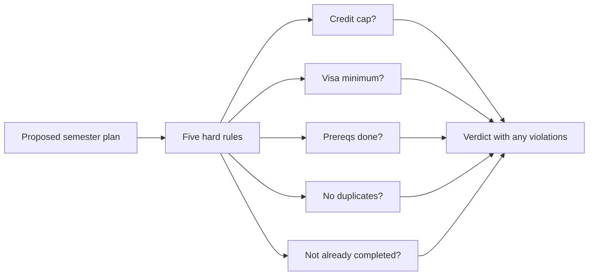
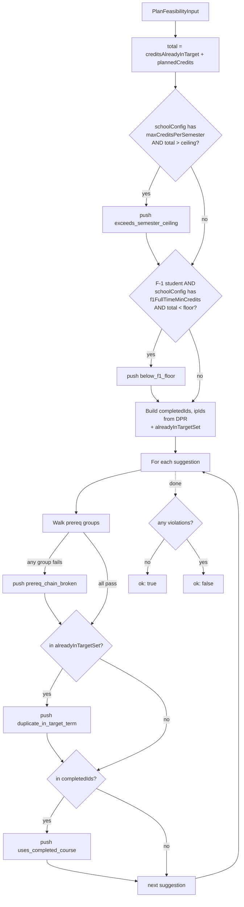

# Plan-Feasibility Verifier

> **Source file:** `packages/engine/src/agent/verifiers/planFeasibility.ts`

## TL;DR

When the system proposes a semester schedule for a student, it can't just hand back any list of courses — the plan has to actually be legal. This verifier is the reality-check that runs every proposed plan through five hard rules: did the plan put more credits in one semester than allowed? Did it leave an international student below the full-time minimum required by their visa? Did it schedule a course before its prerequisites were done? Did it list the same course twice in the same term? Did it include a course the student already finished? If any of those things happen, the verifier writes up exactly which course and which rule was broken, and attaches that to the plan as a warning. It's the equivalent of an advisor's quick sanity-check before signing off on registration.



---

A deterministic verifier that runs after a planner produces a course list. It walks each suggested course against five hard constraints and returns a typed verdict the caller can attach to its envelope's `disclaimers`.

Used historically by `plan_semester` (now deprecated) and available for any callers that produce term-level plans.

---

## 1. The verdict shape

```
PlanFeasibilityVerdict = {
  ok: boolean
  violations: FeasibilityViolation[]
}

FeasibilityViolation = {
  kind:  "exceeds_semester_ceiling"
       | "below_f1_floor"
       | "prereq_chain_broken"
       | "duplicate_in_target_term"
       | "uses_completed_course"
  detail: string
  courseId?: string
}
```

---

## 2. The input

```
PlanFeasibilityInput = {
  suggestions:                CourseSuggestion[]
  plannedCredits:             number       // credits the planner wants to add
  targetSemester:             string       // e.g. "2025-fall" — for message text
  creditsAlreadyInTarget:     number       // credits the student already has in this term
  alreadyRegisteredForTargetIds: string[]  // course ids already in IP rows for target term
  schoolConfig:               SchoolConfig | null
  visaStatus:                 string | undefined
  dpr:                        DegreeProgressReport | null
  prereqs:                    Prerequisite[] | undefined
}
```

---

## 3. The five checks

### Check 1 — `exceeds_semester_ceiling`

Fires when `creditsAlreadyInTarget + plannedCredits > schoolConfig.maxCreditsPerSemester` (only when `schoolConfig` defines a ceiling).

Violation message includes the projected total, the breakdown, the school's ceiling, and a citation built via `formatCitation("data/schools/<schoolId>.json#maxCreditsPerSemester")`.

### Check 2 — `below_f1_floor`

Fires when `visaStatus === "f1"` AND `creditsAlreadyInTarget + plannedCredits < schoolConfig.f1FullTimeMinCredits`.

Violation message includes the projected total, the F-1 floor, citation, and a note that dropping below the floor puts visa status at risk + recommendation to consult OGS.

### Check 3 — `prereq_chain_broken`

For each suggested course:

1. Look up its prereq groups in `prereqs` (indexed by course id).
2. For each prereq group:
   - If `group.type === "NOT"`: violation if any course in `notCourses` is in the `has` set.
   - If `group.type === "AND"`: violation if not every course in `group.courses` is in `has`.
   - If `group.type === "OR"`: violation if no course in `group.courses` is in `has`.
3. `has` is computed as: course id is in `completedIds` (DPR rows of type `EN` or `TE`) OR `ipIds` (DPR rows of type `IP`) OR `alreadyInTargetSet`.

Violation message lists every unmet group as `"any of [a, b, c]"` or `"all of [a, b]"` or `"must not have taken [x]"`.

### Check 4 — `duplicate_in_target_term`

For each suggested course, if its id is in `alreadyRegisteredForTargetIds`, fire. This catches the planner suggesting a course the student is already registered for that very term.

### Check 5 — `uses_completed_course`

For each suggested course, if its id is in `completedIds` (DPR row of type `EN` or `TE`), fire. Backstops the planner's own `takenIds` dedup.

---

## 4. Why the violations carry "evidence"

Every violation `detail` includes the data the verifier used: the projected total, the source citation, the prereq groups, etc. This is so the agent can pass the evidence back to the student verbatim without doing its own reasoning. The pattern is: don't just say "this fails" — say what was checked, what the source was, and what would fix it.

---

## 5. Flow



---

## 6. Where it's called

- Historically `plan_semester` (deprecated as of May 2026) attached the verdict's violations as envelope disclaimers.
- Available for any future planner that wants the same hard-constraint sweep — the verifier is pure and decoupled.

---

## 7. What it never does

- It does not call the LLM.
- It does not mutate any state.
- It does not enforce **soft** constraints (load balance, distinct subjects, time conflicts). Those live in the forward-schedule solver.
- It does not check prereqs for courses already in `alreadyRegisteredForTargetIds` — they're treated as already "had" for `has` membership purposes.
- It does not consult `equivalenceResolver` — prereq checks are by literal course id only.
