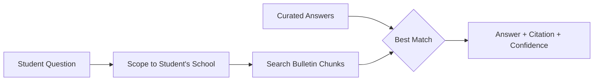
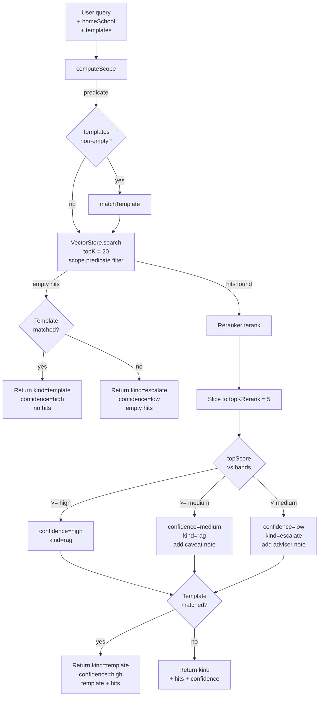
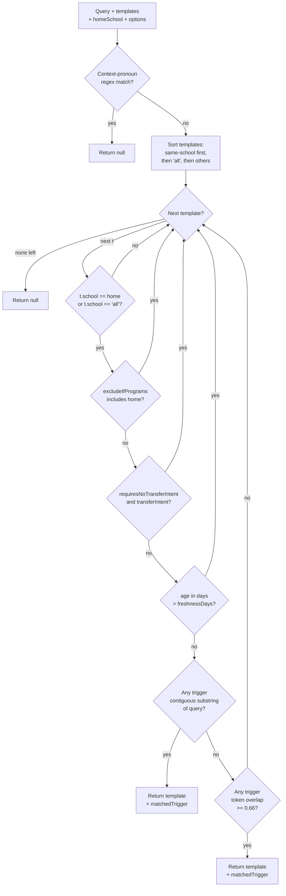

# RAG Subsystem

## TL;DR

This is the "look it up in the bulletin" librarian. When the AI needs to answer a policy question (like "can I take a major course pass/fail?" or "how do I transfer to Stern?"), it can't just make up an answer from memory; it has to cite NYU's official bulletin. This subsystem chops the bulletin into searchable chunks, builds an index over them, and then for any question the AI asks, returns the chunks most likely to contain the answer. It only searches the parts of the bulletin that apply to the student's home school. For the most common questions, there's also a stash of hand-verified curated answers that get priority. Each result comes with a confidence rating, so the AI knows whether to quote it directly, add a caveat, or just tell the student to talk to an advisor.



---

## 1. Overview

The RAG (retrieval-augmented generation) subsystem is the engine's policy-grounding layer. Its single job: when the agent needs to answer a question that is governed by NYU bulletin text (academic policies, admissions rules, program curricula, core curriculum requirements, course catalogs), it returns the most relevant slices of that bulletin so the agent can quote them verbatim instead of synthesizing prose from memory.

The subsystem lives entirely under `packages/engine/src/rag/` and is a self-contained pipeline of seven cooperating stages:

1. **Chunker** — turns bulletin markdown into searchable units.
2. **Embedder** — turns text into vectors.
3. **Vector store** — holds the embedded chunks and runs cosine top-K.
4. **Scope filter** — restricts candidates to schools the student actually belongs to.
5. **Reranker** — re-scores the cosine top-K with a relevance model.
6. **Template matcher** — curated, hand-verified answers for high-frequency questions that run alongside the RAG path.
7. **Policy search orchestrator** — the entry point that runs all of the above and packages the result with a confidence band.

A disk cache (`policyCorpusCache.ts`) lets callers skip the cold-start embed pass by loading a precomputed JSONL of (chunk, embedding) rows produced by an offline embed tool.

The barrel export at `packages/engine/src/rag/index.ts:1-59` lists everything the rest of the engine is allowed to import from this module.

> **Update (improvement plan, Phase B) — section-complete retrieval is now implemented.** `rag/sectionRetrieval.ts` adds `reassembleSource` (whole page), `reassembleSection` (whole section), and `locateBestSource` (scope → vector → rerank → pick the best *source*). Two surfaces use them: `search_policy` now expands its **top** hit to its full section (a `FULL SECTION` block), and a new `get_program_requirements` tool returns an entire program **page** (every section reassembled in order) with a confidence band. The reality check below describes the pre-Phase-B behavior; the residual gap is *cross-section* policies whose other sections still arrive only as top-3 fragments.
>
> **Reality check (pre-Phase-B) — retrieval was single-shot and fragment-level, not section-complete.** The orchestrator runs one vector pass (top-20) → rerank → returns the **top 5 chunks** (see §7). The chunker (§3) splits each bulletin page into ~500-token fragments on `#/##/###` headings, so a single program or policy page fragments into a **median of ~13 chunks** (the largest pages fragment into 73–98). A multi-part policy whose pieces are spread across one page — e.g. Pass/Fail = a career cap + a per-term cap + a Core exception + a foreign-language exception + a major-course restriction — could have some of its parts land outside the top-5 window and be silently dropped from the answer. Each chunk carries `sourcePath` + `section` in its metadata (see §2), so whole-section / whole-page retrieval **was implementable** — Phase B implemented it. The system prompt still discourages re-querying (rule 7 tells the agent to make one `search_policy` call and otherwise defer to an adviser), so for *cross-section* policies the reassembled top section plus the fragment hits are what the agent works from.

---

## 2. Corpus

**File:** `packages/engine/src/rag/corpus.ts`

The corpus is the set of bulletin markdown files that get chunked, embedded, and indexed. It is built from a hard-coded entry list, optionally augmented by directory discovery for program pages.

### Source location

The bulletin lives at the monorepo root under `data/bulletin-raw/`. The path is computed from the file's own location (`corpus.ts:27-29`): four `..` up from `packages/engine/src/rag/`, then `data/bulletin-raw/`.

> **Reality check — what is and isn't in the policy corpus.** The production policy corpus (`data/policy-corpus/policy_chunks.jsonl`, **5,400 chunks**, of which **4,727 are tagged `category:program`**) is built from the **`undergraduate/` tree only** — i.e. undergraduate program pages and academic-policy pages, across all undergrad schools. It is **rich on program requirements**: it does contain program-requirement pages (with course-list tables) for every undergraduate school. What is **NOT** embedded into this corpus: `internal-transfer-equivalencies/` (9 raw files — transfer equivalencies), `ogs/` (160 files — F-1 / visa depth), `graduate/`, and the NYU-wide `nyu/` tree. Course descriptions are **embedded separately** (`data/course-catalog/course_embeddings_openai.jsonl`, **17,122 vectors**) for the `search_courses` tool — they are not part of this policy corpus. So a visa-depth or transfer-equivalency question has no embedded bulletin text to retrieve, and transfer eligibility is answered from authored JSON instead (see `check_transfer_eligibility`).

### Default entries

`DEFAULT_ENTRIES` (`corpus.ts:46-75`) is a list of 13 hard-coded `CorpusEntry` records, each carrying:

```
CorpusEntry {
  school:    "cas" | "stern" | "tandon" | "tisch" | "gallatin"
             | "liberal_studies" | "all"
  source:    human-readable title (e.g. "CAS Academic Policies")
  relPath:   path under data/bulletin-raw/
  category?: "academic_policy" | "admissions" | "program"
             | "core_curriculum" | "course_catalog" | "school_overview"
}
```

The default set covers:

- Academic-policy `_index.md` pages for CAS, Stern, Tandon, Tisch, Gallatin, Liberal Studies.
- Admissions pages for CAS (tagged `school: "all"` — see below) and Stern.
- The CAS EXPOS-UA course catalog.
- The CAS Economics BA page.
- Gallatin and Liberal Studies school-overview pages.

The `school: "all"` tag on the CAS internal-transfer admissions page (`corpus.ts:55-56`) means it always passes the scope filter for any student — it's the NYU-wide transfer admissions document.

### Program-page discovery

When `BuildCorpusOptions.includeProgramPages` is true, two helpers run after the default list:

- `discoverProgramEntries` (`corpus.ts:142-167`) — walks `data/bulletin-raw/undergraduate/<school-dir>/programs/` for each school directory whose name maps to a known school id via `PROGRAM_DIR_TO_SCHOOL` (`corpus.ts:100-109`). The map: `arts-science → cas`, `arts → tisch`, `business → stern`, `engineering → tandon`, `individualized-study → gallatin`, `liberal-studies → liberal_studies`, `abu-dhabi → nyuad`, `shanghai → shanghai`. For each program slug it finds an `_index.md` for, it adds a `CorpusEntry` tagged `category: "program"` with a human label derived by `programSlugToLabel` (`corpus.ts:115-137`).
- `discoverCoreCurriculumEntries` (`corpus.ts:172-187`) — currently a single hard-coded candidate, the CAS College Core Curriculum page, tagged `category: "core_curriculum"`.

Both discovery passes de-duplicate against entries already in `DEFAULT_ENTRIES` by `relPath` (`corpus.ts:210-213`).

### Build flow

`buildCorpus(embedder, options)` (`corpus.ts:199-259`):

1. Resolves catalog year (default `"2025-2026"`) and bulletin dir.
2. Optionally extends the entry list with discovered program + core-curriculum pages.
3. Creates a fresh `VectorStore` bound to the supplied embedder.
4. For each entry: reads the markdown, runs `chunkMarkdown`, accumulates `PolicyChunk[]` tagged with `source`, `school`, `year`, `sourcePath`, and `category` (when present).
5. Tracks any entries whose file is missing in a `skipped` list. If `options.strict === true`, throws; otherwise warns via `console.warn` unless `warnOnSkip === false`.
6. Calls `store.addChunks(allChunks)` to embed everything in one pass.
7. Returns `{ store, chunks, skipped }`.

### Chunk shape after corpus build

After chunking, each chunk has the canonical shape:

```
PolicyChunk {
  text: string                  // the chunk body
  meta: {
    source: string              // e.g. "CAS Academic Policies"
    school: string              // lowercase school id
    year: string                // catalog year
    section: string             // heading the chunk lives under
    chunkId: string             // stable, slug-derived id
    sourcePath: string          // bulletin-raw-relative path
    sourceLine: number          // 1-indexed line where the chunk begins
    category?: "academic_policy" | "admissions" | "program"
             | "core_curriculum" | "course_catalog" | "school_overview"
  }
}
```

---

## 3. Chunker

**File:** `packages/engine/src/rag/chunker.ts`

Pure function. Same markdown in, same chunks out — no randomness, no LLM call.

### Pipeline

`chunkMarkdown(markdown, base, options)` (`chunker.ts:65-114`) does three things:

1. **Strip boilerplate** via `stripBulletinBoilerplate` (`chunker.ts:202-216`):
   - Removes `<![CDATA[ ... ]]>` JS blocks that the scraper inlined.
   - Removes tab-anchor nav lines matching `* [Label](#somethingcontainer)`.
   - Removes the literal `On This Page` TOC marker.
   - These are replaced with empty lines, not deleted, so `sourceLine` indexing stays correct.
2. **Split into sections** via `splitIntoSections` (`chunker.ts:122-168`):
   - Scans line-by-line for headings matching `/^(#{1,6})\s+(.+?)\s*$/`.
   - On each heading, flushes the previous section (unless the buffer is empty and the previous heading was the synthetic `(preamble)`).
   - Tracks `startLine` of each section for the chunk metadata.
   - Even heading-only sections (no body) are flushed so their heading gets indexed.
3. **Split oversized sections** via `splitOversized` (`chunker.ts:174-187`):
   - Tokenizes body on whitespace.
   - If `tokens.length <= maxTokens`, returns `[body]` unchanged.
   - Otherwise slides a window of size `maxTokens` with stride `maxTokens - overlapTokens`, joining each window's tokens back with single spaces. This is a **sliding-window** approach with overlap, but the splits happen on token boundaries, not paragraph boundaries (despite the section-splitting still being heading-aware).

### Defaults

- `maxTokens` default: 500 (`chunker.ts:70`).
- `overlapTokens` default: 50 (`chunker.ts:71`).
- `slug` for `chunkId` prefix defaults to a slugified `base.source` (`chunker.ts:72`, helper at `chunker.ts:189-194`).

A "token" here is a whitespace-delimited word — not a real subword tokenizer, just `.split(/\s+/)`.

### chunkId format

Each chunk's `chunkId` is `${slug}_${pad3(runningIndex)}` (`chunker.ts:94`, `chunker.ts:107`). `pad3` (`chunker.ts:218-220`) zero-pads to three digits. So `"CAS Academic Policies"` becomes slug `cas_academic_policies`, and its chunks are `cas_academic_policies_001`, `cas_academic_policies_002`, etc.

> **Consequence — pages fragment heavily** (mitigated in Phase B). Because the section split is per-heading and oversized sections are further window-split at 500 tokens, a single bulletin page does not stay one chunk. In the production corpus a program/policy page fragments into a **median of ~13 chunks** (the largest pages reach 73–98). The `section` heading + `sourcePath` are preserved on every chunk, so fragments *can* be grouped back into their parent section/page. Phase B's `rag/sectionRetrieval.ts` does exactly that at retrieval time: `reassembleSource` regroups a whole page (used by `get_program_requirements`) and `reassembleSection` regroups one section (used by `search_policy`'s FULL SECTION block), sorting by `sourceLine` then `chunkId` ordinal and stripping the window-split overlap. The residual top-5 limit still applies to *which other sections* surface as fragments.

### Heading-only sections

If a section has no body after splitting (e.g. `### Reserved` with nothing under it), the chunker emits a single chunk whose `text` is the heading itself (`chunker.ts:81-98`). This keeps the heading discoverable rather than letting it silently vanish.

---

## 4. Embedder

**File:** `packages/engine/src/rag/embedder.ts`

### Interface

All embedders satisfy:

```
Embedder {
  readonly dim: number                       // fixed dimensionality
  readonly modelId: string                   // stable cache-key string
  embed(text: string): Promise<Float32Array>
  embedBatch(texts: string[]): Promise<Float32Array[]>
}
```

(`embedder.ts:17-24`)

### LocalHashEmbedder (test/offline default)

`LocalHashEmbedder` (`embedder.ts:41-71`) is a deterministic bag-of-hashed-features vectorizer. Algorithm:

1. Tokenize: lowercase, replace non-`[a-z0-9\s/-]+` with space, split on whitespace, drop tokens of length < 2 (`embedder.ts:154-160`).
2. Count frequencies per token.
3. For each `(token, count)` pair, compute `fnv1a32(token) % dim` to pick a bucket index, then increment that bucket by `Math.log(1 + count)`.
4. L2-normalize the result.

- Default `dim`: 256 (`embedder.ts:45`).
- `modelId` format: `local-hash-${dim}` (`embedder.ts:47`).
- `embedBatch` just maps `embedSync` over the input array (`embedder.ts:54-56`).

### OpenAIEmbedder (production)

`OpenAIEmbedder` (`embedder.ts:88-140`) targets the OpenAI embeddings API.

- Default model: `"text-embedding-3-small"` (`embedder.ts:101`).
- Dimensionality: 1536 for `text-embedding-3-small`, 3072 for `text-embedding-3-large` (`embedder.ts:103`).
- `modelId` format: `openai:${model}` (`embedder.ts:104`).
- **Batching:** `embedBatch` slices its input into windows of 100 per HTTP call (`embedder.ts:117-128`). All returned embeddings are L2-normalized before storage (`embedder.ts:125-126`) — this is what makes cosine simplify to a dot product downstream.
- Empty input returns `[]` immediately (`embedder.ts:114`).
- Uses lazy `import("openai")` (`embedder.ts:132-139`) so callers who stay on `LocalHashEmbedder` don't pull the SDK into their bundle.
- Accepts an `injectedClient` override for tests (`embedder.ts:96-99`).

### Cosine similarity

`cosineSim(a, b)` (`embedder.ts:143-150`) is just a dot product. It assumes inputs are already unit-normalized (both embedders normalize) and throws on dimension mismatch. Used by `VectorStore.search` for ranking.

---

## 5. Vector store

**File:** `packages/engine/src/rag/vectorStore.ts`

The vector store is a **pure in-memory array of `IndexedChunk` records** — no FAISS, no HNSW, no ANN approximations. It does a brute-force cosine pass over every candidate.

### Data structure

```
IndexedChunk extends PolicyChunk {
  embedding: Float32Array
}
```

(`vectorStore.ts:16-18`)

`VectorStore` holds a private `items: IndexedChunk[]` plus its bound `embedder` (`vectorStore.ts:26-31`).

### Loading paths

Two ways to populate:

- **`addChunks(chunks)`** (`vectorStore.ts:41-46`) — calls `embedder.embedBatch(...)` on every chunk's text and stores the `(chunk + embedding)` row. This is what `buildCorpus` uses.
- **`addPrecomputed(items)`** (`vectorStore.ts:55-65`) — accepts pre-embedded `{ chunk, embedding }` rows from disk cache. Validates each row's `embedding.length === embedder.dim` and throws on mismatch. No network round-trip.

### Top-K search

`search(query, topK, predicate?)` (`vectorStore.ts:72-87`):

1. Embed the query once (`vectorStore.ts:77`).
2. If a `predicate` is supplied, pre-filter `this.items` with it (this is where the **scope filter** is applied — schools must match before cosine even runs).
3. For each surviving candidate, compute `cosineSim(queryVec, c.embedding)`.
4. Sort by `score` descending.
5. Return the top `topK` as `VectorSearchHit { chunk, score }[]`.

The pre-filter is the design point that lets the orchestrator enforce school scope **before** spending cycles on cosine for chunks the student would never see anyway.

### Diagnostics

`size` getter (`vectorStore.ts:33-35`), `embedderModelId` getter (`vectorStore.ts:37-39`), and `listAll()` (`vectorStore.ts:90-92`) snapshot for tests and telemetry.

---

## 6. Reranker

**File:** `packages/engine/src/rag/reranker.ts`

A reranker takes the cosine top-K and re-scores each candidate with a more expensive but more discriminating model. There are two implementations behind the `Reranker` interface (`reranker.ts:20-23`).

### Interface

```
Reranker {
  readonly modelId: string
  rerank(query: string, hits: VectorSearchHit[]): Promise<RerankedHit[]>
}

RerankedHit extends VectorSearchHit {
  rerankScore: number   // in [0, 1]
}
```

(`reranker.ts:20-28`)

### LocalLexicalReranker (deterministic offline)

`LocalLexicalReranker` (`reranker.ts:30-69`) blends two features:

- **Body overlap fraction** — count of query tokens that also appear in the chunk's body text, divided by query token count.
- **Heading overlap fraction** — same calculation but against `chunk.meta.section`.

Both use the local `tokenize` helper (`reranker.ts:71-77`): lowercase, strip non-`[a-z0-9\s/-]+`, split on whitespace, drop tokens of length < 3 (note: stricter than the embedder's length-2 filter).

Blended score:

```
rerankScore = clamp01(0.7 * bodyFrac + 0.3 * headingFrac)
```

(`reranker.ts:56-58`). Empty-query short circuit returns all hits with `rerankScore: 0` (`reranker.ts:35-37`).

Sort: primary by `rerankScore` desc, secondary stable tie-break by `chunk.meta.chunkId` lexicographic (`reranker.ts:63-66`).

`modelId`: `"local-lexical"` (`reranker.ts:31`).

### CohereReranker (production cross-encoder)

`CohereReranker` (`reranker.ts:121-181`) wraps the Cohere Rerank v3.5 API.

- Default model: `"rerank-v3.5"` (`reranker.ts:129`).
- `modelId` format: `cohere:${model}` (`reranker.ts:130`).
- For each hit, the document sent to Cohere is `${heading}\n\n${body}` when a non-empty `meta.section` exists, otherwise just `body` (`reranker.ts:136-140`) — this gives the cross-encoder explicit access to the heading signal that the local reranker boosts numerically.
- `top_n` is set to the full input length, so Cohere returns scores for every input hit (`reranker.ts:147`).
- Reads `relevanceScore` or `relevance_score` from each result row (v2 SDK uses camelCase, v1 used snake_case) and clamps to `[0, 1]` (`reranker.ts:150-157`).
- Empty input returns `[]` immediately (`reranker.ts:135`).
- Lazy-imports `cohere-ai` and tries `CohereClientV2` first, falls back to `CohereClient` (`reranker.ts:165-180`).
- Accepts an `injectedClient` for tests (`reranker.ts:108-118`).

Sort: same primary/secondary as `LocalLexicalReranker` (`reranker.ts:158-161`).

### Threshold behavior

Neither reranker drops anything itself. **The threshold decision is made by the orchestrator** (`policySearch`), not by the reranker — see §13 below.

---

## 7. Policy search (the orchestrator)

**File:** `packages/engine/src/rag/policySearch.ts`

`policySearch(query, options, deps)` (`policySearch.ts:98-222`) is the public entry point. It composes the scope filter, the vector store, the reranker, and the template matcher into one pass and packages the result with a `ConfidenceBand`.

### Dependencies (injected)

```
PolicySearchDeps {
  store:         VectorStore
  embedder:      Embedder
  reranker:      Reranker
  matchTemplate: function (query, templates, homeSchool) → TemplateMatchResult | null
}
```

(`policySearch.ts:84-93`)

Note: `matchTemplate` is passed as a **function dependency**, not imported directly. The orchestrator never calls into `policyTemplate.ts` itself — the agent layer wires in the real `matchTemplate` implementation.

### Options

```
PolicySearchOptions extends ScopeOptions {
  topKVector?:        number              // default 20
  topKRerank?:        number              // default 5
  templates?:         PolicyTemplate[]
  confidenceBands?:   { high, medium }    // default lexical bands
}
```

(`policySearch.ts:71-82`)

### Flow

1. **Compute scope.** `computeScope(query, options)` (`policySearch.ts:119`). The result is `{ predicate, scopedSchools, overrideTriggered, overrideMatchedSchools }`.
2. **Try template match.** If `options.templates` is non-empty, call `deps.matchTemplate(query, templates, homeSchool)` (`policySearch.ts:120-124`). The result is held aside — it is **no longer** a short-circuit return.
3. **Note override.** If the scope detected an explicit cross-school override, prepend a telemetry note (`policySearch.ts:128-132`).
4. **Vector search.** `deps.store.search(query, topKVector, scope.predicate)` returns up to `topKVector` cosine hits filtered by scope (`policySearch.ts:135-137`).
5. **Handle empty hits.** If `hits.length === 0`:
   - If a template matched, return `kind: "template"` with `confidence: "high"`, `candidateCount: 0`, no `hits` (`policySearch.ts:139-153`).
   - Otherwise return `kind: "escalate"` with empty hits and a note that no chunks were in scope (`policySearch.ts:154-166`).
6. **Rerank.** `deps.reranker.rerank(query, hits)` then slice to `topKRerank` (`policySearch.ts:169-170`).
7. **Confidence gate** (see §13 below).
8. **Merge with template.** If a template matched AND RAG hits exist, return `kind: "template"` with both `template` AND `hits` populated. Confidence is forced to `"high"` because curated content is operator-verified (`policySearch.ts:199-211`).
9. Otherwise return `{ kind, hits: top, confidence, ... }` (`policySearch.ts:213-221`).

### Result shape

```
PolicySearchResult {
  kind:               "template" | "rag" | "escalate"
  template?:          TemplateMatchResult       // when template matched
  hits?:              RerankedHit[]             // when RAG ran
  confidence:         "high" | "medium" | "low"
  scopedSchools:      string[]
  overrideTriggered:  boolean
  candidateCount:     number     // hits after scope, before rerank slice
  notes:              string[]
}
```

(`policySearch.ts:50-69`)

`candidateCount` is the count **after the scope filter** but **before** the rerank slice — so it tells callers how many chunks the cosine pass actually considered.

---

## 8. RAG scope filter

**File:** `packages/engine/src/rag/ragScopeFilter.ts`

Applied **before** vector search, as a `(chunk) → boolean` predicate handed to `VectorStore.search`.

### What it scopes by

**Only school.** Year filtering was removed (see `ragScopeFilter.ts:78-90` comment block); the predicate at `ragScopeFilter.ts:88-91` only checks `scopedSchools.includes(chunk.meta.school)`.

**Not in scope:** `transferIntent`, `recency`, `category`, `lastVerified`, or anything else. Those filters live elsewhere (template matcher handles `transferIntent` and freshness; the agent layer handles category preference).

### Default-hard schools

`computeScope(query, options)` (`ragScopeFilter.ts:65-99`):

- Always-included: `options.homeSchool` (lowercased) plus the literal string `"all"`. `"all"` is the catch-all tag the corpus puts on NYU-wide documents like the CAS internal-transfer admissions page.
- **Explicit override:** when `allowExplicitOverride` is true (the default), the query is matched against `SCHOOL_NAME_PATTERNS` (`ragScopeFilter.ts:46-56`). Any literal school name found (other than the home school, which is already in) is added to scope.

### School name patterns

```
SCHOOL_NAME_PATTERNS  (ragScopeFilter.ts:46-56)
  cas              ← "cas", "college of arts and science", "arts and science"
  stern            ← "stern"
  tandon           ← "tandon", "engineering school"
  tisch            ← "tisch"
  steinhardt       ← "steinhardt"
  nursing          ← "nursing", "meyers"
  liberal_studies  ← "liberal studies", "ls program"
  gallatin         ← "gallatin"
  sps              ← "sps", "school of professional studies",
                     "professional studies"
```

All patterns are case-insensitive with word-boundary anchors. No alias resolution beyond what's in the table.

### Return value

```
ScopeDecision {
  predicate:              (chunk) → boolean
  scopedSchools:          string[]    // [homeSchool, "all", ...overrides] dedup'd
  overrideTriggered:      boolean     // true if any override matched
  overrideMatchedSchools: string[]    // which overrides matched
}
```

(`ragScopeFilter.ts:32-44`)

`detectExplicitSchools(query)` (`ragScopeFilter.ts:105-111`) is a sibling that just returns the matched school ids — used for telemetry without building the full predicate.

---

## 9. Policy template

**File:** `packages/engine/src/rag/policyTemplate.ts`

Curated, hand-verified answer templates for high-frequency questions. They run **alongside** RAG, not before it (see §7).

### Template shape

```
PolicyTemplate {
  id:             string            // stable, e.g. "pf_major"
  triggerQueries: string[]          // substrings or phrasings to match
  body:           string            // the curated answer (markdown)
  source:         string            // bulletin citation
  school:         string            // "cas" | "stern" | ... | "all"
  lastVerified:   string            // ISO date "YYYY-MM-DD"
  applicability?: {
    excludeIfPrograms?:        string[]
    requiresNoTransferIntent?: boolean
  }
}
```

(`policyTemplate.ts:30-44`)

### matchTemplate — the 5-step §5.5 gate

`matchTemplate(query, templates, homeSchool, options?)` (`policyTemplate.ts:127-191`) runs every candidate template through a five-step gate, returning the **first** template that passes all of them. Templates are pre-sorted so that same-school templates rank before `"all"` templates before everything else (`policyTemplate.ts:146-150`).

**Step 1 — Context-pronoun guard.** Before anything else, `matchTemplate` checks the query against `CONTEXT_PRONOUN_RE` (`policyTemplate.ts:53`):

```
/^\s*(?:can\s+i\s+do
       |is\s+it
       |are\s+(?:those|these|they)
       |what\s+about\s+(?:that|those|these|it|them))\b/i
```

If the query starts with one of these context-dependent phrasings (`policyTemplate.ts:140`), the function returns `null` immediately — the referent is ambiguous, so the literal-trigger fast-path is unsafe and the chat layer falls through to RAG.

**Step 2 — School scope.** A template is skipped if `t.school !== home && t.school !== "all"` (`policyTemplate.ts:154`).

**Step 3 — Applicability exclusions.** Skip if:
- `t.applicability.excludeIfPrograms?.includes(home)` (`policyTemplate.ts:157`) — e.g. a CAS P/F template excluded for Stern students.
- `t.applicability.requiresNoTransferIntent === true && options.transferIntent === true` (`policyTemplate.ts:158`) — suppress templates that don't apply to students exploring a transfer.

**Step 4 — Freshness.** Parse `t.lastVerified` as ISO date (assumes `YYYY-MM-DD`, appends `T00:00:00Z`). Skip if unparseable or if age > `freshnessDays` (default 365 days, from `TEMPLATE_FRESHNESS_DAYS` at `policyTemplate.ts:48`) relative to `options.now ?? new Date()` (`policyTemplate.ts:160-164`).

**Step 5 — Similarity (trigger match).** Two sub-passes:

- **Contiguous-substring pass** (`policyTemplate.ts:172-175`) — find the first trigger whose lowercased form is a substring of the lowercased query.
- **Token-overlap pass** (`policyTemplate.ts:176-188`) — tokenize the query, drop stop words (`STOP_WORDS` at `policyTemplate.ts:66-82`), then for each trigger:
  - Tokenize the trigger and drop stop words.
  - Count how many trigger tokens appear in the query token set.
  - Require at least one overlap and `overlap / trigTokens.length >= TOKEN_OVERLAP_THRESHOLD` (0.66, `policyTemplate.ts:61`).

The token-overlap pass catches non-contiguous phrasings like "Can I take a major course P/F?" against trigger `"p/f major"`.

### Tokenization for templates

`tokenize` (`policyTemplate.ts:86-92`) preserves `/`, `+`, `#`, `-` inside tokens so "p/f", "c++", and "intro-to" survive. `nonStopTokens` strips `STOP_WORDS` afterward (`policyTemplate.ts:94-96`). Stop words are deliberately tiny — function words only, no domain terms.

### Return value

```
TemplateMatchResult {
  template:       PolicyTemplate
  matchedTrigger: string         // which trigger phrase fired
}
```

(`policyTemplate.ts:98-102`)

`null` if no template passed all five gates.

---

## 10. Policy template loader

**File:** `packages/engine/src/rag/policyTemplateLoader.ts`

Templates come from **JSON files**, not hard-coded constants.

### Source location

`data/policy_templates/` at the monorepo root, resolved by walking four `..` up from this file (`policyTemplateLoader.ts:16-18`).

### Loader

`loadPolicyTemplates(opts?)` (`policyTemplateLoader.ts:26-56`):

1. If the directory doesn't exist, return `{ templates: [], skipped: [] }` (`policyTemplateLoader.ts:31`).
2. List `.json` files in the directory.
3. For each file:
   - Parse JSON. On parse error, push to `skipped` with the error message and continue (`policyTemplateLoader.ts:36-41`).
   - Run `validateFileWithMeta(parsed)` (from `../provenance/schema.js`) — checks the `_meta` provenance block. On failure, push to `skipped` and continue.
   - Strip `_meta` from the body (`policyTemplateLoader.ts:47`).
   - Run `validatePolicyTemplateBody(body)` (from `../provenance/configSchema.js`) on the remaining fields. On failure, push to `skipped` and continue.
   - On success, push the body as a `PolicyTemplate`.
4. Return `{ templates, skipped }`. `skipped` is for telemetry; it does **not** block the load.

### Return shape

```
PolicyTemplateLoadResult {
  templates: PolicyTemplate[]
  skipped:   Array<{ path: string; errors: string[] }>
}
```

(`policyTemplateLoader.ts:20-24`)

---

## 11. Policy corpus cache

**File:** `packages/engine/src/rag/policyCorpusCache.ts`

A disk cache that lets callers skip the cold-start `embedBatch(...)` round-trip by loading precomputed `(chunk, embedding)` rows from a JSONL file.

### What's cached

A JSONL file (one JSON object per line) produced by an external tool at `tools/policy-corpus-embed/embed.mjs`. Each line:

```
{ chunk: PolicyChunk, embedding: number[] }
```

A companion `.meta.json` file alongside it carries:

```
PolicyCorpusCacheMeta {
  embedderModelId?: string
  dimension?:       number
  chunkCount?:      number
  skippedEntries?:  string[]
  embeddedAt?:      string
  sourceHash?:      string
  format?:          string
}
```

(`policyCorpusCache.ts:19-27`)

### Streaming reader

`readJsonlChunks(path)` (`policyCorpusCache.ts:44-70`) reads the JSONL using `node:fs` low-level `openSync` / `readSync` with a 64KB buffer (`1 << 16`), splitting on newlines and parsing each non-empty line. The buffered approach avoids holding the whole file as a single string (the corpus can be 100MB+).

### Loader

`loadPolicyCorpusFromCache(opts)` (`policyCorpusCache.ts:78-98`):

1. Resolve `metaPath` from `cachePath.replace(/\.jsonl$/, ".meta.json")` if not provided (`policyCorpusCache.ts:80`).
2. Read meta if the file exists (`policyCorpusCache.ts:83-85`).
3. If `validateMeta` is true (default) AND `meta.dimension` is set AND it doesn't match `embedder.dim`, throw with a message telling the caller to re-run the embed tool (`policyCorpusCache.ts:87-92`).
4. Create a fresh `VectorStore(embedder)`.
5. Stream-read the JSONL into `{ chunk, embedding }` rows, convert `embedding` from `number[]` to `Float32Array`.
6. Call `store.addPrecomputed(items)` — which validates each row's dimension against `embedder.dim` a second time.
7. Return `{ store, meta }`.

The function **throws** if the cache file is missing — callers must `existsSync(cachePath)`-check before calling, and fall back to `buildCorpus` from markdown when the cache hasn't been generated.

---

## 12. The full pipeline

### Retrieval pipeline (policySearch)



### Template matcher (the 5-step §5.5 gate)



---

## 13. Confidence bands

The reranker's `rerankScore` (in `[0, 1]`) maps to a `ConfidenceBand` of `"high" | "medium" | "low"`.

### Default thresholds (LocalLexicalReranker)

`CONFIDENCE_HIGH = 0.6` (`policySearch.ts:32`)
`CONFIDENCE_MEDIUM = 0.3` (`policySearch.ts:33`)

These are the defaults used when `PolicySearchOptions.confidenceBands` is not supplied.

### Cohere-tuned thresholds

`COHERE_CONFIDENCE_BANDS` (`policySearch.ts:40-43`):

```
{ high: 0.7, medium: 0.3 }
```

Per Cohere Rerank v3.5 guidance: `>= 0.7` highly relevant, `0.3..0.7` somewhat, `< 0.3` not relevant. Callers using `CohereReranker` should pass this constant (or a re-tuned variant) into `confidenceBands`.

### Gating logic

From `policySearch.ts:174-192`, using the top reranked hit's `rerankScore`:

| Top score | Band | `kind` | Notes side-effect |
|---|---|---|---|
| `>= high` | `"high"` | `"rag"` | (none) |
| `>= medium` and `< high` | `"medium"` | `"rag"` | "Confidence is medium (N.NN). Surface the cited policy text but caveat that the match may be partial." |
| `< medium` | `"low"` | `"escalate"` | "Confidence is low (N.NN). Do NOT synthesize an answer; recommend the student contact their adviser." |

### Template override

When a curated template matches, **confidence is forced to `"high"`** regardless of any RAG rerank score (`policySearch.ts:199-210`). The rationale lives in the code's own comment: curated content is operator-verified, so the template's existence overrides whatever band the RAG path would have produced.

### "Uncertain"

There is no explicit `"uncertain"` band in the code. The closest equivalent is `confidence: "low"` with `kind: "escalate"` and the adviser-referral note.

---

## 14. Edge cases

### Empty corpus

`VectorStore.search` on an empty `items` array returns `[]` (the `predicate` filter produces `[]`, scored becomes `[]`, sorted-and-sliced still `[]`). `policySearch` then enters its empty-hits branch (`policySearch.ts:139-166`): if a template matched it returns `kind: "template"` with `confidence: "high"`; otherwise `kind: "escalate"` with `confidence: "low"` and the "No chunks in scope" note.

### All scores below threshold

After rerank, if `top[0].rerankScore < bands.medium`, the orchestrator sets `confidence: "low"` and `kind: "escalate"` with the adviser-referral note (`policySearch.ts:186-192`). The hits are still returned in the result so callers can log or surface them as diagnostic, but the `kind` signal tells the agent layer not to quote them as if they were authoritative.

If a template **also** matched in this case, the template override still kicks in (`policySearch.ts:199-211`) — the agent gets `kind: "template"` with `confidence: "high"` even though the RAG path was below threshold.

### No templates loaded

If `options.templates` is undefined or empty, `templateMatch` stays `null` (`policySearch.ts:120-124` short-circuits). The pipeline runs straight RAG with no template-merge at the end. Loader-level: if `data/policy_templates/` doesn't exist, `loadPolicyTemplates` returns `{ templates: [], skipped: [] }` cleanly (`policyTemplateLoader.ts:31`).

### Empty rerank input

`LocalLexicalReranker` returns `[]` on empty input via the natural `for ... of` over zero hits (`reranker.ts:38-60`). `CohereReranker` short-circuits explicitly: `if (hits.length === 0) return []` (`reranker.ts:135`). Either way, the orchestrator's empty-hits branch (`policySearch.ts:139-166`) handles the resulting `top[0]` being undefined via `top[0]?.rerankScore ?? 0` (`policySearch.ts:171`), which falls into the `< medium` branch — `kind: "escalate"`, `confidence: "low"`.

### Empty query

`LocalLexicalReranker.rerank` short-circuits empty-query: if `queryTokens.size === 0`, all hits get `rerankScore: 0` (`reranker.ts:35-37`). They will all fall below `CONFIDENCE_MEDIUM`, so the orchestrator escalates.

`matchTemplate` on an empty query: the context-pronoun regex does not match (it requires words), so step 1 passes. Steps 2-4 are template-by-template gates that don't touch the query. Step 5's substring pass finds nothing (no trigger is a substring of `""`); the token-overlap pass tokenizes to `[]`, so every overlap is 0 and the threshold check fails. Result: `null`.

### Embedder dimension mismatch on cache load

`loadPolicyCorpusFromCache` validates `meta.dimension === embedder.dim` (`policyCorpusCache.ts:87-92`) and throws with a re-run-the-embed-tool message if they differ. As a second line of defense, `VectorStore.addPrecomputed` re-checks each row's `embedding.length === embedder.dim` and throws on the first mismatch (`vectorStore.ts:55-65`).

### Missing bulletin entries

`buildCorpus` collects missing files into `skipped: CorpusEntry[]`. Behavior (`corpus.ts:236-255`):
- If `options.strict === true`, throws with the list of missing paths.
- Otherwise, if `options.warnOnSkip` is true (the default), emits a `console.warn` with a JSON payload `{ kind: "corpus_entries_skipped", count, paths }`.
- The result's `skipped` field always carries the list regardless.

### Template skipped at load time

If a template file fails JSON parse, `_meta` validation, or body validation, it is pushed to `skipped` with the error messages and the rest of the load proceeds (`policyTemplateLoader.ts:36-53`). The load result always returns successfully; callers inspect `skipped` for telemetry.

### Scope override disabled

If `options.allowExplicitOverride === false`, the override-detection loop is skipped entirely (`ragScopeFilter.ts:69-75`). `scopedSchools` becomes just `[home, "all"]`, `overrideTriggered` is always false, `overrideMatchedSchools` is always empty.

### Heading-only sections in source

Chunked specially by the chunker (`chunker.ts:81-98`) — emits a single chunk whose body is the heading itself. The chunk is still indexed and discoverable, so a query that mentions the heading text can still find it via cosine similarity even though there's no body content under it.
